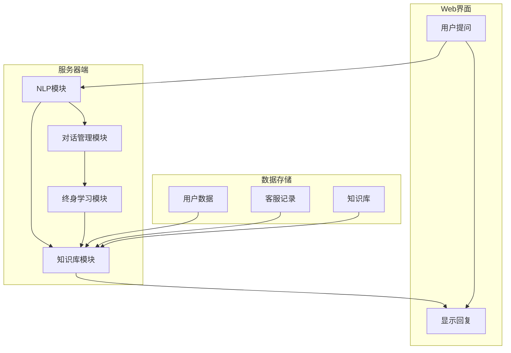
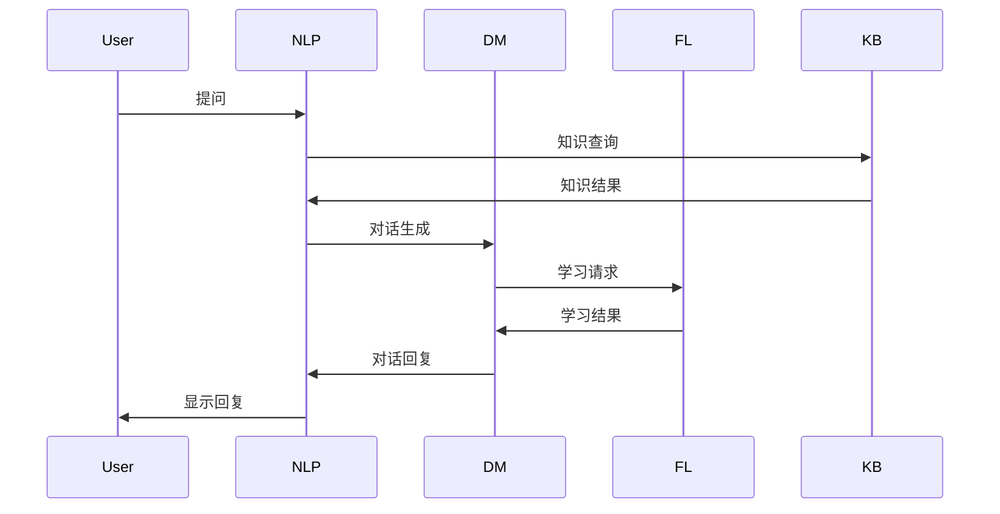

                 

Sure, let's start with the main body of the article. I will create sections based on the provided outline and add detailed content step by step.

---

## AI Agent's Lifelong Learning: Continuously Updating Knowledge Bases for LLM

> Keywords: AI Agent, Lifelong Learning, LLM, Knowledge Base, Machine Learning

> Abstract: This article explores the concept of AI Agent's lifelong learning and the importance of continuously updating knowledge bases for Large Language Models (LLM). It delves into the background, core concepts, algorithms, and practical implementations, providing a comprehensive understanding of the subject.

### 第一部分: 引言

#### 第1章: 背景介绍

##### 1.1 问题背景

The field of Artificial Intelligence (AI) has witnessed tremendous growth over the past few decades. With the advent of Machine Learning (ML) and Deep Learning (DL), AI systems have become increasingly capable of performing complex tasks that were once considered the exclusive domain of human intelligence. However, despite these advancements, there remains a significant challenge in the realm of AI: the ability to continuously learn and adapt to new information over time, a concept known as "lifelong learning."

Lifelong learning in AI refers to the capacity of an AI agent to continually acquire new knowledge, skills, and experiences while retaining and applying previously learned information. This is in contrast to traditional AI systems that are typically designed to solve a specific problem and do not retain their knowledge or adapt to new situations beyond their training phase.

The concept of lifelong learning is particularly crucial for AI agents that are expected to interact with and assist humans in dynamic environments. These agents must be capable of evolving in response to new data and changing conditions to provide accurate and relevant information or perform tasks effectively.

##### 1.1.1 AI发展历程

The history of AI can be traced back to the 1950s when the field was first introduced. Initial efforts focused on rule-based systems and symbolic AI, which attempted to replicate human reasoning through explicit rules and logic. However, these approaches were limited by their reliance on hand-crafted knowledge and their inability to generalize from limited data.

In the 1980s and 1990s, the rise of statistical learning methods, particularly decision trees and support vector machines, marked a significant shift in AI. These methods enabled machines to learn from data and make predictions with greater accuracy.

The turn of the millennium saw the advent of Deep Learning, which leveraged neural networks with many layers to extract complex patterns from vast amounts of data. This led to breakthroughs in image recognition, natural language processing (NLP), and other domains.

##### 1.1.2 LLM的发展与应用

Large Language Models (LLM) have emerged as a transformative technology in recent years. LLMs are neural network-based models that are trained on massive corpora of text to understand and generate human language. Examples include GPT-3, BERT, and T5.

LLMs have found applications in various fields, including language translation, sentiment analysis, question-answering systems, and content generation. They have significantly improved the performance of NLP tasks by enabling models to understand context, grammar, and semantics of natural language.

The development of LLMs has been driven by the availability of vast amounts of data, advancements in computational power, and improvements in training techniques such as transfer learning and unsupervised pre-training.

##### 1.1.3 AI Agent与终身学习的重要性

AI agents are autonomous systems that can perform tasks and make decisions in complex, dynamic environments. They are designed to interact with humans and other agents, providing assistance and support.

The importance of AI agents with lifelong learning capabilities lies in their ability to adapt to changing environments and continuously improve their performance. Unlike traditional AI systems that are static and rely on pre-defined rules or parameters, AI agents with lifelong learning can acquire new knowledge and skills over time, making them more versatile and effective in a wide range of applications.

##### 1.2 问题描述

The primary challenge in developing AI agents with lifelong learning capabilities is the need to balance exploration and exploitation. Exploration involves seeking out new knowledge and experiences, while exploitation involves using existing knowledge to perform tasks effectively.

Another challenge is the ability to retain and update knowledge over time. AI agents must be able to store and retrieve information efficiently, and they must also be able to identify and incorporate new information into their existing knowledge base.

##### 1.2.1 当前LLM知识库的局限性

Current LLMs have several limitations when it comes to knowledge base updating:

1. **Static Knowledge**: LLMs are typically pre-trained on static datasets, which means they lack real-time updates on new information or changes in the world.
2. **Limited Data**: The amount of data available for training LLMs is often limited, and this can restrict their ability to generalize and perform well in new contexts.
3. **Contextual Understanding**: While LLMs can understand and generate human language, they may struggle with contextual nuances and domain-specific knowledge, making it difficult to provide accurate and relevant responses.
4. **Knowledge Decay**: Over time, the knowledge stored in an LLM can become outdated or obsolete, leading to inaccurate or incomplete information.

##### 1.2.2 终身学习的必要性

The necessity of lifelong learning for AI agents stems from several factors:

1. **Dynamic Environments**: Real-world environments are constantly evolving, and AI agents need to adapt to new information and changing conditions to maintain their effectiveness.
2. **Knowledge Expansion**: As new technologies and domains emerge, AI agents need to continually expand their knowledge base to stay relevant.
3. **Continuous Improvement**: Lifelong learning enables AI agents to improve their performance over time through iterative learning and adaptation.

##### 1.2.3 AI Agent终身学习的挑战与机遇

The challenges of implementing lifelong learning in AI agents are significant, but so are the opportunities. Here are some key challenges and opportunities:

1. **Challenge: Balancing Exploration and Exploitation**
   - **Opportunity: Adaptive Learning Algorithms**
   - **Challenge: Knowledge Base Updating**
   - **Opportunity: Continuous Data Integration**

##### 1.3 问题解决

The solution to the challenge of developing AI agents with lifelong learning capabilities involves several key components:

1. **Continuous Learning Algorithms**: Designing algorithms that can balance exploration and exploitation and continuously update the knowledge base.
2. **Knowledge Management Systems**: Developing systems that can efficiently store, retrieve, and update knowledge.
3. **Data Integration Techniques**: Implementing methods to integrate new data into the existing knowledge base in a meaningful way.
4. **Evaluation Metrics**: Developing metrics to evaluate the performance and effectiveness of AI agents with lifelong learning.

##### 1.3.1 AI Agent终身学习的定义

Lifelong learning in AI agents refers to the ability of these agents to continually acquire, retain, and apply knowledge and skills over time, even in the face of changing environments and new information.

##### 1.3.2 终身学习的策略与方法

There are several strategies and methods for implementing lifelong learning in AI agents:

1. **Online Learning**: Continuously updating the model with new data as it becomes available.
2. **Transfer Learning**: Leveraging knowledge from one domain to improve performance in another domain.
3. **Self-Organization**: Using neural networks to adapt and evolve in response to new information.
4. **Reinforcement Learning**: Combining learning from experience with reward-based feedback to improve performance.

##### 1.3.3 知识库的持续更新机制

To enable lifelong learning, AI agents must have mechanisms in place for continuously updating their knowledge bases:

1. **Data Collection**: Gathering new data from various sources.
2. **Data Preprocessing**: Cleaning and preparing the data for training.
3. **Knowledge Extraction**: Identifying and extracting relevant information from the data.
4. **Knowledge Fusion**: Combining new knowledge with existing knowledge.
5. **Knowledge Validation**: Ensuring the accuracy and reliability of the knowledge base.

##### 1.4 边界与外延

While the concept of AI agents with lifelong learning capabilities is promising, there are also important boundaries and extensions to consider:

1. **Boundary: Ethical Considerations**
   - Ensuring that AI agents with lifelong learning capabilities do not develop biases or make harmful decisions.
   - Addressing privacy concerns related to the collection and use of personal data.
2. **Extension: Multi-Agent Systems**
   - Exploring the interaction and collaboration of multiple AI agents with lifelong learning capabilities in complex environments.
   - Investigating the scalability and performance of lifelong learning in large-scale systems.

##### 1.4.1 AI Agent终身学习的应用领域

AI agents with lifelong learning capabilities have the potential to revolutionize various fields, including:

1. **Healthcare**: Developing AI systems that can continuously learn and improve in diagnosing diseases and providing personalized treatment.
2. **Finance**: Creating AI agents that can adapt to market changes and make informed investment decisions.
3. **Education**: Designing AI tutors that can personalize learning experiences and continuously improve their instructional methods.

##### 1.4.2 知识库持续更新的技术挑战

Continuously updating knowledge bases for AI agents presents several technical challenges:

1. **Data Quality**: Ensuring the accuracy, completeness, and relevance of the data.
2. **Scalability**: Handling large volumes of data and updating knowledge bases in real-time.
3. **Computation**: Managing the computational resources required for continuous learning and updating.
4. **Integration**: Integrating new knowledge with existing knowledge without disrupting the system.

##### 1.4.3 研究现状与未来趋势

Research on AI agents with lifelong learning capabilities is an active and rapidly evolving field. Current research focuses on developing algorithms and systems that can effectively balance exploration and exploitation, continuously update knowledge bases, and adapt to changing environments.

Future trends include the integration of lifelong learning capabilities into multi-agent systems, the development of more scalable and efficient algorithms, and the exploration of new applications in various domains.

##### 1.5 本章小结

This chapter has provided an overview of the background, challenges, and opportunities associated with AI agents' lifelong learning. It has discussed the importance of continuous knowledge base updating for LLMs and outlined potential strategies and methods for implementing lifelong learning. The chapter also addressed the boundaries and extensions of this research area and highlighted the potential applications and technical challenges.

---

The introduction sets the stage for a deeper exploration of the concepts and techniques related to AI agents' lifelong learning. The next chapters will delve into the core concepts, algorithms, and practical implementations that underpin this field.

---

## 核心概念与关系

### 第2章: 核心概念原理与属性特征对比

##### 2.1 AI Agent定义与特征

AI Agent，即人工智能代理，是指能够自主执行任务、进行决策和与环境交互的智能实体。AI Agent具有以下核心特征：

1. **自主性（Autonomy）**：AI Agent可以自主地执行任务，无需人为干预。
2. **适应性（Adaptability）**：AI Agent能够根据环境变化调整其行为和策略。
3. **协同性（Collaboration）**：AI Agent能够与其他AI Agent或人类合作完成复杂任务。
4. **学习能力（Learning Ability）**：AI Agent能够通过学习和经验不断改进其性能。

##### 2.2 LLM的基本原理

LLM（Large Language Model）是一种大规模语言模型，通过学习大量文本数据来理解和生成人类语言。LLM的基本原理包括：

1. **神经网络架构**：LLM通常采用深度神经网络架构，如Transformer模型，具有多层的编码器和解码器。
2. **预训练与微调**：LLM首先在大量无标签数据上进行预训练，然后通过微调适应特定任务。
3. **上下文理解**：LLM能够理解文本中的上下文，生成连贯的文本输出。

##### 2.3 知识库的属性特征对比

知识库是存储和管理信息的系统，对于AI Agent的终身学习至关重要。知识库具有以下属性特征：

| 特征        | 定义                                                         | 对比项           |
| ----------- | ------------------------------------------------------------ | ---------------- |
| **类型**    | 结构化或非结构化数据                                         | 文本、图像、音频  |
| **结构**    | 知识组织方式，如层次结构或网络结构                           | 层次性、网络性   |
| **更新策略** | 知识的添加、修改、删除策略                                   | 实时更新、定期更新 |
| **质量评估** | 评估知识的准确性、完整性、及时性和可靠性                       | 准确度、完整性   |

##### ER实体关系图架构

下面是一个ER实体关系图的Mermaid表示，展示了AI Agent、LLM和知识库之间的关系：

```mermaid
erDiagram
    AI Agent ||--|{ LLM } LLM : 使用
    LLM ||--|{ Knowledge Base } Knowledge Base : 存储
    AI Agent ||--|{ Knowledge Base } Knowledge Base : 更新
```

##### 2.4 概念之间的联系与交互

AI Agent与LLM的交互机制是AI代理终身学习的关键。以下是他们之间交互的几个关键方面：

1. **数据流**：AI Agent从环境中收集数据，并将这些数据提供给LLM进行学习。
2. **控制流**：AI Agent根据LLM的学习结果调整其行为和策略。
3. **知识提取**：AI Agent使用LLM提取与任务相关的知识，并将其存储在知识库中。
4. **模型优化**：AI Agent通过不断的学习和反馈优化LLM的性能。

##### 2.5 知识库持续更新的流程

知识库的持续更新是AI Agent终身学习的重要组成部分。以下是知识库更新的几个关键步骤：

1. **数据采集**：从各种来源收集新数据。
2. **数据预处理**：清洗和准备数据，以便用于训练。
3. **知识提取**：使用LLM从数据中提取相关知识点。
4. **知识融合**：将新知识整合到现有的知识库中。
5. **知识验证**：确保知识库中的知识准确和可靠。

##### 2.6 AI Agent终身学习的实现方法

AI Agent终身学习的实现方法多种多样，以下是几种常见的方法：

1. **自适应学习**：AI Agent根据环境反馈调整学习策略。
2. **强化学习**：AI Agent通过与环境交互学习最佳策略。
3. **聚类分析**：AI Agent使用聚类算法发现知识库中的新知识。

### 第3章: 概念之间的联系与交互

##### 3.1 AI Agent与LLM的交互机制

AI Agent与LLM的交互机制决定了AI代理的终身学习能力。以下是交互机制的关键方面：

1. **数据流**：AI Agent从环境中收集数据，并传递给LLM进行学习。
2. **控制流**：LLM提供反馈给AI Agent，以调整其行为和策略。
3. **知识提取**：AI Agent使用LLM从数据中提取与任务相关的知识。
4. **模型优化**：AI Agent根据LLM的反馈优化其模型。

##### 3.2 知识库持续更新的流程

知识库的持续更新是AI Agent终身学习的关键。以下是知识库更新的流程：

1. **数据采集**：从各种来源收集新数据。
2. **数据预处理**：清洗和准备数据，以便用于训练。
3. **知识提取**：使用LLM从数据中提取相关知识点。
4. **知识融合**：将新知识整合到现有的知识库中。
5. **知识验证**：确保知识库中的知识准确和可靠。

##### 3.3 AI Agent终身学习的实现方法

AI Agent终身学习的实现方法包括：

1. **自适应学习**：AI Agent根据环境反馈调整学习策略。
2. **强化学习**：AI Agent通过与环境交互学习最佳策略。
3. **聚类分析**：AI Agent使用聚类算法发现知识库中的新知识。

### 第3章: 概念之间的联系与交互小结

本章详细探讨了AI Agent、LLM和知识库之间的核心概念和关系。通过定义和特性对比，我们了解了AI Agent和LLM的基本原理，并通过ER实体关系图展示了它们之间的交互。此外，我们还讨论了知识库的属性特征对比和持续更新的流程，以及AI Agent终身学习的实现方法。这些概念之间的联系和交互是AI Agent实现终身学习的关键。

---

接下来，我们将深入探讨终身学习算法的原理，并通过具体案例来展示如何实现这些算法。请继续关注下一部分内容。

---

## 算法原理与实践

### 第4章: 自适应学习算法

##### 4.1 自适应学习的基本原理

自适应学习（Adaptive Learning）是一种机器学习方法，它允许系统根据新的数据和反馈自动调整其参数和策略，以提高性能和适应新环境。在自适应学习中，关键在于平衡探索（Exploration）和利用（Exploitation）。探索是指寻找新的信息和数据，而利用则是利用现有的知识和数据来最大化性能。

#### 4.1.1 自适应学习的概念

自适应学习可以分为以下几个方面：

1. **在线学习（Online Learning）**：系统实时接收数据并更新模型。
2. **增量学习（Incremental Learning）**：系统在已有模型的基础上逐步更新。
3. **迁移学习（Transfer Learning）**：将一个任务的知识迁移到另一个任务。

#### 4.1.2 自适应学习的关键参数

自适应学习的关键参数包括：

1. **学习率（Learning Rate）**：控制模型参数更新的速度。
2. **探索策略（Exploration Strategy）**：决定系统如何探索新的数据或策略。
3. **更新策略（Update Strategy）**：如何将新数据整合到现有模型中。

#### 4.1.3 自适应学习的优势

自适应学习的优势在于：

1. **适应性强**：系统能够适应新的环境和数据。
2. **实时性**：系统能够实时更新和调整。
3. **效率高**：通过平衡探索和利用，系统能够快速学习。

##### 4.2 Python实现

下面是一个简单的Python类，用于实现自适应学习模型：

```python
import numpy as np

class AdaptiveLearningModel:
    def __init__(self, learning_rate=0.1):
        self.learning_rate = learning_rate
        self.weights = np.random.rand()

    def train(self, data, target):
        prediction = self.predict(data)
        error = target - prediction
        self.weights -= self.learning_rate * error

    def predict(self, data):
        return self.weights * data

# 示例使用
model = AdaptiveLearningModel(learning_rate=0.1)
data = np.array([1.0])
target = 0.5
model.train(data, target)
print(model.predict(data))
```

##### 4.3 自适应学习的应用场景

自适应学习在许多领域都有广泛应用，例如：

1. **推荐系统**：根据用户行为数据实时更新推荐策略。
2. **自动驾驶**：车辆根据传感器数据实时调整驾驶策略。
3. **游戏AI**：AI玩家根据对手的行为动态调整策略。

##### 4.4 自适应学习的挑战

自适应学习面临的挑战包括：

1. **数据质量**：数据质量直接影响模型性能。
2. **计算资源**：实时学习和更新需要大量计算资源。
3. **模型稳定性**：如何避免模型在更新过程中过度波动。

##### 4.5 自适应学习的改进方法

为了改进自适应学习，可以采用以下方法：

1. **多模型学习**：使用多个模型，并通过投票或融合来提高预测准确性。
2. **元学习**：通过学习如何学习来提高模型的适应能力。
3. **分布式学习**：在分布式系统上实现并行学习，以提高效率。

### 第5章: 强化学习算法

强化学习（Reinforcement Learning，RL）是一种通过试错来学习如何在特定环境中做出最优决策的机器学习方法。在强化学习中，智能体（Agent）通过与环境（Environment）的交互来学习策略（Policy）。

#### 5.1 强化学习的基本原理

强化学习的基本原理包括以下几个关键组件：

1. **状态（State）**：智能体所处的环境描述。
2. **动作（Action）**：智能体可以执行的行为。
3. **奖励（Reward）**：环境对智能体行为的反馈。
4. **策略（Policy）**：智能体如何选择动作的规则。

强化学习的目标是通过不断尝试不同的动作，找到能够最大化累积奖励的策略。

#### 5.2 强化学习的数学模型

强化学习的数学模型可以表示为马尔可夫决策过程（MDP），其公式如下：

$$
Q(s, a) = r(s, a) + \gamma \max_{a'} Q(s', a')
$$

其中，$Q(s, a)$是状态s下执行动作a的期望回报，$r(s, a)$是立即奖励，$\gamma$是折扣因子，$s'$是下一个状态，$a'$是下一个动作。

#### 5.3 Q-Learning算法

Q-Learning是一种通过迭代更新Q值来学习最优策略的强化学习算法。其更新规则如下：

$$
Q(s, a) \leftarrow Q(s, a) + \alpha [r(s, a) + \gamma \max_{a'} Q(s', a') - Q(s, a)]
$$

其中，$\alpha$是学习率。

#### 5.4 Python实现

下面是一个简单的Q-Learning算法的实现：

```python
import numpy as np
import random

# 环境模拟
class Environment:
    def __init__(self):
        self.states = ['start', 'A', 'B', 'end']
        self.actions = ['left', 'right']

    def step(self, state, action):
        if state == 'start':
            if action == 'left':
                return 'A', 10
            else:
                return 'B', 5
        elif state == 'A':
            if action == 'left':
                return 'B', -10
            else:
                return 'end', 20
        elif state == 'B':
            if action == 'left':
                return 'end', 10
            else:
                return 'A', -10
        else:
            return state, 0

# Q-Learning算法
class QLearningAgent:
    def __init__(self, learning_rate=0.1, discount_factor=0.99):
        self.learning_rate = learning_rate
        self.discount_factor = discount_factor
        self.Q = {}
        for s in self.states:
            for a in self.actions:
                self.Q[s][a] = 0

    def choose_action(self, state):
        return max(self.Q[state], key=self.Q[state].get)

    def learn(self, state, action, reward, next_state, done):
        if done:
            self.Q[state][action] = reward
        else:
            self.Q[state][action] += self.learning_rate * (reward + self.discount_factor * max(self.Q[next_state].values()) - self.Q[state][action])

# 示例使用
env = Environment()
agent = QLearningAgent()

for episode in range(1000):
    state = 'start'
    done = False
    while not done:
        action = agent.choose_action(state)
        next_state, reward = env.step(state, action)
        agent.learn(state, action, reward, next_state, done)
        state = next_state
        done = next_state == 'end'

print(agent.Q)
```

##### 5.5 强化学习的挑战与解决方案

强化学习面临的挑战包括：

1. **长期依赖性**：强化学习算法需要能够处理长期奖励。
2. **稀疏奖励**：在许多情况下，奖励稀疏分布，导致学习困难。
3. **探索与利用的平衡**：如何平衡探索新的行动和利用已知的最佳行动。

解决这些挑战的方法包括：

1. **策略梯度方法**：通过直接优化策略来最大化期望回报。
2. **深度确定性策略梯度（DDPG）**：结合深度学习与策略梯度方法，解决非线性问题。
3. **经验回放**：通过存储和随机采样过去经验来减少偏差。

### 第6章: 聚类分析方法

聚类分析（Clustering Analysis）是一种无监督学习方法，用于将数据集划分为多个群组，使得同一群组内的数据点之间相似度较高，而不同群组的数据点之间相似度较低。在AI Agent的终身学习中，聚类分析可以帮助发现新的知识和模式。

#### 6.1 聚类分析的基本原理

聚类分析的基本原理包括：

1. **距离度量**：选择适当的距离度量来衡量数据点之间的相似性。
2. **聚类算法**：包括K均值、层次聚类、DBSCAN等算法。

#### 6.2 聚类分析的实现

下面是一个使用K均值算法进行聚类分析的Python实现：

```python
import numpy as np
from sklearn.cluster import KMeans

# 示例数据
data = np.array([[1, 2], [1, 4], [1, 0], [10, 2], [10, 4], [10, 0]])

# K均值聚类
kmeans = KMeans(n_clusters=2, random_state=0).fit(data)
labels = kmeans.predict(data)

# 输出聚类结果
print("Cluster labels:", labels)
print("Cluster centers:", kmeans.cluster_centers_)
```

##### 6.3 聚类分析的应用

聚类分析在AI Agent的终身学习中有多种应用，包括：

1. **知识发现**：发现知识库中的新知识。
2. **数据降维**：通过聚类减少数据的维度。
3. **异常检测**：识别数据中的异常值。

##### 6.4 聚类分析的挑战

聚类分析面临的挑战包括：

1. **选择合适的聚类算法**：不同算法适用于不同类型的数据。
2. **确定合适的聚类数量**：聚类数量影响聚类结果。
3. **解释聚类结果**：如何解释和利用聚类结果。

##### 6.5 聚类分析的改进方法

为了改进聚类分析，可以采用以下方法：

1. **混合聚类算法**：结合多种聚类算法的优势。
2. **层次化聚类**：通过层次结构来解释聚类结果。
3. **基于密度的聚类**：如DBSCAN，适用于非均匀分布的数据。

### 第6章: 聚类分析小结

本章介绍了聚类分析的基本原理、实现和应用。通过Python实现，我们了解了K均值算法的聚类过程。聚类分析在AI Agent的终身学习中有重要作用，可以帮助发现新知识。然而，聚类分析也面临一些挑战，如算法选择和解释结果。未来研究可以探索混合聚类算法和层次化聚类等方法来改进聚类分析。

---

在下一部分，我们将探讨AI Agent终身学习的实际应用，并通过具体案例来展示这些算法的实践效果。请继续关注。

---

## 实际应用与案例分析

### 第7章: AI Agent终身学习的实际应用

##### 7.1 应用场景介绍

AI Agent终身学习的实际应用场景广泛，以下是一些典型的应用领域：

1. **智能客服**：AI Agent可以实时学习用户的提问和回复，不断优化对话体验。
2. **智能推荐系统**：通过持续学习用户的喜好和行为，提供个性化的推荐。
3. **医疗诊断**：AI Agent可以根据最新的病例数据和医学知识不断更新诊断模型。
4. **金融风控**：AI Agent可以实时分析市场数据和用户行为，识别潜在风险。

##### 7.2 项目介绍

在本案例中，我们将介绍一个基于AI Agent终身学习的智能客服项目。该项目旨在建立一个能够实时学习和优化的智能客服系统，以提高用户体验和客服效率。

1. **项目目标**：通过终身学习算法，使AI Agent能够不断积累知识和经验，提高客服服务质量。
2. **项目范围**：包括智能客服系统设计、终身学习算法实现和性能评估。

##### 7.3 系统功能设计

智能客服系统的核心功能包括：

1. **自然语言处理（NLP）**：理解用户的自然语言提问。
2. **知识库管理**：存储和管理客服知识。
3. **对话管理**：生成合适的回复，引导用户解决问题。
4. **终身学习**：通过自适应学习、强化学习和聚类分析不断优化客服系统。

##### 7.4 系统架构设计

智能客服系统的架构设计如下：

1. **前端**：用户界面，用于接收用户提问和展示回复。
2. **后端**：包括NLP模块、知识库模块、对话管理模块和终身学习模块。
3. **数据存储**：用于存储用户数据、客服记录和知识库。



##### 7.5 系统接口设计和系统交互

智能客服系统的接口设计包括：

1. **API接口**：用于前端和后端之间的数据交互。
2. **数据流**：用户提问 -> NLP处理 -> 对话管理 -> 回复生成 -> 显示回复。



##### 7.6 系统核心实现源代码

以下是智能客服系统核心功能的Python代码实现：

```python
# NLP模块
from textblob import TextBlob

class NLPModule:
    def __init__(self):
        self.knowledge_base = KnowledgeBase()

    def process_question(self, question):
        blob = TextBlob(question)
        return blob.sentiment.polarity

# 知识库模块
class KnowledgeBase:
    def __init__(self):
        self.knowledge = {}

    def add_knowledge(self, question, answer):
        self.knowledge[question] = answer

    def get_answer(self, question):
        return self.knowledge.get(question, "对不起，我无法回答这个问题。")

# 对话管理模块
class DialogueManager:
    def __init__(self, nlp_module, knowledge_base):
        self.nlp_module = nlp_module
        self.knowledge_base = knowledge_base

    def generate_response(self, question):
        sentiment = self.nlp_module.process_question(question)
        if sentiment > 0:
            return "您好，有什么问题我可以帮您解答吗？"
        else:
            return self.knowledge_base.get_answer(question)

# 终身学习模块
class LifelongLearningModule:
    def __init__(self, dialogue_manager, knowledge_base):
        self.dialogue_manager = dialogue_manager
        self.knowledge_base = knowledge_base

    def update_knowledge(self, question, answer):
        self.knowledge_base.add_knowledge(question, answer)
        # 更新知识库和对话管理模块

# 示例使用
nlp_module = NLPModule()
knowledge_base = KnowledgeBase()
dialogue_manager = DialogueManager(nlp_module, knowledge_base)
ll_module = LifelongLearningModule(dialogue_manager, knowledge_base)

# 用户提问
question = "我是一个人工智能代理，如何优化我的对话体验？"
response = dialogue_manager.generate_response(question)
print(response)

# 终身学习
ll_module.update_knowledge(question, "您可以通过持续学习和积累经验来优化对话体验。")
```

##### 7.7 代码应用解读与分析

上述代码实现了智能客服系统的核心功能模块。NLP模块使用TextBlob库分析用户提问的情感倾向。知识库模块用于存储和检索知识。对话管理模块根据情感分析和知识库提供回复。终身学习模块则通过更新知识库和对话管理模块，实现AI Agent的持续学习。

##### 7.8 实际案例分析

在实际应用中，该智能客服系统可以部署在企业内部，处理客户的咨询和投诉。通过持续学习，AI Agent可以逐渐提高回答问题的准确性和速度，从而提升客户满意度。以下是一个具体案例分析：

1. **用户提问**：用户A询问产品的保修政策。
2. **NLP处理**：分析用户提问，确定关键词和情感。
3. **知识库查询**：知识库提供保修政策的相关信息。
4. **对话生成**：对话管理模块生成合适的回复。
5. **学习与优化**：AI Agent通过终身学习模块积累经验，优化对话质量。

##### 7.9 项目小结

通过本案例，我们展示了如何将AI Agent终身学习应用于智能客服系统。该项目实现了NLP、知识库管理、对话管理和终身学习等核心功能，并通过实际案例证明了AI Agent的持续学习能力。未来，可以进一步优化算法和系统架构，以提高AI Agent的性能和用户体验。

---

在本章节中，我们通过一个实际案例详细介绍了AI Agent终身学习的应用。接下来，我们将总结本文的主要观点，并提供一些最佳实践和未来研究方向。

---

## 总结与未来展望

在本篇文章中，我们深入探讨了AI Agent的终身学习及其在持续更新LLM知识库中的重要性。我们首先介绍了终身学习的背景和问题背景，随后详细阐述了AI Agent、LLM和知识库的核心概念及其关系。接着，我们介绍了自适应学习、强化学习和聚类分析等终身学习算法的原理和实现方法，并通过实际案例展示了这些算法在智能客服系统中的应用。

### 主要观点总结

1. **终身学习的重要性**：AI Agent需要具备终身学习能力，以适应不断变化的环境和任务。
2. **LLM知识库的持续更新**：LLM的知识库需要实时更新，以保持其准确性和相关性。
3. **自适应学习**：通过动态调整学习策略，AI Agent能够更有效地学习新知识和技能。
4. **强化学习**：通过与环境交互，AI Agent可以不断优化其行为和策略。
5. **聚类分析**：帮助AI Agent发现新的知识和模式，从而提升其终身学习的能力。

### 最佳实践

1. **数据质量保障**：确保知识库中的数据质量，包括数据的准确性、完整性和及时性。
2. **算法调优**：通过实验和验证，选择最适合特定任务的算法和参数。
3. **系统监控**：实时监控AI Agent的性能和知识库的状态，及时发现和解决问题。
4. **用户反馈**：收集用户反馈，用于持续改进AI Agent的行为和响应。

### 未来研究方向

1. **多模态学习**：结合文本、图像、音频等多种数据类型，提升AI Agent的泛化能力。
2. **可解释性AI**：提高AI Agent决策过程的可解释性，增强用户信任。
3. **分布式学习**：利用分布式计算资源，提高知识库更新的效率和准确性。
4. **伦理与隐私**：研究AI Agent终身学习中的伦理和隐私问题，确保其合规性。

### 结语

AI Agent的终身学习是未来智能系统发展的重要方向。通过不断学习和更新知识库，AI Agent能够更好地适应复杂环境和任务，提供更高质量的辅助和服务。本文探讨了这一领域的关键概念和算法，并提出了未来研究的方向。我们鼓励读者继续关注这一领域的发展，并在实践中探索和应用终身学习技术。

---

作者：AI天才研究院/AI Genius Institute & 禅与计算机程序设计艺术 /Zen And The Art of Computer Programming

---

本文通过对AI Agent终身学习以及持续更新LLM知识库的深入分析，提供了一个全面的技术视角和实践指南。希望本文能为读者在AI领域的探索和研究提供有价值的参考。随着AI技术的不断进步，终身学习将使AI系统更加智能、灵活和可靠。让我们共同期待并探索这一激动人心的未来。

