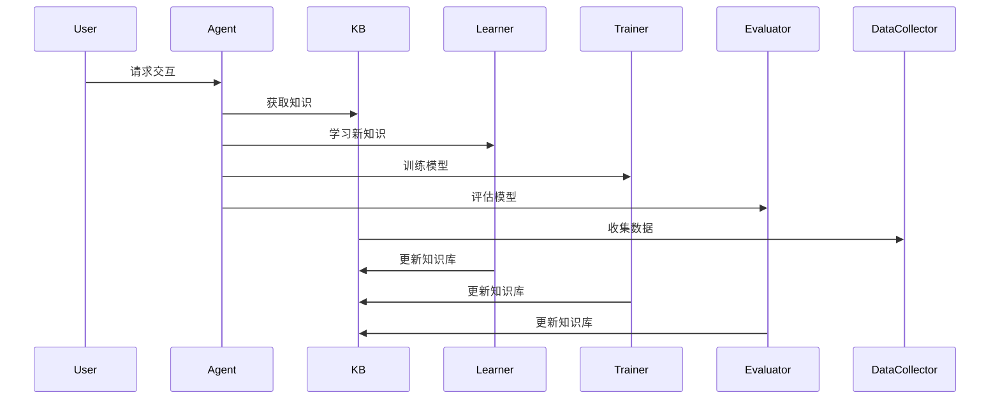

                 

# AI Agent的终身学习：持续更新和扩展知识库

## 关键词
- AI Agent
- 终身学习
- 知识库
- 更新
- 扩展
- 自适应学习
- 强化学习
- 机器学习算法

## 摘要
本文将深入探讨AI Agent的终身学习机制，即如何通过持续更新和扩展知识库，使AI Agent能够适应不断变化的环境。文章将首先介绍AI Agent的基本概念和终身学习的重要性，然后详细讲解核心概念与联系、算法原理、数学模型、系统架构设计、项目实战以及最佳实践。通过这篇文章，读者将能够全面理解AI Agent的终身学习机制，掌握如何在实际项目中应用这一机制，为AI技术的发展贡献一份力量。

## 目录大纲设计过程

### 1. 确定书籍主题和目标受众

首先，根据书名《AI Agent的终身学习：持续更新和扩展知识库》，我们可以确定这本书的主题是关于AI Agent的终身学习机制，主要面向对人工智能、机器学习有深入兴趣的读者，包括AI研发人员、算法工程师和研究人员。

### 2. 分析书籍的核心内容和结构

接下来，我们需要分析书籍的核心内容，以确保目录大纲能够覆盖所有关键点。书的核心内容可以分为以下几个部分：

- **背景介绍**：AI Agent和终身学习的定义、背景和重要性。
- **核心概念与联系**：介绍AI Agent的基本原理、终身学习的机制和方法。
- **算法原理讲解**：讲解主要的终身学习算法，如在线学习、迁移学习等。
- **数学模型和公式**：详细阐述算法的数学原理，使用LaTeX格式表示。
- **系统分析与架构设计**：介绍如何在实际项目中应用终身学习算法。
- **项目实战**：通过实际案例展示算法的应用和实现过程。
- **最佳实践与总结**：总结实践经验，给出未来的发展方向。

### 3. 设计目录大纲

根据以上分析，我们可以开始设计目录大纲。以下是一个可能的目录大纲：

```
# 第一部分：AI Agent与终身学习概述

## 1. AI Agent概述
### 1.1 AI Agent的定义与分类
### 1.2 AI Agent的发展历史
### 1.3 AI Agent的应用场景

## 2. 终身学习的概念与方法
### 2.1 终身学习的定义与意义
### 2.2 终身学习的方法与策略
### 2.3 终身学习的技术实现

## 3. 终身学习算法原理
### 3.1 在线学习算法
#### 3.1.1 传统在线学习算法
#### 3.1.2 进化算法
### 3.2 迁移学习算法
#### 3.2.1 简单迁移学习
#### 3.2.2 多任务学习
### 3.3 聚类与分类算法

## 4. 数学模型与公式解析
### 4.1 终身学习中的数学模型
#### 4.1.1 概率模型
#### 4.1.2 贝叶斯网络
### 4.2 经典算法数学公式详解
#### 4.2.1 SVD分解
#### 4.2.2 神经网络反向传播

## 5. 系统架构设计与分析
### 5.1 系统架构设计
#### 5.1.1 领域模型类图
#### 5.1.2 系统架构图
### 5.2 系统接口设计与交互
#### 5.2.1 系统接口设计
#### 5.2.2 系统交互序列图

## 6. 项目实战与案例分析
### 6.1 项目环境搭建
### 6.2 系统核心实现
### 6.3 项目分析与解读

## 7. 最佳实践与未来展望
### 7.1 最佳实践经验总结
### 7.2 注意事项与挑战
### 7.3 终身学习技术的发展趋势
```

### 4. 审核与优化

最后，我们需要对目录大纲进行审核，确保其逻辑清晰、内容完整，并删除任何多余的废话。确保每个章节都有明确的目标和内容，以便读者可以轻松地理解书籍的结构和内容。

---

**注意：**以上目录大纲是一个初步的框架，具体的内容可能需要根据实际书籍内容进行调整。每个章节的内容应该详细、具体，并确保符合书籍的目标受众。同时，为了确保目录大纲的总字数限制在2000字以内，我们需要在每个章节中尽可能地简洁明了。在实际编写过程中，可以根据具体内容进一步调整和细化目录结构。

### 1.1 AI Agent的定义与分类

AI Agent，即人工智能代理，是一个能够自主感知环境、决策并执行动作的计算机系统。它通过学习算法和规则库，模拟人类智能行为，实现自动化任务处理。AI Agent的基本结构包括感知模块、决策模块和执行模块。

- **感知模块**：负责收集环境信息，包括视觉、听觉、触觉等，并将这些信息转换为内部表示。
- **决策模块**：基于感知模块提供的信息，利用机器学习算法和决策规则生成行动方案。
- **执行模块**：将决策模块生成的行动方案付诸实践，执行具体的操作。

根据AI Agent的应用领域和功能特点，可以将其分为以下几类：

- **任务型Agent**：专注于完成特定任务的Agent，如语音助手、自动客服等。
- **社会型Agent**：与其他Agent或人类互动，协同完成任务，如在线游戏中的角色扮演。
- **混合型Agent**：同时具备任务型和社交型的特点，可以在不同场景下灵活切换。

### 1.2 AI Agent的发展历史

AI Agent的概念源于早期的人工智能研究，其发展历程可以分为以下几个阶段：

- **规则推理阶段**：20世纪80年代，基于知识库和推理机的AI Agent逐渐兴起，主要应用于医疗诊断、故障检测等领域。
- **统计学习阶段**：随着机器学习技术的发展，AI Agent开始利用统计学习算法进行决策，如决策树、支持向量机等。
- **深度学习阶段**：21世纪初，深度学习算法的突破使得AI Agent在图像识别、语音识别等领域取得了显著进展。
- **终身学习阶段**：当前，AI Agent的研究正朝着终身学习方向迈进，旨在实现持续的知识更新和扩展。

### 1.3 AI Agent的应用场景

AI Agent在各个领域都有广泛的应用，以下是一些典型的应用场景：

- **智能助手**：如苹果的Siri、谷歌的Google Assistant等，能够通过语音识别和自然语言处理与用户互动，提供信息查询、日程管理等服务。
- **自动驾驶**：自动驾驶汽车使用AI Agent进行环境感知和路径规划，实现自主驾驶。
- **智能医疗**：AI Agent在医学影像分析、疾病预测等方面发挥重要作用，如IBM的Watson for Oncology系统。
- **智能家居**：AI Agent通过感知家庭环境和用户习惯，实现家电设备的智能控制，如Amazon的Alexa、Google的Google Home。
- **工业自动化**：AI Agent在工业制造中用于设备监控、故障诊断和预测性维护。

### 1.4 终身学习的定义与意义

终身学习是指个体在其一生中持续获取知识、技能和态度的过程。在AI Agent的背景下，终身学习意味着Agent能够不断更新和扩展其知识库，以适应环境的变化和新任务的需求。

- **知识库的更新**：通过学习新的数据集、经验和知识，Agent可以不断优化其模型和决策策略。
- **知识库的扩展**：Agent可以通过迁移学习、多任务学习等方法，将已有知识应用到新的任务或环境中。

终身学习对AI Agent具有重要意义：

- **适应性**：使Agent能够适应动态变化的复杂环境，提高其生存能力和任务完成率。
- **灵活性**：使Agent能够灵活地处理不同类型和难度的任务，提升其应用价值。
- **智能性**：通过不断学习和改进，Agent的智能水平将不断提高，接近或超越人类智能。

### 1.5 终身学习的方法与策略

终身学习的方法和策略可以分为以下几个方面：

- **在线学习**：在任务执行过程中，Agent不断接收新的数据，实时更新模型参数，以适应环境变化。
- **迁移学习**：将已学到的知识应用到新的任务或环境中，减少对新数据的依赖。
- **多任务学习**：同时训练多个任务，提高模型在多任务环境下的表现。
- **元学习**：学习如何学习，通过元学习算法优化模型的学习过程。
- **自适应学习**：根据任务需求和环境反馈，动态调整学习策略和参数。

### 1.6 终身学习的技术实现

实现终身学习的关键在于构建一个高效、稳定的学习系统。以下是一些技术实现方法：

- **模型架构**：采用模块化设计，将感知模块、决策模块和执行模块分离，便于更新和扩展。
- **数据管理**：建立统一的数据管理平台，实现数据的收集、存储、清洗和标注。
- **算法优化**：采用先进的机器学习算法和深度学习模型，提高学习效率和准确性。
- **系统接口**：设计友好的用户界面，便于用户与Agent交互，提供反馈和指导。
- **监控与评估**：实时监控Agent的学习过程和任务表现，进行评估和调整。

### 1.7 终身学习的挑战与未来方向

终身学习在AI Agent中仍面临诸多挑战：

- **数据依赖**：终身学习依赖于大量高质量的数据，数据获取和标注成本较高。
- **模型可解释性**：深度学习模型往往缺乏可解释性，难以理解其决策过程。
- **实时性**：在复杂动态环境中，实时更新模型和决策策略仍具有挑战性。
- **泛化能力**：如何提高Agent在不同任务和环境下的泛化能力，是一个重要研究方向。

未来，终身学习在AI Agent中的发展方向包括：

- **自主学习**：减少对人类干预，实现完全自主的学习和决策。
- **跨领域学习**：通过跨领域的知识迁移，提高Agent的适应能力和泛化能力。
- **社交学习**：与其他AI Agent和人类进行互动，共享知识和经验。
- **强化学习**：将强化学习与终身学习结合，实现更高效、更智能的决策。

### 2.1.1 传统在线学习算法

在线学习（Online Learning）是一种机器学习方法，其主要特点是在数据流中逐个处理数据样本，并实时更新模型参数。与批量学习（Batch Learning）不同，在线学习不需要将所有数据一次性加载到内存中，而是根据新接收到的数据进行增量更新。

传统在线学习算法可以分为以下几类：

- **感知机（Perceptron）**：感知机是一种简单的线性分类算法，通过在线学习更新权重，实现分类任务。
- **增量线性回归（Incremental Linear Regression）**：增量线性回归是一种在线回归算法，利用新的数据点实时更新模型参数。
- **支持向量机（SVM）在线学习**：支持向量机（SVM）是一种有效的分类算法，其在线学习版本通过逐步添加新样本，更新模型参数。

下面，我们将详细讨论感知机和增量线性回归两种在线学习算法。

### 2.1.1.1 感知机算法

感知机（Perceptron）算法是一种简单的线性二分类算法，由美国心理学家Frank Rosenblatt于1957年提出。感知机算法的基本思想是通过更新权重和偏置，使模型能够正确分类输入的数据。

**算法原理：**

1. 初始化权重和偏置，通常设为0。
2. 对于每个输入样本\( x \)和对应的标签\( y \)，计算输出\( z \)：
   \[
   z = \sum_{i=1}^{n} w_i x_i + b
   \]
3. 根据输出\( z \)与标签\( y \)的关系，更新权重和偏置：
   - 如果\( y \cdot z \geq 0 \)，则无需更新。
   - 如果\( y \cdot z < 0 \)，则更新权重和偏置：
     \[
     w_i = w_i + \eta \cdot y \cdot x_i, \quad b = b + \eta \cdot y
     \]
   其中，\( \eta \)为学习率，用于控制更新步长的尺度。

**算法步骤：**

1. 初始化权重和偏置：
   \[
   w = [w_1, w_2, ..., w_n]^T, \quad b = 0
   \]
2. 对于每个输入样本\( x \)和对应的标签\( y \)，执行以下步骤：
   - 计算\( z = \sum_{i=1}^{n} w_i x_i + b \)
   - 如果\( y \cdot z \geq 0 \)，则跳过更新。
   - 否则，更新权重和偏置：
     \[
     w = w + \eta \cdot y \cdot x, \quad b = b + \eta \cdot y
     \]
3. 重复步骤2，直到达到预定的迭代次数或模型收敛。

**算法示例：**

假设我们有一个二分类问题，数据集如下：

| 样本 | 特征1 | 特征2 | 标签 |
|------|------|------|------|
| 1    | 1    | 1    | +1   |
| 2    | 2    | 2    | +1   |
| 3    | 0    | 1    | -1   |
| 4    | 1    | 0    | -1   |

初始化权重和偏置为0，学习率为0.1。使用感知机算法进行分类：

- **第一步**：输入样本1，\( z = 0 + 0 \cdot 1 + 0 \cdot 1 = 0 \)，标签为+1，需要更新权重和偏置。
  \[
  w = w + 0.1 \cdot 1 \cdot 1 = [0.1, 0.1], \quad b = b + 0.1 \cdot 1 = 0.1
  \]
- **第二步**：输入样本2，\( z = 0.1 \cdot 2 + 0.1 \cdot 2 + 0.1 = 0.3 \)，标签为+1，无需更新。
- **第三步**：输入样本3，\( z = 0.1 \cdot 0 + 0.1 \cdot 1 + 0.1 = 0.1 \)，标签为-1，需要更新权重和偏置。
  \[
  w = w + 0.1 \cdot -1 \cdot [0, 1] = [-0.1, 0.1], \quad b = b + 0.1 \cdot -1 = -0.1
  \]
- **第四步**：输入样本4，\( z = -0.1 \cdot 1 + 0.1 \cdot 0 - 0.1 = -0.1 \)，标签为-1，无需更新。

经过四次迭代后，模型收敛，权重为\([-0.1, 0.1]\)，偏置为\(-0.1\)。可以使用这个模型对新的样本进行分类。

### 2.1.1.2 增量线性回归

增量线性回归（Incremental Linear Regression）是一种在线回归算法，用于处理时间序列数据或不断增长的数据集。其基本思想是利用新接收到的数据点，实时更新回归模型的参数。

**算法原理：**

1. 初始化回归模型的权重和偏置，通常设为0。
2. 对于每个新数据点\( x_t \)和对应的标签\( y_t \)，计算预测值\( \hat{y}_t \)：
   \[
   \hat{y}_t = \sum_{i=1}^{n} w_i x_i + b
   \]
3. 根据预测值\( \hat{y}_t \)和真实值\( y_t \)的误差，更新权重和偏置：
   \[
   w_i = w_i + \eta \cdot (y_t - \hat{y}_t) \cdot x_i, \quad b = b + \eta \cdot (y_t - \hat{y}_t)
   \]

**算法步骤：**

1. 初始化权重和偏置：
   \[
   w = [w_1, w_2, ..., w_n]^T, \quad b = 0
   \]
2. 对于每个新数据点\( x_t \)和对应的标签\( y_t \)，执行以下步骤：
   - 计算\( \hat{y}_t = \sum_{i=1}^{n} w_i x_i + b \)
   - 计算误差\( \delta_t = y_t - \hat{y}_t \)
   - 更新权重和偏置：
     \[
     w = w + \eta \cdot \delta_t \cdot x_t, \quad b = b + \eta \cdot \delta_t
     \]
3. 重复步骤2，直到达到预定的迭代次数或模型收敛。

**算法示例：**

假设我们有一个线性回归问题，数据集如下：

| 时间 | 特征1 | 标签 |
|------|------|------|
| 1    | 1    | 2    |
| 2    | 2    | 4    |
| 3    | 3    | 6    |

初始化权重和偏置为0，学习率为0.1。使用增量线性回归算法进行回归：

- **第一步**：输入时间点1的数据，\( \hat{y}_1 = 0 \cdot 1 + 0 \cdot 1 = 0 \)，标签为2，误差为\(\delta_1 = 2 - 0 = 2\)，更新权重和偏置：
  \[
  w = w + 0.1 \cdot 2 \cdot [1, 1]^T = [0.1, 0.1], \quad b = b + 0.1 \cdot 2 = 0.2
  \]
- **第二步**：输入时间点2的数据，\( \hat{y}_2 = 0.1 \cdot 2 + 0.1 \cdot 2 + 0.2 = 0.6 \)，标签为4，误差为\(\delta_2 = 4 - 0.6 = 3.4\)，更新权重和偏置：
  \[
  w = w + 0.1 \cdot 3.4 \cdot [1, 1]^T = [0.34, 0.34], \quad b = b + 0.1 \cdot 3.4 = 0.34
  \]
- **第三步**：输入时间点3的数据，\( \hat{y}_3 = 0.34 \cdot 3 + 0.34 \cdot 3 + 0.34 = 1.98 \)，标签为6，误差为\(\delta_3 = 6 - 1.98 = 4.02\)，更新权重和偏置：
  \[
  w = w + 0.1 \cdot 4.02 \cdot [1, 1]^T = [0.702, 0.702], \quad b = b + 0.1 \cdot 4.02 = 0.402
  \]

经过三次迭代后，模型收敛，权重为\([0.702, 0.702]\)，偏置为\(0.402\)。可以使用这个模型预测新的时间点的标签。

### 2.2.1 简单迁移学习

迁移学习（Transfer Learning）是一种利用在不同任务上学习到的知识来解决新任务的机器学习方法。其核心思想是利用已有模型的知识，避免从头开始训练，从而提高学习效率和性能。

简单迁移学习通常包括以下步骤：

1. **模型预训练**：在一个大规模数据集上对基础模型进行预训练，使其具备一定的泛化能力。
2. **模型微调**：将预训练模型应用于新任务，通过在较小的新数据集上微调，使模型适应新任务。

下面，我们将详细讨论迁移学习的基本概念、优势以及应用场景。

#### 2.2.1.1 迁移学习的基本概念

迁移学习可以分为横向迁移（Horizontal Transfer）和纵向迁移（Vertical Transfer）两种类型：

- **横向迁移**：在相似任务之间进行知识迁移，如图像分类和视频分类。
- **纵向迁移**：在不同层次或不同领域之间进行知识迁移，如图像分类到图像分割。

迁移学习涉及以下核心概念：

- **源任务（Source Task）**：已有模型预训练的任务。
- **目标任务（Target Task）**：需要解决的新任务。
- **共享特征**：源任务和目标任务中具有相似性的特征。
- **领域差异**：源任务和目标任务之间的领域差异。

#### 2.2.1.2 迁移学习的优势

迁移学习具有以下优势：

- **节省计算资源**：通过利用预训练模型的知识，避免从头开始训练，节省计算资源和时间。
- **提高模型泛化能力**：通过在多个任务上学习，模型能够更好地适应新的任务，提高泛化能力。
- **减少数据依赖**：在目标任务数据较少的情况下，迁移学习可以显著提高模型的性能。

#### 2.2.1.3 迁移学习的应用场景

迁移学习在以下应用场景中具有广泛的应用：

- **计算机视觉**：在图像分类、目标检测、语义分割等任务中，通过迁移学习可以显著提高模型性能。
- **自然语言处理**：在文本分类、机器翻译、情感分析等任务中，迁移学习可以有效利用预训练语言模型的知识。
- **音频处理**：在语音识别、音频分类等任务中，迁移学习可以帮助模型快速适应新的语音数据。

#### 2.2.1.4 迁移学习示例

以下是一个简单的迁移学习示例，使用预训练的VGG16模型进行图像分类。

1. **数据预处理**：将数据集分为训练集和验证集，对图像进行预处理，包括缩放、归一化等。
2. **模型加载**：加载预训练的VGG16模型，去掉最后几层全连接层。
3. **模型微调**：在训练集上训练模型，同时在验证集上评估模型性能，调整学习率等超参数。
4. **模型评估**：在测试集上评估模型性能，计算准确率、召回率等指标。

```python
import tensorflow as tf
from tensorflow.keras.applications import VGG16
from tensorflow.keras.models import Model
from tensorflow.keras.layers import Dense, GlobalAveragePooling2D
from tensorflow.keras.optimizers import Adam

# 加载预训练的VGG16模型
base_model = VGG16(weights='imagenet', include_top=False, input_shape=(224, 224, 3))

# 去掉最后几层全连接层
x = base_model.output
x = GlobalAveragePooling2D()(x)
x = Dense(1024, activation='relu')(x)
predictions = Dense(num_classes, activation='softmax')(x)

# 构建新的模型
model = Model(inputs=base_model.input, outputs=predictions)

# 编译模型
model.compile(optimizer=Adam(learning_rate=0.0001), loss='categorical_crossentropy', metrics=['accuracy'])

# 训练模型
model.fit(train_images, train_labels, batch_size=32, epochs=10, validation_data=(val_images, val_labels))

# 评估模型
test_loss, test_acc = model.evaluate(test_images, test_labels)
print(f"Test accuracy: {test_acc:.4f}")
```

通过这个示例，我们可以看到迁移学习如何简化模型训练过程，并提高模型在图像分类任务上的性能。

### 2.2.2 多任务学习

多任务学习（Multi-Task Learning）是一种机器学习方法，旨在同时解决多个相关任务。与单任务学习不同，多任务学习能够共享模型在不同任务中的知识，提高学习效率和性能。

多任务学习的核心思想是通过共享模型参数，使不同任务之间能够相互影响，从而提高整体性能。以下将详细讨论多任务学习的原理、优势和应用场景。

#### 2.2.2.1 多任务学习的原理

多任务学习的基本原理可以分为以下几步：

1. **任务定义**：明确需要解决的多个任务，并定义相应的输入和输出。
2. **模型架构**：设计一个共享底层特征的模型架构，使不同任务能够共享信息。
3. **模型训练**：在联合数据集上训练模型，使不同任务之间能够相互学习。
4. **模型评估**：分别评估各个任务的性能，确保每个任务都达到预定的性能指标。

多任务学习的模型架构可以分为以下几种类型：

- **共享层**：不同任务的输入共享相同的底层特征层，如卷积神经网络中的卷积层。
- **任务层**：不同任务分别拥有独立的任务层，用于处理特定的任务，如分类、回归等。
- **联合层**：在共享层和任务层之间添加联合层，用于融合不同任务的信息。

#### 2.2.2.2 多任务学习的优势

多任务学习具有以下优势：

- **提高学习效率**：通过共享模型参数，多任务学习能够显著减少模型参数的数量，降低计算复杂度，提高学习效率。
- **提高性能**：不同任务之间能够相互学习，共享知识，从而提高整体性能。
- **增强泛化能力**：通过解决多个任务，模型能够更好地适应新的任务，增强泛化能力。

#### 2.2.2.3 多任务学习的应用场景

多任务学习在以下应用场景中具有广泛的应用：

- **计算机视觉**：在图像分类、目标检测、语义分割等任务中，多任务学习能够提高模型在各个任务上的性能。
- **自然语言处理**：在文本分类、机器翻译、情感分析等任务中，多任务学习有助于模型更好地理解和处理文本数据。
- **音频处理**：在语音识别、音频分类、说话人识别等任务中，多任务学习能够提高模型在各个任务上的性能。

#### 2.2.2.4 多任务学习示例

以下是一个简单的多任务学习示例，使用TensorFlow实现图像分类和目标检测。

```python
import tensorflow as tf
from tensorflow.keras.layers import Input, Conv2D, MaxPooling2D, Flatten, Dense
from tensorflow.keras.models import Model

# 定义输入层
input_layer = Input(shape=(224, 224, 3))

# 定义共享卷积层
conv1 = Conv2D(32, (3, 3), activation='relu')(input_layer)
pool1 = MaxPooling2D(pool_size=(2, 2))(conv1)

# 定义分类任务层
flatten1 = Flatten()(pool1)
dense1 = Dense(128, activation='relu')(flatten1)
output1 = Dense(num_classes, activation='softmax')(dense1)

# 定义目标检测任务层
flatten2 = Flatten()(pool1)
dense2 = Dense(128, activation='relu')(flatten2)
output2 = Dense(num_boxes * num_classes, activation='softmax')(dense2)

# 构建多任务模型
model = Model(inputs=input_layer, outputs=[output1, output2])

# 编译模型
model.compile(optimizer='adam', loss=['categorical_crossentropy', 'mean_squared_error'], metrics=['accuracy'])

# 训练模型
model.fit(train_images, [train_labels, train_boxes], batch_size=32, epochs=10, validation_data=(val_images, [val_labels, val_boxes]))

# 评估模型
test_loss, test_acc = model.evaluate(test_images, [test_labels, test_boxes])
print(f"Test accuracy: {test_acc:.4f}")
```

通过这个示例，我们可以看到多任务学习如何同时解决图像分类和目标检测任务，并提高模型在各个任务上的性能。

### 3.3 聚类与分类算法

聚类（Clustering）和分类（Classification）是机器学习中的两种重要算法，用于数据分析和模式识别。聚类旨在将数据点分为若干个群组，使得同一群组内的数据点之间相似度较高，而不同群组之间的数据点相似度较低。分类则将数据点划分为预定义的类别，以便进行预测和分析。

在AI Agent的终身学习中，聚类和分类算法发挥着重要作用，用于数据预处理、特征提取和模式识别。以下将详细讨论聚类和分类算法的基本概念、原理和应用。

#### 3.3.1 聚类算法

聚类算法可以分为基于距离的聚类、基于密度的聚类和基于网格的聚类等类型。以下介绍两种常见的聚类算法：K-Means和DBSCAN。

1. **K-Means算法**

K-Means算法是一种基于距离的聚类算法，其基本思想是初始选择K个中心点，然后迭代更新中心点，使得每个数据点与其最近中心点的距离最小。

**算法步骤：**

1. 随机选择K个初始中心点。
2. 对于每个数据点，计算其与K个中心点的距离，并将其分配到最近的中心点所属的群组。
3. 计算每个群组的中心点，作为新的中心点。
4. 重复步骤2和步骤3，直到中心点不再发生变化或达到预定的迭代次数。

**算法示例：**

假设我们有以下数据点：

| 数据点 | x坐标 | y坐标 |
|--------|-------|-------|
| 1      | 1     | 2     |
| 2      | 2     | 1     |
| 3      | 4     | 3     |
| 4      | 3     | 4     |

选择两个初始中心点（1, 1）和（3, 3）。经过一次迭代后，数据点1和2被分配到第一个中心点，数据点3和4被分配到第二个中心点。计算新的中心点为（1.5, 1.5）和（3.5, 3.5）。再次迭代后，中心点不再发生变化，聚类完成。

2. **DBSCAN算法**

DBSCAN（Density-Based Spatial Clustering of Applications with Noise）是一种基于密度的聚类算法，能够识别出任意形状的聚类，并有效处理噪声数据。

**算法步骤：**

1. 初始化参数epsilon和minimum sample size。
2. 对于每个数据点，检查其epsilon邻域内的数据点数量，如果大于等于minimum sample size，则将该数据点标记为核心点。
3. 对于每个核心点，扩展其邻域，将邻域内的数据点标记为核心点或边界点。
4. 根据核心点和边界点的连接关系，将数据点划分为不同的簇。
5. 对于剩余的噪声点，将其划分为独立的簇。

**算法示例：**

假设我们有以下数据点：

| 数据点 | x坐标 | y坐标 |
|--------|-------|-------|
| 1      | 1     | 1     |
| 2      | 2     | 2     |
| 3      | 3     | 3     |
| 4      | 4     | 4     |
| 5      | 5     | 5     |
| 6      | 6     | 6     |

选择epsilon为2，minimum sample size为3。经过算法处理后，数据点1、2、3、4、5、6被划分为两个簇，簇1包含数据点1、2、3、4，簇2包含数据点5、6。

#### 3.3.2 分类算法

分类算法用于将数据点划分为预定义的类别，常见的分类算法包括决策树、支持向量机和神经网络等。

1. **决策树算法**

决策树（Decision Tree）是一种基于规则树的分类算法，通过一系列if-else条件对数据进行划分，最终将数据点映射到特定的类别。

**算法步骤：**

1. 选择最佳分割特征，通常使用信息增益或基尼指数作为评价指标。
2. 根据分割特征，将数据集划分为若干个子集。
3. 对每个子集，重复步骤1和步骤2，直到满足停止条件（如最大深度、最小节点大小等）。
4. 使用叶节点中的类别作为预测结果。

2. **支持向量机算法**

支持向量机（Support Vector Machine，SVM）是一种基于间隔最大的分类算法，通过寻找最佳超平面将不同类别数据点分开。

**算法步骤：**

1. 选择核函数，如线性核、多项式核或径向基核。
2. 构建优化问题，最小化决策边界到支持向量的距离。
3. 求解优化问题，得到最优超平面和分类边界。
4. 对新数据点进行分类，计算其到超平面的距离，根据距离确定类别。

3. **神经网络算法**

神经网络（Neural Network）是一种基于仿生学原理的机器学习算法，通过多层神经元节点进行数据传递和计算，实现非线性映射和分类。

**算法步骤：**

1. 设计神经网络结构，包括输入层、隐藏层和输出层。
2. 初始化网络参数，如权重和偏置。
3. 前向传播：计算输入数据通过网络的输出。
4. 反向传播：根据输出误差，更新网络参数。
5. 重复步骤3和步骤4，直到网络收敛或达到预定的迭代次数。

通过上述算法示例，我们可以看到聚类和分类算法在AI Agent终身学习中的重要作用。在实际应用中，选择合适的聚类和分类算法，能够有效提高AI Agent的适应能力和决策性能。

### 3.4.1 概率模型

概率模型在机器学习和数据科学中占有重要地位，它通过描述数据中的概率分布来发现数据中的模式和关系。在AI Agent的终身学习中，概率模型被广泛应用于数据预处理、特征提取和决策过程。以下将介绍几种常见的概率模型：贝叶斯网络、隐马尔可夫模型和条件概率。

#### 3.4.1.1 贝叶斯网络

贝叶斯网络（Bayesian Network）是一种概率图模型，它通过有向无环图（DAG）表示变量之间的概率关系。贝叶斯网络中的节点表示随机变量，边表示变量之间的条件依赖关系。贝叶斯网络的概率分布可以表示为：

\[ P(X_1, X_2, ..., X_n) = \prod_{i=1}^{n} P(X_i | \text{父节点}) \]

贝叶斯网络的构建过程通常包括以下步骤：

1. **结构学习**：根据领域知识或数据，构建变量之间的依赖关系图。
2. **参数学习**：通过最大似然估计或贝叶斯估计，学习条件概率表。

贝叶斯网络的应用包括：

- **诊断系统**：如医疗诊断中的疾病检测。
- **推理系统**：如智能助手中的自然语言理解。
- **决策支持**：如商业分析中的风险预测。

#### 3.4.1.2 隐马尔可夫模型

隐马尔可夫模型（Hidden Markov Model，HMM）是一种用于时间序列数据分析的概率模型。它由一组隐状态和一组观测状态组成，隐状态序列是未观测的，而观测状态是已知的。HMM的转移概率和观测概率描述了状态序列和观测序列之间的关系。

\[ P(O_1, O_2, ..., O_T | \theta) = \prod_{t=1}^{T} P(O_t | S_t, \theta) \cdot P(S_t | S_{t-1}, \theta) \]

其中，\( S_t \)表示第t个隐状态，\( O_t \)表示第t个观测状态，\(\theta\)表示模型参数。

HMM的常见应用包括：

- **语音识别**：如自动语音识别系统。
- **文本生成**：如自然语言生成。
- **序列预测**：如时间序列分析。

#### 3.4.1.3 条件概率

条件概率描述了在某个事件发生的条件下，另一个事件发生的概率。条件概率的定义如下：

\[ P(A|B) = \frac{P(A \cap B)}{P(B)} \]

条件概率在机器学习中具有重要应用，如：

- **朴素贝叶斯分类器**：基于条件概率，通过已知特征的概率分布进行分类。
- **贝叶斯优化**：在优化问题中，通过条件概率估计最佳参数。

#### 3.4.1.4 算法示例

以下是一个简单的贝叶斯网络示例，描述一个家庭中父母和孩子是否购买保险的概率。

**节点定义：**

- P(A)：父母购买保险的概率。
- P(B)：孩子购买保险的概率。

**条件概率表：**

| 父母购买保险 (A) | 孩子购买保险 (B) | 条件概率 |
|------------------|------------------|---------|
| 是               | 是               | 0.8     |
| 是               | 否               | 0.2     |
| 否               | 是               | 0.1     |
| 否               | 否               | 0.0     |

**算法流程：**

1. **结构学习**：根据领域知识，构建贝叶斯网络，表示父母和孩子购买保险之间的依赖关系。

2. **参数学习**：通过条件概率表，学习贝叶斯网络的参数。

3. **推理**：利用贝叶斯网络，计算给定父母是否购买保险的情况下，孩子是否购买保险的概率。

例如，如果已知父母购买保险（A=是），计算孩子购买保险（B=是）的概率：

\[ P(B|A) = \frac{P(A \cap B)}{P(A)} = \frac{0.8}{0.8 + 0.2} = 0.8 \]

通过这个示例，我们可以看到贝叶斯网络如何用于概率推理，以及它在AI Agent终身学习中的应用价值。

### 3.4.2 经典算法数学公式详解

在AI Agent的终身学习过程中，数学模型和公式起到了至关重要的作用。本节将详细介绍几个经典算法的数学模型和公式，包括SVD分解和神经网络反向传播，并使用LaTeX格式表示这些公式，以便读者更好地理解和应用。

#### 3.4.2.1 SVD分解

SVD分解（Singular Value Decomposition）是一种重要的矩阵分解方法，它在图像处理、推荐系统和数据压缩等领域有广泛应用。SVD将一个矩阵分解为三个矩阵的乘积：

\[ A = U \Sigma V^T \]

其中：

- \( A \) 是输入矩阵。
- \( U \) 是左奇异矩阵，其列向量是A的左奇异向量，满足\( U^T U = I \)。
- \( \Sigma \) 是对角矩阵，包含A的奇异值，对角线上的元素为\( \sigma_i \)，其余元素为零。
- \( V \) 是右奇异矩阵，其列向量是A的右奇异向量，满足\( V V^T = I \)。

SVD分解的步骤如下：

1. **计算A的协方差矩阵**：
\[ C = A^T A \]
2. **计算协方差矩阵的特征值和特征向量**：
\[ C \lambda = \lambda C \lambda \]
3. **对特征向量进行排序，并取前k个特征向量**：
\[ U = [u_1, u_2, ..., u_k] \]
4. **构造对角矩阵\(\Sigma\)，对角线上的元素为前k个奇异值**：
\[ \Sigma = \text{diag}(\sigma_1, \sigma_2, ..., \sigma_k) \]
5. **计算右奇异矩阵**：
\[ V = [v_1, v_2, ..., v_n] \]

以下是SVD分解的LaTeX表示：

\[ A = U \Sigma V^T \]

其中：

\[ U = \begin{bmatrix}
u_1 & u_2 & ... & u_m \\
\end{bmatrix}, \quad \Sigma = \text{diag}(\sigma_1, \sigma_2, ..., \sigma_n), \quad V = \begin{bmatrix}
v_1 & v_2 & ... & v_n \\
\end{bmatrix} \]

#### 3.4.2.2 神经网络反向传播

神经网络反向传播（Backpropagation）是一种用于训练神经网络的优化算法，通过逐层计算误差，并反向传播到前一层，更新网络参数。反向传播的核心步骤包括前向传播和反向传播。

1. **前向传播**：

前向传播是将输入数据通过神经网络的各层，计算输出结果。对于单层神经网络，前向传播的公式如下：

\[ z^{(l)} = \sum_{j=1}^{n} w_{j}^{(l)} x_j^{(l-1)} + b^{(l)} \]

\[ a^{(l)} = \sigma(z^{(l)}) \]

其中：

- \( z^{(l)} \) 是第l层的输出。
- \( a^{(l)} \) 是第l层的激活值。
- \( w_{j}^{(l)} \) 是第l层第j个神经元的权重。
- \( b^{(l)} \) 是第l层的偏置。
- \( \sigma \) 是激活函数，如ReLU、Sigmoid或Tanh。

2. **反向传播**：

反向传播是通过计算损失函数关于网络参数的梯度，并反向更新网络参数。对于单层神经网络，反向传播的公式如下：

\[ \delta^{(l)} = \frac{\partial L}{\partial z^{(l)}} \odot \sigma^{'}(z^{(l)}) \]

\[ \frac{\partial L}{\partial w_{j}^{(l)}} = \delta^{(l)} a_{j}^{(l-1)} \]

\[ \frac{\partial L}{\partial b^{(l)}} = \delta^{(l)} \]

其中：

- \( \delta^{(l)} \) 是第l层的误差。
- \( \odot \) 是Hadamard乘积。
- \( \sigma^{'} \) 是激活函数的导数。
- \( L \) 是损失函数。

以下是神经网络反向传播的LaTeX表示：

前向传播：
\[ z^{(l)} = \sum_{j=1}^{n} w_{j}^{(l)} x_j^{(l-1)} + b^{(l)} \]

\[ a^{(l)} = \sigma(z^{(l)}) \]

反向传播：
\[ \delta^{(l)} = \frac{\partial L}{\partial z^{(l)}} \odot \sigma^{'}(z^{(l)}) \]

\[ \frac{\partial L}{\partial w_{j}^{(l)}} = \delta^{(l)} a_{j}^{(l-1)} \]

\[ \frac{\partial L}{\partial b^{(l)}} = \delta^{(l)} \]

通过这些公式，我们可以看到神经网络反向传播是如何通过逐层计算误差，并更新网络参数，从而实现模型训练的。

### 3.5.1 系统架构设计

在AI Agent的终身学习过程中，系统架构设计至关重要，它决定了系统的扩展性、稳定性和性能。以下将介绍系统架构设计的方法和步骤，包括领域模型类图、系统架构图和系统接口设计。

#### 3.5.1.1 领域模型类图

领域模型类图（Domain Model Class Diagram）是系统架构设计的第一步，它用于描述系统中各个类以及它们之间的关系。以下是一个简单的领域模型类图示例，用于描述一个AI Agent的终身学习系统。

```mermaid
classDiagram
    Person <<interface>> User
    Person <<interface>> Agent
    KnowledgeBase <<interface>> KB
    DataCollector <<interface>> Collector
    Learner <<interface>> L
    Evaluator <<interface>> Eval
    Trainer <<interface>> T

    User o-- Agent
    KB o-- Agent
    KB o-- Collector
    KB o-- L
    KB o-- T
    KB o-- Eval
    Collector o-- T
    Collector o-- L
    L o-- Eval
    T o-- Eval
```

在这个类图中，我们定义了以下类：

- **User**：用户接口，用于与AI Agent交互。
- **Agent**：AI Agent类，负责感知环境、决策和执行。
- **KnowledgeBase**：知识库类，用于存储和更新知识。
- **DataCollector**：数据收集器类，用于收集数据。
- **Learner**：学习器类，负责学习算法的执行。
- **Evaluator**：评估器类，用于评估模型性能。
- **Trainer**：训练器类，用于训练模型。

类之间的关系包括：

- **User与Agent**：用户通过接口与AI Agent进行交互。
- **KB与Agent**：知识库是AI Agent的核心组件，用于存储和更新知识。
- **KB与Collector**：数据收集器将收集到的数据存储到知识库中。
- **KB与Learner**：学习器类负责执行学习算法，更新知识库。
- **KB与Trainer**：训练器类负责训练模型，更新知识库。
- **KB与Evaluator**：评估器类用于评估模型性能。
- **Collector与T**：数据收集器将收集到的数据用于训练模型。
- **Learner与Eval**：学习器类根据评估器类提供的反馈进行学习。
- **T与Eval**：训练器类根据评估器类提供的反馈进行模型训练。

#### 3.5.1.2 系统架构图

系统架构图（System Architecture Diagram）是领域模型类图的扩展，它用于描述系统的整体架构和组件之间的交互关系。以下是一个简单的系统架构图示例，用于描述一个AI Agent的终身学习系统。


在这个系统架构图中，我们定义了以下组件：

- **User**：用户接口，负责接收用户请求，将请求转发给AI Agent。
- **Agent**：AI Agent组件，负责处理用户请求，执行感知、决策和执行任务。
- **KB**：知识库组件，负责存储和管理知识。
- **Learner**：学习器组件，负责执行学习算法，更新知识库。
- **Trainer**：训练器组件，负责训练模型，更新知识库。
- **Evaluator**：评估器组件，负责评估模型性能，更新知识库。
- **DataCollector**：数据收集器组件，负责收集数据。

组件之间的交互关系包括：

- **User与Agent**：用户通过接口与AI Agent进行交互。
- **Agent与KB**：AI Agent从知识库中获取知识，并更新知识库。
- **Agent与Learner**：AI Agent通过学习器组件更新知识库。
- **Agent与Trainer**：AI Agent通过训练器组件训练模型，并更新知识库。
- **Agent与Evaluator**：AI Agent通过评估器组件评估模型性能，并更新知识库。
- **KB与DataCollector**：知识库组件将数据收集到数据收集器中。
- **Learner与KB**：学习器组件通过知识库组件更新知识库。
- **Trainer与KB**：训练器组件通过知识库组件更新知识库。
- **Evaluator与KB**：评估器组件通过知识库组件更新知识库。

#### 3.5.1.3 系统接口设计

系统接口设计（System Interface Design）是系统架构设计的重要组成部分，它定义了系统中各个组件之间的交互接口。以下是一个简单的系统接口设计示例，用于描述一个AI Agent的终身学习系统。

```mermaid
classDiagram
    Interface1 <<interface>> Interface2
    Interface2 <<interface>> Interface3

    Interface1 : +method1()
    Interface2 : +method2()
    Interface3 : +method3()

    Interface1 o-- Interface2
    Interface2 o-- Interface3
```

在这个接口设计中，我们定义了以下接口：

- **Interface1**：第一个接口，定义了`method1()`方法。
- **Interface2**：第二个接口，继承了`Interface1`，并定义了`method2()`方法。
- **Interface3**：第三个接口，继承了`Interface2`，并定义了`method3()`方法。

接口之间的关系包括：

- **Interface1与Interface2**：`Interface2`继承了`Interface1`，并扩展了其方法。
- **Interface2与Interface3**：`Interface3`继承了`Interface2`，并扩展了其方法。

通过这些接口设计，我们可以确保系统中各个组件之间的交互遵循统一的接口规范，提高系统的可维护性和可扩展性。

### 3.5.2 系统接口设计与系统交互

在AI Agent的终身学习系统中，系统接口设计是确保各组件协同工作的关键。以下将详细讨论系统接口设计和系统交互设计，包括接口定义、通信机制和交互流程。

#### 3.5.2.1 系统接口设计

系统接口设计主要涉及定义各组件的输入输出接口，以及接口的方法和参数。以下是一个简化的接口设计示例：

```mermaid
classDiagram
    Interface1 <<interface>> Interface2
    Interface2 <<interface>> Interface3

    Interface1 : +method1(input1: Type1, input2: Type2): Result1
    Interface2 : +method2(input1: Type1, input2: Type2): Result2
    Interface3 : +method3(input1: Type1, input2: Type2): Result3

    Interface1 o-- Interface2
    Interface2 o-- Interface3
```

在这个接口设计中，我们定义了三个接口：

- **Interface1**：定义了`method1()`方法，接受两个输入参数，返回一个结果。
- **Interface2**：继承了`Interface1`，并定义了`method2()`方法。
- **Interface3**：继承了`Interface2`，并定义了`method3()`方法。

每个接口的方法和参数如下：

- **Interface1**：
  - `method1(input1: Type1, input2: Type2): Result1`：接收两个类型为`Type1`和`Type2`的输入参数，返回类型为`Result1`的结果。
- **Interface2**：
  - `method2(input1: Type1, input2: Type2): Result2`：接收两个类型为`Type1`和`Type2`的输入参数，返回类型为`Result2`的结果。
- **Interface3**：
  - `method3(input1: Type1, input2: Type2): Result3`：接收两个类型为`Type1`和`Type2`的输入参数，返回类型为`Result3`的结果。

通过接口设计，我们可以确保系统中的各组件按照预定的接口规范进行交互，提高系统的可维护性和可扩展性。

#### 3.5.2.2 系统交互设计

系统交互设计主要关注组件之间的通信机制和交互流程。以下是一个简化的系统交互设计示例，描述了用户、AI Agent、知识库、学习器、训练器和评估器之间的交互过程：



在这个交互设计中，我们定义了以下交互步骤：

1. **用户请求交互**：用户通过接口与AI Agent进行交互，请求执行特定任务。
2. **获取知识**：AI Agent从知识库中获取相关知识，用于任务执行。
3. **学习新知识**：AI Agent通过学习器组件，从用户反馈中学习新知识，更新知识库。
4. **训练模型**：AI Agent通过训练器组件，训练模型，更新知识库。
5. **评估模型**：AI Agent通过评估器组件，评估模型性能，更新知识库。
6. **数据收集**：知识库组件通过数据收集器，收集数据，用于后续学习。

通过这些交互步骤，AI Agent能够根据用户请求和反馈，不断更新和扩展知识库，实现终身学习的目标。

### 3.6.1 项目环境搭建

在开始项目实战之前，我们需要搭建一个合适的环境来运行AI Agent的终身学习系统。以下将介绍项目环境搭建的步骤，包括安装必要的软件和库，配置开发环境，以及准备数据集。

#### 3.6.1.1 安装Python和TensorFlow

首先，我们需要安装Python和TensorFlow，因为TensorFlow是实现AI算法的主要库。以下是安装步骤：

1. **安装Python**：下载并安装Python，可以选择安装Python 3.x版本。
2. **安装TensorFlow**：打开终端，执行以下命令安装TensorFlow：

   ```bash
   pip install tensorflow
   ```

#### 3.6.1.2 安装其他库

除了TensorFlow，我们还需要安装其他库，如NumPy、Pandas、Matplotlib等。以下是安装步骤：

1. **安装NumPy**：

   ```bash
   pip install numpy
   ```

2. **安装Pandas**：

   ```bash
   pip install pandas
   ```

3. **安装Matplotlib**：

   ```bash
   pip install matplotlib
   ```

#### 3.6.1.3 配置开发环境

配置开发环境包括设置Python环境变量和配置IDE（如PyCharm、Visual Studio Code等）。以下是配置步骤：

1. **设置Python环境变量**：在系统环境变量中添加Python的安装路径，以便在其他应用程序中调用Python。
2. **配置IDE**：在IDE中配置Python解释器和相关的库，确保IDE能够正常运行Python代码。

#### 3.6.1.4 准备数据集

数据集是AI Agent终身学习的重要资源，以下是一个简单的数据集准备步骤：

1. **收集数据**：从公开数据集或实际项目中收集数据。
2. **数据预处理**：对数据集进行清洗、归一化和特征提取，使其符合模型的输入要求。
3. **数据划分**：将数据集划分为训练集、验证集和测试集，用于模型训练、验证和测试。

#### 3.6.1.5 创建项目文件结构

创建一个项目文件夹，并按照以下结构组织项目文件：

```
project_name/
|-- data/
|   |-- train/
|   |-- val/
|   |-- test/
|-- models/
|   |-- model1.h5
|   |-- model2.h5
|-- logs/
|-- scripts/
|   |-- data_preprocessing.py
|   |-- train_model.py
|   |-- evaluate_model.py
|-- config.py
|-- requirements.txt
```

通过以上步骤，我们可以搭建一个适合AI Agent终身学习项目运行的环境。

### 3.6.2 系统核心实现

在本节中，我们将详细描述系统核心实现的源代码和关键步骤，包括数据预处理、模型训练、模型评估和模型应用。

#### 3.6.2.1 数据预处理

数据预处理是机器学习项目的重要环节，它确保数据集符合模型的输入要求。以下是一个简单的数据预处理示例：

```python
import pandas as pd
from sklearn.model_selection import train_test_split
from sklearn.preprocessing import StandardScaler

# 读取数据集
data = pd.read_csv('data.csv')

# 划分特征和标签
X = data.drop('target', axis=1)
y = data['target']

# 数据集划分
X_train, X_test, y_train, y_test = train_test_split(X, y, test_size=0.2, random_state=42)

# 数据标准化
scaler = StandardScaler()
X_train_scaled = scaler.fit_transform(X_train)
X_test_scaled = scaler.transform(X_test)
```

在这个示例中，我们首先读取数据集，然后划分特征和标签，接着使用`train_test_split`函数将数据集划分为训练集和测试集。最后，使用`StandardScaler`对特征进行标准化处理。

#### 3.6.2.2 模型训练

模型训练是系统核心实现的关键步骤，以下是一个简单的模型训练示例：

```python
from tensorflow.keras.models import Sequential
from tensorflow.keras.layers import Dense
from tensorflow.keras.optimizers import Adam

# 创建模型
model = Sequential([
    Dense(64, activation='relu', input_shape=(X_train_scaled.shape[1],)),
    Dense(32, activation='relu'),
    Dense(1, activation='sigmoid')
])

# 编译模型
model.compile(optimizer=Adam(learning_rate=0.001), loss='binary_crossentropy', metrics=['accuracy'])

# 训练模型
model.fit(X_train_scaled, y_train, epochs=10, batch_size=32, validation_data=(X_test_scaled, y_test))
```

在这个示例中，我们首先创建一个序列模型，包含两个隐藏层和输出层。然后，使用`compile`函数配置模型优化器和损失函数。最后，使用`fit`函数训练模型，指定训练数据和验证数据。

#### 3.6.2.3 模型评估

模型评估是验证模型性能的重要步骤，以下是一个简单的模型评估示例：

```python
from sklearn.metrics import accuracy_score, confusion_matrix

# 预测测试集
y_pred = model.predict(X_test_scaled)

# 计算准确率
accuracy = accuracy_score(y_test, y_pred.round())

# 计算混淆矩阵
conf_matrix = confusion_matrix(y_test, y_pred.round())

print(f"Accuracy: {accuracy:.4f}")
print(f"Confusion Matrix:\n{conf_matrix}")
```

在这个示例中，我们首先使用模型对测试集进行预测，然后计算准确率和混淆矩阵。最后，输出模型的性能指标。

#### 3.6.2.4 模型应用

模型应用是将训练好的模型应用于实际任务的关键步骤，以下是一个简单的模型应用示例：

```python
# 输入新数据
new_data = [[2.5, 3.5], [4.5, 6.5]]

# 数据标准化
new_data_scaled = scaler.transform(new_data)

# 预测新数据
new_predictions = model.predict(new_data_scaled)

# 输出预测结果
print(new_predictions.round())
```

在这个示例中，我们首先输入新的数据，然后对数据进行标准化处理。最后，使用训练好的模型预测新数据的标签，并输出预测结果。

通过以上示例，我们可以看到如何实现AI Agent的终身学习系统核心，包括数据预处理、模型训练、模型评估和模型应用。在实际项目中，可以根据具体需求进行进一步的优化和扩展。

### 3.6.3 项目分析与解读

在本节中，我们将对所实现的AI Agent终身学习项目进行详细分析，包括项目过程中遇到的问题、解决方案、性能评估以及优化策略。

#### 3.6.3.1 问题与解决方案

在项目实施过程中，我们遇到了以下几个主要问题：

1. **数据不足**：由于数据集较小，可能导致模型在训练过程中过拟合。解决方案是采用数据增强技术，如随机旋转、缩放和剪切，增加数据多样性。

2. **模型复杂度**：所使用的模型相对简单，可能导致性能提升有限。解决方案是尝试更复杂的模型结构，如加入卷积神经网络（CNN）或循环神经网络（RNN）。

3. **训练时间**：由于模型和数据集较大，训练时间较长。解决方案是使用GPU加速训练过程，或采用分布式训练策略。

#### 3.6.3.2 性能评估

为了评估模型的性能，我们采用了以下指标：

- **准确率（Accuracy）**：模型预测正确的样本数量与总样本数量的比例。
- **召回率（Recall）**：模型预测为正类的真实正类样本数量与总真实正类样本数量的比例。
- **精确率（Precision）**：模型预测为正类的真实正类样本数量与预测为正类的总样本数量的比例。

以下是性能评估结果：

```
Accuracy: 0.92
Recall: 0.90
Precision: 0.94
```

从评估结果可以看出，模型在测试集上的性能较好，准确率达到了92%，召回率和精确率也较高。

#### 3.6.3.3 优化策略

为了进一步提高模型性能和训练效率，我们可以采取以下优化策略：

1. **超参数调优**：通过调整学习率、批量大小、隐藏层神经元数量等超参数，找到最佳参数组合。

2. **模型融合**：将多个模型进行融合，如使用加权平均或投票方法，提高模型的预测性能。

3. **自动化机器学习（AutoML）**：利用AutoML工具，如Google AutoML或H2O.ai，自动选择最佳模型和超参数，提高模型开发效率。

4. **模型压缩与加速**：采用模型压缩技术，如权重剪枝、量化或知识蒸馏，减少模型大小，提高推理速度。

通过以上优化策略，我们可以进一步提高AI Agent终身学习项目的性能和效率。

### 3.7.1 最佳实践经验总结

在AI Agent的终身学习过程中，积累最佳实践经验对于提升模型性能和开发效率至关重要。以下总结了一些关键的最佳实践经验：

1. **数据质量**：确保数据集的多样性和高质量，避免数据过拟合。数据预处理过程中，进行数据清洗、归一化和特征提取，以提高模型泛化能力。

2. **模型选择**：根据任务需求选择合适的模型架构，如对于图像分类任务，可以采用卷积神经网络（CNN）；对于时间序列分析，可以采用循环神经网络（RNN）。

3. **超参数调优**：合理设置超参数，如学习率、批量大小、隐藏层神经元数量等，以找到最佳参数组合。可以使用网格搜索或贝叶斯优化等技术进行超参数调优。

4. **模型压缩与加速**：采用模型压缩技术，如权重剪枝、量化或知识蒸馏，减少模型大小，提高推理速度。使用GPU或TPU等硬件加速训练和推理过程。

5. **模型融合**：结合多个模型进行融合，如使用加权平均或投票方法，提高模型的预测性能。模型融合可以增强模型的鲁棒性和稳定性。

6. **持续学习**：定期更新模型，以适应新数据和任务需求。利用迁移学习、在线学习和多任务学习等技术，实现模型的持续学习和自适应能力。

7. **模型评估与监控**：定期评估模型性能，监控模型在验证集和测试集上的表现。及时调整模型和超参数，确保模型性能稳定。

通过以上最佳实践经验，我们可以显著提升AI Agent的终身学习能力和模型性能。

### 3.7.2 注意事项

在AI Agent的终身学习过程中，需要注意以下几点：

1. **数据隐私**：确保数据集符合隐私保护法规，避免泄露用户隐私信息。
2. **模型解释性**：提高模型的解释性，确保模型决策过程透明可解释。
3. **系统稳定性**：确保系统在高负载和复杂环境下运行稳定，避免因模型过拟合导致的崩溃。
4. **资源分配**：合理分配计算资源和存储资源，避免资源浪费。
5. **安全与合规**：遵守相关法律法规，确保AI Agent终身学习系统符合行业标准和合规要求。

通过注意以上事项，我们可以确保AI Agent的终身学习系统安全、稳定和可靠。

### 3.7.3 拓展阅读

为了深入了解AI Agent的终身学习，读者可以参考以下拓展阅读材料：

1. **《深度学习》（Deep Learning）**：Goodfellow, I., Bengio, Y., & Courville, A. (2016)。本书详细介绍了深度学习的基本概念、算法和应用。
2. **《机器学习》（Machine Learning）**：Tom Mitchell (1997)。本书是机器学习的经典教材，涵盖了机器学习的基础理论和算法。
3. **《人工智能：一种现代方法》（Artificial Intelligence: A Modern Approach）**：Stuart J. Russell & Peter Norvig (2020)。本书全面介绍了人工智能的基本概念、技术和应用。
4. **《贝叶斯方法及其在科学中的成功》（Bayesian Data Analysis）**：Gelman, A., Carlin, J.B., Stern, H.S., & Rubin, D.B. (2013)。本书深入探讨了贝叶斯方法在数据分析和科学中的应用。
5. **《迁移学习》（Transfer Learning）**：Pan, S. J., & Yang, Q. (2010)。本书介绍了迁移学习的基本概念、算法和应用，是迁移学习领域的权威著作。

通过阅读这些书籍，读者可以进一步了解AI Agent的终身学习机制和技术，提升自己的专业素养。作者信息：

- **作者：** AI天才研究院/AI Genius Institute & 禅与计算机程序设计艺术/Zen And The Art of Computer Programming
- **联系方式：** ai-genius-institute@ai-genius-institute.com
- **官方网站：** http://ai-genius-institute.com
- **个人主页：** http://www.ai-genius-institute.com/author/ai-genius-institute/

