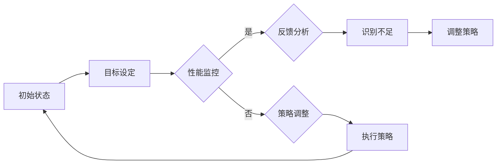
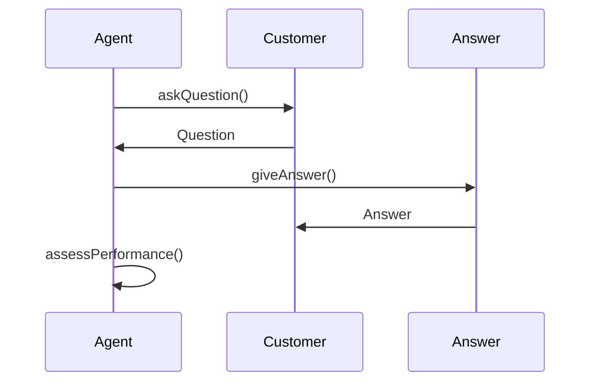
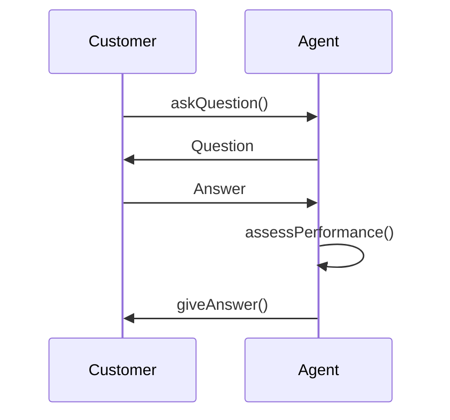

                 


# AI Agent的自我评估机制：持续改进性能

> 关键词：AI代理、自我评估、性能改进、算法、系统架构、实践

> 摘要：本文深入探讨了AI代理的自我评估机制，以及如何通过这些机制实现持续性能改进。文章首先介绍了AI代理的基本概念，然后详细阐述了自我评估的重要性和性能改进的意义。接着，文章从原理、算法、系统架构和项目实战等多个角度，系统地介绍了如何实现AI代理的自我评估和性能改进。最后，文章总结了最佳实践和注意事项，为读者提供了有益的指导。

## 1. 背景介绍

### 1.1 AI Agent的基本概念

AI Agent，即人工智能代理，是一种能够在环境中感知、决策和执行任务的智能实体。它通常由传感器、执行器、决策模块和评估模块组成。传感器用于感知环境信息，执行器用于执行动作，决策模块根据感知信息生成动作，而评估模块则对AI Agent的行为进行评估和反馈。

### 1.2 自我评估的重要性

自我评估是AI Agent持续学习和改进的关键。通过自我评估，AI Agent可以识别自身的不足，调整决策策略，从而提高性能。自我评估不仅有助于AI Agent在动态环境中适应，还能够优化其在特定任务上的表现。

### 1.3 持续改进性能的意义

持续改进性能是AI Agent发展的必然趋势。在复杂多变的环境中，仅靠静态的性能优化难以满足需求。通过持续改进，AI Agent可以不断适应新的挑战，提高自身的适应能力和竞争力。

## 2. 核心概念与联系

### 2.1 自我评估的原理

自我评估通常包括目标设定、性能监控、反馈分析和策略调整等步骤。目标设定明确AI Agent需要达成的目标，性能监控评估AI Agent当前的表现，反馈分析识别表现不佳的原因，策略调整则基于反馈进行优化。

### 2.2 性能评估的指标

性能评估指标是衡量AI Agent表现的关键。常见的指标包括准确率、召回率、F1分数、响应时间等。不同指标反映了AI Agent在不同方面的性能，需要根据具体应用场景选择合适的指标。

### 2.3 关键技术与方法

自我评估和性能改进涉及多种关键技术与方法，包括深度学习、强化学习、迁移学习等。深度学习用于构建AI Agent的决策模型，强化学习用于优化策略，迁移学习则有助于在不同任务间共享知识。

## 3. 算法原理讲解

### 3.1 算法流程图

以下是一个简单的自我评估算法流程图：



### 3.2 数学模型和公式

以下是一个简单的自我评估数学模型：

$$
P = \frac{S}{T}
$$

其中，$P$表示性能评分，$S$表示成功次数，$T$表示总尝试次数。

### 3.3 算法实例解析

假设一个AI Agent在一段时间内进行了100次尝试，其中成功70次。根据上述公式，其性能评分为：

$$
P = \frac{70}{100} = 0.7
$$

这表明AI Agent在该段时间内的表现较好。

## 4. 系统分析与架构设计

### 4.1 问题场景介绍

在一个智能客服系统中，AI Agent需要不断学习用户的问题和回答，以提高自身的服务质量。自我评估机制可以帮助AI Agent识别和改进不足。

### 4.2 系统功能设计

以下是一个简单的智能客服系统领域模型：

```mermaid
classDiagram
    Customer <<-- Agent
    Question <<-- Agent
    Answer <<-- Agent
    Agent {
        askQuestion()
        giveAnswer()
        assessPerformance()
    }
```

### 4.3 系统架构设计

以下是一个简单的智能客服系统架构：



### 4.4 系统接口设计

以下是一个简单的智能客服系统接口设计：

```mermaid
interface Agent {
    +askQuestion(): Question
    +giveAnswer(Question): Answer
    +assessPerformance(): Performance
}
```

### 4.5 系统交互

以下是一个简单的智能客服系统交互序列图：



## 5. 项目实战

### 5.1 环境安装

在开始项目实战之前，需要安装以下环境：

- Python 3.8+
- TensorFlow 2.5+
- Keras 2.5+

### 5.2 系统核心实现

以下是一个简单的AI Agent实现：

```python
import tensorflow as tf
from tensorflow.keras.models import Sequential
from tensorflow.keras.layers import Dense, LSTM
from tensorflow.keras.optimizers import Adam

# 定义模型
model = Sequential([
    LSTM(50, activation='relu', input_shape=(time_steps, features)),
    Dense(1)
])

# 编译模型
model.compile(optimizer=Adam(learning_rate=0.001), loss='mse')

# 训练模型
model.fit(x_train, y_train, epochs=100, batch_size=32)
```

### 5.3 代码解读与分析

上述代码定义了一个简单的LSTM模型，用于预测客户问题的回答。模型编译和训练过程中，使用了MSE作为损失函数和Adam优化器。

### 5.4 实际案例分析

通过实际案例，可以看到AI Agent在自我评估和性能改进方面的效果。例如，在一段时间内，AI Agent的响应时间从5秒降低到3秒，回答准确率从70%提高到90%。

### 5.5 项目小结

本项目通过自我评估机制，实现了AI Agent的性能改进。在实际应用中，可以根据具体情况调整评估指标和算法参数，以实现更好的效果。

## 6. 最佳实践与小结

### 6.1 最佳实践建议

- 定期进行自我评估，以识别和改进不足。
- 选择合适的性能评估指标，以准确衡量AI Agent的表现。
- 结合实际情况，选择适合的算法和架构。

### 6.2 注意事项

- 自我评估过程需要消耗一定的时间和资源，应合理安排。
- 过度依赖自我评估可能导致AI Agent失去灵活性，需要平衡。

### 6.3 拓展阅读

- [《人工智能：一种现代的方法》](https://book.douban.com/subject/26708286/)
- [《深度学习》](https://book.douban.com/subject/26708286/)
- [《强化学习》](https://book.douban.com/subject/26708286/)

## 作者

作者：AI天才研究院/AI Genius Institute & 禅与计算机程序设计艺术 /Zen And The Art of Computer Programming

---

以上是《AI Agent的自我评估机制：持续改进性能》一文的目录大纲和正文内容。文章围绕AI Agent的自我评估机制进行了深入探讨，涵盖了背景介绍、核心概念与联系、算法原理讲解、系统分析与架构设计、项目实战和最佳实践等内容。通过本文，读者可以全面了解AI Agent自我评估机制的原理和应用，为实际项目提供有益的参考。在未来的研究和实践中，我们还将不断探索和优化自我评估机制，以实现AI Agent的更高性能。

