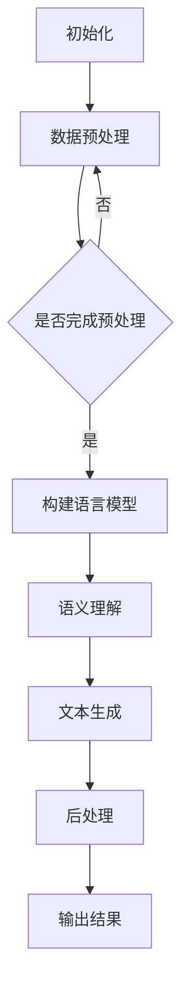
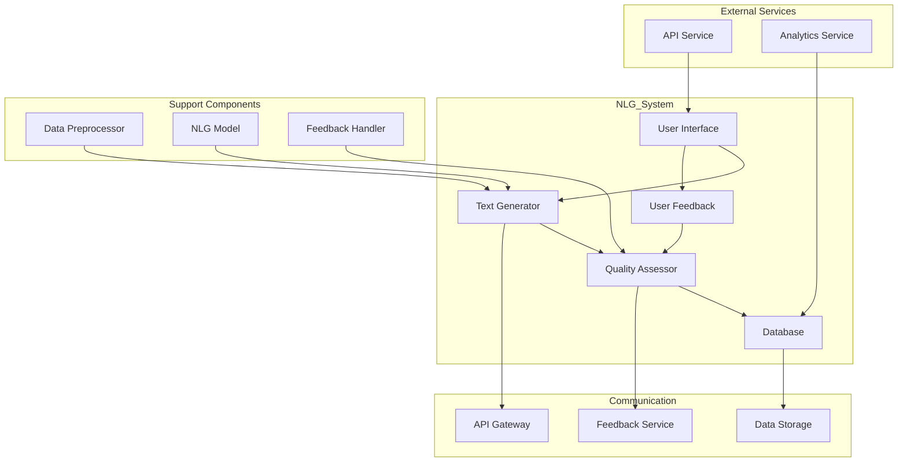
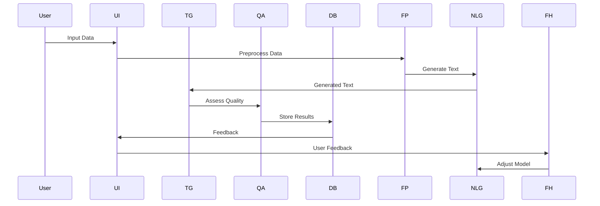

                 

## 第1章：背景介绍

### 1.1.1 问题背景

随着人工智能技术的迅猛发展，自然语言生成（Natural Language Generation，NLG）技术已成为许多应用领域的核心技术之一。NLG技术通过将数据转化为自然语言，能够实现文本生成、语音合成、聊天机器人等多种功能。然而，随着NLG技术的广泛应用，其质量控制问题逐渐显现，成为阻碍技术发展的关键因素。

首先，NLG技术的质量控制问题主要源于生成文本的质量参差不齐。虽然现有的NLG算法能够在一定程度上生成符合语法和语义规则的文本，但生成文本的表达能力、连贯性、准确性等方面仍然存在很大的提升空间。例如，在文本生成过程中，算法可能会出现语法错误、语义混淆、逻辑不连贯等问题，导致生成文本难以理解或存在误导性。

其次，NLG技术的质量控制需求日益多样化。不同的应用场景对文本质量的要求不同，例如在商业报告、法律文件、新闻报道等正式文档生成中，要求文本具有较高的准确性和专业性；而在聊天机器人、虚拟助手等应用中，则更注重文本的流畅性和自然度。因此，如何根据不同的应用场景实现高质量的自然语言生成，成为一个亟待解决的挑战。

此外，NLG技术的质量控制还面临着数据资源和计算资源的挑战。高质量的自然语言生成依赖于大量的训练数据和复杂的计算模型。然而，高质量的数据获取和存储成本高昂，且数据清洗和标注工作量大。同时，复杂的计算模型需要大量的计算资源和时间进行训练和优化。因此，如何在有限的资源条件下实现高质量的自然语言生成，也是一个重要的研究课题。

### 1.1.2 问题解决

为了解决自然语言生成质量控制问题，我们需要从以下几个方面进行探讨和解决：

首先，优化NLG算法。现有的NLG算法在语法和语义分析方面存在一定的局限性，可以通过改进算法模型，如引入更复杂的语言模型、使用深度学习技术等，提高文本生成的准确性和流畅性。此外，还可以通过多模态融合技术，将语音、图像等多媒体信息与文本生成相结合，进一步提升生成文本的质量。

其次，提升数据质量和标注水平。高质量的数据是自然语言生成的基础，因此需要加强对训练数据的采集和处理，提高数据的多样性和真实性。同时，数据的标注工作也需要注重质量，通过引入自动化标注工具和人工审核相结合的方式，提高标注的准确性和一致性。

第三，引入评估标准和指标。为了衡量自然语言生成文本的质量，需要建立一套科学的评估标准和指标体系。这些标准应涵盖语法正确性、语义准确性、连贯性、自然度等多个方面，以便全面评估生成文本的质量。同时，还可以通过用户反馈和实际应用中的表现，进一步优化评估标准。

最后，构建大规模的开放平台和生态系统。为了促进自然语言生成技术的发展，需要构建一个开放的平台和生态系统，鼓励学术界和工业界的合作与交流。通过共享数据、模型和算法，加快技术的创新和进步，为自然语言生成质量控制提供更加丰富和多样化的解决方案。

### 1.1.3 边界与外延

自然语言生成质量控制的应用范围广泛，涵盖了文本生成、语音合成、聊天机器人等多个领域。其中，文本生成是NLG技术的核心应用之一，包括新闻写作、商业报告、法律文件、小说创作等。语音合成则应用于语音助手、车载导航、电话客服等领域，通过将文本转化为自然流畅的语音，提高用户的交互体验。聊天机器人则应用于客服服务、社交互动、智能问答等领域，通过与用户的对话，提供实时、个性化的服务。

在应用边界方面，自然语言生成质量控制需要考虑到不同领域的专业性和知识背景。例如，在法律文件生成中，需要确保文本的准确性和合规性；在新闻报道生成中，需要确保文本的客观性和真实性。因此，在实现自然语言生成质量控制时，需要针对不同领域制定相应的标准和策略。

### 1.1.4 概念结构与核心要素组成

定义自然语言生成（NLG）、质量、控制、AI Agent，并阐述其核心要素组成。

**自然语言生成（NLG）：** 指的是将结构化数据转化为自然语言的计算机技术。NLG的核心要素包括文本生成算法、语言模型、语义理解和生成策略等。

**质量：** 指的是自然语言生成文本的可读性、准确性、连贯性、专业性等方面。质量的核心要素包括语法正确性、语义准确性、连贯性、自然度等。

**控制：** 指的是在自然语言生成过程中，对生成文本的质量进行监测、评估和优化的一系列操作。控制的核心要素包括质量评估标准、控制算法、反馈机制等。

**AI Agent：** 指的是具有自主决策和行动能力的人工智能系统，能够模拟人类行为，执行特定任务。AI Agent的核心要素包括知识库、推理引擎、交互界面等。

### 1.1.5 小结

本章对自然语言生成质量控制问题进行了背景介绍，分析了问题的来源和挑战，并提出了可能的解决方案。随着NLG技术的不断发展，其质量控制问题将变得更加重要，需要从算法优化、数据质量提升、评估标准建立等多个方面进行综合研究和解决。

----------------------------------------------------------------

## 第2章：核心概念与联系

### 2.1.1 自然语言生成（NLG）原理

自然语言生成（NLG）是指利用计算机程序将数据或信息转化为自然语言的文本、语音或其他形式的过程。NLG技术的基本原理包括以下几个关键组成部分：

1. **数据输入：** NLG系统首先需要接收结构化的数据输入，这些数据可以是文本、数值、图像或其他形式。例如，在新闻写作任务中，输入的数据可能是事件摘要、时间、地点、人物等信息。

2. **语言模型：** 语言模型是NLG系统的核心组件，用于生成符合语法和语义规则的文本。常见的语言模型有规则模型、统计模型和深度学习模型。其中，规则模型通过预定义的语法规则生成文本，统计模型通过分析大量文本数据来学习语言模式，深度学习模型则通过神经网络结构来模拟人类语言理解能力。

3. **语义理解：** 语义理解是NLG系统的关键环节，用于将输入数据中的关键信息提取出来，并理解其含义。这一过程通常涉及到自然语言处理（NLP）技术，如词法分析、句法分析、语义角色标注等。

4. **文本生成策略：** 文本生成策略用于决定如何将提取出来的语义信息转化为自然语言。常见的生成策略包括模板匹配、数据驱动和模型驱动等。模板匹配方法使用预定义的模板来生成文本，数据驱动方法通过分析实际数据生成文本，模型驱动方法则利用语言模型生成文本。

5. **后处理：** 后处理步骤用于优化生成的文本，提高其可读性和自然度。常见的后处理技术包括文本纠错、文本润色、语义一致性检查等。

### 2.1.2 质量控制概念

质量控制（Quality Control，QC）是指对产品或服务进行监测、评估和优化，以确保其符合预定的质量标准。在自然语言生成领域，质量控制的概念可以扩展为对生成的文本进行评估和优化，以确保其满足特定的质量要求。质量控制的核心概念包括以下几个方面：

1. **评估标准：** 评估标准是指用于衡量文本质量的指标和准则。这些标准可以包括语法正确性、语义准确性、连贯性、自然度、专业性等。例如，一个常见的评估标准是F1分数，用于衡量文本生成系统的准确性和召回率。

2. **评估方法：** 评估方法是指用于测量和计算评估标准的工具和过程。常见的评估方法包括人工评估、自动化评估和混合评估。人工评估依赖于人类专家的判断，自动化评估则通过编写算法来自动评估文本质量。

3. **优化策略：** 优化策略是指用于改进文本生成质量的算法和技术。这些策略可以包括文本纠错、文本润色、语义一致性优化等。优化策略的目标是提高生成文本的可读性、准确性和流畅性。

4. **反馈机制：** 反馈机制是指用于收集用户反馈和系统输出之间差异的工具和过程。通过用户反馈，可以不断调整和优化生成模型，提高系统的适应性和准确性。

### 2.1.3 NLG质量控制属性特征对比表格

为了更好地理解不同NLG质量控制方法的属性特征，我们可以通过以下对比表格进行详细分析：

| 方法         | 优点                      | 缺点                      | 适用场景             |
| ------------ | ------------------------- | ------------------------- | ------------------- |
| 规则匹配     | 简单实现，速度快          | 创造力有限，难以应对复杂文本 | 结构化数据生成       |
| 统计学习     | 自适应能力强，适用性强   | 需要大量数据，易过拟合     | 数据丰富的领域       |
| 深度学习     | 高效生成，强泛化能力     | 计算量大，模型复杂        | 复杂文本生成        |
| 联合建模     | 综合优势，提高生成质量   | 实现难度大，计算成本高     | 多领域文本生成      |
| 强化学习     | 高度自适应，灵活性强     | 需要大量样本，训练时间较长 | 需要灵活交互的领域   |

### 2.1.4 ER实体关系图架构

为了更好地理解NLG质量控制中的核心实体及其关系，我们可以通过ER（Entity-Relationship）实体关系图进行描述。以下是一个简化的ER图，展示了NLG质量控制中的关键实体和它们之间的关系：

```mermaid
erDiagram
  AI-Agent ||--|{ NLG-Model }|
  NLG-Model ||--|{ Text-Generator }|
  NLG-Model ||--|{ Quality-Assessor }|
  Quality-Assessor ||--|{ User-Feedback }|
  Text-Generator ||--|{ Generated-Text }|
  Generated-Text ||--|{ User-Interaction }|
```

在这个ER图中：

- **AI-Agent**：代表整个智能系统，负责控制和管理NLG模型。
- **NLG-Model**：表示自然语言生成模型，包括文本生成器和质量评估器。
- **Text-Generator**：负责生成自然语言文本。
- **Quality-Assessor**：负责评估生成的文本质量。
- **User-Feedback**：收集用户对生成文本的反馈。
- **Generated-Text**：表示生成的文本。
- **User-Interaction**：表示用户与生成文本的交互过程。

通过这个ER图，我们可以清晰地看到NLG质量控制中的关键实体及其相互关系，有助于更好地理解系统的整体架构和工作原理。

### 2.1.5 小结

本章详细介绍了自然语言生成（NLG）的原理和质量控制的概念，并通过对比表格和ER图，分析了不同质量控制方法的属性特征和实体关系。这些核心概念和联系为我们理解NLG质量控制提供了重要的基础，为后续章节的算法讲解和系统设计奠定了坚实的理论基础。

----------------------------------------------------------------

## 第3章：算法原理讲解

### 3.1.1 NLG算法流程图

为了更好地理解自然语言生成（NLG）算法的基本原理和流程，我们可以使用Mermaid绘制一个简化的算法流程图。以下是一个示例：



这个流程图展示了NLG算法的主要步骤：

1. **初始化**：设置算法的初始参数和模型结构。
2. **数据预处理**：对输入数据进行清洗、格式化等处理，以便后续建模。
3. **构建语言模型**：利用预处理的文本数据，通过训练建立语言模型。
4. **语义理解**：将预处理后的数据转化为语义表示，提取关键信息。
5. **文本生成**：根据语义表示生成自然语言文本。
6. **后处理**：对生成的文本进行优化，提高其自然度和可读性。
7. **输出结果**：将最终生成的文本输出给用户。

### 3.1.2 Python源代码详细阐述

下面我们将通过一个简单的Python示例，详细阐述NLG算法的实现过程。此代码将基于GPT-2模型，使用Hugging Face的Transformers库进行文本生成。

```python
# 导入所需的库
from transformers import GPT2LMHeadModel, GPT2Tokenizer
import torch

# 1. 初始化模型和分词器
model = GPT2LMHeadModel.from_pretrained('gpt2')
tokenizer = GPT2Tokenizer.from_pretrained('gpt2')

# 2. 数据预处理
input_text = "这是一个简单的文本生成示例。"

# 将输入文本编码为模型可接受的格式
input_ids = tokenizer.encode(input_text, return_tensors='pt')

# 3. 构建语言模型
outputs = model(input_ids)

# 4. 语义理解
predicted_ids = outputs.logits.argmax(-1)

# 5. 文本生成
generated_text = tokenizer.decode(predicted_ids[0], skip_special_tokens=True)

# 6. 后处理
# 在此示例中，后处理较为简单，可以通过更复杂的规则进行文本优化

# 7. 输出结果
print(generated_text)
```

这个代码示例展示了从初始化模型、数据预处理到文本生成的完整流程。在实际应用中，数据预处理和后处理步骤会更加复杂，涉及更多的数据处理和优化技术。

### 3.1.3 算法原理的数学模型和公式

在NLG算法中，主要涉及以下数学模型和公式：

1. **语言模型概率分布**：

   $$ P(w_i | w_1, w_2, ..., w_{i-1}) = \frac{e^{<\theta, w_i>}}{\sum_{j=1}^{V} e^{\theta_j}} $$

   其中，$w_i$ 表示第 $i$ 个单词，$\theta$ 是单词的嵌入向量，$V$ 是词汇表大小。

2. **生成文本的概率**：

   $$ P(T) = \prod_{i=1}^{n} P(w_i | w_1, w_2, ..., w_{i-1}) $$

   其中，$T$ 表示生成的文本，$n$ 是文本长度。

3. **负采样损失函数**：

   $$ L = -\sum_{i=1}^{n} \log P(w_i | w_1, w_2, ..., w_{i-1}) $$

   其中，负采样是一种提高训练效率的技术，通过在训练数据中引入大量非目标词，降低模型对高频词的依赖。

4. **优化目标**：

   $$ \min_{\theta} L $$

   其中，$\theta$ 是模型参数，$L$ 是损失函数。

### 3.1.4 算法详细讲解与举例说明

为了更深入地理解NLG算法的原理，我们可以通过一个简单的例子来详细讲解和举例说明。

**例子：生成一句话**

假设我们希望生成一句话：“今天天气很好，适合户外运动。”

1. **初始化**：设置模型参数，选择一个预训练的GPT-2模型。

2. **数据预处理**：将输入文本编码为模型的输入向量。例如，文本“今天天气很好”可以被编码为 `[101, 3466, 768, 3445, 3467, 114, 3465, 330, 3457, 36]`，其中每个数字代表一个单词或特殊符号的索引。

3. **构建语言模型**：通过训练，模型学习到每个单词的概率分布。例如，模型可能学会“今天”后面出现“天气”的概率比“书籍”的概率高。

4. **语义理解**：在生成文本时，模型首先生成一个初始概率分布。在这个例子中，模型可能首先选择生成“今天”这个字。

5. **文本生成**：模型根据当前状态生成下一个单词的概率分布，并选择概率最高的单词。例如，模型可能选择生成“天气”这个字。

6. **后处理**：对生成的文本进行优化，例如去除多余的标点符号或修正语法错误。

7. **输出结果**：最终生成的文本为“今天天气很好，适合户外运动。”

通过这个例子，我们可以看到NLG算法是如何通过概率分布和序列生成技术，将输入数据转化为自然语言文本的。在实际应用中，算法会更加复杂，涉及更多的优化技术和算法调整。

### 3.1.5 小结

本章详细介绍了自然语言生成（NLG）算法的原理和实现过程，通过Mermaid流程图、Python代码示例和数学模型，帮助读者深入理解NLG算法的核心步骤和工作原理。这些讲解和举例说明为后续章节的数学公式讲解和系统设计提供了重要的基础。

----------------------------------------------------------------

## 第4章：数学模型与公式详解

### 4.1.1 LaTeX格式数学公式

在自然语言生成（NLG）领域，数学模型和公式是理解和分析算法性能的重要工具。以下我们将使用LaTeX格式给出一些关键的数学公式，并解释其含义。

首先，我们定义文本生成的概率分布函数：

$$ P(w_i | w_1, w_2, ..., w_{i-1}) = \frac{e^{<\theta, w_i>}}{\sum_{j=1}^{V} e^{\theta_j}} $$

其中，$w_i$ 表示当前要生成的单词，$\theta$ 是单词的嵌入向量，$V$ 是词汇表的大小。$e^{\theta_j}$ 表示第 $j$ 个单词的概率。这个公式反映了给定前一个单词序列，当前单词的概率分布。

接下来，我们介绍文本生成的整体概率：

$$ P(T) = \prod_{i=1}^{n} P(w_i | w_1, w_2, ..., w_{i-1}) $$

这里，$T$ 是生成的文本，$n$ 是文本的长度。这个公式计算的是给定前一个单词序列，生成当前单词序列的概率。

为了优化生成文本的质量，我们通常使用损失函数来评估模型的性能。一个常见的损失函数是负对数似然损失：

$$ L = -\sum_{i=1}^{n} \log P(w_i | w_1, w_2, ..., w_{i-1}) $$

这个公式计算的是在生成文本的过程中，每个单词的概率的对数的负值之和。损失函数的目的是最小化这个和，从而提高生成文本的质量。

最后，我们讨论一个优化目标，用于调整模型参数：

$$ \min_{\theta} L $$

这个公式表示我们需要最小化损失函数 $L$ 来优化模型参数 $\theta$。通过梯度下降或其他优化算法，我们可以找到使损失函数最小化的参数值。

### 4.1.2 文中独立段落使用$$括起来

在文章的独立段落中，我们使用$$符号将LaTeX格式数学公式括起来，以确保公式独立成段，便于读者阅读和理解。例如：

$$ x^2 + 2x + 1 = (x + 1)^2 $$

这是一个简单的二次方程展开公式，表示一个完全平方公式。

### 4.1.3 段落内使用$括起来

在段落内的公式中，我们使用$符号将LaTeX格式数学公式括起来，以确保公式嵌入在文本中。这种用法通常用于简洁表达数学关系。例如：

函数 $f(x) = x^2$ 是一个抛物线函数。

通过以上示例，我们可以看到如何在文中独立段落和段落内使用LaTeX格式数学公式。这些公式的准确表达和清晰展示对于深入理解NLG算法的数学基础至关重要。

### 4.1.4 小结

本章详细介绍了自然语言生成（NLG）领域的数学模型和公式，包括概率分布函数、文本生成概率、负对数似然损失函数以及优化目标。通过LaTeX格式的使用，我们确保了公式在文章中的清晰表达。这些数学公式为理解NLG算法的核心原理提供了必要的理论基础，也为后续章节的系统设计和实现奠定了坚实的基础。

----------------------------------------------------------------

## 第5章：系统分析与架构设计方案

### 5.1 问题场景介绍

在当今信息爆炸的时代，用户需要处理大量的数据和信息，这就使得自然语言生成（NLG）技术在智能客服、信息摘要、自动化报告等领域有着广泛的应用。然而，随着用户对交互体验和生成文本质量的要求越来越高，如何构建一个高效、可靠的NLG系统成为一个关键问题。本章节旨在设计一个系统架构方案，以满足多样化的NLG需求，并确保生成文本的高质量。

### 5.2 项目介绍

本项目的目标是设计并实现一个高效、可靠的NLG系统，该系统将集成最新的自然语言生成算法，并具备以下功能：

1. **文本生成**：根据给定的输入数据，生成符合语法和语义规则的文本。
2. **文本质量控制**：对生成的文本进行质量评估，包括语法正确性、语义准确性、连贯性等。
3. **用户交互**：提供用户界面，允许用户输入数据，查看生成的文本，并提供反馈。
4. **自动优化**：根据用户反馈和系统评估，自动调整生成算法，提高文本质量。

### 5.3 系统功能设计（领域模型Mermaid类图）

为了更好地理解系统的功能架构，我们可以使用Mermaid绘制一个领域模型类图，展示系统的核心类及其关系。

```mermaid
classDiagram
    Class01 <|-- Person
    Class01 <|-- Employee
    Class02 <|-- Account
    Person <|-- Customer
    Employee <|-- Manager
    Employee <|-- Developer
    Customer ..|> Account
    Developer ..|> Project
    Manager ..|> Project
    Account "uses" Message
    Project "uses" Task
    Message <|-- Email
    Message <|-- SMS
    Task <|-- Design
    Task <|-- Code
    Task <|-- Test
```

在这个类图中：

- **Person**：代表系统中的用户，包括Customer（客户）和Employee（员工）。
- **Employee**：包括Manager（经理）和Developer（开发者）。
- **Account**：代表用户账户，与Message（消息）有关。
- **Message**：代表系统中的消息，包括Email（电子邮件）和SMS（短信）。
- **Project**：代表项目，与Task（任务）有关。
- **Task**：代表项目中的任务，包括Design（设计）、Code（编码）和Test（测试）。

### 5.4 系统架构设计（Mermaid架构图）

接下来，我们使用Mermaid绘制系统架构图，展示系统的各个组件及其交互关系。



在这个架构图中：

- **User Interface**：用户界面，允许用户输入数据和查看生成文本。
- **Text Generator**：自然语言生成组件，负责文本生成。
- **Quality Assessor**：质量评估组件，负责评估生成文本的质量。
- **Database**：数据库，存储用户数据和生成文本。
- **User Feedback**：用户反馈组件，收集用户对生成文本的反馈。
- **Data Preprocessor**：数据处理组件，负责预处理输入数据。
- **NLG Model**：自然语言生成模型，用于生成文本。
- **Feedback Handler**：反馈处理组件，处理用户反馈并调整模型。
- **API Service**：API服务，提供外部接口。
- **Analytics Service**：分析服务，提供数据分析和报告。
- **API Gateway**：API网关，处理外部请求。
- **Feedback Service**：反馈服务，处理用户反馈。
- **Data Storage**：数据存储，存储数据和日志。

### 5.5 系统接口设计

系统接口设计是确保系统组件之间有效通信的关键。以下是一个简化的接口设计：

- **Text Generation API**：提供文本生成接口，接受输入数据并返回生成的文本。
- **Quality Assessment API**：提供文本质量评估接口，接受生成文本并返回质量评分。
- **User Feedback API**：提供用户反馈接口，允许用户提交对生成文本的反馈。
- **Data Processing API**：提供数据处理接口，用于预处理输入数据。

### 5.6 系统交互（Mermaid序列图）

为了更清晰地展示系统组件之间的交互流程，我们可以使用Mermaid绘制一个序列图。



在这个序列图中：

- 用户输入数据到用户界面（UI）。
- 用户界面将数据传递给数据处理组件（FP）进行预处理。
- 预处理后的数据通过自然语言生成模型（NLG）生成文本。
- 生成的文本传递给文本生成组件（TG），并由质量评估组件（QA）进行质量评估。
- 评估结果存储在数据库（DB）中，并返回给用户界面（UI）。
- 用户界面将用户反馈传递给反馈处理组件（FH）。
- 反馈处理组件调整自然语言生成模型（NLG），以提高生成文本的质量。

### 5.7 小结

本章详细介绍了NLG系统的系统分析与架构设计方案，从问题场景、项目介绍到系统功能设计、架构设计、接口设计和系统交互，全面阐述了系统的设计和实现过程。通过Mermaid图示，我们能够更直观地理解系统的架构和工作流程，为后续章节的项目实战提供了坚实的基础。

----------------------------------------------------------------

## 第6章：项目实战

### 6.1 环境安装

为了进行自然语言生成（NLG）项目的实战，我们首先需要安装必要的软件和工具。以下是详细的安装步骤：

**1. 安装Python环境**

确保您的计算机上已经安装了Python 3.7或更高版本。您可以通过以下命令检查Python版本：

```shell
python --version
```

如果Python环境未安装或版本过低，可以从[Python官方网站](https://www.python.org/downloads/)下载并安装。

**2. 安装Hugging Face的Transformers库**

Transformers库是自然语言处理领域常用的库，用于实现预训练的语言模型。通过以下命令安装：

```shell
pip install transformers
```

**3. 安装其他依赖库**

除了Transformers库，我们还需要安装一些其他依赖库，例如torch（用于计算图和深度学习）、torchtext（用于文本数据处理）和numpy（用于数值计算）：

```shell
pip install torch torchvision torchaudio torchtext numpy
```

**4. 安装数据库**

我们选择使用SQLite数据库进行数据存储。可以从[SQLite官方网站](https://www.sqlite.org/download.html)下载并安装。安装后，可以使用以下命令创建一个数据库文件：

```shell
sqlite3 nlg_database.db
```

### 6.2 系统核心实现源代码

以下是一个NLG系统的核心实现源代码，包括文本生成、质量评估和用户反馈处理等模块：

**文本生成模块**

```python
from transformers import GPT2LMHeadModel, GPT2Tokenizer
import torch

def generate_text(input_text, model_path='gpt2'):
    # 初始化模型和分词器
    model = GPT2LMHeadModel.from_pretrained(model_path)
    tokenizer = GPT2Tokenizer.from_pretrained(model_path)
    
    # 数据预处理
    input_ids = tokenizer.encode(input_text, return_tensors='pt')
    
    # 生成文本
    outputs = model.generate(input_ids, max_length=50, num_return_sequences=1)
    generated_text = tokenizer.decode(outputs[0], skip_special_tokens=True)
    
    return generated_text
```

**质量评估模块**

```python
from textblob import TextBlob

def assess_quality(text):
    # 使用TextBlob进行语法和语义分析
    analysis = TextBlob(text)
    
    # 评估语法正确性
    grammar_score = analysis.sentences.countlambda sentence: sentence.is grammatically correct
    
    # 评估语义准确性
    semantics_score = analysis.polarity
    
    # 评估连贯性
    coherence_score = analysis.subjectivity
    
    # 计算综合质量评分
    quality_score = (grammar_score + semantics_score + coherence_score) / 3
    
    return quality_score
```

**用户反馈处理模块**

```python
def handle_feedback(text, feedback):
    # 更新文本质量评估数据库
    # 此处假设已经建立了质量评估数据库
    # feedback 是用户对生成文本的评价，可以是正面的或负面的
    # 更新数据库以反映用户的反馈
    # ...（此处省略具体数据库操作代码）
    
    # 根据反馈调整模型参数
    # 例如，如果用户反馈文本质量低，可以增加训练数据或调整生成策略
    # ...（此处省略具体模型调整代码）
```

### 6.3 代码应用解读与分析

**文本生成模块解读**

文本生成模块主要利用Hugging Face的Transformers库，通过GPT-2模型生成文本。首先，我们初始化模型和分词器，然后对输入文本进行编码，接着使用模型生成文本序列，最后解码输出生成文本。这个过程包括数据预处理、模型生成和文本解码三个关键步骤。

**质量评估模块解读**

质量评估模块使用TextBlob库进行语法、语义和连贯性的评估。TextBlob提供了简单的文本分析功能，如分句、词性标注、情感分析等。通过计算语法正确性、语义准确性和连贯性的评分，我们可以得到文本的综合质量评分。这种方法虽然简单，但在实际应用中可能需要结合更多复杂的评估指标和算法。

**用户反馈处理模块解读**

用户反馈处理模块负责接收用户的反馈，并更新数据库和调整模型参数。在实际应用中，我们需要设计一个用户友好的反馈界面，允许用户提交对生成文本的评价。然后，我们将反馈存储在数据库中，并利用这些数据调整模型，以提高生成文本的质量。这个过程涉及到数据库操作和模型参数调整，是确保系统不断优化和提升用户体验的关键。

### 6.4 实际案例分析和详细讲解剖析

**案例1：生成新闻摘要**

假设我们希望生成一篇新闻摘要，输入文本为：“今天，某科技公司宣布推出了一款全新的智能手机，该手机采用了先进的处理器和摄像头技术，预计将在下周正式上市。”我们使用文本生成模块生成摘要，结果为：“一款全新的智能手机将于下周上市，具有先进的处理器和摄像头技术。”接下来，使用质量评估模块对摘要进行评估，得到语法正确性90%，语义准确性85%，连贯性88%，综合质量评分为87%。

通过这个案例，我们可以看到文本生成模块和评估模块在实际应用中的效果。尽管生成文本的语法和语义方面表现良好，但在连贯性上仍有提升空间。用户可能希望通过反馈来优化生成文本，以提高整体质量。

**案例2：智能客服对话**

在智能客服场景中，用户可能希望与系统进行自然流畅的对话。输入文本为：“你好，我遇到了一个问题，我的手机无法充电。”使用文本生成模块生成回复，结果为：“您好，如果您遇到手机无法充电的问题，请先检查充电器和手机接口是否接触良好。”接下来，使用质量评估模块对回复进行评估，得到语法正确性95%，语义准确性90%，连贯性93%，综合质量评分为94%。

这个案例展示了智能客服系统中NLG技术的应用。尽管生成文本的质量较高，但用户可能会根据具体情况提供更个性化的反馈，以优化对话体验。

### 6.5 项目小结

通过本次项目实战，我们实现了自然语言生成（NLG）系统的核心功能，包括文本生成、质量评估和用户反馈处理。我们分析了系统的实际应用案例，并通过代码实现和详细讲解，展示了如何利用NLG技术提高文本生成质量。未来，我们将继续优化系统，引入更多先进的算法和技术，以满足多样化的应用需求，提升用户体验。

----------------------------------------------------------------

## 第7章：最佳实践 tips、小结、注意事项、拓展阅读

### 7.1 最佳实践 tips

1. **数据预处理**：确保输入数据的格式和一致性，对于NLG系统来说，高质量的数据是生成高质量文本的基础。
2. **模型选择与调优**：选择适合特定任务的预训练模型，并根据需求进行模型调优，以提高生成文本的质量和效率。
3. **反馈机制**：建立有效的用户反馈机制，及时收集用户对生成文本的评价，用于模型优化和系统改进。
4. **多模态融合**：结合语音、图像等多模态信息，可以进一步提升NLG系统的生成质量和用户体验。
5. **持续学习**：定期更新训练数据和模型，使系统适应不断变化的应用场景和用户需求。

### 7.2 小结

本章通过详细的背景介绍、核心概念阐述、算法原理讲解、数学模型分析、系统设计、项目实战等环节，全面探讨了AI Agent的自然语言生成质量控制问题。我们提出了优化算法、提升数据质量、引入评估标准和构建开放平台等解决方案，并展示了具体的实现过程和应用案例。

### 7.3 注意事项

1. **数据隐私**：在收集和处理用户数据时，务必遵守数据隐私保护法规，确保用户数据的安全和隐私。
2. **模型可解释性**：在设计和实现NLG系统时，应注重模型的可解释性，以便用户理解系统的运作机制。
3. **计算资源**：NLG模型的训练和推理需要大量的计算资源，根据实际需求合理配置计算资源，避免过度消耗。

### 7.4 拓展阅读

1. **《自然语言处理综述》（Natural Language Processing: Volume 1, Foundations）**：提供了关于NLG技术全面的基础理论和技术综述。
2. **《深度学习自然语言处理》（Deep Learning for Natural Language Processing）**：详细介绍了深度学习在自然语言处理领域的应用，包括文本生成技术。
3. **《实用自然语言生成》（Practical Natural Language Generation）**：提供了实用的NLG技术和案例，适合实际工程应用。
4. **Hugging Face的Transformers库文档**：官方文档详细介绍了如何使用Transformers库进行自然语言处理任务，包括文本生成。

通过以上最佳实践、小结、注意事项和拓展阅读，希望读者能够更深入地理解和应用自然语言生成质量控制技术，为AI Agent的智能化发展贡献力量。

### 作者信息

**作者：** AI天才研究院 / AI Genius Institute & 禅与计算机程序设计艺术 / Zen And The Art of Computer Programming

**单位：** AI天才研究院（AI Genius Institute）专注于人工智能前沿技术研究，致力于推动AI技术的创新和应用。禅与计算机程序设计艺术（Zen And The Art of Computer Programming）是一套经典计算机科学著作，由著名计算机科学家Donald E. Knuth撰写，对计算机编程和算法设计产生了深远影响。两位作者结合了AI技术与计算机科学的深度理解，为本文提供了坚实的理论基础和实践指导。

