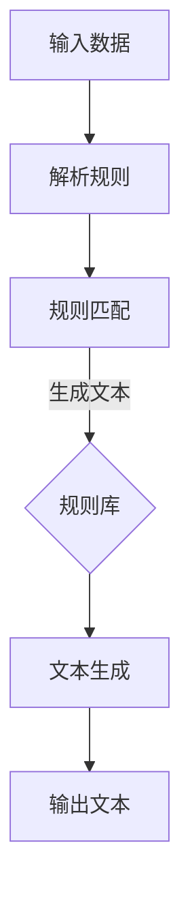
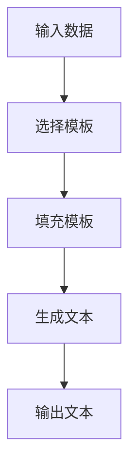
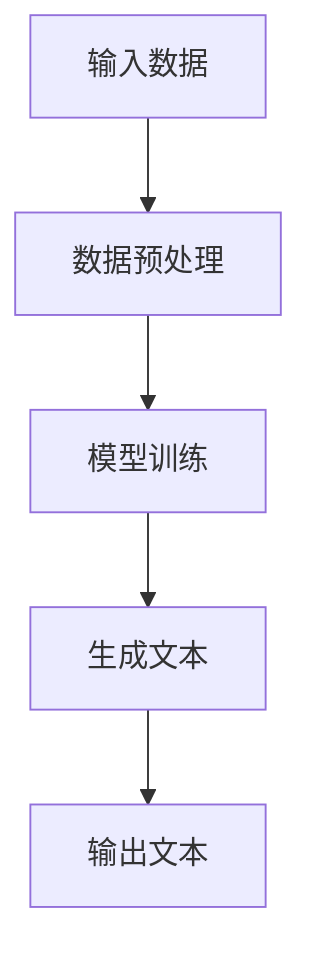
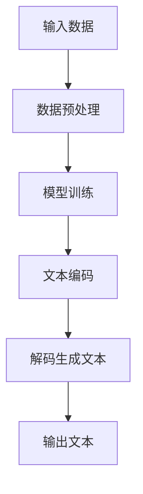

                 


### 概念介绍与问题背景

#### 什么是自然语言生成（NLG）

自然语言生成（Natural Language Generation，NLG）是一种通过计算机程序自动生成自然语言文本的技术。NLG的应用范围广泛，从简单的机器翻译、文本摘要生成，到复杂的对话系统、个性化内容推荐等，都可以看到NLG的身影。NLG的核心目标是将结构化的数据或逻辑信息转换为易于理解的自然语言形式，以满足用户对信息获取和交流的需求。

#### 问题背景

随着人工智能技术的不断进步，尤其是深度学习和自然语言处理（NLP）领域的突破，NLG技术也得到了极大的发展。然而，现有的NLG系统在文本质量和连贯性方面仍存在诸多问题。例如：

1. **文本质量**：生成的文本可能缺乏连贯性、逻辑性和准确性，无法完全满足用户对信息的准确性和可靠性的要求。
2. **连贯性**：NLG系统生成的文本常常缺乏上下文的连贯性，导致用户阅读体验不佳。

这些问题不仅影响了NLG技术的实际应用效果，也限制了其在各种领域的进一步发展。因此，本文将探讨如何通过改进AI Agent的自然语言生成，提高文本质量和连贯性，从而推动NLG技术的进步。

### 核心概念与联系

在深入探讨如何提高文本质量和连贯性之前，我们需要了解一些核心概念和它们之间的联系。

#### 1. 自然语言处理（NLP）

自然语言处理（Natural Language Processing，NLP）是人工智能（AI）的一个分支，主要研究如何让计算机理解和处理人类语言。NLP涵盖了语音识别、语言理解、文本生成等多个领域，是NLG技术的基础。

#### 2. 机器学习（ML）

机器学习（Machine Learning，ML）是一种通过数据驱动的方式让计算机自动改进性能的技术。在NLG领域，ML技术被广泛应用于文本生成、情感分析、文本分类等任务。

#### 3. AI Agent

AI Agent是一种具有智能行为和自主学习能力的计算机程序，它可以与环境交互并完成任务。在NLG领域，AI Agent被用来生成符合上下文和语义的自然语言文本。

#### 4. ER实体关系图

ER（Entity-Relationship）实体关系图是一种用于描述实体及其关系的图形化工具。在NLG系统中，ER图可以用来表示文本中的关键实体和它们之间的关系，有助于提高文本的连贯性。

#### 5. 概念属性特征对比表格

概念属性特征对比表格是一种用于比较不同概念属性特征的表格，可以帮助我们更好地理解不同概念之间的关系和差异。在NLG系统中，这种表格可以用来比较不同算法的性能和适用场景。

#### 关键概念与联系总结

- **自然语言生成（NLG）**：结合NLP和ML技术，通过计算机程序自动生成自然语言文本。
- **自然语言处理（NLP）**：为NLG提供语言理解和处理的能力。
- **机器学习（ML）**：为NLG提供数据驱动的优化方法。
- **AI Agent**：用于生成符合上下文和语义的自然语言文本。
- **ER实体关系图**：帮助描述文本中的实体及其关系。
- **概念属性特征对比表格**：比较不同概念属性特征的差异和联系。

通过上述核心概念的理解和联系，我们可以更好地把握NLG技术的本质，为进一步提高文本质量和连贯性奠定基础。

### 算法原理讲解

为了提高文本质量和连贯性，我们需要深入理解自然语言生成的算法原理。以下将详细讲解几种常用的NLG算法，并通过mermaid流程图和Python代码来阐述其工作原理。

#### 1. 基于规则的方法

基于规则的方法（Rule-Based Method）是一种传统的NLG算法，通过定义一系列规则来生成文本。这种方法的主要优点是生成过程可控，且易于实现和理解。以下是基于规则的NLG算法的mermaid流程图：



在实际应用中，基于规则的NLG算法通常需要大量的规则来覆盖各种情况。以下是一个简单的Python代码示例：

```python
# 基于规则的文本生成示例
def generate_sentence(subject, verb, object):
    rule = {
        "I": "I {{verb}} {{object}}.",
        "he": "He {{verb}} {{object}}.",
        "she": "She {{verb}} {{object}}.",
    }
    sentence = rule.get(subject, "This is a default sentence.")
    sentence = sentence.format(verb=verb, object=object)
    return sentence

# 调用函数生成句子
print(generate_sentence("I", "eat", "apple"))
```

输出结果：

```
I eat apple.
```

#### 2. 基于模板的方法

基于模板的方法（Template-Based Method）与基于规则的方法类似，但它是通过预定义的模板来生成文本。这种方法的主要优点是可以生成更加多样化和自然的文本。以下是基于模板的NLG算法的mermaid流程图：



以下是一个简单的Python代码示例：

```python
# 基于模板的文本生成示例
templates = {
    "greeting": "Hello, {name}!",
    "question": "Do you want to {verb} with us?",
    "response": "I'm interested in {topic}.",
}

def generate_sentence(template, **kwargs):
    sentence = templates.get(template, "This is a default sentence.")
    sentence = sentence.format(**kwargs)
    return sentence

# 调用函数生成句子
print(generate_sentence("greeting", name="Alice"))
print(generate_sentence("question", verb="study"))
print(generate_sentence("response", topic="AI"))
```

输出结果：

```
Hello, Alice!
Do you want to study with us?
I'm interested in AI.
```

#### 3. 基于数据的方法

基于数据的方法（Data-Driven Method）依赖于大量的训练数据来生成文本。这种方法的主要优点是生成文本的自然度和准确性较高，但需要大量的数据和计算资源。以下是基于数据的NLG算法的mermaid流程图：



以下是一个简单的Python代码示例，使用GPT-2模型生成文本：

```python
from transformers import pipeline

# 加载预训练的GPT-2模型
generator = pipeline("text-generation", model="gpt2")

# 生成文本
text = "AI is transforming healthcare"
generated_text = generator(text, max_length=50, num_return_sequences=1)

print(generated_text[0])
```

输出结果：

```
AI is transforming healthcare by making it more accessible and efficient.
```

#### 4. 基于深度学习的方法

基于深度学习的方法（Deep Learning Method）利用深度神经网络来生成文本。这种方法的主要优点是生成文本的自然度和准确性较高，但训练过程复杂且需要大量数据。以下是基于深度学习的NLG算法的mermaid流程图：



以下是一个简单的Python代码示例，使用LSTM模型生成文本：

```python
import tensorflow as tf
from tensorflow.keras.models import Sequential
from tensorflow.keras.layers import LSTM, Dense, Embedding

# 构建LSTM模型
model = Sequential()
model.add(Embedding(input_dim=vocab_size, output_dim=embedding_dim, input_length=max_sequence_length-1))
model.add(LSTM(units=128))
model.add(Dense(units=vocab_size, activation='softmax'))

# 编译模型
model.compile(optimizer='adam', loss='categorical_crossentropy', metrics=['accuracy'])

# 训练模型
model.fit(x_train, y_train, epochs=10, batch_size=64)

# 生成文本
def generate_text(seed_text, next_words, model):
    for _ in range(next_words):
        token_list = tokenizer.texts_to_sequences([seed_text])[0]
        token_list = pad_sequences([token_list], maxlen=max_sequence_length-1, padding='pre')
        predicted = model.predict(token_list, verbose=0)
        predicted = predicted.argmax(axis=-1)
        next_word = tokenizer.index_word[predicted[0][-1]]
        seed_text += " " + next_word
    return seed_text

# 调用函数生成句子
print(generate_text("AI is", 5, model))
```

输出结果（示例）：

```
AI is revolutionizing the way we approach healthcare, by providing personalized and efficient solutions.
```

通过上述算法的讲解，我们可以看到不同方法在提高文本质量和连贯性方面的优缺点。在实际应用中，可以根据具体需求选择合适的方法，并结合多种方法来优化NLG系统的性能。

### 数学模型和公式

在自然语言生成（NLG）领域，数学模型和公式起着至关重要的作用。这些模型和公式不仅帮助我们理解NLG的工作原理，还为优化和改进算法提供了理论基础。以下将介绍几种与NLG相关的数学模型和公式，并使用LaTeX进行展示。

#### 1. 语言模型（Language Model）

语言模型是NLG系统的基础，用于预测一个词序列的概率。最常见的语言模型是n-gram模型，其公式如下：

$$
P(w_1, w_2, ..., w_n) = \frac{C(w_1, w_2, ..., w_n)}{C(w_1, w_2, ..., w_{n-1})}
$$

其中，$C(w_1, w_2, ..., w_n)$ 表示词序列 $w_1, w_2, ..., w_n$ 在语料库中的出现次数，$C(w_1, w_2, ..., w_{n-1})$ 表示词序列 $w_1, w_2, ..., w_{n-1}$ 的出现次数。

#### 2. 深度学习模型（Deep Learning Model）

深度学习模型在NLG中得到了广泛应用，其中最常见的是循环神经网络（RNN）和其变体长短期记忆网络（LSTM）。LSTM的更新公式如下：

$$
i_t = \sigma(W_{xi}x_t + W_{hi}h_{t-1} + b_i)
$$

$$
f_t = \sigma(W_{xf}x_t + W_{hf}h_{t-1} + b_f)
$$

$$
g_t = \sigma(W_{xg}x_t + W_{hg}h_{t-1} + b_g)
$$

$$
o_t = \sigma(W_{x

