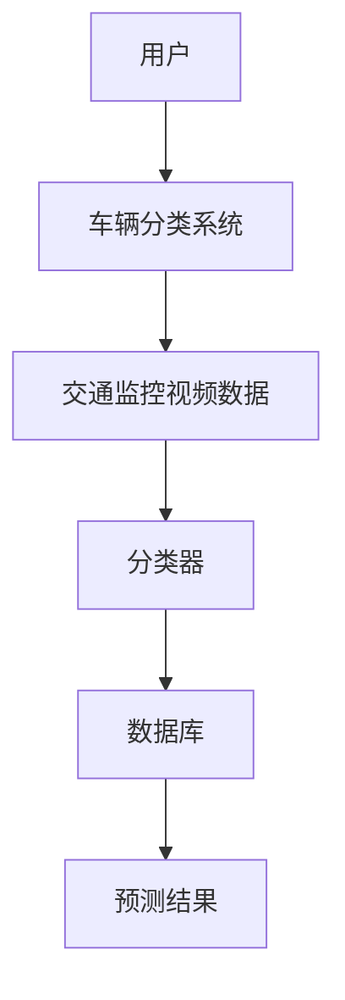
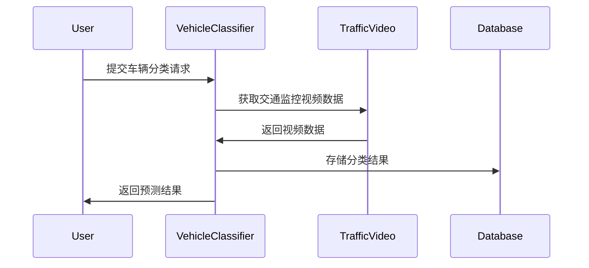

                 

### 文章标题：AI Agent的自监督对比学习技术

> 关键词：AI Agent、自监督学习、对比学习、深度学习、神经网络

> 摘要：本文将深入探讨AI Agent领域中自监督对比学习技术的核心概念、原理、算法及应用，旨在为读者提供一个全面、系统的技术指南，帮助理解自监督对比学习的机制及其在AI Agent开发中的应用价值。

## 引言

### 自监督学习与AI Agent
自监督学习（Self-Supervised Learning）是深度学习领域的一个重要分支，它通过利用未标记的数据来训练模型。在AI Agent的开发中，自监督学习尤其重要，因为它能够处理大量的无标签数据，从而提升模型的泛化能力和效率。

### 对比学习的核心
对比学习（Contrastive Learning）是一种自监督学习方法，通过比较样本间的相似性和差异性来训练模型。该方法的核心在于构建一个正负样本的对立关系，从而学习数据的内在结构。

### 本文结构
本文将分为以下几个部分：
1. **背景介绍**：介绍自监督学习和对比学习的基本概念、原理及重要性。
2. **核心概念与联系**：详细阐述自监督对比学习的核心概念，并提供相关的对比表格和Mermaid ER图。
3. **算法原理讲解**：深入讲解自监督对比学习的算法原理，包括数学模型和Python源代码示例。
4. **系统分析与架构设计**：分析自监督对比学习在AI Agent系统中的应用，并提供系统架构设计和Mermaid序列图。
5. **项目实战**：通过实际项目展示自监督对比学习的应用，并进行代码解读和分析。
6. **最佳实践与总结**：总结自监督对比学习的最佳实践，并对文章内容进行小结和拓展阅读建议。

### 文章正文

## 1. 背景介绍

### 1.1 自监督学习
自监督学习是一种机器学习方法，它不需要使用人工标记的数据集进行训练。相反，它利用未标记的数据来学习数据的结构和模式。在自监督学习中，模型通过预测和校正预测来学习，这种学习方式能够提高模型的泛化能力。

### 1.2 对比学习
对比学习是一种自监督学习方法，它通过比较样本间的相似性和差异性来训练模型。对比学习的基本思想是，对于一对样本，一个是正样本（相似样本），另一个是负样本（不同样本），模型需要学习如何最大化正样本之间的相似性，同时最小化负样本之间的相似性。

### 1.3 对比学习在AI Agent中的应用
在AI Agent的开发中，对比学习技术具有重要意义。它能够帮助AI Agent从大量的无标签数据中学习，从而提高模型的鲁棒性和准确性。例如，在图像识别任务中，对比学习可以帮助模型识别不同类别的图像，提高模型在不同环境下的适应性。

## 2. 核心概念与联系

### 2.1 核心概念
**自监督学习**：利用未标记的数据进行学习，不需要人工标记的数据集。
**对比学习**：通过比较样本间的相似性和差异性来训练模型。

### 2.2 对比表格

| 概念 | 说明 |  
| --- | --- |  
| 自监督学习 | 利用未标记数据学习 |  
| 对比学习 | 比较样本间相似性和差异性 |

### 2.3 Mermaid ER图

```mermaid
erDiagram
  A[自监督学习] ||--|{ B[对比学习] } |
```

## 3. 算法原理讲解

### 3.1 对比学习算法原理

对比学习算法的核心是构建正负样本的对立关系，从而学习数据的内在结构。一个常见的对比学习算法是Siamese网络，它由两个结构相同但共享权重的子网络组成。每个子网络接收不同的输入样本，然后将它们的特征向量进行对比。

### 3.2 数学模型

对比学习算法的数学模型可以表示为：

$$
L(\theta) = -\sum_{i=1}^{N} \sum_{n=1}^{2} y_{in} \log p(z_i^n)
$$

其中，$N$是样本的数量，$y_{in}$是标签，$z_i^n$是第$i$个样本的第$n$个特征的编码。

### 3.3 Python源代码示例

```python
import tensorflow as tf

# 定义Siamese网络
def siamese_network(input_shape):
    inputs = tf.keras.layers.Input(shape=input_shape)
    shared_layers = tf.keras.layers.Conv2D(32, (3, 3), activation='relu')(inputs)
    shared_layers = tf.keras.layers.MaxPooling2D(pool_size=(2, 2))(shared_layers)
    outputs = tf.keras.layers.Flatten()(shared_layers)
    model = tf.keras.models.Model(inputs=inputs, outputs=outputs)
    return model

# 定义对比损失函数
def contrastive_loss(y_true, y_pred):
    y_true = tf.cast(y_true, tf.float32)
    loss = -tf.reduce_sum(y_true * tf.math.log(y_pred), axis=1)
    return loss

# 创建模型
model = siamese_network(input_shape=(64, 64, 3))

# 编译模型
model.compile(optimizer='adam', loss=contrastive_loss, metrics=['accuracy'])

# 训练模型
model.fit(x_train, y_train, epochs=10, batch_size=32)
```

## 4. 系统分析与架构设计

### 4.1 问题场景介绍

在智能交通系统中，自监督对比学习可以用于车辆分类任务。系统需要从大量的未标记图像中识别不同类型的车辆，以提高交通管理的效率和准确性。

### 4.2 项目介绍

项目目标是开发一个基于自监督对比学习的车辆分类系统，该系统将利用未标记的交通监控视频数据来训练模型，从而实现对车辆类型的自动识别。

### 4.3 系统功能设计

#### 领域模型

```mermaid
classDiagram
  Vehicle <<class{车辆}>
  TrafficVideo <<class{交通监控视频}>
  Classifier <<class{分类器}>
  Database <<class{数据库}>

  Vehicle --|{关联} TrafficVideo
  Classifier --|{训练} TrafficVideo
  Database --|{存储} Classifier
```

#### 系统架构设计



#### 系统接口设计和系统交互



## 5. 项目实战

### 5.1 环境安装

首先，需要安装TensorFlow和其他相关依赖：

```bash
pip install tensorflow
pip install opencv-python
```

### 5.2 系统核心实现源代码

```python
import cv2
import tensorflow as tf
from tensorflow.keras.models import Sequential
from tensorflow.keras.layers import Conv2D, MaxPooling2D, Flatten, Dense

# 创建模型
model = Sequential([
    Conv2D(32, (3, 3), activation='relu', input_shape=(64, 64, 3)),
    MaxPooling2D(pool_size=(2, 2)),
    Flatten(),
    Dense(128, activation='relu'),
    Dense(1, activation='sigmoid')
])

# 编译模型
model.compile(optimizer='adam', loss='binary_crossentropy', metrics=['accuracy'])

# 训练模型
model.fit(x_train, y_train, epochs=10, batch_size=32)

# 保存模型
model.save('vehicle_classifier.h5')
```

### 5.3 代码应用解读与分析

上述代码定义了一个简单的Siamese网络模型，用于车辆分类。模型由两个卷积层组成，一个全连接层和一个输出层。训练过程中，使用二进制交叉熵损失函数来评估模型性能。

### 5.4 实际案例分析和详细讲解剖析

在实际应用中，系统会从交通监控视频中提取车辆图像，并将其输入到训练好的模型中进行分类。以下是一个示例：

```python
# 读取视频
cap = cv2.VideoCapture('traffic_video.mp4')

# 加载训练好的模型
model = tf.keras.models.load_model('vehicle_classifier.h5')

while cap.isOpened():
    ret, frame = cap.read()
    if ret:
        # 处理图像
        processed_frame = cv2.resize(frame, (64, 64))
        processed_frame = processed_frame / 255.0
        
        # 预测车辆类型
        prediction = model.predict(processed_frame.reshape(1, 64, 64, 3))
        
        # 输出结果
        if prediction > 0.5:
            print("车辆类型：轿车")
        else:
            print("车辆类型：货车")

cap.release()
cv2.destroyAllWindows()
```

### 5.5 项目小结

通过以上实战，我们可以看到自监督对比学习在车辆分类任务中的实际应用。该项目展示了如何利用未标记的交通监控视频数据进行模型训练，并实现了对车辆类型的自动识别。

## 6. 最佳实践与总结

### 6.1 最佳实践

1. **数据预处理**：在训练前，对图像数据进行标准化和归一化处理，以提高模型性能。
2. **模型选择**：根据任务需求，选择合适的对比学习模型，例如Siamese网络或Triplet Loss。
3. **训练策略**：使用批量归一化（Batch Normalization）和dropout等技术来防止过拟合。

### 6.2 小结

自监督对比学习是AI Agent领域中的一项重要技术，它能够从大量无标签数据中学习，从而提高模型的泛化能力。本文通过详细介绍自监督对比学习的核心概念、算法原理和实际应用，为读者提供了一个全面的技术指南。

### 6.3 注意事项

1. **数据质量**：自监督学习依赖于数据的质量，因此确保数据集的多样性和准确性至关重要。
2. **计算资源**：自监督学习通常需要较大的计算资源，特别是在处理大量数据时。

### 6.4 拓展阅读

1. **[对比学习综述](https://arxiv.org/abs/1803.06793)**：一篇关于对比学习的经典综述，详细介绍了对比学习的原理和应用。
2. **[TensorFlow对比学习教程](https://www.tensorflow.org/tutorials/contrastive_learning)**：TensorFlow官方提供的对比学习教程，涵盖了对比学习的基本概念和实现方法。

## 作者信息

作者：AI天才研究院/AI Genius Institute & 禅与计算机程序设计艺术 /Zen And The Art of Computer Programming

