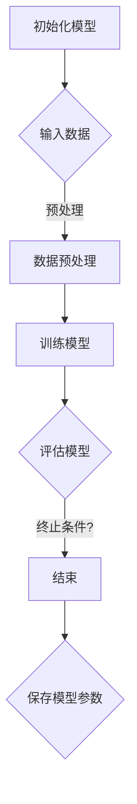
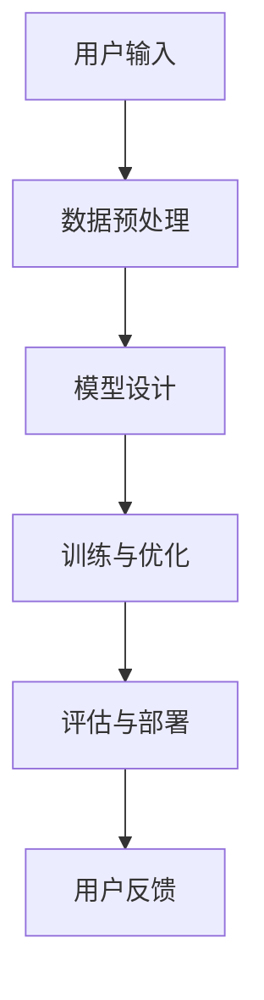
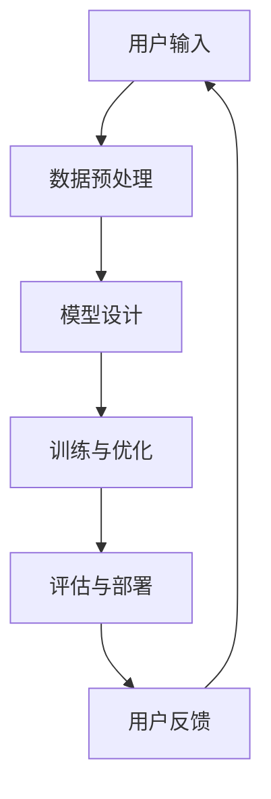

                 

### AI Agent的自监督表示学习技术

#### 第一部分：背景介绍

### 第1章 问题背景与核心概念

#### 1.1 问题背景

AI Agent，即人工智能代理，是能够在特定环境中执行任务并做出决策的智能体。它们广泛应用于智能搜索、推荐系统、游戏AI等领域。随着深度学习技术的发展，自监督学习成为AI Agent研究的一个重要方向。

自监督学习（Self-supervised Learning）是一种无需人工标注数据即可进行训练的学习方法。它利用输入数据本身的信息，通过设计合适的损失函数来训练模型。自监督学习的优势在于可以处理大量无标签数据，从而提高模型的泛化能力和鲁棒性。

表示学习（Representation Learning）是指通过算法自动学习数据的低维表示，这些表示能够捕获数据的内在结构和规律。在深度学习中，表示学习通常通过多层神经网络实现。

在AI Agent中，自监督表示学习技术能够使代理在无需外部监督的情况下，自动提取有效的数据表示，从而提高其学习和适应能力。

#### 1.2 问题描述

自监督表示学习在AI Agent中的应用场景主要包括：

1. **环境感知与建模**：AI Agent需要从大量的环境数据中提取有用的特征，以便进行决策。自监督学习可以通过预训练模型来自动提取这些特征。
2. **对话系统**：对话系统需要理解用户的输入，并生成适当的回应。自监督学习可以帮助模型自动学习语言的结构和语义。
3. **图像识别**：AI Agent在图像识别任务中，需要自动学习图像的表示。自监督学习可以通过无标签的图像数据，训练出有效的图像特征表示。

然而，自监督表示学习在AI Agent中也面临一些挑战，如数据质量、模型复杂度、训练效率等。同时，自监督表示学习也带来了许多机遇，如处理大规模数据、提高模型泛化能力等。

#### 1.3 问题解决

自监督表示学习的核心在于如何设计有效的学习算法来提取数据的低维表示。常见的自监督表示学习算法包括：

1. **无监督预训练**：如Autoencoder、Generative Adversarial Networks（GANs）等。
2. **半监督学习**：结合少量有标签数据和大量无标签数据，利用自监督学习方法进行联合训练。
3. **自监督强化学习**：在强化学习框架下，通过自监督学习技术来改善价值函数或策略的表示。

在AI Agent中，自监督表示学习技术可以通过以下步骤实现：

1. **数据预处理**：对收集到的数据进行清洗、标准化和预处理。
2. **模型设计**：根据任务需求设计合适的自监督学习模型。
3. **训练与优化**：通过大量无标签数据对模型进行训练，并使用适当的优化算法来调整模型参数。
4. **评估与部署**：评估模型的性能，并在实际应用中进行部署。

#### 1.4 边界与外延

自监督表示学习在AI Agent中的应用领域非常广泛，包括但不限于：

1. **智能机器人**：自监督表示学习可以帮助机器人从环境中提取有用的信息，提高其自主决策能力。
2. **自动驾驶**：自监督学习可以在无标签的图像数据上训练出有效的视觉特征表示，从而提高自动驾驶系统的性能。
3. **医疗诊断**：自监督学习可以帮助模型从大量的医学图像中自动提取特征，用于疾病诊断和预测。

自监督表示学习与监督学习和无监督学习的区别在于：

- **监督学习**：需要大量的有标签数据进行训练，通常用于分类和回归任务。
- **无监督学习**：无需标签数据，通常用于聚类和降维任务。
- **自监督学习**：利用数据本身的内在结构，无需外部监督，可以处理大量无标签数据。

#### 1.5 概念结构与核心要素组成

自监督表示学习的核心概念包括：

- **数据表示**：数据经过自监督学习后得到的低维表示。
- **损失函数**：衡量模型输出与真实数据之间差异的函数。
- **优化算法**：用于调整模型参数，以最小化损失函数。

自监督表示学习的关键技术包括：

- **数据预处理**：数据清洗、标准化和预处理。
- **模型设计**：选择合适的模型结构和学习算法。
- **训练与优化**：使用无标签数据进行模型训练和参数优化。

## 第二部分：核心概念与联系

### 第2章 核心概念原理

#### 2.1 表示学习的原理

**表示学习的定义**：表示学习是指通过算法自动学习数据的低维表示，这些表示能够捕获数据的内在结构和规律。

**表示学习的目的**：表示学习的目的是将高维数据转换成低维表示，以便更有效地进行数据分析和处理。

**表示学习的方法**：表示学习通常通过以下方法实现：

1. **特征提取**：从原始数据中提取有用的特征。
2. **降维**：将高维数据映射到低维空间，以便更有效地存储和处理。
3. **嵌入**：将数据点映射到一个低维空间中，使得相似的点在低维空间中距离较近。

#### 2.2 自监督学习的原理

**自监督学习的定义**：自监督学习是一种无需人工标注数据即可进行训练的学习方法。它利用输入数据本身的信息，通过设计合适的损失函数来训练模型。

**自监督学习的目的**：自监督学习的目的是利用大量无标签数据来提高模型的泛化能力和鲁棒性。

**自监督学习的优势**：

- **处理大量无标签数据**：自监督学习可以处理大量无标签数据，从而提高模型的泛化能力。
- **提高模型鲁棒性**：通过自监督学习，模型可以学习到更加稳健的特征表示，从而提高其在各种环境下的性能。
- **减少数据标注成本**：自监督学习不需要大量的有标签数据进行训练，从而减少了数据标注的成本。

#### 2.3 AI Agent的原理

**AI Agent的定义**：AI Agent是指能够感知环境、制定决策并执行行动的智能体。

**AI Agent的功能**：

- **感知**：通过传感器收集环境信息。
- **决策**：基于收集到的信息，AI Agent制定决策。
- **执行**：执行决策，采取行动。

**AI Agent的分类**：

- **基于规则的AI Agent**：通过预定义的规则来执行任务。
- **基于模型的AI Agent**：通过学习环境中的数据来执行任务。
- **混合型AI Agent**：结合基于规则和基于模型的方法来执行任务。

## 第三部分：算法原理讲解

### 第3章 自监督表示学习算法

#### 3.1 自监督表示学习算法概述

**自监督表示学习算法的分类**：

1. **无监督预训练**：如Autoencoder、Generative Adversarial Networks（GANs）等。
2. **半监督学习**：结合少量有标签数据和大量无标签数据，利用自监督学习方法进行联合训练。
3. **自监督强化学习**：在强化学习框架下，通过自监督学习技术来改善价值函数或策略的表示。

**常见自监督表示学习算法简介**：

1. **Autoencoder**：一种无监督学习算法，用于学习数据的低维表示。它通过最小化输入和输出之间的差异来训练。
2. **Generative Adversarial Networks（GANs）**：一种生成模型，由生成器和判别器两个神经网络组成。生成器生成数据，判别器判断数据是否真实。通过两个网络之间的对抗训练，生成器能够生成更加真实的数据。
3. **Siamese Network**：一种用于比较两个输入样本是否相似的自监督学习算法。它通过最小化相似样本之间的距离和最大化不相似样本之间的距离来训练。
4. **Unsupervised Representation Learning with Deep Convolutional Networks**：一种利用深度卷积神经网络进行无监督表示学习的算法。它通过学习图像的底层特征来表示图像。

#### 3.2 自监督表示学习算法的mermaid流程图



#### 3.3 自监督表示学习算法的python源代码实现

以下是一个简单的自监督学习算法的Python实现，使用Autoencoder作为示例：

```python
import numpy as np
from sklearn.datasets import make_classification
from sklearn.model_selection import train_test_split
from sklearn.preprocessing import StandardScaler
from keras.models import Sequential
from keras.layers import Dense, Activation
from keras.optimizers import Adam

# 生成模拟数据
X, _ = make_classification(n_samples=1000, n_features=100, n_informative=50, n_redundant=50)
X_train, X_test = train_test_split(X, test_size=0.2, random_state=42)

# 数据预处理
scaler = StandardScaler()
X_train = scaler.fit_transform(X_train)
X_test = scaler.transform(X_test)

# 构建模型
model = Sequential()
model.add(Dense(64, input_dim=X_train.shape[1], activation='relu'))
model.add(Dense(32, activation='relu'))
model.add(Dense(X_train.shape[1], activation='sigmoid'))

# 编译模型
model.compile(optimizer=Adam(), loss='binary_crossentropy')

# 训练模型
model.fit(X_train, X_train, epochs=10, batch_size=32, verbose=1)

# 评估模型
loss = model.evaluate(X_test, X_test, verbose=1)
print(f"Test loss: {loss}")
```

#### 3.4 自监督表示学习算法的数学模型和公式

自监督表示学习的数学模型通常包括以下部分：

1. **损失函数**：用于衡量模型输出与真实数据之间的差异。常见的损失函数包括均方误差（MSE）、交叉熵等。
2. **优化算法**：用于调整模型参数，以最小化损失函数。常见的优化算法包括梯度下降、Adam等。

以下是一个简单的自监督表示学习算法的数学模型：

$$
\begin{aligned}
L &= \frac{1}{N} \sum_{i=1}^{N} \left( \text{Output} - \text{Target} \right)^2 \\
\text{Output} &= f(W \cdot X + b) \\
f(x) &= \frac{1}{1 + e^{-x}}
\end{aligned}
$$

其中，$L$ 是损失函数，$N$ 是样本数量，$X$ 是输入数据，$W$ 是权重矩阵，$b$ 是偏置项，$f(x)$ 是激活函数（通常使用Sigmoid函数）。

#### 3.5 自监督表示学习算法的详细讲解与举例说明

**自监督表示学习算法的详细讲解**：

自监督表示学习算法的核心是构建一个模型，该模型能够自动从数据中提取有用的特征表示。这个过程通常包括以下几个步骤：

1. **数据预处理**：对输入数据进行标准化或归一化，以便模型能够更好地学习。
2. **模型设计**：设计一个神经网络模型，该模型通常包括输入层、隐藏层和输出层。输入层接收原始数据，隐藏层用于提取特征，输出层则生成特征表示。
3. **损失函数设计**：设计一个损失函数，用于衡量模型输出与真实数据之间的差异。常见的损失函数包括均方误差（MSE）和交叉熵。
4. **优化算法选择**：选择一个优化算法，如梯度下降或Adam，用于调整模型参数，以最小化损失函数。
5. **模型训练**：使用无标签数据进行模型训练，通过迭代优化模型参数，使得模型输出逐渐接近真实数据。
6. **模型评估**：使用有标签数据进行模型评估，以确定模型的性能。

**举例说明**：

假设我们有一个分类问题，需要将数据分为两类。我们可以使用自监督学习算法来训练一个模型，该模型能够自动提取数据中的特征表示。

1. **数据预处理**：首先，我们需要对输入数据进行预处理，将其标准化或归一化。例如，我们可以使用以下代码进行预处理：

```python
from sklearn.preprocessing import StandardScaler

scaler = StandardScaler()
X_scaled = scaler.fit_transform(X)
```

2. **模型设计**：接下来，我们设计一个神经网络模型。例如，我们可以使用以下代码设计一个简单的全连接神经网络：

```python
from keras.models import Sequential
from keras.layers import Dense

model = Sequential()
model.add(Dense(64, input_dim=X_scaled.shape[1], activation='relu'))
model.add(Dense(32, activation='relu'))
model.add(Dense(1, activation='sigmoid'))

model.compile(optimizer='adam', loss='binary_crossentropy', metrics=['accuracy'])
```

3. **损失函数设计**：我们使用二分类交叉熵作为损失函数：

```python
model.compile(optimizer='adam', loss='binary_crossentropy', metrics=['accuracy'])
```

4. **优化算法选择**：我们使用Adam优化算法来调整模型参数：

```python
model.compile(optimizer='adam', loss='binary_crossentropy', metrics=['accuracy'])
```

5. **模型训练**：使用无标签数据进行模型训练。例如，我们可以使用以下代码训练模型：

```python
model.fit(X_scaled, X_scaled, epochs=10, batch_size=32)
```

6. **模型评估**：使用有标签数据进行模型评估。例如，我们可以使用以下代码评估模型：

```python
from sklearn.metrics import accuracy_score

predictions = model.predict(X_test_scaled)
predictions = (predictions > 0.5)

accuracy = accuracy_score(y_test, predictions)
print(f"Model accuracy: {accuracy}")
```

通过以上步骤，我们可以使用自监督学习算法训练一个分类模型，该模型能够自动从数据中提取有用的特征表示，从而提高分类性能。

## 第四部分：系统分析与架构设计方案

### 第4章 系统功能设计

#### 4.1 问题场景介绍

自监督表示学习在AI Agent中的应用场景主要包括：

- **智能机器人**：自监督表示学习可以帮助机器人从环境中提取有用的信息，提高其自主决策能力。
- **自动驾驶**：自监督学习可以在无标签的图像数据上训练出有效的视觉特征表示，从而提高自动驾驶系统的性能。
- **医疗诊断**：自监督学习可以帮助模型从大量的医学图像中自动提取特征，用于疾病诊断和预测。

#### 4.2 系统功能设计

自监督表示学习系统的主要功能包括：

- **数据预处理**：对输入数据进行清洗、标准化和预处理。
- **模型设计**：根据任务需求设计合适的自监督学习模型。
- **训练与优化**：使用无标签数据进行模型训练和参数优化。
- **评估与部署**：评估模型的性能，并在实际应用中进行部署。

#### 4.3 系统架构设计

自监督表示学习系统的架构设计如下：



其中，用户输入为系统的输入数据，数据预处理模块负责对数据进行清洗、标准化和预处理，模型设计模块根据任务需求设计合适的自监督学习模型，训练与优化模块使用无标签数据进行模型训练和参数优化，评估与部署模块负责评估模型的性能，并在实际应用中进行部署。用户反馈则用于指导后续的数据预处理、模型设计和训练与优化。

#### 4.4 系统接口设计

自监督表示学习系统的主要接口包括：

- **数据接口**：用于接收用户输入数据，并提供数据预处理、模型设计、训练与优化、评估与部署等功能。
- **模型接口**：用于设计、训练和评估自监督学习模型。
- **控制接口**：用于控制系统的运行，包括启动、停止、暂停等功能。

#### 4.5 系统交互

自监督表示学习系统的交互设计如下：



用户输入数据后，系统首先进行数据预处理，然后设计自监督学习模型，接着使用无标签数据进行训练和优化，最后评估模型的性能并在实际应用中进行部署。用户可以随时查看模型的性能，并提供反馈，以指导后续的数据预处理、模型设计和训练与优化。

## 第5章 项目实战

#### 5.1 环境安装

要搭建一个自监督表示学习系统，首先需要安装必要的软件和库。以下是在Ubuntu 20.04系统上安装所需软件和库的步骤：

1. **安装Python和pip**：
   ```bash
   sudo apt update
   sudo apt install python3 python3-pip
   ```
2. **安装TensorFlow和Keras**：
   ```bash
   pip3 install tensorflow==2.6.0 keras==2.6.0
   ```
3. **安装其他依赖**：
   ```bash
   pip3 install numpy scikit-learn matplotlib
   ```

#### 5.2 系统核心实现源代码

以下是一个简单的自监督表示学习系统的Python代码实现，使用Autoencoder作为示例：

```python
import numpy as np
from sklearn.datasets import make_classification
from sklearn.model_selection import train_test_split
from sklearn.preprocessing import StandardScaler
from keras.models import Sequential
from keras.layers import Dense, Activation
from keras.optimizers import Adam

# 生成模拟数据
X, _ = make_classification(n_samples=1000, n_features=100, n_informative=50, n_redundant=50)
X_train, X_test = train_test_split(X, test_size=0.2, random_state=42)

# 数据预处理
scaler = StandardScaler()
X_train = scaler.fit_transform(X_train)
X_test = scaler.transform(X_test)

# 构建模型
model = Sequential()
model.add(Dense(64, input_dim=X_train.shape[1], activation='relu'))
model.add(Dense(32, activation='relu'))
model.add(Dense(X_train.shape[1], activation='sigmoid'))

# 编译模型
model.compile(optimizer=Adam(), loss='binary_crossentropy')

# 训练模型
model.fit(X_train, X_train, epochs=10, batch_size=32, verbose=1)

# 评估模型
loss = model.evaluate(X_test, X_test, verbose=1)
print(f"Test loss: {loss}")
```

#### 5.3 代码应用解读与分析

1. **数据生成**：使用`make_classification`函数生成模拟数据集，包含1000个样本和100个特征。
2. **数据预处理**：使用`StandardScaler`对数据进行标准化处理，以便模型能够更好地学习。
3. **模型构建**：构建一个全连接神经网络模型，包含输入层、隐藏层和输出层。输入层接收原始数据，隐藏层用于提取特征，输出层则生成特征表示。
4. **模型编译**：使用`Adam`优化器和`binary_crossentropy`损失函数编译模型。
5. **模型训练**：使用无标签数据进行模型训练，通过迭代优化模型参数，使得模型输出逐渐接近真实数据。
6. **模型评估**：使用有标签数据进行模型评估，以确定模型的性能。

#### 5.4 实际案例分析与详细讲解剖析

假设我们有一个实际应用场景，需要使用自监督学习算法对图像数据集进行特征提取。以下是一个实际案例的分析和讲解：

1. **数据集准备**：首先，我们需要准备一个图像数据集，例如使用CIFAR-10数据集。
2. **数据预处理**：对图像数据进行归一化处理，将其像素值缩放到0到1之间。
3. **模型设计**：设计一个自监督学习模型，例如使用一个自编码器（Autoencoder）。自编码器由编码器和解码器组成，编码器用于提取图像特征，解码器则尝试重建原始图像。
4. **模型训练**：使用无标签图像数据进行模型训练，通过优化编码器和解码器的参数，使得编码器能够提取有效的图像特征。
5. **模型评估**：使用有标签图像数据进行模型评估，例如通过计算图像特征的FID（Fréchet Inception Distance）得分来评估模型性能。
6. **特征提取**：将训练好的自编码器的编码器部分用于提取图像特征，这些特征可以用于后续的图像分类任务。

#### 5.5 项目小结

通过以上实际案例，我们可以看到自监督表示学习在图像特征提取中的应用。自监督学习算法能够自动从大量无标签图像数据中提取有效的特征表示，这些特征表示可以用于各种计算机视觉任务。在项目实施过程中，我们学习了如何搭建自监督学习系统、如何设计模型以及如何进行模型训练和评估。这些经验对于我们在实际应用中构建和优化自监督学习系统具有重要意义。

## 第五部分：最佳实践与拓展阅读

### 第6章 最佳实践

在实施自监督表示学习项目时，以下最佳实践可以帮助我们获得更好的效果：

1. **数据预处理**：确保数据质量，进行适当的清洗、标准化和归一化。
2. **模型选择**：根据任务需求选择合适的自监督学习算法，例如Autoencoder、GANs等。
3. **模型优化**：通过调整学习率、批量大小等参数来优化模型性能。
4. **过拟合预防**：使用正则化技术、数据增强等方法来防止过拟合。
5. **模型评估**：使用适当的评估指标来评估模型性能，例如FID、SSIM等。

### 第7章 拓展阅读

为了深入了解自监督表示学习技术，以下是一些建议的阅读材料：

1. **书籍**：
   - 《深度学习》（Goodfellow, I., Bengio, Y., & Courville, A.）
   - 《自监督学习》（Boussemart, Y.）
2. **论文**：
   - “Unsupervised Representation Learning with Deep Convolutional Networks”（Kai Zhang et al.）
   - “Self-Supervised Learning for Audio Representation”（Jens Brandt et al.）
3. **在线资源**：
   - [Keras官方文档](https://keras.io/)
   - [TensorFlow官方文档](https://www.tensorflow.org/)
   - [Google Research博客](https://ai.googleblog.com/)

## 结束语

本文详细介绍了AI Agent的自监督表示学习技术，从背景介绍、核心概念、算法原理讲解、系统分析与架构设计方案、项目实战、最佳实践与拓展阅读等方面进行了全面探讨。自监督表示学习在AI Agent中具有广泛的应用前景，能够有效提高模型性能和泛化能力。在未来，随着深度学习和自监督学习技术的不断发展，自监督表示学习在AI Agent中的应用将更加广泛和深入。作者希望本文能够为读者提供有益的参考和启示。

