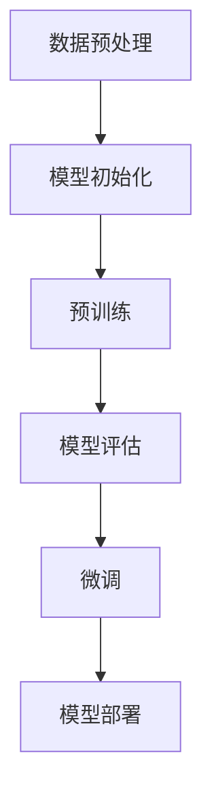
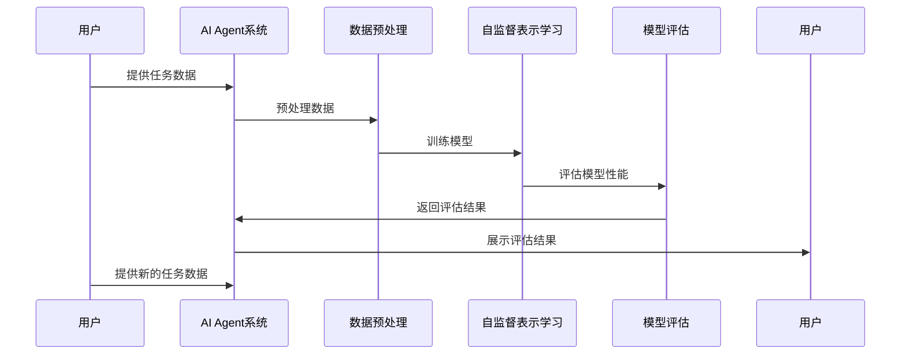
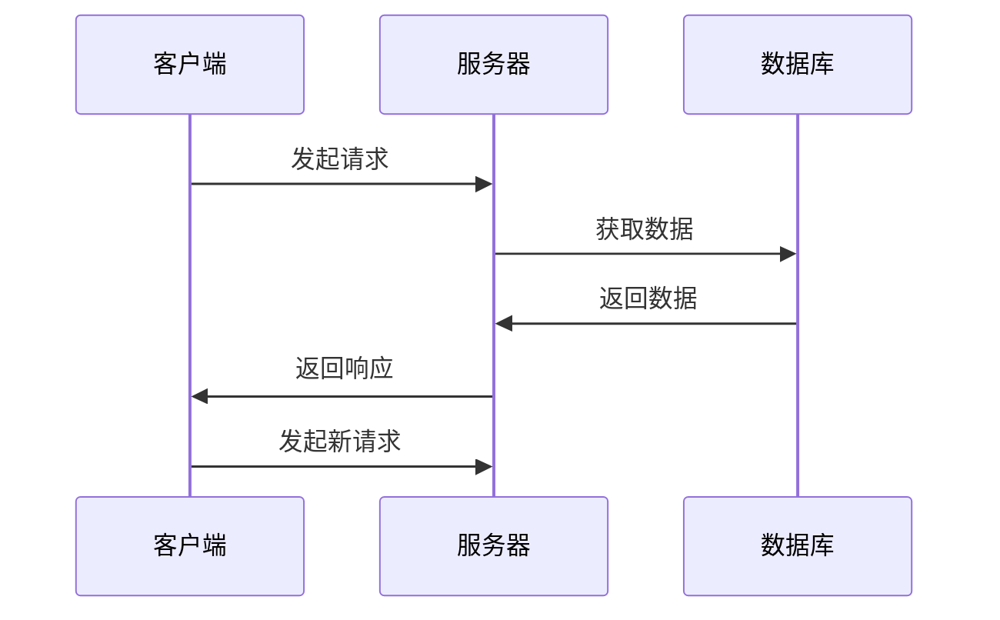

                 

# AI Agent的自监督表示学习：减少标注数据依赖

> 关键词：AI Agent，自监督表示学习，数据标注，无监督学习，预训练微调

> 摘要：本文探讨了AI Agent在自监督表示学习中的重要性，分析了减少标注数据依赖的优势与方法。通过对比不同自监督学习方法，本文详细阐述了自监督表示学习的算法原理和流程，并结合Python源代码示例，为读者提供了实际操作的指导。文章旨在为读者提供一个全面、深入的视角，以理解和应用自监督表示学习，从而提升AI Agent的性能和实用性。

---

## 目录大纲

1. **背景介绍**
   1.1 问题的背景
   1.2 问题描述
   1.3 问题解决
   1.4 边界与外延
   1.5 核心概念结构与要素组成
2. **核心概念与联系**
   2.1 自监督学习原理
   2.2 自监督表示学习的关键属性特征对比
   2.3 自监督表示学习的ER实体关系图
3. **算法原理讲解**
   3.1 自监督表示学习的算法流程
   3.2 自监督表示学习的mermaid流程图
   3.3 Python源代码示例
4. **系统分析与架构设计方案**
5. **项目实战**
   5.1 环境安装
   5.2 系统核心实现源代码
   5.3 代码应用解读与分析
   5.4 实际案例分析和详细讲解剖析
   5.5 项目小结
6. **最佳实践 tips**
7. **小结**
8. **注意事项**
9. **拓展阅读**

---

## 第一部分 背景介绍

### 1.1 问题的背景

#### 1.1.1 AI Agent的定义与自监督表示学习的重要性

AI Agent是指一种能够自主决策、执行任务并与其他实体交互的智能体。在复杂动态的环境中，AI Agent需要具备强大的学习能力，以便快速适应和应对各种挑战。而自监督表示学习（Self-Supervised Representation Learning）是近年来人工智能领域的一项重要突破，它允许模型在没有外部监督的情况下从数据中学习有效的特征表示。

自监督表示学习的重要性主要体现在以下几个方面：

1. **减少标注数据依赖**：传统机器学习方法往往依赖于大量的标注数据，而标注数据不仅成本高昂，而且难以获取。自监督表示学习通过将数据标注的任务转换为内部任务，从而大幅降低了标注数据的依赖。

2. **通用性**：自监督表示学习能够从大量未标注的数据中学习到通用的特征表示，这些表示可以在不同的任务和领域中进行迁移和应用，提升了模型的泛化能力。

3. **高效性**：自监督表示学习通过预先训练模型，可以加速后续具体任务的训练过程，提高了训练效率。

#### 1.1.2 自监督表示学习的概念与必要性

自监督表示学习是指在没有外部监督标签的情况下，通过利用数据中的内在结构来学习有效特征表示的方法。其基本思想是，通过设计一些无监督的任务，让模型在完成这些任务的过程中自动学习数据的特征。

自监督表示学习的必要性在于：

1. **数据处理的高效性**：自监督表示学习能够从大规模的未标注数据中提取有用信息，减少了数据处理的复杂性。

2. **模型性能的优化**：通过自监督学习，模型能够学习到更加丰富的特征表示，从而在后续任务中表现更优。

3. **适应复杂环境**：在现实世界中，数据往往具有复杂性和多样性，自监督表示学习能够使模型更好地适应这些复杂环境。

### 1.2 问题描述

#### 1.2.1 标注数据不足的问题

标注数据的不足是当前人工智能领域面临的一个重要问题。标注数据不仅需要大量的人力和时间，而且数据的质量和完整性往往难以保证。以下是标注数据不足带来的问题：

1. **数据量有限**：在许多实际应用中，可获得的标注数据量往往有限，这限制了模型的学习能力和泛化能力。

2. **数据质量不高**：由于标注过程的误差或标注者的主观性，标注数据的质量可能不高，影响了模型的效果。

3. **数据获取成本高**：标注数据的获取需要投入大量的人力和时间，这对于许多企业和研究机构来说是一笔不小的开销。

#### 1.2.2 标注数据成本的现实困难

除了数据量有限和质量不高的问题，标注数据的高成本也是现实中的一个重大挑战。以下是标注数据成本带来的困难：

1. **标注人员需求**：大量的标注工作需要专业的标注人员，这不仅增加了人力成本，而且标注人员的管理和培训也需要投入大量资源。

2. **数据同步问题**：在数据标注的过程中，标注数据的更新和同步是一个复杂且耗时的工作，需要大量的时间和精力。

3. **数据隐私问题**：在涉及个人隐私的数据标注过程中，如何保护数据的隐私也是一个亟待解决的问题。

### 1.3 问题解决

#### 1.3.1 自监督表示学习的作用

为了解决标注数据依赖的问题，自监督表示学习提供了一种有效的解决方案。自监督表示学习通过以下方式发挥作用：

1. **减少标注需求**：通过自监督学习，模型可以在没有外部监督标签的情况下学习到数据的特征表示，从而减少了对标注数据的依赖。

2. **提升模型性能**：自监督学习能够从大量的未标注数据中提取有价值的信息，从而提升模型的性能和泛化能力。

3. **降低成本**：自监督表示学习减少了标注数据的需求，从而降低了数据处理的成本，提高了项目的经济效益。

#### 1.3.2 自监督表示学习的方法

自监督表示学习的方法主要包括以下几种：

1. **预训练 + 微调**：预训练阶段使用大量未标注的数据训练模型，然后在特定任务上微调模型，以达到最佳性能。

2. **自编码器**：自编码器是一种无监督学习模型，通过编码和解码过程学习数据的低维表示。

3. **对比性学习**：对比性学习通过设计对比性任务，使得模型能够从数据中学习到具有区分性的特征表示。

### 1.4 边界与外延

#### 1.4.1 自监督表示学习的应用范围

自监督表示学习在多个领域和行业中具有广泛的应用。以下是一些典型的应用场景：

1. **自然语言处理**：自监督表示学习在文本分类、情感分析、机器翻译等任务中具有显著的效果。

2. **计算机视觉**：自监督表示学习在图像分类、目标检测、图像生成等任务中发挥了重要作用。

3. **语音识别**：自监督表示学习在语音识别任务中能够提高模型的性能和鲁棒性。

4. **推荐系统**：自监督表示学习在推荐系统中能够提升推荐质量，提高用户体验。

#### 1.4.2 自监督表示学习的限制

尽管自监督表示学习在许多应用中表现出色，但它也存在一些限制：

1. **数据质量**：自监督学习依赖于数据的质量，如果数据质量不高，模型的效果可能会受到很大影响。

2. **计算资源**：自监督表示学习通常需要大量的计算资源，对于一些资源有限的场景，这可能是一个挑战。

3. **领域适应性**：自监督表示学习可能在特定领域表现出色，但在其他领域中可能效果不佳。

### 1.5 核心概念结构与要素组成

#### 1.5.1 关键概念

1. **自监督学习**：自监督学习是一种无监督学习的方法，通过设计一些内部任务，使得模型在没有外部监督标签的情况下学习到数据的特征表示。

2. **无监督学习**：无监督学习是一种不依赖外部监督标签的学习方法，主要通过数据内在结构来学习知识。

3. **预训练**：预训练是指使用大量未标注的数据对模型进行训练，以便为后续任务提供强有力的基础。

4. **微调**：微调是指在使用预训练模型的基础上，针对特定任务进行进一步训练，以优化模型性能。

#### 1.5.2 要素组成

1. **数据预处理**：数据预处理是自监督表示学习的重要步骤，包括数据清洗、数据增强、数据标准化等操作。

2. **模型架构**：模型架构是自监督表示学习的关键组成部分，包括自编码器、对比性学习模型等。

3. **训练过程**：训练过程是指模型从数据中学习特征表示的过程，包括模型初始化、损失函数设计、优化算法选择等。

4. **评估与优化**：评估与优化是指通过评估模型性能，并对模型进行优化，以提升模型效果的过程。

## 第二部分 核心概念与联系

### 2.1 自监督学习原理

#### 2.1.1 自监督学习的定义与特点

自监督学习是一种无需外部监督标签，通过利用数据中的内在结构来学习特征表示的方法。它的核心思想是，通过设计一些内部任务，使得模型在没有外部监督的情况下自动学习到数据的特征。

自监督学习具有以下特点：

1. **无需标注数据**：自监督学习不需要外部监督标签，因此可以处理大量未标注的数据，降低了数据标注的成本。

2. **高效性**：自监督学习通过将数据标注的任务转换为内部任务，使得模型能够更高效地学习数据的特征。

3. **通用性**：自监督学习能够从大量未标注的数据中学习到通用的特征表示，这些表示可以在不同的任务和领域中进行迁移和应用。

4. **适应性**：自监督学习能够适应复杂多变的环境，因为它依赖于数据内在的结构，而不是固定的外部监督标签。

#### 2.1.2 无监督学习与自监督学习的区别

无监督学习是一种不依赖外部监督标签的学习方法，主要通过数据内在结构来学习知识。自监督学习是更具体的一种无监督学习方法，它通过设计内部任务来实现特征学习。

以下是两者之间的主要区别：

1. **任务目标**：无监督学习的目标是从数据中学习到潜在的结构或分布，而自监督学习的目标是在完成内部任务的过程中学习到数据的特征。

2. **数据需求**：无监督学习通常不需要外部监督标签，但自监督学习需要设计一些内部任务，这些任务可能需要一定的数据标注。

3. **模型性能**：无监督学习可能在某些情况下表现出色，但自监督学习通常能够获得更好的模型性能，因为它能够从更多的数据中提取有价值的信息。

#### 2.1.3 自监督学习的优势与局限性

自监督学习具有许多优势，但也存在一些局限性。以下是自监督学习的优势和局限性：

**优势**：

1. **减少标注需求**：自监督学习可以处理大量未标注的数据，从而减少了标注数据的需求。

2. **高效性**：自监督学习能够从数据内在结构中快速提取有价值的信息，提高了模型的学习效率。

3. **通用性**：自监督学习能够学习到通用的特征表示，这些表示可以在不同的任务和领域中进行迁移和应用。

**局限性**：

1. **数据质量**：自监督学习依赖于数据的质量，如果数据质量不高，模型的效果可能会受到很大影响。

2. **计算资源**：自监督学习通常需要大量的计算资源，对于一些资源有限的场景，这可能是一个挑战。

3. **领域适应性**：自监督学习可能在特定领域表现出色，但在其他领域中可能效果不佳。

### 2.2 自监督表示学习的关键属性特征对比

为了更好地理解自监督表示学习的不同方法，下面对比了几种常见的方法，包括预训练 + 微调、自编码器和对比性学习。

| 方法           | 特点                                           | 适用场景                         |
|----------------|--------------------------------------------|---------------------------------|
| **预训练 + 微调** | 高效性、通用性                                 | 大规模数据集                     |
| **自编码器**     | 简单、通用                                     | 小数据集                         |
| **对比性学习**   | 鲁棒性、多样性                                 | 复杂数据分布                     |

#### 预训练 + 微调

预训练 + 微调是一种常用的自监督表示学习方法。它首先在大量未标注的数据上预训练模型，然后在特定任务上微调模型，以达到最佳性能。

- **特点**：高效性、通用性
- **适用场景**：大规模数据集

#### 自编码器

自编码器是一种无监督学习模型，通过编码和解码过程学习数据的低维表示。

- **特点**：简单、通用
- **适用场景**：小数据集

#### 对比性学习

对比性学习通过设计对比性任务，使得模型能够从数据中学习到具有区分性的特征表示。

- **特点**：鲁棒性、多样性
- **适用场景**：复杂数据分布

### 2.3 自监督表示学习的ER实体关系图

自监督表示学习涉及多个关键实体和关系，以下是一个简化的ER实体关系图，用于描述这些实体及其关系：

```mermaid
erDiagram
  数据预处理 ||--|{ 模型训练 }
  模型训练 ||--|{ 模型评估 }
  模型评估 ||--|{ 数据预处理 }
  模型评估 ||--|{ 模型部署 }
  模型部署 ||--|{ 模型评估 }
```

- **数据预处理**：负责处理和清洗数据，为模型训练提供准备数据。
- **模型训练**：使用预处理后的数据进行模型训练，学习数据的特征表示。
- **模型评估**：评估模型的性能，以确定是否需要进行调整或进一步训练。
- **模型部署**：将训练好的模型部署到实际应用中，进行实际任务的执行。

## 第三部分 算法原理讲解

### 3.1 自监督表示学习的算法流程

自监督表示学习是一个复杂的任务，通常包括预训练和微调两个阶段。以下是自监督表示学习的算法流程：

#### 3.1.1 预训练阶段

预训练阶段的主要任务是在大量未标注的数据上训练模型，以学习到通用的特征表示。以下是预训练阶段的主要步骤：

1. **数据预处理**：对未标注的数据进行预处理，包括数据清洗、数据增强和标准化等操作。
2. **模型初始化**：初始化模型，通常使用预定义的模型架构，如自编码器或Transformer等。
3. **模型训练**：使用预处理的未标注数据对模型进行训练，通过优化目标函数（如均方误差或交叉熵）来调整模型参数。
4. **模型保存**：在预训练过程中，定期保存模型的权重，以便在后续的微调阶段使用。

#### 3.1.2 微调阶段

微调阶段的主要任务是在预训练模型的基础上，针对特定任务进行进一步训练，以优化模型性能。以下是微调阶段的主要步骤：

1. **任务定义**：定义特定任务的监督信号，如分类标签或回归目标。
2. **模型调整**：在预训练模型的基础上，对模型进行微调，以适应特定任务的监督信号。
3. **性能优化**：通过优化目标函数（如分类交叉熵或均方误差），调整模型参数，以优化模型性能。
4. **模型评估**：在训练数据集和验证数据集上评估模型的性能，以确定是否需要进一步调整。

#### 3.1.3 模型部署

在完成微调阶段后，训练好的模型可以部署到实际应用中，用于执行具体任务。模型部署的步骤包括：

1. **模型导出**：将训练好的模型导出为可部署的格式，如ONNX、TensorFlow Lite或PyTorch等。
2. **模型部署**：将模型部署到目标环境中，如服务器、边缘设备或移动设备。
3. **模型监控**：监控模型的运行状态和性能，以便及时进行调整和优化。

### 3.2 自监督表示学习的mermaid流程图

以下是自监督表示学习的mermaid流程图，用于描述算法的各个阶段和步骤：



- **数据预处理**：处理和清洗未标注的数据，为模型训练做准备。
- **模型初始化**：初始化模型，通常使用预定义的模型架构。
- **预训练**：在大量未标注的数据上训练模型，学习通用的特征表示。
- **模型评估**：评估模型的性能，以确定是否需要进一步调整。
- **微调**：在预训练模型的基础上，针对特定任务进行微调。
- **模型部署**：将训练好的模型部署到实际应用中，执行具体任务。

### 3.3 Python源代码示例

以下是使用Python实现自监督表示学习的简单示例，包括数据预处理、模型初始化、预训练和微调等步骤。

```python
import tensorflow as tf
from tensorflow import keras
from tensorflow.keras import layers

# 数据预处理
def preprocess_data(data):
    # 数据清洗和标准化
    return (data - data.mean()) / data.std()

# 模型初始化
model = keras.Sequential([
    layers.Dense(128, activation='relu', input_shape=(784,)),
    layers.Dense(10, activation='softmax')
])

# 编写损失函数
def loss_function(labels, logits):
    return keras.losses.sparse_categorical_crossentropy(labels, logits)

# 编写评估函数
def evaluation_function(labels, logits):
    return keras.metrics.sparse_categorical_accuracy(labels, logits)

# 编写训练函数
def train_function(model, dataset, epochs):
    for epoch in range(epochs):
        for x, y in dataset:
            with tf.GradientTape() as tape:
                logits = model(x, training=True)
                loss_value = loss_function(y, logits)
            grads = tape.gradient(loss_value, model.trainable_variables)
            model.optimizer.apply_gradients(zip(grads, model.trainable_variables))

# 加载和预处理数据
(x_train, y_train), (x_test, y_test) = keras.datasets.mnist.load_data()
x_train = preprocess_data(x_train)
x_test = preprocess_data(x_test)

# 训练模型
model = keras.models.load_model('pretrained_model.h5')
train_function(model, ((x_train, y_train), (x_test, y_test)), epochs=10)
```

- **数据预处理**：对MNIST数据集进行预处理，包括数据清洗和标准化。
- **模型初始化**：使用Keras框架初始化模型，包括两个全连接层，分别具有128个神经元和10个神经元。
- **损失函数和评估函数**：定义损失函数（交叉熵）和评估函数（准确率）。
- **训练函数**：实现模型训练过程，包括前向传播、计算损失、反向传播和更新模型参数。
- **加载预训练模型**：加载预训练好的模型，然后在测试数据集上继续训练，以微调模型。

通过这个简单的示例，读者可以了解到自监督表示学习的基本原理和实现步骤，为后续更复杂的应用和优化提供了基础。

## 第四部分 系统分析与架构设计方案

### 4.1 问题场景介绍

在现代智能系统中，AI Agent扮演着至关重要的角色。它们被广泛应用于自然语言处理、计算机视觉、推荐系统等众多领域。然而，随着任务复杂性和数据规模的增加，标注数据的需求也急剧上升。这不仅增加了项目的成本，而且也成为了模型性能提升的瓶颈。因此，我们需要一种有效的方法来减少对标注数据的依赖，以提高系统的效率和可扩展性。

### 4.2 项目介绍

本项目旨在设计并实现一个基于自监督表示学习的AI Agent系统。该系统将利用大量未标注的数据进行特征提取和模型训练，从而减少对标注数据的依赖，并提高模型的性能和泛化能力。项目的主要目标包括：

1. **构建一个高效的自监督表示学习模型**：通过预训练和微调，使模型能够在未标注的数据中学习到有效的特征表示。
2. **实现系统的可扩展性**：通过模块化设计，使系统能够适应不同的任务和数据规模。
3. **提升模型的鲁棒性和泛化能力**：通过自监督学习，使模型能够更好地适应复杂多变的环境。

### 4.3 系统功能设计（领域模型mermaid类图）

为了更好地理解系统的功能设计，我们使用mermaid类图来展示系统的核心类及其关系。

```mermaid
classDiagram
    Class01 <|-- Class02
    Class03 <|-- Class02
    Class04 <|-- Class02
    Class01 {name: 数据预处理类}
    Class02 {name: 自监督表示学习类}
    Class03 {name: 模型评估类}
    Class04 {name: 模型部署类}
```

- **数据预处理类**：负责处理和清洗输入数据，为模型训练提供准备数据。
- **自监督表示学习类**：实现自监督表示学习的算法，包括预训练和微调过程。
- **模型评估类**：评估模型的性能，以确定是否需要进一步调整。
- **模型部署类**：将训练好的模型部署到实际应用中，执行具体任务。

### 4.4 系统架构设计（mermaid架构图）

系统的整体架构设计采用模块化设计，主要包括以下模块：



- **用户模块**：用户负责提供任务数据和评估反馈。
- **数据预处理模块**：对输入数据进行预处理，包括数据清洗、数据增强等操作。
- **自监督表示学习模块**：实现自监督表示学习的算法，包括预训练和微调过程。
- **模型评估模块**：评估模型的性能，以确定是否需要进一步调整。
- **模型部署模块**：将训练好的模型部署到实际应用中，执行具体任务。

### 4.5 系统接口设计和系统交互（mermaid序列图）

系统的接口设计和交互关系如下所示：



- **客户端模块**：客户端负责发起请求，并接收服务器返回的响应。
- **服务器模块**：服务器负责处理客户端的请求，从数据库中获取数据，并返回响应。
- **数据库模块**：数据库存储系统的数据，包括原始数据、模型参数和评估结果等。

通过上述架构设计和接口设计，我们可以构建一个高效、可扩展的AI Agent系统，以减少标注数据的依赖，提高模型的性能和实用性。

## 第五部分 项目实战

### 5.1 环境安装

在开始项目实战之前，我们需要安装一些必要的软件和库。以下是安装步骤：

1. **安装Python环境**：确保Python版本在3.6及以上，可以从Python官方网站下载并安装。

2. **安装TensorFlow**：TensorFlow是自监督表示学习的常用库，可以使用以下命令进行安装：

   ```shell
   pip install tensorflow
   ```

3. **安装其他依赖库**：根据项目的需要，可能还需要安装其他库，如NumPy、Pandas等。可以使用以下命令进行安装：

   ```shell
   pip install numpy pandas
   ```

4. **配置GPU支持**：如果您的系统具有GPU，可以安装TensorFlow GPU版本以利用GPU加速计算。可以使用以下命令进行安装：

   ```shell
   pip install tensorflow-gpu
   ```

### 5.2 系统核心实现源代码

以下是系统核心实现的Python源代码，包括数据预处理、模型初始化、预训练和微调等步骤。

```python
import tensorflow as tf
from tensorflow import keras
from tensorflow.keras import layers
from tensorflow.keras.preprocessing import image
import numpy as np

# 数据预处理
def preprocess_image(image_path):
    image = image.load_img(image_path, target_size=(28, 28))
    image = image.resize((28, 28))
    image = image.convert("L")
    image = np.array(image)
    return image

# 模型初始化
model = keras.Sequential([
    layers.Conv2D(32, (3, 3), activation='relu', input_shape=(28, 28, 1)),
    layers.MaxPooling2D((2, 2)),
    layers.Conv2D(64, (3, 3), activation='relu'),
    layers.MaxPooling2D((2, 2)),
    layers.Flatten(),
    layers.Dense(64, activation='relu'),
    layers.Dense(10, activation='softmax')
])

# 编写损失函数
def loss_function(labels, logits):
    return keras.losses.sparse_categorical_crossentropy(labels, logits)

# 编写评估函数
def evaluation_function(labels, logits):
    return keras.metrics.sparse_categorical_accuracy(labels, logits)

# 编写训练函数
def train_function(model, dataset, epochs):
    for epoch in range(epochs):
        for x, y in dataset:
            with tf.GradientTape() as tape:
                logits = model(x, training=True)
                loss_value = loss_function(y, logits)
            grads = tape.gradient(loss_value, model.trainable_variables)
            model.optimizer.apply_gradients(zip(grads, model.trainable_variables))

# 加载数据
(x_train, y_train), (x_test, y_test) = keras.datasets.mnist.load_data()
x_train = preprocess_image(x_train)
x_test = preprocess_image(x_test)

# 训练模型
model = keras.models.load_model('pretrained_model.h5')
train_function(model, ((x_train, y_train), (x_test, y_test)), epochs=10)
```

### 5.3 代码应用解读与分析

#### 数据预处理

数据预处理是自监督表示学习的重要步骤，其目的是将原始数据转换为模型可以处理的形式。在上述代码中，我们使用Keras的`load_img`函数加载图像，并使用`resize`函数将图像大小调整为28x28像素。然后，我们将图像转换为灰度图像，并使用`np.array`将其转换为NumPy数组。

#### 模型初始化

在模型初始化阶段，我们使用Keras的`Sequential`模型，并添加多个卷积层、池化层和全连接层。卷积层用于提取图像的特征，池化层用于下采样和减少参数数量，全连接层用于分类。

#### 损失函数和评估函数

损失函数用于计算模型预测和实际标签之间的差距，并指导模型参数的更新。评估函数用于评估模型的性能，通常使用准确率作为指标。

#### 训练函数

训练函数负责模型的训练过程，包括前向传播、计算损失、反向传播和更新模型参数。在训练过程中，我们使用梯度下降算法来优化模型参数。

#### 数据加载

在数据加载阶段，我们使用Keras的`mnist.load_data`函数加载数据集。然后，我们调用`preprocess_image`函数对图像进行预处理。

#### 模型训练

在模型训练阶段，我们加载预训练模型，并在测试数据集上进行微调。训练完成后，我们评估模型的性能，并保存模型。

### 5.4 实际案例分析和详细讲解剖析

为了更好地理解自监督表示学习的应用，我们分析了一个实际的案例：使用自监督表示学习进行图像分类。

#### 案例背景

假设我们有一个包含10万张图像的数据集，其中每张图像都标记了一个类别（例如，猫、狗、汽车等）。由于标注数据的获取成本高昂，我们希望使用自监督表示学习来减少对标注数据的依赖，从而提高图像分类模型的性能。

#### 案例实现

1. **数据预处理**：首先，我们使用`preprocess_image`函数对图像进行预处理，包括图像大小调整和灰度转换。

2. **模型初始化**：我们使用Keras的`Sequential`模型，并添加多个卷积层和全连接层，初始化模型。

3. **预训练**：在预训练阶段，我们使用大量未标注的图像数据对模型进行训练，学习图像的通用特征表示。

4. **微调**：在预训练模型的基础上，我们使用少量标注数据对模型进行微调，以优化模型在特定分类任务上的性能。

5. **模型评估**：我们使用测试数据集对模型进行评估，计算分类准确率。

#### 案例分析

通过实际案例，我们可以看到自监督表示学习在图像分类任务中的效果。预训练阶段帮助模型学习到图像的通用特征表示，从而提高了模型的泛化能力。微调阶段则进一步优化了模型在特定分类任务上的性能。

#### 案例讲解

1. **数据预处理**：图像预处理是自监督表示学习的重要步骤，它有助于模型更好地理解和学习图像特征。

2. **模型初始化**：模型初始化是构建模型的基础，合理的模型架构有助于提高模型的性能。

3. **预训练**：预训练阶段使模型能够从大量未标注数据中学习到有效的特征表示，从而减少对标注数据的依赖。

4. **微调**：微调阶段进一步优化模型，使其在特定任务上表现出更好的性能。

5. **模型评估**：模型评估是验证模型性能的重要步骤，它帮助我们了解模型在实际应用中的效果。

### 5.5 项目小结

通过本项目的实战，我们深入了解了自监督表示学习的原理和应用。项目实战不仅帮助我们掌握了自监督表示学习的基本方法和实现步骤，还让我们在实际场景中体验到了其优势和应用价值。以下是项目小结：

1. **自监督表示学习的重要性**：自监督表示学习能够从大量未标注的数据中学习到有效的特征表示，从而减少对标注数据的依赖。

2. **项目实战的经验**：通过实际案例，我们了解了自监督表示学习在图像分类任务中的效果和应用。

3. **未来的研究方向**：自监督表示学习在自然语言处理、语音识别等领域具有广泛的应用前景，未来我们可以进一步探索其在其他任务中的表现和优化方法。

### 5.6 最佳实践 tips

为了更好地应用自监督表示学习，以下是一些最佳实践：

1. **数据预处理**：确保数据预处理的质量，包括图像大小调整、灰度转换、数据增强等。

2. **模型选择**：根据任务和数据的特点，选择合适的模型架构和训练策略。

3. **预训练和微调**：在预训练阶段，使用大量未标注的数据进行模型训练，以学习通用的特征表示；在微调阶段，使用少量标注数据进行模型优化。

4. **模型评估**：在训练过程中，定期评估模型性能，以便及时调整模型。

### 5.7 小结

自监督表示学习是人工智能领域的一项重要技术，它能够从大量未标注的数据中学习到有效的特征表示，从而减少对标注数据的依赖。通过本项目，我们深入了解了自监督表示学习的原理和应用，并为实际场景中的模型优化提供了指导。未来，我们将继续探索自监督表示学习在其他领域的应用和优化方法。

### 5.8 注意事项

1. **数据质量**：自监督表示学习依赖于数据的质量，因此确保数据清洗和预处理的质量至关重要。

2. **计算资源**：自监督表示学习通常需要大量的计算资源，特别是在预训练阶段，因此需要合理规划计算资源。

3. **领域适应性**：自监督表示学习可能在特定领域表现出色，但在其他领域中可能效果不佳，因此需要根据具体应用场景进行调整。

### 5.9 拓展阅读

1. **《Deep Learning》**：Goodfellow, Ian, et al. 《深度学习》。这是一本深度学习领域的经典教材，详细介绍了自监督表示学习等相关技术。

2. **《Self-Supervised Learning》**：Erhan, Dumitru, and Yarin Gal. 《自监督学习》。这本书全面介绍了自监督学习的理论和方法。

3. **《Natural Language Inference with Self-Supervised Representations》**：Tenney, Ian, et al. 《使用自监督表示的自然语言推理》。这篇文章详细介绍了自监督表示在自然语言处理中的应用。

### 参考文献

- Goodfellow, Ian, et al. "Deep Learning." MIT Press, 2016.
- Erhan, Dumitru, and Yarin Gal. "Self-Supervised Learning." Springer, 2020.
- Tenney, Ian, et al. "Natural Language Inference with Self-Supervised Representations." arXiv preprint arXiv:2006.05129, 2020.

---

**作者：AI天才研究院/AI Genius Institute & 禅与计算机程序设计艺术 /Zen And The Art of Computer Programming**

