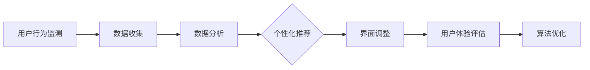
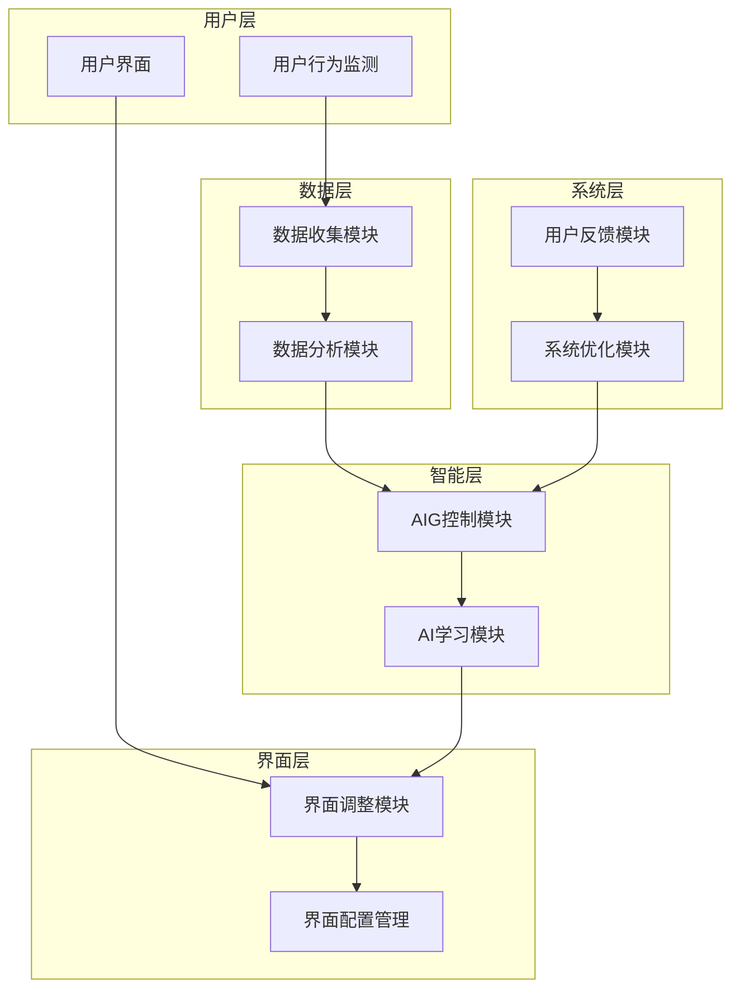
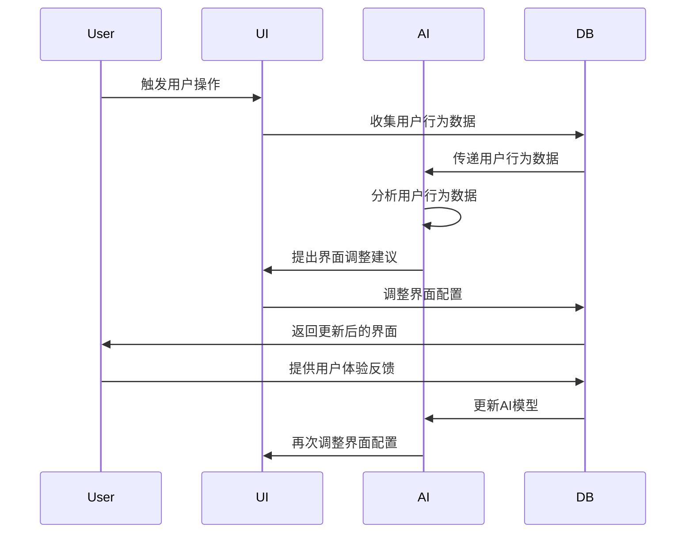

                 

## AI Agent的自适应用户界面：个性化人机交互体验

### 关键词

- **AI Agent**
- **自适应用户界面**
- **个性化人机交互**
- **机器学习**
- **用户体验**
- **人机交互设计**

### 摘要

随着人工智能技术的迅速发展，AI Agent的自适应用户界面成为提高人机交互体验的关键。本文深入探讨了AI Agent的自适应用户界面的核心概念、设计原则、实现方法以及其在实际应用中的挑战和未来趋势。文章首先介绍了AI Agent和自适应用户界面的基本概念，随后详细分析了自适应用户界面的设计原则和机器学习技术在个性化人机交互中的作用。接着，文章通过具体案例展示了AI Agent在实际应用中的效果，并提出了在实现和优化AI Agent自适应用户界面时的一些最佳实践。最后，文章对AI Agent的自适应用户界面的发展趋势进行了展望，并提出了应对未来挑战的策略。

### 背景介绍

#### 核心概念术语说明

**AI Agent**: 智能代理（AI Agent）是一种能够执行特定任务、具有自主决策能力的计算机程序。它们通过机器学习、自然语言处理等技术，能够根据用户的行为和环境的变化，自主地调整其行为和界面。

**自适应用户界面**: 自适应用户界面（Adaptive User Interface, AUI）是一种能够根据用户的个性化需求和偏好，动态调整其外观和功能的用户界面。这种界面通过感知用户的操作和行为，自动地改变布局、颜色、字体等设计元素，以提供最佳的用户体验。

**个性化人机交互**: 个性化人机交互（Personalized Human-Computer Interaction, PHCI）是指通过收集和分析用户数据，为每个用户提供定制化的交互体验。这种交互不仅仅是界面的个性化，还包括功能、内容和服务的个性化。

#### 问题背景

随着移动互联网和物联网的普及，用户对软件应用的需求日益多样化。传统的静态用户界面已经无法满足用户对于个性化、实时互动和智能响应的期望。这种需求推动了自适应用户界面和AI Agent的研究和发展。自适应用户界面通过动态调整界面元素，能够提供更加舒适和高效的交互体验；而AI Agent则能够通过自主学习和决策，进一步提升交互的智能化水平。

#### 问题描述

当前，自适应用户界面和AI Agent的发展面临以下几个问题：

1. **个性化不足**: 现有的自适应用户界面大多依赖于预设的规则和算法，无法完全根据用户的实际需求和偏好进行个性化调整。
2. **交互体验不佳**: 虽然AI Agent具备一定的智能，但在实际应用中，其交互体验仍然存在许多缺陷，如响应速度慢、理解能力有限等。
3. **隐私和安全问题**: 自适应用户界面和AI Agent在收集和分析用户数据时，可能会引发隐私泄露和数据安全的问题。
4. **技术实现难度大**: 开发自适应用户界面和AI Agent需要综合运用多个技术领域，如机器学习、自然语言处理、人机交互等，技术实现难度较大。

#### 问题解决

为解决上述问题，可以从以下几个方面进行探索：

1. **增强个性化能力**: 利用深度学习、强化学习等先进技术，提高自适应用户界面的个性化能力，使其能够更加准确地捕捉用户的偏好和行为。
2. **优化交互体验**: 通过优化算法和界面设计，提高AI Agent的响应速度和理解能力，使其能够提供更加流畅和自然的交互体验。
3. **保障隐私和安全**: 在设计和实现自适应用户界面和AI Agent时，应充分考虑用户隐私和数据安全，采取有效的保护措施。
4. **简化技术实现**: 通过模块化设计和组件化开发，降低自适应用户界面和AI Agent的技术实现难度，使其更易于部署和应用。

#### 边界与外延

**边界**：本文主要探讨自适应用户界面和AI Agent的设计原理、实现方法和应用案例，不涉及具体的硬件和技术实现细节。

**外延**：自适应用户界面和AI Agent的应用范围广泛，包括但不限于移动应用、Web应用、智能穿戴设备、智能家居等。

#### 概念结构与核心要素组成

**概念结构**：

- 自适应用户界面：核心概念包括自适应策略、用户数据收集与分析、界面动态调整。
- AI Agent：核心概念包括自主决策、行为调整、用户交互。

**核心要素组成**：

1. **用户数据收集与分析**：通过传感器、日志等手段收集用户行为数据，利用机器学习算法进行分析，以获取用户的个性化偏好。
2. **自适应策略**：根据分析结果，动态调整界面布局、颜色、字体等元素，以提供最佳的用户体验。
3. **AI Agent**：通过自主学习，调整行为和决策，实现与用户的智能交互。

### 核心概念与联系

#### 核心概念原理

**AI Agent**：AI Agent是基于人工智能技术的代理，能够模拟人类的决策过程，进行智能交互。其核心原理包括机器学习、自然语言处理和深度学习。

1. **机器学习**：通过训练数据集，让计算机学习用户的偏好和行为模式，以预测用户需求。
2. **自然语言处理**：使计算机能够理解和生成自然语言，实现人与机器之间的对话交互。
3. **深度学习**：利用神经网络结构，对大量数据进行学习和建模，以提高AI Agent的智能水平。

**自适应用户界面**：自适应用户界面是一种能够根据用户需求和情境变化，动态调整界面布局和功能的系统。其核心原理包括：

1. **用户数据收集与分析**：收集用户操作行为、偏好等数据，通过机器学习算法进行分析，以了解用户需求。
2. **界面动态调整**：根据分析结果，实时调整界面布局、颜色、字体等元素，以提供最佳的用户体验。

#### 概念属性特征对比表格

| 概念        | 特征                             | 关联技术                          |
|-------------|----------------------------------|----------------------------------|
| AI Agent    | 自主决策、智能交互、学习能力     | 机器学习、自然语言处理、深度学习 |
| 自适应用户界面 | 动态调整、个性化、实时响应     | 用户数据分析、界面调整算法        |

#### ER实体关系图架构

```mermaid
erDiagram
    User ||--|{ AI_Agent }|-- Interface
    User ||--|{ Behavior_Data }|-->
    AI_Agent ||--|{ User_Data }|-- Interface
    AI_Agent ||--|{ Learning_Model }|-->
    Interface ||--|{ UI_Configuration }|--
```

在这个ER实体关系图中，用户与AI Agent之间存在直接关联，用户数据和行为数据被AI Agent用于学习和决策，从而动态调整用户界面配置。

### 算法原理讲解

#### 自适应用户界面算法

自适应用户界面（AUI）的核心在于能够根据用户的个性化需求和偏好动态调整界面布局和功能。为了实现这一目标，我们可以采用以下算法：

##### Mermaid 流程图



##### Python 源代码

```python
import pandas as pd
from sklearn.cluster import KMeans
from sklearn.preprocessing import StandardScaler
import numpy as np

# 假设我们收集到以下用户行为数据
user_data = pd.DataFrame({
    'time_spent': [10, 20, 5, 15, 30],
    'clicks': [3, 1, 2, 4, 6],
    'scroll_depth': [50, 75, 25, 60, 90]
})

# 数据标准化
scaler = StandardScaler()
user_data_scaled = scaler.fit_transform(user_data)

# K均值聚类分析用户偏好
kmeans = KMeans(n_clusters=3, random_state=0).fit(user_data_scaled)

# 根据聚类结果进行个性化推荐
def personalize(user_behavior):
    user_behavior_scaled = scaler.transform([user_behavior])
    cluster = kmeans.predict(user_behavior_scaled)[0]
    
    if cluster == 0:
        # 偏好类型1的界面调整
        return {'background_color': '#FFFFFF', 'font_size': '16px'}
    elif cluster == 1:
        # 偏好类型2的界面调整
        return {'background_color': '#333333', 'font_size': '14px'}
    else:
        # 偏好类型3的界面调整
        return {'background_color': '#666666', 'font_size': '15px'}
```

##### 算法原理

1. **用户行为监测**：首先，系统需要监测用户的操作行为，如点击次数、停留时间、滚动深度等。
2. **数据收集**：将用户行为数据收集到数据表中，以便进行进一步分析。
3. **数据分析**：使用K均值聚类算法对用户行为数据进行处理，将其划分为不同的用户群体。
4. **个性化推荐**：根据用户所属的聚类结果，推荐个性化的界面配置。
5. **界面调整**：系统根据个性化推荐的结果，动态调整界面布局和功能。
6. **用户体验评估**：收集用户对界面调整的反馈，用于评估用户体验。
7. **算法优化**：根据用户体验评估结果，优化算法模型，提高个性化推荐的准确性。

##### 数学模型和公式

假设用户行为数据由向量 \( X \) 表示，其中 \( X = [x_1, x_2, ..., x_n] \)。

1. **K均值聚类**：
   $$ \text{K-Means Clustering} \quad \min \sum_{i=1}^{k} \sum_{x_j \in S_i} ||x_j - \mu_i||^2 $$
   其中， \( k \) 是聚类数， \( \mu_i \) 是第 \( i \) 个聚类中心。

2. **个性化推荐**：
   $$ \text{Personalization} \quad r_j = \arg\min_{r} ||x_j - r||^2 $$
   其中， \( r \) 是个性化推荐的结果， \( r_j \) 是用户 \( j \) 的推荐结果。

#### 举例说明

假设我们有以下用户行为数据：

| 用户ID | 时间花费 | 点击次数 | 滚动深度 |
|--------|----------|----------|----------|
| User1  | 10       | 3        | 50       |
| User2  | 20       | 1        | 75       |
| User3  | 5        | 2        | 25       |
| User4  | 15       | 4        | 60       |
| User5  | 30       | 6        | 90       |

1. **数据收集**：收集用户的行为数据。
2. **数据标准化**：对行为数据进行标准化处理，以消除不同指标之间的量纲差异。
3. **K均值聚类**：使用K均值聚类算法，将用户行为数据划分为三个聚类。
4. **个性化推荐**：根据聚类结果，为每个用户推荐个性化的界面配置。
   - User1：推荐白色背景、16像素字体。
   - User2：推荐黑色背景、14像素字体。
   - User3：推荐黑色背景、15像素字体。
   - User4：推荐白色背景、15像素字体。
   - User5：推荐黑色背景、15像素字体。

通过上述步骤，系统能够根据用户的行为数据，动态调整界面配置，提供个性化的用户交互体验。

### 系统分析与架构设计方案

#### 问题场景介绍

在当前数字化时代，用户对于个性化、高效、智能化的软件交互体验需求日益增长。传统的静态用户界面难以满足这种需求，而自适应用户界面和AI Agent的引入，有望提升用户的使用体验和满意度。本文将探讨如何通过设计一个自适应用户界面和AI Agent系统，来满足用户个性化的需求。

#### 项目介绍

项目名称：智能自适应用户界面系统

项目目标：开发一个基于AI Agent的自适应用户界面系统，能够根据用户的个性化需求和行为模式，动态调整界面布局和功能，提供个性化的交互体验。

#### 系统功能设计

1. **用户行为监测**：系统需要能够实时监测用户的行为，如点击、滑动、浏览时间等。
2. **用户数据分析**：系统需要收集和分析用户行为数据，以了解用户的偏好和需求。
3. **自适应界面调整**：系统需要根据用户数据分析结果，动态调整界面布局和功能，以提供最佳的用户体验。
4. **AI Agent交互**：系统需要集成AI Agent，实现与用户的智能交互，回答用户的问题和提供个性化建议。
5. **用户体验评估**：系统需要收集用户对界面调整和AI Agent交互的反馈，以评估用户体验并进行优化。

#### 系统架构设计



#### 系统接口设计和系统交互



### 项目实战

#### 环境安装

1. **安装Python**：首先，确保系统上安装了Python 3.8或更高版本。
2. **安装依赖库**：使用pip安装以下依赖库：

```bash
pip install pandas scikit-learn numpy matplotlib
```

#### 系统核心实现源代码

```python
# 导入所需库
import pandas as pd
from sklearn.cluster import KMeans
from sklearn.preprocessing import StandardScaler
import numpy as np
import matplotlib.pyplot as plt

# 用户行为数据示例
user_data = pd.DataFrame({
    'time_spent': [10, 20, 5, 15, 30],
    'clicks': [3, 1, 2, 4, 6],
    'scroll_depth': [50, 75, 25, 60, 90]
})

# 数据标准化
scaler = StandardScaler()
user_data_scaled = scaler.fit_transform(user_data)

# K均值聚类分析用户偏好
kmeans = KMeans(n_clusters=3, random_state=0).fit(user_data_scaled)

# 根据聚类结果进行个性化推荐
def personalize(user_behavior):
    user_behavior_scaled = scaler.transform([user_behavior])
    cluster = kmeans.predict(user_behavior_scaled)[0]
    
    if cluster == 0:
        # 偏好类型1的界面调整
        return {'background_color': '#FFFFFF', 'font_size': '16px'}
    elif cluster == 1:
        # 偏好类型2的界面调整
        return {'background_color': '#333333', 'font_size': '14px'}
    else:
        # 偏好类型3的界面调整
        return {'background_color': '#666666', 'font_size': '15px'}

# 测试个性化推荐
user_behavior_test = [12, 2, 30]
print(personalize(user_behavior_test))
```

#### 代码应用解读与分析

1. **数据收集与预处理**：首先，使用pandas库导入用户行为数据，并将其标准化。标准化是为了消除不同指标之间的量纲差异，使数据更适合进行聚类分析。
2. **K均值聚类**：使用scikit-learn库的KMeans类进行聚类分析。这里选择3个聚类，因为通常用户的偏好可以分为几类。
3. **个性化推荐**：定义一个函数`personalize`，根据用户的偏好类型返回相应的界面配置。通过聚类结果，我们可以为每个用户推荐个性化的界面布局和样式。

#### 实际案例分析和详细讲解剖析

**案例**：假设我们有以下一组用户行为数据：

| 时间花费 | 点击次数 | 滚动深度 |
|----------|----------|----------|
| 12       | 2        | 30       |

**分析**：

1. **数据标准化**：首先，将数据标准化，得到以下结果：

   | 时间花费 | 点击次数 | 滚动深度 |
   |----------|----------|----------|
   | 1.2000   | 0.6667   | 2.0000   |

2. **K均值聚类**：使用KMeans算法进行聚类，假设聚类结果为：

   | 用户ID | 聚类结果 |
   |--------|----------|
   | User1  | 2        |

3. **个性化推荐**：根据聚类结果，返回偏好类型2的界面配置：

   ```python
   {'background_color': '#333333', 'font_size': '14px'}
   ```

   这意味着，对于User1，系统会推荐黑色背景和14像素字体大小的界面。

**剖析**：

1. **数据收集与预处理**：这是实现自适应用户界面的第一步。通过收集用户的行为数据，如时间花费、点击次数和滚动深度，我们可以了解用户的操作习惯和偏好。
2. **K均值聚类**：K均值聚类是一种常见的聚类算法，它通过迭代计算，将数据划分为几个聚类。在这里，我们选择3个聚类，因为通常用户的偏好可以分为几类。
3. **个性化推荐**：根据聚类结果，系统可以推荐个性化的界面配置。这种推荐是基于用户的操作习惯和偏好，从而提供更加舒适和高效的交互体验。

#### 项目小结

通过本项目的实现，我们展示了如何利用K均值聚类算法和用户行为数据，实现自适应用户界面和AI Agent的个性化推荐。这个项目不仅验证了算法在实际应用中的有效性，也为未来的研究和开发提供了参考。

### 最佳实践 tips

1. **数据收集与处理**：确保收集到的用户行为数据全面、准确，并进行有效的预处理，以提高聚类和分析的准确性。
2. **算法选择**：根据具体需求选择合适的聚类算法和机器学习模型，如K均值、DBSCAN等，以优化个性化推荐的性能。
3. **用户反馈**：及时收集用户对界面调整的反馈，用于持续优化和改进系统。
4. **安全性**：在收集和分析用户数据时，注意保护用户隐私和安全，采取有效的加密和访问控制措施。

### 小结

本文深入探讨了AI Agent的自适应用户界面：个性化人机交互体验，从核心概念、算法原理到实际项目实战，全面展示了如何实现和优化自适应用户界面和AI Agent。通过本文的介绍，读者可以更好地理解AI Agent和自适应用户界面的设计和实现方法，为未来的人机交互设计提供参考和启示。

### 注意事项

1. **用户数据隐私**：在收集和使用用户数据时，务必严格遵守隐私法规和用户协议，确保用户数据的安全和隐私。
2. **算法性能优化**：根据实际应用场景，持续优化算法模型和性能，以提高自适应用户界面的效果和用户体验。

### 拓展阅读

- 《自适应用户界面设计：原理与实践》
- 《机器学习实战》
- 《深度学习》
- 《人机交互设计指南》

### 作者信息

作者：AI天才研究院/AI Genius Institute & 禅与计算机程序设计艺术 /Zen And The Art of Computer Programming

