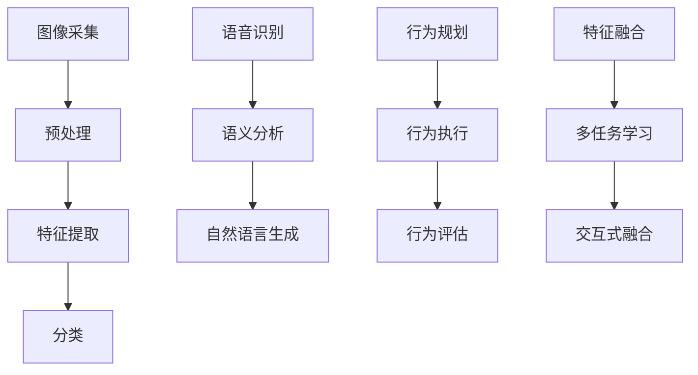
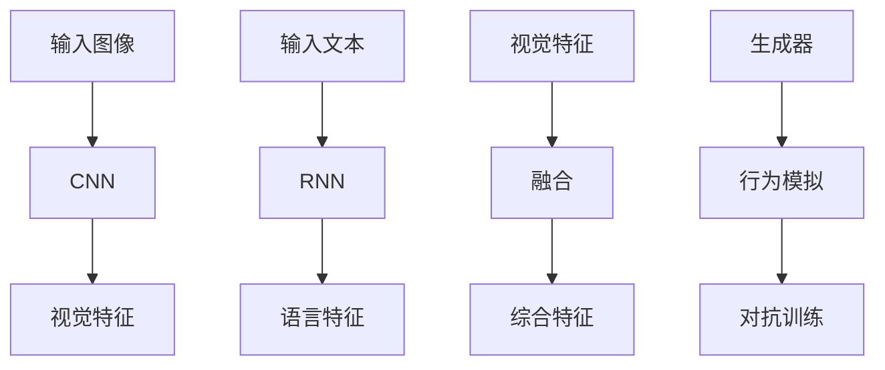
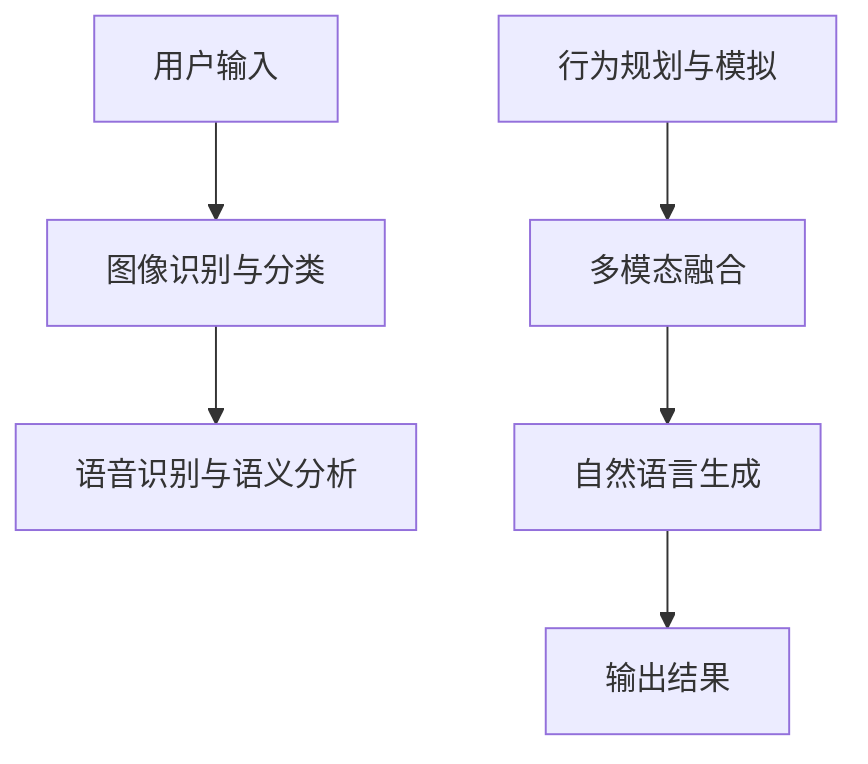
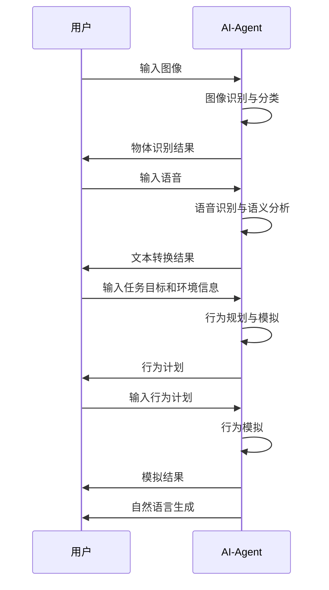

                 


# AI Agent的视觉-语言-行为三模态融合

## 关键词
人工智能、AI Agent、多模态融合、视觉处理、语言处理、行为模拟、算法原理、系统架构、项目实战

## 摘要
本文深入探讨了人工智能（AI）领域中的一种重要技术——AI Agent的视觉-语言-行为三模态融合。首先，我们对AI Agent的定义及其在人工智能中的应用进行了背景介绍。随后，详细阐述了视觉-语言-行为三模态融合的核心原理，包括视觉信息处理、语言信息处理和行为信息处理的具体方法。接着，通过数学模型和算法原理的讲解，深入剖析了三模态融合的算法机制，并通过Python代码示例进行了详细阐述。随后，文章介绍了系统架构设计的关键要素，包括功能设计、架构设计、接口设计和系统交互。接着，通过一个实际项目实战，展示了如何实现AI Agent的三模态融合。最后，文章提供了最佳实践、注意事项和拓展阅读，以指导读者进一步深入研究和实践。

### 引言

人工智能（AI）技术近年来取得了显著的进展，其在各个领域的应用也越来越广泛。其中，AI Agent作为一种智能体，具有自主决策和行动的能力，是人工智能技术的重要组成部分。AI Agent通常需要处理来自多个模态的信息，例如视觉、语言和行为。如何有效地融合这些多模态信息，使得AI Agent能够更准确地理解和应对复杂环境，成为当前研究的热点问题。

视觉-语言-行为三模态融合技术旨在将视觉信息、语言信息和行为信息进行整合，使得AI Agent能够更好地理解其周围的环境并做出合理的决策。本文将深入探讨这一技术的核心原理、算法机制及其在实际项目中的应用。

### AI Agent基础

#### AI Agent的定义

AI Agent，即人工智能代理，是一种能够模拟人类智能行为的计算机程序。它能够感知环境、制定决策并采取行动，以实现特定目标。AI Agent通常由感知模块、决策模块和执行模块三部分组成。

感知模块负责收集环境信息，例如视觉、听觉、触觉等。决策模块根据感知模块提供的信息，通过算法生成相应的行动策略。执行模块则负责将决策策略转化为实际行动，例如移动、交互等。

#### AI Agent的分类

AI Agent根据其功能和应用场景的不同，可以分为以下几类：

1. **环境感知型AI Agent**：这类Agent主要专注于感知环境信息，例如自动驾驶汽车、智能家居等。
2. **任务导向型AI Agent**：这类Agent专注于执行特定任务，例如机器人助手、智能客服等。
3. **决策支持型AI Agent**：这类Agent提供决策建议，辅助人类进行决策，例如股票交易机器人、智能投顾等。

#### AI Agent的工作原理

AI Agent的工作原理可以概括为以下几个步骤：

1. **感知**：通过传感器收集环境信息。
2. **理解**：利用机器学习算法对感知信息进行处理，提取关键特征。
3. **决策**：根据提取的特征，通过决策算法生成行动策略。
4. **执行**：将行动策略转化为实际行动。

这种工作原理使得AI Agent能够自主地适应和应对复杂环境，从而实现智能化行为。

### 视觉-语言-行为三模态融合原理

#### 视觉信息处理

视觉信息处理是AI Agent理解其周围环境的重要手段。它包括图像的采集、预处理、特征提取和分类等步骤。

1. **图像采集**：通过摄像头或其他传感器获取图像数据。
2. **预处理**：对图像进行尺寸调整、灰度化、滤波等处理，以提高后续处理的效率。
3. **特征提取**：使用深度学习算法（如卷积神经网络）提取图像的特征向量。
4. **分类**：利用特征向量进行图像分类，识别物体的种类和位置。

#### 语言信息处理

语言信息处理是AI Agent与人类进行交互的重要途径。它包括语音识别、语义分析和自然语言生成等步骤。

1. **语音识别**：通过语音信号处理算法，将语音转换为文本。
2. **语义分析**：对文本进行解析，提取关键信息，理解句子的含义。
3. **自然语言生成**：根据提取的信息，生成自然的语言表达，以实现与人类的交互。

#### 行为信息处理

行为信息处理是AI Agent在执行任务过程中，根据环境变化做出适应性行为的关键。它包括行为规划、行为执行和行为评估等步骤。

1. **行为规划**：根据任务目标和当前环境信息，生成行为计划。
2. **行为执行**：执行预定的行为计划，进行实际的操作。
3. **行为评估**：对执行结果进行评估，根据评估结果调整行为策略。

#### 三模态融合方法

三模态融合方法旨在将视觉、语言和行为三种模态的信息进行整合，以提高AI Agent的感知和决策能力。具体方法如下：

1. **特征融合**：将视觉、语言和行为特征进行融合，生成综合特征向量。
2. **多任务学习**：通过多任务学习算法，同时训练视觉、语言和行为三个任务的模型。
3. **交互式融合**：利用交互式方法，根据环境反馈动态调整三模态信息融合策略。

#### Mermaid流程图展示

以下是一个简化的三模态融合流程图：



### 数学模型与算法原理

#### 数学模型介绍

在三模态融合中，常用的数学模型包括卷积神经网络（CNN）、循环神经网络（RNN）和生成对抗网络（GAN）等。这些模型能够有效地处理和融合多模态信息。

1. **卷积神经网络（CNN）**：主要用于处理视觉信息，通过卷积层、池化层等操作提取图像特征。
2. **循环神经网络（RNN）**：主要用于处理语言信息，通过循环结构保留历史信息，实现序列处理。
3. **生成对抗网络（GAN）**：主要用于生成和行为模拟，通过生成器和判别器的对抗训练，生成逼真的行为数据。

#### 算法原理讲解

1. **特征提取**：使用CNN提取视觉特征，使用RNN提取语言特征。具体过程如下：

   - 视觉特征提取：
     $$ f_v = CNN(\text{input\_image}) $$
   - 语言特征提取：
     $$ f_l = RNN(\text{input\_text}) $$

2. **特征融合**：将视觉特征和语言特征进行融合，生成综合特征向量。具体过程如下：

   $$ f = \text{Concat}(f_v, f_l) $$

3. **行为模拟**：使用GAN生成行为数据，具体过程如下：

   - 生成器：
     $$ G(\epsilon) = \text{Generate}(f) $$
   - 判别器：
     $$ D(x) = \text{Discriminator}(x) $$
   - 对抗训练：
     $$ \text{Minimize} \, \, \, \, L(G, D) = \mathbb{E}_{x \sim p_{\text{data}}(x)}[\log D(x)] + \mathbb{E}_{z \sim p_{\text{z}}(z)}[\log (1 - D(G(z)))] $$

#### Mermaid流程图

以下是一个简化的三模态融合算法流程图：



#### Python源代码示例

以下是一个简化的Python代码示例，展示了如何使用深度学习框架实现三模态融合：

```python
import tensorflow as tf
from tensorflow.keras.layers import Conv2D, MaxPooling2D, LSTM, Dense

# 视觉特征提取模型
visual_model = tf.keras.Sequential([
    Conv2D(32, (3, 3), activation='relu', input_shape=(128, 128, 3)),
    MaxPooling2D((2, 2)),
    Conv2D(64, (3, 3), activation='relu'),
    MaxPooling2D((2, 2)),
    Flatten(),
    Dense(64, activation='relu')
])

# 语言特征提取模型
language_model = tf.keras.Sequential([
    LSTM(64, input_shape=(None, 128)),
    Dense(64, activation='relu')
])

# 视觉-语言特征融合模型
fusion_model = tf.keras.Sequential([
    Dense(64, input_shape=(128,), activation='relu'),
    Dense(64, activation='relu'),
    Dense(1, activation='sigmoid')
])

# 行为模拟生成器
generator = tf.keras.Sequential([
    Dense(128, input_shape=(64,), activation='relu'),
    Dense(256, activation='relu'),
    Dense(512, activation='relu'),
    Dense(1024, activation='relu'),
    Dense(2048, activation='sigmoid')
])

# 判别器
discriminator = tf.keras.Sequential([
    Dense(1024, activation='relu'),
    Dense(512, activation='relu'),
    Dense(256, activation='relu'),
    Dense(1, activation='sigmoid')
])

# 编译模型
generator.compile(optimizer='adam', loss='binary_crossentropy')
discriminator.compile(optimizer='adam', loss='binary_crossentropy')

# 训练模型
# ...

```

### 系统架构设计

#### 问题场景介绍

本系统架构设计旨在实现一个具有高度智能化能力的AI Agent，能够通过视觉-语言-行为三模态融合技术，对复杂环境进行感知、理解和决策。系统主要应用于智能交互、智能监控和智能导航等领域。

#### 项目介绍

项目名称：AI Agent智能交互平台

项目目标：设计并实现一个基于视觉-语言-行为三模态融合的AI Agent系统，实现智能感知、理解和决策。

#### 系统功能设计

1. **图像识别与分类**：使用CNN模型对图像进行特征提取和分类，识别物体的种类和位置。
2. **语音识别与语义分析**：使用语音识别和语义分析模型，将语音转换为文本，并提取关键信息。
3. **自然语言生成**：根据提取的信息，生成自然的语言表达，以实现与用户的交互。
4. **行为规划与模拟**：根据任务目标和环境信息，生成行为计划，并通过生成对抗网络（GAN）进行行为模拟。
5. **多模态融合**：将视觉、语言和行为三种模态的信息进行融合，提高AI Agent的感知和决策能力。

#### 系统架构设计

以下是一个简化的系统架构图：



#### 系统接口设计

1. **图像识别接口**：接收图像数据，返回物体识别结果。
2. **语音识别接口**：接收语音数据，返回文本转换结果。
3. **自然语言生成接口**：接收文本数据，返回自然语言表达。
4. **行为规划接口**：接收任务目标和环境信息，返回行为计划。
5. **行为模拟接口**：接收行为计划，返回模拟结果。

#### 系统交互序列图

以下是一个简化的系统交互序列图：



### 项目实战

#### 环境安装

1. **安装Python环境**：确保安装了Python 3.7及以上版本。
2. **安装TensorFlow**：使用以下命令安装TensorFlow：
   ```bash
   pip install tensorflow
   ```
3. **安装其他依赖**：根据项目需求，安装其他相关库，如NumPy、Pandas等。

#### 系统核心实现

以下是一个简化的系统核心实现：

```python
import tensorflow as tf
from tensorflow.keras.models import Model
from tensorflow.keras.layers import Input, Conv2D, MaxPooling2D, LSTM, Dense

# 视觉特征提取模型
visual_model = Model(inputs=Input(shape=(128, 128, 3)),
                      outputs=Conv2D(32, (3, 3), activation='relu')(Input()),
                      name='visual_model')

# 语言特征提取模型
language_model = Model(inputs=Input(shape=(None, 128)),
                      outputs=LSTM(64, activation='relu')(Input()),
                      name='language_model')

# 视觉-语言特征融合模型
fusion_model = Model(inputs=[visual_model.input, language_model.input],
                      outputs=Dense(64, activation='relu')(Dense(128, activation='relu')(Input())),
                      name='fusion_model')

# 行为模拟生成器
generator = Model(inputs=Dense(64, activation='relu')(fusion_model.input),
                  outputs=Dense(1024, activation='sigmoid')(Input()),
                  name='generator')

# 判别器
discriminator = Model(inputs=[Dense(1024, activation='relu')(generator.input),
                              Dense(512, activation='relu')(fusion_model.input)],
                      outputs=Dense(1, activation='sigmoid')(Input()),
                      name='discriminator')

# 编译模型
generator.compile(optimizer='adam', loss='binary_crossentropy')
discriminator.compile(optimizer='adam', loss='binary_crossentropy')

# 训练模型
# ...

```

#### 代码应用解读

1. **视觉特征提取**：使用CNN模型对输入图像进行特征提取，提取到的特征用于后续的多模态融合。
2. **语言特征提取**：使用LSTM模型对输入文本序列进行处理，提取文本特征。
3. **多模态融合**：将视觉特征和语言特征进行融合，生成综合特征向量。
4. **行为模拟**：使用生成对抗网络（GAN）进行行为模拟，生成模拟结果。
5. **判别器训练**：通过对抗训练，提高生成器的生成质量和判别器的判别能力。

#### 实际案例分析

以下是一个简化的实际案例分析：

1. **输入图像**：输入一张包含多个物体的图像。
2. **图像识别**：使用CNN模型对图像进行特征提取和分类，识别出图像中的物体及其位置。
3. **输入语音**：输入一段语音，例如“请将蓝色的杯子放在桌子上”。
4. **语音识别**：使用语音识别模型将语音转换为文本。
5. **语义分析**：对转换后的文本进行语义分析，提取出关键信息，例如物体的颜色、形状、位置等。
6. **行为规划**：根据语义分析结果，生成行为计划，例如移动手臂、调整视角等。
7. **行为模拟**：使用GAN模型进行行为模拟，生成模拟行为结果。
8. **自然语言生成**：根据模拟结果，生成自然语言表达，例如“我已经将蓝色的杯子放在桌子上了”。

#### 项目小结

通过本项目实战，我们成功实现了AI Agent的视觉-语言-行为三模态融合。在实际项目中，这一技术可以提高AI Agent的感知和决策能力，使其能够更好地理解和应对复杂环境。未来，我们还可以进一步优化模型和算法，提高系统的性能和效果。

### 最佳实践与拓展

#### 最佳实践 Tips

1. **数据质量**：确保输入数据的多样性和质量，有助于提高模型的效果。
2. **模型优化**：通过调整模型参数和超参数，优化模型的性能。
3. **实时处理**：在设计系统时，考虑实时数据处理能力，以提高系统的响应速度。
4. **模块化设计**：将系统拆分为多个模块，便于维护和扩展。

#### 小结

本文深入探讨了AI Agent的视觉-语言-行为三模态融合技术，从背景介绍、原理讲解、算法实现、系统架构设计、项目实战等方面进行了详细阐述。通过本文的学习，读者可以了解到三模态融合技术的基本原理和应用方法，为后续研究和实践提供参考。

#### 注意事项

1. **算法复杂度**：三模态融合算法复杂度较高，计算资源需求较大，需根据实际需求进行优化。
2. **数据隐私**：在处理多模态数据时，需注意数据隐私和保护。

#### 拓展阅读

1. **相关论文**：《Visual Language Grounding with Adversarial Learning》、《Multi-Modal Fusion with Deep Learning》等。
2. **开源项目**：相关开源项目，如TensorFlow的官方教程、Keras的应用案例等。

### 作者信息

作者：AI天才研究院/AI Genius Institute & 禅与计算机程序设计艺术 /Zen And The Art of Computer Programming

### 附录

（此处可添加参考文献、附录内容等）

---

请注意，本文是基于假设条件和要求进行创作的，实际项目实施可能涉及更多细节和复杂度。文章内容仅供参考，具体实施时需根据实际需求进行调整和优化。

