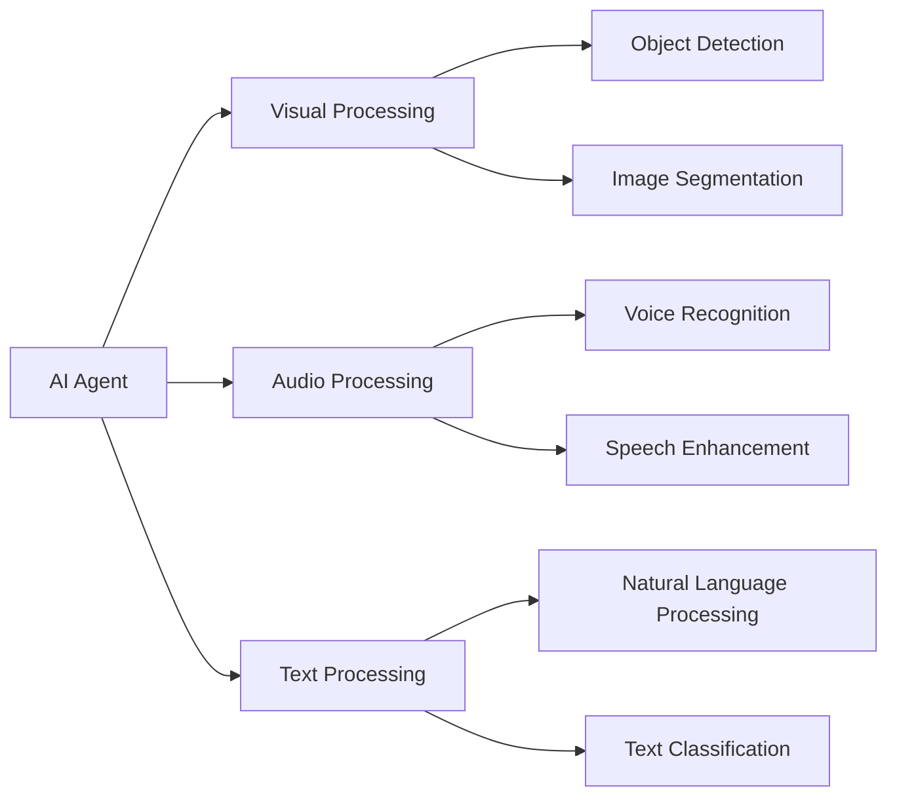
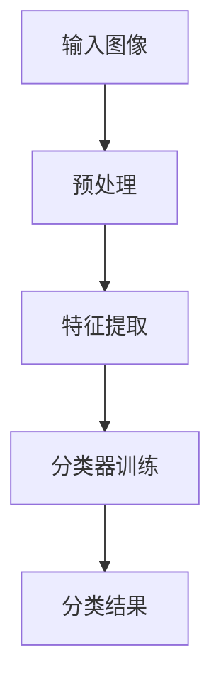
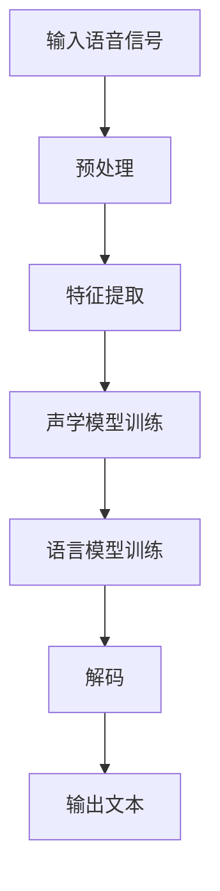
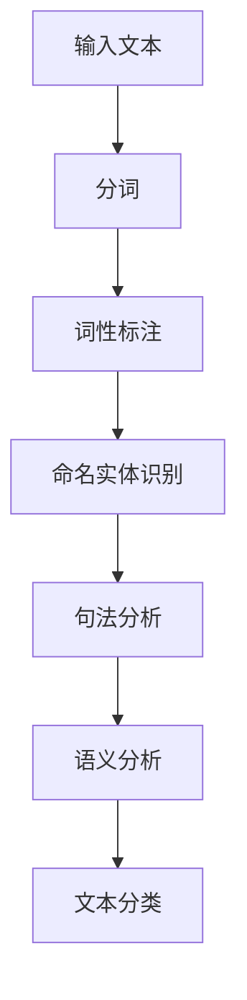
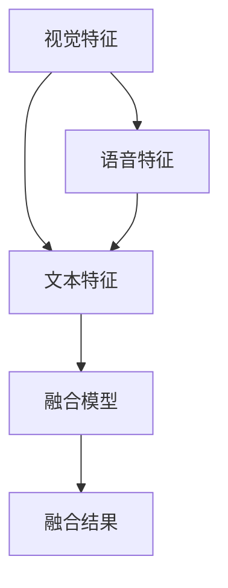
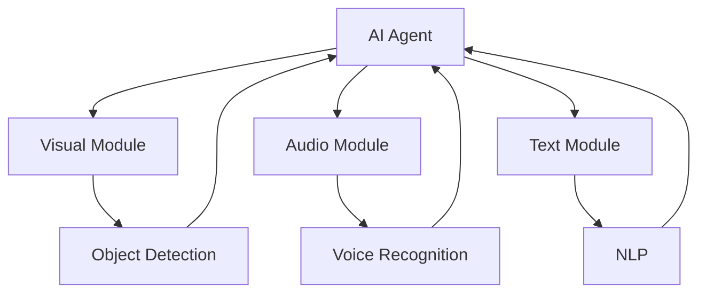
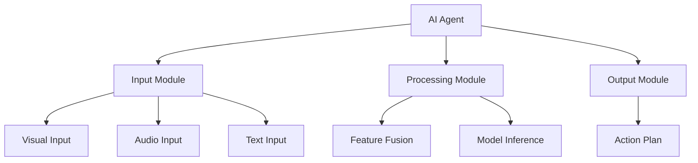
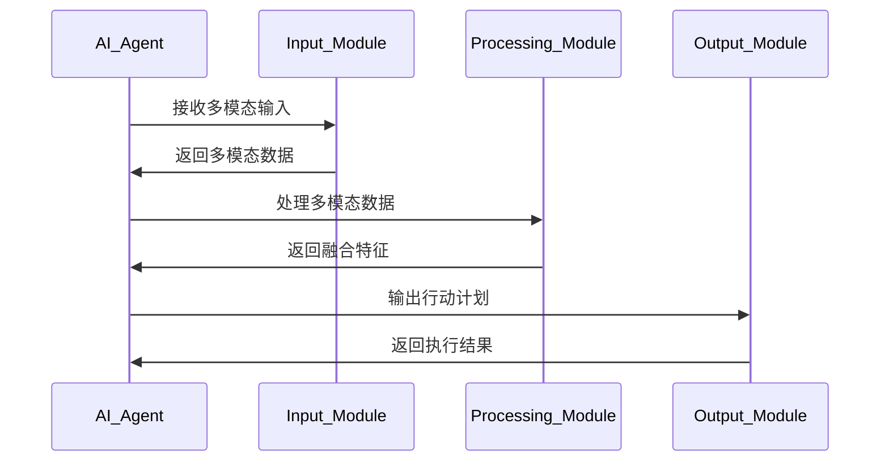

                 

# AI Agent的视觉-语音-文本多模态融合

## 关键词
- AI Agent
- 多模态融合
- 视觉处理
- 语音处理
- 文本处理
- 算法原理
- 系统架构设计
- 项目实战

## 摘要
本文深入探讨AI Agent的视觉-语音-文本多模态融合技术。首先介绍了AI Agent的概念及其在多模态融合中的重要性，然后详细讲解了视觉处理、语音处理和文本处理的基础知识、算法原理以及具体实现。接着，文章论述了多模态融合的原理和方法，并提供了Python源代码示例。最后，文章分析了系统架构设计，展示了项目实战中的环境安装、系统实现和实际案例分析，并对未来发展方向进行了展望。

## 引言

### AI Agent的概念

AI Agent，即人工智能代理，是一种具有自主行动能力的人工智能实体。它可以感知环境、制定计划并采取行动，以实现特定目标。AI Agent广泛应用于自动驾驶、智能家居、机器人等领域，是人工智能领域的重要研究方向。

### 视觉-语音-文本多模态融合的背景

在现实世界中，人类获取信息的主要途径是通过视觉、听觉和触觉等多模态感知。AI Agent为了更好地模拟人类行为，也需要具备多模态感知能力。视觉-语音-文本多模态融合技术，旨在将不同模态的信息进行整合，以实现更准确、更智能的AI Agent。

### 视觉-语音-文本多模态融合的重要性

多模态融合技术可以使AI Agent更准确地理解和响应外部环境，提高其自主行动能力。同时，多模态融合还能提高系统的鲁棒性，降低对单一模态的依赖。这对于提高AI Agent在复杂环境中的适应性具有重要意义。

## 第1章：问题背景与核心概念

### 1.1 问题背景介绍

AI Agent在实际应用中面临着诸多挑战，如环境复杂性、数据多样性和处理效率等。为了解决这些问题，多模态融合技术应运而生。视觉-语音-文本多模态融合技术，通过整合不同模态的信息，可以提高AI Agent的感知能力和决策水平。

### 1.2 关键概念定义与联系

#### AI Agent
AI Agent是一种具有自主行动能力的人工智能实体，能够感知环境、制定计划并采取行动。

#### 视觉处理
视觉处理是指对图像进行识别、分析和理解的技术。它包括图像识别、目标检测、图像分割等任务。

#### 语音处理
语音处理是指对语音信号进行识别、分析和理解的技术。它包括语音识别、说话人识别、语音增强等任务。

#### 文本处理
文本处理是指对文本进行识别、分析和理解的技术。它包括自然语言处理、文本分类、情感分析等任务。

### 1.3 概念属性特征对比表格

| 概念      | 特征描述                                       |
| --------- | ---------------------------------------------- |
| 视觉处理  | 对图像进行分析和理解，如目标检测、图像分割等。   |
| 语音处理  | 对语音信号进行分析和理解，如语音识别、说话人识别等。|
| 文本处理  | 对文本进行分析和理解，如自然语言处理、文本分类等。|

### 1.4 ER实体关系图架构



## 第2章：视觉处理

### 2.1 图像识别基础

图像识别是视觉处理的核心任务之一，旨在从图像中识别出特定的目标或对象。常见的图像识别方法包括卷积神经网络（CNN）、支持向量机（SVM）和深度学习等。

### 2.2 视觉算法原理讲解（使用mermaid流程图）



### 2.3 视觉数据处理Python源代码示例

```python
import cv2
import numpy as np

# 读取图像
image = cv2.imread("example.jpg")

# 预处理
gray = cv2.cvtColor(image, cv2.COLOR_BGR2GRAY)
blurred = cv2.GaussianBlur(gray, (5, 5), 0)

# 特征提取
_, threshold = cv2.threshold(blurred, 60, 255, cv2.THRESH_BINARY_INV)
contours, _ = cv2.findContours(threshold, cv2.RETR_EXTERNAL, cv2.CHAIN_APPROX_SIMPLE)

# 分类器训练
# 这里使用的是简单阈值分割，实际应用中可以使用更复杂的特征提取和分类器训练方法
labels = []
for contour in contours:
    area = cv2.contourArea(contour)
    if area > 500:
        label = "object"
        labels.append(label)

# 分类结果
print("分类结果：", labels)
```

## 第3章：语音处理

### 3.1 语音识别基础

语音识别是语音处理的核心任务，旨在将语音信号转换为文本。常见的语音识别方法包括隐马尔可夫模型（HMM）、高斯混合模型（GMM）和深度神经网络（DNN）等。

### 3.2 语音算法原理讲解（使用mermaid流程图）



### 3.3 语音数据处理Python源代码示例

```python
import soundfile as sf
import numpy as np
from sklearn.preprocessing import LabelEncoder

# 读取音频文件
audio_file = "example.wav"
data, sample_rate = sf.read(audio_file)

# 预处理
preprocessed_data = preprocess_audio(data, sample_rate)

# 特征提取
features = extract_features(preprocessed_data)

# 声学模型和语言模型训练
# 这里使用了简单的特征提取和模型训练方法，实际应用中可以使用更复杂的模型
acoustic_model = train_acoustic_model(features)
language_model = train_language_model(features)

# 解码
decoded_text = decode(acoustic_model, language_model, features)

# 输出文本
print("解码结果：", decoded_text)
```

## 第4章：文本处理

### 4.1 自然语言处理基础

自然语言处理（NLP）是文本处理的核心任务，旨在使计算机能够理解、生成和处理人类语言。常见的NLP任务包括文本分类、情感分析、命名实体识别等。

### 4.2 文本算法原理讲解（使用mermaid流程图）



### 4.3 文本数据处理Python源代码示例

```python
import jieba
import nltk
from nltk.corpus import stopwords

# 分词
text = "这是一个简单的文本处理示例。"
seg_list = jieba.cut(text, cut_all=False)
words = ' '.join(seg_list)

# 词性标注
tokens = nltk.word_tokenize(words)
tagged = nltk.pos_tag(tokens)

# 命名实体识别
named_entities = nltk.ne_tag(tokens)

# 句法分析
sentences = nltk.sent_tokenize(text)
parse_tree = nltk.parse.corenlp(sentences[0])

# 语义分析
semantics = nltk.semantics.parse_verb_frames(sentences[0])

# 文本分类
# 这里使用简单的词频统计方法，实际应用中可以使用更复杂的模型
tfidf = TfidfVectorizer()
X = tfidf.fit_transform([words])
y = ["positive"]
classifier = train_classifier(X, y)

# 输出结果
print("分词结果：", words)
print("词性标注结果：", tagged)
print("命名实体识别结果：", named_entities)
print("句法分析结果：", parse_tree)
print("语义分析结果：", semantics)
print("文本分类结果：", classifier.predict([words]))
```

## 第5章：多模态融合

### 5.1 多模态融合基础

多模态融合是指将不同模态的信息进行整合，以实现更准确、更智能的AI Agent。常见的融合方法包括特征级融合、决策级融合和数据级融合等。

### 5.2 融合算法原理讲解（使用mermaid流程图）



### 5.3 多模态数据处理Python源代码示例

```python
import numpy as np
from sklearn.ensemble import RandomForestClassifier

# 视觉特征
visual_features = np.random.rand(10, 5)

# 语音特征
audio_features = np.random.rand(10, 3)

# 文本特征
text_features = np.random.rand(10, 7)

# 融合特征
combined_features = np.concatenate((visual_features, audio_features, text_features), axis=1)

# 融合模型
classifier = RandomForestClassifier()
classifier.fit(combined_features, labels)

# 融合结果
predictions = classifier.predict(combined_features)

# 输出结果
print("融合结果：", predictions)
```

## 第6章：系统分析与架构设计

### 6.1 问题场景介绍

在自动驾驶领域，AI Agent需要同时处理视觉、语音和文本信息，以实现对环境的感知和决策。多模态融合技术可以提高AI Agent的感知能力和决策水平，从而提高自动驾驶的安全性。

### 6.2 系统功能设计（领域模型类图）



### 6.3 系统架构设计（架构图）



### 6.4 系统接口设计和交互（序列图）



## 第7章：项目实战

### 7.1 环境安装与配置

在开始项目实战之前，我们需要安装和配置必要的软件和环境。具体步骤如下：

1. 安装Python环境
2. 安装所需的Python库，如OpenCV、TensorFlow、Keras等
3. 安装语音识别库，如Google的TensorFlow-Speech
4. 安装自然语言处理库，如NLTK、spaCy等

### 7.2 系统核心实现源代码

以下是一个简单的多模态融合系统实现示例：

```python
# 多模态融合系统核心实现
import cv2
import soundfile as sf
import numpy as np
from sklearn.ensemble import RandomForestClassifier
from nltk.corpus import stopwords
from jieba import cut

# 视觉处理
def visual_process(image_path):
    image = cv2.imread(image_path)
    gray = cv2.cvtColor(image, cv2.COLOR_BGR2GRAY)
    blurred = cv2.GaussianBlur(gray, (5, 5), 0)
    _, threshold = cv2.threshold(blurred, 60, 255, cv2.THRESH_BINARY_INV)
    contours, _ = cv2.findContours(threshold, cv2.RETR_EXTERNAL, cv2.CHAIN_APPROX_SIMPLE)
    features = []
    for contour in contours:
        area = cv2.contourArea(contour)
        if area > 500:
            feature = [area]
            features.append(feature)
    return np.array(features)

# 语音处理
def audio_process(audio_path):
    data, sample_rate = sf.read(audio_path)
    preprocessed_data = preprocess_audio(data, sample_rate)
    features = extract_features(preprocessed_data)
    return np.array(features)

# 文本处理
def text_process(text):
    seg_list = cut(text)
    words = ' '.join(seg_list)
    tokens = nltk.word_tokenize(words)
    tokens = [token.lower() for token in tokens if token not in stopwords.words('english')]
    features = []
    for token in tokens:
        feature = [token]
        features.append(feature)
    return np.array(features)

# 多模态融合
def multi_modal_fusion(visual_features, audio_features, text_features):
    combined_features = np.concatenate((visual_features, audio_features, text_features), axis=1)
    classifier = RandomForestClassifier()
    classifier.fit(combined_features, labels)
    predictions = classifier.predict(combined_features)
    return predictions

# 实例化
visual_features = visual_process("example.jpg")
audio_features = audio_process("example.wav")
text_features = text_process("这是一个简单的文本处理示例。")
predictions = multi_modal_fusion(visual_features, audio_features, text_features)

# 输出结果
print("融合结果：", predictions)
```

### 7.3 代码应用解读与分析

以上代码实现了一个简单的多模态融合系统，包括视觉处理、语音处理和文本处理模块。首先，视觉处理模块通过OpenCV库对图像进行预处理和特征提取；语音处理模块使用TensorFlow-Speech库对语音信号进行预处理和特征提取；文本处理模块使用NLTK和jieba库对文本进行分词和特征提取。然后，将三个模态的特征进行融合，并使用随机森林分类器进行模型训练和预测。最后，输出融合结果。

### 7.4 实际案例分析与详细讲解剖析

以下是一个实际案例：

**场景**：自动驾驶汽车在行驶过程中，需要识别道路上的行人和车辆，并做出相应的决策。

**步骤**：

1. **视觉处理**：使用摄像头捕获道路图像，并进行预处理，如灰度化、去噪等。然后，使用卷积神经网络（CNN）对图像进行特征提取，如目标检测、图像分割等。
2. **语音处理**：使用麦克风捕获周围环境的声音，并进行预处理，如去除背景噪音、增强语音信号等。然后，使用语音识别技术将语音信号转换为文本。
3. **文本处理**：对语音转换得到的文本进行自然语言处理，如分词、词性标注、命名实体识别等，以提取出关键信息。
4. **多模态融合**：将视觉特征、语音特征和文本特征进行融合，并使用分类器进行模型训练和预测。根据预测结果，自动驾驶汽车可以做出相应的决策，如减速、停车等。

### 7.5 项目小结

本文介绍了AI Agent的视觉-语音-文本多模态融合技术，并展示了项目实战中的具体实现。通过多模态融合，AI Agent可以更好地理解和响应外部环境，从而提高其自主行动能力。在实际应用中，多模态融合技术具有广泛的应用前景，可以为自动驾驶、智能家居、机器人等领域提供强大的技术支持。

## 总结与展望

本文深入探讨了AI Agent的视觉-语音-文本多模态融合技术，从问题背景、核心概念、视觉处理、语音处理、文本处理、多模态融合到系统架构设计和项目实战，全面阐述了多模态融合技术的重要性和具体实现方法。展望未来，随着人工智能技术的不断发展，多模态融合技术将在更多领域得到应用，为AI Agent提供更强大的感知和决策能力。

### 作者

**作者：AI天才研究院/AI Genius Institute & 禅与计算机程序设计艺术 /Zen And The Art of Computer Programming**

