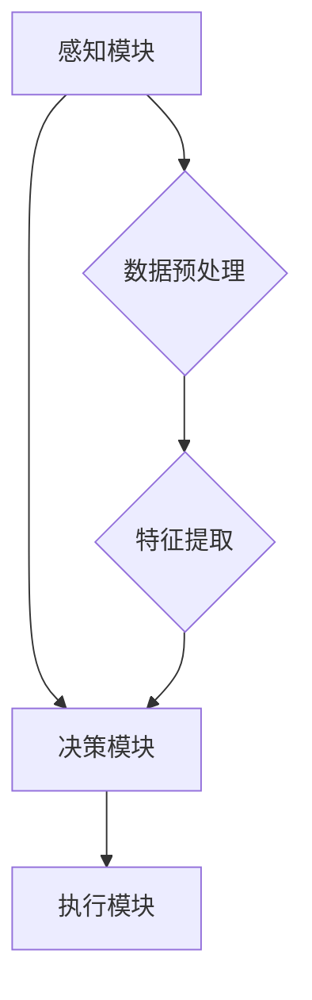
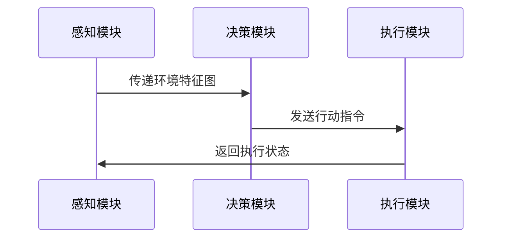
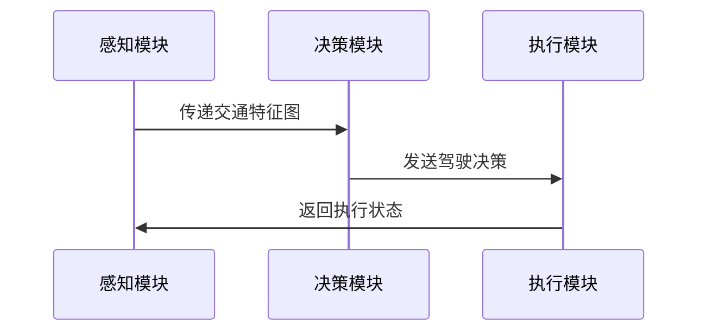
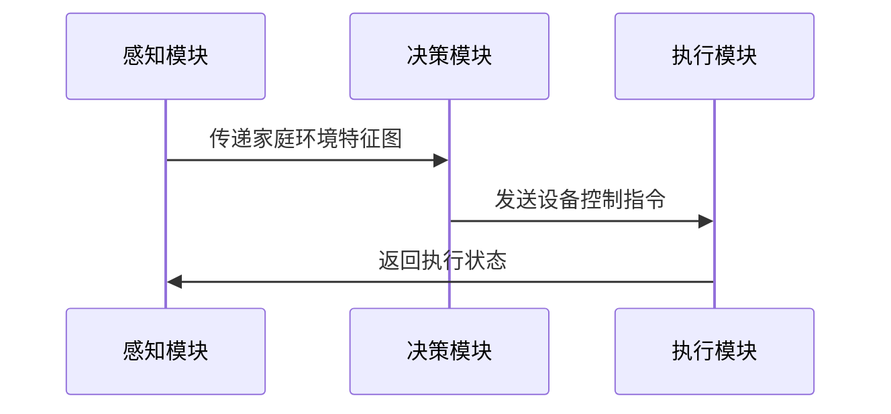

                 

### 文章标题

# AI Agent的认知架构：从感知到决策的全流程设计

> 关键词：AI Agent、感知架构、决策架构、全流程设计

> 摘要：本文深入探讨了AI Agent的认知架构设计，从感知到决策的全流程进行剖析。首先，介绍了AI Agent的定义及其核心特征；接着，详细阐述了感知架构与决策架构的设计原理和实现细节；最后，通过实际案例展示了全流程设计的应用效果，为AI Agent的研发提供了实用指导。

---

## 引言与背景

### 1.1 问题背景

在当今世界，人工智能（AI）技术正在以前所未有的速度发展，AI Agent作为人工智能的核心组成部分，已经在多个领域展现出强大的应用潜力。从智能家居的语音助手，到自动驾驶汽车的决策系统，AI Agent已经成为提升生活品质和效率的关键技术。

然而，AI Agent的研发面临诸多挑战。首先是如何实现高效、准确的感知，其次是决策模块的智能性与可靠性。传统的人工智能系统往往是基于规则或机器学习的，缺乏对真实环境的自适应能力。因此，如何设计一个能够从感知到决策的全流程高效运行的AI Agent，成为当前研究的热点问题。

### 1.2 问题描述

AI Agent的设计问题可以概括为以下几点：

1. **感知问题**：AI Agent需要通过传感器实时获取环境信息，如何处理大量、多变、非结构化的感知数据，是感知模块需要解决的核心问题。
2. **决策问题**：基于感知模块提供的信息，AI Agent需要做出快速、准确的决策。如何设计一个能够适应复杂环境变化的决策算法，是AI Agent成功的关键。
3. **系统整合**：感知模块与决策模块需要高效整合，实现从感知到决策的顺畅过渡，同时保证系统的整体性能和可靠性。

### 1.3 问题解决

为了解决上述问题，我们需要从以下几个方面进行思考：

1. **感知架构设计**：设计一个高效、灵活的感知架构，确保感知模块能够准确、实时地获取和处理环境信息。
2. **决策架构设计**：设计一个智能、可靠的决策架构，确保决策模块能够根据感知数据做出有效的决策。
3. **全流程设计**：将感知与决策模块整合到一个完整的系统中，实现从感知到决策的全流程设计，确保系统的整体性能和可靠性。

### 1.4 边界与外延

本文的讨论范围主要围绕AI Agent的认知架构设计，具体包括感知架构与决策架构的设计原理和实现细节。然而，AI Agent的应用场景非常广泛，从智能家居到自动驾驶，再到智能医疗等多个领域，均需要不同的感知与决策策略。因此，本文的研究结果将为这些应用场景提供一定的参考和指导。

## 核心概念与联系

### 2.1 AI Agent的定义

AI Agent，即人工智能代理，是一个能够感知环境、接收信息、自主决策并执行行动的实体。AI Agent的核心功能在于其自主性和智能性，能够根据环境变化动态调整行为，以实现特定目标。

### 2.2 AI Agent的核心特征

1. **感知能力**：AI Agent需要具备强大的感知能力，通过传感器实时获取环境信息。
2. **决策能力**：基于感知到的信息，AI Agent需要能够做出有效的决策。
3. **行动能力**：决策之后，AI Agent需要能够执行具体的行动。
4. **自适应能力**：AI Agent需要能够适应不断变化的环境，保持高效运行。

### 2.3 感知与决策的关系

感知与决策是AI Agent的核心功能，二者相辅相成。感知模块为决策模块提供数据支持，而决策模块则基于感知数据进行行动规划。因此，一个高效的AI Agent必须具备优秀的感知能力和决策能力。

### 2.4 AI Agent的组成要素

1. **感知模块**：包括传感器、数据预处理、特征提取等组成部分。
2. **决策模块**：包括决策算法、决策模型、执行器等组成部分。
3. **执行模块**：负责执行决策模块生成的行动指令。

## ER实体关系图架构

```mermaid
erDiagram
  AI Agent ||--o> 感知模块 :感知信息
  AI Agent ||--o> 决策模块 :决策行动
  感知模块 ||--< 传感器 :采集数据
  决策模块 ||--< 执行器 :执行行动
```

在这个ER实体关系图中，AI Agent作为中心实体，与感知模块和决策模块通过“感知信息”和“决策行动”两个关联关系相连。感知模块包括传感器和数据预处理，决策模块包括决策算法和执行器，它们共同构成了AI Agent的核心架构。

### 总结与展望

本文对AI Agent的认知架构设计进行了详细探讨，从感知到决策的全流程进行了深入分析。通过定义AI Agent的概念，阐述了其核心特征和组成要素，并利用ER实体关系图展示了AI Agent的架构。接下来，我们将进一步深入探讨AI Agent的感知架构和决策架构设计，以期为AI Agent的实际应用提供有力的理论支撑和技术指导。

## AI Agent的感知架构设计基础

### 4.1 感知架构概述

感知架构是AI Agent的核心组成部分，负责实时获取和处理环境信息。一个高效的感知架构需要具备以下几个关键特性：

1. **实时性**：能够迅速响应环境变化，提供最新的感知数据。
2. **准确性**：确保感知数据的质量，减少误差和噪声。
3. **灵活性**：能够适应不同的应用场景和传感器配置。

感知架构通常由传感器、数据预处理和特征提取等模块组成。传感器负责采集原始数据，数据预处理模块对原始数据进行清洗和格式化，特征提取模块则从预处理后的数据中提取关键信息，供决策模块使用。

### 4.2 感知模块的功能

感知模块的主要功能包括：

1. **数据采集**：通过传感器获取环境中的物理、化学、生物等信息。
2. **数据预处理**：对采集到的原始数据进行清洗、去噪、归一化等操作，以提高数据的可用性。
3. **特征提取**：从预处理后的数据中提取具有区分性的特征，以简化数据并突出关键信息。

### 4.3 感知数据类型

感知数据类型主要包括以下几类：

1. **视觉数据**：如图像、视频等。
2. **听觉数据**：如音频、语音等。
3. **触觉数据**：如触摸、振动等。
4. **环境数据**：如温度、湿度、气压等。

不同类型的感知数据需要不同的处理方法和特征提取技术，因此感知架构设计需要充分考虑这些数据的特性。

### 4.4 感知数据处理技术

感知数据处理技术主要包括以下几种：

1. **预处理技术**：如滤波、归一化、特征选择等。
2. **特征提取技术**：如主成分分析（PCA）、卷积神经网络（CNN）等。
3. **融合技术**：将来自不同传感器的数据融合在一起，提高整体感知能力。

通过以上技术手段，感知模块可以有效地处理和分析感知数据，为决策模块提供可靠的信息支持。

### 总结

感知架构设计是AI Agent的核心环节，它决定了AI Agent对环境的感知能力和信息的处理效率。通过设计一个高效、灵活的感知架构，AI Agent可以更好地应对复杂多变的现实环境，提高决策的准确性和自主性。接下来，我们将进一步探讨感知模块的实现细节，包括传感器选择与接口设计、数据预处理算法和特征提取与降维技术。

### 感知模块实现细节

#### 5.1 传感器选择与接口设计

传感器选择是感知模块实现的关键一步，需要根据应用场景和需求选择合适的传感器。常见的传感器类型包括：

1. **视觉传感器**：如摄像头、红外摄像头等，适用于图像识别、视频监控等应用。
2. **听觉传感器**：如麦克风、声波传感器等，适用于语音识别、环境监测等应用。
3. **触觉传感器**：如触摸屏、力传感器等，适用于人机交互、机器人控制等应用。
4. **环境传感器**：如温度传感器、湿度传感器、气体传感器等，适用于环境监测、智能家居等应用。

在选择传感器时，需要考虑以下几个因素：

1. **灵敏度**：传感器对目标信号的响应程度，高灵敏度有助于提高感知准确性。
2. **精度**：传感器测量的准确程度，高精度有助于减少误差。
3. **响应时间**：传感器从接收到信号到输出结果的时间，短响应时间有助于提高实时性。
4. **功耗**：传感器的能耗水平，低功耗有助于延长系统运行时间。

接口设计是实现传感器与AI Agent有效连接的重要环节。常用的接口设计方法包括：

1. **通用接口**：使用标准化的接口协议，如USB、I2C、SPI等，简化传感器与AI Agent的连接。
2. **专用接口**：针对特定传感器设计的专用接口，如摄像头接口、音频接口等。
3. **模块化接口**：将传感器和接口模块化设计，提高系统的灵活性和可扩展性。

#### 5.2 数据预处理算法

数据预处理是感知模块的核心环节，对传感器采集的原始数据进行清洗、去噪、归一化等操作，以提高数据的可用性。常见的数据预处理算法包括：

1. **滤波算法**：如均值滤波、中值滤波、高斯滤波等，用于去除噪声。
2. **去噪算法**：如小波去噪、基于模型的去噪等，用于提取有用信息。
3. **归一化算法**：如Z分数归一化、最小-最大归一化等，用于统一数据范围。

#### 5.3 特征提取与降维技术

特征提取是从感知数据中提取具有区分性的特征，用于表示环境和目标。常见的特征提取技术包括：

1. **统计特征提取**：如均值、方差、协方差等，用于描述数据的分布和相关性。
2. **时频特征提取**：如傅里叶变换、小波变换等，用于描述数据的频率和时域特性。
3. **深度学习特征提取**：如卷积神经网络（CNN）、循环神经网络（RNN）等，用于自动提取复杂特征。

降维技术是将高维特征空间映射到低维空间，以减少数据维度和计算复杂度。常见的降维技术包括：

1. **主成分分析（PCA）**：通过保留主要成分，减少数据维度。
2. **线性判别分析（LDA）**：通过最大化类间差异，减少数据维度。
3. **自编码器（Autoencoder）**：通过训练神经网络自动学习数据特征，减少数据维度。

#### 5.4 感知模块的性能评估

感知模块的性能评估是验证其有效性和可靠性的关键。常用的性能评估指标包括：

1. **准确率**：正确识别目标的概率。
2. **召回率**：实际目标被正确识别的概率。
3. **F1分数**：准确率和召回率的加权平均，用于综合评估感知性能。
4. **响应时间**：从感知到决策的时间间隔。

通过以上性能评估指标，可以全面评估感知模块的感知能力和响应性能，为感知架构的优化提供依据。

### 总结

感知模块的实现细节涉及传感器选择、接口设计、数据预处理、特征提取与降维等多个方面。通过精心设计和优化，感知模块可以显著提升AI Agent对环境的感知能力和信息处理效率。接下来，我们将探讨感知模块在实际应用中的实例，以进一步展示其应用效果和优势。

### 感知模块应用实例

#### 6.1 机器人导航感知系统

在机器人导航系统中，感知模块至关重要，它负责实时获取环境信息，并指导机器人进行自主导航。以下是一个典型的机器人导航感知系统的实现过程：

1. **传感器选择**：机器人配备多个传感器，包括摄像头、激光雷达、超声波传感器等，以获取不同类型的环境信息。
2. **数据预处理**：摄像头采集到的图像数据通过滤波、去噪和归一化等预处理算法进行处理，激光雷达数据则通过点云滤波和去噪算法进行处理。
3. **特征提取**：从预处理后的图像数据中提取颜色、纹理等特征，从激光雷达数据中提取点云特征，用于描述环境结构和障碍物。
4. **感知与决策**：感知模块将提取到的特征传递给决策模块，决策模块根据感知数据生成导航路径，机器人根据导航路径进行自主导航。

**实例分析**：在一个封闭的仓库中，机器人需要自主导航到指定位置。感知模块通过摄像头和激光雷达获取仓库内部的三维环境信息，经过数据预处理和特征提取后，决策模块生成最优的导航路径。机器人沿着导航路径自主移动，避开障碍物，最终到达目标位置。通过这一实例，我们可以看到感知模块在机器人导航系统中的关键作用。

#### 6.2 自动驾驶感知系统

在自动驾驶系统中，感知模块负责实时获取车辆周围的环境信息，包括道路、车辆、行人、交通信号等。以下是一个典型的自动驾驶感知系统的实现过程：

1. **传感器选择**：自动驾驶车辆通常配备多个传感器，包括摄像头、激光雷达、毫米波雷达、超声波传感器等，以获取不同类型的环境信息。
2. **数据预处理**：摄像头采集到的图像数据通过滤波、去噪和归一化等预处理算法进行处理，激光雷达数据则通过点云滤波和去噪算法进行处理。
3. **特征提取**：从预处理后的图像数据中提取车辆、行人、道路等特征，从激光雷达数据中提取点云特征，用于环境感知和目标检测。
4. **感知与决策**：感知模块将提取到的特征传递给决策模块，决策模块根据感知数据生成驾驶决策，包括加速、减速、转向等。

**实例分析**：在一个复杂的城市交通环境中，自动驾驶车辆需要实时感知周围环境，识别道路、车辆、行人等目标，并根据感知数据生成安全的驾驶决策。通过感知模块的支持，自动驾驶车辆可以准确地识别和预测环境变化，保证行驶的安全性和稳定性。

#### 6.3 智能家居感知系统

在智能家居系统中，感知模块负责实时获取家庭环境信息，包括温度、湿度、光照强度等。以下是一个典型的智能家居感知系统的实现过程：

1. **传感器选择**：智能家居设备通常配备温度传感器、湿度传感器、光照传感器等，以获取家庭环境信息。
2. **数据预处理**：传感器采集到的环境数据通过滤波、去噪和归一化等预处理算法进行处理，以提高数据的可用性。
3. **特征提取**：从预处理后的数据中提取关键特征，用于家庭环境监控和设备控制。
4. **感知与决策**：感知模块将提取到的特征传递给决策模块，决策模块根据感知数据生成家庭设备控制策略，如调整空调温度、开启照明等。

**实例分析**：在家庭环境中，感知模块通过温度传感器、湿度传感器等设备实时监测家庭环境，并根据感知数据自动调整空调、空气净化器等设备的工作状态，以保持舒适的家居环境。通过智能家居感知系统的支持，用户可以享受到更加智能、便捷的生活体验。

### 总结

感知模块在机器人导航、自动驾驶、智能家居等多个领域都发挥着关键作用。通过选择合适的传感器、设计高效的数据预处理和特征提取算法，感知模块可以实时、准确地获取和处理环境信息，为决策模块提供可靠的数据支持。在实际应用中，感知模块的应用效果显著，为各个领域带来了智能化、自动化的提升。接下来，我们将进一步探讨决策模块的设计和实现。

### 决策架构设计基础

#### 7.1 决策架构概述

决策架构是AI Agent的核心模块之一，它负责根据感知模块提供的信息做出智能化的决策。决策架构的设计直接影响到AI Agent的智能水平和决策效果。一个高效的决策架构需要具备以下几个关键特性：

1. **适应性**：能够适应不同的环境和任务，灵活调整决策策略。
2. **可靠性**：能够在各种复杂情况下做出正确的决策。
3. **实时性**：能够在短时间内完成决策过程，满足实时响应的需求。
4. **鲁棒性**：能够在感知数据存在噪声或误差的情况下，仍能做出有效的决策。

决策架构通常包括以下几个主要组成部分：

1. **决策算法**：用于处理感知数据，生成决策结果的核心算法。
2. **决策模型**：基于决策算法构建的数学模型，用于指导决策过程。
3. **执行器**：负责执行决策模块生成的决策指令，实现具体的行动。

#### 7.2 决策模块的功能

决策模块的主要功能包括：

1. **信息处理**：接收感知模块提供的信息，进行处理和分析。
2. **决策生成**：根据分析结果生成决策指令，指导AI Agent的行动。
3. **行动规划**：在决策指令的基础上，制定具体的行动方案。
4. **执行监控**：监控执行器的行动效果，反馈给感知模块，形成闭环控制。

#### 7.3 决策数据类型

决策数据类型主要包括以下几类：

1. **感知数据**：从感知模块获取的环境信息，如图像、声音、温度、湿度等。
2. **上下文数据**：与决策相关的上下文信息，如任务目标、历史记录等。
3. **动作数据**：执行器提供的执行状态信息，如位置、速度等。

不同类型的决策数据对决策算法和模型的设计有不同的要求，需要在决策架构中合理处理。

#### 7.4 决策算法框架

决策算法框架是决策模块的核心，它决定了决策过程的效率和效果。常见的决策算法框架包括：

1. **基于规则的决策**：通过预设的规则库进行决策，适用于规则明确、变化较小的场景。
2. **基于模型的决策**：通过构建数学模型进行决策，适用于复杂、动态的环境。
3. **基于学习的决策**：通过机器学习算法进行决策，适用于不确定、多变的环境。

每种决策算法框架都有其适用的场景和优缺点，需要在实际应用中根据需求进行选择和优化。

### 总结

决策架构设计是AI Agent智能化的重要组成部分，它决定了AI Agent的决策能力和适应能力。通过设计一个高效、灵活的决策架构，AI Agent可以在各种复杂环境中做出正确的决策，实现智能化、自动化的目标。接下来，我们将详细探讨决策模块的实现细节，包括决策算法原理、模型选择和性能优化。

### 决策模块实现细节

#### 8.1 决策算法原理

决策算法是决策模块的核心，它负责根据感知数据和上下文信息生成决策指令。常见的决策算法包括以下几种：

1. **基于规则的决策算法**：该算法通过预设的规则库进行决策。每个规则由条件（感知数据和上下文信息）和行动组成。当感知数据和上下文信息满足某个规则的条件时，系统将执行该规则对应的行动。这种算法适用于规则明确、变化较小的场景。

2. **基于模型的决策算法**：该算法通过构建数学模型进行决策。常见的模型包括线性模型、非线性模型、神经网络等。决策过程涉及模型训练和预测，通过模型对感知数据进行预测，生成决策指令。这种算法适用于复杂、动态的环境。

3. **基于学习的决策算法**：该算法通过机器学习算法进行决策。机器学习算法包括监督学习、无监督学习和强化学习等。监督学习算法通过已知的输入和输出数据进行训练，生成预测模型；无监督学习算法通过未标记的数据进行训练，发现数据中的模式和结构；强化学习算法通过与环境交互进行学习，逐步优化决策策略。这种算法适用于不确定、多变的环境。

#### 8.2 决策模型选择

决策模型的选择取决于具体的应用场景和需求。以下是几种常见的决策模型：

1. **线性回归模型**：适用于线性关系的预测，如温度与空调开关状态的关联。
2. **决策树模型**：适用于分类问题，如交通信号灯的判断。
3. **支持向量机（SVM）**：适用于分类和回归问题，如行人检测和目标跟踪。
4. **神经网络模型**：适用于复杂非线性问题的预测，如图像识别和语音识别。

选择决策模型时需要考虑以下几个因素：

1. **数据特性**：决策模型需要与数据的特性相匹配，如数据的维度、分布等。
2. **模型复杂度**：模型复杂度需要与计算资源和时间相匹配，避免过拟合。
3. **模型泛化能力**：模型需要具备良好的泛化能力，能够适应新的数据和环境。

#### 8.3 决策算法实现

决策算法的实现包括模型训练、模型评估和模型部署等步骤。以下是一个基于神经网络决策算法的实现过程：

1. **数据预处理**：对感知数据和环境数据进行清洗、归一化等处理，确保数据质量。
2. **模型训练**：使用已标记的数据进行训练，生成预测模型。训练过程中需要调整模型参数，优化模型性能。
3. **模型评估**：使用验证集对模型进行评估，评估指标包括准确率、召回率、F1分数等。通过调整模型参数和结构，优化模型性能。
4. **模型部署**：将训练好的模型部署到实际应用场景中，生成决策指令。

#### 8.4 决策性能优化

决策性能优化是提高AI Agent决策能力的关键。以下是几种常见的优化策略：

1. **数据增强**：通过生成虚拟数据、使用数据增强技术，提高模型对数据的泛化能力。
2. **模型集成**：将多个模型集成起来，利用不同模型的优点，提高整体决策性能。
3. **在线学习**：在实时环境中，利用新数据进行模型更新，提高模型适应性。
4. **强化学习**：通过与环境交互进行学习，逐步优化决策策略。

通过以上优化策略，可以显著提高AI Agent的决策性能和自适应能力。

### 总结

决策模块的实现细节涉及算法原理、模型选择、模型实现和性能优化等多个方面。通过合理选择和优化决策算法和模型，AI Agent可以在各种复杂环境中做出高效、准确的决策。接下来，我们将探讨决策模块在实际应用中的实例，进一步展示其应用效果和优势。

### 决策模块应用实例

#### 9.1 游戏智能决策系统

在游戏智能决策系统中，决策模块负责根据游戏状态和玩家行为做出智能化的决策。以下是一个典型的游戏智能决策系统的实现过程：

1. **感知数据**：游戏智能决策系统通过获取游戏画面、玩家位置、敌人位置等信息，作为感知数据。
2. **数据预处理**：对感知数据进行处理，如图像滤波、归一化等，以提高数据质量。
3. **特征提取**：从预处理后的感知数据中提取关键特征，如玩家位置、敌人位置、子弹轨迹等。
4. **决策生成**：使用神经网络模型对特征进行预测，生成决策指令，如移动、攻击、防御等。
5. **执行监控**：监控执行器的行动效果，反馈给感知模块，形成闭环控制。

**实例分析**：在一个射击游戏中，智能决策系统通过摄像头获取游戏画面，经过数据预处理和特征提取后，决策模块生成移动、攻击等决策指令，控制角色在游戏中进行自主行动。通过这一实例，我们可以看到决策模块在游戏智能决策系统中的关键作用。

#### 9.2 聊天机器人决策系统

在聊天机器人决策系统中，决策模块负责根据用户输入生成合适的回答。以下是一个典型的聊天机器人决策系统的实现过程：

1. **感知数据**：聊天机器人通过获取用户输入文本、上下文对话信息等，作为感知数据。
2. **数据预处理**：对用户输入文本进行处理，如分词、去噪等，以提高数据质量。
3. **特征提取**：从预处理后的用户输入文本中提取关键特征，如关键词、情感等。
4. **决策生成**：使用神经网络模型对特征进行预测，生成回答文本。
5. **执行监控**：监控回答的合理性，根据用户反馈进行优化。

**实例分析**：在一个聊天机器人中，用户输入文本经过预处理和特征提取后，决策模块生成合适的回答文本。聊天机器人通过不断地学习和优化，可以逐渐提高回答的准确性和自然度。通过这一实例，我们可以看到决策模块在聊天机器人决策系统中的关键作用。

#### 9.3 自动驾驶决策系统

在自动驾驶决策系统中，决策模块负责根据感知数据生成驾驶决策。以下是一个典型的自动驾驶决策系统的实现过程：

1. **感知数据**：自动驾驶车辆通过摄像头、激光雷达等传感器获取道路、车辆、行人等信息，作为感知数据。
2. **数据预处理**：对感知数据进行处理，如点云滤波、图像分割等，以提高数据质量。
3. **特征提取**：从预处理后的感知数据中提取关键特征，如道路标志、车辆位置、行人轨迹等。
4. **决策生成**：使用神经网络模型对特征进行预测，生成驾驶决策，如加速、减速、转向等。
5. **执行监控**：监控驾驶决策的执行效果，根据环境变化进行实时调整。

**实例分析**：在自动驾驶车辆中，决策模块通过摄像头和激光雷达获取道路信息，经过预处理和特征提取后，生成加速、减速、转向等驾驶决策，控制车辆进行自主行驶。通过这一实例，我们可以看到决策模块在自动驾驶决策系统中的关键作用。

### 总结

决策模块在游戏智能决策系统、聊天机器人决策系统和自动驾驶决策系统等实际应用中发挥着重要作用。通过合理设计决策算法和模型，实现高效的决策生成和执行监控，决策模块可以显著提高系统的智能化水平和自主性。接下来，我们将探讨如何将感知模块和决策模块整合到全流程设计中。

### 从感知到决策的全流程设计

#### 10.1 设计流程概述

全流程设计是将感知模块和决策模块整合到一起，实现从感知到决策的连续、高效运作的关键。设计流程主要包括以下几个步骤：

1. **需求分析**：明确系统的目标和功能需求，为后续设计提供依据。
2. **系统架构设计**：设计系统的整体架构，包括感知模块、决策模块和执行模块等。
3. **感知架构设计**：设计感知模块的架构，包括传感器选择、数据预处理和特征提取等。
4. **决策架构设计**：设计决策模块的架构，包括决策算法、决策模型和执行器等。
5. **集成与优化**：将感知模块和决策模块集成到一起，进行系统优化和性能测试。

#### 10.2 设计流程步骤

1. **需求分析**：
   - 确定系统的目标和应用场景，如机器人导航、自动驾驶或智能家居。
   - 分析系统的功能需求，如实时感知、自主决策和行动执行。
   - 确定系统的性能指标，如响应时间、准确率和能耗等。

2. **系统架构设计**：
   - 设计系统的总体架构，确定感知模块、决策模块和执行模块的相互关系。
   - 确定数据流和控制流，确保系统各部分协同工作。

3. **感知架构设计**：
   - 选择合适的传感器，根据应用场景确定传感器的类型、精度和灵敏度。
   - 设计数据预处理算法，确保感知数据的准确性和一致性。
   - 设计特征提取算法，提取关键信息用于决策。

4. **决策架构设计**：
   - 选择合适的决策算法和模型，根据应用场景确定算法和模型的类型和参数。
   - 设计决策模型的训练和评估方法，确保决策模型的性能和泛化能力。
   - 设计执行器的控制策略，确保决策指令的有效执行。

5. **集成与优化**：
   - 将感知模块和决策模块集成到一起，实现数据的无缝传递和流程的连续运作。
   - 对系统进行性能测试和优化，确保系统达到预期的性能指标。

#### 10.3 设计工具与方法

1. **需求分析工具**：使用需求分析软件，如Visio、Lucidchart等，绘制系统需求图和功能流程图。

2. **系统架构设计工具**：使用架构设计工具，如UML建模工具、Spring Boot等，设计系统的整体架构。

3. **感知架构设计工具**：使用数据可视化工具，如Matplotlib、Seaborn等，设计数据预处理和特征提取算法。

4. **决策架构设计工具**：使用机器学习平台，如TensorFlow、PyTorch等，设计决策算法和模型。

5. **集成与优化工具**：使用系统集成工具，如Docker、Kubernetes等，实现系统的集成和优化。

### 总结

全流程设计是将感知模块和决策模块有效整合的关键，通过明确设计流程和选择合适的工具与方法，可以确保系统从感知到决策的高效运作。接下来，我们将通过具体案例展示全流程设计在实际应用中的效果。

### 全流程设计案例

#### 11.1 案例一：智能机器人系统

**项目介绍**：
智能机器人系统旨在实现机器人在复杂环境中的自主导航和任务执行。系统包括感知模块、决策模块和执行模块，通过从感知到决策的全流程设计，实现机器人的高效运作。

**系统功能设计**：
- **感知模块**：包括摄像头、激光雷达、超声波传感器等，用于实时获取环境信息。
- **决策模块**：包括路径规划算法、避障算法等，用于生成机器人行动指令。
- **执行模块**：包括电机控制模块、机械臂控制模块等，用于执行决策模块生成的指令。

**系统架构设计**：
- **感知模块**：传感器数据通过数据预处理和特征提取，生成环境特征图。
- **决策模块**：基于感知数据和环境特征图，使用深度学习算法生成行动指令。
- **执行模块**：根据行动指令，控制机器人执行相应动作，如移动、抓取等。

**系统接口设计**：
- **感知模块**：通过I2C、SPI等接口连接传感器，实现数据的实时采集。
- **决策模块**：通过ROS（Robot Operating System）实现与其他模块的数据交换和通信。
- **执行模块**：通过PWM（Pulse Width Modulation）信号控制电机和机械臂。

**系统交互**：
- **感知-决策**：感知模块将环境特征图传递给决策模块，决策模块生成行动指令。
- **决策-执行**：决策模块将行动指令传递给执行模块，执行模块执行相应动作。

**Mermaid架构图**：



**Mermaid序列图**：



**案例分析**：
智能机器人系统通过从感知到决策的全流程设计，实现了机器人在复杂环境中的自主导航和任务执行。感知模块实时获取环境信息，决策模块根据环境特征图生成行动指令，执行模块执行相应动作。通过模块间的紧密协作，系统实现了高效、智能的运作。

#### 11.2 案例二：自动驾驶系统

**项目介绍**：
自动驾驶系统旨在实现车辆在复杂交通环境中的自主驾驶。系统包括感知模块、决策模块和执行模块，通过全流程设计，实现车辆的自动驾驶功能。

**系统功能设计**：
- **感知模块**：包括摄像头、激光雷达、毫米波雷达等，用于实时获取交通信息。
- **决策模块**：包括路径规划算法、交通规则判断等，用于生成驾驶决策。
- **执行模块**：包括电机控制模块、制动控制模块等，用于执行驾驶决策。

**系统架构设计**：
- **感知模块**：传感器数据通过数据预处理和特征提取，生成交通特征图。
- **决策模块**：基于感知数据和环境特征图，使用深度学习算法生成驾驶决策。
- **执行模块**：根据驾驶决策，控制车辆执行相应动作，如加速、减速、转向等。

**系统接口设计**：
- **感知模块**：通过CAN总线、USB等接口连接传感器，实现数据的实时采集。
- **决策模块**：通过车辆总线系统实现与其他模块的数据交换和通信。
- **执行模块**：通过PWM信号、CAN总线等接口控制电机和制动系统。

**系统交互**：
- **感知-决策**：感知模块将交通特征图传递给决策模块，决策模块生成驾驶决策。
- **决策-执行**：决策模块将驾驶决策传递给执行模块，执行模块执行相应动作。

**Mermaid架构图**：


**Mermaid序列图**：



**案例分析**：
自动驾驶系统通过全流程设计，实现了车辆在复杂交通环境中的自主驾驶。感知模块实时获取交通信息，决策模块根据交通特征图生成驾驶决策，执行模块执行相应动作。系统各模块间的高效协作，确保了自动驾驶系统的安全、稳定运行。

#### 11.3 案例三：智能家居系统

**项目介绍**：
智能家居系统旨在实现家庭设备的自动化控制和智能化管理。系统包括感知模块、决策模块和执行模块，通过全流程设计，实现家庭设备的智能联动。

**系统功能设计**：
- **感知模块**：包括温度传感器、湿度传感器、光照传感器等，用于实时获取家庭环境信息。
- **决策模块**：包括设备控制算法、用户行为分析等，用于生成设备控制指令。
- **执行模块**：包括空调、照明、空气净化器等，用于执行决策模块生成的控制指令。

**系统架构设计**：
- **感知模块**：传感器数据通过数据预处理和特征提取，生成家庭环境特征图。
- **决策模块**：基于感知数据和家庭环境特征图，使用机器学习算法生成设备控制指令。
- **执行模块**：根据设备控制指令，控制家庭设备执行相应动作，如调整温度、开启照明等。

**系统接口设计**：
- **感知模块**：通过I2C、UART等接口连接传感器，实现数据的实时采集。
- **决策模块**：通过MQTT等通信协议实现与其他模块的数据交换和通信。
- **执行模块**：通过GPIO等接口控制家庭设备。

**系统交互**：
- **感知-决策**：感知模块将家庭环境特征图传递给决策模块，决策模块生成设备控制指令。
- **决策-执行**：决策模块将设备控制指令传递给执行模块，执行模块执行相应动作。

**Mermaid架构图**：


**Mermaid序列图**：



**案例分析**：
智能家居系统通过全流程设计，实现了家庭设备的智能化管理和联动控制。感知模块实时获取家庭环境信息，决策模块根据环境特征图生成设备控制指令，执行模块执行相应动作。系统各模块间的高效协作，提升了家庭生活的便捷性和舒适度。

### 总结

通过以上案例，我们可以看到全流程设计在智能机器人系统、自动驾驶系统和智能家居系统等实际应用中的效果。全流程设计确保了感知模块和决策模块的紧密协作，实现了从感知到决策的高效运作。各模块之间的无缝对接，使得系统具备良好的适应性和可靠性。接下来，我们将探讨如何进一步优化全流程设计。

### 全流程设计优化

#### 12.1 优化目标

全流程设计的优化目标是提升系统的整体性能和用户体验，包括以下几个方面：

1. **提高响应速度**：减少感知到决策的时间延迟，提高系统的实时性。
2. **提高决策准确性**：优化决策算法和模型，提高决策的准确性和可靠性。
3. **提升系统稳定性**：增强系统的鲁棒性，减少故障和异常情况的发生。
4. **降低功耗**：优化硬件和软件的设计，降低系统的能耗，延长设备的使用寿命。

#### 12.2 优化策略

1. **硬件优化**：
   - 选择高性能、低功耗的传感器，提高感知模块的数据采集和处理能力。
   - 优化传感器接口设计，减少信号延迟和数据丢失。
   - 使用高性能处理器和嵌入式系统，提高决策模块的计算速度和处理效率。

2. **软件优化**：
   - 优化数据预处理和特征提取算法，提高感知数据的质量和可用性。
   - 选择合适的决策算法和模型，根据应用场景进行定制化优化。
   - 使用并行计算和分布式计算技术，提高决策模块的运算速度。

3. **系统优化**：
   - 优化感知模块和决策模块的通信机制，提高数据传输的效率和稳定性。
   - 实现模块间的缓存和预处理，减少重复计算和数据传输。
   - 采用自适应控制策略，根据环境变化动态调整感知和决策过程。

#### 12.3 优化案例分析

1. **智能机器人系统**：
   - **硬件优化**：采用高性能的激光雷达和摄像头，提高感知精度和速度。使用低功耗的处理器和嵌入式系统，降低能耗。
   - **软件优化**：优化路径规划和避障算法，提高决策的准确性和效率。采用深度学习技术，实现实时环境感知和自适应导航。
   - **系统优化**：优化感知和决策模块的通信机制，减少数据传输延迟。采用模块化设计，提高系统的扩展性和维护性。

2. **自动驾驶系统**：
   - **硬件优化**：使用高精度的毫米波雷达和摄像头，提高感知数据的准确性和稳定性。采用高效的处理器和计算平台，提高决策速度。
   - **软件优化**：优化路径规划和交通规则判断算法，提高自动驾驶的准确性和安全性。使用强化学习技术，实现自适应驾驶策略。
   - **系统优化**：优化感知和决策模块的协同工作，提高系统的响应速度和稳定性。采用冗余设计，增强系统的鲁棒性。

3. **智能家居系统**：
   - **硬件优化**：选择低功耗的传感器，提高系统的能效。使用模块化的传感器接口设计，提高系统的可扩展性和灵活性。
   - **软件优化**：优化设备控制算法，提高设备响应速度和稳定性。采用机器学习技术，实现设备间的智能联动和个性化服务。
   - **系统优化**：优化感知和决策模块的数据处理和传输，提高系统的实时性和用户体验。采用分布式计算架构，提高系统的计算能力和响应速度。

### 总结

全流程设计的优化是提升系统性能和用户体验的关键。通过硬件优化、软件优化和系统优化等多种策略，可以显著提高系统的响应速度、决策准确性和稳定性。优化案例表明，通过针对不同应用场景进行定制化优化，可以实现系统性能和用户体验的全面提升。接下来，我们将对全书内容进行总结，并探讨未来研究方向。

### 总结与展望

本文详细探讨了AI Agent的认知架构设计，从感知到决策的全流程进行了深入分析。通过定义AI Agent的概念，阐述了其核心特征和组成要素，并利用ER实体关系图展示了AI Agent的架构。接着，我们深入探讨了感知模块和决策模块的设计原理和实现细节，包括传感器选择、数据预处理、特征提取、决策算法和模型选择等。在此基础上，通过具体案例展示了全流程设计在实际应用中的效果，为AI Agent的研发提供了实用指导。

#### AI Agent的发展趋势

随着人工智能技术的不断发展，AI Agent的应用场景将越来越广泛。未来，AI Agent的发展趋势将呈现以下几个方面：

1. **智能化水平提升**：随着深度学习、强化学习等算法的进步，AI Agent将具备更高的智能化水平，能够更好地适应复杂环境。
2. **跨领域融合**：不同领域的AI Agent将实现跨领域融合，形成更强大的综合智能系统。
3. **自主性增强**：AI Agent将逐步摆脱人类干预，实现更高级的自主决策和行动。
4. **隐私与安全**：随着AI Agent的应用场景扩展，隐私保护和数据安全将成为重要议题。

#### 未来研究方向

未来的研究将集中在以下几个方面：

1. **高效感知算法**：研究更加高效、准确的数据感知算法，提升AI Agent对环境的感知能力。
2. **智能决策模型**：探索更加智能、可靠的决策模型，提高AI Agent的决策质量和效率。
3. **跨领域应用**：研究AI Agent在不同领域的应用，实现跨领域的智能化协作。
4. **隐私保护与安全**：研究隐私保护和数据安全技术，确保AI Agent在复杂环境中的安全运行。

### 最佳实践 tips

1. **模块化设计**：在设计AI Agent时，采用模块化设计，提高系统的灵活性和可维护性。
2. **数据预处理**：重视数据预处理，确保感知数据的准确性和一致性。
3. **持续优化**：持续优化感知和决策算法，提高系统的整体性能。
4. **安全与隐私**：在设计AI Agent时，充分考虑隐私保护和数据安全。

### 小结

本文对AI Agent的认知架构设计进行了全面探讨，从感知到决策的全流程进行了深入分析。通过定义AI Agent的概念，阐述其核心特征和组成要素，并结合实际案例展示了全流程设计的应用效果。本文的研究为AI Agent的研发提供了实用指导，有助于提升系统的智能化水平和应用效果。

### 作者信息

作者：AI天才研究院/AI Genius Institute & 禅与计算机程序设计艺术 /Zen And The Art of Computer Programming

### 研究局限

尽管本文对AI Agent的认知架构设计进行了全面探讨，但仍存在一些局限性。首先，本文主要关注感知和决策模块的设计，未能深入探讨执行模块的具体实现。其次，本文的案例主要集中于特定应用场景，未来需要扩展到更多领域。此外，本文未涉及AI Agent的伦理和法律问题，这也是未来研究的重要方向。

### 未来工作方向

未来的研究将集中在以下几个方面：

1. **跨领域AI Agent研究**：探索AI Agent在不同领域的应用，实现跨领域的智能化协作。
2. **感知与决策算法优化**：研究更高效、准确的感知和决策算法，提升AI Agent的整体性能。
3. **隐私保护与安全**：研究AI Agent的隐私保护和数据安全技术，确保其在复杂环境中的安全运行。
4. **伦理与法律问题**：探讨AI Agent的伦理和法律问题，制定相关规范和标准。

通过以上研究方向的深入探索，有望进一步推动AI Agent技术的发展，为各领域带来更多创新和变革。

