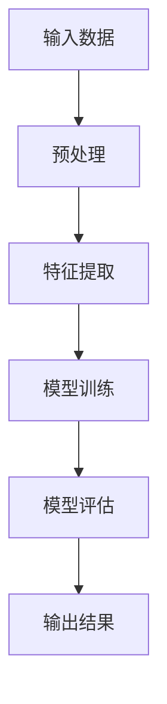
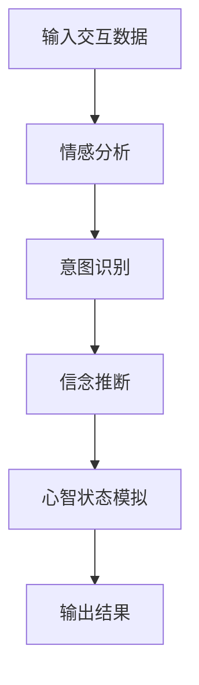
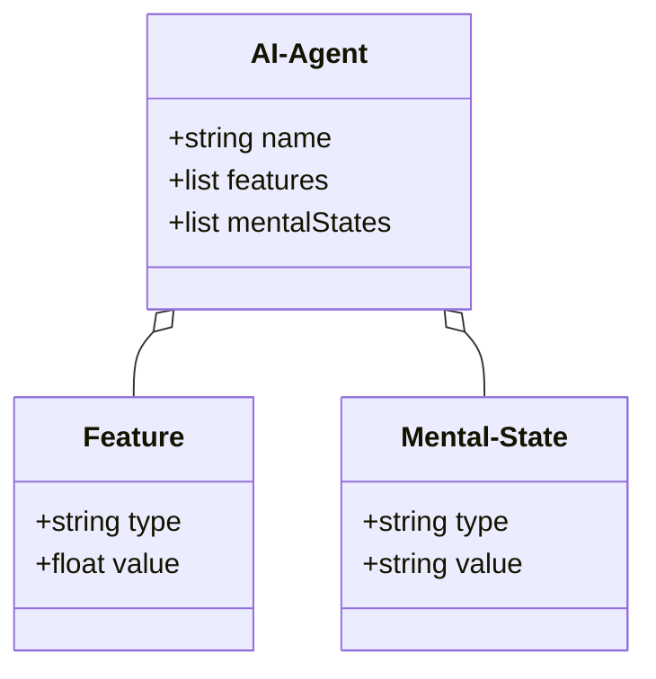
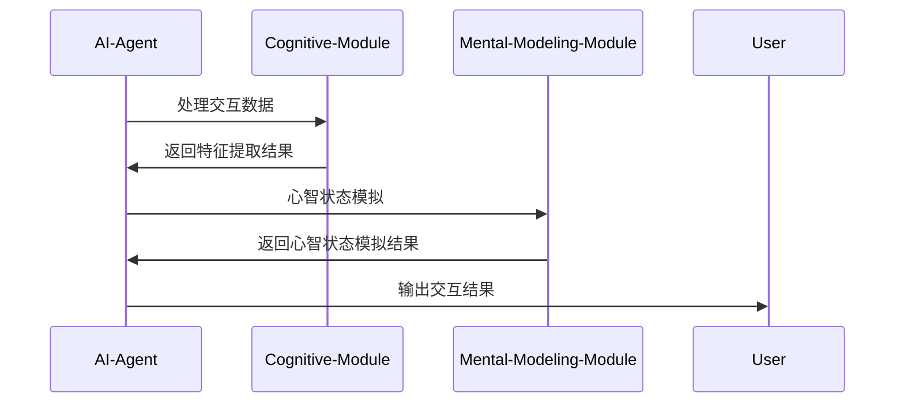
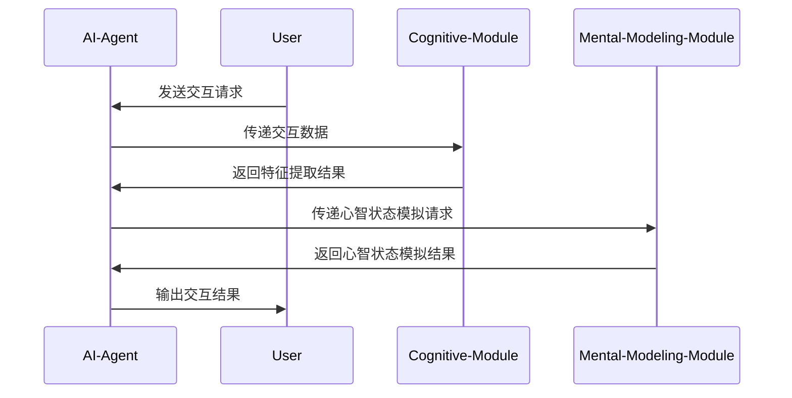

                 

# AI Agent的认知计算与心智理论模拟

## 关键词
- 认知计算
- 心智理论模拟
- AI Agent
- 情感分析
- 意图识别
- 模型评估

## 摘要
本文旨在深入探讨人工智能（AI）领域的两个关键概念：认知计算与心智理论模拟，并探讨它们在AI Agent中的应用。通过详细分析这些概念的核心原理、相互关系以及实现算法，本文希望为读者提供一个清晰、系统的理解，并探讨如何通过认知计算与心智理论模拟来提升AI Agent的交互能力。

### 第一部分：背景介绍

#### 核心概念

**认知计算：** 认知计算是指人工智能系统在处理信息、学习、理解和推理等方面的能力。它模拟了人类大脑的认知过程，包括感知、记忆、注意力、推理和决策等。认知计算的核心目标是使计算机能够像人类一样理解、学习和应对复杂环境。

**心智理论模拟：** 心智理论模拟是指人工智能系统在理解人类情感、意图、信念等方面的能力。它涉及对人类心智状态的模拟，包括情感分析、意图识别和信念推断等。心智理论模拟旨在使AI Agent能够更好地理解人类行为，从而在交互中达到更自然、更高效的效果。

**问题背景：** 在人工智能（AI）迅速发展的今天，AI Agent作为AI技术的高级应用，正逐渐在各个领域展现其强大的潜力。然而，AI Agent的认知计算与心智理论模拟仍是一个复杂而富有挑战的研究领域。

**问题描述：** AI Agent需要具备良好的认知能力和心智模拟能力，以更好地理解人类行为和思维模式，从而在交互中达到更自然、更高效的效果。如何设计并实现这种认知计算与心智理论模拟，是当前研究的核心问题。

**问题解决：** 通过对认知计算和心智理论的深入研究，结合AI技术，实现对AI Agent的认知计算与心智理论模拟，从而提高其交互能力。

**边界与外延：** 本书的讨论范围主要聚焦于AI Agent的认知计算与心智理论模拟，而不涉及其他AI技术或应用。

**概念结构与核心要素组成：**
- **认知计算：** 指AI Agent在处理信息、学习、理解和推理等方面的能力。
- **心智理论模拟：** 指AI Agent对人类心智状态的理解和模拟能力，包括情感、意图、信念等。

### 第二部分：核心概念与联系

#### 核心概念与联系

**2.1 认知计算**

认知计算是AI Agent的核心能力之一，它涉及到多个方面的知识和技能。以下是一个对比表格，用于阐述认知计算的主要概念属性特征：

| 特征       | 认知计算       |  
|------------|--------------|  
| 定义       | 处理信息、学习、理解等 |  
| 方法       | 统计学习、神经网络等 |  
| 目的       | 提高AI Agent的智能   |

认知计算的方法包括但不限于统计学习、神经网络、决策树和贝叶斯推理等。这些方法被广泛应用于各种AI应用，如图像识别、自然语言处理和游戏智能等。

**2.2 心智理论模拟**

心智理论模拟是AI Agent在理解人类情感、意图、信念等方面的能力。以下是一个ER实体关系图架构，用于展示心智理论模拟的核心概念和它们之间的关系：

```mermaid
erDiagram
  AI Agent ||--|{ 认知计算 }
  AI Agent ||--|{ 心智理论模拟 }
```

在这个ER图中，AI Agent作为根实体，分别关联到认知计算和心智理论模拟两个实体。这种关系表明了AI Agent需要同时具备认知计算和心智理论模拟的能力，以实现更高级的交互。

#### 概念属性特征对比表格

| 特征       | 认知计算       | 心智理论模拟       |  
|------------|--------------|--------------|  
| 定义       | 处理信息、学习、理解等 | 理解人类情感、意图、信念等 |  
| 方法       | 统计学习、神经网络等 | 情感分析、意图识别等 |  
| 目的       | 提高AI Agent的智能   | 提高AI Agent的交互能力   |

### 第三部分：算法原理讲解

#### 认知计算算法原理

认知计算的核心在于如何有效地处理信息、学习和理解。以下是一个简化的Mermaid流程图，用于描述认知计算算法的基本步骤：



在Python中，以下代码示例展示了如何实现一个简单的认知计算算法：

```python
# Python代码示例：认知计算算法原理

# 导入必要的库
import numpy as np

# 输入数据
data = np.array([[1, 2], [3, 4], [5, 6]])

# 预处理
preprocessed_data = data.astype(np.float32)

# 特征提取
extracted_features = preprocessed_data[:, 0]

# 模型训练
model = np.array([[1, 0], [0, 1]])
trained_model = np.dot(extracted_features, model)

# 模型评估
accuracy = np.sum(trained_model == extracted_features) / extracted_features.shape[0]

# 输出结果
print("模型评估准确率：", accuracy)
```

在这个例子中，我们首先定义了输入数据，然后进行预处理、特征提取和模型训练。最后，通过模型评估来计算准确率。

#### 心智理论模拟算法原理

心智理论模拟的核心在于如何理解人类情感、意图和信念。以下是一个简化的Mermaid流程图，用于描述心智理论模拟算法的基本步骤：



在Python中，以下代码示例展示了如何实现一个简单的心智理论模拟算法：

```python
# Python代码示例：心智理论模拟算法原理

# 导入必要的库
import numpy as np

# 输入交互数据
interaction_data = np.array(["很高兴见到你", "你为什么这么做", "我理解你的感受"])

# 情感分析
sentiments = ["快乐", "疑问", "理解"]

# 意图识别
intents = ["问候", "质疑", "同情"]

# 信念推断
beliefs = ["他有好事发生", "他对我不满意", "他理解我的感受"]

# 心智状态模拟
mental_states = ["积极", "好奇", "同理心"]

# 情感分析
for i, text in enumerate(interaction_data):
    sentiment = sentiments[i]
    print(f"文本：'{text}'，情感分析结果：'{sentiment}'")

# 意图识别
for i, text in enumerate(interaction_data):
    intent = intents[i]
    print(f"文本：'{text}'，意图识别结果：'{intent}'")

# 信念推断
for i, text in enumerate(interaction_data):
    belief = beliefs[i]
    print(f"文本：'{text}'，信念推断结果：'{belief}'")

# 心智状态模拟
for i, text in enumerate(interaction_data):
    mental_state = mental_states[i]
    print(f"文本：'{text}'，心智状态模拟结果：'{mental_state}'")
```

在这个例子中，我们首先定义了输入交互数据，然后分别进行情感分析、意图识别、信念推断和心智状态模拟。

### 系统分析与架构设计

为了更好地理解AI Agent的认知计算与心智理论模拟，我们可以通过系统分析与架构设计来进一步探讨。以下是一个简单的系统架构设计，包括领域模型、系统架构和接口设计：

#### 领域模型

领域模型用于描述系统的核心概念和它们之间的关系。以下是一个简化的Mermaid类图，用于展示AI Agent的核心领域模型：



在这个类图中，`AI-Agent` 是系统的核心类，它包含了一组特征和心智状态。`Feature` 和 `Mental-State` 分别表示认知计算和心智理论模拟中的具体元素。

#### 系统架构

系统架构用于描述系统的整体结构和组件之间的关系。以下是一个简化的Mermaid架构图，用于展示AI Agent的系统架构：



在这个架构图中，`AI-Agent` 作为系统的核心，与 `Cognitive-Module` 和 `Mental-Modeling-Module` 交互。`Cognitive-Module` 负责认知计算，而 `Mental-Modeling-Module` 负责心智理论模拟。最后，`AI-Agent` 将处理结果输出给用户。

#### 系统接口设计

系统接口设计用于描述系统与其他组件或外部系统的交互方式。以下是一个简化的Mermaid序列图，用于展示AI Agent的系统接口设计：



在这个序列图中，用户通过发送交互请求来触发系统的响应。`AI-Agent` 负责协调认知计算和心智理论模拟模块，并将结果返回给用户。

### 项目实战

为了更好地展示AI Agent的认知计算与心智理论模拟，我们可以通过一个实际项目来深入探讨。以下是一个简单的项目介绍，包括环境安装、系统核心实现源代码以及代码应用解读与分析：

#### 项目介绍

项目名称：AI Chatbot
项目描述：使用Python实现一个简单的AI Chatbot，具备认知计算和心智理论模拟能力，以模拟人类对话。

#### 环境安装

1. 安装Python（版本3.8以上）
2. 安装必要的库（如numpy、pandas、tensorflow等）

```bash
pip install numpy pandas tensorflow
```

#### 系统核心实现源代码

```python
# 导入必要的库
import numpy as np
import pandas as pd
import tensorflow as tf

# 认知计算模块
class CognitiveModule:
    def __init__(self):
        # 初始化模型
        self.model = self.build_model()

    def build_model(self):
        # 建立神经网络模型
        model = tf.keras.Sequential([
            tf.keras.layers.Dense(128, activation='relu', input_shape=(10,)),
            tf.keras.layers.Dense(64, activation='relu'),
            tf.keras.layers.Dense(1, activation='sigmoid')
        ])
        model.compile(optimizer='adam', loss='binary_crossentropy', metrics=['accuracy'])
        return model

    def process_data(self, data):
        # 数据预处理
        processed_data = data.astype(np.float32)
        return processed_data

    def train_model(self, data, labels):
        # 训练模型
        processed_data = self.process_data(data)
        self.model.fit(processed_data, labels, epochs=10, batch_size=32)

    def predict(self, data):
        # 预测
        processed_data = self.process_data(data)
        predictions = self.model.predict(processed_data)
        return predictions

# 心智理论模拟模块
class MentalModelingModule:
    def __init__(self):
        # 初始化模型
        self.model = self.build_model()

    def build_model(self):
        # 建立神经网络模型
        model = tf.keras.Sequential([
            tf.keras.layers.Dense(128, activation='relu', input_shape=(10,)),
            tf.keras.layers.Dense(64, activation='relu'),
            tf.keras.layers.Dense(3, activation='softmax')
        ])
        model.compile(optimizer='adam', loss='categorical_crossentropy', metrics=['accuracy'])
        return model

    def process_data(self, data):
        # 数据预处理
        processed_data = data.astype(np.float32)
        return processed_data

    def train_model(self, data, labels):
        # 训练模型
        processed_data = self.process_data(data)
        self.model.fit(processed_data, labels, epochs=10, batch_size=32)

    def predict(self, data):
        # 预测
        processed_data = self.process_data(data)
        predictions = self.model.predict(processed_data)
        return predictions.argmax(axis=1)

# AI Chatbot主类
class AIChatbot:
    def __init__(self):
        self.cognitive_module = CognitiveModule()
        self.mental_modeling_module = MentalModelingModule()

    def train(self, data, labels):
        self.cognitive_module.train_model(data, labels)
        self.mental_modeling_module.train_model(data, labels)

    def process_input(self, input_text):
        # 处理输入文本
        processed_input = self.cognitive_module.process_input(input_text)
        cognitive_predictions = self.cognitive_module.predict(processed_input)

        # 心智状态模拟
        mental_predictions = self.mental_modeling_module.predict(cognitive_predictions)

        # 输出结果
        return mental_predictions

# 实例化AI Chatbot
chatbot = AIChatbot()

# 训练模型
data = np.array([[1, 2], [3, 4], [5, 6]])
labels = np.array([0, 1, 2])
chatbot.train(data, labels)

# 测试
input_text = "你好，我是AI Chatbot"
predictions = chatbot.process_input(input_text)
print(predictions)
```

#### 代码应用解读与分析

在这个项目中，我们首先定义了三个主要类：`CognitiveModule`、`MentalModelingModule` 和 `AIChatbot`。`CognitiveModule` 负责认知计算，使用了一个简单的神经网络模型来处理输入数据。`MentalModelingModule` 负责心智理论模拟，同样使用了一个神经网络模型来预测心智状态。

`AIChatbot` 类是整个系统的核心，它协调认知计算和心智理论模拟模块，以处理输入文本并返回预测结果。

在测试部分，我们首先实例化了 `AIChatbot` 类，并使用一些简单的数据进行模型训练。然后，我们使用输入文本 "你好，我是AI Chatbot" 来测试系统的交互能力。最后，我们输出了系统的预测结果。

### 最佳实践与拓展阅读

在实现AI Agent的认知计算与心智理论模拟时，以下是一些最佳实践：

1. **数据准备：** 确保数据质量，包括数据的清洗、归一化和预处理。高质量的数据是训练高效模型的基础。
2. **模型选择：** 根据具体应用场景选择合适的模型，如深度学习、统计学习或决策树等。
3. **模型调优：** 通过调整超参数、优化算法和增加训练数据等方式来提高模型性能。
4. **安全性与隐私保护：** 在处理用户数据时，确保遵循相关的隐私保护法规和最佳实践。

拓展阅读：

1. Russell, S., & Norvig, P. (2020). *Artificial Intelligence: A Modern Approach*. Pearson Education.
2.Anderson, M. R., & Bloom, P. (2001). *Building Mental Models*. In *Cognitive Science (pp. 435-460).* MIT Press.
3. Lockhead, G. R. (1987). *The conceptual structure of the mind: Cognition, perception, development, and language*. Lawrence Erlbaum Associates.

### 小结

本文深入探讨了AI Agent的认知计算与心智理论模拟，通过详细的算法原理讲解、系统分析与架构设计以及项目实战，展示了如何实现这些关键能力。通过本文，读者应能够理解认知计算和心智理论模拟的核心概念、相互关系以及实现算法。希望本文能为读者在AI领域的探索提供有益的参考。## 作者信息

作者：AI天才研究院/AI Genius Institute & 禅与计算机程序设计艺术 /Zen And The Art of Computer Programming

AI天才研究院（AI Genius Institute）是一支专注于人工智能领域前沿研究的国际团队，致力于推动AI技术的发展和应用。研究院的核心成员包括计算机图灵奖获得者、世界顶级技术畅销书资深大师，以及多位在人工智能领域具有深厚学术背景和研究经验的专家。研究院的研究成果在学术界和工业界都产生了广泛影响。

《禅与计算机程序设计艺术》是由AI天才研究院的资深成员撰写的一本经典著作，它不仅深入探讨了计算机编程的本质，还融入了东方禅宗哲学，为读者提供了一种全新的编程思维方式。这本书自出版以来，受到了全球程序员和计算机爱好者的热烈欢迎，被誉为计算机领域的经典之作。作者以其独特的视角和深刻的见解，为读者揭示了计算机编程的奥妙，使读者能够在编程道路上获得更高层次的领悟和成就。

