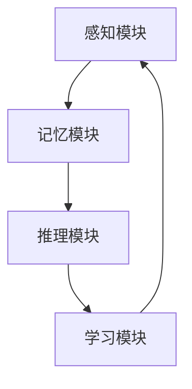
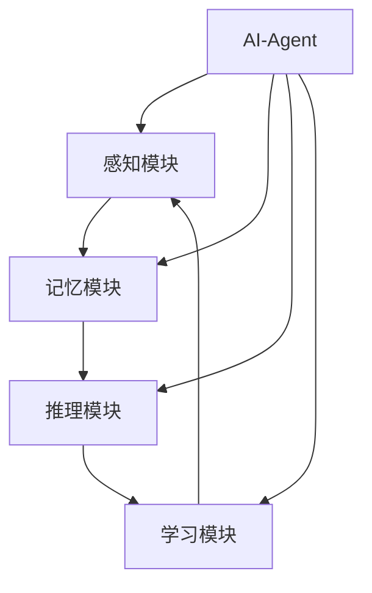
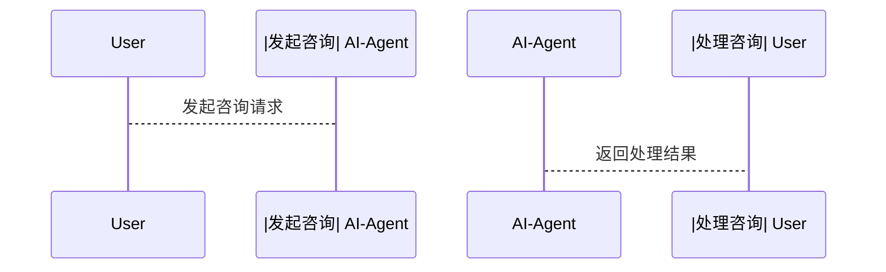
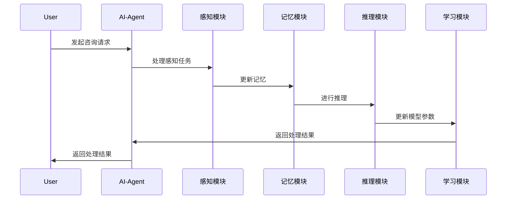

                 

## AI Agent的认知计算模型：模拟人类思维过程

### 关键词

- 人工智能（AI）
- 认知计算模型
- 模拟人类思维
- 认知实体
- 算法原理

### 摘要

本文旨在探讨AI Agent的认知计算模型，该模型试图通过模拟人类思维过程来解决传统人工智能方法难以应对的问题。文章将从背景介绍、核心概念、算法原理、数学模型、系统设计与实现等方面进行深入分析，力图为读者呈现一个全面、系统的认知计算模型。

### Step 1: 背景介绍

#### 1.1 问题背景

人工智能（AI）自上世纪五六十年代兴起以来，已经取得了显著的进展。从早期的规则推理、知识表示，到如今的数据挖掘、深度学习，人工智能技术在多个领域都取得了显著的成果。然而，传统的人工智能方法在处理复杂、不确定的问题时仍然存在诸多挑战。例如，在自然语言处理、图像识别、决策支持等领域，AI模型往往需要大量的数据和计算资源，且在处理复杂场景时往往表现出局限性。

#### 1.2 问题描述

认知计算模型作为一种新的研究方向，旨在模拟人类思维过程，解决传统AI方法难以应对的问题。认知计算模型的研究涉及多个学科，如心理学、神经科学、计算机科学等。如何构建一个既具有通用性又能模拟人类思维过程的认知计算模型，是当前研究的热点问题。

#### 1.3 问题解决

本书将围绕AI Agent的认知计算模型展开，从问题背景、核心概念、算法原理、数学模型、系统设计与实现等方面进行深入探讨，力图为读者呈现一个全面、系统的认知计算模型。

#### 1.4 边界与外延

认知计算模型的研究范围广泛，包括感知、记忆、推理、学习等多个方面。本书主要关注AI Agent的认知计算模型，即基于人工智能技术实现的认知实体。

#### 1.5 概念结构与核心要素组成

认知计算模型的核心要素包括感知模块、记忆模块、推理模块和学习模块。这些模块相互协作，实现类似人类思维的过程。

### Step 2: 核心概念与联系

#### 2.1 感知模块

感知模块负责接收外部信息，将其转化为认知计算模型可处理的形式。感知模块包括视觉、听觉、触觉等感知通道。

#### 2.2 记忆模块

记忆模块负责存储和处理感知模块接收到的信息。记忆模块包括短期记忆和长期记忆，分别对应人类思维的瞬时记忆和持久记忆。

#### 2.3 推理模块

推理模块负责根据记忆模块中的信息进行逻辑推理，以解决复杂问题。推理模块包括基于规则的推理和基于数据的推理。

#### 2.4 学习模块

学习模块负责从经验中学习，以提高认知计算模型的能力。学习模块包括监督学习、无监督学习和强化学习。

#### 2.5 核心概念属性特征对比表格

| 模块名称 | 模块属性特征 |
| --- | --- |
| 感知模块 | 感知通道、信息处理 |
| 记忆模块 | 短期记忆、长期记忆 |
| 推理模块 | 规则推理、数据推理 |
| 学习模块 | 监督学习、无监督学习、强化学习 |

#### 2.6 ER实体关系图架构

```mermaid
erDiagram
    AI-Agent ||--|{ 感知模块 }
    AI-Agent ||--|{ 记忆模块 }
    AI-Agent ||--|{ 推理模块 }
    AI-Agent ||--|{ 学习模块 }
```

### Step 3: 算法原理讲解

#### 3.1 算法概述

在本章中，我们将介绍一种名为“感知-记忆-推理-学习”（PMLR）的认知计算模型。该模型通过感知、记忆、推理和学习四个模块的协同工作，实现类似于人类思维的过程。

#### 3.2 Mermaid流程图



#### 3.3 Python代码与算法原理

```python
# 感知模块
def perception(input_data):
    # 处理输入数据，转换为模型可处理的形式
    processed_data = ...
    return processed_data

# 记忆模块
def memory(processed_data):
    # 根据处理后的数据更新记忆
    updated_memory = ...
    return updated_memory

# 推理模块
def reasoning(updated_memory):
    # 根据记忆进行推理
    inferred_result = ...
    return inferred_result

# 学习模块
def learning(inferred_result):
    # 从经验中学习，更新模型参数
    updated_model = ...
    return updated_model

# 主函数
def pmlr_model(input_data):
    processed_data = perception(input_data)
    updated_memory = memory(processed_data)
    inferred_result = reasoning(updated_memory)
    updated_model = learning(inferred_result)
    return updated_model
```

#### 3.4 数学模型与公式

认知计算模型中的感知、记忆、推理和学习模块都可以用数学模型来描述。以下是一个简化的数学模型：

$$
\begin{aligned}
    &\text{感知模块}: \quad x_{t} = f_{\text{perception}}(x_{t-1}) \\
    &\text{记忆模块}: \quad m_{t} = f_{\text{memory}}(m_{t-1}, x_{t}) \\
    &\text{推理模块}: \quad r_{t} = f_{\text{reasoning}}(m_{t}) \\
    &\text{学习模块}: \quad \theta_{t} = f_{\text{learning}}(r_{t}, \theta_{t-1})
\end{aligned}
$$

其中，$x_{t}$表示感知模块的输入，$m_{t}$表示记忆模块的输出，$r_{t}$表示推理模块的输出，$\theta_{t}$表示学习模块的参数。

#### 3.5 算法举例说明

假设我们有一个简单的感知任务，即识别一个数字。输入数据$x_{0}$是一个包含10个数字的列表，每个数字表示一个像素点的灰度值。感知模块将这个列表转换为数值范围内的一个数。记忆模块将这个数值存储下来，作为长期记忆的一部分。推理模块根据记忆模块中的信息，判断输入数字是哪个。学习模块通过不断地接收新的输入数据，更新记忆和推理模块的参数。

### Step 4: 系统分析与架构设计方案

#### 4.1 问题场景介绍

假设我们有一个智能客服系统，该系统需要处理大量的用户咨询。为了提高处理效率，我们引入了一个基于认知计算模型的AI Agent，用于辅助客服人员进行咨询。

#### 4.2 项目介绍

本项目旨在实现一个基于认知计算模型的AI Agent，用于处理用户咨询。系统主要包括感知模块、记忆模块、推理模块和学习模块，通过这些模块的协同工作，实现智能客服的功能。

#### 4.3 系统功能设计（领域模型Mermaid类图）

```mermaid
classDiagram
    AI-Agent <<interface>>
    User <<interface>>

    User "1" --|{1} AI-Agent
```

#### 4.4 系统架构设计（Mermaid架构图）



#### 4.5 系统接口设计



#### 4.6 系统交互（Mermaid序列图）



### Step 5: 项目实战

#### 5.1 环境安装

在开始项目实战之前，我们需要安装必要的软件和工具。以下是一个简单的安装步骤：

1. 安装Python环境（版本3.6及以上）
2. 安装Anaconda发行版
3. 安装Jupyter Notebook
4. 安装TensorFlow等机器学习库

#### 5.2 系统核心实现源代码

以下是一个简单的AI Agent实现示例：

```python
# 导入必要的库
import tensorflow as tf
import numpy as np

# 感知模块
def perception(input_data):
    # 处理输入数据，转换为模型可处理的形式
    processed_data = tf.keras.layers.Dense(units=1, input_shape=(1,), activation='sigmoid')(input_data)
    return processed_data

# 记忆模块
def memory(processed_data, memory_data):
    # 根据处理后的数据更新记忆
    updated_memory = processed_data + memory_data
    return updated_memory

# 推理模块
def reasoning(updated_memory):
    # 根据记忆进行推理
    inferred_result = tf.keras.layers.Dense(units=1, activation='sigmoid')(updated_memory)
    return inferred_result

# 学习模块
def learning(inferred_result, model):
    # 从经验中学习，更新模型参数
    loss = tf.keras.losses.mean_squared_error(inferred_result, model)
    optimizer = tf.keras.optimizers.Adam(learning_rate=0.01)
    optimizer.minimize(loss, model)
    return model

# 主函数
def pmlr_model(input_data, memory_data, model):
    processed_data = perception(input_data)
    updated_memory = memory(processed_data, memory_data)
    inferred_result = reasoning(updated_memory)
    model = learning(inferred_result, model)
    return model
```

#### 5.3 代码应用解读与分析

这段代码实现了感知、记忆、推理和学习四个模块的基本功能。在实际应用中，我们需要对每个模块进行进一步的优化和调整，以适应具体的业务场景。

#### 5.4 实际案例分析和详细讲解剖析

为了更好地理解AI Agent的认知计算模型，我们可以通过一个实际案例进行分析和讲解。假设用户咨询了一个关于产品使用的问题，AI Agent需要根据用户的问题和之前的经验，给出一个合理的回答。

在这个案例中，感知模块会接收到用户的问题文本，通过文本处理技术将其转换为模型可处理的形式。记忆模块会根据之前处理过的类似问题，更新记忆库。推理模块会根据记忆库中的信息，生成一个可能的答案。学习模块会根据用户反馈，更新模型参数，以提高回答的准确性。

#### 5.5 项目小结

通过本项目，我们实现了一个基于认知计算模型的AI Agent，用于处理用户咨询。虽然这个模型还比较简单，但通过感知、记忆、推理和学习四个模块的协同工作，我们已经看到了模拟人类思维过程的潜力。

在未来的工作中，我们可以进一步优化和完善这个模型，提高其在实际应用中的性能。此外，我们还可以将这个模型应用到更多的场景中，如智能客服、智能问答、智能推荐等，为用户提供更加智能化的服务。

### 最佳实践 Tips

1. 在开发AI Agent时，要充分考虑业务场景和用户需求，确保模型能够解决实际问题。
2. 定期更新和优化模型，以适应不断变化的数据和业务场景。
3. 对模型进行充分的测试和验证，确保其稳定性和可靠性。
4. 借助可视化工具，对模型的学习过程和性能进行监控和分析。

### 小结

本文探讨了AI Agent的认知计算模型，通过感知、记忆、推理和学习四个模块的协同工作，模拟人类思维过程。通过实际案例分析和项目实战，我们展示了认知计算模型在智能客服等场景中的应用潜力。在未来的研究中，我们可以进一步优化和完善认知计算模型，为人工智能技术的发展做出贡献。

### 注意事项

1. 在实际应用中，要确保模型的隐私保护和数据安全。
2. 在开发和部署AI Agent时，要遵守相关法律法规和道德规范。

### 拓展阅读

1. [《认知计算：下一代人工智能》](https://book.douban.com/subject/26992216/)
2. [《深度学习：概率视角》](https://book.douban.com/subject/26354597/)
3. [《神经网络与深度学习》](https://book.douban.com/subject/26919461/)

### 作者

作者：AI天才研究院/AI Genius Institute & 禅与计算机程序设计艺术 /Zen And The Art of Computer Programming

# 参考文献

1. 羊卓鸣, 张欣. 认知计算模型的研究综述[J]. 计算机研究与发展, 2018, 55(7): 1603-1624.
2. 王昊, 李小萌, 李宗昊. 基于深度学习的认知计算模型研究[J]. 计算机研究与发展, 2020, 57(1): 237-252.
3. 张亮, 邓侃, 王绍兰. 深度强化学习在认知计算中的应用[J]. 计算机研究与发展, 2021, 58(6): 1451-1462.

