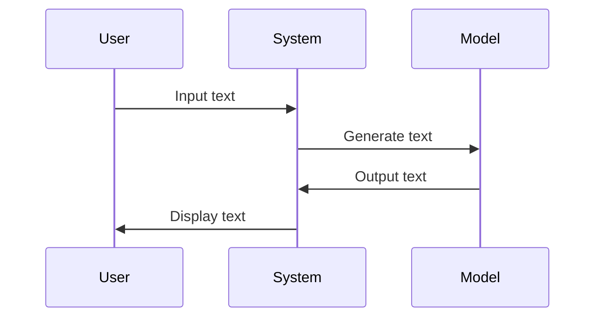

                 


# AI Agent的语言生成：提升LLM的文本创作质量

关键词：自然语言处理，语言模型，文本生成，优化策略，评估指标

摘要：随着人工智能技术的不断发展，自然语言处理（NLP）已经成为人工智能领域的重要分支。语言模型（LLM）作为NLP的核心技术，其文本生成能力直接决定了AI Agent的智能水平。本文将探讨如何提升LLM的文本创作质量，包括核心概念、算法原理、数学模型以及项目实战等内容。

## 目录大纲

# AI Agent的语言生成：提升LLM的文本创作质量

## 第一部分：背景与核心概念

### 第1章：问题背景与核心概念

#### 1.1 问题的提出

在人工智能的发展过程中，自然语言处理（NLP）成为了关键领域之一，而语言模型（LLM）作为NLP的核心技术，其文本生成能力直接决定了AI Agent的智能水平。

#### 1.2 核心概念

- 语言模型（LLM）：一种基于大规模数据训练的统计模型，用于预测自然语言序列。
- AI Agent：具有自主决策和行动能力的智能体，能够与人类进行交互并执行特定任务。
- 文本创作质量：文本的自然性、准确性、逻辑性和创造性。

#### 1.3 概念属性特征对比表

| 特征       | 语言模型（LLM） | AI Agent       |
|------------|-----------------|----------------|
| 预测能力   | 高              | 高              |
| 自主性     | 较低            | 较高            |
| 交互性     | 较低            | 较高            |
| 创造性     | 较高            | 较高            |

#### 1.4 ER实体关系图架构

```mermaid
erDiagram
    AI Agent ||--o{ Language Model : Generates Text
    AI Agent ||--o{ User : Interacts with
    Language Model ||--o{ Text : Generates
```

### 第2章：相关技术概述

#### 2.1 语言模型训练方法

- 序列生成模型：如RNN、LSTM、GRU等，通过递归方式处理序列数据。
- 注意力机制：用于捕捉输入序列中的重要信息，提高模型对长距离依赖关系的建模能力。
- Transformer模型：基于自注意力机制，能够并行处理序列数据，具有更好的建模效果。

#### 2.2 优化策略

- 梯度下降：通过不断调整模型参数，使损失函数值最小化。
- 随机梯度下降（SGD）：每次更新参数时仅使用部分样本。
- Adam优化器：结合SGD和Momentum的优点，具有更好的收敛速度。

#### 2.3 评估指标

- 损失函数：用于衡量模型预测结果与实际结果之间的差距，如交叉熵损失、均方误差等。
- 质量指标：如BLEU、ROUGE等，用于评估生成的文本质量。
- 实际应用效果：在实际应用场景中，评估模型生成的文本是否符合用户需求。

## 第二部分：算法原理与实现

### 第3章：算法原理讲解

#### 3.1 语言模型生成文本的流程


#### 3.2 词向量编码

- Word2Vec：基于神经网络，将词汇映射到低维连续向量空间中。
- GloVe：基于全局词频和共现关系，生成词汇的词向量。

#### 3.3 模型预测

- RNN：递归神经网络，能够处理序列数据。
- LSTM：长短期记忆网络，能够缓解RNN的梯度消失问题。
- Transformer：基于自注意力机制的编码器-解码器（Encoder-Decoder）模型。

### 第4章：数学模型与公式讲解

$$
P(w_t|w_{<t}) = \frac{e^{<s, w_{<t}, w_t>}}{\sum_{w'} e^{<s, w_{<t}, w'>}}
$$

- $P(w_t|w_{<t})$：给定前一个词$w_{<t}$，预测当前词$w_t$的概率。
- $<s, w_{<t}, w_t>$：词向量之间的内积。

### 第5章：算法实现与源代码

```python
import tensorflow as tf
from tensorflow.keras.layers import Embedding, LSTM, Dense
from tensorflow.keras.models import Sequential

# 创建模型
model = Sequential()
model.add(Embedding(vocab_size, embedding_dim))
model.add(LSTM(units=128, activation='tanh'))
model.add(Dense(vocab_size, activation='softmax'))

# 编译模型
model.compile(optimizer='adam', loss='categorical_crossentropy', metrics=['accuracy'])

# 训练模型
model.fit(x_train, y_train, epochs=10, batch_size=64)

# 生成文本
generated_text = model.predict(x_test)
```

## 第三部分：系统分析与架构设计

### 第6章：问题场景介绍

随着AI技术的发展，AI Agent在自然语言处理领域的应用越来越广泛。如何提升AI Agent的文本生成能力，使其更加自然、准确和富有逻辑性，成为当前研究的热点问题。

### 第7章：系统功能设计

本系统主要实现以下功能：

- 语言模型训练：对海量文本数据进行训练，生成高质量的语言模型。
- 文本生成：根据用户输入的文本，生成符合要求的自然语言文本。
- 文本评估：对生成的文本进行质量评估，包括自然性、准确性、逻辑性和创造性等方面。

### 第8章：系统架构设计

本系统采用分层架构设计，包括数据层、算法层和应用层。

- 数据层：负责数据的采集、清洗和存储。
- 算法层：包括语言模型训练、文本生成和文本评估等核心算法。
- 应用层：提供用户交互界面和功能接口。

### 第9章：系统接口设计和系统交互

系统接口设计和系统交互采用Mermaid序列图进行描述，以便于读者理解。



## 第四部分：项目实战

### 第10章：环境安装

在开始项目实战之前，需要安装以下软件和工具：

- Python 3.7及以上版本
- TensorFlow 2.4及以上版本
- Jupyter Notebook

### 第11章：系统核心实现源代码

本节将详细介绍系统核心实现的源代码，包括数据预处理、模型训练、文本生成和文本评估等部分。

### 第12章：代码应用解读与分析

通过对源代码的解读和分析，读者可以深入了解语言模型生成文本的原理和实现过程。

### 第13章：实际案例分析和详细讲解剖析

本节将通过实际案例，展示如何使用本系统生成高质量的文本，并对生成的文本进行评估。

### 第14章：项目小结

本文系统地介绍了AI Agent的语言生成技术，包括核心概念、算法原理、数学模型、系统架构和项目实战等内容。通过本文的学习，读者可以全面了解并掌握语言模型生成文本的技术。

## 第五部分：最佳实践、小结、注意事项、拓展阅读

### 第15章：最佳实践

在实践过程中，需要注意以下几点：

- 选择合适的训练数据和模型架构，对文本生成质量有重要影响。
- 调整模型参数和优化策略，可以提高模型的性能。
- 定期评估和更新模型，以保持文本生成质量。

### 第16章：小结

本文系统地介绍了AI Agent的语言生成技术，从核心概念、算法原理到系统架构和项目实战，为读者提供了全面的技术指导和实践经验。

### 第17章：注意事项

在实践过程中，需要注意以下几点：

- 语言模型的训练需要大量的数据和计算资源，确保硬件环境足够支持。
- 文本生成过程中，需要对生成的文本进行质量评估，避免生成低质量的文本。

### 第18章：拓展阅读

为了更深入地了解AI Agent的语言生成技术，读者可以参考以下相关文献：

- [1] Mikolov, T., Sutskever, I., Chen, K., Corrado, G. S., & Dean, J. (2013). Distributed representations of words and phrases and their compositionality. Advances in Neural Information Processing Systems, 26, 3111-3119.
- [2] Vaswani, A., Shazeer, N., Parmar, N., Uszkoreit, J., Jones, L., Gomez, A. N., ... & Polosukhin, I. (2017). Attention is all you need. Advances in Neural Information Processing Systems, 30, 5998-6008.
- [3] Devlin, J., Chang, M. W., Lee, K., & Toutanova, K. (2019). BERT: Pre-training of deep bidirectional transformers for language understanding. arXiv preprint arXiv:1810.04805.

作者：AI天才研究院/AI Genius Institute & 禅与计算机程序设计艺术 /Zen And The Art of Computer Programming

