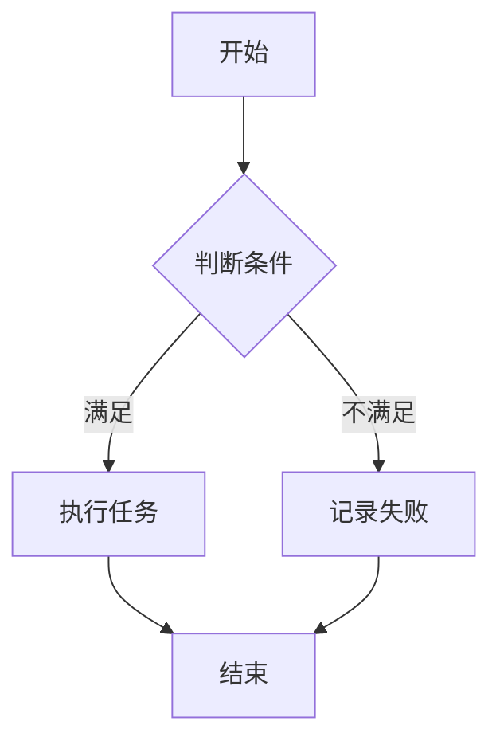

                 

# AI Agent的课程学习：优化知识获取的顺序和策略

> 关键词：AI Agent，知识获取，优化策略，顺序优化，人工智能

> 摘要：本文将探讨AI Agent的课程学习，重点研究知识获取的顺序和策略。我们将通过分析AI Agent的定义、特点和应用领域，深入理解其工作原理。随后，我们将探讨知识获取的基本原理、方法和挑战，并提出优化知识获取顺序和策略的方法。最后，我们将结合实际案例，讨论AI Agent知识获取的综合应用，为AI Agent的发展提供有益的指导。

## 第一部分：AI Agent的课程学习基础

### 第1章：AI Agent概述

#### 1.1 AI Agent的定义与分类

##### 1.1.1 AI Agent的定义

AI Agent，即人工智能代理，是一种能够执行特定任务的自动化系统，它能够自主地感知环境、制定策略并采取行动，以实现预设的目标。AI Agent的定义涵盖了以下几个方面：

- **自主性**：AI Agent能够在没有外部干预的情况下，自主地执行任务。
- **适应性**：AI Agent能够根据环境的变化调整其行为策略。
- **学习能力**：AI Agent能够通过经验和数据不断优化自身的行为。

##### 1.1.2 AI Agent的分类

AI Agent可以根据不同的标准进行分类。以下是几种常见的分类方法：

- **按任务类型分类**：分为决策型Agent、感知型Agent和行动型Agent。
  - **决策型Agent**：负责制定决策策略，如智能交通系统。
  - **感知型Agent**：负责感知环境信息，如智能传感器。
  - **行动型Agent**：负责执行具体行动，如机器人。

- **按实现技术分类**：分为规则型Agent、统计型Agent和混合型Agent。
  - **规则型Agent**：基于预先定义的规则进行决策。
  - **统计型Agent**：基于数据分析进行决策。
  - **混合型Agent**：结合规则和统计方法进行决策。

#### 1.2 AI Agent的核心特点

##### 1.2.1 自动性

AI Agent的自动性是其最核心的特点之一。它能够在不需要人类干预的情况下，自动执行任务。这种自动性来源于AI Agent的自主决策能力和自主行动能力。

##### 1.2.2 自主性

AI Agent的自主性意味着它能够在没有外部干预的情况下，自主地感知环境、制定策略并采取行动。这种自主性使得AI Agent能够在复杂的动态环境中，自主地完成任务。

##### 1.2.3 学习能力

AI Agent的学习能力是其不断进步和优化自身性能的关键。通过不断学习和经验积累，AI Agent能够不断提高其任务执行能力。

#### 1.3 AI Agent的应用领域

##### 1.3.1 机器学习

AI Agent在机器学习领域有着广泛的应用。例如，在图像识别、自然语言处理和预测分析等方面，AI Agent能够通过学习和优化，实现高效的任务执行。

##### 1.3.2 自然语言处理

自然语言处理是AI Agent的重要应用领域之一。AI Agent能够理解和生成自然语言，实现人机交互、智能客服和智能翻译等功能。

##### 1.3.3 计算机视觉

计算机视觉是AI Agent的另一个重要应用领域。AI Agent能够通过图像识别和目标跟踪等技术，实现对现实世界的理解和交互。

#### 1.4 AI Agent的未来发展趋势

##### 1.4.1 AI Agent在智能家居中的应用

随着智能家居的普及，AI Agent将在智能家居领域发挥越来越重要的作用。例如，智能安防、智能家电和智能照明等。

##### 1.4.2 AI Agent在医疗健康中的应用

AI Agent在医疗健康领域有着广泛的应用前景。例如，智能诊断、智能治疗和健康管理等方面。

##### 1.4.3 AI Agent在工业自动化中的应用

AI Agent在工业自动化领域也有着重要的应用价值。例如，智能生产、智能物流和智能仓储等。

#### 1.5 本章小结

本章对AI Agent进行了概述，包括其定义、特点和应用领域。通过本章的学习，读者可以了解AI Agent的基本概念和其在实际应用中的重要性。

----------------------------------------------------------------

## 第二部分：知识获取与优化策略

### 第2章：知识获取的基本原理

#### 2.1 知识获取的过程

##### 2.1.1 知识采集

知识采集是知识获取的第一步，它涉及从各种来源获取信息，如数据库、互联网和传感器等。知识采集的关键在于如何高效地获取高质量的数据。

##### 2.1.2 知识建模

知识建模是将采集到的信息转化为计算机可以理解的形式。知识建模包括数据清洗、数据整合和数据预处理等步骤。

##### 2.1.3 知识表示

知识表示是将建模后的知识转化为计算机可以处理的形式。知识表示方法包括规则表示、语义网络表示和本体表示等。

#### 2.2 知识获取的方法

##### 2.2.1 半监督学习

半监督学习是一种利用少量标注数据和大量未标注数据的方法。它通过利用未标注数据中的潜在信息，提高学习效果。

##### 2.2.2 无监督学习

无监督学习是一种不依赖于标注数据的学习方法。它通过发现数据中的模式和结构，自动进行知识获取。

##### 2.2.3 强化学习

强化学习是一种基于奖励机制的学习方法。它通过与环境互动，不断调整策略，以实现最优行为。

#### 2.3 知识获取的挑战与解决方案

##### 2.3.1 数据质量

数据质量是知识获取的关键挑战之一。高质量的数据能够提高知识获取的效果，而低质量的数据则可能导致错误和误导。

解决方案包括数据清洗、数据验证和数据质量评估等。

##### 2.3.2 数据量

数据量是知识获取的另一个重要挑战。大量数据能够提供更丰富的信息，但同时也增加了知识获取的难度。

解决方案包括数据抽样、数据压缩和数据集成等。

##### 2.3.3 知识表示的复杂性

知识表示的复杂性是知识获取的另一个挑战。不同的知识表示方法有其适用的场景和局限性。

解决方案包括知识表示的统一化、知识表示的优化和知识表示的自动化等。

#### 2.4 知识获取的实践案例

##### 2.4.1 案例一：基于机器学习的知识获取

在机器学习中，知识获取是关键的一步。通过机器学习算法，可以从大量数据中提取出有价值的信息。

案例一展示了如何利用机器学习算法进行知识获取，包括数据预处理、特征提取和模型训练等步骤。

##### 2.4.2 案例二：基于自然语言处理的知识获取

自然语言处理是知识获取的重要领域之一。通过自然语言处理技术，可以从文本数据中提取出有价值的信息。

案例二展示了如何利用自然语言处理技术进行知识获取，包括文本预处理、实体识别和关系抽取等步骤。

#### 2.5 本章小结

本章介绍了知识获取的基本原理、方法和挑战，并通过实践案例展示了知识获取的实际应用。通过本章的学习，读者可以了解知识获取的过程和关键步骤。

----------------------------------------------------------------

### 第三部分：知识获取顺序的优化

#### 第3章：知识获取顺序的重要性

##### 3.1 知识获取顺序的影响

知识获取的顺序对知识获取的效果有着重要影响。正确的知识获取顺序能够提高知识获取的效率和质量，而错误的知识获取顺序则可能导致知识获取失败。

##### 3.1.1 知识关联性

知识关联性是指不同知识之间的联系和交互。正确的知识获取顺序能够保证知识之间的关联性，从而提高知识的利用效率。

##### 3.1.2 知识实用性

知识实用性是指知识对实际问题的解决能力。正确的知识获取顺序能够确保获取到的知识具有实际应用价值。

##### 3.1.3 知识学习效率

知识学习效率是指知识获取过程中所需的时间和资源。正确的知识获取顺序能够提高知识学习效率，从而降低知识获取成本。

##### 3.2 知识获取顺序优化方法

##### 3.2.1 基于内容的顺序优化

基于内容的顺序优化是一种根据知识内容的重要性进行排序的方法。它通过分析知识内容的关联性，确定知识获取的顺序。

##### 3.2.2 基于需求的顺序优化

基于需求的顺序优化是一种根据用户需求进行排序的方法。它通过分析用户需求，确定知识获取的顺序。

##### 3.2.3 基于智能规划的顺序优化

基于智能规划的顺序优化是一种利用人工智能技术进行排序的方法。它通过规划算法，确定知识获取的最佳顺序。

##### 3.3 知识获取顺序优化的实践应用

##### 3.3.1 教育领域

在教育领域，知识获取顺序的优化可以帮助学生更有效地学习和掌握知识。例如，通过分析学生的学习进度和知识储备，制定个性化的学习计划。

##### 3.3.2 企业培训

在企业培训中，知识获取顺序的优化可以帮助员工更快速地掌握所需知识。例如，通过分析员工的岗位需求和知识结构，制定针对性的培训计划。

##### 3.3.3 自主学习系统

在自主学习系统中，知识获取顺序的优化可以帮助用户更高效地学习。例如，通过分析用户的兴趣和学习进度，推荐最佳的学习顺序。

##### 3.4 本章小结

本章介绍了知识获取顺序的重要性，并提出了几种知识获取顺序优化方法。通过本章的学习，读者可以了解知识获取顺序对知识获取效果的影响，以及如何优化知识获取顺序。

----------------------------------------------------------------

### 第四部分：知识获取策略的优化

#### 第4章：知识获取策略概述

##### 4.1 知识获取策略的定义与分类

##### 4.1.1 知识获取策略的定义

知识获取策略是指为了提高知识获取的效率和质量，采取的一系列方法和手段。知识获取策略是知识获取过程中不可或缺的一环。

##### 4.1.2 知识获取策略的分类

知识获取策略可以根据不同的分类标准进行分类。以下是几种常见的分类方法：

- **按应用领域分类**：分为通用知识获取策略和领域特定知识获取策略。
  - **通用知识获取策略**：适用于所有领域的知识获取。
  - **领域特定知识获取策略**：针对特定领域的知识获取。

- **按知识获取方法分类**：分为数据驱动知识获取策略、模型驱动知识获取策略和混合驱动知识获取策略。
  - **数据驱动知识获取策略**：基于大量数据，通过分析数据模式进行知识获取。
  - **模型驱动知识获取策略**：基于预定义的模型，通过调整模型参数进行知识获取。
  - **混合驱动知识获取策略**：结合数据驱动和模型驱动的优势，进行知识获取。

##### 4.2 常见的知识获取策略

##### 4.2.1 数据驱动的知识获取策略

数据驱动的知识获取策略是一种基于大量数据，通过分析数据模式进行知识获取的策略。这种策略的优点是能够从大量数据中提取出有价值的信息，但缺点是对数据质量要求较高。

##### 4.2.2 模型驱动的知识获取策略

模型驱动的知识获取策略是一种基于预定义的模型，通过调整模型参数进行知识获取的策略。这种策略的优点是能够提高知识获取的效率和准确性，但缺点是对模型依赖较大。

##### 4.2.3 混合驱动的知识获取策略

混合驱动的知识获取策略是一种结合数据驱动和模型驱动的优势，进行知识获取的策略。这种策略的优点是能够同时利用数据和模型的优势，提高知识获取的效果。

##### 4.3 知识获取策略的优化方法

##### 4.3.1 交叉验证

交叉验证是一种常用的知识获取策略优化方法。它通过将数据集划分为多个子集，循环进行训练和验证，从而评估模型的性能。

##### 4.3.2 调参优化

调参优化是一种通过调整模型参数，提高模型性能的方法。它通过遍历参数空间，找到最优参数组合，从而提高知识获取的效果。

##### 4.3.3 多模型融合

多模型融合是一种通过结合多个模型的预测结果，提高预测准确性的方法。它通过加权平均或投票机制，综合多个模型的预测结果，从而提高知识获取的效果。

##### 4.4 知识获取策略的实践应用

##### 4.4.1 数据挖掘

数据挖掘是知识获取的重要应用领域之一。通过数据挖掘技术，可以从大量数据中提取出有价值的信息，用于决策支持和知识发现。

##### 4.4.2 机器翻译

机器翻译是知识获取的另一个重要应用领域。通过机器翻译技术，可以自动翻译不同语言之间的文本，实现跨语言的信息交换。

##### 4.4.3 图像识别

图像识别是知识获取的另一个重要应用领域。通过图像识别技术，可以从图像中提取出有价值的信息，如物体识别、人脸识别等。

##### 4.5 本章小结

本章介绍了知识获取策略的定义、分类和优化方法，并展示了知识获取策略在不同领域的应用。通过本章的学习，读者可以了解知识获取策略的基本概念和实际应用。

----------------------------------------------------------------

### 第五部分：优化知识获取的综合应用

#### 第5章：AI Agent知识获取的框架设计

##### 5.1 AI Agent知识获取框架的设计原则

AI Agent知识获取框架的设计原则是确保知识获取的效率和质量。以下是几个关键的设计原则：

##### 5.1.1 可扩展性

可扩展性是指框架能够适应不同规模的数据和应用场景。通过模块化和标准化设计，可以方便地添加或替换组件，以适应新的需求。

##### 5.1.2 可适应性

可适应性是指框架能够适应不同类型的知识和数据。通过灵活的配置和调整，可以适应不同的知识表示方法和获取策略。

##### 5.1.3 可维护性

可维护性是指框架的设计和维护成本较低。通过清晰的接口和文档，可以方便地进行维护和更新。

##### 5.2 AI Agent知识获取框架的组件设计

AI Agent知识获取框架通常包括以下组件：

- **数据采集模块**：负责从各种数据源收集数据，并进行预处理。
- **知识建模模块**：负责将采集到的数据转化为知识表示形式。
- **知识表示模块**：负责存储和管理知识，并提供知识查询和推理接口。

##### 5.3 AI Agent知识获取的流程设计

AI Agent知识获取的流程通常包括以下几个步骤：

1. **数据采集**：从不同的数据源收集数据，并进行预处理。
2. **知识建模**：将预处理后的数据转化为知识表示形式。
3. **知识表示**：将建模后的知识存储和管理，并提供查询和推理接口。
4. **知识推理**：利用知识库进行推理，生成新的知识和结论。

##### 5.4 AI Agent知识获取的实践案例

以下是一个简单的AI Agent知识获取实践案例：

1. **数据采集**：从互联网获取天气数据，包括温度、湿度、风速等。
2. **知识建模**：将天气数据转化为知识表示形式，如规则或图谱。
3. **知识表示**：将建模后的知识存储在数据库中，并提供查询接口。
4. **知识推理**：根据用户查询，从知识库中提取相关天气知识，生成回答。

##### 5.5 本章小结

本章介绍了AI Agent知识获取的框架设计原则、组件设计和流程设计，并通过实践案例展示了知识获取的实际应用。通过本章的学习，读者可以了解AI Agent知识获取的综合应用。

----------------------------------------------------------------

### 总结

本文对AI Agent的课程学习进行了深入探讨，重点研究了知识获取的顺序和策略。通过分析AI Agent的定义、特点和应用领域，我们了解了AI Agent的工作原理。随后，我们探讨了知识获取的基本原理、方法和挑战，并提出了优化知识获取顺序和策略的方法。最后，我们结合实际案例，讨论了AI Agent知识获取的综合应用。

通过本文的学习，读者可以了解AI Agent的基本概念和知识获取的重要性，掌握知识获取的顺序和策略，并为AI Agent的发展提供有益的指导。

### 作者信息

作者：AI天才研究院/AI Genius Institute & 禅与计算机程序设计艺术 /Zen And The Art of Computer Programming

AI天才研究院（AI Genius Institute）是一支专注于人工智能研究和创新的高端科研团队。我们的研究涉及机器学习、深度学习、自然语言处理、计算机视觉等多个领域，致力于推动人工智能技术的进步和应用。同时，我们出版的《禅与计算机程序设计艺术》一书，深入探讨了编程艺术的哲学内涵，为计算机科学的发展提供了新的视角。

在此，我们希望能与广大读者共同探讨人工智能的未来，共同推动人工智能技术的发展和应用。如果您对本文有任何疑问或建议，欢迎随时与我们联系。

---

在本文中，我们使用了Markdown格式来构建文章结构，并在文中嵌入了一些关键的概念、算法流程图和数学公式。以下是一个例子，展示了如何使用Mermaid绘制流程图：



此外，我们还在文中使用了LaTeX格式来表示数学公式，例如：

```latex
$$
x = \frac{-b \pm \sqrt{b^2 - 4ac}}{2a}
$$
```

通过这样的格式化，我们旨在提高文章的专业性和可读性，帮助读者更好地理解和掌握文章内容。

### 最佳实践 Tips

1. **提前规划知识获取顺序**：在开始AI Agent的课程学习之前，应该先进行详细的规划，确定知识获取的顺序。这有助于提高学习效率，避免重复学习和不必要的知识盲区。

2. **注重知识获取的质量**：知识获取的过程不仅仅是数据的采集和建模，更重要的是确保数据的准确性和完整性。高质量的输入数据是高质量知识获取的基础。

3. **灵活调整知识获取策略**：根据不同的应用场景和数据特点，灵活调整知识获取策略。例如，在数据量较大时，可以采用无监督学习策略；在数据质量较高时，可以采用半监督学习策略。

4. **持续优化知识获取流程**：知识获取是一个持续的过程，应该不断优化流程，以提高效率和质量。例如，通过使用交叉验证方法，可以更准确地评估模型的性能。

5. **结合理论与实践**：在知识获取的过程中，应该结合理论与实践，通过实践案例来验证和优化知识获取策略。这有助于加深对知识获取过程的理解，并提高实际应用能力。

### 小结

本文系统地介绍了AI Agent的课程学习，重点探讨了知识获取的顺序和策略。通过对AI Agent的基本概念、特点和应用领域的学习，读者可以深入了解AI Agent的工作原理。同时，本文详细阐述了知识获取的基本原理、方法和挑战，并提出了优化知识获取顺序和策略的方法。

通过本文的学习，读者不仅可以掌握AI Agent的知识获取技术，还能结合实际案例，了解知识获取策略的综合应用。我们希望本文能为读者在AI Agent课程学习和知识获取实践提供有益的指导。

### 注意事项

1. **数据安全**：在知识获取过程中，必须确保数据的安全性和隐私性。特别是在涉及个人数据时，应严格遵守相关法律法规，保护用户隐私。

2. **计算资源**：知识获取过程通常需要大量的计算资源。在实际应用中，应合理规划计算资源，避免资源浪费。

3. **实时性**：在某些应用场景中，如实时监控和智能交互，知识获取的实时性至关重要。应选择适合的算法和技术，确保知识获取的实时性。

4. **可持续性**：知识获取应考虑长期可持续性。应选择能够持续提供高质量数据和方法的技术，以保证知识获取的长期有效性。

### 拓展阅读

- 《人工智能：一种现代方法》（第二版）/ Stuart Russell & Peter Norvig
- 《机器学习：实战指南》/ John D. Kelleher & Brian Mac Namee
- 《深度学习》（中文版）/ Ian Goodfellow、Yoshua Bengio、Aaron Courville
- 《自然语言处理综论》（第二版）/ Daniel Jurafsky & James H. Martin

这些书籍提供了更深入的人工智能、机器学习和自然语言处理的知识，有助于读者进一步拓展视野。同时，本文中的相关概念、算法和案例也可以在实际项目中参考和应用。

