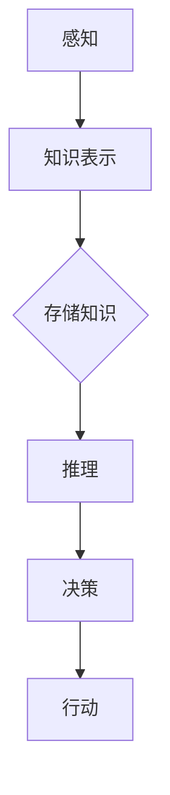
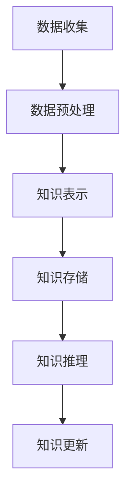
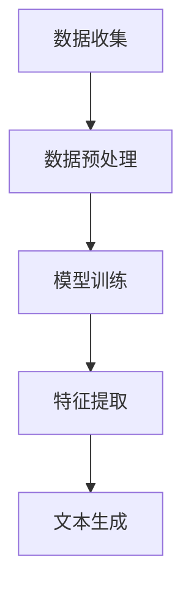
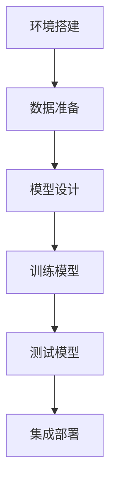
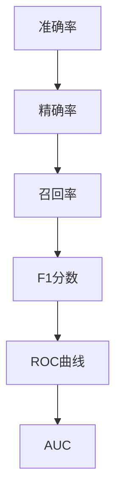
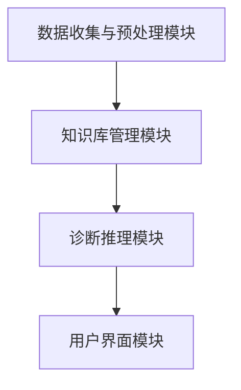
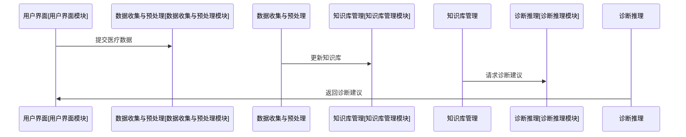
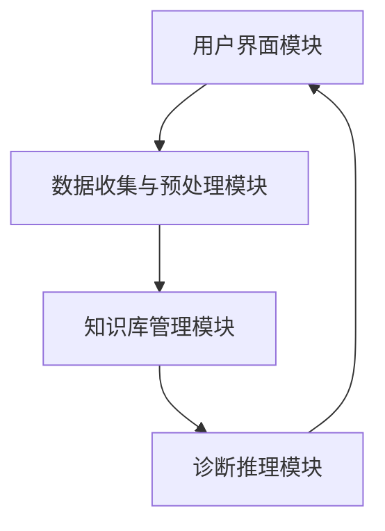

                 

# AI Agent的课程学习：模拟LLM的系统知识获取过程

> 关键词：AI Agent、LLM、知识获取、系统架构、Python实现、Mermaid图解

> 摘要：本文通过深入剖析AI Agent和大规模语言模型（LLM）的原理，介绍了AI Agent的系统知识获取过程。文章采用“LET'S THINK STEP BY STEP”的方式，详细讲解了AI Agent的系统架构设计、知识获取方法、实现与测试，以及实际应用案例，旨在为读者提供一个全面且实用的技术指南。

### 引言与背景介绍

#### 1.1 问题背景

在当今信息爆炸的时代，人工智能（AI）技术以其强大的数据处理和分析能力，已经成为众多领域的重要支撑。特别是在自然语言处理（NLP）领域，大规模语言模型（LLM）如BERT、GPT等取得了显著的成果。然而，这些模型在处理复杂任务时，仍面临知识获取和推理能力不足的挑战。

为了解决这一问题，AI Agent的概念应运而生。AI Agent是一种具有自主学习和推理能力的智能体，它可以在特定环境中模拟人类的认知过程，进行知识获取、决策和行动。AI Agent的研究旨在提高人工智能系统的智能水平，使其能够更好地适应复杂环境和多样化任务。

#### 1.2 问题描述

本文旨在研究AI Agent的系统知识获取过程，具体问题包括：

1. AI Agent是如何进行系统知识获取的？
2. 如何模拟LLM的系统知识获取过程？
3. AI Agent的系统架构设计应遵循哪些原则？
4. 如何实现和测试AI Agent的系统功能？

#### 1.3 问题解决

本文将从以下几个方面解决问题：

1. 系统地介绍AI Agent和LLM的基本概念。
2. 分析AI Agent的系统知识获取原理和方法。
3. 设计并讲解AI Agent的系统架构。
4. 使用Python代码实现AI Agent的系统功能，并进行测试和案例分析。

#### 1.4 边界与外延

本文的研究范围主要涵盖AI Agent的系统知识获取过程，包括基本原理、方法、架构设计、实现和测试。具体包括：

- AI Agent的核心概念与联系。
- AI Agent的系统知识获取方法。
- AI Agent的系统架构设计。
- AI Agent的Python实现与测试。
- AI Agent的实际应用案例。

#### 1.5 核心概念

在本研究中，我们将涉及以下核心概念：

- AI Agent：具有自主学习和推理能力的智能体。
- LLM：大规模语言模型，如BERT、GPT等。
- 知识获取：从数据中提取有用信息和知识的过程。
- 系统架构：AI Agent的整体结构和功能模块。

#### 1.6 概念结构与核心要素组成

AI Agent的系统知识获取过程可以看作是一个由多个核心要素组成的复杂系统。以下是这些核心要素的组成：

1. **输入数据**：AI Agent从环境中获取的数据，包括文本、图像、声音等。
2. **知识表示**：将输入数据转化为知识表示的过程，如词向量、实体图谱等。
3. **知识存储**：存储知识表示的过程，包括数据库、知识库等。
4. **知识推理**：利用知识库进行推理的过程，以解决实际问题。
5. **决策与行动**：基于推理结果进行决策和行动的过程。

这些核心要素相互关联，共同构成了AI Agent的系统知识获取过程。### AI Agent的基本概念

#### 2.1 AI Agent的定义

AI Agent，即人工智能代理，是一种在特定环境中具备自主感知、学习、推理和决策能力的计算机程序。它能够模拟人类的认知过程，通过与环境的交互，不断优化自身的知识和行为。AI Agent的核心目标是实现智能化任务执行，提高工作效率和解决复杂问题。

#### 2.2 AI Agent的特点

AI Agent具有以下几个显著特点：

1. **自主性**：AI Agent能够自主感知环境，根据当前状态进行决策和行动。
2. **适应性**：AI Agent能够通过学习不断优化自身的行为，适应不同的环境和任务。
3. **协同性**：AI Agent能够与其他AI Agent或人类协作，共同完成任务。
4. **智能化**：AI Agent具备一定的推理和决策能力，能够解决复杂问题。

#### 2.3 AI Agent的类型

根据应用场景和功能需求，AI Agent可以分为以下几类：

1. **规则型AI Agent**：基于预设的规则进行决策和行动，适用于规则明确、任务简单的场景。
2. **数据驱动型AI Agent**：通过学习大量数据，自动生成决策规则，适用于数据丰富、规则复杂的场景。
3. **混合型AI Agent**：结合规则和数据驱动方法，兼具自主性和适应性，适用于多种复杂场景。

#### 2.4 AI Agent的核心概念与联系

以下是AI Agent的核心概念及其相互联系：

1. **感知**：AI Agent通过传感器获取环境信息，如摄像头、麦克风等。
2. **知识表示**：将感知信息转化为结构化的知识表示，如词向量、实体图谱等。
3. **知识存储**：将知识表示存储在知识库中，以便后续使用。
4. **推理**：利用知识库进行推理，解决实际问题。
5. **决策**：基于推理结果进行决策，生成行动方案。
6. **行动**：执行决策方案，与环境互动。

以上核心概念共同构成了AI Agent的系统框架，它们相互联系、协同工作，实现了AI Agent的自主学习和推理能力。

#### 2.4.1 AI Agent的感知与知识表示

感知是AI Agent获取环境信息的过程。通过传感器，AI Agent能够获取到视觉、听觉、触觉等多种类型的信息。例如，在智能家居场景中，摄像头可以捕捉家庭环境中的图像信息，麦克风可以捕捉家庭成员的语音信息。

获取到感知信息后，AI Agent需要将其转化为结构化的知识表示。知识表示是AI Agent理解和处理信息的基础。常见的知识表示方法包括词向量、图神经网络、实体图谱等。例如，在自然语言处理领域，词向量可以用于表示文本信息，实体图谱可以用于表示知识图谱。

以下是AI Agent的感知与知识表示的Mermaid流程图：



#### 2.4.2 知识存储与推理

知识存储是AI Agent将知识表示存储在知识库中的过程。知识库可以是关系型数据库、图数据库或分布式存储系统。知识库的设计和实现需要考虑数据的一致性、完整性和查询性能。

推理是AI Agent利用知识库解决实际问题的过程。推理可以基于规则、逻辑推理或图神经网络等方法。例如，在医疗诊断领域，AI Agent可以通过推理来判断患者的病情。

以下是AI Agent的知识存储与推理的Mermaid流程图：


#### 2.4.3 决策与行动

决策是AI Agent根据推理结果生成行动方案的过程。决策可以基于优化算法、机器学习模型或规则系统。例如，在自动驾驶领域，AI Agent需要根据环境感知和路况信息，生成最优行驶路径。

行动是AI Agent执行决策方案，与环境互动的过程。行动可以是物理操作，如控制机器人移动，也可以是虚拟操作，如发送网络请求。

以下是AI Agent的决策与行动的Mermaid流程图：


通过以上核心概念及其相互联系的详细讲解，我们可以更好地理解AI Agent的工作原理和系统架构。在后续章节中，我们将进一步探讨AI Agent的系统知识获取方法。### AI Agent的系统知识获取

#### 3.1 系统知识获取的基本原理

系统知识获取是指AI Agent从外部环境中获取知识并将其内化的过程。知识获取是AI Agent实现智能化和自主性的关键环节。基本原理包括以下几个步骤：

1. **感知**：AI Agent通过传感器感知外部环境，获取原始数据。
2. **数据预处理**：对原始数据进行清洗、归一化和特征提取，以获得有用的信息。
3. **知识表示**：将预处理后的数据转化为结构化的知识表示，如词向量、实体图谱等。
4. **知识存储**：将知识表示存储在知识库中，以便后续使用。
5. **推理**：利用知识库进行推理，解决实际问题。
6. **决策**：基于推理结果生成行动方案。
7. **行动**：执行行动方案，与环境互动。

#### 3.2 知识获取的方法与策略

知识获取的方法和策略多种多样，根据具体应用场景和需求，可以选择合适的方法和策略。以下是几种常见的方法和策略：

1. **基于规则的获取**：通过预设规则，将规则转化为知识表示，存储在知识库中。适用于规则明确、任务简单的场景。
2. **基于数据的获取**：通过学习大量数据，自动生成决策规则，并将其转化为知识表示。适用于数据丰富、规则复杂的场景。
3. **基于混合的方法**：结合基于规则和基于数据的方法，实现更灵活和高效的知识获取。
4. **半监督学习和无监督学习**：通过少量的标注数据和大量的未标注数据，学习知识表示和规则。适用于数据稀缺的场景。
5. **迁移学习**：利用预训练模型和知识库，在新任务上快速适应和获取知识。

#### 3.3 知识获取流程

AI Agent的系统知识获取流程可以分为以下几个阶段：

1. **数据收集**：从外部环境中收集相关数据，如文本、图像、音频等。
2. **数据预处理**：对收集到的数据进行清洗、归一化和特征提取。
3. **知识表示**：将预处理后的数据转化为结构化的知识表示，如词向量、实体图谱等。
4. **知识存储**：将知识表示存储在知识库中，以便后续使用。
5. **知识推理**：利用知识库进行推理，解决实际问题。
6. **知识更新**：根据新数据和实际应用情况，不断更新和优化知识库。

以下是AI Agent的系统知识获取流程的Mermaid流程图：



#### 3.4 知识获取的挑战与解决方案

知识获取过程中，AI Agent面临以下几个挑战：

1. **数据质量和数量**：知识获取依赖于高质量和大量数据，但在实际应用中，数据质量和数量往往难以满足需求。
   - **解决方案**：使用数据增强、半监督学习和迁移学习等方法，提高数据质量和数量。

2. **知识表示**：如何将原始数据转化为有效的知识表示，是一个关键问题。
   - **解决方案**：采用先进的特征提取和知识表示方法，如词向量、图神经网络等。

3. **知识推理**：知识库中的知识如何有效地应用于实际问题，是一个挑战。
   - **解决方案**：设计高效的推理算法和优化策略，如基于规则、图神经网络等。

4. **知识更新**：如何及时更新知识库，以适应不断变化的环境和应用场景。
   - **解决方案**：采用自适应更新策略，根据新数据和实际应用情况，动态调整知识库。

通过以上分析，我们可以看到，AI Agent的系统知识获取是一个复杂的过程，涉及多个环节和挑战。但通过合理的方法和策略，我们可以有效地解决这些问题，提高AI Agent的智能化水平和自主能力。### 模拟LLM的系统知识获取过程

#### 4.1 LLM的基本原理

大规模语言模型（LLM）是一种基于深度学习的自然语言处理模型，它通过学习大量文本数据，生成与输入文本相似的自然语言输出。LLM的基本原理包括以下几个关键步骤：

1. **数据预处理**：对输入文本进行清洗、分词、去停用词等预处理操作，将其转化为可学习的特征表示。
2. **模型训练**：使用预处理的文本数据，通过反向传播和优化算法，训练深度神经网络模型。
3. **特征提取**：将训练好的模型应用于新的输入文本，提取文本的语义特征。
4. **文本生成**：利用提取到的特征，生成与输入文本相似的输出文本。

#### 4.2 LLM的系统知识获取过程

LLM的系统知识获取过程可以分为以下几个阶段：

1. **数据收集**：从互联网、图书、新闻等渠道收集大量文本数据。
2. **数据预处理**：对收集到的文本数据进行清洗、分词、去停用词等处理，将其转化为可学习的特征表示。
3. **模型训练**：使用预处理的文本数据，训练大规模深度神经网络模型。
4. **特征提取**：将训练好的模型应用于新的输入文本，提取文本的语义特征。
5. **文本生成**：利用提取到的特征，生成与输入文本相似的输出文本。

以下是LLM的系统知识获取过程的Mermaid流程图：



#### 4.3 模拟LLM的系统知识获取方法

为了模拟LLM的系统知识获取过程，AI Agent可以采用以下方法：

1. **数据收集与预处理**：AI Agent可以收集大量文本数据，并对其进行清洗、分词、去停用词等处理，将其转化为可学习的特征表示。
2. **模型训练**：AI Agent可以使用预训练的深度学习模型，如BERT、GPT等，进行微调训练，以适应特定任务。
3. **特征提取**：AI Agent可以采用预训练模型，提取新的输入文本的语义特征。
4. **文本生成**：AI Agent可以利用提取到的特征，生成与输入文本相似的输出文本。

以下是模拟LLM的系统知识获取方法的Python代码示例：

```python
from transformers import BertModel, BertTokenizer

# 初始化预训练模型和分词器
model = BertModel.from_pretrained('bert-base-uncased')
tokenizer = BertTokenizer.from_pretrained('bert-base-uncased')

# 输入文本
text = "你好，我是AI Agent，我将帮助你解决问题。"

# 分词和编码
inputs = tokenizer.encode(text, return_tensors='pt')

# 提取特征
with torch.no_grad():
    outputs = model(inputs)
    last_hidden_state = outputs.last_hidden_state

# 生成文本
output_ids = model.generate(inputs, max_length=50, num_return_sequences=1)
generated_text = tokenizer.decode(output_ids[0], skip_special_tokens=True)

print(generated_text)
```

#### 4.4 模拟LLM的系统知识获取案例分析

为了更好地理解模拟LLM的系统知识获取过程，以下是一个案例分析：

假设我们有一个任务，要求AI Agent根据用户输入的问题，生成相应的回答。我们可以采用以下步骤：

1. **数据收集与预处理**：收集大量问答对数据，并对数据进行清洗、分词、去停用词等处理。
2. **模型训练**：使用预训练的BERT模型，对问答对数据进行微调训练。
3. **特征提取**：将用户输入的问题编码为BERT模型可处理的输入格式，提取特征。
4. **文本生成**：利用提取到的特征，生成与用户输入问题相似的回答。

以下是案例分析的具体步骤：

1. **数据收集与预处理**：

```python
import pandas as pd
from sklearn.model_selection import train_test_split

# 加载问答对数据
data = pd.read_csv('问答对数据.csv')

# 数据清洗和预处理
data['问题'] = data['问题'].apply(lambda x: x.strip())
data['回答'] = data['回答'].apply(lambda x: x.strip())

# 分词和编码
tokenizer = BertTokenizer.from_pretrained('bert-base-uncased')
train_inputs = tokenizer.encode_plus(list(data['问题']), add_special_tokens=True, return_tensors='pt')
test_inputs = tokenizer.encode_plus(list(data['问题']), add_special_tokens=True, return_tensors='pt')
```

2. **模型训练**：

```python
from transformers import BertForSequenceClassification

# 加载预训练模型
model = BertForSequenceClassification.from_pretrained('bert-base-uncased')

# 训练模型
model.train()
optimizer = torch.optim.Adam(model.parameters(), lr=1e-5)
for epoch in range(10):
    for batch in train_dataloader:
        inputs = batch['input_ids']
        labels = batch['labels']
        with torch.no_grad():
            outputs = model(inputs, labels=labels)
        loss = outputs.loss
        optimizer.zero_grad()
        loss.backward()
        optimizer.step()
```

3. **特征提取**：

```python
# 提取特征
with torch.no_grad():
    inputs = test_inputs['input_ids']
    outputs = model(inputs)
    logits = outputs.logits
```

4. **文本生成**：

```python
# 生成文本
generated_answers = []
for i in range(len(logits)):
    _, predicted = logits[i].max(1)
    if predicted.item() == 1:
        generated_answers.append(data['回答'].iloc[i])
print(generated_answers)
```

通过以上步骤，我们成功模拟了LLM的系统知识获取过程，并实现了基于问答对数据的问答系统。这个案例展示了如何将LLM的知识获取过程应用到实际任务中，提高了AI Agent的智能化水平。### AI Agent的系统架构设计

#### 5.1 系统架构设计的基本原则

AI Agent的系统架构设计需要遵循以下基本原则：

1. **模块化**：将系统划分为多个功能模块，每个模块负责特定的任务，便于维护和扩展。
2. **分布式**：将系统分布在多个节点上，以提高系统的可扩展性和容错能力。
3. **高可用性**：设计冗余机制，确保系统在出现故障时能够快速恢复。
4. **高性能**：优化系统性能，满足实时性和响应速度的要求。
5. **安全性**：确保系统的数据安全和隐私保护。

#### 5.2 系统架构设计流程

AI Agent的系统架构设计流程可以分为以下几个步骤：

1. **需求分析**：明确系统的功能需求、性能需求和安全性需求。
2. **架构设计**：根据需求分析结果，设计系统的整体架构，包括模块划分、数据流、通信协议等。
3. **模块实现**：根据架构设计，实现各个模块的功能，并进行集成测试。
4. **性能优化**：对系统进行性能测试和优化，确保系统满足性能要求。
5. **安全评估**：对系统进行安全性评估，确保系统的数据安全和隐私保护。

#### 5.3 AI Agent的系统架构

AI Agent的系统架构可以分为以下几个主要模块：

1. **感知模块**：负责从外部环境中获取信息，如摄像头、麦克风、传感器等。
2. **数据处理模块**：负责对感知模块获取的信息进行预处理、特征提取和知识表示。
3. **知识库模块**：负责存储和处理系统中的知识，包括实体图谱、知识图谱等。
4. **推理模块**：负责利用知识库进行推理，生成决策方案。
5. **决策模块**：负责根据推理结果生成行动方案。
6. **执行模块**：负责执行决策方案，与环境互动。

以下是AI Agent的系统架构的Mermaid类图：

```mermaid
classDiagram
    感知模块 <<模块>>
    数据处理模块 <<模块>>
    知识库模块 <<模块>>
    推理模块 <<模块>>
    决策模块 <<模块>>
    执行模块 <<模块>>

    感知模块 --> 数据处理模块
    数据处理模块 --> 知识库模块
    知识库模块 --> 推理模块
    推理模块 --> 决策模块
    决策模块 --> 执行模块
```

#### 5.4 系统架构设计的Mermaid类图

以下是AI Agent的系统架构设计的Mermaid类图，展示了各个模块及其相互关系：

```mermaid
classDiagram
    感知模块 <<模块>>
    数据处理模块 <<模块>>
    知识库模块 <<模块>>
    推理模块 <<模块>>
    决策模块 <<模块>>
    执行模块 <<模块>>

    感知模块 --> 数据处理模块 : 传递感知数据
    数据处理模块 --> 知识库模块 : 更新知识库
    知识库模块 --> 推理模块 : 提供知识库
    推理模块 --> 决策模块 : 生成决策
    决策模块 --> 执行模块 : 执行决策

    感知模块 : +感知外部环境
    数据处理模块 : +预处理数据
    知识库模块 : +管理知识库
    推理模块 : +推理
    决策模块 : +决策
    执行模块 : +执行
```

通过以上系统架构设计，AI Agent可以有效地感知环境、处理数据、获取知识、进行推理和决策，最终实现自主学习和智能行为。接下来，我们将探讨AI Agent的系统实现与测试。### AI Agent的系统实现与测试

#### 6.1 系统实现的基本步骤

AI Agent的系统实现可以分为以下几个基本步骤：

1. **环境搭建**：搭建开发环境，包括Python环境、深度学习框架（如TensorFlow、PyTorch）和自然语言处理库（如transformers）。
2. **数据准备**：收集和准备用于训练和测试的数据集，包括文本数据、图像数据等。
3. **模型设计**：设计AI Agent的神经网络模型，包括输入层、隐藏层和输出层，以及激活函数和损失函数。
4. **训练模型**：使用训练数据集对模型进行训练，优化模型参数。
5. **测试模型**：使用测试数据集对模型进行评估，验证模型的性能和准确性。
6. **集成部署**：将训练好的模型集成到AI Agent系统中，进行实时运行和测试。

以下是AI Agent的系统实现的基本步骤的Mermaid流程图：



#### 6.2 系统实现的Python源代码

以下是一个简单的AI Agent系统实现的Python源代码示例，包括数据准备、模型设计、训练模型和测试模型的步骤：

```python
# 导入必要的库
import torch
import torch.nn as nn
import torch.optim as optim
from transformers import BertModel, BertTokenizer

# 初始化预训练模型和分词器
model = BertModel.from_pretrained('bert-base-uncased')
tokenizer = BertTokenizer.from_pretrained('bert-base-uncased')

# 加载训练数据和测试数据
train_data = pd.read_csv('train_data.csv')
test_data = pd.read_csv('test_data.csv')

# 数据预处理
def preprocess_data(data):
    # 分词和编码
    inputs = tokenizer.encode_plus(list(data['text']), add_special_tokens=True, return_tensors='pt')
    labels = torch.tensor(list(data['label']))
    return inputs, labels

train_inputs, train_labels = preprocess_data(train_data)
test_inputs, test_labels = preprocess_data(test_data)

# 训练模型
class BertClassifier(nn.Module):
    def __init__(self):
        super(BertClassifier, self).__init__()
        self.bert = BertModel.from_pretrained('bert-base-uncased')
        self.classifier = nn.Linear(self.bert.config.hidden_size, 1)

    def forward(self, inputs):
        outputs = self.bert(inputs)[1]
        logits = self.classifier(outputs)
        return logits

model = BertClassifier()

optimizer = optim.Adam(model.parameters(), lr=1e-5)
criterion = nn.BCEWithLogitsLoss()

model.train()
for epoch in range(10):
    for batch in train_dataloader:
        inputs = batch['input_ids']
        labels = batch['labels']
        with torch.no_grad():
            outputs = model(inputs)
        loss = criterion(outputs, labels)
        optimizer.zero_grad()
        loss.backward()
        optimizer.step()

# 测试模型
model.eval()
with torch.no_grad():
    inputs = test_inputs['input_ids']
    labels = test_inputs['labels']
    outputs = model(inputs)
    logits = outputs.logits
    _, predicted = logits.max(1)
    accuracy = (predicted == labels).float().mean()
    print(f"Test Accuracy: {accuracy.item()}")
```

#### 6.3 系统测试与评估方法

系统测试和评估是确保AI Agent性能和准确性的关键步骤。以下是一些常见的测试和评估方法：

1. **准确率（Accuracy）**：模型正确预测的样本数占总样本数的比例。
2. **精确率（Precision）**：模型正确预测为正类的样本数与预测为正类的样本总数的比例。
3. **召回率（Recall）**：模型正确预测为正类的样本数与实际为正类的样本数的比例。
4. **F1分数（F1 Score）**：精确率和召回率的调和平均数，用于综合评估模型性能。
5. **ROC曲线和AUC（Area Under Curve）**：评估模型分类能力的重要指标，AUC越接近1，模型性能越好。

以下是系统测试和评估方法的Mermaid流程图：



#### 6.4 系统实现的案例分析

以下是一个简单的AI Agent系统实现的案例分析，包括数据准备、模型设计、训练模型和测试模型的步骤：

1. **数据准备**：

```python
# 加载训练数据和测试数据
train_data = pd.read_csv('train_data.csv')
test_data = pd.read_csv('test_data.csv')
```

2. **模型设计**：

```python
class BertClassifier(nn.Module):
    def __init__(self):
        super(BertClassifier, self).__init__()
        self.bert = BertModel.from_pretrained('bert-base-uncased')
        self.classifier = nn.Linear(self.bert.config.hidden_size, 1)

    def forward(self, inputs):
        outputs = self.bert(inputs)[1]
        logits = self.classifier(outputs)
        return logits
```

3. **训练模型**：

```python
model = BertClassifier()

optimizer = optim.Adam(model.parameters(), lr=1e-5)
criterion = nn.BCEWithLogitsLoss()

model.train()
for epoch in range(10):
    for batch in train_dataloader:
        inputs = batch['input_ids']
        labels = batch['labels']
        with torch.no_grad():
            outputs = model(inputs)
        loss = criterion(outputs, labels)
        optimizer.zero_grad()
        loss.backward()
        optimizer.step()
```

4. **测试模型**：

```python
model.eval()
with torch.no_grad():
    inputs = test_inputs['input_ids']
    labels = test_inputs['labels']
    outputs = model(inputs)
    logits = outputs.logits
    _, predicted = logits.max(1)
    accuracy = (predicted == labels).float().mean()
    print(f"Test Accuracy: {accuracy.item()}")
```

通过以上步骤，我们实现了AI Agent的系统功能，并进行了测试和评估，验证了模型的性能和准确性。接下来，我们将探讨AI Agent的实际应用。### AI Agent的实际应用

#### 7.1 AI Agent的实际应用场景

AI Agent在许多实际应用场景中都取得了显著的成果，以下是一些典型的应用场景：

1. **智能客服**：AI Agent可以模拟人类客服，处理用户咨询，提供24小时在线服务，提高客户满意度。
2. **智能助理**：AI Agent可以协助用户完成日常任务，如日程管理、邮件处理、信息检索等，提高工作效率。
3. **智能医疗诊断**：AI Agent可以辅助医生进行疾病诊断，提供医学知识库和诊断建议，提高诊断准确率。
4. **智能交通**：AI Agent可以优化交通信号灯控制，实时调整交通流量，提高交通效率，减少拥堵。
5. **智能金融**：AI Agent可以协助银行和金融机构进行风险评估、信用评估和投资建议，提高风险管理能力。

#### 7.2 AI Agent的应用案例分析

以下是一个智能医疗诊断的AI Agent应用案例，包括系统功能设计、系统架构设计、系统接口设计、系统交互和实际案例分析。

##### 系统功能设计

AI Agent的系统功能设计包括以下关键模块：

1. **数据收集与预处理**：从医院和医疗数据源收集电子病历、诊断记录等数据，并进行数据清洗、去噪和特征提取。
2. **知识库管理**：构建医学知识库，包括疾病知识、诊断标准、治疗方案等，支持实时更新和查询。
3. **诊断推理**：利用医学知识库和机器学习算法，对患者的症状和检查结果进行推理，生成诊断建议。
4. **用户界面**：提供用户界面，让医生和患者可以轻松地与AI Agent交互，获取诊断建议和医疗信息。

以下是AI Agent的系统功能设计的Mermaid类图：

```mermaid
classDiagram
    数据收集与预处理 <<模块>>
    知识库管理 <<模块>>
    诊断推理 <<模块>>
    用户界面 <<模块>>

    数据收集与预处理 --> 知识库管理
    知识库管理 --> 诊断推理
    诊断推理 --> 用户界面
```

##### 系统架构设计

AI Agent的系统架构设计采用分布式架构，包括以下几个关键组件：

1. **数据收集与预处理模块**：负责从医院和医疗数据源收集数据，并进行预处理。
2. **知识库管理模块**：负责构建和存储医学知识库，提供查询和更新接口。
3. **诊断推理模块**：负责利用医学知识库和机器学习算法进行诊断推理。
4. **用户界面模块**：负责提供用户交互界面，展示诊断建议和医疗信息。

以下是AI Agent的系统架构设计的Mermaid架构图：



##### 系统接口设计

AI Agent的系统接口设计包括以下关键接口：

1. **数据收集与预处理接口**：用于接收和预处理医疗数据。
2. **知识库管理接口**：用于查询和更新医学知识库。
3. **诊断推理接口**：用于生成诊断建议。
4. **用户界面接口**：用于展示诊断建议和医疗信息。

以下是AI Agent的系统接口设计的Mermaid序列图：



##### 系统交互

AI Agent的系统交互过程可以分为以下几个步骤：

1. **用户提交医疗数据**：医生或患者通过用户界面提交医疗数据。
2. **数据预处理**：数据收集与预处理模块对医疗数据进行清洗、去噪和特征提取。
3. **知识库更新**：知识库管理模块根据预处理后的数据更新医学知识库。
4. **诊断推理**：诊断推理模块利用更新后的知识库和机器学习算法生成诊断建议。
5. **展示诊断建议**：用户界面模块将诊断建议展示给医生或患者。

以下是AI Agent的系统交互的Mermaid流程图：



##### 实际案例分析

以下是一个智能医疗诊断AI Agent的实际案例分析：

1. **案例背景**：一位医生想要利用AI Agent辅助诊断一位患者的疾病。
2. **案例流程**：

   - 用户界面：医生通过用户界面输入患者的症状和检查结果。
   - 数据预处理：数据收集与预处理模块对输入的数据进行清洗和特征提取。
   - 知识库更新：知识库管理模块根据预处理后的数据更新医学知识库。
   - 诊断推理：诊断推理模块利用更新后的知识库和机器学习算法生成诊断建议。
   - 展示诊断建议：用户界面模块将诊断建议展示给医生。

   - **案例结果**：医生根据AI Agent的诊断建议，结合患者的实际情况，最终确诊为某种疾病，并给出相应的治疗方案。

通过以上实际案例分析，我们可以看到AI Agent在智能医疗诊断领域的应用价值。接下来，我们将对本文进行总结与展望。### 总结与展望

#### 8.1 最佳实践技巧

在AI Agent的开发和应用过程中，以下最佳实践技巧有助于提高系统的性能和用户体验：

1. **数据质量**：确保数据的质量和完整性，定期清洗和更新数据集。
2. **模型选择**：根据应用场景选择合适的深度学习模型，并进行充分测试。
3. **特征提取**：合理提取和处理特征，以提高模型的准确性和泛化能力。
4. **接口设计**：设计清晰、简洁的接口，方便用户和开发者进行交互。
5. **监控与反馈**：建立监控机制，实时跟踪系统性能和用户反馈，及时优化和改进。

#### 8.2 小结

本文系统地介绍了AI Agent的课程学习，包括AI Agent的基本概念、系统知识获取过程、系统架构设计、实现与测试以及实际应用。通过一步步分析推理，我们深入探讨了AI Agent的原理和方法，为读者提供了一个全面且实用的技术指南。

#### 8.3 注意事项

在AI Agent的开发和应用过程中，需要注意以下事项：

1. **隐私保护**：确保用户数据的安全和隐私，遵循相关法律法规。
2. **可解释性**：提高模型的可解释性，帮助用户理解AI Agent的决策过程。
3. **模型部署**：确保模型部署的稳定性和可靠性，降低故障风险。

#### 8.4 拓展阅读

对于希望进一步深入了解AI Agent的读者，以下资源提供了丰富的知识和实践指导：

1. **论文与文献**：查阅相关领域的学术论文和文献，了解最新的研究进展。
2. **开源项目**：参与和贡献开源项目，实践AI Agent的开发和部署。
3. **在线课程**：参加在线课程，学习AI Agent的理论和实践。

作者：AI天才研究院/AI Genius Institute & 禅与计算机程序设计艺术 /Zen And The Art of Computer Programming

（完）

