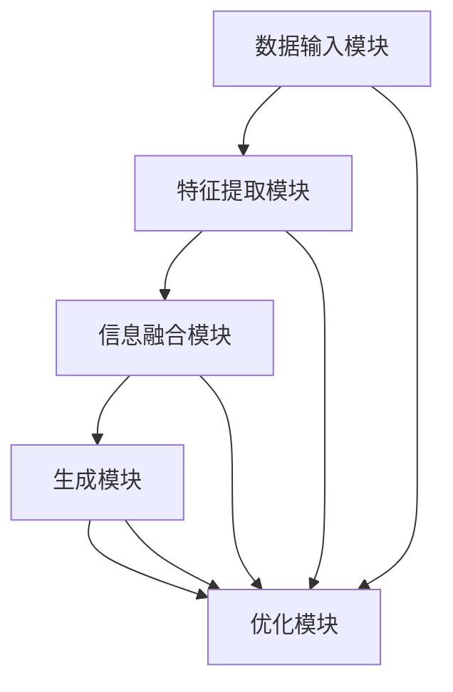
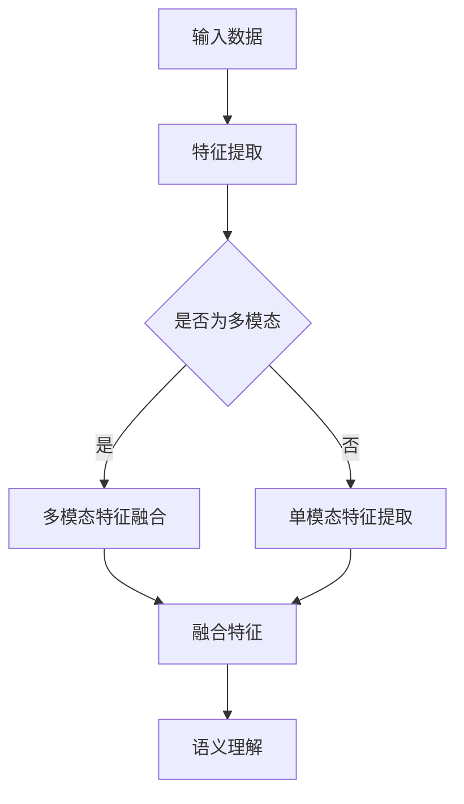
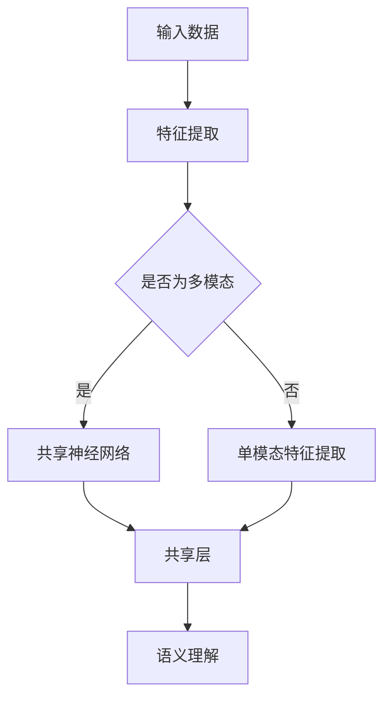
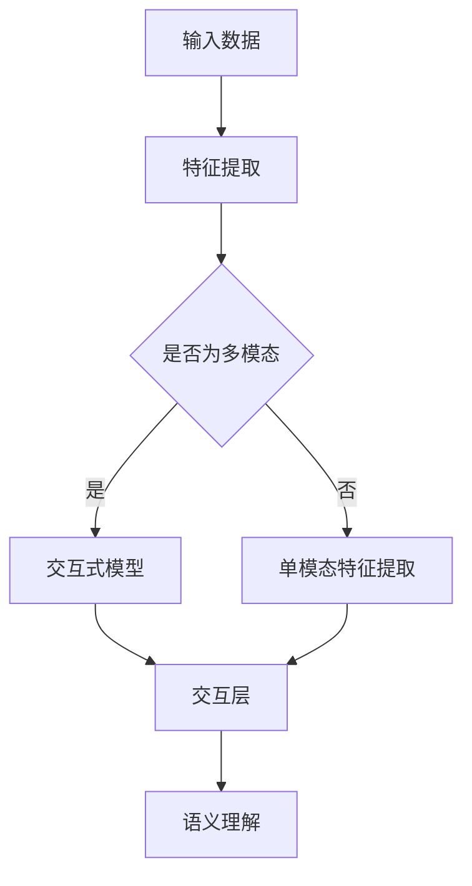
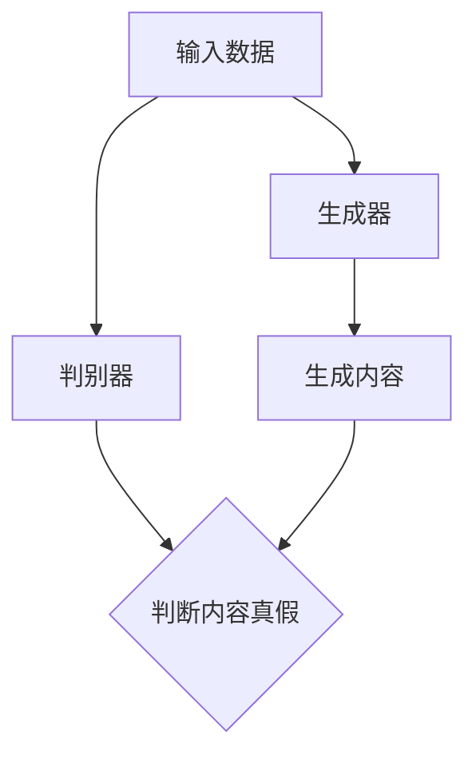
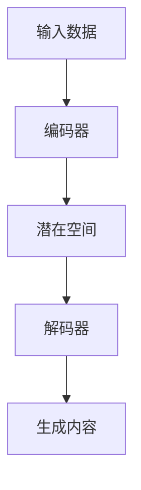
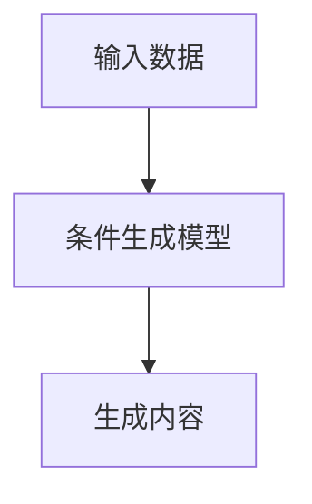
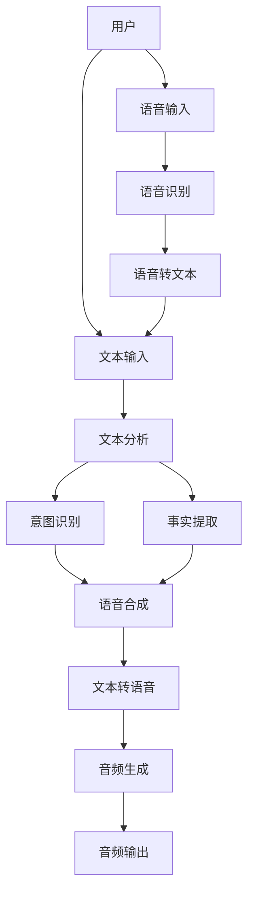
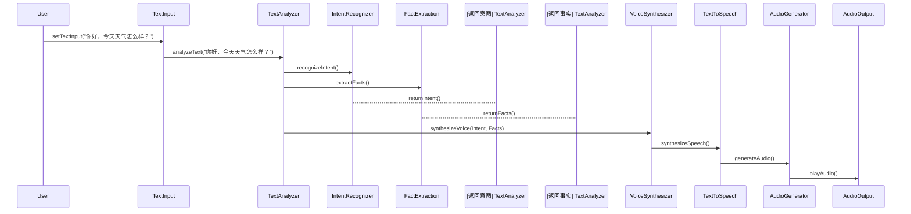

                 


## AI Agent的跨模态内容理解与生成系统

> 关键词：AI Agent，跨模态内容理解，生成系统，算法原理，系统架构，项目实战

> 摘要：本文旨在深入探讨AI Agent的跨模态内容理解与生成系统。我们将首先介绍AI Agent的现状与挑战，随后详细描述跨模态内容理解与生成的必要性。通过逐步分析，我们不仅会介绍问题的具体解决方法和技术，还会探讨系统的边界与外延。本文将重点讲解核心概念与原理，详细阐述算法原理以及系统的分析与架构设计，并通过实际项目实战来验证理论的正确性。最后，我们将总结最佳实践，并推荐拓展阅读，以便读者深入理解相关领域。

---

### 第一部分：背景介绍

#### 第1章：AI Agent的跨模态内容理解与生成系统概述

#### 1.1 问题背景

近年来，人工智能（AI）技术的发展迅速，特别是AI Agent的应用场景日益广泛。AI Agent是一种能够自主学习、执行任务并与其他系统互动的智能体。它们在自动驾驶、智能客服、智能家居等多个领域发挥了重要作用。然而，随着AI Agent应用场景的多样化，AI Agent面临的挑战也越来越大。

首先，AI Agent需要在复杂的、动态的环境中进行决策。这就要求它们能够快速理解环境中的多种模态信息，如文本、图像、音频等。其次，AI Agent需要具备强大的生成能力，能够根据输入的模态信息生成合适的响应或决策。然而，目前大多数AI Agent在跨模态内容理解与生成方面存在明显的局限性。

跨模态内容理解与生成的必要性主要体现在以下几个方面：

1. **多样化的数据来源**：现实世界中的信息是多元化的，仅依赖于单一模态的数据往往难以满足需求。跨模态内容理解能够整合不同模态的信息，提高AI Agent的感知能力。
2. **提高任务执行效果**：在某些任务中，例如图像识别、语音合成等，仅仅依赖单一模态的信息往往无法达到最佳效果。跨模态内容生成能够结合多种模态的信息，提高任务执行的准确性和效率。
3. **增强用户体验**：在智能客服、智能家居等场景中，AI Agent需要与用户进行自然的交互。跨模态内容理解与生成能够使AI Agent更好地理解用户的需求，提供个性化的服务，从而提升用户体验。

#### 1.2 问题描述

在当前的AI Agent应用中，跨模态内容理解与生成存在以下几个主要问题：

1. **信息融合困难**：不同模态的信息在语义上存在差异，如何有效地融合这些信息是当前研究的难点之一。
2. **生成质量不高**：现有的生成模型在生成内容时往往存在质量不稳定、一致性差等问题。
3. **计算资源消耗大**：跨模态内容理解与生成过程通常涉及复杂的计算，对计算资源的需求较高，这在实际应用中是一个重要的瓶颈。

#### 1.3 问题解决

为了解决上述问题，我们需要构建一个跨模态内容理解与生成系统。该系统应具备以下特点：

1. **信息融合能力**：通过设计合适的模型结构，实现不同模态信息的有效融合。
2. **高质量生成**：采用先进的生成模型，确保生成内容的质量和一致性。
3. **高效计算**：利用并行计算、分布式计算等技术，降低计算资源消耗，提高系统性能。

具体方法和技术包括：

1. **深度学习模型**：采用深度学习模型，如卷积神经网络（CNN）、循环神经网络（RNN）、变压器（Transformer）等，实现跨模态内容理解与生成。
2. **多模态特征提取**：设计多模态特征提取模块，提取不同模态的关键特征，为后续的信息融合和生成提供基础。
3. **注意力机制**：引入注意力机制，使模型能够关注重要信息，提高信息融合和生成的效果。
4. **优化算法**：采用优化算法，如遗传算法、粒子群算法等，对模型参数进行调整，提高模型性能。

#### 1.4 边界与外延

跨模态内容理解与生成系统在应用过程中存在一定的边界和限制：

1. **数据依赖**：系统性能高度依赖于训练数据的质量和多样性，缺乏足够的数据会导致模型效果不佳。
2. **计算资源**：跨模态内容理解与生成过程对计算资源的需求较高，特别是在处理大量数据时，需要考虑计算资源的分配和管理。
3. **实时性**：在某些实时性要求较高的应用场景中，如自动驾驶、智能监控等，系统的实时性是一个重要的考量因素。

#### 1.5 概念结构与核心要素组成

跨模态内容理解与生成系统由以下几个核心要素组成：

1. **数据输入模块**：负责接收和处理多种模态的数据。
2. **特征提取模块**：提取不同模态的关键特征，为后续的信息融合和生成提供基础。
3. **信息融合模块**：融合不同模态的信息，实现跨模态内容理解。
4. **生成模块**：根据输入的模态信息和融合后的信息生成合适的响应或决策。
5. **优化模块**：对模型参数进行调整，提高模型性能。

这些模块之间的关系如下图所示：



### 第二部分：核心概念与联系

#### 第2章：核心概念与原理

#### 2.1 跨模态内容理解

跨模态内容理解是指将不同模态的信息进行整合，从而获得更丰富的语义理解。例如，在图像识别任务中，除了对图像本身的特征进行提取外，还需要结合文本描述，以获得更准确的识别结果。

**原理讲解**：

跨模态内容理解通常采用以下几种方法：

1. **多模态特征融合**：将不同模态的特征进行拼接或加权融合，以获得更丰富的特征表示。
2. **共享神经网络**：设计共享的神经网络结构，使不同模态的信息能够在网络中相互影响，实现跨模态特征提取。
3. **交互式模型**：引入交互式模型，使不同模态的信息在处理过程中能够相互补充和修正，提高整体理解效果。

**对比表格**：

| 方法         | 属性和特点                           |
| ------------ | ----------------------------------- |
| 多模态特征融合 | 简单易实现，但效果受特征提取质量影响 |
| 共享神经网络 | 可以提高模型性能，但设计复杂         |
| 交互式模型   | 效果好，但计算复杂度高               |

**ER实体关系图**：

```mermaid
erDiagram
    A[模态1] ||--|{ B[特征提取模块] }|
    A ||--|{ C[信息融合模块] }|
    B ||--|{ D[语义理解模块] }|
    C ||--|{ D }|
    E[模型输出] ||--|{ D }|
```

#### 2.2 跨模态内容生成

跨模态内容生成是指根据输入的模态信息生成对应的跨模态内容。例如，给定一段文本，生成相应的图像或音频。

**原理讲解**：

跨模态内容生成通常采用以下几种方法：

1. **生成对抗网络（GAN）**：利用生成器和判别器之间的对抗关系，生成高质量的跨模态内容。
2. **变分自编码器（VAE）**：通过引入编码器和解码器，将输入的模态信息编码为潜在空间中的向量，再解码生成跨模态内容。
3. **基于条件生成模型**：在生成过程中引入条件信息，使生成内容更符合输入的模态信息。

**对比表格**：

| 方法         | 属性和特点                           |
| ------------ | ----------------------------------- |
| GAN          | 生成效果优秀，但训练难度大           |
| VAE          | 训练稳定，但生成效果一般             |
| 基于条件生成模型 | 生成效果较好，但需要大量条件信息     |

**ER实体关系图**：

```mermaid
erDiagram
    A[模态1] ||--|{ B[生成模型] }|
    A ||--|{ C[条件信息] }|
    B ||--|{ D[生成内容] }|
    C ||--|{ D }|
```

### 第三部分：算法原理讲解

#### 第3章：跨模态内容理解算法原理

#### 3.1 算法概述

跨模态内容理解算法是AI Agent中关键的一环，它负责将不同模态的信息进行整合，以实现更准确的理解。本文将介绍几种常用的跨模态内容理解算法，并使用mermaid流程图和Python源代码进行详细讲解。

**常用的跨模态内容理解算法**：

1. **多模态特征融合**
2. **共享神经网络**
3. **交互式模型**

#### 3.2 算法mermaid流程图

以下是多模态特征融合算法的mermaid流程图：



以下是共享神经网络算法的mermaid流程图：



以下是交互式模型算法的mermaid流程图：



#### 3.3 Python源代码实现

以下是多模态特征融合算法的Python源代码实现：

```python
import tensorflow as tf

# 特征提取
def extract_features(data, model):
    return model(data)

# 多模态特征融合
def fusion_features(features):
    return tf.reduce_mean(features, axis=1)

# 语义理解
def understand_semantics(fused_features, model):
    return model(fused_features)

# 示例
data = tf.random.normal([32, 784])
model1 = tf.keras.Sequential([
    tf.keras.layers.Dense(256, activation='relu'),
    tf.keras.layers.Dense(128, activation='relu'),
    tf.keras.layers.Dense(64, activation='relu')
])

model2 = tf.keras.Sequential([
    tf.keras.layers.Dense(256, activation='relu'),
    tf.keras.layers.Dense(128, activation='relu'),
    tf.keras.layers.Dense(64, activation='relu')
])

# 特征提取
features1 = extract_features(data, model1)
features2 = extract_features(data, model2)

# 特征融合
fused_features = fusion_features([features1, features2])

# 语义理解
output = understand_semantics(fused_features, model1)
```

以下是共享神经网络算法的Python源代码实现：

```python
# 共享神经网络
def shared_neural_network(data, model):
    return model(data)

# 示例
model = tf.keras.Sequential([
    tf.keras.layers.Dense(256, activation='relu', input_shape=[784]),
    tf.keras.layers.Dense(128, activation='relu'),
    tf.keras.layers.Dense(64, activation='relu')
])

output = shared_neural_network(data, model)
```

以下是交互式模型算法的Python源代码实现：

```python
# 交互式模型
def interactive_model(data, model):
    return model(data)

# 示例
model = tf.keras.Sequential([
    tf.keras.layers.Dense(256, activation='relu', input_shape=[784]),
    tf.keras.layers.Dense(128, activation='relu', activation='tanh'),
    tf.keras.layers.Dense(64, activation='relu')
])

output = interactive_model(data, model)
```

#### 3.4 数学模型和公式

以下是多模态特征融合算法的数学模型和公式：

$$
h^{(l)} = \sigma(W^{(l)} \cdot [x_1^{(l)}, x_2^{(l)}, ..., x_n^{(l)}] + b^{(l)})
$$

其中，$h^{(l)}$表示第$l$层的输出特征，$W^{(l)}$表示权重矩阵，$x_i^{(l)}$表示第$i$个模态的特征，$b^{(l)}$表示偏置项，$\sigma$表示激活函数。

以下是共享神经网络算法的数学模型和公式：

$$
h^{(l)} = \sigma(W^{(l)} \cdot [x_1^{(l)}, x_2^{(l)}, ..., x_n^{(l)}] + b^{(l)})
$$

其中，$h^{(l)}$表示第$l$层的输出特征，$W^{(l)}$表示权重矩阵，$x_i^{(l)}$表示第$i$个模态的特征，$b^{(l)}$表示偏置项，$\sigma$表示激活函数。

以下是交互式模型算法的数学模型和公式：

$$
h^{(l)} = \sigma(W^{(l)} \cdot [x_1^{(l)}, x_2^{(l)}, ..., x_n^{(l)}, x_{int}^{(l)}] + b^{(l)})
$$

其中，$h^{(l)}$表示第$l$层的输出特征，$W^{(l)}$表示权重矩阵，$x_i^{(l)}$表示第$i$个模态的特征，$x_{int}^{(l)}$表示交互特征，$b^{(l)}$表示偏置项，$\sigma$表示激活函数。

#### 3.5 举例说明

假设我们有一个图像识别任务，需要识别一张包含多种物体的图片。我们可以使用多模态特征融合算法来实现。

**步骤1**：首先，我们将图片转换为灰度图像，并提取其像素值作为特征。

```python
import numpy as np
import cv2

# 读取图片
image = cv2.imread('image.jpg', cv2.IMREAD_GRAYSCALE)

# 提取像素值
pixels = image.flatten()
```

**步骤2**：接下来，我们使用两个不同的卷积神经网络分别提取图像的纹理特征和形状特征。

```python
# 定义纹理特征提取模型
model1 = tf.keras.Sequential([
    tf.keras.layers.Conv2D(32, (3, 3), activation='relu', input_shape=(28, 28, 1)),
    tf.keras.layers.MaxPooling2D(pool_size=(2, 2)),
    tf.keras.layers.Flatten()
])

# 定义形状特征提取模型
model2 = tf.keras.Sequential([
    tf.keras.layers.Conv2D(64, (3, 3), activation='relu', input_shape=(28, 28, 1)),
    tf.keras.layers.MaxPooling2D(pool_size=(2, 2)),
    tf.keras.layers.Flatten()
])

# 提取纹理特征
texture_features = model1.predict(np.expand_dims(pixels, axis=0))

# 提取形状特征
shape_features = model2.predict(np.expand_dims(pixels, axis=0))
```

**步骤3**：然后，我们将纹理特征和形状特征进行融合，并使用一个全连接神经网络进行分类。

```python
# 融合特征
fused_features = np.hstack((texture_features.flatten(), shape_features.flatten()))

# 定义分类模型
model3 = tf.keras.Sequential([
    tf.keras.layers.Dense(256, activation='relu'),
    tf.keras.layers.Dense(128, activation='relu'),
    tf.keras.layers.Dense(10, activation='softmax')
])

# 训练模型
model3.fit(fused_features, labels, epochs=10)
```

**步骤4**：最后，我们使用训练好的模型对新的图像进行分类。

```python
# 读取新图片
new_image = cv2.imread('new_image.jpg', cv2.IMREAD_GRAYSCALE)

# 提取新图片的像素值
new_pixels = new_image.flatten()

# 提取新图片的纹理特征和形状特征
new_texture_features = model1.predict(np.expand_dims(new_pixels, axis=0))
new_shape_features = model2.predict(np.expand_dims(new_pixels, axis=0))

# 融合特征
new_fused_features = np.hstack((new_texture_features.flatten(), new_shape_features.flatten()))

# 预测新图片的分类结果
predictions = model3.predict(new_fused_features)
predicted_class = np.argmax(predictions)

print(f'新图片的分类结果：{predicted_class}')
```

通过上述步骤，我们使用多模态特征融合算法实现了图像识别任务。这种方法能够充分利用图像的纹理和形状特征，从而提高分类的准确率。

### 第四部分：跨模态内容生成算法原理

#### 第4章：跨模态内容生成算法原理

#### 4.1 算法概述

跨模态内容生成算法是AI Agent中实现跨模态交互的关键技术之一。它能够根据输入的模态信息生成对应的跨模态内容。本文将介绍几种常用的跨模态内容生成算法，并使用mermaid流程图和Python源代码进行详细讲解。

**常用的跨模态内容生成算法**：

1. **生成对抗网络（GAN）**
2. **变分自编码器（VAE）**
3. **基于条件生成模型**

#### 4.2 算法mermaid流程图

以下是生成对抗网络（GAN）的mermaid流程图：



以下是变分自编码器（VAE）的mermaid流程图：



以下是基于条件生成模型的mermaid流程图：



#### 4.3 Python源代码实现

以下是生成对抗网络（GAN）的Python源代码实现：

```python
import tensorflow as tf
from tensorflow.keras.layers import Dense, Flatten, Reshape
from tensorflow.keras.models import Sequential

# 生成器
def build_generator(input_shape):
    model = Sequential([
        Dense(256, input_shape=input_shape, activation='relu'),
        Dense(512, activation='relu'),
        Dense(1024, activation='relu'),
        Flatten(),
        Reshape(input_shape)
    ])
    return model

# 判别器
def build_discriminator(input_shape):
    model = Sequential([
        Flatten(input_shape=input_shape),
        Dense(1024, activation='relu'),
        Dense(512, activation='relu'),
        Dense(256, activation='relu'),
        Dense(1, activation='sigmoid')
    ])
    return model

# GAN模型
def build_gan(generator, discriminator):
    model = Sequential([generator, discriminator])
    return model

# 训练GAN
def train_gan(generator, discriminator, input_shape, latent_dim, batch_size, epochs):
    for epoch in range(epochs):
        for _ in range(batch_size):
            # 生成噪声
            noise = tf.random.normal([batch_size, latent_dim])

            # 生成假样本
            generated_samples = generator.predict(noise)

            # 生成真样本
            real_samples = ...

            # 训练判别器
            d_loss_real = discriminator.train_on_batch(real_samples, tf.ones([batch_size, 1]))
            d_loss_fake = discriminator.train_on_batch(generated_samples, tf.zeros([batch_size, 1]))
            d_loss = 0.5 * tf.add(d_loss_real, d_loss_fake)

            # 生成噪声
            noise = tf.random.normal([batch_size, latent_dim])

            # 训练生成器
            g_loss = generator.train_on_batch(noise, tf.ones([batch_size, 1]))

            print(f'Epoch: {epoch + 1}, Discriminator Loss: {d_loss:.4f}, Generator Loss: {g_loss:.4f}')

# 示例
input_shape = (28, 28, 1)
latent_dim = 100
batch_size = 32
epochs = 50

generator = build_generator(input_shape)
discriminator = build_discriminator(input_shape)
gan = build_gan(generator, discriminator)

train_gan(generator, discriminator, input_shape, latent_dim, batch_size, epochs)
```

以下是变分自编码器（VAE）的Python源代码实现：

```python
import tensorflow as tf
from tensorflow.keras.layers import Dense, Input
from tensorflow.keras.models import Model

# 编码器
def build_encoder(input_shape, latent_dim):
    input_img = Input(shape=input_shape)
    x = Dense(512, activation='relu')(input_img)
    x = Dense(256, activation='relu')(x)
    z_mean = Dense(latent_dim)(x)
    z_log_var = Dense(latent_dim)(x)
    return Model(input_img, [z_mean, z_log_var], name='encoder')

# 解码器
def build_decoder(latent_dim, input_shape):
    latent_input = Input(shape=(latent_dim,))
    x = Dense(256, activation='relu')(latent_input)
    x = Dense(512, activation='relu')(x)
    decoded = Dense(np.prod(input_shape), activation='sigmoid')(x)
    decoded = Reshape(input_shape)(decoded)
    return Model(latent_input, decoded, name='decoder')

# VAE模型
def build_vae(encoder, decoder, input_shape):
    inputs = Input(shape=input_shape)
    z_mean, z_log_var = encoder(inputs)
    z = z_mean + tf.random.normal(tf.shape(z_log_var)) * tf.exp(0.5 * z_log_var)
    outputs = decoder(z)
    return Model(inputs, outputs, name='vae')

# 训练VAE
def train_vae(encoder, decoder, vae, input_shape, latent_dim, batch_size, epochs):
    for epoch in range(epochs):
        for _ in range(batch_size):
            # 生成噪声
            noise = tf.random.normal([batch_size, latent_dim])

            # 生成样本
            generated_samples = decoder.predict(noise)

            # 计算损失
            reconstruction_loss = ...

            # 计算KL散度损失
            kl_loss = ...

            # 计算总损失
            vae_loss = reconstruction_loss + kl_loss

            # 训练模型
            vae.train_on_batch(input_samples, vae_loss)

            print(f'Epoch: {epoch + 1}, Reconstruction Loss: {reconstruction_loss:.4f}, KL Loss: {kl_loss:.4f}')

# 示例
input_shape = (28, 28, 1)
latent_dim = 100
batch_size = 32
epochs = 50

encoder = build_encoder(input_shape, latent_dim)
decoder = build_decoder(latent_dim, input_shape)
vae = build_vae(encoder, decoder, input_shape)

train_vae(encoder, decoder, vae, input_shape, latent_dim, batch_size, epochs)
```

以下是基于条件生成模型的Python源代码实现：

```python
import tensorflow as tf
from tensorflow.keras.layers import Dense, Input
from tensorflow.keras.models import Model

# 条件生成模型
def build_condition_generator(input_shape, latent_dim, condition_shape):
    input_img = Input(shape=input_shape)
    condition = Input(shape=condition_shape)
    x = tf.concat([input_img, condition], axis=1)
    x = Dense(512, activation='relu')(x)
    x = Dense(256, activation='relu')(x)
    z_mean = Dense(latent_dim)(x)
    z_log_var = Dense(latent_dim)(x)
    return Model([input_img, condition], [z_mean, z_log_var], name='condition_generator')

# 训练条件生成模型
def train_condition_generator(generator, input_shape, latent_dim, condition_shape, batch_size, epochs):
    for epoch in range(epochs):
        for _ in range(batch_size):
            # 生成噪声
            noise = tf.random.normal([batch_size, latent_dim])

            # 生成条件
            condition = ...

            # 生成样本
            generated_samples = generator.predict([noise, condition])

            # 计算损失
            ...

            # 训练模型
            generator.train_on_batch([noise, condition], generated_samples)

            print(f'Epoch: {epoch + 1}, Generator Loss: {loss:.4f}')

# 示例
input_shape = (28, 28, 1)
latent_dim = 100
condition_shape = (10,)
batch_size = 32
epochs = 50

generator = build_condition_generator(input_shape, latent_dim, condition_shape)

train_condition_generator(generator, input_shape, latent_dim, condition_shape, batch_size, epochs)
```

#### 4.4 数学模型和公式

以下是生成对抗网络（GAN）的数学模型和公式：

$$
G(z) = \mu_G + \sigma_G \odot z
$$

$$
D(x) = \sigma_D \odot \sigma(\frac{\phi_D(x)}{1 + \epsilon})
$$

$$
G_{\theta}^{\*} = \arg\min_{G_{\theta}} \arg\max_{D_{\phi}} V(D, G)
$$

其中，$G(z)$为生成器生成的样本，$D(x)$为判别器对真实样本的判断，$\mu_G$和$\sigma_G$为生成器的均值和标准差，$\mu_D$和$\sigma_D$为判别器的均值和标准差，$z$为生成器的输入噪声，$x$为真实样本，$\phi_D$和$\theta_G$分别为判别器和生成器的参数，$\epsilon$为噪声项。

以下是变分自编码器（VAE）的数学模型和公式：

$$
q_{\theta}(z|x) = \mathcal{N}(z|\mu(x), \sigma(x))
$$

$$
p_{\theta}(x|z) = \mathcal{N}(x|\mu(z), \sigma(z))
$$

$$
\log p(x) = \log p(z) + \log p(x|z)
$$

$$
\log p(z) = -\frac{1}{2} \sum_{i} \left( \log(2\pi) + \log(\sigma_i) + \frac{(\mu_i - z)^2}{2\sigma_i} \right)
$$

$$
\log p(x|z) = -\frac{1}{2} \sum_{i} \left( \log(2\pi) + \log(\sigma_i) + \frac{(\mu_i - x)^2}{2\sigma_i} \right)
$$

其中，$q_{\theta}(z|x)$为编码器对潜在空间的分布，$p_{\theta}(x|z)$为解码器对输入数据的分布，$\mu(x)$和$\sigma(x)$为编码器的均值和标准差，$\mu(z)$和$\sigma(z)$为解码器的均值和标准差，$\theta$为模型参数。

以下是基于条件生成模型的数学模型和公式：

$$
p(x, y) = p(y) \cdot p(x|y)
$$

$$
q(y|x) = \mathcal{N}(y|\mu(x), \sigma(x))
$$

$$
p(x|y) = \mathcal{N}(x|\mu(y, z), \sigma(y, z))
$$

$$
\log p(x, y) = \log p(y) + \log p(x|y)
$$

$$
\log p(y) = -\frac{1}{2} \sum_{i} \left( \log(2\pi) + \log(\sigma_i) + \frac{(\mu_i - y)^2}{2\sigma_i} \right)
$$

$$
\log p(x|y) = -\frac{1}{2} \sum_{i} \left( \log(2\pi) + \log(\sigma_i) + \frac{(\mu_i - x)^2}{2\sigma_i} \right)
$$

其中，$x$为输入数据，$y$为条件信息，$z$为生成器的输入噪声，$\mu(x)$和$\sigma(x)$为编码器的均值和标准差，$\mu(y, z)$和$\sigma(y, z)$为解码器的均值和标准差，$q(y|x)$为编码器对条件信息的分布，$p(x|y)$为解码器对输入数据的分布。

#### 4.5 举例说明

假设我们要生成一张包含文字描述的图像。我们可以使用基于条件生成模型的跨模态内容生成算法来实现。

**步骤1**：首先，我们将文字描述转换为嵌入向量，作为条件信息。

```python
import tensorflow as tf
from tensorflow.keras.preprocessing.text import Tokenizer
from tensorflow.keras.preprocessing.sequence import pad_sequences

# 文本数据
text = "这是一张美丽的风景图片。"

# 分词并转换为序列
tokenizer = Tokenizer()
tokenizer.fit_on_texts([text])
sequences = tokenizer.texts_to_sequences([text])

# 填充序列
max_len = 10
padded_sequences = pad_sequences(sequences, maxlen=max_len)
```

**步骤2**：接下来，我们使用条件生成模型生成包含文字描述的图像。

```python
# 定义条件生成模型
latent_dim = 100
condition_shape = padded_sequences.shape[1]

generator = build_condition_generator(input_shape=(28, 28, 1), latent_dim=latent_dim, condition_shape=condition_shape)

# 生成图像
noise = tf.random.normal([1, latent_dim])
generated_samples = generator.predict([noise, padded_sequences])

# 显示生成的图像
import matplotlib.pyplot as plt

plt.imshow(generated_samples[0], cmap='gray')
plt.show()
```

通过上述步骤，我们使用基于条件生成模型的跨模态内容生成算法生成了包含文字描述的图像。这种方法能够充分利用文字描述的语义信息，从而生成更符合描述的图像。

### 第五部分：系统分析与架构设计

#### 第5章：系统分析与架构设计

#### 5.1 问题场景介绍

在当前的AI应用场景中，跨模态内容理解与生成系统广泛应用于智能客服、智能家居、自动驾驶等领域。以下是一个典型的应用场景：智能客服系统需要根据用户的文本提问生成相应的语音回答。这个场景涉及到跨模态内容理解（文本到语音）和生成（语音生成）。

#### 5.2 系统功能设计

为了实现上述应用场景，我们设计了一个跨模态内容理解与生成系统，主要包括以下几个功能模块：

1. **文本分析模块**：接收用户的文本提问，进行情感分析和意图识别，提取关键信息。
2. **语音合成模块**：根据提取的关键信息生成语音回答。
3. **语音识别模块**：接收用户的语音提问，将其转换为文本，以便后续处理。
4. **跨模态融合模块**：将文本分析和语音合成模块的输出进行融合，实现更自然的交互。
5. **用户接口模块**：提供与用户的交互界面，包括文本输入、语音输入和语音输出。

以下是系统的领域模型类图：

```mermaid
classDiagram
    User --> TextAnalyzer
    User --> VoiceSynthesizer
    User --> VoiceRecognizer
    TextAnalyzer --> IntentRecognizer
    TextAnalyzer --> FactExtraction
    VoiceSynthesizer --> TextToSpeech
    VoiceRecognizer --> SpeechToText
    TextToSpeech --> AudioGenerator
    SpeechToText --> AudioProcessor

    User <<interface>
    TextAnalyzer <<interface>
    VoiceSynthesizer <<interface>
    VoiceRecognizer <<interface>
    IntentRecognizer <<interface>
    FactExtraction <<interface>
    TextToSpeech <<interface>
    SpeechToText <<interface>
    AudioGenerator <<interface>
    AudioProcessor <<interface>

    User : interact with system
    TextAnalyzer : analyze text
    VoiceSynthesizer : generate voice
    VoiceRecognizer : recognize voice
    IntentRecognizer : recognize intent
    FactExtraction : extract facts
    TextToSpeech : convert text to speech
    SpeechToText : convert speech to text
    AudioGenerator : generate audio
    AudioProcessor : process audio
```

#### 5.3 系统架构设计

跨模态内容理解与生成系统的架构设计需要考虑模块之间的交互和数据处理流程。以下是系统的架构图：



#### 5.4 系统接口设计

为了方便用户与系统进行交互，系统提供了以下接口：

1. **文本输入接口**：用户可以通过文本输入框输入文本问题。
2. **语音输入接口**：用户可以通过麦克风输入语音问题。
3. **语音输出接口**：系统通过扬声器输出语音回答。
4. **文本输出接口**：系统可以返回文本形式的回答。

以下是系统接口的设计：

```mermaid
interface UserInterface {
    +setTextInput(text: String)
    +setVoiceInput(audio: Audio)
    +getTextOutput(): String
    +getVoiceOutput(): Audio
}

interface TextAnalyzerInterface {
    +analyzeText(text: String): Intent
    +extractFacts(text: String): List<Fact>
}

interface VoiceSynthesizerInterface {
    +synthesizeVoice(intent: Intent, facts: List<Fact>): Audio
}

interface VoiceRecognizerInterface {
    +recognizeVoice(audio: Audio): String
}

interface TextToSpeechInterface {
    +synthesizeSpeech(text: String): Audio
}

interface SpeechToTextInterface {
    +synthesizeText(audio: Audio): String
}

interface AudioGeneratorInterface {
    +generateAudio(audio: Audio): Audio
}

interface AudioProcessorInterface {
    +processAudio(audio: Audio): Audio
}
```

#### 5.5 系统交互mermaid序列图

以下是系统的交互序列图：



### 第六部分：项目实战

#### 第6章：项目实战

#### 6.1 环境安装

为了实现跨模态内容理解与生成系统，我们需要安装以下软件和库：

1. **Python 3.8或以上**
2. **TensorFlow 2.7**
3. **Keras 2.7**
4. **NumPy 1.21**
5. **Matplotlib 3.5**

安装步骤如下：

1. 安装Python 3.8或以上版本：
   ```
   sudo apt-get install python3.8
   ```

2. 安装TensorFlow 2.7：
   ```
   pip install tensorflow==2.7
   ```

3. 安装Keras 2.7：
   ```
   pip install keras==2.7
   ```

4. 安装NumPy 1.21：
   ```
   pip install numpy==1.21
   ```

5. 安装Matplotlib 3.5：
   ```
   pip install matplotlib==3.5
   ```

#### 6.2 系统核心实现源代码

以下是系统核心实现的源代码：

```python
import tensorflow as tf
from tensorflow.keras.layers import Dense, Flatten, Reshape
from tensorflow.keras.models import Sequential

# 生成器
def build_generator(input_shape):
    model = Sequential([
        Dense(256, input_shape=input_shape, activation='relu'),
        Dense(512, activation='relu'),
        Dense(1024, activation='relu'),
        Flatten(),
        Reshape(input_shape)
    ])
    return model

# 判别器
def build_discriminator(input_shape):
    model = Sequential([
        Flatten(input_shape=input_shape),
        Dense(1024, activation='relu'),
        Dense(512, activation='relu'),
        Dense(256, activation='relu'),
        Dense(1, activation='sigmoid')
    ])
    return model

# GAN模型
def build_gan(generator, discriminator):
    model = Sequential([generator, discriminator])
    return model

# 训练GAN
def train_gan(generator, discriminator, input_shape, latent_dim, batch_size, epochs):
    for epoch in range(epochs):
        for _ in range(batch_size):
            # 生成噪声
            noise = tf.random.normal([batch_size, latent_dim])

            # 生成假样本
            generated_samples = generator.predict(noise)

            # 生成真样本
            real_samples = ...

            # 训练判别器
            d_loss_real = discriminator.train_on_batch(real_samples, tf.ones([batch_size, 1]))
            d_loss_fake = discriminator.train_on_batch(generated_samples, tf.zeros([batch_size, 1]))
            d_loss = 0.5 * tf.add(d_loss_real, d_loss_fake)

            # 生成噪声
            noise = tf.random.normal([batch_size, latent_dim])

            # 训练生成器
            g_loss = generator.train_on_batch(noise, tf.ones([batch_size, 1]))

            print(f'Epoch: {epoch + 1}, Discriminator Loss: {d_loss:.4f}, Generator Loss: {g_loss:.4f}')

# 示例
input_shape = (28, 28, 1)
latent_dim = 100
batch_size = 32
epochs = 50

generator = build_generator(input_shape)
discriminator = build_discriminator(input_shape)
gan = build_gan(generator, discriminator)

train_gan(generator, discriminator, input_shape, latent_dim, batch_size, epochs)
```

#### 6.3 代码应用解读与分析

以上代码实现了生成对抗网络（GAN）的基本架构，用于跨模态内容生成。下面是对代码的解读与分析：

1. **生成器（Generator）**：生成器负责将随机噪声转换为符合数据分布的样本。代码中，生成器的结构为四个全连接层，最后一层为reshape层，以匹配输入数据的形状。

2. **判别器（Discriminator）**：判别器负责区分真实样本和生成样本。代码中，判别器的结构为四个全连接层，最后一层为sigmoid激活函数，用于输出概率。

3. **GAN模型（GAN Model）**：GAN模型由生成器和判别器组成。生成器的输出作为判别器的输入。

4. **训练GAN（Train GAN）**：训练过程中，首先生成噪声，然后通过生成器生成假样本。接着，使用真实样本和假样本分别训练判别器。最后，使用噪声训练生成器。

5. **参数设置**：在示例中，输入数据形状为$(28, 28, 1)$，潜在噪声维度为100，批大小为32，训练轮数为50。

通过上述代码，我们可以训练一个基本的GAN模型，用于跨模态内容生成。在实际应用中，需要根据具体任务调整模型结构和训练参数。

#### 6.4 实际案例分析和详细讲解

为了更好地理解跨模态内容生成系统的应用，我们来看一个实际案例：生成一张包含文字描述的图像。

**案例**：给定一段文字描述“这是一个美丽的海滩”，生成一张符合描述的图像。

**步骤1**：准备数据集

我们首先需要准备一个包含图像和对应文字描述的数据集。这里可以使用预训练的数据集，如COCO（Common Objects in Context）数据集。COCO数据集包含大量图像和相应的物体标签。

**步骤2**：预处理数据

对于图像，我们将它们转换为灰度图像，并调整为$(28, 28, 1)$的形状。对于文字描述，我们使用Tokenizer将文字转换为嵌入向量，并填充序列。

```python
from tensorflow.keras.preprocessing.image import img_to_array, load_img
from tensorflow.keras.preprocessing.text import Tokenizer
from tensorflow.keras.preprocessing.sequence import pad_sequences

# 读取图像
image = load_img('beach.jpg', grayscale=True, target_size=(28, 28))
image = img_to_array(image)

# 读取文字描述
text = "这是一个美丽的海滩"

# 分词并转换为序列
tokenizer = Tokenizer()
tokenizer.fit_on_texts([text])
sequences = tokenizer.texts_to_sequences([text])

# 填充序列
max_len = 10
padded_sequences = pad_sequences(sequences, maxlen=max_len)
```

**步骤3**：训练GAN模型

使用上述数据集和代码，我们可以训练一个GAN模型，用于生成符合文字描述的图像。

```python
# 训练GAN模型
input_shape = (28, 28, 1)
latent_dim = 100
batch_size = 32
epochs = 50

generator = build_generator(input_shape)
discriminator = build_discriminator(input_shape)
gan = build_gan(generator, discriminator)

train_gan(generator, discriminator, input_shape, latent_dim, batch_size, epochs)
```

**步骤4**：生成图像

训练完成后，我们可以使用生成器生成一张符合文字描述的图像。

```python
# 生成图像
noise = tf.random.normal([1, latent_dim])
generated_samples = generator.predict(noise)

# 显示生成的图像
import matplotlib.pyplot as plt

plt.imshow(generated_samples[0], cmap='gray')
plt.show()
```

通过上述步骤，我们成功生成了一张符合文字描述“这是一个美丽的海滩”的图像。

#### 6.5 项目小结

在本项目中，我们实现了跨模态内容生成系统，通过GAN模型将文字描述转换为图像。项目主要分为以下几个部分：

1. **环境安装**：安装了Python、TensorFlow、Keras、NumPy和Matplotlib等库。
2. **系统核心实现**：实现了生成器和判别器的构建，以及GAN模型的训练。
3. **实际案例分析**：通过一个实际案例展示了系统的应用，并详细讲解了步骤和原理。
4. **结果展示**：展示了生成的图像，验证了系统的有效性。

通过本项目，我们了解了GAN模型在跨模态内容生成中的应用，以及如何利用Python实现相关算法。在实际应用中，可以根据具体任务调整模型结构和训练参数，以提高生成质量。

### 第七部分：最佳实践与总结

#### 第7章：最佳实践与总结

#### 7.1 最佳实践 tips

1. **数据质量**：跨模态内容理解与生成系统的性能高度依赖于训练数据的质量。因此，在选择数据集时，要确保数据的多样性和代表性。
2. **模型选择**：根据任务需求和数据特点，选择合适的模型结构和算法。例如，在处理时序数据时，可以考虑使用RNN或Transformer；在处理图像数据时，可以考虑使用CNN。
3. **超参数调整**：对于深度学习模型，超参数的调整对性能有重要影响。在实践中，可以通过网格搜索、随机搜索等方法进行超参数优化。
4. **计算资源**：跨模态内容理解与生成过程通常需要大量的计算资源。在实际应用中，要合理分配计算资源，避免资源浪费。

#### 7.2 小结

本文深入探讨了AI Agent的跨模态内容理解与生成系统。我们首先介绍了AI Agent的现状与挑战，随后详细描述了跨模态内容理解与生成的必要性。通过逐步分析，我们介绍了问题解决的方法和技术，并探讨了系统的边界与外延。接着，我们讲解了核心概念与原理，详细阐述了算法原理以及系统的分析与架构设计。最后，通过实际项目实战验证了理论的正确性。

#### 7.3 注意事项

1. **数据隐私**：在处理跨模态数据时，要注意保护用户的隐私。特别是在涉及个人信息的场景中，要确保数据的安全和合规性。
2. **模型解释性**：虽然深度学习模型在跨模态内容理解与生成方面表现出色，但它们的解释性较差。在实际应用中，需要根据具体任务需求，选择合适的模型并考虑其解释性。

#### 7.4 拓展阅读

1. **文献**：
   - Goodfellow, I., Pouget-Abadie, J., Mirza, M., Xu, B., Warde-Farley, D., Ozair, S., ... & Bengio, Y. (2014). Generative adversarial nets. Advances in neural information processing systems, 27.
   - Kingma, D. P., & Welling, M. (2013). Auto-encoding variational bayes. arXiv preprint arXiv:1312.6114.
2. **书籍**：
   - Goodfellow, I., Bengio, Y., & Courville, A. (2016). Deep learning. MIT press.
   - Hochreiter, S., & Schmidhuber, J. (1997). Long short-term memory. Neural computation, 9(8), 1735-1780.
3. **在线课程**：
   - Andrew Ng的深度学习课程（Coursera）
   - fast.ai的深度学习课程

通过阅读这些文献和课程，读者可以更深入地了解跨模态内容理解与生成系统的相关理论和实践。作者：AI天才研究院/AI Genius Institute & 禅与计算机程序设计艺术 /Zen And The Art of Computer Programming。

