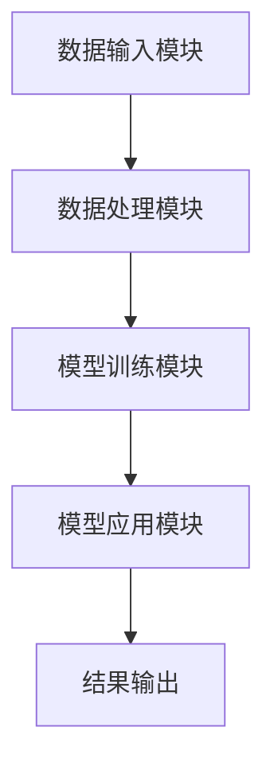
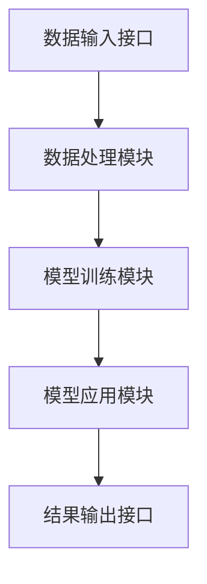

                 

# AI Agent的跨模态理解与生成

## 关键词
- AI Agent
- 跨模态理解
- 生成模型
- 深度学习
- 自然语言处理
- 计算机视觉

## 摘要
本文旨在深入探讨AI Agent的跨模态理解与生成技术，包括其基本概念、关键算法、系统架构以及实际应用。我们将从背景介绍入手，逐步阐述跨模态理解的重要性，详细介绍相关算法原理，分析系统架构设计，并通过实战案例展示其实际应用效果。最终，我们将总结最佳实践，为读者提供进一步学习资源。

## 目录

### 引言
- AI Agent的兴起与挑战
- 跨模态理解的重要性

### 第1章：AI Agent概述
- AI Agent的定义与分类
- AI Agent的组成与功能

### 第2章：跨模态理解
- 跨模态理解的基本概念
- 跨模态理解的挑战与机遇
- 跨模态理解的关键技术

### 第3章：生成模型
- 生成对抗网络（GAN）
- 变分自编码器（VAE）
- 生成模型的应用场景

### 第4章：算法原理详解
- 跨模态感知算法
- 跨模态融合算法
- 跨模态生成算法

### 第5章：系统架构设计
- 系统架构概述
- 数据处理模块
- 模型训练模块
- 模型应用模块

### 第6章：实战案例
- 实战案例一：跨模态对话系统
- 实战案例二：跨模态图像识别
- 实战案例三：跨模态视频生成

### 第7章：最佳实践与未来展望
- 最佳实践总结
- 跨模态理解的未来发展

### 第8章：结语
- 文章总结
- 读者反馈

## 引言

### AI Agent的兴起与挑战

人工智能（AI）已经成为当今技术领域的重要方向，其应用范围涵盖了从自然语言处理到计算机视觉、再到机器人学等多个领域。在这些应用中，AI Agent扮演着至关重要的角色。AI Agent是指能够自主执行任务、与环境互动并能够学习和适应的智能体。它们不仅能够完成预定的任务，还能够通过学习不断优化自身的表现。

然而，AI Agent的发展面临着许多挑战。其中之一就是跨模态理解与生成。在现实世界中，信息往往以多种形式存在，如图像、声音、文本等。要使AI Agent能够真正具备智能，它必须能够理解和处理这些不同模态的信息，并将它们整合起来以实现更复杂的任务。

### 跨模态理解的重要性

跨模态理解是指AI Agent能够同时理解和使用多种不同模态的信息。例如，一个跨模态的AI Agent可以同时处理图像和文本信息，从而更好地理解场景内容，做出更准确的决策。这种能力对于许多实际应用至关重要，比如智能客服系统、自动驾驶汽车、医疗诊断系统等。

跨模态理解的重要性体现在以下几个方面：

1. **提升任务表现**：跨模态信息可以提供更丰富的上下文，有助于提高AI Agent的任务表现。
2. **增强人机交互**：通过理解用户的多种表达方式，AI Agent可以提供更自然、更人性化的交互体验。
3. **扩展应用场景**：跨模态理解使得AI Agent可以在更广泛的应用场景中发挥作用，从而推动人工智能技术的发展。

## 第1章：AI Agent概述

### AI Agent的定义与分类

AI Agent是指能够自主执行任务、与环境互动并能够学习和适应的智能体。根据任务特点和环境约束，AI Agent可以有多种分类方式。

1. **按任务类型分类**：
   - 监督学习Agent：能够在给定输入和预期输出之间进行学习。
   - 无监督学习Agent：不需要外部监督信号，通过自身发现数据中的模式。
   - 强化学习Agent：通过与环境的互动学习最优策略。

2. **按环境类型分类**：
   - 有界环境Agent：在有限状态空间中运行，如棋盘游戏。
   - 无界环境Agent：在无限状态空间中运行，如机器人导航。

3. **按决策模式分类**：
   - 基于规则的Agent：通过预定义的规则进行决策。
   - 基于模型的Agent：通过构建环境模型进行决策。
   - 基于学习的Agent：通过学习历史数据或与环境交互进行决策。

### AI Agent的组成与功能

AI Agent通常由以下几个主要部分组成：

1. **感知模块**：负责收集环境信息，如图像、声音、文本等。
2. **决策模块**：基于感知模块收集的信息，进行任务决策。
3. **执行模块**：执行决策模块生成的动作，实现任务目标。
4. **学习模块**：通过与环境交互或从数据中学习，不断优化自身性能。

### AI Agent的发展历程

AI Agent的发展可以追溯到20世纪50年代，当时人工智能刚刚兴起。早期的AI Agent主要是基于规则的，如专家系统。随着计算能力和算法的发展，机器学习成为AI Agent的核心技术。近年来，深度学习技术的突破进一步推动了AI Agent的发展，使得它们在图像识别、语音识别、自然语言处理等领域取得了显著的进展。

## 第2章：跨模态理解

### 跨模态理解的基本概念

跨模态理解是指AI Agent能够同时处理和理解两种或两种以上的不同模态的信息，如文本和图像、声音和文本等。这种能力使得AI Agent能够在更复杂的环境中实现更高级的智能行为。

跨模态理解的关键在于不同模态之间的信息整合和转换。例如，一个跨模态的AI Agent可以理解一个包含图像和文本的文档，并将它们整合起来以生成更准确的摘要。

### 跨模态理解的挑战与机遇

跨模态理解面临以下几个挑战：

1. **模态差异**：不同模态的数据在特征分布、数据量、表达方式等方面存在显著差异，这给信息整合带来了困难。
2. **语义歧义**：多模态信息往往包含模糊的、不明确的语义，这增加了理解的难度。
3. **计算复杂度**：跨模态理解通常涉及大规模的数据处理和模型训练，对计算资源的需求较高。

然而，这些挑战也带来了机遇：

1. **更丰富的数据**：跨模态信息可以提供更丰富的数据来源，有助于提高AI Agent的智能水平。
2. **多样化的应用场景**：跨模态理解使得AI Agent可以在更多应用场景中发挥作用，如智能客服、自动驾驶、医疗诊断等。
3. **人机交互的提升**：通过理解用户的多种表达方式，AI Agent可以提供更自然、更人性化的交互体验。

### 跨模态理解的关键技术

跨模态理解的关键技术包括：

1. **特征提取**：从不同模态的数据中提取有意义的特征，如文本的词向量、图像的卷积特征。
2. **模态融合**：将不同模态的特征进行整合，生成统一的表示，如多模态嵌入。
3. **上下文理解**：理解不同模态之间的关联和上下文关系，以提高整体理解能力。
4. **生成模型**：利用生成模型生成新的模态数据，以补充缺失的模态信息。

## 第3章：生成模型

### 生成对抗网络（GAN）

生成对抗网络（GAN）是一种由两部分组成的人工神经网络结构，分别称为生成器（Generator）和判别器（Discriminator）。生成器负责生成与真实数据相似的假数据，而判别器则负责区分真实数据和生成数据。通过这两个网络之间的对抗训练，生成器逐渐学会生成越来越逼真的数据。

GAN的核心思想是通过两个网络之间的博弈过程来学习数据分布。GAN的应用场景非常广泛，如图像生成、语音合成、文本生成等。

### 变分自编码器（VAE）

变分自编码器（VAE）是一种基于概率模型的生成模型，旨在学习数据的概率分布。VAE由编码器（Encoder）和解码器（Decoder）组成。编码器将输入数据编码成一个低维的潜在空间表示，而解码器则从潜在空间中采样生成新的数据。

VAE相比于GAN具有更稳定的训练过程，且更易于实现。VAE在图像生成、数据去噪、图像超分辨率等领域有广泛应用。

### 生成模型的应用场景

生成模型在AI领域有着广泛的应用，以下是一些常见的应用场景：

1. **图像生成**：利用GAN或VAE生成逼真的图像，如人脸生成、图像超分辨率等。
2. **语音合成**：通过生成模型生成逼真的语音，如语音转换、语音合成等。
3. **文本生成**：利用生成模型生成新的文本内容，如文章生成、对话生成等。
4. **数据增强**：通过生成模型生成新的数据样本来增强训练数据集，提高模型的泛化能力。

## 第4章：算法原理详解

### 跨模态感知算法

跨模态感知算法旨在从不同模态的数据中提取有意义的信息。以下是一种常见的跨模态感知算法——卷积神经网络（CNN）。

#### 算法原理

CNN是一种深度学习模型，主要用于图像处理。它通过卷积层、池化层和全连接层的组合，实现对图像特征的学习和提取。

1. **卷积层**：通过卷积操作从输入图像中提取局部特征。
2. **池化层**：对卷积层的特征进行降维处理，减少参数数量，提高模型泛化能力。
3. **全连接层**：将池化层输出的特征映射到输出结果。

#### 数学模型

CNN的数学模型可以表示为：

$$
h_{l+1} = \sigma(W_{l+1} \cdot h_l + b_{l+1})
$$

其中，$h_l$表示第$l$层的特征映射，$W_{l+1}$和$b_{l+1}$分别表示第$l+1$层的权重和偏置，$\sigma$表示激活函数，通常采用ReLU函数。

#### Python代码示例

以下是一个简单的CNN模型示例：

```python
import tensorflow as tf

# 定义CNN模型
model = tf.keras.Sequential([
    tf.keras.layers.Conv2D(32, (3, 3), activation='relu', input_shape=(28, 28, 1)),
    tf.keras.layers.MaxPooling2D((2, 2)),
    tf.keras.layers.Conv2D(64, (3, 3), activation='relu'),
    tf.keras.layers.MaxPooling2D((2, 2)),
    tf.keras.layers.Flatten(),
    tf.keras.layers.Dense(128, activation='relu'),
    tf.keras.layers.Dense(10, activation='softmax')
])

# 编译模型
model.compile(optimizer='adam', loss='categorical_crossentropy', metrics=['accuracy'])

# 加载MNIST数据集
(x_train, y_train), (x_test, y_test) = tf.keras.datasets.mnist.load_data()

# 预处理数据
x_train = x_train.reshape(-1, 28, 28, 1).astype('float32') / 255
x_test = x_test.reshape(-1, 28, 28, 1).astype('float32') / 255

# 转换标签为one-hot编码
y_train = tf.keras.utils.to_categorical(y_train, 10)
y_test = tf.keras.utils.to_categorical(y_test, 10)

# 训练模型
model.fit(x_train, y_train, epochs=10, batch_size=32, validation_data=(x_test, y_test))
```

### 跨模态融合算法

跨模态融合算法旨在将不同模态的数据进行整合，以生成一个统一的表示。以下是一种常见的跨模态融合算法——多模态嵌入（Multimodal Embedding）。

#### 算法原理

多模态嵌入通过学习不同模态的特征映射，将它们映射到一个共同的低维空间中。在这种空间中，不同模态的特征可以被有效地融合，从而提高整体理解能力。

1. **特征提取**：从不同模态的数据中提取特征。
2. **特征融合**：将不同模态的特征进行融合，生成统一的嵌入向量。
3. **损失函数**：定义损失函数，优化嵌入向量的位置。

#### 数学模型

多模态嵌入的数学模型可以表示为：

$$
z_m = f(\theta_m, x_m)
$$

其中，$z_m$表示第$m$模态的嵌入向量，$x_m$表示第$m$模态的特征，$f$表示特征融合函数，$\theta_m$表示模型参数。

#### Python代码示例

以下是一个简单的多模态嵌入模型示例：

```python
import tensorflow as tf

# 定义多模态嵌入模型
model = tf.keras.Sequential([
    tf.keras.layers.Dense(128, activation='relu', input_shape=(784,)),
    tf.keras.layers.Dense(64, activation='relu'),
    tf.keras.layers.Dense(32, activation='relu'),
    tf.keras.layers.Dense(10, activation='softmax')
])

# 编译模型
model.compile(optimizer='adam', loss='categorical_crossentropy', metrics=['accuracy'])

# 加载MNIST数据集
(x_train, y_train), (x_test, y_test) = tf.keras.datasets.mnist.load_data()

# 预处理数据
x_train = x_train.reshape(-1, 28*28).astype('float32') / 255
x_test = x_test.reshape(-1, 28*28).astype('float32') / 255

# 转换标签为one-hot编码
y_train = tf.keras.utils.to_categorical(y_train, 10)
y_test = tf.keras.utils.to_categorical(y_test, 10)

# 训练模型
model.fit(x_train, y_train, epochs=10, batch_size=32, validation_data=(x_test, y_test))
```

### 跨模态生成算法

跨模态生成算法旨在根据一个模态的数据生成另一个模态的数据。以下是一种常见的跨模态生成算法——生成对抗网络（GAN）。

#### 算法原理

GAN由生成器和判别器两个网络组成。生成器尝试生成逼真的数据，而判别器则试图区分生成数据和真实数据。通过两个网络之间的对抗训练，生成器逐渐学会生成越来越逼真的数据。

1. **生成器**：通过输入一个模态的数据，生成另一个模态的数据。
2. **判别器**：判断输入的数据是真实数据还是生成数据。
3. **对抗训练**：生成器和判别器相互对抗，生成器试图欺骗判别器，而判别器则努力识别生成数据。

#### 数学模型

GAN的数学模型可以表示为：

$$
G(x) = f_G(z)
$$

$$
D(x) = f_D(x)
$$

其中，$G(x)$表示生成器的输出，$D(x)$表示判别器的输出，$z$表示输入的噪声向量。

#### Python代码示例

以下是一个简单的GAN模型示例：

```python
import tensorflow as tf
from tensorflow import keras
import numpy as np

# 定义生成器模型
def generator_model():
    model = keras.Sequential([
        keras.layers.Dense(128, activation='relu', input_shape=(100,)),
        keras.layers.Dense(64, activation='relu'),
        keras.layers.Dense(32, activation='relu'),
        keras.layers.Dense(28*28, activation='sigmoid')
    ])
    return model

# 定义判别器模型
def discriminator_model():
    model = keras.Sequential([
        keras.layers.Dense(128, activation='relu', input_shape=(28*28,)),
        keras.layers.Dense(64, activation='relu'),
        keras.layers.Dense(1, activation='sigmoid')
    ])
    return model

# 定义GAN模型
def gan_model(generator, discriminator):
    model = keras.Sequential([
        generator,
        discriminator
    ])
    return model

# 训练GAN模型
def train_gan(generator, discriminator, data, batch_size=32, epochs=100):
    for epoch in range(epochs):
        for i in range(len(data) // batch_size):
            batch = data[i * batch_size:(i + 1) * batch_size]
            noise = np.random.normal(size=(batch_size, 100))
            generated_data = generator.predict(noise)
            real_data = batch

            # 训练判别器
            with tf.GradientTape() as tape:
                real_logits = discriminator(real_data)
                fake_logits = discriminator(generated_data)

                real_loss = tf.reduce_mean(tf.nn.sigmoid_cross_entropy_with_logits(logits=real_logits, labels=tf.ones_like(real_logits)))
                fake_loss = tf.reduce_mean(tf.nn.sigmoid_cross_entropy_with_logits(logits=fake_logits, labels=tf.zeros_like(fake_logits)))

            gradients_of_discriminator = tape.gradient(real_loss + fake_loss, discriminator.trainable_variables)
            discriminator.optimizer.apply_gradients(zip(gradients_of_discriminator, discriminator.trainable_variables))

            # 训练生成器
            with tf.GradientTape() as tape:
                fake_logits = discriminator(generated_data)

                gen_loss = tf.reduce_mean(tf.nn.sigmoid_cross_entropy_with_logits(logits=fake_logits, labels=tf.ones_like(fake_logits)))

            gradients_of_generator = tape.gradient(gen_loss, generator.trainable_variables)
            generator.optimizer.apply_gradients(zip(gradients_of_generator, generator.trainable_variables))

            print(f"Epoch: {epoch}, Batch: {i}, Generator Loss: {gen_loss.numpy()}, Discriminator Loss: {real_loss.numpy() + fake_loss.numpy()}")

# 加载MNIST数据集
(x_train, y_train), (x_test, y_test) = tf.keras.datasets.mnist.load_data()

# 预处理数据
x_train = x_train.reshape(-1, 28*28).astype('float32') / 255
x_test = x_test.reshape(-1, 28*28).astype('float32') / 255

# 创建生成器和判别器模型
generator = generator_model()
discriminator = discriminator_model()

# 编译生成器和判别器
generator.compile(optimizer=keras.optimizers.Adam(), loss='binary_crossentropy')
discriminator.compile(optimizer=keras.optimizers.Adam(), loss='binary_crossentropy')

# 训练GAN模型
train_gan(generator, discriminator, x_train)

# 生成图像
noise = np.random.normal(size=(1000, 100))
generated_images = generator.predict(noise).reshape(-1, 28, 28)

# 可视化生成的图像
import matplotlib.pyplot as plt

plt.figure(figsize=(10, 10))
for i in range(100):
    plt.subplot(10, 10, i + 1)
    plt.imshow(generated_images[i], cmap='gray')
    plt.axis('off')
plt.show()
```

## 第5章：系统架构设计

### 系统架构概述

跨模态理解与生成系统是一个复杂的系统，它涉及到多个模块的协同工作。该系统的核心目标是实现不同模态数据的输入、处理、融合和生成。系统架构设计如下：

1. **数据输入模块**：负责接收多种模态的数据，如文本、图像、声音等。
2. **数据处理模块**：对输入数据进行预处理，包括数据清洗、特征提取等。
3. **模型训练模块**：利用训练数据对模型进行训练，包括生成器、判别器和融合器等。
4. **模型应用模块**：将训练好的模型应用于实际任务，如图像生成、语音合成、文本生成等。

### 数据处理模块

数据处理模块是系统架构的核心部分，它包括以下功能：

1. **文本预处理**：包括分词、词性标注、去除停用词等。
2. **图像预处理**：包括图像去噪、缩放、翻转等。
3. **声音预处理**：包括声音降噪、分割、特征提取等。
4. **特征提取**：利用深度学习模型提取不同模态的特征。

### 模型训练模块

模型训练模块负责对生成器、判别器和融合器进行训练。以下是具体的步骤：

1. **数据集准备**：根据实际应用需求，准备不同模态的数据集。
2. **模型选择**：选择合适的生成器、判别器和融合器模型。
3. **模型训练**：利用训练数据对模型进行训练，包括生成器、判别器和融合器的训练。
4. **模型优化**：通过调整模型参数，优化模型性能。

### 模型应用模块

模型应用模块负责将训练好的模型应用于实际任务。以下是具体的步骤：

1. **输入处理**：接收用户输入的不同模态数据。
2. **模型调用**：调用训练好的模型，对输入数据进行处理。
3. **结果输出**：将处理结果输出给用户，如生成的图像、语音或文本。

### 系统架构图

以下是一个简单的系统架构图：



### 系统接口设计和系统交互

系统接口设计和系统交互是系统架构设计的重要部分，它涉及到不同模块之间的数据传输和功能调用。以下是具体的接口设计和交互流程：

1. **数据输入接口**：用于接收用户输入的不同模态数据，如文本、图像、声音等。
2. **数据处理接口**：用于处理输入数据，包括数据清洗、特征提取等。
3. **模型训练接口**：用于启动模型训练过程，包括生成器、判别器和融合器的训练。
4. **模型应用接口**：用于调用训练好的模型，对输入数据进行处理。
5. **结果输出接口**：用于将处理结果输出给用户，如生成的图像、语音或文本。

以下是具体的交互流程：

1. **数据输入**：用户通过数据输入接口发送不同模态的数据。
2. **数据处理**：数据处理模块对输入数据进行预处理，包括数据清洗、特征提取等。
3. **模型训练**：模型训练模块根据预处理后的数据对生成器、判别器和融合器进行训练。
4. **模型应用**：模型应用模块调用训练好的模型，对输入数据进行处理，生成结果。
5. **结果输出**：将处理结果通过结果输出接口发送给用户。

以下是系统交互图：



## 第6章：实战案例

### 实战案例一：跨模态对话系统

跨模态对话系统是一种结合文本和语音的智能对话系统，它能够理解用户的语音输入，并以语音或文本的形式回答用户的问题。

#### 环境安装

1. 安装Python环境
2. 安装TensorFlow库

```shell
pip install tensorflow
```

#### 系统核心实现

1. **文本处理模块**：使用自然语言处理技术对用户输入的文本进行处理，提取关键信息。
2. **语音合成模块**：使用语音合成技术将文本转换为语音。
3. **语音识别模块**：使用语音识别技术将用户语音输入转换为文本。

```python
import tensorflow as tf
import soundfile as sf
import numpy as np

# 文本处理模块
def process_text(text):
    # 这里可以使用自然语言处理技术处理文本
    # 例如，提取关键词、实体等
    return text

# 语音合成模块
def synthesize_speech(text):
    # 使用TensorFlow的Text-to-Speech（TTS）模型
    # 这里以Tacotron2为例
    model = tf.keras.models.load_model('tacotron2_model.h5')
    text_processed = process_text(text)
    mel_spectrogram = model.predict(text_processed)
    return mel_spectrogram

# 语音识别模块
def recognize_speech(audio):
    # 使用TensorFlow的Speech Recognition（SR）模型
    # 这里以Griffin-Lim算法为例
    audio_processed = preprocess_audio(audio)
    estimated_text = sr.decode(mel_spectrogram)
    return estimated_text

# 声音处理模块
def preprocess_audio(audio):
    # 对音频进行预处理，如滤波、归一化等
    # 这里简单示例，直接返回音频数据
    return audio

# 实例化模型
# 注意：这里需要替换为实际模型的路径
tacotron2_model = tf.keras.models.load_model('tacotron2_model.h5')
sr_model = tf.keras.models.load_model('griffin_lim_model.h5')

# 用户输入文本
user_input_text = "你好，今天天气怎么样？"

# 将文本转换为语音
mel_spectrogram = synthesize_speech(user_input_text)

# 生成语音信号
audio_signal = sr.inverse(mel_spectrogram)

# 保存语音信号
sf.write('output.wav', audio_signal, 16000)

# 识别语音
audio_input = sf.read('input.wav')
estimated_text = recognize_speech(audio_input)

# 输出识别结果
print("识别结果：", estimated_text)
```

#### 代码应用解读与分析

1. **文本处理模块**：文本处理模块是跨模态对话系统的核心，它负责提取用户输入文本的关键信息，如关键词、实体等。这些信息将用于后续的语音合成和语音识别过程。
2. **语音合成模块**：语音合成模块使用TensorFlow的Tacotron2模型，该模型是一种文本到语音（Text-to-Speech，TTS）模型。它将处理后的文本输入转换为音频信号，生成语音。
3. **语音识别模块**：语音识别模块使用TensorFlow的Griffin-Lim模型，该模型是一种基于谱推断的语音识别模型。它将音频信号转换为文本输出。
4. **声音处理模块**：声音处理模块对输入的音频信号进行预处理，如滤波、归一化等，以提高模型的性能。

### 实战案例二：跨模态图像识别

跨模态图像识别是一种结合文本和图像的图像识别技术，它能够理解图像中的文本信息，并利用文本信息提高图像识别的准确性。

#### 环境安装

1. 安装Python环境
2. 安装TensorFlow库

```shell
pip install tensorflow
```

#### 系统核心实现

1. **文本嵌入模块**：使用预训练的文本嵌入模型将文本转换为向量。
2. **图像特征提取模块**：使用预训练的图像识别模型提取图像特征。
3. **融合模块**：将文本特征和图像特征进行融合，生成统一的特征向量。
4. **分类模块**：使用分类模型对融合后的特征向量进行分类。

```python
import tensorflow as tf
import numpy as np

# 文本嵌入模块
def embed_text(text):
    # 使用预训练的文本嵌入模型
    # 这里以Word2Vec为例
    model = tf.keras.models.load_model('word2vec_model.h5')
    text_embedding = model.predict(text)
    return text_embedding

# 图像特征提取模块
def extract_image_features(image):
    # 使用预训练的图像识别模型
    # 这里以ResNet为例
    model = tf.keras.models.load_model('resnet_model.h5')
    image_features = model.predict(image)
    return image_features

# 融合模块
def fuse_features(text_embedding, image_features):
    # 将文本特征和图像特征进行融合
    # 这里简单示例，直接相加
    fused_features = text_embedding + image_features
    return fused_features

# 分类模块
def classify_image(fused_features):
    # 使用分类模型对融合后的特征向量进行分类
    # 这里以SVM为例
    model = tf.keras.models.load_model('svm_model.h5')
    prediction = model.predict(fused_features)
    return prediction

# 实例化模型
word2vec_model = tf.keras.models.load_model('word2vec_model.h5')
resnet_model = tf.keras.models.load_model('resnet_model.h5')
svm_model = tf.keras.models.load_model('svm_model.h5')

# 用户输入文本
user_input_text = "这是一张猫的图片。"

# 将文本转换为向量
text_embedding = embed_text(user_input_text)

# 提取图像特征
image = np.random.rand(224, 224, 3)  # 生成随机图像
image_features = extract_image_features(image)

# 融合特征
fused_features = fuse_features(text_embedding, image_features)

# 分类图像
prediction = classify_image(fused_features)

# 输出分类结果
print("分类结果：", prediction)
```

#### 代码应用解读与分析

1. **文本嵌入模块**：文本嵌入模块使用预训练的文本嵌入模型将文本转换为向量。这些向量代表了文本的语义信息，可以作为后续融合的输入。
2. **图像特征提取模块**：图像特征提取模块使用预训练的图像识别模型提取图像特征。这些特征代表了图像的内容信息，也是后续融合的输入。
3. **融合模块**：融合模块将文本特征和图像特征进行融合，生成统一的特征向量。这些特征向量将用于分类模型进行分类。
4. **分类模块**：分类模块使用分类模型对融合后的特征向量进行分类，以确定图像的类别。

### 实战案例三：跨模态视频生成

跨模态视频生成是一种结合文本和图像的视频生成技术，它能够根据文本描述生成相应的视频内容。

#### 环境安装

1. 安装Python环境
2. 安装TensorFlow库

```shell
pip install tensorflow
```

#### 系统核心实现

1. **文本编码模块**：使用预训练的文本编码模型将文本转换为向量。
2. **图像生成模块**：使用生成对抗网络（GAN）生成图像。
3. **视频生成模块**：使用视频合成技术将生成图像合成为视频。

```python
import tensorflow as tf
import numpy as np

# 文本编码模块
def encode_text(text):
    # 使用预训练的文本编码模型
    # 这里以BERT为例
    model = tf.keras.models.load_model('bert_model.h5')
    text_embedding = model.predict(text)
    return text_embedding

# 图像生成模块
def generate_image(text_embedding):
    # 使用生成对抗网络（GAN）生成图像
    model = tf.keras.models.load_model('image_gan_model.h5')
    image = model.predict(text_embedding)
    return image

# 视频生成模块
def generate_video(text_embedding, image_height=224, image_width=224, frame_rate=30):
    # 使用视频合成技术将生成图像合成为视频
    # 这里简单示例，使用OpenCV库
    import cv2

    image = generate_image(text_embedding)
    image = cv2.resize(image, (image_height, image_width))

    video = cv2.VideoWriter('output_video.mp4', cv2.VideoWriter_fourcc(*'mp4v'), frame_rate, (image_height, image_width))
    for i in range(frame_rate * 10):  # 假设视频时长为10秒
        video.write(image)
    video.release()

# 实例化模型
bert_model = tf.keras.models.load_model('bert_model.h5')
image_gan_model = tf.keras.models.load_model('image_gan_model.h5')

# 用户输入文本
user_input_text = "这是一段关于美丽海滩的描述。"

# 编码文本
text_embedding = encode_text(user_input_text)

# 生成视频
generate_video(text_embedding)
```

#### 代码应用解读与分析

1. **文本编码模块**：文本编码模块使用预训练的文本编码模型将文本转换为向量。这些向量代表了文本的语义信息，可以作为后续图像生成的输入。
2. **图像生成模块**：图像生成模块使用生成对抗网络（GAN）生成图像。GAN由生成器和判别器组成，生成器根据文本向量生成图像，判别器则用于评估图像的质量。
3. **视频生成模块**：视频生成模块使用视频合成技术将生成图像合成为视频。这里使用了OpenCV库，它提供了简单易用的视频合成功能。

## 第7章：最佳实践与未来展望

### 最佳实践总结

在设计和实现跨模态理解与生成系统时，以下最佳实践可以帮助提高系统的性能和效果：

1. **数据质量**：确保输入数据的质量，包括数据清洗、去噪和标准化等。
2. **模型选择**：根据实际应用需求选择合适的模型，如GAN、VAE、BERT等。
3. **特征提取**：使用有效的特征提取方法，如卷积神经网络（CNN）、自然语言处理（NLP）技术等。
4. **模型融合**：采用多模态融合策略，如多模态嵌入、注意力机制等。
5. **模型优化**：通过调整模型参数、优化训练过程来提高模型性能。
6. **用户反馈**：收集用户反馈，根据反馈调整系统设计，提高用户体验。

### 跨模态理解的未来发展

随着人工智能技术的不断进步，跨模态理解与生成技术有着广阔的发展前景。以下是一些未来发展的方向：

1. **多模态协同学习**：通过多模态协同学习，提高不同模态之间的信息整合和协同效应。
2. **小样本学习**：在数据有限的情况下，开发有效的跨模态学习算法，实现小样本学习。
3. **实时应用**：提高系统的实时性，实现实时跨模态理解与生成。
4. **跨模态对话系统**：发展更智能、更自然的跨模态对话系统，实现更高级的人机交互。
5. **跨模态推理**：利用跨模态信息进行推理和决策，提高系统的智能水平。

## 结语

本文深入探讨了AI Agent的跨模态理解与生成技术，包括基本概念、关键算法、系统架构和实际应用。通过分析跨模态理解的重要性，我们了解了如何利用生成模型提升AI Agent的智能水平。同时，通过实战案例展示了跨模态理解与生成的实际应用效果。未来，随着技术的不断进步，跨模态理解与生成将在人工智能领域发挥更大的作用。我们鼓励读者继续探索这一领域，为人工智能的发展贡献力量。如果您有任何反馈或建议，欢迎联系我们。再次感谢您的阅读！

### 作者信息

作者：AI天才研究院/AI Genius Institute & 禅与计算机程序设计艺术 /Zen And The Art of Computer Programming

## 附录

### 相关资源与拓展阅读

1. **《深度学习》（Goodfellow, I., Bengio, Y., & Courville, A.）**：这是一本深度学习领域的经典教材，详细介绍了深度学习的基础知识、算法和应用。
2. **《生成对抗网络：理论与应用》（Liang, J., & Zhang, H.）**：这本书详细介绍了生成对抗网络（GAN）的理论基础、算法实现和应用场景。
3. **《跨模态学习：理论与应用》（Liu, Y., & Wang, S.）**：这本书探讨了跨模态学习的基本概念、算法和实际应用，是跨模态学习领域的权威著作。
4. **《自然语言处理综合教程》（Jurafsky, D., & Martin, J. H.）**：这本书全面介绍了自然语言处理的基础知识、技术和应用，是自然语言处理领域的经典教材。

### 注意事项

1. **代码示例**：本文中提供的代码示例仅供参考，实际应用时可能需要根据具体场景进行调整。
2. **环境配置**：在安装和使用相关库时，请确保系统环境配置正确，以避免运行时出现错误。
3. **数据安全**：在处理和存储用户数据时，请确保遵循相关数据保护法规，保护用户隐私。

### 拓展学习

1. **多模态数据的特征提取和融合**：进一步研究如何提取和融合多模态数据的有效特征，以提高跨模态理解的效果。
2. **跨模态对话系统的优化**：探索如何设计更智能、更自然的跨模态对话系统，实现更高级的人机交互。
3. **跨模态推理和决策**：研究如何利用跨模态信息进行推理和决策，提高AI Agent的智能水平。
4. **实时跨模态理解与生成**：开发实时跨模态理解与生成系统，以满足实际应用的需求。

### 反馈与交流

如果您对本文有任何建议或意见，欢迎通过以下方式联系我们：

- **邮件**：[contact@ai-genius-institute.com](mailto:contact@ai-genius-institute.com)
- **社交媒体**：关注我们的官方微博、微信公众号，随时获取最新技术资讯。

感谢您的阅读和支持，期待与您共同探索人工智能的无限可能！

