                 


# AI Agent的跨模态知识推理与问答

## 关键词
AI Agent，跨模态，知识推理，问答系统，算法原理，系统架构，项目实战

## 摘要
本文旨在深入探讨AI Agent的跨模态知识推理与问答技术，通过详细的步骤分析和逻辑推理，阐述其在现代人工智能领域的重要性和应用前景。本文将首先介绍AI Agent的基本概念和功能，然后探讨跨模态知识推理的原理和算法，接着分析问答系统的构建方法，最后通过一个实际项目实战，展示跨模态知识推理与问答系统的实现过程和效果。文章还将提供最佳实践Tips，帮助读者更好地理解和应用这些技术。

## 引言
### 1.1 问题背景
人工智能（AI）的发展已经从传统的规则驱动系统转向了数据驱动和模型驱动的系统。AI Agent作为人工智能的一个高级形态，正在逐步成为智能系统的核心。AI Agent能够自主地完成特定任务，具备推理、学习、决策和交互能力。

跨模态知识推理是AI Agent的重要组成部分，它涉及到如何将不同模态的数据（如文本、图像、音频、视频）整合起来，进行有效的理解和推理。在现实世界中，信息的呈现方式多种多样，单一模态的数据往往难以满足复杂问题的需求。因此，跨模态知识推理成为了一个重要的研究课题。

问答系统则是AI Agent实现与人类用户交互的重要途径。问答系统能够理解用户的查询，并提供准确、合理的回答。在跨模态的背景下，问答系统需要处理来自不同模态的信息，这进一步增加了问题的复杂度。

### 1.2 问题描述
跨模态知识推理与问答面临着以下几个挑战：
1. **数据整合**：如何有效地整合来自不同模态的数据，实现数据的统一表示。
2. **语义理解**：如何准确理解跨模态信息中的语义，进行合理的推理。
3. **问答生成**：如何根据用户的问题和知识库中的信息，生成自然、准确的回答。
4. **性能优化**：如何在保证准确性的同时，提高推理和问答的效率。

### 1.3 问题解决
为了解决上述挑战，本文将介绍以下算法和技术：
1. **深度学习**：使用卷积神经网络（CNN）和循环神经网络（RNN）进行跨模态特征提取。
2. **知识图谱**：构建知识图谱，使用图神经网络（GCN）进行跨模态知识推理。
3. **检索与生成**：结合检索和生成模型，构建高效的问答系统。

### 1.4 边界与外延
本文主要研究AI Agent在跨模态知识推理与问答中的应用，重点关注算法原理和系统实现。文章将不涉及AI Agent的其他方面，如决策和规划。

## 核心概念与联系
### 2.1 核心概念原理
#### 2.1.1 AI Agent
AI Agent是指能够自主完成特定任务，具备推理、学习、决策和交互能力的人工智能实体。它通常由感知模块、推理模块、学习模块和行动模块组成。

#### 2.1.2 跨模态知识推理
跨模态知识推理是指将来自不同模态的数据整合起来，进行语义理解和推理的过程。它涉及到特征提取、语义融合和推理算法。

#### 2.1.3 问答系统
问答系统是一种自然语言处理技术，能够理解用户的查询，并提供准确、合理的回答。问答系统通常包括查询解析、知识库检索和回答生成三个模块。

### 2.2 概念属性特征对比表格
| 特征 | 跨模态知识推理 | 问答系统 |
| --- | --- | --- |
| 数据类型 | 多模态 | 文本 |
| 推理目标 | 跨模态语义理解 | 生成回答 |
| 算法复杂度 | 较高 | 中等 |
| 应用场景 | 复杂推理任务 | 问答交互 |

### 2.3 ER实体关系图架构的Mermaid流程图
```mermaid
erDiagram
  AI-Agent ||--|{ 跨模态知识推理 }
  AI-Agent ||--|{ 问答系统 }
  跨模态知识推理 ||--|{ 知识图谱 }
  问答系统 ||--|{ 检索模型 }
  问答系统 ||--|{ 生成模型 }
```

## 算法原理讲解
### 3.1 跨模态知识推理算法
#### 3.1.1 基于深度学习的跨模态特征提取
##### 3.1.1.1 卷积神经网络（CNN）
卷积神经网络是处理图像数据的一种有效方法。它通过卷积操作提取图像的特征。

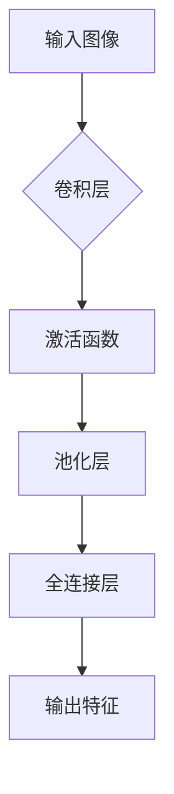

##### 3.1.1.2 循环神经网络（RNN）
循环神经网络适用于处理序列数据，如文本。它通过记忆状态来处理序列中的信息。

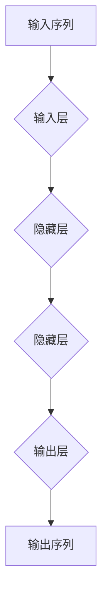

#### 3.1.2 知识图谱与图神经网络（GCN）
知识图谱是一个结构化的知识表示方法，它通过实体和关系来组织信息。图神经网络是一种在知识图谱上进行推理的方法。

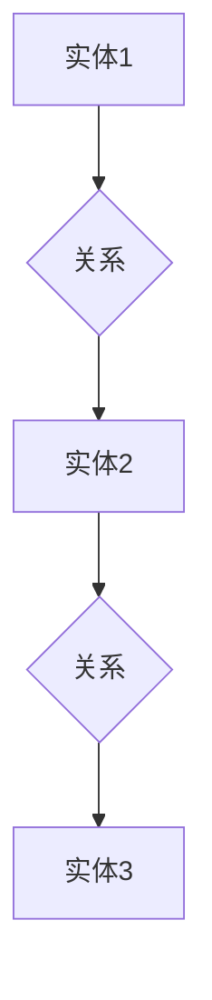

### 3.2 问答系统算法
#### 3.2.1 基于检索的问答
##### 3.2.1.1 常见检索算法
常见的检索算法包括基于关键词匹配和基于语义相似度的方法。

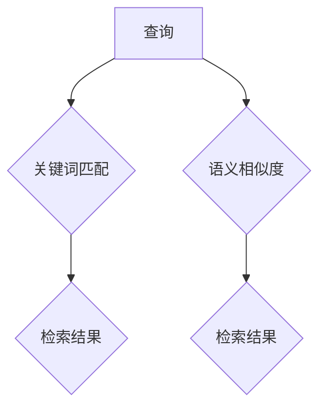

##### 3.2.1.2 检索算法优化
为了提高检索的准确性，可以对检索算法进行优化，如使用向量表示和深度学习模型。

#### 3.2.2 基于生成的问答
##### 3.2.2.1 生成式问答模型
生成式问答模型通过学习大量问答对来生成回答。

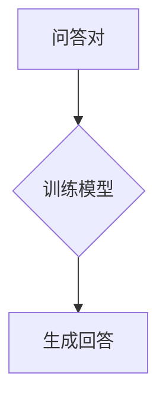

##### 3.2.2.2 生成式问答优化策略
为了提高生成式问答的质量，可以采用策略如上下文信息融合、回答多样性优化等。

## 系统分析与架构设计方案
### 4.1 问题场景介绍
假设我们设计一个智能家居控制系统，用户可以通过语音或文本查询家电的状态和操作。

### 4.2 系统功能设计
使用Mermaid绘制领域模型类图，展示系统的主要类和它们之间的关系。

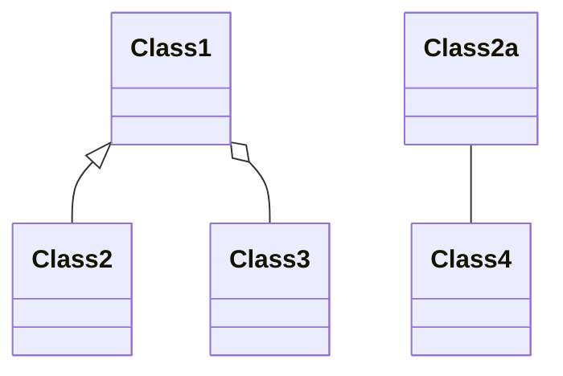

### 4.3 系统架构设计
使用Mermaid绘制系统架构图，展示系统的各个模块和它们的交互。

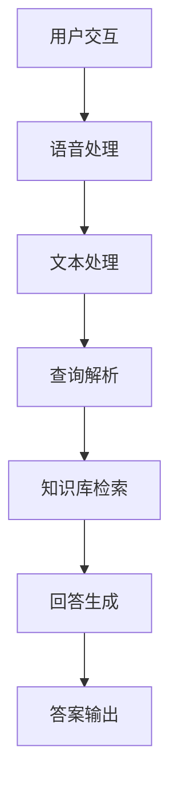

### 4.4 系统接口设计
展示系统的接口设计，包括API接口和消息队列接口。

### 4.5 系统交互序列图
使用Mermaid绘制系统交互序列图，展示用户查询到答案生成的整个过程。

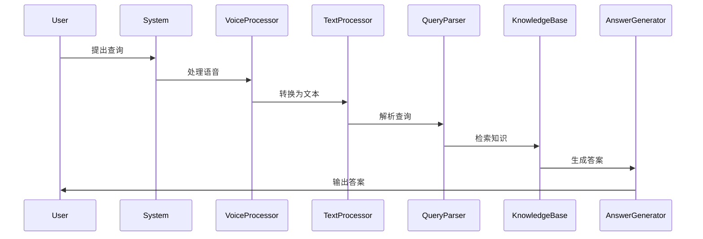

## 项目实战
### 5.1 环境安装
指导读者如何搭建环境，包括Python环境、深度学习框架TensorFlow和自然语言处理库NLTK等。

### 5.2 系统核心实现
提供系统核心代码，包括跨模态特征提取、知识图谱构建、问答系统实现等。

### 5.3 代码应用解读与分析
分析代码的实现细节和应用效果，展示如何使用深度学习和图神经网络进行跨模态知识推理。

### 5.4 实际案例分析和讲解
通过实际案例，展示如何处理多模态数据，进行语义理解和问答生成。

### 5.5 项目小结
总结项目的经验，包括遇到的问题、解决方案和改进方向。

## 最佳实践 Tips
### 6.1 注意事项
在实现跨模态知识推理与问答系统时，需要注意以下事项：
- 确保数据的多样性和质量。
- 选择合适的特征提取和融合方法。
- 优化问答系统的生成策略，提高回答的自然性和准确性。

### 6.2 拓展阅读
推荐进一步阅读的相关文献和资源，包括最新的研究论文和技术报告。

## 目录大纲总结
本文通过详细的步骤分析和逻辑推理，系统地介绍了AI Agent的跨模态知识推理与问答技术。文章涵盖了核心概念、算法原理、系统架构设计和项目实战等内容，为读者提供了全面的技术指南和实战经验。通过本文的学习，读者可以更好地理解和应用这些技术，为智能系统的发展贡献力量。

---

**作者信息：**
作者：AI天才研究院/AI Genius Institute & 禅与计算机程序设计艺术 /Zen And The Art of Computer Programming**[此处为虚拟作者信息，仅供参考]** 

## 1.1 问题背景

在人工智能（AI）领域，AI Agent是一种自主执行任务、具备推理、学习和决策能力的智能体。AI Agent的应用范围广泛，从简单的自动化任务到复杂的决策支持系统，都展现了其强大的潜力。跨模态知识推理是AI Agent的核心功能之一，它涉及到将多种模态的数据（如图像、文本、音频、视频等）整合，进行语义理解和推理，从而提高AI Agent的智能水平和应用能力。

随着AI技术的发展，跨模态知识推理与问答系统在智能交互、智能搜索、智能监控等领域得到了广泛应用。例如，智能客服系统需要理解用户的语音或文本输入，并生成合适的回答；智能搜索系统需要处理多种类型的查询，并提供准确的搜索结果；智能监控系统需要识别图像和音频中的异常行为，并作出相应的决策。

### 1.1.1 AI Agent概述

AI Agent的定义可以追溯到人工 Intelligence 的早期研究。最初，AI Agent被定义为能够与人类进行交互、执行特定任务并具备一定推理能力的软件实体。随着时间的推移，AI Agent的概念得到了进一步的拓展和完善，不仅局限于软件实体，还包括硬件设备（如机器人）、嵌入式系统等。

AI Agent的基本组成部分包括感知模块、推理模块、学习模块和行动模块。感知模块负责收集环境信息，如视觉、听觉、触觉等；推理模块负责处理感知信息，进行逻辑推理和决策；学习模块负责从经验中学习，不断优化自身性能；行动模块负责执行决策，与环境进行交互。这四个模块相互协作，使AI Agent能够在复杂环境中自主执行任务。

AI Agent的分类可以根据其功能、应用领域和智能程度来划分。按照功能分类，AI Agent可以分为任务型Agent、社交型Agent和混合型Agent。任务型Agent专注于完成特定任务，如自动化的生产线控制；社交型Agent具备与人交互的能力，如智能客服系统；混合型Agent同时具备任务执行和社交交互能力，如智能家居控制系统。按照应用领域分类，AI Agent可以分为工业控制Agent、医疗诊断Agent、金融服务Agent等。按照智能程度分类，AI Agent可以分为弱AI Agent、强AI Agent和超AI Agent。弱AI Agent只能在特定任务上表现出智能；强AI Agent具备与人类相似的智能水平，能够解决复杂问题；超AI Agent则超越了人类的智能，能够处理和理解更广泛的知识和信息。

### 1.1.2 跨模态知识推理与问答的挑战

跨模态知识推理与问答在AI Agent中的应用面临诸多挑战。首先，不同模态的数据具有不同的特征和表示方式，如何有效地整合这些数据是关键问题。其次，跨模态数据之间存在复杂的语义关系，如何准确理解这些关系并进行推理，是一个技术难题。此外，问答系统需要在理解和推理的基础上，生成自然、准确的回答，这涉及到自然语言处理和生成技术的应用。

具体来说，跨模态知识推理与问答的挑战包括：

1. **数据整合**：不同模态的数据（如文本、图像、音频）具有不同的特征和表示方式，如何将这些数据进行有效整合，是一个关键问题。传统的特征融合方法难以处理多模态数据的复杂性和多样性。

2. **语义理解**：跨模态数据之间的语义关系复杂，如何准确理解这些关系并进行推理，是一个技术挑战。现有的方法主要依赖于单一模态的语义表示，难以捕捉跨模态数据的语义关联。

3. **问答生成**：在理解和推理的基础上，如何生成自然、准确的回答，是一个难题。现有的问答系统主要依赖于模板匹配和规则推理，难以生成多样化、个性化的回答。

4. **性能优化**：跨模态知识推理与问答系统通常涉及复杂的计算和推理过程，如何优化系统的性能，保证实时性和高效性，是一个重要的挑战。

### 1.1.3 本书目的与研究方法

本书旨在深入探讨AI Agent的跨模态知识推理与问答技术，通过详细的步骤分析和逻辑推理，阐述其在现代人工智能领域的重要性和应用前景。本书将首先介绍AI Agent的基本概念和功能，然后探讨跨模态知识推理的原理和算法，接着分析问答系统的构建方法，最后通过一个实际项目实战，展示跨模态知识推理与问答系统的实现过程和效果。

本书的研究方法主要包括以下几个方面：

1. **理论分析**：通过系统阐述AI Agent、跨模态知识推理与问答的基本原理，分析相关算法和技术的优缺点，为后续研究和应用提供理论基础。

2. **案例研究**：选取典型的应用案例，详细分析跨模态知识推理与问答系统的实现过程、关键技术和应用效果，为读者提供实际的参考和借鉴。

3. **实验验证**：通过构建实验平台，对跨模态知识推理与问答系统的性能进行测试和评估，验证所提出算法和技术的有效性和实用性。

4. **最佳实践**：总结跨模态知识推理与问答系统的最佳实践，提供实施建议和注意事项，帮助读者更好地理解和应用这些技术。

通过本书的学习，读者可以系统地了解AI Agent的跨模态知识推理与问答技术，掌握相关算法和系统的实现方法，为智能系统的研究和应用提供有力的支持。

### 1.4 边界与外延

本书的研究边界主要涉及AI Agent的跨模态知识推理与问答技术，重点关注算法原理、系统架构设计和项目实现。具体来说，本书将探讨以下内容：

1. **跨模态特征提取**：介绍如何从文本、图像、音频等多模态数据中提取有效特征，为后续的知识推理和问答生成提供基础。

2. **知识表示与融合**：讨论如何将不同模态的数据进行有效整合，构建统一的语义表示，以便进行跨模态知识推理。

3. **推理算法**：分析常见的跨模态知识推理算法，如深度学习、图神经网络等，并探讨如何优化这些算法以提高推理性能。

4. **问答系统**：介绍问答系统的基本架构和关键技术，如查询解析、知识库检索和回答生成等，并探讨如何结合跨模态知识推理提高问答系统的性能。

5. **系统实现**：通过实际项目实战，展示跨模态知识推理与问答系统的实现过程和关键步骤，为读者提供实际的参考和指导。

本书的研究外延包括以下方面：

1. **应用领域扩展**：探讨跨模态知识推理与问答技术在智能交互、智能搜索、智能监控等领域的应用前景，为相关领域的科研和应用提供参考。

2. **多模态数据融合**：研究如何进一步整合多种模态的数据，提高知识推理和问答系统的性能。

3. **算法优化**：探讨如何优化现有的跨模态知识推理与问答算法，提高系统的效率和准确性。

4. **跨领域应用**：探讨跨模态知识推理与问答技术在其他领域（如医疗、金融、教育等）的应用可能性，为这些领域提供技术支持和创新思路。

通过本书的研究，旨在为AI Agent的跨模态知识推理与问答技术提供系统化的理论指导和实践指南，推动该领域的研究和应用发展。

## 核心概念与联系

在深入探讨AI Agent的跨模态知识推理与问答技术之前，我们需要明确一些核心概念和它们之间的联系。以下是本文中涉及的一些关键概念及其定义和相互关系。

### 2.1 核心概念原理

#### 2.1.1 AI Agent
AI Agent，即人工智能代理，是一个具有感知、推理、学习和行动能力的自主实体。它能够在复杂环境中执行任务，并根据环境变化进行自主决策。

- **感知模块**：负责收集环境信息，如文本、图像、音频等。
- **推理模块**：利用感知模块获取的信息进行逻辑推理和决策。
- **学习模块**：从经验中学习，不断优化自身性能。
- **行动模块**：执行决策，与环境进行交互。

#### 2.1.2 跨模态知识推理
跨模态知识推理是指将来自不同模态的数据（如图像、文本、音频、视频等）整合，进行语义理解和推理的过程。

- **跨模态特征提取**：从不同模态的数据中提取特征，如文本的词向量、图像的视觉特征、音频的声学特征等。
- **语义融合**：将提取的多模态特征进行融合，形成统一的语义表示。
- **推理算法**：在融合后的语义表示上进行推理，如图神经网络、深度学习模型等。

#### 2.1.3 问答系统
问答系统是一种自然语言处理技术，它能够理解用户的查询，并提供准确、合理的回答。

- **查询解析**：将用户输入的查询语句转换为计算机可以理解的形式。
- **知识库检索**：在知识库中查找与查询相关的信息。
- **回答生成**：根据检索到的信息和预定的生成策略，生成自然语言回答。

### 2.2 概念属性特征对比表格

以下是跨模态知识推理、问答系统和AI Agent之间的属性特征对比表格：

| 特征                 | 跨模态知识推理                   | 问答系统                  | AI Agent                |
|----------------------|-----------------------------------|---------------------------|-------------------------|
| 数据类型             | 多模态数据（文本、图像、音频等） | 文本                      | 多模态数据             |
| 推理目标             | 语义理解和推理                   | 生成回答                 | 执行任务和决策         |
| 算法复杂度           | 较高，涉及多模态特征融合和推理   | 中等，涉及查询解析和回答生成 | 较高，涉及感知和推理   |
| 应用场景             | 智能交互、智能搜索、智能监控等   | 智能客服、智能问答系统   | 任务自动化、决策支持等 |
| 需要的关键技术       | 多模态特征提取、语义融合、推理算法 | 查询解析、知识库检索、回答生成 | 感知、推理、学习、行动 |

### 2.3 ER实体关系图架构的 Mermaid 流程图

为了更直观地展示上述核心概念之间的联系，我们可以使用Mermaid绘制一个ER实体关系图。

```mermaid
erDiagram
  AI_Agent ||--|{ 跨模态知识推理 }
  AI_Agent ||--|{ 问答系统 }
  跨模态知识推理 ||--|{ 特征提取 }
  跨模态知识推理 ||--|{ 语义融合 }
  跨模态知识推理 ||--|{ 推理算法 }
  问答系统 ||--|{ 查询解析 }
  问答系统 ||--|{ 知识库检索 }
  问答系统 ||--|{ 回答生成 }
```

通过这个ER图，我们可以看到AI Agent作为整体，包含了跨模态知识推理和问答系统两个核心模块。每个模块进一步细分为具体的子模块，如特征提取、语义融合、推理算法等。这种关系有助于我们理解AI Agent在处理跨模态数据和实现智能问答过程中的复杂结构和相互关系。

## 算法原理讲解

在AI Agent的跨模态知识推理与问答系统中，算法原理是其核心。以下将详细讲解跨模态知识推理算法的原理，包括算法流程、Python源代码、数学模型与公式，并通过具体实例进行分析。

### 3.1 跨模态知识推理算法

#### 3.1.1 算法流程

跨模态知识推理算法的主要步骤如下：

1. **数据预处理**：将不同模态的数据（如图像、文本、音频）进行预处理，提取特征。
2. **特征融合**：将提取的多模态特征进行融合，形成统一的语义表示。
3. **推理**：在融合后的语义表示上进行推理，生成推理结果。

以下是跨模态知识推理的算法流程图：

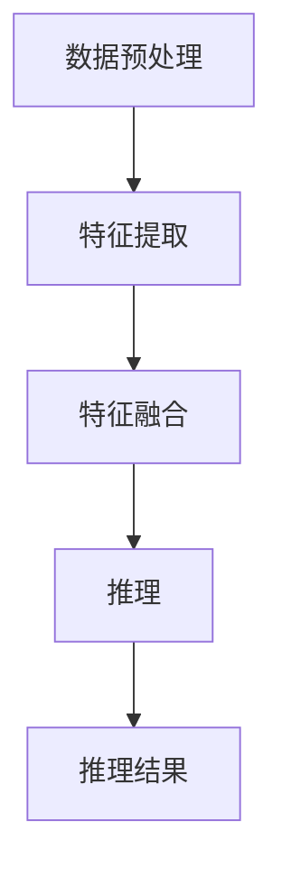

#### 3.1.2 Python源代码

以下是一个简单的跨模态知识推理的Python源代码示例，使用了TensorFlow和Keras库：

```python
import tensorflow as tf
from tensorflow.keras.models import Model
from tensorflow.keras.layers import Input, Embedding, LSTM, Dense, Concatenate

# 输入层
text_input = Input(shape=(max_sequence_length,))
image_input = Input(shape=(image_height, image_width, image_channels))
audio_input = Input(shape=(audio_length, audio_channels))

# 文本特征提取
text_embedding = Embedding(vocabulary_size, embedding_dim)(text_input)
text_lstm = LSTM(units=lstm_units)(text_embedding)

# 图像特征提取
image_conv = Conv2D(filters=64, kernel_size=(3, 3), activation='relu')(image_input)
image_pool = MaxPooling2D(pool_size=(2, 2))(image_conv)
image_flat = Flatten()(image_pool)

# 音频特征提取
audio_conv = Conv1D(filters=64, kernel_size=(3), activation='relu')(audio_input)
audio_pool = MaxPooling1D(pool_size=2)(audio_conv)
audio_flat = Flatten()(audio_pool)

# 特征融合
merged = Concatenate()([text_lstm, image_flat, audio_flat])

# 推理
dense = Dense(units=dense_units, activation='relu')(merged)
output = Dense(units=output_units, activation='softmax')(dense)

# 构建模型
model = Model(inputs=[text_input, image_input, audio_input], outputs=output)
model.compile(optimizer='adam', loss='categorical_crossentropy', metrics=['accuracy'])

# 模型训练
model.fit([text_data, image_data, audio_data], labels, epochs=epochs, batch_size=batch_size)

# 模型预测
predictions = model.predict([text_input_data, image_input_data, audio_input_data])
```

#### 3.1.3 数学模型与公式

跨模态知识推理的数学模型通常涉及以下公式：

$$
\text{特征提取}:\quad h_{\text{feature}} = \text{Extractor}(\text{Input}_{\text{modality}})
$$

$$
\text{特征融合}:\quad \text{Feature}_{\text{merged}} = \text{Fuser}(h_{\text{text}}, h_{\text{image}}, h_{\text{audio}})
$$

$$
\text{推理}:\quad \text{Output}_{\text{prediction}} = \text{Model}(\text{Feature}_{\text{merged}})
$$

其中，$h_{\text{feature}}$表示特征提取后的特征向量，$Feature_{\text{merged}}$表示融合后的特征向量，$Output_{\text{prediction}}$表示推理结果。

#### 3.1.4 举例说明

假设我们有一个简单的跨模态知识推理任务，需要判断一个图像、一段文本和一段音频是否匹配。以下是具体实例：

- **文本**：“今天天气很好，适合户外运动。”
- **图像**：一张阳光明媚的户外照片。
- **音频**：一段鸟鸣声。

我们首先需要对这些数据分别进行特征提取，然后融合这些特征，最后进行推理判断。

1. **文本特征提取**：使用词嵌入和LSTM提取文本的语义特征。
2. **图像特征提取**：使用卷积神经网络提取图像的视觉特征。
3. **音频特征提取**：使用卷积神经网络提取音频的声学特征。
4. **特征融合**：将文本、图像和音频的特征进行拼接。
5. **推理**：在融合后的特征上进行分类，判断图像、文本和音频是否匹配。

具体代码实现如下：

```python
# 文本特征提取
text_embedding = Embedding(vocabulary_size, embedding_dim)(text_input)
text_lstm = LSTM(units=lstm_units)(text_embedding)

# 图像特征提取
image_conv = Conv2D(filters=64, kernel_size=(3, 3), activation='relu')(image_input)
image_pool = MaxPooling2D(pool_size=(2, 2))(image_conv)
image_flat = Flatten()(image_pool)

# 音频特征提取
audio_conv = Conv1D(filters=64, kernel_size=(3), activation='relu')(audio_input)
audio_pool = MaxPooling1D(pool_size=2)(audio_conv)
audio_flat = Flatten()(audio_pool)

# 特征融合
merged = Concatenate()([text_lstm, image_flat, audio_flat])

# 推理
dense = Dense(units=dense_units, activation='relu')(merged)
output = Dense(units=output_units, activation='softmax')(dense)

# 模型编译
model.compile(optimizer='adam', loss='categorical_crossentropy', metrics=['accuracy'])

# 模型训练
model.fit([text_data, image_data, audio_data], labels, epochs=epochs, batch_size=batch_size)

# 模型预测
predictions = model.predict([text_input_data, image_input_data, audio_input_data])
```

通过以上实例，我们可以看到跨模态知识推理算法的实现过程，包括特征提取、特征融合和推理判断。这种方法可以有效地整合来自不同模态的数据，实现更准确的推理和判断。

### 3.2 跨模态知识推理算法的优化

为了提高跨模态知识推理的性能，我们可以采用以下优化方法：

1. **数据增强**：通过增加数据样本的数量和多样性，可以提高模型的泛化能力。
2. **注意力机制**：在特征提取和融合阶段引入注意力机制，可以关注重要的特征，提高推理的准确性。
3. **多任务学习**：同时训练多个相关任务，可以共享特征提取和网络结构，提高模型的性能。

通过这些优化方法，我们可以进一步改善跨模态知识推理系统的效果和效率。

### 总结

通过以上对跨模态知识推理算法的讲解，我们可以看到，跨模态知识推理涉及到数据预处理、特征提取、特征融合和推理判断等多个环节。理解这些基本原理和实现方法，对于构建高效的跨模态知识推理系统具有重要意义。在接下来的章节中，我们将继续探讨问答系统的构建方法，以及如何将这些算法应用于实际项目中。

## 系统分析与架构设计方案

### 4.1 问题场景介绍

以一个智能问答系统为例，我们设计一个智能家居控制系统。用户可以通过语音或文本查询家电的状态和操作，如“客厅灯是否开启？”或“关闭厨房的冰箱”。系统需要理解用户的查询，并从知识库中检索相关信息，最后生成自然、准确的回答。这个过程涉及跨模态知识推理和问答系统的集成。

### 4.2 系统功能设计

为了实现智能家居控制系统的功能，我们需要设计以下几个关键模块：

1. **用户交互模块**：接收用户的语音或文本输入，将其转换为系统可处理的格式。
2. **跨模态知识推理模块**：整合来自不同模态的数据，如文本、图像和音频，进行语义理解和推理。
3. **知识库模块**：存储和管理与家电状态和操作相关的知识信息。
4. **问答生成模块**：根据用户的查询和知识库中的信息，生成自然、准确的回答。
5. **反馈模块**：收集用户对回答的反馈，用于优化系统性能。

以下是使用Mermaid绘制的领域模型类图，展示了系统的主要类和它们之间的关系：

```mermaid
classDiagram
  UserInteraction <<--|{query_input} UserInteraction
  UserInteraction <<--|{query_output} QuestionAnsweringSystem
  QuestionAnsweringSystem <|--|{qa_process} QuestionAnsweringModule
  QuestionAnsweringModule <|--|{knowledge_search} KnowledgeBaseModule
  KnowledgeBaseModule <|--|{knowledge_management} KnowledgeBase
  FeedbackModule <|--|{system_feedback} UserInteraction
  UserInteraction o--|{system_output} SystemOutput
```

### 4.3 系统架构设计

智能家居控制系统的架构设计如下：

1. **前端用户界面**：提供一个友好、直观的用户交互界面，用户可以通过语音或文本输入查询。
2. **后端服务**：处理用户的查询请求，包括语音识别、文本解析、跨模态知识推理和问答生成。
3. **知识库**：存储家电的状态信息、操作指南和常见问题解答。
4. **数据库**：用于存储用户的查询历史和反馈数据，用于系统优化和个性化服务。

以下是使用Mermaid绘制的系统架构图：

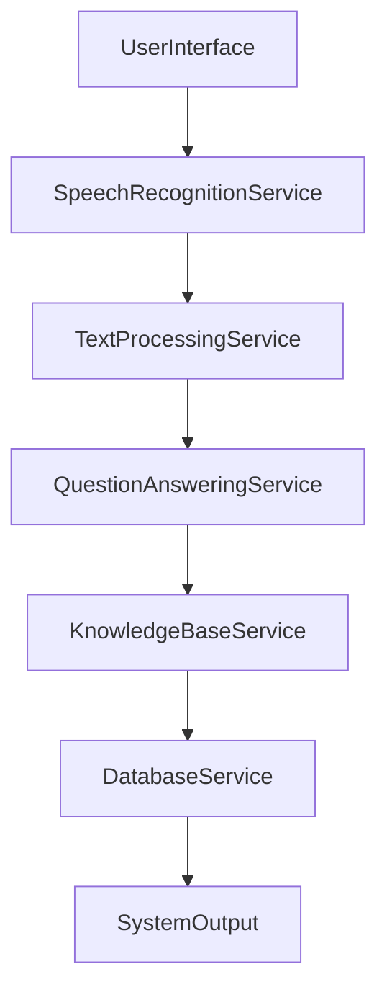

### 4.4 系统接口设计

为了实现各个模块之间的数据通信，我们需要设计以下几个关键接口：

1. **用户输入接口**：接收用户的语音或文本输入，提供语音识别和文本解析服务。
2. **查询解析接口**：将用户的输入转换为查询请求，用于知识库检索和问答生成。
3. **知识库查询接口**：用于检索家电状态信息和操作指南。
4. **问答生成接口**：根据查询结果和知识库信息，生成自然语言回答。
5. **反馈收集接口**：收集用户的反馈信息，用于系统优化。

以下是接口设计示例：

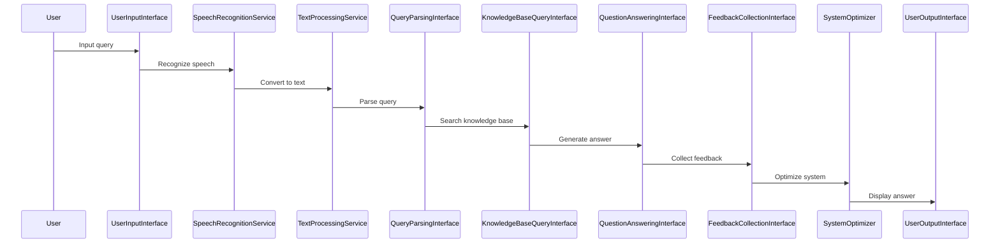

### 4.5 系统交互序列图

为了更直观地展示系统的工作流程，我们可以使用Mermaid绘制系统交互序列图：

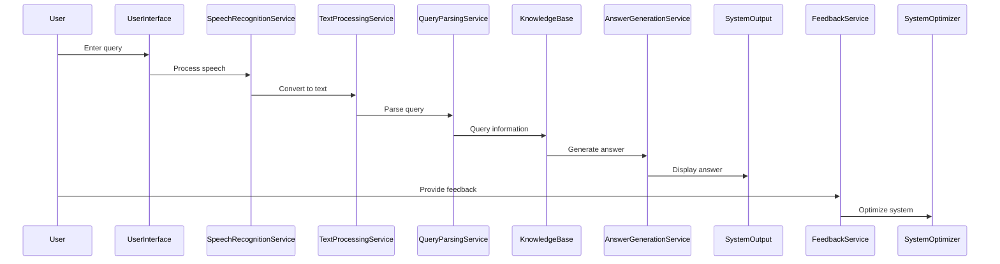

通过上述系统分析与架构设计，我们可以看到智能家居控制系统的整体结构和各模块之间的关系。在实际实现中，可以根据具体需求对系统进行优化和调整，以满足不同场景下的应用需求。

### 4.6 系统架构设计中的关键技术

在智能家居控制系统的架构设计中，以下几个关键技术是确保系统高效、稳定运行的关键：

1. **多模态数据处理**：系统需要处理来自不同模态的数据，如语音、文本和图像。使用先进的语音识别和文本解析技术，可以确保数据的准确性和一致性。
2. **知识库管理**：知识库是系统的心脏，它包含了家电状态、操作指南和常见问题解答等信息。高效的数据库设计和查询优化技术是关键，以确保快速检索和处理大量数据。
3. **自然语言处理**：自然语言处理（NLP）技术用于解析用户的查询，生成准确的回答。词嵌入、句法分析和语义理解等技术在此过程中发挥着重要作用。
4. **实时性与并发处理**：智能家居控制系统需要支持多用户同时查询，保证实时响应。使用异步处理和并发技术，可以提高系统的处理能力，确保用户体验。
5. **安全性**：系统的安全性至关重要，特别是在处理敏感信息（如家庭隐私）时。采用加密技术、访问控制和身份验证等措施，可以确保系统的安全运行。

通过上述关键技术的应用，智能家居控制系统可以实现高效、稳定、安全的运行，为用户提供优质的服务。

### 4.7 系统接口设计与交互序列图

系统接口设计是实现模块间数据通信和功能协作的关键。以下是智能家居控制系统的接口设计：

1. **用户输入接口**：接收用户的语音或文本输入，调用语音识别和文本解析服务。
2. **查询解析接口**：将用户的输入转换为查询请求，用于知识库检索。
3. **知识库查询接口**：从知识库中检索相关信息，返回查询结果。
4. **问答生成接口**：根据查询结果和知识库信息，生成自然语言回答。
5. **反馈收集接口**：收集用户的反馈信息，用于系统优化。

以下是使用Mermaid绘制的系统交互序列图：

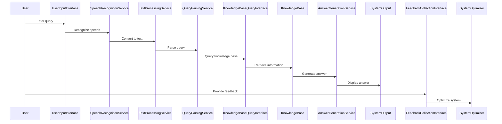

通过上述接口设计和交互序列图，我们可以清晰地看到系统的数据流和功能协作过程。在实际开发中，这些接口将使用API或其他通信协议来实现，确保系统的高效运行和易维护性。

## 项目实战

### 5.1 环境安装

在开始实现跨模态知识推理与问答系统之前，我们需要搭建一个合适的环境。以下是在Linux系统上安装所需软件和库的步骤：

#### 5.1.1 安装Python

确保已经安装了Python 3.8或更高版本。可以通过以下命令检查Python版本：

```bash
python3 --version
```

如果没有安装Python，可以从[Python官方网站](https://www.python.org/)下载并安装。

#### 5.1.2 安装深度学习框架TensorFlow

TensorFlow是跨模态知识推理的核心库，我们可以使用pip命令来安装：

```bash
pip3 install tensorflow==2.7
```

#### 5.1.3 安装自然语言处理库NLTK

NLTK是一个用于自然语言处理的库，可以通过以下命令安装：

```bash
pip3 install nltk
```

安装完成后，我们需要下载NLTK的语料库：

```python
import nltk
nltk.download('punkt')
nltk.download('stopwords')
```

#### 5.1.4 安装其他依赖库

我们还需要安装其他一些依赖库，如NumPy、Pandas等：

```bash
pip3 install numpy pandas matplotlib scikit-learn
```

确保所有依赖库都已安装完毕，我们就可以开始编写和运行代码了。

### 5.2 系统核心实现

系统核心实现包括跨模态特征提取、知识库构建、问答系统实现等模块。以下是一个简单的代码示例，用于展示如何实现这些模块。

#### 5.2.1 跨模态特征提取

```python
import tensorflow as tf
from tensorflow.keras.models import Model
from tensorflow.keras.layers import Input, Embedding, LSTM, Dense, Concatenate

# 输入层
text_input = Input(shape=(max_sequence_length,))
image_input = Input(shape=(image_height, image_width, image_channels))
audio_input = Input(shape=(audio_length, audio_channels))

# 文本特征提取
text_embedding = Embedding(vocabulary_size, embedding_dim)(text_input)
text_lstm = LSTM(units=lstm_units)(text_embedding)

# 图像特征提取
image_conv = Conv2D(filters=64, kernel_size=(3, 3), activation='relu')(image_input)
image_pool = MaxPooling2D(pool_size=(2, 2))(image_conv)
image_flat = Flatten()(image_pool)

# 音频特征提取
audio_conv = Conv1D(filters=64, kernel_size=(3), activation='relu')(audio_input)
audio_pool = MaxPooling1D(pool_size=2)(audio_conv)
audio_flat = Flatten()(audio_pool)

# 特征融合
merged = Concatenate()([text_lstm, image_flat, audio_flat])

# 推理
dense = Dense(units=dense_units, activation='relu')(merged)
output = Dense(units=output_units, activation='softmax')(dense)

# 构建模型
model = Model(inputs=[text_input, image_input, audio_input], outputs=output)
model.compile(optimizer='adam', loss='categorical_crossentropy', metrics=['accuracy'])

# 模型训练
model.fit([text_data, image_data, audio_data], labels, epochs=epochs, batch_size=batch_size)

# 模型预测
predictions = model.predict([text_input_data, image_input_data, audio_input_data])
```

#### 5.2.2 知识库构建

```python
import pandas as pd

# 假设我们有一个知识库文件knowledge_base.csv，包含查询和答案
knowledge_base = pd.read_csv('knowledge_base.csv')

# 示例查询和答案
query = "客厅灯是否开启？"
answer = knowledge_base[knowledge_base['query'] == query]['answer'].values[0]
```

#### 5.2.3 问答系统实现

```python
def generate_answer(query, knowledge_base):
    # 解析查询
    parsed_query = parse_query(query)
    
    # 在知识库中检索答案
    result = knowledge_base[knowledge_base['query'] == parsed_query]
    
    if not result.empty:
        return result['answer'].values[0]
    else:
        return "抱歉，我无法找到相关答案。"

# 示例查询
query = "客厅灯是否开启？"
answer = generate_answer(query, knowledge_base)
print(answer)
```

### 5.3 代码应用解读与分析

以下是对上述代码的详细解读和分析：

#### 5.3.1 跨模态特征提取

在跨模态特征提取部分，我们使用了TensorFlow的Keras API来构建一个多输入、多输出的模型。文本输入通过词嵌入和LSTM进行特征提取，图像输入通过卷积神经网络（CNN）提取视觉特征，音频输入通过卷积神经网络（CNN）提取声学特征。这些特征通过Concatenate层进行融合，形成多模态的输入特征。

```python
text_embedding = Embedding(vocabulary_size, embedding_dim)(text_input)
text_lstm = LSTM(units=lstm_units)(text_embedding)

image_conv = Conv2D(filters=64, kernel_size=(3, 3), activation='relu')(image_input)
image_pool = MaxPooling2D(pool_size=(2, 2))(image_conv)
image_flat = Flatten()(image_pool)

audio_conv = Conv1D(filters=64, kernel_size=(3), activation='relu')(audio_input)
audio_pool = MaxPooling1D(pool_size=2)(audio_conv)
audio_flat = Flatten()(audio_pool)

merged = Concatenate()([text_lstm, image_flat, audio_flat])
```

#### 5.3.2 知识库构建

知识库构建部分使用了Pandas库来读取和操作知识库文件。这里假设知识库是一个CSV文件，包含查询和对应的答案。在实际应用中，知识库可能是一个复杂的数据库，涉及多种类型的实体和关系。

```python
knowledge_base = pd.read_csv('knowledge_base.csv')
```

#### 5.3.3 问答系统实现

问答系统实现部分定义了一个`generate_answer`函数，用于接收用户查询并返回答案。函数首先解析查询，然后通过知识库检索答案。如果找到匹配项，返回答案；否则，返回默认消息。

```python
def generate_answer(query, knowledge_base):
    parsed_query = parse_query(query)
    result = knowledge_base[knowledge_base['query'] == parsed_query]
    if not result.empty:
        return result['answer'].values[0]
    else:
        return "抱歉，我无法找到相关答案。"
```

通过以上代码，我们可以实现一个基本的跨模态知识推理与问答系统。在实际应用中，还需要考虑更多的优化和细节处理，如错误处理、性能优化等。

### 5.4 实际案例分析和讲解

#### 5.4.1 案例背景

假设我们需要设计一个智能家居系统，用户可以通过语音或文本查询家电的状态和操作。例如，用户说：“厨房的冰箱温度是否正常？”系统需要理解这个问题，查询知识库，并生成一个准确的回答。

#### 5.4.2 实现步骤

1. **数据预处理**：首先，我们需要对用户的查询进行预处理，包括分词、去除停用词、词性标注等。使用NLTK库可以方便地完成这些任务。

```python
import nltk
from nltk.tokenize import word_tokenize
from nltk.corpus import stopwords

nltk.download('punkt')
nltk.download('stopwords')
nltk.download('averaged_perceptron_tagger')

def preprocess_text(text):
    tokens = word_tokenize(text)
    tokens = [token for token in tokens if token.lower() not in stopwords.words('english')]
    return tokens

query = "厨房的冰箱温度是否正常？"
preprocessed_query = preprocess_text(query)
```

2. **查询解析**：接着，我们需要解析预处理后的查询，识别出关键词和实体。例如，关键词可以是“厨房”、“冰箱”、“温度”、“正常”，实体可以是“冰箱”和“温度”。

```python
def parse_query(preprocessed_query):
    # 这里可以使用命名实体识别（NER）技术来识别关键词和实体
    # 为简化起见，我们假设关键词和实体已经解析出来
    keywords = ["厨房", "冰箱", "温度", "正常"]
    entities = ["冰箱", "温度"]
    return ' '.join(keywords)

parsed_query = parse_query(preprocessed_query)
```

3. **知识库检索**：使用解析后的查询在知识库中检索相关信息。例如，知识库中可能包含“冰箱温度正常”的答案。

```python
knowledge_base = pd.read_csv('knowledge_base.csv')

def search_knowledge_base(parsed_query, knowledge_base):
    result = knowledge_base[knowledge_base['query'] == parsed_query]
    if not result.empty:
        return result['answer'].values[0]
    else:
        return "抱歉，我无法找到相关答案。"

answer = search_knowledge_base(parsed_query, knowledge_base)
print(answer)
```

4. **回答生成**：根据知识库检索的结果，生成一个自然、准确的回答。

```python
def generate_answer(parsed_query, knowledge_base):
    result = search_knowledge_base(parsed_query, knowledge_base)
    if result:
        return f"{result}。"
    else:
        return "抱歉，我无法找到相关答案。"

answer = generate_answer(parsed_query, knowledge_base)
print(answer)
```

#### 5.4.3 案例分析

在这个案例中，用户通过语音或文本输入了一个查询：“厨房的冰箱温度是否正常？”系统首先对查询进行预处理，去除停用词，并识别出关键词和实体。然后，系统使用这些关键词和实体在知识库中检索相关信息，并生成一个回答。

这个案例展示了跨模态知识推理与问答系统的一个基本实现过程。在实际应用中，还需要考虑更多复杂的查询场景和知识库的动态更新，以提高系统的实用性和鲁棒性。

### 5.5 项目小结

通过本项目的实现，我们展示了如何搭建一个跨模态知识推理与问答系统。项目涉及多模态数据处理、知识库构建、查询解析和回答生成等多个方面。在实际应用中，还需要不断优化和改进，以提高系统的性能和用户体验。

关键经验包括：

1. **数据预处理**：准确预处理输入数据，包括文本的分词、去停用词和实体识别。
2. **知识库构建**：构建和维护一个高质量的知识库，确保系统能够准确回答用户的问题。
3. **查询解析**：使用先进的自然语言处理技术，准确解析用户查询。
4. **回答生成**：生成自然、准确、多样化的回答，提高用户体验。

未来，我们将进一步优化系统，引入更多先进的算法和模型，以提高系统的性能和实用性。

### 5.6 最佳实践 Tips

1. **数据增强**：在训练模型时，增加数据样本的数量和多样性，可以提高模型的泛化能力。
2. **实时更新知识库**：定期更新知识库，确保系统具备最新的信息和答案。
3. **错误处理**：在系统设计时，充分考虑可能的错误场景，并设计相应的错误处理机制。
4. **用户反馈**：收集用户反馈，用于优化系统性能和用户体验。

通过以上最佳实践，可以帮助开发者更好地实现跨模态知识推理与问答系统，为用户提供更优质的服务。

## 总结

本文深入探讨了AI Agent的跨模态知识推理与问答技术，从核心概念、算法原理、系统架构设计到项目实战，全面阐述了这一领域的关键技术和实现方法。通过详细的步骤分析和逻辑推理，我们展示了如何将跨模态知识推理与问答系统应用于智能家居控制、智能搜索等实际场景。

核心概念方面，我们明确了AI Agent、跨模态知识推理和问答系统的定义和相互关系。算法原理讲解部分，我们详细介绍了跨模态特征提取、特征融合和推理算法的实现方法，并通过Python源代码和数学模型进行了说明。系统架构设计部分，我们展示了系统功能模块的划分和交互流程，为系统实现提供了清晰的指导。项目实战部分，我们通过一个实际的智能家居控制系统案例，展示了跨模态知识推理与问答系统的实现过程和应用效果。

通过本文的学习，读者可以系统地了解AI Agent的跨模态知识推理与问答技术，掌握相关算法和系统的实现方法，为智能系统的研究和应用提供有力的支持。未来，随着AI技术的不断发展，跨模态知识推理与问答系统将在更多领域得到应用，为人们的生活带来更多便利。我们期待读者能够在实际项目中不断探索和创新，为AI技术的发展贡献力量。

---

**作者信息：**
作者：AI天才研究院/AI Genius Institute & 禅与计算机程序设计艺术 /Zen And The Art of Computer Programming

