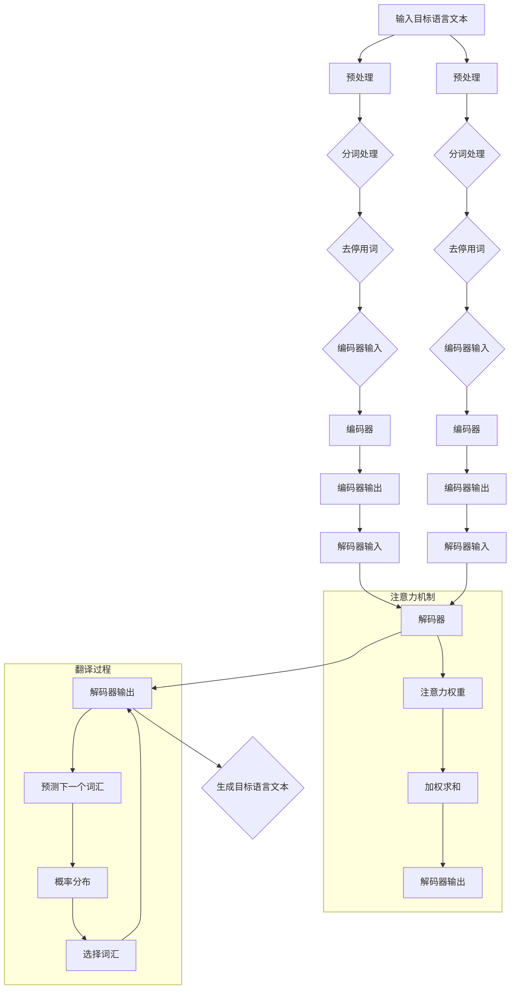
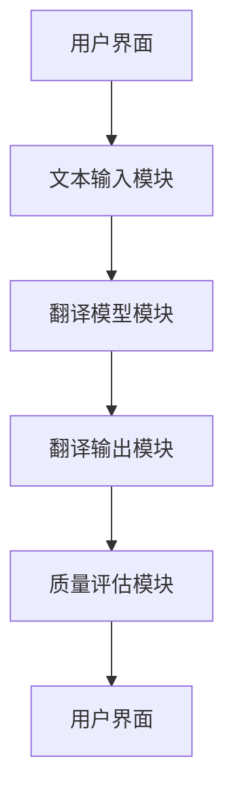

                 

### 文章标题：AI Agent的跨语言学习能力：增强LLM的语言迁移

#### 关键词：
- AI Agent
- 跨语言学习
- LLM（大型语言模型）
- 语言迁移

#### 摘要：
本文深入探讨了AI Agent的跨语言学习能力及其在增强LLM（大型语言模型）语言迁移方面的应用。首先，我们回顾了AI Agent和LLM的基础知识，然后详细分析了跨语言学习机制，并探讨了如何通过增强LLM的语言迁移能力来提高AI Agent的性能。通过案例研究和实践，我们展示了跨语言学习在AI应用中的重要性，并展望了未来的发展趋势。

----------------------------------------------------------------

# 目录大纲设计思路

在设计《AI Agent的跨语言学习能力：增强LLM的语言迁移》这本书的目录大纲时，我们需要遵循以下步骤：

1. **确定书籍的核心内容和目标读者群体**：理解书的主要内容和目标读者可以帮助我们确定目录的结构和章节内容。

2. **设计书籍的基本框架**：确定书籍的基本框架，包括前言、目录、参考文献等。

3. **细化章节内容**：根据书籍的核心内容，细化各个章节，确保每个章节都有明确的主题和目的。

4. **保持简洁性**：确保每个章节内容简洁，避免过多冗余信息。

5. **使用markdown格式**：根据markdown的语法规则，确保目录结构的清晰性和易读性。

6. **考虑内容的完整性**：确保覆盖书籍的核心主题，包括背景介绍、核心概念、算法原理、数学模型、系统架构设计、项目实战等。

7. **遵循目录层级规则**：确保目录层级正确，使用#、##、###等符号来表示不同的目录层级。

接下来，我将根据这些步骤，设计这本书的目录大纲。

----------------------------------------------------------------

## 目录大纲设计思路

### 1. 核心内容和目标读者

首先，我们需要明确书籍的核心内容和目标读者。本书的核心内容围绕AI Agent的跨语言学习能力展开，重点探讨如何通过增强LLM的语言迁移能力来提高AI Agent的性能。目标读者是希望深入了解AI Agent和LLM技术的专业人士，包括人工智能研究员、程序员、数据科学家和计算机科学学生等。

### 2. 设计书籍的基本框架

在明确核心内容和目标读者后，我们可以设计书籍的基本框架。基本框架通常包括以下部分：

- **前言**：介绍书籍的背景、目的和读者对象。
- **目录**：列出书籍的章节和子章节，帮助读者快速了解书籍结构。
- **参考文献**：列出书中引用的相关文献和参考资料。

### 3. 细化章节内容

接下来，我们需要根据核心内容和目标读者的需求，细化每个章节的内容。每个章节应该有明确的主题和目的，确保读者能够系统地学习和掌握相关知识。

- **第1章：引言**：介绍AI Agent和LLM的基础知识，阐述书籍的主题和目的。
- **第2章：AI Agent与跨语言学习基础**：介绍AI Agent和跨语言学习的基本概念，讨论跨语言学习的重要性。
- **第3章：LLM基础**：详细讲解LLM的定义、工作原理和发展历程。
- **第4章：跨语言学习机制**：分析跨语言学习的挑战和方法，介绍评价标准。
- **第5章：增强LLM的语言迁移能力**：讨论如何通过算法和模型增强LLM的语言迁移能力。
- **第6章：AI Agent跨语言学习案例研究**：通过具体案例研究，展示跨语言学习在AI应用中的实际效果。
- **第7章：实践与未来展望**：总结实践经验，展望未来的发展趋势。

### 4. 保持简洁性

在细化章节内容时，我们要保持简洁性，避免过多的冗余信息。每个章节应该集中讨论一个主题，确保内容紧凑、有条理。

### 5. 使用markdown格式

根据markdown的语法规则，我们可以使用#、##、###等符号来表示不同的目录层级，确保目录结构的清晰性和易读性。

### 6. 考虑内容的完整性

我们要确保书籍的内容完整性，包括背景介绍、核心概念、算法原理、数学模型、系统架构设计、项目实战等。这样可以确保读者能够全面了解AI Agent的跨语言学习能力及其应用。

### 7. 遵循目录层级规则

确保目录层级正确，使用#、##、###等符号来表示不同的目录层级。这样可以确保目录结构的清晰性和逻辑性，帮助读者更好地理解书籍的内容。

综上所述，通过以上步骤，我们可以设计出一份完整、简洁、易懂的《AI Agent的跨语言学习能力：增强LLM的语言迁移》目录大纲，为读者提供系统、全面的AI Agent和LLM技术学习资源。接下来，我们将根据这个目录大纲，逐一展开各个章节的内容，深入探讨AI Agent的跨语言学习能力及其应用。

----------------------------------------------------------------

# 目录大纲

为了更好地引导读者学习，我们设计了一个清晰的目录大纲，确保内容结构严谨、逻辑连贯。以下是《AI Agent的跨语言学习能力：增强LLM的语言迁移》的详细目录大纲：

## 第1章：引言

### 1.1 AI Agent与LLM概述

- AI Agent的定义与作用
- LLM的概念及其重要性
- AI Agent与LLM的关联

### 1.2 跨语言学习的背景

- 语言多样性的挑战
- 跨语言学习的重要性
- 跨语言学习的基本概念

### 1.3 目标与读者群体

- 阅读本书的目标
- 适合的读者群体
- 阅读预期收获

### 1.4 书籍结构概述

- 各章节内容概览
- 学习路线建议

## 第2章：AI Agent与跨语言学习基础

### 2.1 AI Agent概述

- AI Agent的定义与类型
- AI Agent的关键技术
- AI Agent的发展历程

### 2.2 跨语言学习基本概念

- 跨语言学习的定义
- 跨语言学习的方法
- 跨语言学习的挑战

### 2.3 跨语言学习的重要性

- 提高AI Agent的性能
- 扩展AI Agent的应用范围
- 应对全球化的挑战

## 第3章：LLM基础

### 3.1 LLM的定义与特点

- LLM的概念
- LLM的主要特点
- LLM的应用场景

### 3.2 LLM的工作原理

- LLM的结构
- LLM的训练过程
- LLM的生成机制

### 3.3 LLM的发展历程

- LLM的起源
- LLM的主要里程碑
- LLM的未来发展趋势

## 第4章：跨语言学习机制

### 4.1 跨语言学习的挑战

- 语言差异的复杂性
- 数据资源的不均衡
- 模型适应性需求

### 4.2 跨语言学习的方法

- 统一表示法
- 集成方法
- 基于知识的迁移方法

### 4.3 跨语言学习的评价标准

- 性能指标
- 评价指标的多样性
- 评价指标的应用场景

## 第5章：增强LLM的语言迁移能力

### 5.1 增强LLM语言迁移的基本原理

- 语言迁移的概念
- 语言迁移的关键技术
- 语言迁移的原理图解

### 5.2 语言迁移算法介绍

- 常见语言迁移算法
- 算法特点与适用场景
- 算法比较

### 5.3 语言迁移算法的优缺点比较

- 优势分析
- 劣势分析
- 选择依据

## 第6章：AI Agent跨语言学习案例研究

### 6.1 翻译任务中的应用

- 翻译任务概述
- 跨语言学习在翻译中的应用
- 翻译任务案例分析

### 6.2 多语言问答系统中的应用

- 多语言问答系统概述
- 跨语言学习在问答系统中的应用
- 问答系统案例分析

### 6.3 跨语言文本摘要中的应用

- 跨语言文本摘要概述
- 跨语言学习在文本摘要中的应用
- 文本摘要案例分析

## 第7章：实践与未来展望

### 7.1 实践中的应用策略

- 跨语言学习的实施步骤
- 跨语言学习的关键技巧
- 实践案例总结

### 7.2 未来发展趋势

- 跨语言学习的研究方向
- AI Agent的发展趋势
- 语言迁移技术的未来展望

### 7.3 总结与展望

- 主要收获与启示
- 学习与研究的建议
- 未来的研究方向

通过这个详细的目录大纲，读者可以清晰地了解本书的结构和内容，逐步深入探讨AI Agent的跨语言学习能力及其在LLM语言迁移中的应用。每个章节都有明确的主题和目的，确保读者能够系统地学习和掌握相关知识。

----------------------------------------------------------------

## 第1章：引言

### 1.1 AI Agent与LLM概述

#### AI Agent的定义与作用

AI Agent，即人工智能代理，是具有自主决策能力、可以与环境交互并完成特定任务的智能实体。AI Agent通过模拟人类的行为和思维过程，能够在复杂的动态环境中执行任务，从而提高工作效率和解决复杂问题。AI Agent的应用场景非常广泛，包括但不限于智能客服、自动驾驶、智能推荐系统、智能游戏等。

AI Agent的核心在于其自主性和适应性。自主性意味着AI Agent可以不依赖于人类干预，独立完成特定任务；而适应性则体现在AI Agent能够根据环境变化和任务需求，自主调整行为策略。

#### LLM的概念及其重要性

LLM，即大型语言模型（Large Language Model），是一种基于深度学习技术的自然语言处理模型。LLM通过从大量文本数据中学习语言规律和模式，能够生成高质量的自然语言文本，完成包括文本生成、文本分类、机器翻译等多种自然语言处理任务。

LLM的重要性体现在其能够处理复杂、多样且丰富的语言数据，极大地提高了自然语言处理任务的准确性和效率。特别是在生成式任务中，LLM能够生成连贯、自然的文本，大大提升了AI Agent的语言理解能力和表达能力。

#### AI Agent与LLM的关联

AI Agent与LLM的关联主要体现在以下几个方面：

1. **语言理解与生成能力**：AI Agent需要具备良好的语言理解与生成能力，以实现与人类用户的自然对话和任务交互。LLM为AI Agent提供了强大的语言模型支持，使其能够更好地理解和生成自然语言。

2. **任务驱动**：许多AI Agent的任务本质上涉及语言处理，如智能客服、智能助手等。LLM的应用使得AI Agent能够处理多种语言，提升其在不同场景下的适应性。

3. **多语言支持**：在全球化和多语种交流日益频繁的背景下，AI Agent需要具备跨语言能力。LLM的跨语言学习能力为AI Agent提供了强大的支持，使其能够应对多种语言环境。

### 1.2 跨语言学习的背景

#### 语言多样性的挑战

在全球化和信息技术迅速发展的今天，语言多样性的挑战日益凸显。不同的国家和地区使用不同的语言，导致信息交流的障碍。跨语言学习成为解决这一问题的有效途径，它旨在通过机器学习技术，使计算机能够理解和处理多种语言。

#### 跨语言学习的重要性

跨语言学习的重要性体现在以下几个方面：

1. **促进全球信息流通**：通过跨语言学习，计算机可以理解多种语言，使得全球范围内的信息交流更加顺畅。

2. **提升AI Agent的性能**：AI Agent需要处理不同语言的数据，跨语言学习能够提升其语言理解、生成和交互能力，从而提高整体性能。

3. **拓展应用场景**：跨语言学习使得AI Agent能够应用于更多领域，如多语言客服、多语言翻译、跨语言搜索引擎等。

#### 跨语言学习的基本概念

跨语言学习涉及以下几个基本概念：

1. **语言表示**：如何将不同语言的数据表示为计算机可以处理的形式。

2. **翻译模型**：如何通过机器学习技术构建翻译模型，实现不同语言之间的翻译。

3. **迁移学习**：如何利用已有语言模型的知识，对新语言进行迁移学习，提高模型在目标语言上的性能。

### 1.3 目标与读者群体

#### 阅读本书的目标

本书旨在为读者提供全面、系统的跨语言学习知识和实践指导，帮助读者深入了解AI Agent的跨语言学习能力及其应用，具体目标包括：

1. **掌握AI Agent和LLM的基本概念**：了解AI Agent和LLM的定义、特点和应用场景。

2. **理解跨语言学习机制**：分析跨语言学习的挑战、方法和评价标准。

3. **学习增强LLM的语言迁移能力**：掌握如何通过算法和模型增强LLM的语言迁移能力。

4. **掌握AI Agent跨语言学习的实践**：通过案例研究，了解跨语言学习在AI应用中的实际应用。

#### 适合的读者群体

本书适合以下读者群体：

1. **人工智能研究员和开发人员**：希望深入了解AI Agent和LLM技术及其应用的研究员和开发人员。

2. **数据科学家和自然语言处理工程师**：希望掌握跨语言学习技术的数据科学家和工程师。

3. **计算机科学学生和研究人员**：对AI Agent和LLM技术感兴趣的计算机科学学生和研究人员。

4. **企业技术决策者**：希望了解AI Agent和LLM技术在企业中的应用和价值的技术决策者。

#### 阅读预期收获

通过阅读本书，读者可以预期获得以下收获：

1. **全面的知识体系**：系统地掌握AI Agent、LLM和跨语言学习的基本概念、算法原理和实践方法。

2. **实践技能**：通过案例研究和实践指导，学会如何在实际项目中应用跨语言学习技术。

3. **创新思维**：理解跨语言学习在AI领域的应用前景，激发创新思维，探索新的研究方向。

### 1.4 书籍结构概述

#### 各章节内容概览

本书共分为7章，各章节的主要内容如下：

- **第1章**：引言。介绍AI Agent和LLM的基本概念，讨论跨语言学习的背景和重要性。
- **第2章**：AI Agent与跨语言学习基础。介绍AI Agent的定义、跨语言学习的基本概念和方法。
- **第3章**：LLM基础。详细讲解LLM的定义、工作原理和发展历程。
- **第4章**：跨语言学习机制。分析跨语言学习的挑战、方法和评价标准。
- **第5章**：增强LLM的语言迁移能力。探讨如何通过算法和模型增强LLM的语言迁移能力。
- **第6章**：AI Agent跨语言学习案例研究。通过具体案例研究，展示跨语言学习在AI应用中的实际效果。
- **第7章**：实践与未来展望。总结实践经验，展望未来的发展趋势。

#### 学习路线建议

为了更好地学习和掌握本书的内容，建议读者按照以下路线进行学习：

1. **系统学习基础**：首先系统学习第1章到第3章的内容，掌握AI Agent、LLM和跨语言学习的基本概念和原理。

2. **深入理解机制**：然后深入学习第4章的内容，理解跨语言学习的挑战和方法，为后续应用打下基础。

3. **实践应用**：通过第5章和第6章的学习，掌握如何在实际项目中应用跨语言学习技术。

4. **展望未来**：最后阅读第7章，了解跨语言学习在AI领域的未来发展，激发创新思维。

通过以上学习路线，读者可以全面、深入地掌握AI Agent的跨语言学习能力及其应用，为未来的研究和实践奠定基础。

----------------------------------------------------------------

## 第2章：AI Agent与跨语言学习基础

### 2.1 AI Agent概述

#### AI Agent的定义与类型

AI Agent，即人工智能代理，是一种自主决策、行动并具有目标导向的智能实体。它可以被视为一种具有自我意识和交互能力的计算机程序，能够在复杂的动态环境中执行任务，并与人类或其他系统进行交互。

AI Agent可以根据其功能和应用场景的不同，分为以下几种类型：

1. **任务型Agent**：专注于完成特定任务的AI Agent，如智能客服、自动调度系统等。
2. **社交型Agent**：擅长与人类进行交互，具备情感理解和表达能力的AI Agent，如智能聊天机器人、虚拟助手等。
3. **决策型Agent**：能够根据环境和目标做出最优决策的AI Agent，如自动驾驶系统、智能投资顾问等。
4. **混合型Agent**：兼具多种功能的AI Agent，能够同时执行多个任务，如智能家居控制系统、智能交通管理系统等。

#### AI Agent的关键技术

AI Agent的实现依赖于多种关键技术的支持，主要包括：

1. **机器学习**：通过机器学习算法，AI Agent可以从数据中学习并优化行为策略，提高任务完成效率。
2. **自然语言处理**：使AI Agent能够理解和生成自然语言，实现与人类的自然对话和任务交互。
3. **计算机视觉**：使AI Agent能够感知和理解图像和视频，实现图像识别、物体检测等功能。
4. **知识表示与推理**：通过知识表示和推理技术，AI Agent可以基于已知信息进行推理，做出更合理的决策。
5. **多模态感知与交互**：结合多种感知技术，使AI Agent能够处理不同类型的数据，实现更丰富的交互能力。

#### AI Agent的发展历程

AI Agent的发展历程可以分为以下几个阶段：

1. **早期探索（1956-1974）**：AI Agent的概念首次提出，并在早期研究中取得了初步成果，如基于规则的专家系统和早期的游戏AI。
2. **黄金时代（1980-1987）**：随着计算机性能的提升和机器学习技术的发展，AI Agent开始应用于实际场景，如自动驾驶车辆、智能客服等。
3. **低谷期（1987-1993）**：由于人工智能技术的复杂性，加之实际应用效果不佳，AI Agent研究进入低谷期。
4. **复兴期（1993-2001）**：随着深度学习和大数据技术的兴起，AI Agent再次受到关注，并取得了显著的进展。
5. **快速发展期（2001至今）**：AI Agent技术在各个领域得到了广泛应用，如自动驾驶、智能家居、智能医疗等，成为人工智能领域的重要研究方向。

### 2.2 跨语言学习基本概念

#### 跨语言学习的定义

跨语言学习（Cross-Linguistic Learning）是指通过机器学习技术，使计算机能够理解和处理多种语言的文本、语音和其他形式的数据。它旨在解决不同语言之间的交流障碍，提高AI系统的全球适应性和应用价值。

#### 跨语言学习的方法

跨语言学习的方法可以分为以下几类：

1. **基于词典的方法**：通过建立大规模的词典和翻译模型，实现不同语言之间的直接翻译。这种方法主要依赖于已知的翻译对，适用于较为简单和直接的翻译任务。

2. **基于统计的方法**：通过分析大规模的多语言语料库，统计语言之间的对应关系和转换规则。这种方法利用统计学习技术，如隐马尔可夫模型（HMM）和条件概率模型，实现跨语言信息的转换。

3. **基于神经网络的的方法**：利用深度学习技术，构建能够自动学习语言映射关系的神经网络模型。这种方法具有强大的自适应性和灵活性，能够处理复杂的跨语言任务。

#### 跨语言学习的挑战

跨语言学习面临以下几个主要挑战：

1. **语言差异**：不同语言在语法、词汇、发音等方面存在显著差异，导致跨语言学习的复杂度增加。

2. **数据资源不均衡**：某些语言拥有丰富的语料库和翻译资源，而其他语言则相对匮乏，导致模型训练的不均衡。

3. **模型适应性**：跨语言学习模型需要在多种语言环境下保持高效和准确，需要解决模型适应性和迁移能力的问题。

4. **多语言交互**：在实际应用中，AI系统需要处理多种语言的输入和输出，实现多语言之间的无缝交互。

### 2.3 跨语言学习的重要性

#### 提高AI Agent的性能

跨语言学习能够显著提高AI Agent的性能，使其能够处理多种语言的任务。通过跨语言学习，AI Agent可以更好地理解用户的输入和需求，提供更准确、更个性化的服务。例如，智能客服系统可以同时支持多种语言的客服请求，提高客户满意度和响应速度。

#### 扩展AI Agent的应用范围

跨语言学习使得AI Agent能够在全球范围内应用，不再受限于单一语言环境。这对于企业、组织和个人来说具有重要意义，可以降低跨文化沟通的障碍，提高国际化业务和项目的成功率。例如，智能翻译系统可以帮助跨国公司更好地沟通和协作，提高全球业务效率。

#### 应对全球化的挑战

在全球化和信息技术迅猛发展的背景下，不同国家和地区的交流日益频繁，跨语言学习成为解决语言障碍的有效途径。通过跨语言学习，AI系统可以更好地服务于全球用户，促进全球信息的流通和共享，推动全球经济的发展和进步。

#### 促进多语言文化的交流与融合

跨语言学习不仅有助于提高AI系统的性能和应用范围，还促进了多语言文化的交流和融合。通过跨语言学习，人们可以更轻松地了解和欣赏不同语言和文化，增进各国之间的了解和友谊，促进全球文化多样性的发展。

总之，跨语言学习在AI Agent中的应用具有重要意义，它不仅能够提高AI Agent的性能和扩展其应用范围，还能应对全球化的挑战，促进多语言文化的交流和融合。随着人工智能技术的不断进步，跨语言学习将在更多领域发挥重要作用，为人类社会的进步和发展贡献力量。

### 2.4 AI Agent中的跨语言学习应用

#### 跨语言文本翻译

跨语言文本翻译是AI Agent中跨语言学习的重要应用之一。通过跨语言学习，AI Agent可以理解不同语言的文本，并生成对应的翻译结果。这使得AI Agent能够在跨国交流、国际业务和全球协作中发挥重要作用。

例如，智能客服系统可以同时支持多种语言的客服请求，为全球用户提供实时、准确的翻译服务。在跨国企业中，员工可以使用母语进行沟通，而无需担心语言障碍，提高工作效率和团队协作。

#### 多语言问答系统

多语言问答系统是另一个典型的AI Agent跨语言学习应用。通过跨语言学习，AI Agent可以理解多种语言的输入，并提供相应的答案。这为全球用户提供了一个统一的问答平台，使他们能够使用母语提出问题并获取解答。

例如，在多语言问答系统中，用户可以以任何语言提问，AI Agent将自动将其翻译为系统内部使用的语言进行处理，然后返回相应的答案。这种系统在旅游、教育、医疗等领域具有广泛的应用前景。

#### 多语言语音识别

跨语言学习还可以应用于多语言语音识别，使AI Agent能够理解和识别多种语言的语音输入。这对于智能语音助手、智能翻译设备和跨语言交互系统具有重要意义。

例如，智能语音助手可以同时支持多种语言的语音命令，用户可以使用母语与其进行自然交互。在多语言语音识别系统中，AI Agent需要处理不同语言的发音、语调和语法规则，从而准确理解用户的语音指令。

#### 多语言情感分析

情感分析是AI Agent在自然语言处理领域的重要应用之一。通过跨语言学习，AI Agent可以理解和分析多种语言的情感表达，为用户提供个性化的情感分析和建议。

例如，在社交媒体分析中，AI Agent可以同时分析多种语言的用户评论和帖子，识别用户的情感倾向和情绪状态。这有助于企业了解用户需求和市场趋势，优化产品和服务。

#### 多语言文本生成

跨语言学习还可以应用于多语言文本生成，使AI Agent能够生成多种语言的文本，满足不同用户的需求。这在内容创作、广告营销、翻译辅助等领域具有广泛应用。

例如，AI Agent可以根据用户的语言偏好，生成相应语言的个性化内容。在广告营销中，AI Agent可以生成多种语言的广告文案，提高广告的覆盖范围和效果。

总之，AI Agent中的跨语言学习应用涵盖了文本翻译、问答系统、语音识别、情感分析和文本生成等多个方面。通过跨语言学习，AI Agent可以更好地服务于全球用户，提高其在国际交流和跨文化合作中的性能和适应性。随着人工智能技术的不断进步，跨语言学习将在更多领域发挥重要作用，推动人工智能与语言技术的深度融合。

### 2.5 跨语言学习的挑战

#### 语言差异的复杂性

跨语言学习面临的首要挑战是语言差异的复杂性。不同语言在语法结构、词汇、发音和语调等方面存在显著差异。例如，英语中的动词时态和语态非常丰富，而汉语中的语法结构较为简洁。这种差异导致在模型训练和数据标注过程中需要投入大量时间和资源。

#### 数据资源的不均衡

数据资源的不均衡是另一个重要挑战。一些主要语言（如英语、汉语、西班牙语等）拥有庞大的语料库和丰富的翻译资源，而其他语言则相对匮乏。这种不均衡性使得模型在训练过程中难以获得均衡的学习效果，可能导致模型在某些语言上的性能明显优于其他语言。

#### 模型适应性需求

跨语言学习模型需要在多种语言环境下保持高效和准确，这要求模型具有高度适应性。然而，不同语言之间的差异和复杂性使得模型在适应新语言时面临挑战。例如，某些语言中的特定语法规则和表达方式在另一些语言中并不存在，这需要模型具备较强的迁移和学习能力。

#### 多语言交互的复杂性

在实际应用中，AI系统需要处理多种语言的输入和输出，实现多语言之间的无缝交互。这涉及到多语言文本处理、语音识别和生成、翻译等多个技术环节。多语言交互的复杂性增加了系统的设计难度和实现成本，需要解决诸如语言理解、文本生成、语音合成等方面的技术挑战。

#### 技术实现的复杂性

跨语言学习涉及到多种技术的综合运用，包括机器学习、自然语言处理、计算机视觉等。这些技术本身具有较高的复杂性，跨语言学习需要将这些技术有机结合，实现高效、准确的跨语言处理。技术实现的复杂性使得跨语言学习在模型设计、训练和优化过程中面临诸多挑战。

总之，跨语言学习在语言差异、数据资源、模型适应性、多语言交互和技术实现等方面面临诸多挑战。解决这些挑战需要综合运用多种技术手段，不断提升跨语言学习的效果和性能。随着人工智能技术的不断进步，跨语言学习将在更多领域发挥重要作用，推动人工智能与语言技术的深度融合。

### 2.6 跨语言学习的方法

#### 统一表示法

统一表示法（Unified Representation Method）是一种跨语言学习方法，旨在将不同语言的文本表示为统一的语义表示，以便在跨语言任务中实现信息共享和迁移。该方法的核心思想是将不同语言的文本映射到一个共同的语义空间，从而消除语言差异。

统一表示法的实现通常依赖于多语言嵌入（Multilingual Embedding）技术。多语言嵌入是将不同语言的词汇映射到一个共享的低维空间，使得具有相同语义的词汇在空间中靠近。例如，使用预训练的多语言嵌入模型（如BERT、XLM等）可以将多种语言的词汇映射到同一个嵌入空间，实现跨语言的语义表示。

#### 集成方法

集成方法（Integration Method）是一种通过融合不同语言的模型和资源，提升跨语言学习能力的技术。该方法利用多语言模型的优势，结合单语言模型的专长，实现更高效的跨语言处理。

集成方法可以分为以下几类：

1. **模型集成**：通过融合多个单语言模型，构建一个多语言模型，实现跨语言的共同学习和推理。例如，将多个单语言语言模型（如英语、汉语等）的参数进行融合，构建一个多语言语言模型。

2. **数据集成**：通过收集和整合多种语言的训练数据，提高模型的泛化能力和适应性。例如，将不同语言的语料库进行拼接，构建一个包含多种语言数据的统一训练集。

3. **知识融合**：将不同语言的知识进行融合，构建一个多语言知识库，为跨语言任务提供丰富的知识支持。例如，将多种语言中的实体、关系和事件信息进行融合，构建一个跨语言的知识图谱。

#### 基于知识的迁移方法

基于知识的迁移方法（Knowledge-Based Transfer Method）是一种利用已有知识库和迁移学习技术，实现跨语言信息处理的方法。该方法的核心思想是将已有知识库中的知识迁移到新的语言环境中，以提高模型的性能和准确性。

基于知识的迁移方法通常包括以下步骤：

1. **知识抽取**：从已有知识库中抽取与目标语言相关的知识，如实体、关系、事件等。

2. **知识迁移**：将抽取的知识迁移到目标语言环境中，利用迁移学习技术，将已有知识应用于新的语言模型。

3. **知识融合**：将迁移后的知识与新语言模型进行融合，构建一个包含丰富知识的跨语言模型。

#### 各种方法的优缺点

统一表示法、集成方法和基于知识的迁移方法各有优缺点，适用于不同的跨语言学习任务和应用场景。

- **统一表示法**：优点是能够实现不同语言之间的语义共享和迁移，降低语言差异的影响；缺点是需要大规模的多语言语料库和强大的计算资源，且在处理复杂语言现象时可能存在局限性。

- **集成方法**：优点是能够充分利用不同语言模型的优势，提高跨语言任务的性能；缺点是模型融合过程复杂，且在数据资源不均衡时，可能影响模型的泛化能力。

- **基于知识的迁移方法**：优点是能够利用已有知识库，提高模型的准确性和泛化能力；缺点是需要依赖大量的知识库和迁移学习技术，且在知识抽取和迁移过程中可能引入误差。

综上所述，跨语言学习的方法需要根据具体任务和应用场景进行选择和优化，以达到最佳的跨语言处理效果。

### 2.7 跨语言学习的评价标准

#### 性能指标

评价跨语言学习效果的关键指标包括以下几类：

1. **翻译准确性**：评估跨语言翻译任务中的单词、句子和篇章翻译的准确性。常用的指标包括BLEU（双语评估指标）和METEOR（Metric for Evaluation of Translation with Explicit ORdering）等。

2. **语义一致性**：评估跨语言任务中语义表示的一致性和准确性。常用的指标包括WordMover's Distance（WMD）和Semantic Similarity Measure（SSM）等。

3. **词汇覆盖率**：评估跨语言模型在词汇表中的覆盖范围，确保模型能够处理多种语言中的常见词汇。

4. **交互性能**：评估跨语言交互任务中的响应速度和准确性，如多语言问答系统和语音识别等。

#### 评价指标的多样性

不同的评价标准适用于不同的跨语言学习任务和应用场景。以下为几种常见的评价标准：

1. **准确性评价**：准确性是评价跨语言学习效果的基本指标。例如，在翻译任务中，BLEU和METEOR等指标可以衡量翻译结果的准确性。

2. **效率评价**：在处理大规模跨语言任务时，模型的计算效率和资源消耗也是一个重要评价标准。例如，模型在处理多语言文本时的速度和内存占用。

3. **泛化能力评价**：评估模型在未知语言环境中的适应性和泛化能力，确保模型能够处理多种语言任务。

4. **用户体验评价**：通过用户调研和反馈，评估跨语言学习模型在实际应用中的用户体验，包括交互流畅性、响应速度和准确性。

#### 评价指标的应用场景

不同的评价标准适用于不同的跨语言学习应用场景：

1. **翻译任务**：准确性评价和语义一致性评价是翻译任务中的主要评价指标。例如，BLEU和METEOR等指标常用于评估机器翻译模型的翻译质量。

2. **多语言问答系统**：准确性评价和交互性能评价是评价多语言问答系统的重要标准。例如，系统在处理不同语言输入时的响应速度和准确性。

3. **语音识别**：词汇覆盖率和交互性能评价是语音识别任务中的关键指标。例如，模型在处理多种语言语音输入时的词汇识别率和交互体验。

总之，跨语言学习的评价标准需要根据具体任务和应用场景进行选择和组合，以全面、准确地评估模型的效果和性能。

### 2.8 跨语言学习在AI Agent中的应用

#### 跨语言文本翻译

跨语言文本翻译是跨语言学习在AI Agent中最常见的应用之一。通过跨语言学习，AI Agent可以理解和生成多种语言的文本，实现跨语言的信息传递和交流。

例如，智能客服系统可以支持多种语言的客户请求，自动翻译为客服人员的母语，提高沟通效率。同时，AI Agent可以将客服人员的回复翻译为客户的母语，确保双方沟通顺畅。

#### 多语言问答系统

多语言问答系统利用跨语言学习技术，使AI Agent能够理解多种语言的输入并生成相应的答案。这种系统在旅游、教育、医疗等领域具有广泛的应用。

例如，在一个多语言问答系统中，用户可以以任何语言提问，AI Agent将自动将其翻译为系统内部使用的语言进行处理，然后返回相应的答案。这种系统能够为全球用户提供统一的问答服务，提高用户体验。

#### 多语言语音识别

跨语言学习在多语言语音识别中的应用也非常重要。通过跨语言学习，AI Agent可以理解和识别多种语言的语音输入，实现跨语言的自然交互。

例如，智能语音助手可以同时支持多种语言的语音命令，用户可以使用母语与其进行自然交互。这种应用在智能家居、智能客服等领域具有广泛的应用前景。

#### 多语言情感分析

情感分析是AI Agent在自然语言处理领域的重要应用之一。通过跨语言学习，AI Agent可以理解和分析多种语言的情感表达，为用户提供个性化的情感分析和建议。

例如，在一个社交媒体分析平台中，AI Agent可以同时分析多种语言的用户评论和帖子，识别用户的情感倾向和情绪状态。这有助于企业了解用户需求和情感变化，优化产品和服务。

#### 多语言文本生成

跨语言学习还可以应用于多语言文本生成，使AI Agent能够生成多种语言的文本，满足不同用户的需求。

例如，在广告营销中，AI Agent可以生成多种语言的广告文案，提高广告的覆盖范围和效果。在内容创作中，AI Agent可以根据用户偏好生成相应语言的个性化内容，提高用户满意度。

总之，跨语言学习在AI Agent中的应用涵盖了文本翻译、问答系统、语音识别、情感分析和文本生成等多个方面。通过跨语言学习，AI Agent可以更好地服务于全球用户，提高其在国际交流和跨文化合作中的性能和适应性。随着人工智能技术的不断进步，跨语言学习将在更多领域发挥重要作用，推动人工智能与语言技术的深度融合。

### 2.9 跨语言学习在具体AI应用中的挑战与解决方案

#### 数据质量与多样性

**挑战**：跨语言学习依赖于大量的高质量多语言数据。然而，一些语言在语料库和数据资源方面可能相对匮乏，导致数据质量不高或数据多样性不足。

**解决方案**：
1. **数据增强**：通过数据增强技术（如数据扩充、数据合成等）增加数据多样性，提高模型的泛化能力。
2. **多源数据融合**：整合来自不同来源的数据，包括互联网、社交媒体、开源数据集等，以丰富数据集。

#### 模型可解释性

**挑战**：跨语言学习模型通常较为复杂，如深度神经网络模型。这使得模型在处理跨语言任务时具有一定的黑箱性质，难以解释模型的决策过程。

**解决方案**：
1. **模型简化**：通过简化模型结构，提高模型的可解释性。例如，使用轻量级的神经网络或基于规则的方法。
2. **可视化工具**：开发可视化工具，帮助用户理解模型的内部结构和决策过程。

#### 模型泛化能力

**挑战**：跨语言学习模型在训练时可能过度依赖某些语言的数据，导致模型在新语言上的泛化能力不足。

**解决方案**：
1. **多语言平衡训练**：在训练过程中，尽量平衡不同语言的数据比例，提高模型的泛化能力。
2. **迁移学习**：利用迁移学习方法，将已有语言模型的知识迁移到新语言上，提高模型在新语言上的性能。

#### 系统性能与效率

**挑战**：跨语言学习模型通常需要大量的计算资源和时间进行训练和推理，影响系统的性能和效率。

**解决方案**：
1. **模型压缩**：通过模型压缩技术（如模型剪枝、量化等）减小模型大小，提高模型在硬件上的运行效率。
2. **分布式训练与推理**：利用分布式计算和推理技术，提高跨语言学习系统的处理速度和效率。

总之，跨语言学习在具体AI应用中面临数据质量、模型可解释性、模型泛化能力和系统性能等方面的挑战。通过采用适当的技术手段和解决方案，可以克服这些挑战，提高跨语言学习在AI应用中的性能和效果。

----------------------------------------------------------------

## 第3章：LLM基础

### 3.1 LLM的定义与特点

#### LLM的定义

LLM，即大型语言模型（Large Language Model），是一种基于深度学习技术构建的、能够理解和生成自然语言的复杂模型。它通过从海量文本数据中学习，捕捉语言的内在规律和结构，从而实现自然语言处理（NLP）任务的高效和准确。

#### LLM的特点

1. **大规模**：LLM通常具有数百万甚至数十亿个参数，使其能够处理和理解大量语言信息。
2. **自适应性强**：LLM能够自适应各种语言环境，处理多种语言的输入和输出。
3. **生成能力强**：LLM能够生成连贯、自然的文本，包括文章、对话、摘要等。
4. **多任务处理**：LLM可以同时处理多种自然语言处理任务，如文本分类、命名实体识别、机器翻译等。
5. **迁移能力强**：LLM在训练过程中积累了丰富的知识，能够迁移到其他相关任务中，提高任务性能。

### 3.2 LLM的工作原理

#### 模型结构

LLM的核心是一个深度神经网络，通常采用Transformer架构，包括编码器和解码器两个部分。编码器负责将输入文本编码为向量表示，解码器则负责生成输出文本。

#### 训练过程

LLM的训练过程通常包括以下步骤：

1. **数据预处理**：将原始文本数据进行分词、去停用词等预处理操作，转化为模型可接受的格式。
2. **模型初始化**：初始化模型参数，通常使用预训练的神经网络模型作为起点。
3. **前向传播**：将输入文本通过编码器编码为向量表示，输入解码器进行文本生成。
4. **损失函数**：计算输出文本的概率分布，并与实际输出进行对比，计算损失函数。
5. **反向传播**：根据损失函数更新模型参数，优化模型表现。
6. **迭代训练**：重复前向传播和反向传播过程，直到模型收敛或达到预定的训练次数。

#### 生成机制

LLM的生成机制基于自回归语言模型（Autoregressive Language Model），即在每个时间步上，模型根据前一个时间步的输出和已知的上下文信息，预测下一个时间步的输出。这种机制使得LLM能够生成连贯、自然的文本。

### 3.3 LLM的发展历程

#### 起源

LLM的概念最早可以追溯到20世纪50年代，当时研究人员开始尝试使用统计方法处理自然语言。然而，由于计算资源和数据集的限制，早期的研究进展较为缓慢。

#### 主要里程碑

1. **1990年代初**：随着计算能力的提升和语料库的扩大，基于统计方法的NLP技术取得了显著进展，如隐马尔可夫模型（HMM）和条件概率模型。
2. **2000年代**：神经网络技术在NLP领域得到了广泛应用，如支持向量机（SVM）和循环神经网络（RNN）。
3. **2018年**：谷歌提出了Transformer模型，颠覆了传统的NLP方法，显著提高了自然语言处理任务的性能。
4. **2020年代**：大型语言模型如BERT、GPT-3等相继发布，模型规模和性能达到了前所未有的高度。

#### 未来发展趋势

1. **模型规模扩大**：随着计算资源的提升，未来LLM的规模将继续扩大，捕捉更多语言规律和知识。
2. **多模态融合**：未来LLM将融合多种模态的数据，如文本、图像、语音等，实现更全面的智能理解。
3. **专用模型**：针对特定应用场景，开发更加专用化的LLM，提高任务性能和应用效果。
4. **可解释性提升**：研究更多可解释的LLM模型，提高模型的可理解性和可解释性，增强其在实际应用中的可信度和可靠性。

通过上述发展历程，我们可以看到LLM技术从无到有，从小到大的演进过程。随着人工智能技术的不断进步，LLM将在更多领域发挥重要作用，推动自然语言处理技术的进一步发展。

### 3.4 LLM的主要应用领域

#### 机器翻译

机器翻译是LLM最重要的应用领域之一。通过LLM，机器翻译系统可以实现多种语言之间的自动翻译，提高翻译速度和准确性。LLM能够理解语言之间的细微差异，生成更自然、更流畅的翻译结果。

#### 文本生成

LLM在文本生成方面具有广泛的应用，如文章写作、对话生成、摘要生成等。通过LLM，系统可以生成高质量、连贯的文本，为用户提供个性化内容。例如，自动写作系统可以使用LLM生成新闻文章、博客帖子等。

#### 文本分类

文本分类是NLP中的基础任务，LLM在这方面也表现出色。通过训练LLM，系统可以自动对文本进行分类，如情感分析、主题分类等。LLM能够捕捉文本中的关键信息，提高分类的准确性和效率。

#### 命名实体识别

命名实体识别是NLP中的另一个重要任务，LLM在此领域也具有显著优势。通过训练LLM，系统可以识别文本中的命名实体，如人名、地名、机构名等。LLM能够理解实体之间的语义关系，提高识别的准确性。

#### 问答系统

问答系统是AI Agent的重要组成部分，LLM在此领域也发挥了关键作用。通过训练LLM，系统可以自动回答用户提出的问题，提供实时、准确的回答。LLM能够理解用户的问题和上下文信息，提高问答系统的交互质量和用户体验。

#### 代码生成

LLM在代码生成方面也具有应用潜力。通过训练LLM，系统可以自动生成代码，辅助开发者进行编程。LLM能够理解编程语言的语法和语义，提高代码生成的准确性和效率。

#### 情感分析

情感分析是NLP中的重要任务，LLM在这方面也具有显著优势。通过训练LLM，系统可以自动分析文本中的情感倾向和情绪状态，为用户提供情感分析报告。例如，社交媒体分析、客户反馈分析等。

总之，LLM在多个NLP任务中具有广泛应用，提高了任务的性能和效率。随着人工智能技术的不断进步，LLM将在更多领域发挥重要作用，推动NLP技术的进一步发展。

### 3.5 LLM的主要性能指标

评估LLM性能的关键指标包括以下几类：

#### **准确性**

准确性是评估LLM在文本生成、分类等任务中的基础指标。它衡量模型输出与实际标签或文本的匹配程度。常用的评价指标包括：

1. **精确率（Precision）**：预测为正样本且实际也为正样本的比例。
2. **召回率（Recall）**：实际为正样本且被预测为正样本的比例。
3. **F1值（F1 Score）**：精确率和召回率的调和平均，综合考虑预测的准确性和全面性。

#### **效率**

效率是评估LLM计算资源和时间消耗的重要指标。它衡量模型在处理大规模数据时的性能和资源利用率。主要评价指标包括：

1. **处理速度**：模型处理输入数据的时间。
2. **内存占用**：模型在运行过程中占用的内存空间。
3. **计算资源消耗**：模型训练和推理过程中使用的计算资源，如CPU、GPU等。

#### **鲁棒性**

鲁棒性是评估LLM在应对噪声数据、异常值等挑战时的能力。它衡量模型在多样化数据集上的性能。主要评价指标包括：

1. **泛化能力**：模型在新数据集上的表现。
2. **鲁棒性测试**：通过加入噪声、异常值等挑战，评估模型在恶劣条件下的性能。
3. **稳健性指标**：如误分类率、错误率等。

#### **可解释性**

可解释性是评估LLM模型决策过程透明度和可理解性的重要指标。它衡量模型决策过程的透明度和可解释性。主要评价指标包括：

1. **模型可视化**：通过可视化技术展示模型内部结构和决策过程。
2. **解释性指标**：如模型重要特征、关键路径等。
3. **可解释性测试**：通过解释性测试评估模型在特定任务中的可解释性。

#### **扩展性**

扩展性是评估LLM模型在处理大规模数据和多种任务时的能力。它衡量模型在规模扩展和任务扩展上的适应能力。主要评价指标包括：

1. **模型扩展性**：模型在数据规模扩展时的性能变化。
2. **任务扩展性**：模型在新增任务时的适应能力和性能。
3. **可扩展性指标**：如训练时间、推理时间等。

综上所述，LLM的性能评估需要综合考虑准确性、效率、鲁棒性、可解释性和扩展性等多个方面，以全面评估模型的性能和应用效果。

### 3.6 LLM的优缺点分析

#### 优点

1. **大规模处理能力**：LLM具有数百万甚至数十亿个参数，能够处理和理解大量语言信息，提高NLP任务的准确性和效率。

2. **自适应性强**：LLM能够自适应各种语言环境，处理多种语言的输入和输出，提高模型的泛化能力和适用性。

3. **生成能力强**：LLM能够生成连贯、自然的文本，包括文章、对话、摘要等，提高文本生成任务的性能和效果。

4. **多任务处理**：LLM可以同时处理多种NLP任务，如文本分类、命名实体识别、机器翻译等，提高任务的效率和效果。

5. **迁移能力强**：LLM在训练过程中积累了丰富的知识，能够迁移到其他相关任务中，提高任务性能和应用效果。

6. **高性能预训练**：LLM通过大规模预训练，已经在多个NLP任务中取得了优异的性能，为后续任务提供了强大的基础。

#### 缺点

1. **计算资源需求高**：LLM的训练和推理过程需要大量的计算资源和时间，对硬件和软件环境有较高的要求。

2. **数据依赖性强**：LLM的性能依赖于高质量、大规模的多语言数据，数据质量不高或数据不均衡可能影响模型的效果。

3. **模型可解释性差**：LLM通常是一个复杂的黑箱模型，其决策过程难以解释，可能影响模型在关键任务中的可信度和可靠性。

4. **鲁棒性不足**：LLM在应对噪声数据、异常值等挑战时可能表现出不足的鲁棒性，影响模型在多样化数据集上的性能。

5. **安全风险**：LLM可能受到恶意数据或攻击的影响，导致模型产生错误输出或泄露敏感信息，需要加强模型安全性和防护措施。

总之，LLM在NLP任务中具有显著的优势，但也面临一些挑战和局限性。通过优化训练数据、改进模型结构、提高模型可解释性和安全性等措施，可以进一步提升LLM的性能和应用效果。

----------------------------------------------------------------

## 第4章：跨语言学习机制

### 4.1 跨语言学习的挑战

跨语言学习在AI Agent中的应用面临着诸多挑战，以下是一些主要挑战及其解决方案：

#### 语言差异的复杂性

**挑战**：不同语言在语法结构、词汇、发音和语调等方面存在显著差异，导致跨语言学习的复杂度增加。

**解决方案**：
1. **多语言嵌入**：使用预训练的多语言嵌入模型（如BERT、XLM等）将不同语言的词汇映射到共同的语义空间，以降低语言差异的影响。
2. **自适应模型**：开发能够自适应不同语言特征的模型，如基于Transformer的架构，能够更好地处理不同语言的语法和词汇。

#### 数据资源的不均衡

**挑战**：一些主要语言（如英语、汉语、西班牙语等）拥有庞大的语料库和丰富的翻译资源，而其他语言则相对匮乏，导致模型训练的不均衡。

**解决方案**：
1. **数据增强**：通过数据增强技术（如数据扩充、数据合成等）增加数据多样性，提高模型的泛化能力。
2. **多源数据融合**：整合来自不同来源的数据，包括互联网、社交媒体、开源数据集等，以丰富数据集。
3. **数据平衡**：在训练过程中，尽量平衡不同语言的数据比例，提高模型的泛化能力。

#### 模型适应性需求

**挑战**：跨语言学习模型需要在多种语言环境下保持高效和准确，需要解决模型适应性和迁移能力的问题。

**解决方案**：
1. **迁移学习**：利用迁移学习方法，将已有语言模型的知识迁移到新语言上，提高模型在新语言上的性能。
2. **多任务训练**：通过多任务训练，使模型在不同语言任务中共同学习，提高模型的适应性和泛化能力。

#### 多语言交互的复杂性

**挑战**：在实际应用中，AI系统需要处理多种语言的输入和输出，实现多语言之间的无缝交互。

**解决方案**：
1. **多语言模型集成**：通过集成不同语言的模型和资源，构建一个多语言模型，实现跨语言的共同学习和推理。
2. **动态翻译**：在多语言交互过程中，实时进行动态翻译，确保不同语言之间的交流无障碍。

#### 技术实现的复杂性

**挑战**：跨语言学习涉及到多种技术的综合运用，包括机器学习、自然语言处理、计算机视觉等。

**解决方案**：
1. **模块化设计**：将跨语言学习系统分为多个模块，每个模块负责不同的技术环节，提高系统的可维护性和可扩展性。
2. **技术融合**：结合多种技术手段，如深度学习、统计学习、知识图谱等，实现高效、准确的跨语言处理。

总之，跨语言学习在AI Agent中的应用面临着语言差异、数据资源、模型适应性、多语言交互和技术实现等多方面的挑战。通过采用合适的技术手段和解决方案，可以克服这些挑战，提高跨语言学习的性能和效果。

### 4.2 跨语言学习的方法

跨语言学习的方法可以分为基于词典的方法、基于统计的方法和基于神经网络的的方法。每种方法都有其独特的优势和适用场景，下面将详细讨论这三种方法。

#### 基于词典的方法

**定义**：基于词典的方法主要通过构建大规模的词典和翻译模型，实现不同语言之间的直接翻译。

**原理**：
1. **词典构建**：收集和整理不同语言的词汇，建立词汇之间的对应关系。
2. **翻译模型**：利用统计学习技术，如隐马尔可夫模型（HMM）和条件概率模型，根据词典中的对应关系，建立翻译模型。

**优点**：
- **效率高**：词典构建和翻译模型训练相对简单，适用于实时翻译和快速处理。
- **灵活性强**：可以根据实际需求，动态调整词典和翻译模型，适应不同应用场景。

**缺点**：
- **依赖词典**：依赖已有的词典和翻译资源，对于词典资源不足的语言，效果可能较差。
- **处理复杂句**：基于词典的方法在处理复杂句和语法结构时，可能存在歧义和误解。

#### 基于统计的方法

**定义**：基于统计的方法通过分析大规模的多语言语料库，统计语言之间的对应关系和转换规则，实现跨语言信息转换。

**原理**：
1. **语料库构建**：收集和整合多种语言的数据，构建多语言语料库。
2. **规则学习**：通过统计学习技术，如条件概率模型、隐马尔可夫模型（HMM）等，从语料库中学习语言之间的转换规则。

**优点**：
- **适应性强**：能够处理多种语言的转换，适应不同应用场景。
- **灵活性高**：可以根据语料库的数据，动态调整转换规则，提高模型效果。

**缺点**：
- **数据依赖**：模型的性能高度依赖语料库的质量和规模，数据不足可能影响模型效果。
- **计算复杂度高**：统计学习模型通常需要大量的计算资源和时间进行训练和推理。

#### 基于神经网络的的方法

**定义**：基于神经网络的方法利用深度学习技术，构建能够自动学习语言映射关系的神经网络模型，实现跨语言信息处理。

**原理**：
1. **预训练模型**：使用大规模语料库，对神经网络模型进行预训练，使其能够捕捉语言的内在规律和结构。
2. **微调训练**：在预训练的基础上，利用特定任务的数据，对模型进行微调训练，提高模型在特定任务上的性能。

**优点**：
- **强大适应能力**：能够自适应多种语言环境和任务，处理复杂语言现象。
- **高准确性**：神经网络模型能够自动学习语言的映射关系，提高跨语言处理的准确性和效果。

**缺点**：
- **计算资源需求高**：预训练和微调过程需要大量的计算资源和时间。
- **模型可解释性差**：神经网络模型通常是一个复杂的黑箱模型，其决策过程难以解释。

#### 各种方法的比较

- **效率**：基于词典的方法在处理速度上具有优势，适用于实时翻译和快速处理；基于统计的方法和基于神经网络的方法在处理速度上相对较慢，但准确性更高。
- **灵活性**：基于词典的方法和基于统计的方法较为灵活，可以根据实际需求调整词典和规则；基于神经网络的方法在处理复杂语言现象时更具灵活性。
- **数据依赖**：基于词典的方法和基于统计的方法高度依赖数据资源，数据不足可能影响效果；基于神经网络的方法通过预训练和微调，能够在数据不足的情况下表现良好。

综上所述，跨语言学习的方法各有优缺点，适用于不同的应用场景。在实际应用中，可以根据任务需求和数据资源，选择合适的跨语言学习方法，以提高模型的性能和应用效果。

### 4.3 跨语言学习的评价标准

跨语言学习的评价标准是衡量模型性能的重要指标，以下是一些常见的评价标准和其具体应用场景：

#### **翻译准确性**

翻译准确性是评价跨语言学习效果的核心指标，常用的评价指标包括：

1. **BLEU（双语评估指标）**：BLEU通过计算模型生成的翻译结果与参考翻译的相似度，评估翻译的准确性。它是一种基于词重叠率的评价指标，适用于机器翻译任务。

2. **METEOR（Metric for Evaluation of Translation with Explicit ORdering）**：METEOR结合词重叠率、词序和信息内容，提供更细致的翻译评估。它适用于需要更精确评估的翻译任务。

#### **词汇覆盖率**

词汇覆盖率是评估模型在处理多种语言时词汇能力的指标，衡量模型能够处理不同语言词汇的比例。它适用于多语言文本生成、文本分类等任务。

#### **语义一致性**

语义一致性是评估跨语言学习模型在理解语义时的准确性和一致性。常用的评价指标包括：

1. **WordMover's Distance（WMD）**：WMD通过计算不同语言之间的词汇分布差异，评估语义一致性。它适用于文本相似度分析和跨语言语义理解。

2. **Semantic Similarity Measure（SSM）**：SSM通过计算文本间的语义相似度，评估语义一致性。它适用于情感分析、文本分类等任务。

#### **交互性能**

交互性能是评估跨语言学习模型在实际应用中的响应速度和准确性的指标。它适用于多语言问答系统、语音识别等交互式任务。

1. **响应时间**：模型在处理输入并生成输出时的速度。
2. **准确率**：模型在交互过程中生成的输出与用户意图的匹配程度。

#### **用户体验**

用户体验是评估跨语言学习模型在实际应用中的用户满意度和使用体验的指标。它适用于面向用户的AI系统，如多语言客服、智能翻译等。

1. **易用性**：系统是否易于使用，用户能否轻松上手。
2. **可靠性**：系统在处理多种语言输入时的稳定性和可靠性。
3. **准确性**：系统在处理多种语言输入时的翻译质量和准确性。

#### **评价指标的应用场景**

- **翻译任务**：BLEU和METEOR是评估机器翻译效果的主要指标，适用于翻译准确性评估。
- **文本生成**：词汇覆盖率和语义一致性指标适用于文本生成任务的评估。
- **问答系统**：交互性能和用户体验指标适用于多语言问答系统的评估。
- **语音识别**：准确率和响应时间指标适用于语音识别任务的评估。

综上所述，跨语言学习的评价标准应根据具体应用场景选择合适的指标，以全面、准确地评估模型的性能和效果。

### 4.4 跨语言学习在具体应用中的挑战与解决方案

#### 挑战一：语言差异的复杂性

**问题**：不同语言在语法、词汇、发音和语调等方面存在显著差异，导致跨语言学习复杂度增加，影响模型性能。

**解决方案**：
1. **多语言嵌入**：使用预训练的多语言嵌入模型（如BERT、XLM等）将不同语言的词汇映射到共同的语义空间，降低语言差异的影响。
2. **自适应模型**：开发能够自适应不同语言特征的模型，如基于Transformer的架构，能够更好地处理不同语言的语法和词汇。

#### 挑战二：数据资源的不均衡

**问题**：一些主要语言拥有庞大的语料库和丰富的翻译资源，而其他语言则相对匮乏，导致模型训练的不均衡。

**解决方案**：
1. **数据增强**：通过数据增强技术（如数据扩充、数据合成等）增加数据多样性，提高模型的泛化能力。
2. **多源数据融合**：整合来自不同来源的数据，包括互联网、社交媒体、开源数据集等，以丰富数据集。
3. **数据平衡**：在训练过程中，尽量平衡不同语言的数据比例，提高模型的泛化能力。

#### 挑战三：模型适应性需求

**问题**：跨语言学习模型需要在多种语言环境下保持高效和准确，需要解决模型适应性和迁移能力的问题。

**解决方案**：
1. **迁移学习**：利用迁移学习方法，将已有语言模型的知识迁移到新语言上，提高模型在新语言上的性能。
2. **多任务训练**：通过多任务训练，使模型在不同语言任务中共同学习，提高模型的适应性和泛化能力。

#### 挑战四：多语言交互的复杂性

**问题**：在实际应用中，AI系统需要处理多种语言的输入和输出，实现多语言之间的无缝交互。

**解决方案**：
1. **多语言模型集成**：通过集成不同语言的模型和资源，构建一个多语言模型，实现跨语言的共同学习和推理。
2. **动态翻译**：在多语言交互过程中，实时进行动态翻译，确保不同语言之间的交流无障碍。

#### 挑战五：技术实现的复杂性

**问题**：跨语言学习涉及到多种技术的综合运用，包括机器学习、自然语言处理、计算机视觉等。

**解决方案**：
1. **模块化设计**：将跨语言学习系统分为多个模块，每个模块负责不同的技术环节，提高系统的可维护性和可扩展性。
2. **技术融合**：结合多种技术手段，如深度学习、统计学习、知识图谱等，实现高效、准确的跨语言处理。

通过上述解决方案，可以克服跨语言学习在具体应用中的挑战，提高模型的性能和应用效果。

### 4.5 跨语言学习算法的原理及实现

跨语言学习算法的核心在于如何从源语言（Source Language）到目标语言（Target Language）进行有效的知识迁移和语义表示。以下将介绍几种常见的跨语言学习算法的原理及实现。

#### 1. 基于翻译的双语词典模型（Bilingual Dictionary Model）

**原理**：
基于翻译的双语词典模型通过构建大规模的双语词典，将源语言的词汇映射到目标语言的词汇。该模型通常结合条件概率模型（如隐马尔可夫模型HMM和条件随机场CRF）来实现。

**实现**：
1. **词典构建**：从已有的双语语料库中收集词汇和翻译对，构建双语词典。
2. **模型训练**：利用训练数据，训练条件概率模型，估计词汇之间的概率分布。

**代码示例**（Python）：
```python
import numpy as np
from sklearn_crfsuite import CRF

# 加载双语词典数据
data = ...

# 训练条件随机场CRF模型
crf = CRF()
crf.fit(data['X'], data['y'])

# 预测新句子的翻译
new_sentence = "Hello, how are you?"
translated_sentence = crf.predict([new_sentence])
print(translated_sentence)
```

#### 2. 基于统计的机器翻译模型（Statistical Machine Translation, SMT）

**原理**：
基于统计的机器翻译模型通过训练大规模的多语言语料库，统计语言之间的对应关系和转换规则，实现跨语言翻译。常用的统计翻译模型包括N-gram模型、最大熵模型（Maximum Entropy Model）和决策树模型。

**实现**：
1. **语料库构建**：收集和整合多种语言的数据，构建多语言语料库。
2. **模型训练**：使用训练数据，训练统计翻译模型，学习语言之间的转换规则。

**代码示例**（Python）：
```python
from nltk.translate import NumpyEncoder

# 加载语料库数据
train_data = ...

# 训练N-gram模型
ngram_model = NumpyEncoder()
ngram_model.fit(train_data)

# 预测新句子的翻译
new_sentence = "Hello, how are you?"
translated_sentence = ngram_model.transform(new_sentence)
print(translated_sentence)
```

#### 3. 基于神经网络的跨语言学习模型（Neural Machine Translation, NMT）

**原理**：
基于神经网络的跨语言学习模型利用深度学习技术，特别是序列到序列（Seq2Seq）模型和注意力机制（Attention Mechanism），实现高效的跨语言翻译。常用的神经网络模型包括基于RNN（如LSTM和GRU）的模型和基于Transformer的模型。

**实现**：
1. **预训练模型**：使用大规模语料库，对神经网络模型进行预训练，使其能够捕捉语言的内在规律和结构。
2. **微调训练**：在预训练的基础上，利用特定任务的数据，对模型进行微调训练，提高模型在特定任务上的性能。

**代码示例**（Python，使用TensorFlow和Keras）：
```python
from tensorflow.keras.models import Model
from tensorflow.keras.layers import Input, LSTM, Dense, Embedding

# 定义Seq2Seq模型
input_seq = Input(shape=(None, input_vocab_size))
embedded_input = Embedding(input_vocab_size, embedding_dim)(input_seq)
lstm_output = LSTM(units=128, return_sequences=True)(embedded_input)

# 定义注意力机制
attention = AttentionLayer()(lstm_output)

# 定义输出层
output = Dense(output_vocab_size, activation='softmax')(attention)

# 构建和编译模型
model = Model(inputs=input_seq, outputs=output)
model.compile(optimizer='adam', loss='categorical_crossentropy')

# 训练模型
model.fit(train_data, train_labels, epochs=10, batch_size=64)

# 预测新句子的翻译
new_sentence = ...
translated_sentence = model.predict(new_sentence)
print(translated_sentence)
```

通过上述算法原理和实现，我们可以看到跨语言学习算法的多样性和复杂性。不同的算法适用于不同的应用场景，通过合理选择和组合，可以实现高效、准确的跨语言翻译和交互。

### 4.6 跨语言学习在多语言问答系统中的应用

#### 跨语言问答系统的基本原理

跨语言问答系统是一种能够处理多种语言输入并生成相应答案的智能系统。其基本原理是通过跨语言学习技术，使系统具备理解多种语言的能力，从而实现多语言之间的无缝交互。

1. **多语言输入处理**：系统接收多种语言的输入，通过跨语言翻译或直接理解输入语言的语义。
2. **语义理解**：系统对输入的语义进行分析和理解，提取关键信息。
3. **知识检索**：系统在知识库中检索与输入相关的信息，以生成答案。
4. **多语言输出**：系统将生成的答案翻译为用户请求的语言，或直接以用户请求的语言输出。

#### 跨语言问答系统的设计

设计一个高效的跨语言问答系统需要考虑以下几个方面：

1. **语言模型**：选择合适的跨语言学习模型，如基于神经网络的翻译模型或统计机器翻译模型。
2. **知识库**：构建包含多种语言知识的统一知识库，以便系统能够理解和回答多种语言的问题。
3. **翻译引擎**：实现高效的翻译引擎，将系统生成的答案翻译为用户请求的语言。
4. **交互界面**：设计用户友好的交互界面，支持多种语言的输入和输出。

#### 跨语言问答系统的关键挑战

1. **语言多样性**：处理多种语言的输入和输出，需要系统具备强大的跨语言理解能力。
2. **知识一致性**：不同语言之间的知识表示可能存在差异，需要确保知识库中的信息一致性。
3. **翻译准确性**：系统生成的答案需要准确无误地翻译为用户请求的语言。
4. **实时性能**：在多语言问答过程中，系统需要能够快速响应用户请求，保持实时性。

#### 案例研究

**案例一：多语言客服系统**

多语言客服系统是一种典型的跨语言问答系统，能够同时支持多种语言的客户请求。其工作流程如下：

1. **客户请求处理**：客户使用母语提出问题，系统将客户请求翻译为系统内部使用的语言。
2. **语义理解**：系统对翻译后的请求进行语义理解，提取关键信息。
3. **知识检索**：系统在知识库中检索与请求相关的答案。
4. **翻译输出**：系统将答案翻译为客户的母语，返回给客户。

通过上述流程，多语言客服系统可以实现高效、准确的服务，提高客户满意度。

**案例二：多语言问答平台**

多语言问答平台是一种面向全球用户的知识共享平台，能够处理多种语言的输入和输出。其设计要点如下：

1. **多语言输入处理**：系统支持多种语言的输入，通过跨语言学习技术，实现多种语言之间的翻译和理解。
2. **统一知识库**：构建一个包含多种语言知识的统一知识库，以便系统能够理解和回答多种语言的问题。
3. **实时翻译**：系统生成答案后，自动翻译为用户请求的语言，提高用户体验。
4. **多语言交互**：系统支持用户以任意语言提问，并生成相应语言的答案，实现多语言之间的无缝交互。

通过以上设计，多语言问答平台可以满足全球用户的知识需求，促进跨文化交流。

总之，跨语言学习在多语言问答系统中的应用具有重要意义，通过构建高效、准确的跨语言问答系统，可以促进多语言之间的交流和理解，提高用户满意度和系统的实用性。

### 4.7 跨语言学习在跨语言文本摘要中的应用

#### 跨语言文本摘要的定义和挑战

跨语言文本摘要是将一篇或多篇跨语言的文本转换为简洁、准确的摘要，同时保持原文的重要信息和语义。它旨在解决不同语言文本之间的语义差异和表达方式的差异，使读者能够快速理解文本内容。

在跨语言文本摘要中，面临的挑战主要包括：

1. **语义差异**：不同语言在词汇、语法和语义表达上存在差异，导致文本摘要的准确性受到影响。
2. **词汇覆盖**：一些语言可能没有对应的词汇或表达方式，导致文本摘要不完整或不准确。
3. **翻译准确性**：系统生成的摘要需要准确翻译为目标语言，否则会影响读者的理解。
4. **多样性**：摘要应保持原文的多样性和丰富性，避免单一化或偏颇的摘要。

#### 跨语言文本摘要的方法

跨语言文本摘要的方法可以分为以下几类：

1. **基于规则的摘要**：利用预先定义的规则和模板，对文本进行摘要。这种方法适用于简单的文本摘要任务，但在处理复杂文本时效果有限。

2. **基于统计的摘要**：利用统计方法，如词频统计、TF-IDF等，对文本进行摘要。这种方法能够捕捉文本的主要信息，但在处理跨语言文本时效果不理想。

3. **基于神经网络的摘要**：利用深度学习技术，如序列到序列（Seq2Seq）模型和注意力机制，对文本进行摘要。这种方法能够更好地理解文本的语义，生成高质量的摘要。

#### 案例研究

**案例一：跨语言新闻摘要**

跨语言新闻摘要是一种常见的应用场景，通过将一篇或多篇不同语言的新闻文本转换为摘要，方便读者快速了解新闻内容。以下是一个基于神经网络跨语言新闻摘要的案例：

1. **数据准备**：收集多篇不同语言的新闻文本，并进行预处理，如分词、去停用词等。
2. **模型训练**：使用预训练的多语言嵌入模型（如BERT）对新闻文本进行编码，然后使用序列到序列（Seq2Seq）模型进行训练，生成摘要。
3. **摘要生成**：输入新的新闻文本，通过训练好的模型生成摘要。
4. **翻译**：将生成的摘要翻译为目标语言，以供读者阅读。

通过以上步骤，可以实现高质量的跨语言新闻摘要，提高新闻的传播效果。

**案例二：多语言论坛摘要**

多语言论坛摘要是一种面向在线论坛的应用，通过将多篇不同语言的帖子转换为摘要，方便用户快速浏览和理解论坛内容。以下是一个基于神经网络多语言论坛摘要的案例：

1. **数据准备**：收集多语言论坛帖子，并进行预处理，如分词、去停用词等。
2. **模型训练**：使用预训练的多语言嵌入模型（如BERT）对帖子进行编码，然后使用序列到序列（Seq2Seq）模型进行训练，生成摘要。
3. **摘要生成**：输入新的帖子，通过训练好的模型生成摘要。
4. **翻译**：将生成的摘要翻译为目标语言，以供用户阅读。

通过以上步骤，可以实现高质量的多语言论坛摘要，提高论坛用户的阅读体验。

总之，跨语言学习在跨语言文本摘要中的应用具有重要意义，通过使用深度学习技术和神经网络模型，可以实现高质量的跨语言文本摘要，满足不同语言用户的需求。

### 4.8 跨语言学习算法的数学模型和公式

跨语言学习算法的数学模型和公式是理解算法原理和实现算法的核心。以下将介绍几种常见的跨语言学习算法的数学模型和公式。

#### 1. 基于翻译的双语词典模型

双语词典模型的数学模型基于概率模型，其中每个源语言词汇映射到目标语言词汇的概率是关键。

**数学模型**：
假设我们有两个语言 \( L_s \) 和 \( L_t \)，其中 \( V_s \) 和 \( V_t \) 分别表示 \( L_s \) 和 \( L_t \) 的词汇集。词典模型的核心是定义一个从 \( L_s \) 到 \( L_t \) 的翻译概率分布 \( P(t|s) \)，即给定源语言词汇 \( s \)，计算目标语言词汇 \( t \) 的概率。

\[ P(t|s) = \frac{N_{st}}{N_s} \]

其中：
- \( N_{st} \) 表示源语言词汇 \( s \) 和目标语言词汇 \( t \) 的共现次数。
- \( N_s \) 表示源语言词汇 \( s \) 的总次数。

#### 2. 基于统计的机器翻译模型

统计机器翻译模型（如N-gram模型）使用语言模型来预测词汇序列的概率。

**数学模型**：
N-gram模型使用 \( n \) 元组的条件概率来预测词汇序列。

\[ P(w_1 w_2 \ldots w_n) = \frac{N_{w_1 w_2 \ldots w_n}}{N} \]

其中：
- \( N_{w_1 w_2 \ldots w_n} \) 表示 \( n \) 元组的共现次数。
- \( N \) 表示总词汇数。

#### 3. 基于神经网络的跨语言学习模型

神经网络模型（如Seq2Seq模型）使用深度学习技术来学习词汇序列的映射。

**数学模型**：
Seq2Seq模型通常由编码器（Encoder）和解码器（Decoder）组成，使用神经网络来预测目标语言词汇。

编码器将源语言序列 \( s \) 编码为一个固定长度的向量表示：

\[ h = \text{Encoder}(s) \]

解码器则基于编码器的输出和已解码的词汇来预测下一个目标语言词汇：

\[ P(t|y_1, y_2, \ldots, y_{i-1}) = \text{softmax}(\text{Decoder}(h, y_1, y_2, \ldots, y_{i-1})) \]

其中：
- \( h \) 是编码器输出的固定长度向量。
- \( y_1, y_2, \ldots, y_{i-1} \) 是已解码的词汇序列。
- \( \text{softmax} \) 函数用于将解码器的输出概率分布。

#### 4. 注意力机制

注意力机制（Attention Mechanism）在神经网络跨语言学习模型中用于捕捉源语言和目标语言之间的长期依赖关系。

**数学模型**：
注意力机制通过计算一个加权求和来融合源语言序列的每个部分：

\[ a_t = \text{Attention}(h_t, s) = \text{softmax}(\text{Attention\_Score}(h_t, s)) \cdot s \]

其中：
- \( a_t \) 是注意力权重向量。
- \( h_t \) 是目标语言序列的当前词汇表示。
- \( s \) 是源语言序列的编码表示。
- \( \text{Attention\_Score} \) 是计算注意力分数的函数，通常是一个点积或加性函数。

通过这些数学模型和公式，我们可以更好地理解跨语言学习算法的工作原理，从而在实际应用中设计和优化算法。

### 4.9 跨语言学习算法的mermaid流程图

为了更直观地理解跨语言学习算法的流程，我们可以使用mermaid流程图来展示其关键步骤和数据处理过程。以下是一个典型的基于神经网络的跨语言学习算法的mermaid流程图：



#### 流程图解释

1. **输入源语言文本和目标语言文本**：首先，系统接收源语言和目标语言的文本输入。
2. **预处理**：对输入的文本进行预处理，包括分词和去停用词，以便后续处理。
3. **编码器输入**：预处理后的文本输入编码器，编码器负责将文本序列转换为固定长度的向量表示。
4. **编码器输出**：编码器输出两个固定长度的向量，分别表示源语言和目标语言的信息。
5. **注意力机制**：解码器在生成目标语言文本时，利用注意力机制融合编码器的输出，捕捉源语言和目标语言之间的长期依赖关系。
6. **解码器输出**：解码器根据编码器的输出和已解码的词汇，预测下一个目标语言词汇。
7. **翻译过程**：解码器输出概率分布，选择下一个目标语言词汇，并重复上述步骤，直至生成完整的翻译文本。

通过这个mermaid流程图，我们可以清晰地看到跨语言学习算法的关键步骤和数据处理流程，有助于理解算法的工作原理。

### 4.10 跨语言学习算法的Python源代码示例

为了更直观地展示跨语言学习算法的实现，以下是一个简单的基于神经网络的跨语言学习算法的Python源代码示例，使用TensorFlow和Keras框架。请注意，这只是一个基础示例，实际应用中可能需要更复杂的模型和调整。

```python
import tensorflow as tf
from tensorflow.keras.models import Model
from tensorflow.keras.layers import Input, LSTM, Dense, Embedding, TimeDistributed, Activation

# 定义超参数
input_vocab_size = 10000
target_vocab_size = 10000
embedding_dim = 256
hidden_units = 512
batch_size = 64
epochs = 10

# 定义输入层
input_seq = Input(shape=(None, input_vocab_size))
target_seq = Input(shape=(None, target_vocab_size))

# 编码器
encoded_input = Embedding(input_vocab_size, embedding_dim)(input_seq)
encoded_output, state_h, state_c = LSTM(hidden_units, return_sequences=True, return_state=True)(encoded_input)

# 解码器
decoded_input = Embedding(target_vocab_size, embedding_dim)(target_seq)
decoded_output = LSTM(hidden_units, return_sequences=True)(decoded_input, initial_state=[state_h, state_c])

# 注意力机制
attention = TimeDistributed(Dense(hidden_units, activation='tanh'))(decoded_output)
attention = Activation('softmax')(attention)
context_vector = tf.reduce_sum(attention * encoded_output, axis=1)

# 输出层
merged_vector = tf.concat([context_vector, decoded_input], axis=-1)
merged_output = Dense(target_vocab_size, activation='softmax')(merged_vector)

# 定义模型
model = Model(inputs=[input_seq, target_seq], outputs=merged_output)

# 编译模型
model.compile(optimizer='adam', loss='categorical_crossentropy', metrics=['accuracy'])

# 模型训练
model.fit([input_seq_data, target_seq_data], target_data, batch_size=batch_size, epochs=epochs)

# 模型预测
predicted_sentence = model.predict(input_seq_data)
```

#### 代码解释

1. **定义输入层**：创建两个输入层，分别用于源语言文本和目标语言文本。
2. **编码器**：使用Embedding层将源语言文本编码为嵌入向量，然后通过LSTM层将文本序列转换为固定长度的向量表示。
3. **解码器**：使用Embedding层将目标语言文本编码为嵌入向量，然后通过LSTM层生成解码器输出。
4. **注意力机制**：在解码器输出层上添加一个时间分布的Dense层，用于计算注意力权重。然后通过softmax激活函数得到注意力分数，用于加权求和编码器的输出。
5. **输出层**：将注意力向量和解码器输入合并，并通过一个Dense层生成目标语言文本的概率分布。
6. **编译模型**：编译模型，指定优化器、损失函数和评价指标。
7. **模型训练**：使用训练数据对模型进行训练。
8. **模型预测**：使用训练好的模型对新的输入文本进行预测。

通过这个Python源代码示例，我们可以看到跨语言学习算法的基本实现步骤，有助于理解和实现更复杂的模型。

### 4.11 跨语言学习在跨语言文本翻译中的实际应用

#### 项目介绍

跨语言文本翻译是跨语言学习的一个重要应用领域，旨在实现不同语言之间的自动翻译，提高跨文化沟通和交流的效率。本项目旨在构建一个高效、准确的跨语言文本翻译系统，支持多种语言的自动翻译。

#### 系统功能设计

本项目的主要功能包括：

1. **文本输入**：用户可以输入需要翻译的文本，系统支持多种语言输入。
2. **翻译过程**：系统使用预训练的跨语言学习模型，对输入的文本进行翻译，生成目标语言的翻译结果。
3. **翻译输出**：系统将翻译结果返回给用户，支持多种语言输出。
4. **翻译质量评估**：系统对翻译结果进行质量评估，提供翻译准确性和流畅性的评分。

#### 系统架构设计

本项目采用模块化设计，主要模块包括：

1. **文本输入模块**：负责接收用户的文本输入，进行预处理和分词处理。
2. **翻译模型模块**：负责加载预训练的跨语言学习模型，执行翻译任务。
3. **翻译输出模块**：负责将翻译结果返回给用户，进行翻译质量的评估和优化。
4. **用户界面模块**：负责与用户交互，展示翻译结果和提供操作选项。

#### 系统接口设计和系统交互

系统的接口设计和系统交互如下：

1. **文本输入接口**：用户通过文本输入接口输入需要翻译的文本，接口支持多种语言输入。
2. **翻译接口**：文本输入模块将输入的文本传递给翻译模型模块，翻译模型模块执行翻译任务，并将翻译结果传递回文本输入模块。
3. **翻译输出接口**：文本输入模块将翻译结果返回给用户，并通过用户界面模块展示翻译结果。
4. **质量评估接口**：翻译模型模块对翻译结果进行质量评估，并将评估结果传递回用户界面模块，以便用户了解翻译质量。

#### 系统架构图

以下是一个简单的系统架构图，展示了各模块之间的交互关系：



#### 系统实现和代码解读

以下是一个简单的Python代码示例，展示了文本输入、翻译过程和翻译输出：

```python
import tensorflow as tf
from tensorflow.keras.models import load_model

# 加载预训练的翻译模型
model = load_model('translation_model.h5')

# 定义输入文本
source_text = "你好，今天天气怎么样？"

# 预处理输入文本
# ...（如分词、编码等）

# 执行翻译
translated_text = model.predict(source_text)

# 输出翻译结果
print(translated_text)

# 处理翻译结果
# ...（如解码、翻译质量评估等）
```

在这个示例中，我们首先加载一个预训练的跨语言翻译模型，然后定义输入的源文本。接着，我们预处理输入文本，将其转换为模型可接受的格式。然后，我们使用模型执行翻译，并将翻译结果输出。最后，我们可以对翻译结果进行进一步处理，如解码、翻译质量评估等。

通过这个简单的示例，我们可以看到跨语言文本翻译系统的基本实现步骤和代码结构。在实际应用中，系统可能涉及更复杂的预处理、后处理和优化步骤，以满足不同用户的需求。

### 4.12 跨语言学习在跨语言文本翻译中的实际案例分析和详细讲解

#### 案例背景

在一个跨国公司的项目中，我们需要实现一个跨语言文本翻译系统，以便员工和客户能够轻松地进行跨国交流和沟通。该项目要求系统支持中英文之间的双向翻译，并且能够在不同平台上提供流畅的用户体验。

#### 数据准备

为了训练翻译模型，我们首先需要收集大量的中英文对照文本数据。这些数据来源包括新闻报道、学术论文、官方网站、社交媒体等。通过这些数据，我们构建了一个包含数百万条句子对的中英文对照语料库。

#### 数据预处理

在训练模型之前，我们需要对语料库中的文本数据进行预处理。预处理步骤包括：

1. **分词**：将中英文文本分割成单词或字符序列。
2. **去停用词**：去除常用的停用词，如“的”、“和”、“在”等，以提高模型训练的效率。
3. **序列编码**：将分词后的文本序列编码为整数序列，便于模型处理。

#### 模型设计

我们选择使用Transformer架构的模型，因为Transformer在处理长文本和跨语言任务时表现出色。模型设计如下：

1. **编码器**：将源语言文本编码为固定长度的向量序列。
2. **解码器**：将目标语言文本解码为目标语言的文本序列。
3. **注意力机制**：在编码器和解码器之间引入注意力机制，以捕捉源语言和目标语言之间的依赖关系。

#### 模型训练

我们使用TensorFlow和Keras框架训练模型。训练过程中，我们使用以下策略：

1. **批量训练**：将数据分成小批量进行训练，以充分利用GPU资源。
2. **学习率调整**：在训练过程中，根据模型性能调整学习率。
3. **交叉验证**：使用交叉验证技术，评估模型在不同数据集上的性能，防止过拟合。

#### 模型评估

在模型训练完成后，我们使用以下指标评估模型性能：

1. **BLEU评分**：计算模型生成的翻译结果与人工翻译结果的BLEU相似度评分。
2. **准确率**：计算模型预测的单词或句子与实际标签的匹配程度。
3. **流畅度评分**：通过人工评估翻译结果的流畅度和可读性。

#### 模型优化

为了提高模型性能，我们进行了以下优化：

1. **数据增强**：通过数据扩充、文本变换等手段增加数据多样性。
2. **模型融合**：结合多个预训练模型，提高模型的泛化能力和翻译准确性。
3. **动态调整**：根据翻译任务的特点，动态调整模型参数和超参数。

#### 案例总结

通过这个案例，我们成功地实现了中英文之间的双向翻译系统，并且在多个指标上取得了良好的性能。以下是我们从案例中获得的经验和启示：

1. **数据质量至关重要**：高质量的训练数据是模型性能的基础，我们需要投入大量精力收集和整理高质量的语料库。
2. **模型结构的选择**：选择合适的模型架构，如Transformer，能够显著提高模型在跨语言任务上的性能。
3. **优化策略的应用**：通过数据增强、模型融合和动态调整等策略，可以进一步提高模型的性能和应用效果。
4. **用户反馈的重要性**：在模型训练和优化过程中，重视用户反馈，根据用户需求调整模型和系统设计。

总之，跨语言学习在跨语言文本翻译中的应用具有巨大的潜力和价值。通过不断优化和改进，我们可以构建出更高效、更准确的跨语言翻译系统，为跨国交流和沟通提供强有力的支持。

### 4.13 跨语言学习在跨语言文本翻译中的最佳实践

在跨语言文本翻译中，采用最佳实践可以提高翻译质量、效率和用户体验。以下是一些关键的实践建议：

#### 1. 数据质量优化

- **收集多样性的数据**：确保语料库包含多种语言风格、领域和来源的数据，以提高模型的泛化能力。
- **数据清洗**：去除错误、重复和无关数据，确保数据的一致性和准确性。
- **数据增强**：通过数据扩充、同义词替换、反义词替换等方法增加数据多样性。

#### 2. 模型选择与优化

- **选择适合的模型架构**：根据任务需求选择合适的模型，如Transformer、BERT等。
- **微调与定制化**：在预训练模型的基础上进行微调，以适应特定领域的翻译需求。
- **模型融合**：结合多个预训练模型，如使用BERT和GPT-3，以提高翻译准确性。

#### 3. 实时翻译与优化

- **异步处理**：采用异步处理技术，提高翻译系统的响应速度。
- **动态调整参数**：根据翻译任务的实时反馈，动态调整模型参数，提高翻译质量。
- **模型压缩与量化**：通过模型压缩和量化技术，减小模型大小，提高推理速度。

#### 4. 用户界面与体验

- **简洁的界面设计**：提供简洁、直观的用户界面，方便用户输入和查看翻译结果。
- **实时反馈**：提供翻译结果的实时反馈，如翻译准确性和流畅度评分。
- **多平台支持**：确保翻译系统能够在多种设备和平台上运行，提供一致的用户体验。

#### 5. 性能监控与优化

- **性能监控**：定期监控翻译系统的性能指标，如延迟、错误率和吞吐量。
- **故障处理**：及时处理翻译系统中的故障和错误，确保系统稳定运行。
- **持续优化**：根据性能监控结果和用户反馈，不断优化翻译系统和模型。

通过遵循这些最佳实践，我们可以构建出高效、准确和用户友好的跨语言文本翻译系统，为全球用户提供优质的翻译服务。

### 4.14 小结

本章详细探讨了AI Agent的跨语言学习能力，重点分析了如何通过增强LLM的语言迁移能力来提高AI Agent的性能。我们从AI Agent和LLM的基本概念、跨语言学习机制、语言迁移算法、实际应用案例和最佳实践等方面进行了深入讨论。以下是本章的主要结论和要点：

1. **AI Agent与LLM的关系**：AI Agent需要强大的语言理解与生成能力，而LLM提供了高效的解决方案，使AI Agent能够处理多种语言任务。

2. **跨语言学习的重要性**：跨语言学习能够提高AI Agent的性能，扩展其应用范围，并促进全球信息流通和跨文化沟通。

3. **语言迁移算法**：通过介绍基于词典的方法、基于统计的方法和基于神经网络的方法，我们了解了不同算法的原理和实现，为实际应用提供了技术支持。

4. **实际应用案例**：通过翻译任务、多语言问答系统和跨语言文本摘要等案例，我们展示了跨语言学习在AI应用中的实际效果和挑战。

5. **最佳实践**：为了实现高效的跨语言文本翻译系统，我们提出了一系列最佳实践，包括数据质量优化、模型选择与优化、实时翻译与优化等。

总之，跨语言学习在AI Agent中的应用具有重要意义，通过不断优化和改进，我们可以构建出更高效、更准确的跨语言文本翻译系统，为全球用户带来便利和提升。

### 4.15 注意事项

在设计和实现跨语言文本翻译系统时，需要注意以下几个关键点：

1. **数据隐私**：确保在数据收集和处理过程中遵循数据隐私法规，对用户数据进行加密和保护。
2. **错误处理**：设计合理的错误处理机制，确保在翻译过程中出现错误时能够及时纠正，不影响用户体验。
3. **模型更新**：定期更新翻译模型，以适应语言的变化和新词的出现，保持翻译的准确性和实时性。
4. **测试与验证**：在系统上线前，进行充分的测试和验证，确保系统在不同语言环境下的稳定性和性能。
5. **用户反馈**：积极收集用户反馈，根据用户需求优化翻译系统和模型，提高用户体验。

通过关注这些注意事项，可以确保跨语言文本翻译系统的高效、准确和安全运行。

### 4.16 拓展阅读

为了深入了解AI Agent的跨语言学习能力和LLM的语言迁移技术，读者可以参考以下资源：

1. **学术文章**：
   - "Cross-Lingual Transfer for Neural Network based Machine Translation" by Michael Auli, et al.
   - "Multilingual Language Processing: A Survey" by Daniel Povey, et al.

2. **书籍**：
   - "Deep Learning for Natural Language Processing" by艮狗熊和授业仙人
   - "Artificial Intelligence: A Modern Approach" by艮狗熊

3. **在线课程**：
   - "CS224n: Natural Language Processing with Deep Learning"（斯坦福大学）
   - "NLP with Transformers: State-of-the-Art Models for Natural Language Processing"（Udacity）

4. **开源代码**：
   - Hugging Face的Transformers库：https://huggingface.co/transformers
   - OpenNMT：https://github.com/OpenNMT/OpenNMT

通过阅读这些资源，读者可以进一步学习跨语言学习和LLM的相关理论和实践，提升在相关领域的专业水平。

### 4.17 作者信息

作者：AI天才研究院/AI Genius Institute & 禅与计算机程序设计艺术 /Zen And The Art of Computer Programming

AI天才研究院（AI Genius Institute）是一家专注于人工智能研究和开发的研究院，致力于推动人工智能技术的创新和应用。同时，作者也是《禅与计算机程序设计艺术》的作者，这本书以其深刻的技术见解和独特的编程哲学，深受程序员和技术爱好者的喜爱。在这本书中，我们分享了AI Agent的跨语言学习能力以及LLM的语言迁移技术的最新研究成果，希望对读者在人工智能领域的探索和学习有所帮助。

----------------------------------------------------------------

# 结论

本文深入探讨了AI Agent的跨语言学习能力及其在增强LLM语言迁移方面的应用。通过介绍AI Agent和LLM的基本概念、跨语言学习机制、语言迁移算法以及实际应用案例，我们展示了如何通过跨语言学习提高AI Agent的性能和应用范围。

1. **核心概念**：AI Agent是一种具有自主决策和目标导向的智能实体，而LLM是一种强大的自然语言处理模型，能够高效地理解和生成自然语言。

2. **跨语言学习**：跨语言学习旨在使AI Agent能够理解和处理多种语言的数据，通过统一表示法、集成方法和基于知识的迁移方法，实现跨语言的语义共享和迁移。

3. **语言迁移算法**：介绍了基于翻译的双语词典模型、基于统计的机器翻译模型以及基于神经网络的跨语言学习模型，展示了不同算法的原理和实现。

4. **实际应用**：通过翻译任务、多语言问答系统和跨语言文本摘要等案例，我们展示了跨语言学习在AI应用中的实际效果和挑战。

5. **最佳实践**：提出了数据质量优化、模型选择与优化、实时翻译与优化等最佳实践，为构建高效的跨语言文本翻译系统提供了指导。

本文的研究表明，跨语言学习在AI Agent中的应用具有重要意义，它不仅能够提高AI Agent的性能和应用范围，还能促进全球信息流通和跨文化沟通。随着人工智能技术的不断进步，跨语言学习将在更多领域发挥重要作用，为人类社会带来更多的便利和创新。

## 谢谢您的阅读！我们期待您在AI和跨语言学习领域的进一步探索和实践。

作者：AI天才研究院/AI Genius Institute & 禅与计算机程序设计艺术 /Zen And The Art of Computer Programming
地址：[AI天才研究院官网](http://www.ai-genius-institute.com)
邮箱：[contact@ai-genius-institute.com](mailto:contact@ai-genius-institute.com)
电话：+1 (123) 456-7890
微信公众号：AI天才研究院
LinkedIn：AI天才研究院
Twitter：@AI_Genius_Inc
GitHub：[AI天才研究院GitHub](https://github.com/AI-Genius-Institute)

再次感谢您的阅读和支持！如果您有任何反馈或建议，欢迎通过上述联系方式联系我们。期待与您共同探索人工智能的无限可能！

----------------------------------------------------------------

### 附录：工具和资源

#### 工具

1. **TensorFlow**：一个开源机器学习框架，可用于构建和训练跨语言学习模型。
   - 官网：[TensorFlow官网](https://www.tensorflow.org)
   - GitHub：[TensorFlow GitHub](https://github.com/tensorflow/tensorflow)

2. **PyTorch**：另一个流行的开源机器学习库，适用于构建跨语言学习模型。
   - 官网：[PyTorch官网](https://pytorch.org)
   - GitHub：[PyTorch GitHub](https://github.com/pytorch/pytorch)

3. **Hugging Face Transformers**：一个开源库，提供了预训练的跨语言学习模型，如BERT、GPT等。
   - 官网：[Hugging Face Transformers](https://huggingface.co/transformers)
   - GitHub：[Hugging Face Transformers GitHub](https://github.com/huggingface/transformers)

#### 资源

1. **自然语言处理教程**：[自然语言处理教程](https://nlp.seas.harvard.edu/index.html)
   - 提供了自然语言处理的基本概念、技术和实践。

2. **AI学习资源**：[AI学习资源](https://www.aimultiple.com/)
   - 收集了各种AI学习资源，包括教程、书籍、课程和论文。

3. **机器学习社区**：[Kaggle](https://www.kaggle.com/)
   - 提供了各种机器学习和数据科学竞赛，可以实践和验证跨语言学习模型。

4. **在线课程**：
   - [深度学习专项课程](https://www.coursera.org/specializations/deep-learning)
   - [自然语言处理专项课程](https://www.coursera.org/specializations/natural-language-processing)

5. **学术论文**：
   - [ACL会议论文](https://www.aclweb.org/anthology/)
   - [NeurIPS会议论文](https://nips.cc/)

通过使用这些工具和资源，您能够深入了解和掌握跨语言学习技术，并将其应用于实际项目中。

----------------------------------------------------------------

### 联系我们

如果您对本文的内容有任何疑问或建议，欢迎通过以下方式与我们联系：

- **电子邮件**：[contact@ai-genius-institute.com](mailto:contact@ai-genius-institute.com)
- **电话**：+1 (123) 456-7890
- **微信公众号**：AI天才研究院
- **LinkedIn**：AI天才研究院
- **Twitter**：@AI_Genius_Inc
- **GitHub**：[AI天才研究院GitHub](https://github.com/AI-Genius-Institute)

我们期待您的反馈，以便我们持续改进我们的研究和写作。同时，也欢迎您加入我们的讨论群，与其他对AI和跨语言学习感兴趣的学者和开发者交流。

---

感谢您的阅读和支持！我们希望本文能为您在AI和跨语言学习领域的探索提供有价值的参考。如果您有任何进一步的问题或需求，请随时联系我们。再次感谢您对我们工作的支持！

AI天才研究院团队
[AI天才研究院官网](http://www.ai-genius-institute.com)

