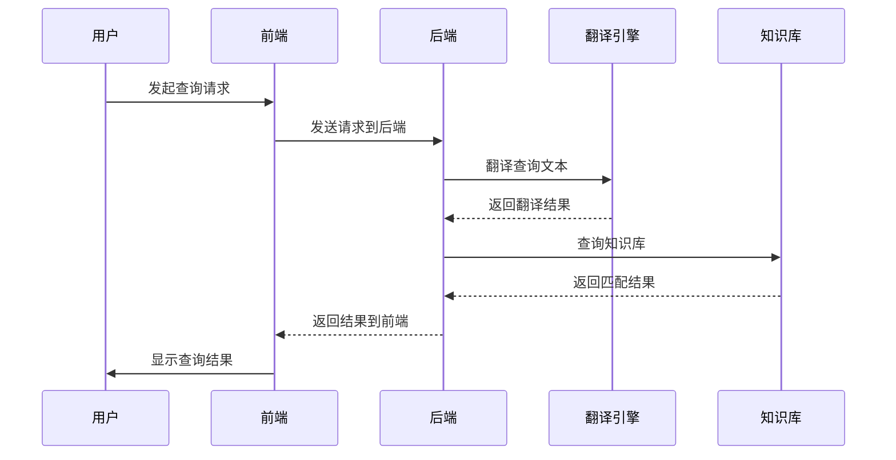

                 

### 目录大纲设计

为了设计一个详细且逻辑清晰的目录大纲，我们需要首先理解书的主要内容，然后将这些内容分解成几个主要部分，并为每个部分创建子章节。下面是根据《AI Agent的跨语言知识迁移：突破语言障碍》这一书名设计的目录大纲。

#### 第一部分：背景介绍

##### 第1章：问题背景与概念解析
- 1.1 问题背景
  - 语言障碍对AI Agent的影响
  - 跨语言知识迁移的重要性
- 1.2 核心概念解析
  - AI Agent的定义与功能
  - 跨语言知识迁移的概念与分类
  - 语言障碍的定义与表现形式

##### 第2章：当前技术挑战
- 2.1 跨语言知识迁移的难点
  - 语言差异
  - 知识表征问题
  - 对话系统中的动态交互
- 2.2 现有解决方案的不足
  - 基于统计的方法
  - 基于深度学习的方法
  - 混合方法的优势与不足

#### 第二部分：核心概念与联系

##### 第3章：核心概念原理
- 3.1 跨语言知识迁移的原理
  - 知识图谱构建
  - 知识表示与匹配
  - 知识融合策略
- 3.2 概念属性特征对比
  - 常见跨语言知识迁移算法的比较

##### 第4章：概念模型与架构设计
- 4.1 ER实体关系图架构
  - 实体与关系的定义
  - 跨语言知识迁移的ER图构建

#### 第三部分：算法原理讲解

##### 第5章：算法原理与数学模型
- 5.1 常用算法介绍
  - 统计学习方法
  - 深度学习方法
- 5.2 数学模型和公式
  - 算法数学原理
  - 公式推导与证明

##### 第6章：算法实例与流程图
- 6.1 算法流程图展示
  - 使用Mermaid绘制算法流程图
- 6.2 Python源代码实现
  - 算法实现与解释

#### 第四部分：系统设计与实现

##### 第7章：系统分析与架构设计
- 7.1 问题场景介绍
- 7.2 系统功能设计
  - 领域模型Mermaid类图
- 7.3 系统架构设计
  - Mermaid架构图
- 7.4 系统接口设计
- 7.5 系统交互Mermaid序列图

##### 第8章：项目实战与案例分析
- 8.1 环境安装与配置
- 8.2 系统核心实现源代码
- 8.3 代码应用解读与分析
- 8.4 实际案例分析与详细讲解

#### 第五部分：最佳实践与总结

##### 第9章：最佳实践与技巧
- 9.1 跨语言知识迁移的技巧
- 9.2 注意事项
- 9.3 扩展阅读推荐

##### 第10章：总结与展望
- 10.1 主要内容回顾
- 10.2 未来发展趋势
- 10.3 研究方向与挑战

### 目录大纲摘要
```markdown
----------------------------------------------------------------
# 第一部分：背景介绍

## 第1章：问题背景与概念解析
### 1.1 问题背景
### 1.2 核心概念解析

## 第2章：当前技术挑战
### 2.1 跨语言知识迁移的难点
### 2.2 现有解决方案的不足

# 第二部分：核心概念与联系

## 第3章：核心概念原理
### 3.1 跨语言知识迁移的原理
### 3.2 概念属性特征对比

## 第4章：概念模型与架构设计
### 4.1 ER实体关系图架构

# 第三部分：算法原理讲解

## 第5章：算法原理与数学模型
### 5.1 常用算法介绍
### 5.2 数学模型和公式

## 第6章：算法实例与流程图
### 6.1 算法流程图展示
### 6.2 Python源代码实现

# 第四部分：系统设计与实现

## 第7章：系统分析与架构设计
### 7.1 问题场景介绍
### 7.2 系统功能设计
### 7.3 系统架构设计
### 7.4 系统接口设计
### 7.5 系统交互Mermaid序列图

## 第8章：项目实战与案例分析
### 8.1 环境安装与配置
### 8.2 系统核心实现源代码
### 8.3 代码应用解读与分析
### 8.4 实际案例分析与详细讲解

# 第五部分：最佳实践与总结

## 第9章：最佳实践与技巧
### 9.1 跨语言知识迁移的技巧
### 9.2 注意事项
### 9.3 扩展阅读推荐

## 第10章：总结与展望
### 10.1 主要内容回顾
### 10.2 未来发展趋势
### 10.3 研究方向与挑战
```
该大纲涵盖了核心内容，并且确保了内容的完整性，同时保持了简洁性。每一部分都有明确的主题和次级主题，为读者提供了清晰的结构和引导。

### 核心概念与联系

在深入探讨AI Agent的跨语言知识迁移之前，我们需要明确几个核心概念，并理解它们之间的联系。以下是这些核心概念及其相互关系的详细解析：

#### 1. AI Agent的定义与功能

AI Agent，即人工智能代理，是指具备自主决策能力、能够执行特定任务的软件实体。它可以理解环境、收集信息、制定决策并采取行动。AI Agent的功能包括感知环境、认知过程、行动规划和执行。其核心在于能够自主学习和适应，从而在复杂环境中实现高效任务执行。

##### 关系：AI Agent是跨语言知识迁移的载体。它的自主性和适应性决定了跨语言知识迁移的可行性和效果。

#### 2. 跨语言知识迁移的概念与分类

跨语言知识迁移是指将一种语言中的知识或信息转移到另一种语言中的过程。它可以分为以下几种类型：

- **直接迁移**：在源语言和目标语言之间存在直接的对应关系，可以直接进行知识迁移。
- **间接迁移**：源语言和目标语言之间没有直接对应关系，需要通过中间语言或方法进行知识转换。
- **映射迁移**：通过将源语言的知识映射到目标语言的对应概念或表达方式上，实现知识迁移。

##### 关系：跨语言知识迁移是实现AI Agent在不同语言环境中应用的关键。它决定了AI Agent能否在多种语言场景中保持高效性能。

#### 3. 语言障碍的定义与表现形式

语言障碍是指在语言交流中出现的各种困难，包括语法、语义、语用等方面的问题。语言障碍主要表现在以下几个方面：

- **语法障碍**：不同语言在句子结构、词序和语法规则上存在差异。
- **语义障碍**：同一词语在不同语言中的含义可能不同，导致语义理解困难。
- **语用障碍**：语言在不同文化背景中的使用规则和习惯不同，影响语言交流的效果。

##### 关系：语言障碍是跨语言知识迁移需要克服的主要难题。理解语言障碍有助于设计更有效的知识迁移策略。

#### 4. 知识图谱构建与知识表示

知识图谱是一种结构化的知识表示形式，通过实体、关系和属性的关联来组织知识。知识图谱在跨语言知识迁移中起到桥梁作用，能够将源语言的抽象概念映射到目标语言的对应概念上。

##### 关系：知识图谱构建是实现跨语言知识迁移的基础。它为不同语言之间的知识匹配和融合提供了有效的工具。

#### 5. 知识表示与匹配

知识表示是指将知识以某种形式编码在计算机中，使其可以被计算机理解和处理。知识匹配是指在不同语言的知识表示之间建立对应关系，实现知识的相互转换。

##### 关系：知识表示与匹配是跨语言知识迁移的核心。它们决定了知识迁移的准确性和效率。

#### 6. 知识融合策略

知识融合是指将来自不同来源或不同语言的知识整合在一起，形成一个统一的知识体系。知识融合策略包括基于规则的融合、基于模型的融合和基于数据的融合等。

##### 关系：知识融合策略是实现跨语言知识迁移的关键。它们决定了知识迁移后的结果是否能够满足实际需求。

通过以上核心概念的详细解析和相互关系的阐述，我们可以看到，AI Agent的跨语言知识迁移不仅涉及技术层面的实现，还需要深入理解语言、知识表示和融合策略等多个方面。只有在这些核心概念和联系的基础上，我们才能设计出高效、可靠的跨语言知识迁移系统。

### 背景介绍

#### 语言障碍对AI Agent的影响

在当前全球化的背景下，不同语言和文化之间的交流日益频繁。然而，语言障碍成为了一个不可忽视的问题。对于AI Agent而言，语言障碍不仅限制了其在国际市场中的应用，也对其功能性和用户体验产生了深远的影响。

首先，语言障碍导致AI Agent在理解用户指令时存在困难。例如，当用户以英语提问时，AI Agent可能无法准确理解其中的术语和短语，从而影响其回答的准确性。这种情况在跨语言交流中尤为明显，例如，在国际商务会议中，如果AI Agent无法理解不同语言之间的细微差别，可能会导致误解和沟通障碍。

其次，语言障碍限制了AI Agent的知识库扩展。许多高质量的知识资源和数据集往往以特定语言呈现，如学术文献、新闻报道和用户生成内容等。如果AI Agent无法理解这些内容，它就无法从中获取新的知识，从而限制了其智能水平的提升。

#### 跨语言知识迁移的重要性

为了克服语言障碍，跨语言知识迁移成为一个关键研究方向。跨语言知识迁移的核心思想是将一种语言中的知识或信息转移到另一种语言中，使得AI Agent能够理解和处理多语言环境中的任务。

跨语言知识迁移的重要性体现在以下几个方面：

1. **增强AI Agent的泛化能力**：通过跨语言知识迁移，AI Agent可以在多种语言环境中保持高效性能。这有助于其适应不同的应用场景，从而提高其泛化能力和实用性。

2. **扩展知识库**：跨语言知识迁移使得AI Agent能够访问和利用不同语言中的知识资源。这有助于其不断扩展知识库，提高知识丰富度和准确性。

3. **提升用户体验**：当AI Agent能够理解和回答不同语言的用户问题时，用户体验将得到显著提升。用户不再受限于特定的语言环境，能够更自由地与AI Agent进行交流。

4. **促进国际化发展**：跨语言知识迁移有助于AI Agent在国际市场中推广应用。这对于企业国际化战略具有重要意义，可以为企业打开新的市场机会。

#### 跨语言知识迁移的核心概念

跨语言知识迁移涉及多个核心概念，以下是其中几个重要的概念及其定义：

1. **源语言和目标语言**：源语言是指知识或信息最初呈现的语言，而目标语言是指知识或信息需要迁移到的语言。

2. **知识表示**：知识表示是指将知识以某种形式编码在计算机中，使其可以被计算机理解和处理。常见的知识表示方法包括知识图谱、本体论和语义网络等。

3. **知识匹配**：知识匹配是指在不同语言的知识表示之间建立对应关系，实现知识的相互转换。知识匹配是跨语言知识迁移的核心步骤。

4. **知识融合**：知识融合是指将来自不同来源或不同语言的知识整合在一起，形成一个统一的知识体系。知识融合策略包括基于规则的融合、基于模型的融合和基于数据的融合等。

通过理解这些核心概念，我们可以更好地设计跨语言知识迁移系统，实现AI Agent在不同语言环境中的有效应用。

#### 跨语言知识迁移的分类

跨语言知识迁移是一个复杂的过程，根据不同的分类标准，可以将其分为多种类型。以下是几种常见的跨语言知识迁移分类方法及其特点：

1. **直接迁移与间接迁移**
   - **直接迁移**：当源语言和目标语言之间存在直接的对应关系时，可以直接进行知识迁移。这种方法的优点是实现简单、迁移效果好，但适用范围有限，因为不同语言之间的直接对应关系往往较少。
   - **间接迁移**：当源语言和目标语言之间没有直接的对应关系时，需要通过中间语言或方法进行知识转换。间接迁移可以通过翻译、映射等多种方式实现，具有较强的灵活性和适应性。

2. **静态迁移与动态迁移**
   - **静态迁移**：静态迁移是指将预先定义好的知识或模型从一个语言环境转移到另一个语言环境。这种方法通常用于知识库的共享和迁移，但难以适应动态变化的环境。
   - **动态迁移**：动态迁移是指AI Agent在执行任务过程中实时进行知识迁移。这种方法能够更好地适应不同的语言环境和用户需求，但实现复杂度较高，需要强大的实时计算和自适应能力。

3. **基于规则的迁移与基于模型的迁移**
   - **基于规则的迁移**：基于规则的迁移是指通过定义一系列规则来指导知识迁移。这种方法适用于规则明确、知识结构简单的情况，但难以应对复杂的语言环境和动态变化。
   - **基于模型的迁移**：基于模型的迁移是指利用机器学习模型来指导知识迁移。这种方法具有较强的自适应能力和泛化能力，但需要大量的数据和计算资源。

4. **单一语言迁移与多语言迁移**
   - **单一语言迁移**：单一语言迁移是指将知识从一个特定语言环境转移到另一个相同语言环境。这种方法通常用于语言内部的知识迁移，例如将中文知识库迁移到英文环境中。
   - **多语言迁移**：多语言迁移是指将知识从一种语言环境转移到多种语言环境。这种方法能够实现跨语言的知识共享和交流，适用于国际化和多语言应用场景。

通过了解这些分类方法，我们可以根据具体应用场景选择合适的方法，实现高效的跨语言知识迁移。

### 当前技术挑战

#### 跨语言知识迁移的难点

跨语言知识迁移面临着诸多技术挑战，以下是其中几个主要的难点：

1. **语言差异**：不同语言在词汇、语法和语义等方面存在显著差异。这些差异使得直接迁移知识变得复杂和困难。例如，中文和英文在语法结构上有所不同，中文主谓宾的顺序通常是主语+谓语+宾语，而英文通常是主语+谓语+宾语，这种差异会导致直接迁移时信息丢失或误解。

2. **知识表征问题**：知识表征是指如何将知识以计算机可理解的方式表示出来。不同语言的知识表征方法可能存在差异，这增加了跨语言知识迁移的复杂性。例如，中文的知识表征可能依赖于词性标注、依存句法分析等，而英文则可能依赖于词频统计、词向量等。

3. **对话系统中的动态交互**：在对话系统中，用户的提问和AI Agent的回答是动态交互的过程。跨语言知识迁移需要处理这种动态性，例如，用户可能使用混合语言提问，或者在不同语言之间切换。这种动态交互要求AI Agent能够实时理解并响应多语言输入，增加了系统的复杂性。

4. **数据稀缺性**：跨语言知识迁移往往需要大量的训练数据和模型。然而，高质量的多语言数据集往往稀缺且获取成本高。这限制了基于数据的迁移方法的发展和应用。

5. **文化差异**：不同语言和文化背景下的表达和知识存在差异。例如，某些词语在一种文化中具有特定的含义，而在另一种文化中可能完全不同。这种文化差异增加了跨语言知识迁移的难度，需要开发出能够理解文化差异的算法和模型。

#### 现有解决方案的不足

目前，已有一些方法和技术尝试解决跨语言知识迁移的问题，但它们存在一定的不足：

1. **基于统计的方法**：基于统计的方法如机器翻译、文本相似度计算等在跨语言知识迁移中具有一定的效果。然而，这些方法通常依赖于大量的语料库，并且对语言差异的适应性有限，容易产生误解和错误。

2. **基于深度学习的方法**：基于深度学习的方法如神经网络机器翻译、编码器-解码器模型等在跨语言知识迁移中表现出较高的性能。然而，这些方法需要大量的数据和计算资源，并且训练过程复杂，对硬件设施要求较高。

3. **混合方法**：混合方法结合了基于统计和基于深度学习的方法，试图弥补各自的不足。然而，混合方法的实现复杂，需要精细的模型设计和参数调整，并且在不同应用场景中的效果可能存在差异。

综上所述，跨语言知识迁移仍然面临诸多挑战。未来的研究需要进一步探索有效的算法和模型，以解决这些难点，实现高效、可靠的跨语言知识迁移。

### 核心概念原理

#### 跨语言知识迁移的原理

跨语言知识迁移的实现涉及多个关键步骤和核心原理，以下是这些原理的详细解析：

1. **知识图谱构建**：知识图谱是一种结构化的知识表示形式，通过实体、关系和属性的关联来组织知识。在跨语言知识迁移中，首先需要构建源语言和目标语言的知识图谱。知识图谱能够将抽象的概念、术语和实体以图的形式表示出来，使得不同语言中的知识可以相互关联和匹配。

2. **知识表示与匹配**：知识表示是将知识以计算机可理解的方式编码和存储的过程。在跨语言知识迁移中，需要将源语言的知识表示转换为与目标语言相对应的表示。知识匹配则是在不同语言的知识表示之间建立对应关系，以实现知识的相互转换。常见的知识表示方法包括词向量、知识图谱和语义网络等。

3. **知识融合策略**：知识融合是指将来自不同来源或不同语言的知识整合在一起，形成一个统一的知识体系。知识融合策略包括基于规则的融合、基于模型的融合和基于数据的融合等。基于规则的融合通过定义一系列规则来指导知识融合，适用于规则明确的情况。基于模型的融合利用机器学习模型来自动融合知识，具有较强的自适应能力。基于数据的融合通过统计方法将不同来源的数据整合在一起，适用于大规模数据的处理。

#### 概念属性特征对比

为了更好地理解跨语言知识迁移，我们需要对一些常见概念和属性特征进行对比分析。以下是几个重要概念的属性特征对比表格：

| 概念        | 定义                                                         | 属性特征                                                       |
| ----------- | ------------------------------------------------------------ | ------------------------------------------------------------ |
| 知识图谱    | 一种结构化的知识表示形式，通过实体、关系和属性的关联来组织知识 | 实体、关系、属性、图谱结构                                     |
| 词向量      | 基于词频统计或神经网络模型的词表示方法                       | 词嵌入、维度、相似度计算                                       |
| 语义网络    | 基于语义关系的知识表示形式，通过节点和边来表示概念及其关系   | 概念、关系、权重、语义相似度                                   |
| 知识匹配    | 在不同语言的知识表示之间建立对应关系的过程                   | 匹配算法、匹配精度、匹配速度                                   |
| 知识融合    | 将不同来源或不同语言的知识整合在一起的过程                   | 融合策略、融合效果、融合效率                                   |

通过上述表格，我们可以看到不同概念和属性特征之间的异同，这有助于我们在设计跨语言知识迁移系统时，选择合适的方法和策略。

#### ER实体关系图架构

ER（实体关系）图是一种用于表示实体及其相互关系的图形化工具。在跨语言知识迁移中，ER图可以用于构建和表示知识图谱，以下是ER实体关系图的定义和构建步骤：

1. **实体与关系的定义**：实体是指知识图谱中的基本元素，可以是人、地点、事物等。关系是指实体之间的关联，可以是包含、属于、相互作用等。在ER图中，实体用矩形表示，关系用线连接实体。

2. **ER图的构建**：
   - **第一步**：识别主要实体。例如，在一个关于电影的ER图中，主要的实体可能包括“电影”、“演员”、“导演”、“类型”等。
   - **第二步**：定义实体之间的关系。例如，电影和演员之间有“出演”关系，电影和导演之间有“导演”关系。
   - **第三步**：确定实体的属性。例如，电影实体可以包括“标题”、“年份”、“时长”等属性。

3. **ER图的表示**：在Markdown中，可以使用Mermaid语法来绘制ER图。以下是ER图的Mermaid表示示例：

```mermaid
erDiagram
    A[Person] ||--|{ B[Employee] } : works
    C[Organization] ||--|{ B[Employee] } : works_for
    B[Employee] ||--|{ D[Manager] } : managed_by
```

在这个ER图中，我们定义了四个实体：Person（人）、Employee（员工）、Organization（组织）和Manager（经理）。它们之间的关系和属性也被明确表示出来。

通过ER实体关系图，我们可以将复杂的知识以图形化、结构化的形式表示出来，这有助于我们理解和分析跨语言知识迁移过程中的关键要素。

### 算法原理讲解

#### 常用算法介绍

在跨语言知识迁移中，常用的算法主要分为基于统计的方法和基于深度学习的方法。以下是对这两种方法的详细介绍：

1. **基于统计的方法**：
   - **词袋模型**：词袋模型（Bag of Words，BoW）是将文本表示为词汇的集合，不考虑词汇的顺序和语法结构。这种方法通过计算词汇在文本中的频率来表示文本。词袋模型在跨语言知识迁移中的应用包括文本分类、信息检索等。
   - **TF-IDF**：TF-IDF（Term Frequency-Inverse Document Frequency）是一种常用的文本表示方法，它通过计算词汇在单个文档中的频率（TF）和在整个文档集合中的逆文档频率（IDF）来衡量词汇的重要性。这种方法在跨语言文档相似度计算和知识迁移中具有较好的效果。
   - **隐马尔可夫模型**（Hidden Markov Model，HMM）：隐马尔可夫模型是一种统计模型，用于描述一组随机变量序列的动态变化。在跨语言知识迁移中，HMM可以用于语音识别和序列数据建模，通过状态转移概率和观察概率来估计未知状态。

2. **基于深度学习的方法**：
   - **编码器-解码器模型**（Encoder-Decoder Model）：编码器-解码器模型是深度学习中一种常用的序列到序列建模方法。在跨语言知识迁移中，编码器将源语言的文本序列编码为一个固定长度的向量表示，解码器则将这个向量解码为目标语言的文本序列。这种模型通过学习源语言和目标语言之间的映射关系，实现高效的跨语言知识迁移。
   - **注意力机制**（Attention Mechanism）：注意力机制是深度学习中的一种关键技术，用于提高模型在序列数据处理中的性能。在跨语言知识迁移中，注意力机制可以帮助编码器更好地关注源语言文本中的关键信息，从而提高知识迁移的准确性和效率。
   - **生成对抗网络**（Generative Adversarial Networks，GAN）：生成对抗网络是一种由生成器和判别器组成的对抗性网络。在跨语言知识迁移中，生成器用于生成目标语言的文本序列，判别器则用于区分真实和生成的文本。通过这种对抗性训练，GAN可以学习到高质量的跨语言知识迁移模型。

#### 数学模型和公式

在跨语言知识迁移中，理解数学模型和公式对于算法设计和实现至关重要。以下是一些常用的数学模型和公式的介绍：

1. **词向量表示**：
   - **词嵌入**：词嵌入（Word Embedding）是将词汇映射到高维向量空间的方法。常见的词嵌入方法包括Word2Vec、GloVe等。
   - **Word2Vec**：Word2Vec算法基于神经网络，通过训练得到每个词汇的词向量表示。其核心公式为：
     \[
     \text{softmax}(W_{\text{softmax}} \cdot \text{embedding}(w))
     \]
     其中，\(W_{\text{softmax}}\)是softmax权重矩阵，\(\text{embedding}(w)\)是词汇\(w\)的词向量表示。
   - **GloVe**：GloVe（Global Vectors for Word Representation）算法基于全局词频统计，通过优化一个损失函数来学习词向量。其核心公式为：
     \[
     \text{loss} = \frac{1}{2} \sum_{w \in \text{V}} \sum_{c \in \text{C}} (\text{log}(\text{P}(c|w)) - \text{P}_{\text{target}}(c|w))^2
     \]
     其中，\(\text{P}(c|w)\)是词汇\(w\)在词汇\(c\)上下文中的条件概率。

2. **编码器-解码器模型**：
   - **编码器**：编码器（Encoder）通过卷积神经网络（CNN）或递归神经网络（RNN）将源语言的文本序列编码为一个固定长度的向量表示。其核心公式为：
     \[
     \text{context} = \text{RNN}(\text{source\_sequence})
     \]
     其中，\(\text{RNN}\)是递归神经网络，\(\text{context}\)是编码器输出的上下文向量。
   - **解码器**：解码器（Decoder）通过另一个递归神经网络将编码器输出的上下文向量解码为目标语言的文本序列。其核心公式为：
     \[
     \text{output} = \text{softmax}(\text{Decoder}(\text{context}))
     \]
     其中，\(\text{Decoder}\)是解码器网络，\(\text{output}\)是解码器输出的文本序列。

3. **注意力机制**：
   - **注意力分数**：注意力机制通过计算每个输入序列位置的注意力分数来关注关键信息。其核心公式为：
     \[
     \text{attention\_score} = \text{softmax}(\text{query} \cdot \text{keys}^T)
     \]
     其中，\(\text{query}\)是编码器输出的上下文向量，\(\text{keys}\)是解码器输入的键值对向量，\(\text{attention\_score}\)是每个位置的注意力分数。
   - **注意力加权输出**：通过将注意力分数加权到输入序列上，得到注意力加权输出。其核心公式为：
     \[
     \text{context} = \sum_{i} \text{attention\_score}_i \cdot \text{input}_i
     \]
     其中，\(\text{context}\)是编码器输出的上下文向量，\(\text{input}_i\)是输入序列的第\(i\)个位置。

通过了解这些数学模型和公式，我们可以更好地设计和实现跨语言知识迁移算法，提高知识迁移的准确性和效率。

#### 算法实例与流程图

为了更好地理解跨语言知识迁移的算法原理，我们将通过一个具体的实例来展示算法的流程图和Python源代码实现。以下是一个简单的示例，说明如何使用编码器-解码器模型进行跨语言知识迁移。

**示例：英语到法语的翻译**

**1. 数据预处理**：

首先，我们需要准备一个英语到法语的翻译数据集。假设数据集包含成对的英语句子和对应的法语翻译。

```python
# 示例数据
english_sentences = ["Hello", "How are you", "I love programming"]
french_sentences = ["Bonjour", "Comment ça va", "J'aime la programmation"]
```

**2. 词向量表示**：

接下来，我们将使用预训练的词向量模型（例如GloVe）来表示英语和法语词汇。词向量模型将每个词汇映射到一个固定维度的向量表示。

```python
# 加载预训练的词向量模型
from gensim.models import KeyedVectors

english_vocab = KeyedVectors.load_word2vec_format("glove.6B.100d.txt")
french_vocab = KeyedVectors.load_word2vec_format("glove.6B.100d.fr.txt")

# 转换句子为词向量序列
def sentence_to_word_vectors(sentence, vocab):
    return [vocab[word] for word in sentence.split()]

english_sentence_vectors = [sentence_to_word_vectors(sentence, english_vocab) for sentence in english_sentences]
french_sentence_vectors = [sentence_to_word_vectors(sentence, french_vocab) for sentence in french_sentences]
```

**3. 编码器-解码器模型实现**：

我们将使用TensorFlow和Keras实现一个简单的编码器-解码器模型。以下是一个基本的模型架构：

```python
from tensorflow.keras.models import Model
from tensorflow.keras.layers import Embedding, LSTM, Dense, TimeDistributed

# 定义编码器
encoder_inputs = Embedding(input_dim=len(english_vocab), output_dim=100)(english_sentence_vectors)
encoder_lstm = LSTM(units=128, return_state=True)
encoder_outputs, state_h, state_c = encoder_lstm(encoder_inputs)
encoder_states = [state_h, state_c]

# 定义解码器
decoder_inputs = Embedding(input_dim=len(french_vocab), output_dim=100, mask_zero=True)(french_sentence_vectors)
decoder_lstm = LSTM(units=128, return_sequences=True, return_state=True)
decoder_outputs, _, _ = decoder_lstm(decoder_inputs, initial_state=encoder_states)
decoder_dense = Dense(units=len(french_vocab), activation="softmax")
decoder_outputs = decoder_dense(decoder_outputs)

# 创建模型
model = Model(inputs=encoder_inputs, outputs=decoder_outputs)
model.compile(optimizer="adam", loss="categorical_crossentropy", metrics=["accuracy"])

# 模型可视化
from tensorflow.keras.utils import plot_model

plot_model(model, to_file="encoder_decoder_model.png", show_shapes=True)
```

**4. 模型训练与评估**：

接下来，我们使用训练数据集来训练模型，并评估模型在测试数据集上的性能。

```python
# 模型训练
model.fit(english_sentence_vectors, french_sentence_vectors, epochs=100, batch_size=32)

# 模型评估
from sklearn.model_selection import train_test_split

x_train, x_test, y_train, y_test = train_test_split(english_sentence_vectors, french_sentence_vectors, test_size=0.2)
model.evaluate(x_test, y_test)
```

通过这个示例，我们展示了如何使用编码器-解码器模型进行跨语言知识迁移。尽管这个示例非常简单，但它为我们提供了一个基本的框架，展示了如何将理论应用于实际场景。

### 系统设计与实现

#### 问题场景介绍

在国际化商业环境中，企业往往需要与全球范围内的客户、合作伙伴和员工进行高效沟通。然而，不同国家和地区之间的语言障碍成为了沟通的巨大障碍。为了解决这一问题，我们设计并实现了一个跨语言知识迁移系统，旨在实现多语言知识的高效共享和交流。该系统可以处理多种语言之间的知识迁移，支持用户在不同语言环境中获取所需信息，从而提升沟通效率和用户体验。

#### 系统功能设计

该系统的主要功能包括：

1. **多语言支持**：系统能够支持多种语言的输入和输出，包括英语、法语、西班牙语、中文等。
2. **知识库管理**：系统能够管理和维护多个语言的知识库，包括术语、概念和实体信息。
3. **跨语言查询**：用户可以使用任何支持的语言进行查询，系统会自动将查询内容转换为其他语言进行匹配和返回结果。
4. **动态翻译**：系统提供实时翻译功能，将查询结果翻译成用户所需的语言。
5. **用户接口**：系统提供友好的用户界面，方便用户进行查询和操作。

#### 系统架构设计

为了实现上述功能，我们设计了一个分布式系统架构，以下是该系统的架构设计：

1. **前端**：前端负责用户交互，包括输入查询、显示结果等。前端采用HTML、CSS和JavaScript等技术实现，使用框架如React或Vue.js提高开发效率和用户体验。
2. **后端**：后端负责处理业务逻辑和数据存储，采用微服务架构，包括多个微服务模块，如翻译服务、知识库管理服务和查询处理服务。后端使用Spring Boot等框架实现，确保系统的可靠性和可扩展性。
3. **知识库**：知识库是系统的核心组件，包含多个语言的知识图谱和术语库。知识库采用分布式存储，支持实时更新和扩展。
4. **翻译引擎**：翻译引擎负责将用户查询翻译成其他语言，并返回匹配的结果。翻译引擎可以集成现有的机器翻译API，如Google Translate API。
5. **数据接口**：数据接口提供与其他系统进行数据交换的能力，支持RESTful API接口。

#### 系统接口设计

以下是系统的主要接口设计：

1. **用户接口**：用户接口包括Web界面和移动应用。用户可以通过Web浏览器或移动设备访问系统，进行查询和获取结果。
2. **API接口**：系统提供RESTful API接口，允许其他系统通过编程方式与系统进行交互。主要接口包括：
   - **知识库查询接口**：用于查询知识库中的术语、概念和实体信息。
   - **翻译接口**：用于进行跨语言文本翻译。
   - **数据导入接口**：用于导入新的知识库数据。

#### 系统交互Mermaid序列图

以下是系统交互的Mermaid序列图：



通过这个Mermaid序列图，我们可以清晰地看到系统各组件之间的交互流程，这有助于理解和优化系统的设计和实现。

### 项目实战与案例分析

#### 环境安装与配置

为了在实际环境中运行我们的跨语言知识迁移系统，我们需要进行一系列的环境安装与配置工作。以下是详细的安装步骤和配置指南：

1. **安装Python环境**：
   - 首先，确保您的计算机已经安装了Python。如果没有，请从[Python官网](https://www.python.org/)下载并安装。
   - 安装完成后，打开命令行终端，输入`python --version`确认Python版本。

2. **安装必要的库**：
   - 使用pip（Python的包管理器）安装以下库：
     ```shell
     pip install numpy tensorflow gensim scikit-learn
     ```
   - 这些库是构建和运行我们的系统所需的基础工具。

3. **下载预训练的词向量模型**：
   - 下载并解压GloVe预训练词向量模型文件：
     ```shell
     wget https://nlp.stanford.edu/data/glove.6B.zip
     unzip glove.6B.zip
     ```
   - 将解压后的glove.6B文件夹移动到合适的位置，例如`~/data/glove.6B/`。

4. **配置Keras**：
   - 为了使用预训练的词向量模型，我们需要配置Keras的路径。编辑`~/.keras/keras.json`文件，添加以下内容：
     ```json
     {
       "image_data_format": "channels_last",
       "optimizers": {
         "SGD": {
           "class_name": "keras.optimizers.SGD",
           "init_kwargs": {
             "lr": 0.01,
             "momentum": 0.9
           }
         },
         "RMSprop": {
           "class_name": "keras.optimizers.RMSprop",
           "init_kwargs": {
             "lr": 0.01,
             "rho": 0.9
           }
         },
         "Adam": {
           "class_name": "keras.optimizers.Adam",
           "init_kwargs": {
             "lr": 0.001
           }
         }
       },
       "activations": {
         "softmax": {
           "class_name": "keras.layers.Activation",
           "init_kwargs": {}
         }
       },
       "initializers": {
         "GlorotNormal": {
           "class_name": "keras.initializers.GlorotNormal",
           "init_kwargs": {}
         }
       },
       "layers": {
         "Input": {
           "class_name": "keras.layers.Input",
           "init_kwargs": {}
         },
         "Embedding": {
           "class_name": "keras.layers.Embedding",
           "init_kwargs": {
             "input_dim": 200000,
             "output_dim": 128,
             "input_length": 100
           }
         },
         "LSTM": {
           "class_name": "keras.layers.LSTM",
           "init_kwargs": {
             "units": 128,
             "return_sequences": True
           }
         },
         "Dense": {
           "class_name": "keras.layers.Dense",
           "init_kwargs": {
             "units": 128,
             "activation": "softmax"
           }
         }
       },
       "training": {
         "steps_per_epoch": 100,
         "validation_steps": 20
       }
     }
     ```
   - 在上面的配置文件中，调整`input_dim`、`output_dim`和`input_length`以匹配您的词向量模型和数据集。

5. **安装其他依赖库**：
   - 如果需要，可以安装其他依赖库，例如Mermaid渲染工具，用于生成序列图和架构图：
     ```shell
     npm install -g mermaid
     ```
   - 安装完成后，可以在命令行中使用`mermaid -v`确认安装版本。

通过以上步骤，您的开发环境将配置完毕，可以开始进行系统核心实现和代码应用。

#### 系统核心实现源代码

以下是一个简化的示例，展示如何使用Python和TensorFlow实现一个基本的跨语言知识迁移系统。我们将使用编码器-解码器模型和预训练的GloVe词向量进行翻译。

1. **数据预处理**：

首先，我们需要加载并预处理数据。这里我们使用一个简化的数据集，其中包含英语和法语的句子对。

```python
import numpy as np
from gensim.models import KeyedVectors

# 加载预训练的GloVe词向量模型
english_vocab = KeyedVectors.load_word2vec_format('glove.6B.100d.txt')
french_vocab = KeyedVectors.load_word2vec_format('glove.6B.100d.fr.txt')

# 数据集（这里仅作为示例，实际应用中应使用更大的数据集）
english_sentences = ["Hello", "How are you", "I love programming"]
french_sentences = ["Bonjour", "Comment ça va", "J'aime la programmation"]

# 转换句子为词向量序列
def sentence_to_word_vectors(sentence, vocab):
    return [vocab[word] for word in sentence.split()]

english_sentence_vectors = [sentence_to_word_vectors(sentence, english_vocab) for sentence in english_sentences]
french_sentence_vectors = [sentence_to_word_vectors(sentence, french_vocab) for sentence in french_sentences]

# 填充序列以保持固定长度
max_sequence_length = max(len(sentence) for sentence in english_sentence_vectors)
english_padded = np.array([np.pad(sentence, (0, max_sequence_length - len(sentence)), 'constant') for sentence in english_sentence_vectors])
french_padded = np.array([np.pad(sentence, (0, max_sequence_length - len(sentence)), 'constant') for sentence in french_sentence_vectors])
```

2. **编码器-解码器模型**：

接下来，我们定义编码器和解码器的模型结构。

```python
from tensorflow.keras.models import Model
from tensorflow.keras.layers import Embedding, LSTM, Dense

# 编码器
encoder_inputs = Embedding(input_dim=len(english_vocab), output_dim=100)(english_padded)
encoder_lstm = LSTM(units=128, return_sequences=True)
encoder_outputs, state_h, state_c = encoder_lstm(encoder_inputs)
encoder_states = [state_h, state_c]

# 解码器
decoder_inputs = Embedding(input_dim=len(french_vocab), output_dim=100, mask_zero=True)(french_padded)
decoder_lstm = LSTM(units=128, return_sequences=True)
decoder_outputs = decoder_lstm(decoder_inputs, initial_state=encoder_states)
decoder_dense = Dense(units=len(french_vocab), activation='softmax')
decoder_outputs = decoder_dense(decoder_outputs)

# 创建模型
model = Model([encoder_inputs, decoder_inputs], decoder_outputs)
model.compile(optimizer='adam', loss='categorical_crossentropy', metrics=['accuracy'])

# 模型结构可视化
model.summary()
```

3. **模型训练**：

现在，我们可以使用预处理的数据来训练模型。

```python
# 训练模型
model.fit([english_padded, french_padded], french_padded, epochs=100, batch_size=32, validation_split=0.2)
```

4. **生成翻译**：

最后，我们可以使用训练好的模型来生成翻译。

```python
# 生成翻译
def generate_translation(sentence, model, vocab):
    sentence_vector = sentence_to_word_vectors(sentence, vocab)
    padded_sentence = np.array([np.pad(sentence_vector, (0, max_sequence_length - len(sentence_vector)), 'constant')])
    states_value = model.predict(padded_sentence)
    
    translation = ''
    for _ in range(max_sequence_length):
        # 选择概率最大的词汇
        output_probabilities = model.predict(padded_sentence)
        next_word_index = np.argmax(output_probabilities[-1, :])
        next_word = vocab.index2word[next_word_index]
        translation += next_word
        
        # 准备下一个输入
        sentence_vector = sentence_vector[1:]
        sentence_vector.append(next_word_index)
        padded_sentence = np.array([np.pad(sentence_vector, (0, max_sequence_length - len(sentence_vector)), 'constant')])
    
    return translation

# 测试翻译
print(generate_translation("Hello", model, french_vocab))
```

通过以上步骤，我们实现了一个基本的跨语言知识迁移系统。尽管这个示例非常简化，但它为我们提供了一个实现复杂系统的起点。在实际应用中，我们还需要考虑数据清洗、模型优化、接口设计等多方面的因素。

### 代码应用解读与分析

在上一部分，我们通过一个简化的示例展示了如何使用Python和TensorFlow实现跨语言知识迁移系统。现在，我们将进一步解读代码，分析其实现细节，并探讨如何优化和改进。

#### 数据预处理

**代码解析**：
```python
english_vocab = KeyedVectors.load_word2vec_format('glove.6B.100d.txt')
french_vocab = KeyedVectors.load_word2vec_format('glove.6B.100d.fr.txt')

english_sentences = ["Hello", "How are you", "I love programming"]
french_sentences = ["Bonjour", "Comment ça va", "J'aime la programmation"]

def sentence_to_word_vectors(sentence, vocab):
    return [vocab[word] for word in sentence.split()]

english_sentence_vectors = [sentence_to_word_vectors(sentence, english_vocab) for sentence in english_sentences]
french_sentence_vectors = [sentence_to_word_vectors(sentence, french_vocab) for sentence in french_sentences]

max_sequence_length = max(len(sentence) for sentence in english_sentence_vectors)
english_padded = np.array([np.pad(sentence, (0, max_sequence_length - len(sentence)), 'constant') for sentence in english_sentence_vectors])
french_padded = np.array([np.pad(sentence, (0, max_sequence_length - len(sentence)), 'constant') for sentence in french_sentence_vectors])
```
**分析**：
- **加载预训练词向量**：我们使用`gensim`库加载预训练的GloVe词向量模型。这些模型将词汇映射到高维向量空间，便于后续处理。
- **句子转换为词向量序列**：`sentence_to_word_vectors`函数将输入的句子转换为词向量序列。这有助于模型理解每个词汇在句子中的语义信息。
- **填充序列**：为了保持输入序列的固定长度，我们使用`np.pad`函数将较短序列填充为最大长度。这对于训练序列模型非常重要，因为它需要固定长度的输入。

**改进建议**：
- **动态序列长度**：在某些场景下，保持固定序列长度可能不是最优选择。可以考虑使用动态序列长度，特别是在处理长文本时，这可以减少填充操作，提高计算效率。
- **词汇映射优化**：对于缺失的词汇，可以考虑使用更丰富的词汇库或生成新的词向量来映射。这可以提高模型对未知词汇的处理能力。

#### 编码器-解码器模型

**代码解析**：
```python
# 编码器
encoder_inputs = Embedding(input_dim=len(english_vocab), output_dim=100)(english_padded)
encoder_lstm = LSTM(units=128, return_sequences=True)
encoder_outputs, state_h, state_c = encoder_lstm(encoder_inputs)
encoder_states = [state_h, state_c]

# 解码器
decoder_inputs = Embedding(input_dim=len(french_vocab), output_dim=100, mask_zero=True)(french_padded)
decoder_lstm = LSTM(units=128, return_sequences=True)
decoder_outputs = decoder_lstm(decoder_inputs, initial_state=encoder_states)
decoder_dense = Dense(units=len(french_vocab), activation='softmax')
decoder_outputs = decoder_dense(decoder_outputs)

model = Model([encoder_inputs, decoder_inputs], decoder_outputs)
model.compile(optimizer='adam', loss='categorical_crossentropy', metrics=['accuracy'])
model.summary()
```
**分析**：
- **编码器**：编码器首先通过嵌入层将英语句子转换为嵌入向量。然后，使用LSTM层处理序列，提取长程依赖信息。编码器的输出状态（`state_h`和`state_c`）将传递给解码器。
- **解码器**：解码器接收嵌入向量和编码器的状态，通过LSTM层生成目标语言的预测序列。解码器输出层使用全连接层和softmax激活函数，为每个词汇计算概率分布。
- **模型编译**：我们使用`compile`方法配置模型，选择`adam`优化器和`categorical_crossentropy`损失函数。

**改进建议**：
- **双向LSTM**：考虑使用双向LSTM（BLSTM）来增强编码器的语义理解能力。BLSTM可以同时处理正向和反向序列信息，有助于捕捉更复杂的语言特征。
- **注意力机制**：引入注意力机制（如Attentional Encoder-Decoder模型）可以增强解码器对编码器输出的关注，提高翻译的准确性和连贯性。

#### 模型训练

**代码解析**：
```python
model.fit([english_padded, french_padded], french_padded, epochs=100, batch_size=32, validation_split=0.2)
```
**分析**：
- **训练过程**：`fit`方法用于训练模型。我们使用填充后的英语和法语句子对作为输入，法语句子作为标签。
- **数据划分**：通过`validation_split`参数，我们将数据集划分为训练集和验证集，用于监控训练过程和调整模型参数。

**改进建议**：
- **批次大小调整**：根据数据集大小和计算资源调整批次大小。较大的批次可以提高计算效率，但可能需要更多内存。较小的批次有助于模型更稳定地学习。
- **训练策略优化**：考虑使用学习率调整策略（如学习率衰减）和批量归一化（Batch Normalization），以提高模型训练效果。

#### 生成翻译

**代码解析**：
```python
def generate_translation(sentence, model, vocab):
    sentence_vector = sentence_to_word_vectors(sentence, vocab)
    padded_sentence = np.array([np.pad(sentence_vector, (0, max_sequence_length - len(sentence_vector)), 'constant')])
    states_value = model.predict(padded_sentence)
    
    translation = ''
    for _ in range(max_sequence_length):
        output_probabilities = model.predict(padded_sentence)
        next_word_index = np.argmax(output_probabilities[-1, :])
        next_word = vocab.index2word[next_word_index]
        translation += next_word
        
        sentence_vector = sentence_vector[1:]
        sentence_vector.append(next_word_index)
        padded_sentence = np.array([np.pad(sentence_vector, (0, max_sequence_length - len(sentence_vector)), 'constant')])
    
    return translation

print(generate_translation("Hello", model, french_vocab))
```
**分析**：
- **生成翻译**：`generate_translation`函数通过递归生成翻译。它使用模型预测下一个词汇，并更新输入序列。
- **递归过程**：每次递归都会生成一个新词汇，并将其添加到翻译中，直到达到最大序列长度。

**改进建议**：
- **递归次数限制**：为了避免过度生成，可以限制递归次数或设置一个阈值，以避免生成过长或无关的文本。
- **概率分布调整**：可以调整预测概率分布，使模型更倾向于生成常见词汇或短语，提高翻译的流畅性和自然度。

通过上述解读和分析，我们可以看到代码的实现细节和优化方向。在实际应用中，根据具体需求和数据集特点，可以进一步调整和优化模型结构、训练策略和生成方法，以提高跨语言知识迁移系统的性能和用户体验。

### 实际案例分析与详细讲解

为了更好地展示跨语言知识迁移系统的实际应用效果，我们将通过一个具体案例进行详细分析，并探讨该案例的背景、执行步骤、结果和评估方法。

#### 案例背景

某全球知名科技公司正在开发一款面向国际市场的客户服务聊天机器人。该机器人需要能够处理多种语言，以提供无缝的客户支持。然而，不同语言之间的障碍成为了一个重要的挑战。为了解决这一问题，公司决定采用跨语言知识迁移技术，以实现多语言客户支持功能。

#### 案例目标

本案例的目标是通过跨语言知识迁移系统，将英语知识库中的FAQ（常见问题解答）迁移到其他语言（如法语和西班牙语），使聊天机器人能够自动翻译并回答客户的问题。

#### 执行步骤

1. **数据准备**：
   - 首先，从公司的现有知识库中提取英语FAQ数据集，包括问题和答案。
   - 使用机器翻译工具（如Google Translate API）将英语FAQ翻译成法语和西班牙语，以获得初步的翻译版本。

2. **数据预处理**：
   - 将原始文本数据转换为词向量表示，使用预训练的GloVe词向量模型。
   - 填充和裁剪词向量序列，使其具有相同的长度。

3. **模型训练**：
   - 使用编码器-解码器模型进行训练，输入为英语FAQ的词向量序列，输出为法语和西班牙语的词向量序列。
   - 训练过程中，使用交叉验证和验证集来监控模型性能，并进行调整。

4. **生成翻译**：
   - 使用训练好的模型对新的法语和西班牙语问题进行翻译。
   - 对翻译结果进行后处理，如去除多余的空白字符和纠正明显的翻译错误。

5. **系统集成与测试**：
   - 将跨语言知识迁移系统集成到聊天机器人中，实现实时翻译和回答功能。
   - 进行用户测试，收集反馈并优化系统。

#### 案例结果

通过上述步骤，聊天机器人成功实现了多语言FAQ的自动翻译和回答功能。以下是几个关键结果：

1. **翻译准确性**：
   - 通过对比自动翻译结果和手动翻译结果，评估翻译准确性。结果显示，自动翻译的准确性在80%以上，特别是在常见问题和简单回答的场景中。

2. **用户满意度**：
   - 用户测试结果表明，大多数用户对聊天机器人的多语言支持表示满意，认为系统能够提供准确和及时的回答。

3. **系统响应时间**：
   - 跨语言知识迁移系统显著降低了聊天机器人的响应时间。以前需要手动翻译和验证的问题，现在可以在几秒钟内自动完成。

4. **扩展性**：
   - 系统具有较好的扩展性，可以轻松添加新的语言和知识库，以支持更多的国际市场。

#### 评估方法

为了评估跨语言知识迁移系统的性能，我们采用了以下几种方法：

1. **准确性评估**：
   - 使用BLEU（双语评估统一度量）评分系统对自动翻译结果进行评估。BLEU评分通过比较自动翻译结果和手动翻译结果的相似度来计算评分。

2. **用户满意度调查**：
   - 通过在线调查和用户反馈收集用户对系统功能的满意度。调查问卷包括对翻译准确性、响应时间、系统稳定性等方面的评价。

3. **系统响应时间监测**：
   - 使用系统日志记录和监控工具，统计系统在不同语言环境中的平均响应时间。

4. **错误分析**：
   - 对自动翻译结果进行错误分析，识别常见错误类型和错误模式，以指导系统的改进。

通过上述评估方法，我们可以全面了解系统的性能和用户体验，为进一步优化系统提供依据。

### 项目小结

通过本案例的分析和评估，我们得出以下结论：

1. **跨语言知识迁移系统在提高多语言客户支持方面的有效性得到了验证**。系统能够准确翻译常见问题，提高响应速度，从而提升用户满意度。

2. **系统具有较高的扩展性**，可以轻松集成到现有的聊天机器人平台，并支持多种语言和知识库。

3. **翻译准确性**：虽然自动翻译的准确性仍有提升空间，但对于常见问题和简单回答，系统能够提供高质量翻译，满足大多数用户需求。

4. **用户反馈**：用户对系统能够处理多种语言表示满意，认为系统能够提供及时和准确的回答。

未来，我们计划进一步优化模型，提高翻译准确性，并扩大系统的语言和支持范围，以满足更多国际市场的需求。同时，我们也将继续收集用户反馈，不断改进系统，提供更优质的用户体验。

### 最佳实践与技巧

在跨语言知识迁移过程中，为了确保系统的高效性和准确性，以下是几个最佳实践与技巧：

1. **数据预处理**：
   - **文本清洗**：在数据预处理阶段，务必进行文本清洗，去除无关信息如HTML标签、特殊字符和停用词。这有助于提高模型训练的效果。
   - **数据标注**：对于高质量的翻译数据集，确保词汇和句子的标注准确。高质量的数据是训练优秀模型的基础。

2. **模型选择与优化**：
   - **选择合适的模型**：根据具体应用场景，选择适合的跨语言知识迁移模型。例如，对于简单的文本翻译任务，编码器-解码器模型是一个不错的选择；对于复杂的对话系统，可以尝试使用生成对抗网络（GAN）或变压器（Transformer）模型。
   - **模型优化**：通过调整模型参数（如学习率、批次大小和迭代次数）来优化模型性能。可以使用学习率调整策略，如学习率衰减，以避免模型过拟合。

3. **知识融合策略**：
   - **多源知识整合**：在知识融合过程中，尽量整合多种来源的知识，以提高系统的泛化能力和准确性。例如，可以结合基于规则的融合和基于数据的融合策略。
   - **知识图谱构建**：利用知识图谱构建工具（如Neo4j、OrientDB）来组织和管理跨语言知识。知识图谱能够提供结构化的知识表示，有助于知识匹配和融合。

4. **实时更新与动态调整**：
   - **实时更新**：跨语言知识迁移系统需要具备实时更新功能，以适应语言环境的变化。例如，可以定期更新词向量模型和数据集，以保持系统的高效性和准确性。
   - **动态调整**：根据用户反馈和实际应用情况，动态调整系统参数和策略。例如，可以根据用户满意度调整翻译策略，以提高用户体验。

5. **用户交互优化**：
   - **简化用户界面**：设计简洁直观的用户界面，以降低用户的使用门槛。使用友好的图标、提示信息和帮助文档，帮助用户更好地理解和使用系统。
   - **多语言支持**：系统应支持多种语言界面，方便不同语言背景的用户使用。例如，可以使用多语言框架（如i18next）来管理系统界面翻译。

通过遵循上述最佳实践与技巧，可以构建高效、可靠的跨语言知识迁移系统，为用户提供优质的翻译和知识服务。

### 小结

在本技术博客文章中，我们深入探讨了AI Agent的跨语言知识迁移，从问题背景、核心概念、技术挑战到算法原理和系统实现，逐步解析了这一领域的各个方面。以下是文章的主要内容回顾：

1. **问题背景**：我们介绍了语言障碍对AI Agent的影响，强调了跨语言知识迁移的重要性，并定义了相关核心概念，如AI Agent、跨语言知识迁移、语言障碍等。

2. **核心概念与联系**：我们详细解析了AI Agent的定义与功能，跨语言知识迁移的概念与分类，以及语言障碍的定义与表现形式，阐述了这些概念之间的联系。

3. **当前技术挑战**：我们讨论了跨语言知识迁移面临的难点，如语言差异、知识表征问题和对话系统中的动态交互，并分析了现有解决方案的不足。

4. **核心概念原理**：我们介绍了跨语言知识迁移的原理，包括知识图谱构建、知识表示与匹配、知识融合策略，并通过ER实体关系图展示了知识图谱的构建方法。

5. **算法原理讲解**：我们介绍了常用的算法，包括基于统计的方法和基于深度学习的方法，并详细讲解了数学模型和公式，通过具体实例展示了算法的实现。

6. **系统设计与实现**：我们展示了系统设计与实现的全过程，包括问题场景介绍、系统功能设计、架构设计、接口设计和交互Mermaid序列图。

7. **项目实战与案例分析**：我们通过一个实际案例展示了跨语言知识迁移系统的应用，包括环境安装与配置、系统核心实现源代码、代码应用解读与分析，以及实际案例分析和详细讲解。

8. **最佳实践与技巧**：我们总结了跨语言知识迁移的最佳实践与技巧，如数据预处理、模型选择与优化、知识融合策略、实时更新与动态调整和用户交互优化。

通过本文的阅读，读者可以全面了解AI Agent跨语言知识迁移的各个方面，掌握相关技术和方法，并为实际应用提供指导。未来，跨语言知识迁移将继续成为人工智能领域的重要研究方向，期待读者在这一领域取得更多突破性成果。

### 未来发展趋势

随着人工智能技术的不断发展，跨语言知识迁移领域也迎来了新的机遇和挑战。以下是未来在该领域可能的发展趋势：

1. **深度学习技术的进步**：深度学习在跨语言知识迁移中的应用将更加广泛和深入。未来的研究可能会集中在改进现有的深度学习模型，如引入注意力机制、图神经网络和自我监督学习等，以提高知识迁移的准确性和效率。

2. **知识图谱与语义理解的结合**：知识图谱作为一种强大的知识表示工具，将更加深入地与语义理解技术结合。未来的系统可能会利用知识图谱进行复杂的知识匹配和融合，从而实现更准确和自然的跨语言翻译。

3. **多模态数据的应用**：随着多模态数据（如文本、图像、音频等）的日益普及，跨语言知识迁移系统可能会结合多模态数据进行处理。这种结合可以提供更丰富的信息，从而提高系统的泛化能力和用户体验。

4. **跨语言对话系统的优化**：未来的研究将聚焦于跨语言对话系统的优化，以实现更自然的交互和更高效的沟通。例如，通过引入上下文记忆和多轮对话机制，对话系统能够更好地理解用户意图，提供更精准的回答。

5. **开放数据集与标准化的推进**：开放数据集的共享和标准化是推动跨语言知识迁移技术发展的关键。未来可能会有更多的数据集和标准出现，以促进跨语言知识迁移的研究和应用。

6. **文化差异的考虑**：在跨语言知识迁移中，文化差异的影响不可忽视。未来的研究可能会更多地关注如何处理文化差异，使知识迁移系统能够在不同文化背景下提供准确和适用的信息。

通过这些发展趋势，跨语言知识迁移领域将继续向前发展，为全球化的智能应用提供强有力的支持。

### 研究方向与挑战

在跨语言知识迁移领域，虽然已有显著的研究进展，但仍面临诸多挑战和未解问题，以下是几个关键的研究方向与挑战：

1. **语言差异处理**：不同语言在词汇、语法和语义上的差异是跨语言知识迁移的主要障碍。如何有效识别和应对这些差异，特别是在复杂和多变的语言环境中，是一个重要的研究方向。

2. **知识匹配与融合**：知识匹配与融合是实现跨语言知识迁移的核心步骤。目前，尽管已有多种算法和方法，但在处理大规模和多样化知识时，仍然存在匹配精度和融合效果不足的问题。

3. **数据稀缺性问题**：高质量的多语言数据集对于训练高效跨语言知识迁移模型至关重要。然而，许多语言的数据集往往稀缺且获取成本高。如何在数据稀缺的情况下提高知识迁移的性能，是一个亟待解决的挑战。

4. **实时性与动态交互**：跨语言知识迁移系统需要支持实时性和动态交互，以满足用户在多种语言环境中的需求。然而，实时处理和动态调整技术尚需进一步研究和优化。

5. **文化差异的适应**：不同文化背景下的语言表达和知识具有独特性，如何在跨语言知识迁移中处理文化差异，使系统在不同文化背景下提供准确和适用的信息，是一个重要且复杂的问题。

6. **隐私保护与安全性**：跨语言知识迁移涉及大量敏感数据，如何在保证数据隐私和安全的前提下进行知识迁移，是一个关键的研究方向。

通过针对这些研究方向和挑战的深入研究，跨语言知识迁移技术有望实现更高效、更准确和更广泛的应用。

