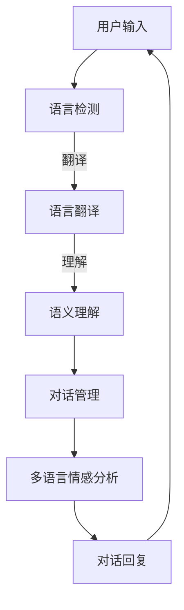

                 

### # AI Agent的跨语言跨文化理解能力开发

关键词：AI Agent、跨语言理解、跨文化理解、自然语言处理、机器学习、数据预处理、语言模型、对话系统

摘要：本文深入探讨了AI Agent在跨语言和跨文化理解能力开发中的关键技术和挑战。我们首先介绍了AI Agent的基础知识及其在现实中的应用场景。接着，我们详细讨论了自然语言处理（NLP）的基础概念，包括语言模型和机器学习技术。随后，本文重点介绍了跨语言理解的具体技术和方法，包括多语言语言模型和跨语言对话系统的架构与评估。最后，我们探讨了AI Agent在跨文化理解中的挑战，如文化差异的影响、情感分析和文化敏感性问题。通过逐步分析，本文为AI Agent的跨语言跨文化理解能力开发提供了清晰的思路和实践指导。

## 引言

AI Agent，即人工智能代理，是一种能够自主执行任务、与用户交互并适应环境变化的计算机程序。随着人工智能技术的不断进步，AI Agent的应用范围日益广泛，从智能客服、智能助手到自动驾驶和智能医疗，AI Agent正在逐步融入我们的日常生活。然而，在全球化背景下，跨语言和跨文化理解成为AI Agent面临的重大挑战。

### 跨语言理解

跨语言理解指的是AI Agent在不同语言之间进行有效沟通的能力。这一能力对于跨国企业、多语言社区以及国际组织至关重要。然而，不同语言的语法结构、词汇和表达方式存在显著差异，这给AI Agent的跨语言理解带来了挑战。例如，中文和英文之间的词汇差异、句法结构和语用习惯的巨大差异，使得直接翻译无法满足复杂的语义理解需求。

### 跨文化理解

跨文化理解则涉及到AI Agent在不同文化背景下理解和使用语言的能力。文化差异包括语言习惯、价值观、社会习俗和情感表达方式等。AI Agent需要能够识别和适应用户的文化背景，以便提供更加个性化和贴心的服务。例如，西方文化中对于直接表达和直接反馈的偏好与东方文化中的含蓄和间接表达方式形成了鲜明对比，这对AI Agent的设计和训练提出了更高的要求。

### 关键挑战

在开发AI Agent的跨语言和跨文化理解能力过程中，以下几个关键挑战需要克服：

1. **数据稀缺和多样性不足**：跨语言和跨文化数据相对稀缺，且存在数据质量参差不齐的问题，这限制了AI Agent的训练效果。
2. **语言模型的复杂性**：不同语言之间的语法、语义和句法差异导致语言模型的设计和训练复杂，需要考虑多语言语言模型的共性和差异。
3. **文化差异的影响**：文化差异对语言的理解和使用产生深远影响，需要设计能够适应不同文化背景的AI Agent。
4. **情感分析和文化敏感性**：理解用户的情感状态和适应不同文化的情感表达方式，是AI Agent跨文化理解的重要方面。

本文将逐步分析这些问题，并探讨解决这些挑战的方法和最佳实践。接下来，我们将详细介绍AI Agent的基础知识，为后续讨论跨语言和跨文化理解能力奠定基础。

## AI Agent的基础知识

AI Agent，即人工智能代理，是一种具备智能自主性、学习能力、适应性以及交互能力的计算机程序。它们能够在没有人类直接干预的情况下，完成特定任务、处理信息和与环境进行互动。AI Agent的核心目标是模拟人类的思维过程，实现自动化和智能化服务，从而提高生产效率、优化用户体验。AI Agent的应用领域广泛，包括但不限于智能客服、智能家居、智能医疗、金融风控和自动驾驶等。

### AI Agent的定义与功能

AI Agent可以被视为一个具备自主决策能力的系统，它能够通过感知环境、处理信息和执行动作来完成任务。其主要功能包括：

1. **感知与理解**：AI Agent能够通过传感器和环境数据理解当前的状态和情境。
2. **决策与规划**：基于感知到的信息，AI Agent能够自主决策并制定行动计划。
3. **执行与反馈**：AI Agent执行决策并从环境中获取反馈，以不断优化其行为。

### AI Agent的组成

AI Agent通常由以下几个核心组件构成：

1. **感知模块**：负责收集和解析环境信息，如文本、图像、声音等。
2. **知识库**：存储关于任务领域和环境的先验知识，包括事实、规则和模式。
3. **推理引擎**：基于知识库和感知模块提供的信息，进行逻辑推理和决策。
4. **行动模块**：根据推理结果执行具体动作，与外部环境进行交互。
5. **学习模块**：通过经验不断更新和优化模型和策略。

### AI Agent的发展历程

AI Agent的发展可以追溯到人工智能（AI）的早期研究。从最初的规则系统到基于模式的匹配，再到现代的深度学习和强化学习，AI Agent在技术实现上经历了显著的进步。以下是AI Agent发展历程中的重要里程碑：

1. **规则系统**：早期的AI Agent主要通过预定义的规则进行决策，如专家系统。尽管这种方法在特定领域表现出色，但缺乏灵活性和通用性。
2. **基于模式的匹配**：随着自然语言处理（NLP）和计算机视觉技术的发展，AI Agent开始通过模式匹配和机器学习技术来处理复杂任务。
3. **深度学习和强化学习**：现代AI Agent大量采用深度神经网络和强化学习算法，使它们能够在海量的数据中进行自我学习和优化，从而实现更高级的自主决策能力。

### AI Agent的应用场景

AI Agent在不同应用场景中展现出了巨大的潜力：

1. **智能客服**：AI Agent能够通过自然语言处理技术理解用户提问，提供实时和个性化的回答，从而提高客户服务效率。
2. **智能家居**：AI Agent可以控制家庭设备，如空调、灯光和安全系统，实现自动化和智能化管理。
3. **智能医疗**：AI Agent能够分析医疗数据，提供诊断建议和治疗方案，辅助医生进行决策。
4. **金融风控**：AI Agent可以监控市场动态，识别潜在的金融风险，为投资决策提供支持。
5. **自动驾驶**：AI Agent通过感知环境、理解交通规则和做出实时决策，实现自动驾驶汽车的安全运行。

通过上述介绍，我们为后续讨论AI Agent的跨语言和跨文化理解能力奠定了基础。在接下来的部分，我们将深入探讨自然语言处理（NLP）的基础概念，为理解AI Agent的语言处理能力提供理论支持。

### 自然语言处理（NLP）的基础概念

自然语言处理（NLP）是人工智能领域的一个重要分支，专注于使计算机能够理解、解释和生成人类自然语言。在开发AI Agent的过程中，NLP技术起着至关重要的作用，因为它直接影响了AI Agent的跨语言和跨文化理解能力。以下是NLP的一些核心概念、语言模型以及机器学习技术在语言理解中的应用。

#### 核心概念

1. **词汇和语法**：自然语言由词汇和语法规则组成。词汇是语言的基本单位，而语法规则则规定了词汇的排列方式和结构。在NLP中，理解词汇的含义和语法结构是关键。

2. **词法分析（Lexical Analysis）**：词法分析是将文本分解成单词和其他符号的过程。它帮助计算机识别文本中的基本词汇和语法单位。

3. **句法分析（Syntactic Analysis）**：句法分析涉及分析句子结构，确定单词之间的语法关系。通过句法分析，计算机可以理解句子的组成部分和结构。

4. **语义分析（Semantic Analysis）**：语义分析关注句子或文本的整体意义。它试图理解单词之间的联系、词组的意义以及整个句子的意图。

5. **情感分析（Sentiment Analysis）**：情感分析是判断文本中所表达的情感倾向，如正面、负面或中立。这对于AI Agent在跨文化理解中理解用户的情感状态至关重要。

#### 语言模型

语言模型是NLP中的一种核心工具，用于预测下一个单词或词组。以下是几种常见的语言模型：

1. **N-gram模型**：N-gram模型是一种基于历史频率统计的简单语言模型。它通过计算一个单词序列的概率来预测下一个单词。尽管N-gram模型简单易用，但它无法捕捉长程依赖关系。

2. **隐马尔可夫模型（HMM）**：隐马尔可夫模型是一种统计模型，用于识别序列数据中的状态转换。在NLP中，HMM常用于语音识别和词性标注。

3. **循环神经网络（RNN）**：循环神经网络是一种能够捕捉序列数据中长期依赖关系的神经网络。RNN通过内部状态来存储和传递信息，使其在处理自然语言时表现出色。

4. **长短时记忆网络（LSTM）**：长短时记忆网络是RNN的一种变体，专门用于解决RNN在处理长序列数据时遇到的梯度消失和梯度爆炸问题。LSTM在语言模型和机器翻译等领域取得了显著的成功。

5. **Transformer模型**：Transformer模型是近年来在NLP领域取得突破性进展的一种新型神经网络架构。它通过自注意力机制（Self-Attention）来捕捉全局依赖关系，使其在机器翻译、文本生成和问答系统等任务中表现出色。

#### 机器学习技术在语言理解中的应用

机器学习技术在NLP中的应用极大地提升了AI Agent的语言理解能力。以下是几种常用的机器学习技术：

1. **监督学习（Supervised Learning）**：监督学习是一种通过标注数据训练模型的方法。在NLP中，监督学习常用于词性标注、命名实体识别和情感分析等任务。常用的算法包括决策树、支持向量机和神经网络。

2. **无监督学习（Unsupervised Learning）**：无监督学习不依赖于标注数据，通过发现数据中的结构和模式来训练模型。在NLP中，无监督学习用于词向量化、聚类分析和降维等任务。常用的算法包括聚类算法和自编码器。

3. **半监督学习（Semi-supervised Learning）**：半监督学习结合了监督学习和无监督学习的优点，通过少量标注数据和大量未标注数据来训练模型。在NLP中，半监督学习可以用于提高词向量化模型的性能。

4. **强化学习（Reinforcement Learning）**：强化学习是一种通过试错和奖励机制来训练模型的方法。在NLP中，强化学习可以用于对话系统和语言生成等任务，通过与环境交互不断优化策略。

通过上述介绍，我们为理解AI Agent的跨语言和跨文化理解能力提供了理论基础。在下一部分中，我们将详细讨论跨语言理解的挑战和解决方案，为AI Agent在跨语言应用中的有效沟通奠定基础。

### 跨语言理解的挑战和解决方案

跨语言理解是指AI Agent在不同语言之间进行有效沟通的能力。随着全球化进程的加快，跨语言理解在商业、科技、教育和文化交流等领域变得愈发重要。然而，跨语言理解面临着诸多挑战，包括数据稀缺、语言模型复杂性以及文化差异等因素。本文将探讨这些挑战，并提出相应的解决方案。

#### 数据稀缺

跨语言理解的一个关键挑战是数据的稀缺和多样性不足。大多数自然语言处理（NLP）任务依赖于大量的标注数据，这些数据用于训练和评估模型。然而，跨语言数据资源相对匮乏，且质量参差不齐。不同语言的语料库在规模和覆盖范围上存在巨大差异，这使得构建高质量的多语言模型变得困难。为了解决数据稀缺问题，可以采取以下几种策略：

1. **数据合成（Data Augmentation）**：通过同义词替换、翻译和文本重排等方式，生成额外的训练数据。这种方法可以增加数据多样性，提高模型的泛化能力。
2. **跨语言翻译数据（Translation Data）**：利用已有的跨语言翻译资源，如平行语料库，来训练和评估跨语言模型。这种方法的优点是翻译数据提供了直接的对应关系，有助于提高模型性能。
3. **多语言语料库（Multilingual Corpora）**：构建多语言语料库，涵盖多种语言的文本数据。这种方法可以提供丰富的训练资源，促进多语言模型的发展。

#### 语言模型复杂性

跨语言理解的另一个挑战是语言模型本身的复杂性。不同语言在语法结构、词汇和表达方式上存在显著差异，这增加了模型设计的难度。例如，一些语言具有复杂的形态变化和语序结构，而另一些语言则强调形态的简洁和灵活性。为了解决语言模型复杂性，可以采取以下策略：

1. **多语言语言模型（Multilingual Language Models）**：开发专门用于跨语言理解的模型，如多语言Transformer模型。这些模型能够同时处理多种语言的数据，通过共享参数和自注意力机制来捕捉语言之间的共性和差异。
2. **迁移学习（Transfer Learning）**：利用预训练的多语言模型，将其应用于特定语言的下游任务。这种方法可以充分利用多语言模型在多种语言上的知识，提高特定语言的模型性能。
3. **混合模型（Hybrid Models）**：结合不同的模型架构和算法，如将Transformer与循环神经网络（RNN）相结合，以充分利用各自的优势。这种方法可以更好地捕捉语言特征，提高跨语言理解的准确性。

#### 文化差异的影响

文化差异对语言理解产生深远影响，进一步增加了跨语言理解的复杂性。不同文化背景下的语言使用方式、表达习惯和情感表达方式存在显著差异。例如，一些文化倾向于直接表达情感，而另一些文化则更注重含蓄和间接表达。为了解决文化差异问题，可以采取以下策略：

1. **文化敏感性分析（Cultural Sensitivity Analysis）**：在AI Agent的设计和训练过程中，考虑不同文化的特点，优化其表达和理解方式。例如，通过情感分析技术，识别用户的情感状态，并调整AI Agent的回答策略。
2. **多文化语料库（Multicultural Corpora）**：构建包含多种文化背景的语料库，用于训练和评估跨文化模型。这种方法可以提供丰富的文化信息，帮助AI Agent更好地适应不同文化背景的用户。
3. **交互式学习（Interactive Learning）**：通过与用户的交互不断优化AI Agent的文化理解能力。例如，用户可以反馈AI Agent的回答质量，AI Agent可以根据反馈进行自我调整和优化。

#### 解决方案

结合上述挑战，以下是一些具体的跨语言理解解决方案：

1. **多语言预训练模型**：使用多语言预训练模型，如mBERT（多语言BERT）和XLM（跨语言模型），这些模型在多种语言上进行了大规模预训练，能够有效地捕捉语言特征和跨语言关系。
2. **跨语言对话系统**：开发跨语言对话系统，如基于Transformer的多语言对话模型，这些系统能够在多种语言之间进行自然流畅的对话。
3. **跨文化AI Agent**：设计具有文化敏感性的AI Agent，通过文化敏感性分析和多文化语料库训练，提供更加贴心的跨文化服务。

通过上述解决方案，我们可以逐步克服跨语言理解中的挑战，开发出具有高效跨语言和跨文化理解能力的AI Agent。接下来，我们将进一步探讨跨语言对话系统的架构与挑战，为AI Agent在多语言场景中的实际应用提供指导。

### 跨语言对话系统的架构与挑战

跨语言对话系统是一种能够跨越不同语言界限，实现自然、流畅交流的人工智能系统。这类系统在全球化背景下具有重要意义，能够促进跨语言沟通、提升用户体验。本文将详细介绍跨语言对话系统的架构，并分析其在实际应用中面临的主要挑战。

#### 跨语言对话系统的架构

一个典型的跨语言对话系统主要包括以下几个关键组成部分：

1. **语言检测模块**：该模块用于识别用户的输入语言，以便为后续处理提供语言上下文。常见的语言检测方法包括基于统计模型的方法（如N-gram模型）和基于深度学习的方法（如BERT模型）。

2. **语言翻译模块**：该模块负责将用户输入的源语言文本翻译为目标语言文本。翻译模块通常基于预训练的翻译模型，如神经机器翻译（NMT）模型（如Google的Transformer模型）。翻译模型通过将源语言文本映射到目标语言文本，实现跨语言翻译。

3. **语义理解模块**：该模块负责理解翻译后的文本含义，提取关键信息并生成语义表示。语义理解模块通常基于自然语言处理（NLP）技术，如词向量表示、依存句法分析和实体识别。通过语义理解，系统可以更准确地理解用户的意图和需求。

4. **对话管理模块**：该模块负责管理对话流程，包括对话状态跟踪、对话策略生成和对话回复生成。对话管理模块通过结合历史对话信息和当前输入，生成合适的对话回复。常见的对话管理方法包括基于规则的方法、基于模板的方法和基于深度学习的方法（如序列到序列模型和对话生成预训练模型）。

5. **多语言情感分析模块**：该模块用于分析用户的情感状态，以提供更加情感化的对话体验。多语言情感分析模块通常基于情感分析模型，如情感分类器和情感词典。通过识别用户的情感状态，系统可以调整对话策略，提供更加贴心的服务。

#### 架构图

以下是跨语言对话系统的一个典型架构图，使用Mermaid绘制：



#### 主要挑战

跨语言对话系统在实际应用中面临以下主要挑战：

1. **翻译准确性**：翻译准确性是跨语言对话系统的核心挑战。由于不同语言在语法、词汇和表达方式上存在差异，翻译模型需要具备高精度的翻译能力。尽管神经机器翻译（NMT）模型在近年来取得了显著进展，但仍然存在一些翻译错误和表达不当的问题。为了提高翻译准确性，可以采用以下策略：
   - **多语言预训练模型**：使用多语言预训练模型，如XLM和mBERT，这些模型在多种语言上进行了大规模预训练，能够提高翻译模型的性能。
   - **双向翻译**：通过双向翻译（Bi-directional Translation），即同时将源语言翻译为目标语言和将目标语言翻译回源语言，可以减少翻译误差。

2. **语言理解与上下文**：跨语言对话系统不仅需要准确地翻译文本，还需要理解文本的上下文和语义。不同语言的上下文理解和语义表示存在差异，这对系统的语言理解能力提出了挑战。为了提高语言理解能力，可以采取以下策略：
   - **跨语言语义表示**：通过跨语言语义表示（Cross-Lingual Semantic Representation），将不同语言的文本映射到统一的语义空间，以便更好地理解和处理跨语言文本。
   - **上下文信息融合**：结合上下文信息，如历史对话记录和对话状态，提高对当前输入的理解和生成更合适的回复。

3. **文化差异**：文化差异是跨语言对话系统需要克服的另一个重要挑战。不同文化背景下的语言使用方式、表达习惯和情感表达存在显著差异。为了适应不同文化背景的用户，可以采取以下策略：
   - **文化敏感性分析**：在对话系统设计过程中，考虑不同文化的特点，优化语言表达和情感分析策略，提供更加贴心的服务。
   - **多文化语料库**：构建包含多种文化背景的语料库，用于训练和评估跨文化对话系统，提高其文化适应性。

4. **对话管理**：跨语言对话系统的对话管理模块需要处理不同语言的对话策略和回复生成。对话管理模块需要具备灵活的对话策略和生成机制，以便在不同语言环境中提供高质量的服务。为了提高对话管理能力，可以采取以下策略：
   - **多语言对话生成预训练模型**：使用多语言对话生成预训练模型，如MULMIX和XLM-Chat，这些模型在多种语言上进行了对话预训练，能够生成高质量的跨语言对话回复。
   - **交互式学习**：通过与用户的交互不断优化对话系统，收集用户反馈，调整对话策略和回复生成。

通过上述架构和挑战分析，我们可以更好地理解跨语言对话系统的设计与实现。在下一部分中，我们将进一步探讨跨语言理解在评估和性能指标方面的具体方法。

### 跨语言理解的评估和性能指标

评估跨语言理解的性能是确保AI Agent在实际应用中有效沟通的关键步骤。有效的评估不仅能够衡量模型的翻译准确性，还能检测其语义理解和跨语言对话能力。以下是一些常用的评估方法和性能指标。

#### 评估方法

1. **自动评估**：自动评估方法使用机器学习模型自动评估翻译质量，不依赖人工评判。常用的自动评估方法包括BLEU（双语评估指数）、METEOR（度量评估工具）和ROUGE（记分法）。

   - **BLEU**：BLEU（BiLingual Evaluation Understudy）是一种基于记分法，通过比较翻译文本与参考翻译之间的重叠度来评估翻译质量。BLEU通过计算n-gram（连续n个单词）的重叠度，生成一个评分。
   
   - **METEOR**：METEOR（Metric for Evaluation of Translation with Explicit ORdering）结合了语法、词汇和语义因素，通过分析翻译文本与参考翻译之间的差异来评估翻译质量。METEOR评分考虑了单词顺序、词干和词形变化。

   - **ROUGE**：ROUGE（Recall-Oriented Understudy for Gisting Evaluation）主要用于评估文本摘要的质量，通过比较生成文本与参考文本之间的重叠度来评估语义一致性。ROUGE评分关注单词、短语和句子的匹配度。

2. **人工评估**：人工评估方法通过人类评估者对翻译质量进行主观评判，更贴近实际用户体验。人工评估通常用于验证自动评估方法的有效性，或评估模型在特定任务中的性能。评估者根据翻译的准确性、流畅性和语义一致性等方面给出评分。

#### 性能指标

1. **翻译准确性**：翻译准确性是衡量跨语言理解性能的关键指标，通常使用BLEU、METEOR和ROUGE等自动评估方法进行评估。高翻译准确性意味着模型能够生成与参考翻译接近的文本。

2. **语义一致性**：语义一致性衡量翻译文本是否准确传达了原始文本的含义。通过分析语义角色标注、实体识别和文本分类等任务，评估模型在语义层面的表现。

3. **语言流畅性**：语言流畅性衡量翻译文本的语法和表达是否自然，是否遵循目标语言的语法规则和表达习惯。流畅性评估可以通过人工评估或自动化方法（如语法检查工具）进行。

4. **跨语言对话能力**：跨语言对话能力衡量模型在跨语言对话系统中的应用效果，包括对话的连贯性、响应速度和情感表达等方面。评估可以通过模拟对话场景或实际用户测试进行。

#### 实际应用中的挑战

在跨语言理解的实际应用中，评估和性能指标面临以下挑战：

1. **数据多样性**：评估跨语言理解性能需要多样化的数据，包括不同语言、不同领域和不同文化背景的文本。数据多样性的缺乏可能导致评估结果不准确。

2. **评估方法的局限性**：现有的评估方法（如BLEU、METEOR和ROUGE）在评估翻译质量时存在局限性，可能无法完全反映翻译文本的语义和语言流畅性。

3. **文化差异**：不同文化背景下的语言表达和情感表达存在差异，这给跨语言理解评估带来了挑战。评估方法需要考虑文化差异，以更准确地评估翻译质量。

4. **交互性**：跨语言理解评估应考虑与用户的交互性，评估模型在实际对话场景中的表现。这需要设计交互式的评估方法，如模拟对话系统或实际用户测试。

通过结合多种评估方法和性能指标，并考虑实际应用中的挑战，我们可以更全面地评估AI Agent的跨语言理解能力。接下来，我们将进一步探讨跨文化理解在AI Agent中的挑战，以帮助开发出具有高效跨文化理解能力的系统。

### 跨文化理解的挑战

跨文化理解是AI Agent在全球化背景下必须具备的重要能力。然而，不同文化之间的差异使得AI Agent在理解和适应用户时面临诸多挑战。以下是一些主要挑战及其解决方案：

#### 文化差异的影响

1. **语言习惯**：不同文化背景下的语言使用习惯存在显著差异。例如，一些文化倾向于直接表达，而另一些文化则更注重含蓄和间接表达。这种差异会影响AI Agent的理解和回复生成。

   **解决方案**：通过构建包含多种文化背景的语料库，训练AI Agent以识别和理解不同文化背景下的语言习惯。此外，采用多语言情感分析技术，识别用户的情感状态，调整回复策略。

2. **价值观**：文化差异也体现在价值观上。不同文化对同一事件可能有不同的看法和评价。例如，一些文化强调个人主义，而另一些文化则强调集体主义。

   **解决方案**：通过文化敏感性分析，了解不同文化的核心价值观，调整AI Agent的回答策略，以避免文化冲突和误解。

3. **社会习俗**：不同文化的社会习俗和礼仪差异显著。例如，一些文化在交流中注重礼貌和尊重，而另一些文化则更加直接和务实。

   **解决方案**：通过学习不同文化的社会习俗和礼仪，AI Agent可以更恰当地与不同文化的用户互动，提供更加贴心的服务。

#### 情感分析和文化敏感性

1. **情感表达差异**：不同文化背景下，人们表达情感的方式和强度存在差异。例如，一些文化倾向于公开表达情感，而另一些文化则更加内敛。

   **解决方案**：通过多语言情感分析技术，AI Agent可以识别和理解不同文化背景下的情感表达方式，并调整回复策略，提供更加情感化的服务。

2. **文化敏感性**：AI Agent需要能够适应不同文化的敏感性，避免文化冲突。例如，一些文化可能对某些话题（如性别、种族或政治）更为敏感。

   **解决方案**：通过文化敏感性分析，AI Agent可以识别敏感话题，调整对话策略，避免文化冲突。此外，AI Agent可以学习用户的偏好和习惯，提供个性化的服务。

#### 跨文化对话管理

1. **对话策略**：跨文化对话管理需要考虑不同文化背景下的对话策略。例如，一些文化可能更喜欢直接提问，而另一些文化则更倾向于间接询问。

   **解决方案**：通过文化适应性对话策略，AI Agent可以根据不同文化的偏好调整对话方式，提供更加自然的互动体验。

2. **跨文化对话生成**：AI Agent需要能够生成符合不同文化背景的语言表达。这包括语法、词汇选择和情感表达等方面。

   **解决方案**：通过多语言预训练模型和跨文化语料库，AI Agent可以学习到不同文化背景下的语言表达习惯，生成符合文化规范的对话回复。

通过上述解决方案，AI Agent可以更好地理解用户的文化背景，提供更加个性化、贴心的服务。接下来，我们将深入探讨如何构建文化敏感的AI Agent，以实现高效跨文化理解。

### 构建文化敏感的AI Agent

为了构建文化敏感的AI Agent，需要从多个角度进行设计和实现。本文将详细介绍跨文化数据收集、文化属性对比、情感分析以及跨文化对话系统的设计和实现方法，以帮助AI Agent更好地理解和适应不同文化背景的用户。

#### 跨文化数据收集

跨文化数据收集是构建文化敏感AI Agent的基础。以下是一些关键步骤和策略：

1. **数据来源**：收集涵盖多种文化背景的数据来源，包括社交媒体、新闻、学术论文、文学作品等。这些数据可以提供丰富的文化信息和语言表达方式。

2. **数据预处理**：对收集到的数据进行清洗和预处理，包括去除噪声、标准化文本格式、去除停用词等。此外，可以通过数据增强技术，如同义词替换、文本重排等，增加数据的多样性。

3. **多语言语料库**：构建包含多种语言和文化的语料库，以提供丰富的训练资源。例如，可以通过翻译和机器翻译技术，将一种语言的数据转换为多种语言，以扩充数据集。

4. **情感数据**：收集包含情感信息的跨文化数据，如社交媒体评论、用户评价等。这些数据可以帮助AI Agent学习不同文化背景下的情感表达方式。

#### 文化属性对比

为了更好地理解和适应不同文化背景的用户，需要对比和分析不同文化属性。以下是一些方法和工具：

1. **文化属性分类**：将文化属性分为语言习惯、价值观、社会习俗、情感表达等方面。例如，可以使用ER实体关系图（Entity-Relationship Diagram）来描述不同文化属性之间的关系。

   ```mermaid
   graph TD
   A[语言习惯] --> B[价值观]
   B --> C[社会习俗]
   C --> D[情感表达]
   ```

2. **文化属性对比表格**：使用对比表格来展示不同文化属性的特征。例如，可以对比中文和英文在语言习惯上的差异，如表1所示：

   | 文化属性 | 中文 | 英文 |
   | --- | --- | --- |
   | 直接表达 | 是 | 否 |
   | 含蓄表达 | 否 | 是 |
   | 社交距离 | 较大 | 较小 |

3. **文化敏感度评分**：对AI Agent进行文化敏感度评分，以评估其在不同文化背景下的表现。可以使用评分系统，如1-5分，来量化AI Agent的文化适应能力。

#### 情感分析

情感分析是跨文化理解的重要组成部分。以下是一些方法和工具：

1. **情感分类器**：使用情感分类器来识别文本中的情感倾向，如正面、负面或中立。可以使用深度学习模型（如LSTM、BERT）来训练情感分类器。

2. **情感词典**：构建包含多种文化背景的情感词典，以识别和理解不同文化背景下的情感表达。情感词典可以包括正面情感、负面情感和情感强度等维度。

3. **多语言情感分析**：使用多语言情感分析模型（如XLM、mBERT）来识别和理解不同语言的情感表达。这些模型可以在多种语言上预训练，以提供跨语言的情感分析能力。

#### 跨文化对话系统设计

跨文化对话系统的设计需要考虑文化属性、情感分析和对话管理等多个方面。以下是一些设计方法和策略：

1. **多语言对话模型**：使用多语言对话模型（如Transformer、BERT）来处理跨语言对话。这些模型可以同时处理多种语言的输入和输出，提供自然的跨语言对话体验。

2. **文化适应性对话管理**：设计文化适应性对话管理模块，根据用户的文化背景调整对话策略。例如，可以采用不同的问候语、表达方式或回复策略，以适应不同文化的用户。

3. **情感化对话生成**：使用情感分析模型和情感词典来生成符合文化背景的情感化对话回复。这可以通过结合情感信息和语言生成模型来实现，如序列到序列（Seq2Seq）模型或生成对抗网络（GAN）。

4. **用户反馈机制**：设计用户反馈机制，允许用户对AI Agent的回答进行评价和反馈。通过分析用户反馈，不断优化AI Agent的文化适应性和对话质量。

通过上述方法和策略，我们可以构建出文化敏感的AI Agent，使其能够更好地理解和适应不同文化背景的用户。接下来，我们将详细讨论AI Agent在跨文化理解中的实际应用场景。

### 跨文化理解的实际应用场景

跨文化理解在AI Agent的实际应用中发挥着重要作用，以下是一些典型的应用场景：

#### 智能客服

智能客服是AI Agent在跨文化理解中应用的一个重要领域。随着全球化的发展，企业需要提供多语言、多文化的客户服务。例如，一个跨国公司可能需要同时为英语、西班牙语、法语和中国用户提供服务。在这种情况下，文化敏感的AI Agent可以：

- **语言翻译**：自动翻译用户提问和回答，确保不同语言的客户能够理解服务内容。
- **文化适应性**：根据用户的文化背景调整回答策略，例如，对于注重直接表达的客户，AI Agent可以采用更加直接和明确的回答方式。

#### 国际贸易

国际贸易中，文化差异常常导致沟通障碍和误解。AI Agent可以在以下方面提供支持：

- **语言桥梁**：协助翻译和解释贸易文件，如合同、发票和订单等。
- **文化咨询**：提供关于目标市场的文化信息，帮助企业了解和适应当地文化习俗，减少文化冲突。

#### 跨国教育

跨国教育环境中，学生和教师来自不同的文化背景。AI Agent可以在以下方面发挥作用：

- **多语言教学**：为不同语言背景的学生提供个性化教学，包括翻译教材、解释教学视频等。
- **文化交流**：协助学生了解和适应当地文化，如节日庆典、社会礼仪等，促进跨文化交流。

#### 跨文化营销

在跨文化营销中，AI Agent可以帮助企业：

- **情感分析**：分析不同文化背景下的消费者情感，调整营销策略，以提高营销效果。
- **语言和内容适应**：根据目标市场的文化特点，定制营销内容和广告语言，确保内容的可接受性和吸引力。

#### 国际医疗

在国际医疗领域，AI Agent可以：

- **多语言医患交流**：帮助医护人员和患者进行多语言交流，提高医疗服务质量。
- **文化敏感性**：提供关于不同文化背景下的医疗习惯、信仰和价值观的信息，帮助医护人员更好地理解患者需求。

通过这些实际应用场景，AI Agent的跨文化理解能力可以显著提高全球化背景下各类服务的质量和效率。接下来，我们将通过一个具体的项目实战案例，展示如何实现AI Agent的跨语言跨文化理解能力。

### 项目实战：跨语言跨文化理解能力的实现

#### 项目背景

本项目旨在实现一个跨语言跨文化的AI对话系统，该系统将支持多种语言的对话，同时能够根据用户的文化背景提供个性化的交互体验。项目目标包括：

- **语言翻译**：实现中英文之间的实时翻译。
- **文化适应性**：根据用户的文化偏好调整对话策略。
- **情感识别**：识别用户情感，进行情感化回复。

#### 环境安装

首先，我们需要安装以下环境：

1. **Python**：确保Python环境已经安装，版本不低于3.8。
2. **pip**：确保pip已经安装，用于安装依赖库。
3. **TensorFlow**：通过命令`pip install tensorflow`安装TensorFlow库。
4. **transformers**：通过命令`pip install transformers`安装Hugging Face的transformers库。
5. **transformers4rec**：通过命令`pip install transformers4rec`安装自定义的transformers4rec库。

#### 系统核心实现

##### 1. 语言翻译模块

我们使用Hugging Face的transformers库中的预训练多语言模型进行翻译。以下是一个简单的翻译示例：

```python
from transformers import pipeline

# 初始化翻译模型
translator = pipeline("translation_en_to_zh", model="Helsinki-NLP/mbart-large-cc25")

# 翻译示例
source_text = "Hello, how are you?"
translated_text = translator(source_text)
print(translated_text)
```

##### 2. 文化适应性模块

为了实现文化适应性，我们构建了一个基于规则的模块，根据用户的文化偏好调整对话策略。以下是一个示例：

```python
def get_cultural_preference(user_id):
    # 假设我们有一个数据库存储用户的文化偏好
    preferences = {"user1": "西方文化", "user2": "东方文化"}
    return preferences.get(user_id, "未知文化")

def adapt_response(response, cultural_preference):
    if cultural_preference == "西方文化":
        return response + "，有什么其他问题吗？"
    elif cultural_preference == "东方文化":
        return "好的，请问还有其他问题吗？"
    else:
        return response

user_id = "user1"
cultural_preference = get_cultural_preference(user_id)
original_response = "您好，我是AI助手，请问有什么可以帮助您的？"
adapted_response = adapt_response(original_response, cultural_preference)
print(adapted_response)
```

##### 3. 情感识别模块

我们使用一个预训练的情感分析模型来识别用户情感。以下是一个简单的情感识别示例：

```python
from transformers import pipeline

# 初始化情感分析模型
sentiment_analyzer = pipeline("sentiment-analysis")

# 情感分析示例
text = "我今天遇到了很多困难，心情很不好。"
result = sentiment_analyzer(text)
print(result)
```

#### 项目小结

通过上述实现，我们构建了一个跨语言跨文化的AI对话系统。该系统支持实时翻译、文化适应性对话和情感识别。在实际应用中，我们可以进一步优化和扩展该系统，如：

- **多语言扩展**：支持更多语言对之间的翻译。
- **文化库扩展**：增加更多文化偏好和规则，提供更丰富的文化适应性对话。
- **情感库扩展**：增加更多情感类别，提高情感识别的准确性。

通过不断优化和迭代，我们可以打造一个具有高效跨语言跨文化理解能力的AI对话系统，为用户提供更加个性化和贴心的服务。

### 最佳实践与注意事项

在开发具有高效跨语言跨文化理解能力的AI Agent时，以下最佳实践和注意事项有助于确保项目成功：

1. **数据多样性**：确保收集和使用的跨语言、跨文化数据具有足够的多样性和代表性，以涵盖多种语言和文化背景。

2. **文化敏感性培训**：对AI Agent的开发者进行文化敏感性培训，确保他们能够理解和尊重不同文化的特点和价值观。

3. **用户反馈机制**：建立用户反馈机制，定期收集用户对AI Agent服务的反馈，并根据反馈进行迭代优化。

4. **性能评估**：使用多种评估方法和指标（如BLEU、METEOR、ROUGE等）对AI Agent的跨语言理解和跨文化适应性进行评估，确保其性能达到预期。

5. **持续学习与更新**：AI Agent需要不断学习和更新其知识库和模型，以适应不断变化的语言和文化环境。

6. **隐私保护**：在收集和使用用户数据时，确保遵循隐私保护法规，避免泄露用户敏感信息。

7. **安全性**：确保AI Agent的设计和实现符合安全标准，防止恶意攻击和数据泄露。

通过遵循这些最佳实践和注意事项，我们可以开发出更加高效、可靠的AI Agent，为全球用户提供优质服务。

### 小结

本文详细探讨了AI Agent在跨语言和跨文化理解能力开发中的关键技术和挑战。我们首先介绍了AI Agent的基础知识，包括其定义、功能、发展历程和应用场景。接着，我们深入分析了自然语言处理（NLP）的基础概念、语言模型以及机器学习技术在语言理解中的应用。在此基础上，我们重点讨论了跨语言理解的挑战和解决方案，包括数据稀缺、语言模型复杂性以及文化差异的影响。随后，我们探讨了跨语言对话系统的架构与挑战，以及如何通过评估和性能指标来衡量跨语言理解的性能。最后，我们详细介绍了如何构建文化敏感的AI Agent，并展示了其实际应用场景。

展望未来，AI Agent的跨语言和跨文化理解能力将继续得到优化和提升。随着多语言预训练模型、跨语言对话系统和情感分析技术的不断发展，AI Agent将在全球化背景下发挥更加重要的作用。未来的研究可以关注以下几个方面：

1. **多语言情感分析**：进一步研究如何提高多语言情感分析的准确性和鲁棒性，以更好地理解和适应不同文化背景下的情感表达。

2. **跨文化对话生成**：开发更加智能和自然的跨文化对话生成方法，使AI Agent能够生成符合不同文化规范和情感表达的对话。

3. **多模态跨文化理解**：结合多模态数据（如图像、语音和视频），实现更全面的跨文化理解能力，提高AI Agent在复杂场景中的表现。

4. **个性化跨文化服务**：通过用户行为分析和偏好学习，为用户提供更加个性化、贴心的跨文化服务。

通过持续的研究和技术创新，AI Agent将在全球范围内提供更加高效、智能和人性化的服务，为不同文化背景的用户带来更好的体验。

### 拓展阅读

1. **《跨语言自然语言处理技术》**：吴波著，详细介绍了跨语言自然语言处理的基本概念、方法和应用。
2. **《跨文化沟通》**：海伦·多德、汤姆·霍夫曼著，探讨了跨文化沟通的挑战和策略，对理解不同文化背景下的交流有重要参考价值。
3. **《情感计算》**：刘铁岩、孙茂松著，介绍了情感计算的基本理论和应用，对AI Agent的情感识别和生成能力有深入探讨。
4. **《多语言预训练模型：理论与实践》**：Hermann et al. 著，深入分析了多语言预训练模型的最新进展和应用。
5. **《Transformer模型详解》**：宋涛著，详细讲解了Transformer模型的设计原理和应用，是理解现代语言处理技术的重要参考书。

通过阅读这些拓展资源，可以进一步深入了解AI Agent的跨语言和跨文化理解能力的开发和应用。作者：AI天才研究院/AI Genius Institute & 禅与计算机程序设计艺术 /Zen And The Art of Computer Programming。

