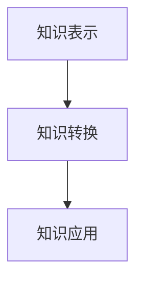
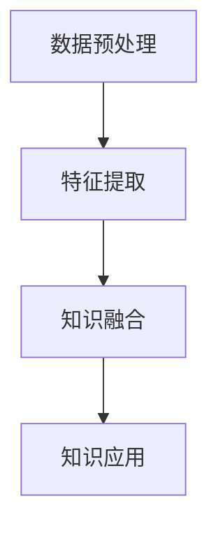
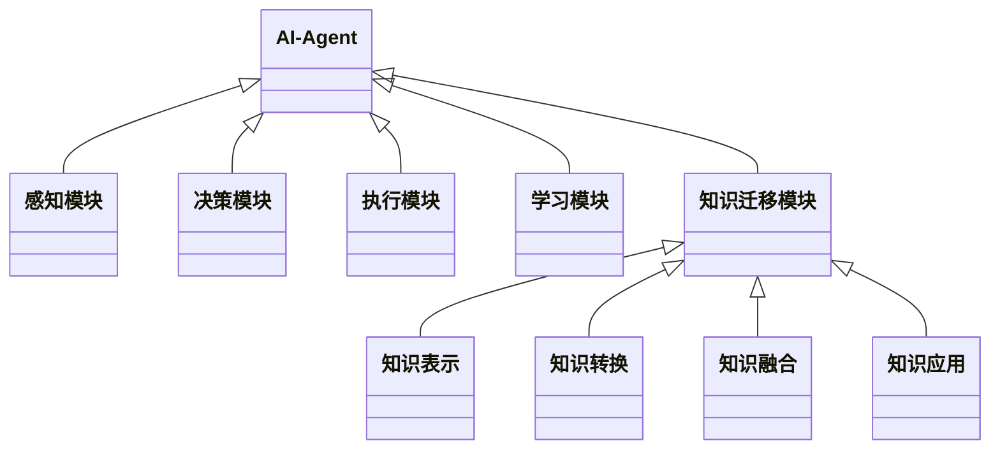
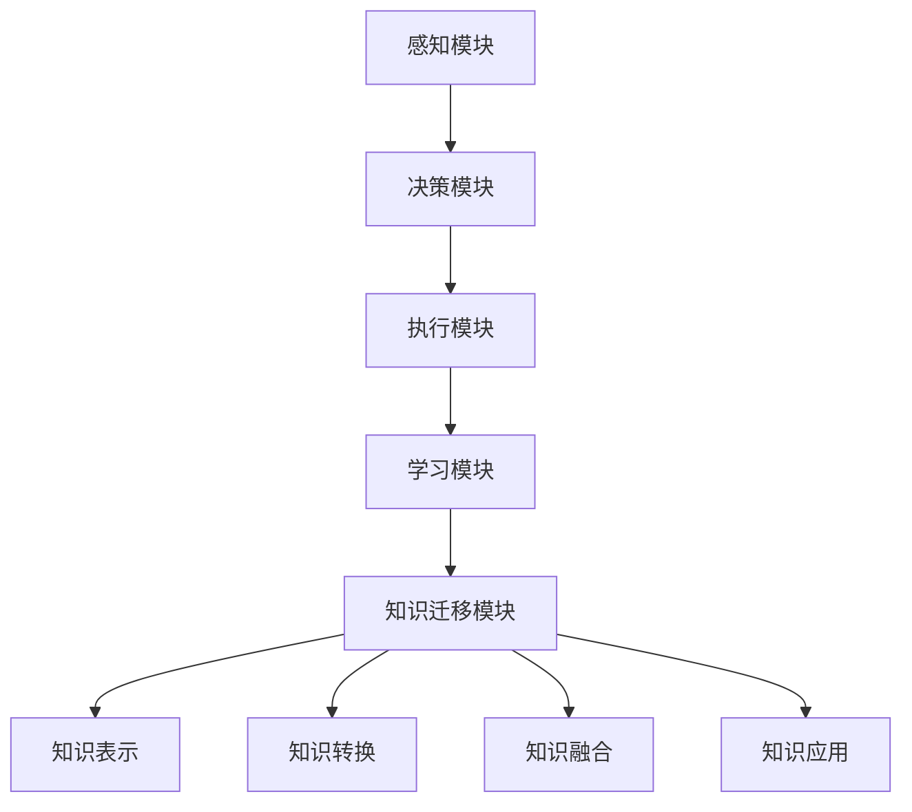
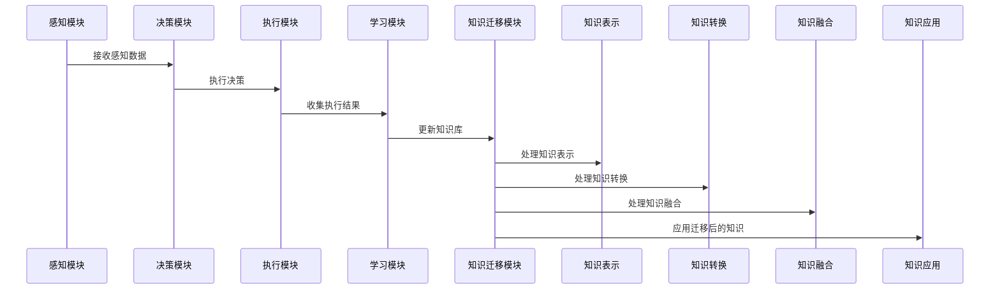
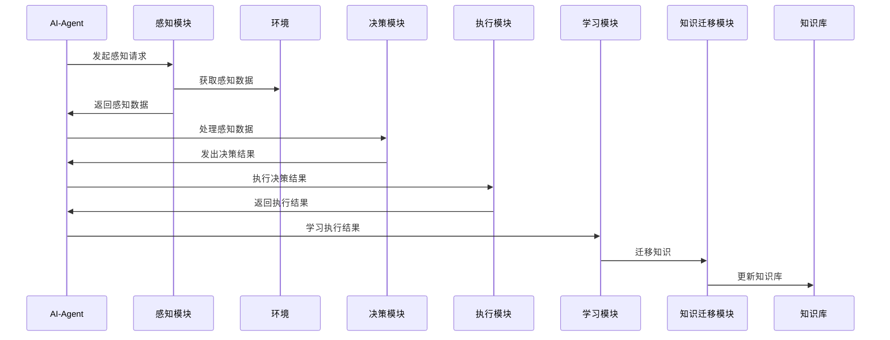

                 

### 文章标题：AI Agent的跨语言跨模态知识迁移

#### 关键词：AI Agent、跨语言知识迁移、跨模态知识迁移、知识共享、算法原理

> 摘要：本文将深入探讨AI Agent在跨语言和跨模态知识迁移中的应用，详细分析其核心概念、算法原理、系统架构以及项目实战。通过逐步分析推理，我们将揭示AI Agent实现高效知识迁移的奥秘，为相关领域的研究者和开发者提供宝贵的参考。

#### 目录大纲设计思路

在撰写本文之前，我们先来谈谈目录大纲的设计思路。设计一份结构合理、内容详实的目录大纲，不仅有助于读者更好地理解文章内容，也能提高文章的阅读效率。以下是本文目录大纲的设计思路：

1. **明确核心内容**：首先，我们要明确本文的核心内容是关于AI Agent的跨语言和跨模态知识迁移，这是目录大纲设计的基础。

2. **结构划分**：根据文章的阅读逻辑和内容的层次，将整篇文章划分为几个部分，如背景介绍、核心概念、算法原理、系统架构、项目实战等。

3. **细化章节内容**：在每个部分下，根据内容的复杂性和重要性，细化到具体的章节，并考虑章节间的逻辑关系。

4. **确保内容完整性**：确保每个章节都包含了背景介绍、核心概念、算法原理、数学模型、系统架构、项目实战等内容。

5. **保持简洁性**：在保证内容完整性的同时，避免过多的冗余信息，确保目录大纲简洁明了。

6. **格式统一**：使用统一的markdown格式来排版目录大纲，确保格式规范。

下面是基于上述思路设计的本文目录大纲：

----------------------------------------------------------------

## 第一部分: 背景介绍

### 1.1 问题的背景与意义

#### 1.1.1 AI Agent的发展现状

#### 1.1.2 跨语言与跨模态知识迁移的需求

#### 1.1.3 知识迁移在AI Agent中的应用

### 1.2 相关概念界定

#### 1.2.1 AI Agent的定义

#### 1.2.2 跨语言知识迁移

#### 1.2.3 跨模态知识迁移

### 1.3 研究现状与挑战

#### 1.3.1 国内外研究现状

#### 1.3.2 跨语言知识迁移的挑战

#### 1.3.3 跨模态知识迁移的挑战

## 第二部分: 核心概念与联系

### 2.1 跨语言知识迁移原理

#### 2.1.1 跨语言知识迁移的概念

#### 2.1.2 跨语言知识迁移的关键技术

#### 2.1.3 跨语言知识迁移的Mermaid流程图

### 2.2 跨模态知识迁移原理

#### 2.2.1 跨模态知识迁移的概念

#### 2.2.2 跨模态知识迁移的关键技术

#### 2.2.3 跨模态知识迁移的Mermaid流程图

### 2.3 AI Agent与知识迁移的关联

#### 2.3.1 AI Agent的功能架构

#### 2.3.2 AI Agent中的知识迁移模块设计

#### 2.3.3 AI Agent与知识迁移的Mermaid实体关系图

## 第三部分: 算法原理讲解

### 3.1 跨语言知识迁移算法

#### 3.1.1 算法概述

##### 3.1.1.1 算法定义

##### 3.1.1.2 算法原理

##### 3.1.1.3 算法流程

#### 3.1.2 数学模型

$$
\text{Model Formula}
$$

#### 3.1.3 Python源代码讲解

```python
# Python code example
```

#### 3.1.4 举例说明

```
Example of application
```

### 3.2 跨模态知识迁移算法

#### 3.2.1 算法概述

##### 3.2.1.1 算法定义

##### 3.2.1.2 算法原理

##### 3.2.1.3 算法流程

#### 3.2.2 数学模型

$$
\text{Model Formula}
$$

#### 3.2.3 Python源代码讲解

```python
# Python code example
```

#### 3.2.4 举例说明

```
Example of application
```

## 第四部分: 系统架构与实现

### 4.1 系统功能设计

#### 4.1.1 领域模型Mermaid类图

```mermaid
classDiagram
```

#### 4.1.2 系统架构设计

```mermaid
graph TB
```

#### 4.1.3 系统接口设计

```mermaid
sequenceDiagram
```

#### 4.1.4 系统交互Mermaid序列图

```mermaid
sequenceDiagram
```

### 4.2 系统核心实现源代码

```python
# Core implementation code
```

### 4.3 代码应用解读与分析

#### 4.3.1 代码结构解读

#### 4.3.2 关键代码分析

#### 4.3.3 应用场景剖析

#

### 结语

通过本文的目录大纲设计，我们可以看到，本文将系统地探讨AI Agent的跨语言和跨模态知识迁移。从背景介绍到核心概念，再到算法原理和系统架构，我们将逐步深入，为读者呈现出一个全面而清晰的视图。接下来，我们将按照这个目录大纲的安排，逐一探讨每个部分的内容。希望本文能够为您的学习与研究带来帮助。

# AI Agent的跨语言跨模态知识迁移

## 第一部分：背景介绍

### 1.1 问题的背景与意义

在当今的信息时代，数据呈现出爆炸性增长，而数据的多样性和复杂性也日益增加。这就要求人工智能（AI）系统能够处理不同语言和模态的数据，并从中提取有价值的信息。AI Agent作为人工智能领域的重要研究方向，其核心目标之一就是实现自主决策和行动。然而，实现这一目标的一个关键挑战是如何在不同语言和模态之间进行知识迁移。

#### 1.1.1 AI Agent的发展现状

AI Agent是指能够在特定环境中自主决策并采取行动的人工智能实体。自21世纪初以来，随着深度学习、强化学习等技术的发展，AI Agent取得了显著的进展。例如，在游戏领域，AlphaGo击败了人类围棋冠军；在自动驾驶领域，自动驾驶汽车已经在部分地区进行了实际测试。然而，这些AI Agent主要在单一语言或模态下表现出色，跨语言和跨模态的知识迁移仍然是一个难题。

#### 1.1.2 跨语言与跨模态知识迁移的需求

跨语言知识迁移旨在将一种语言中的知识迁移到另一种语言中。这有助于处理多语言环境下的信息获取和处理，如机器翻译、多语言问答系统等。跨模态知识迁移则关注如何将不同模态（如文本、图像、声音等）之间的知识进行共享和利用。这有助于提高AI系统的泛化能力和智能水平，如多模态情感分析、图像生成等。

#### 1.1.3 知识迁移在AI Agent中的应用

知识迁移在AI Agent中的应用具有重要意义。首先，知识迁移有助于AI Agent在不同语言和文化背景下进行交流。例如，一个跨语言的AI Agent可以帮助国际用户进行自然语言交互。其次，知识迁移可以提高AI Agent的泛化能力，使其能够处理更多类型的数据和任务。例如，一个跨模态的AI Agent可以同时处理文本、图像和音频数据，从而提供更丰富的交互体验。

### 1.2 相关概念界定

在探讨AI Agent的跨语言和跨模态知识迁移之前，我们需要明确一些核心概念。

#### 1.2.1 AI Agent的定义

AI Agent是指能够自主感知环境、制定计划并执行动作的人工智能实体。它通常具有以下特征：

- **自主性**：AI Agent能够独立地做出决策和执行动作。
- **适应性**：AI Agent能够根据环境变化调整自己的行为。
- **协作性**：AI Agent能够与其他AI Agent或人类进行协作。

#### 1.2.2 跨语言知识迁移

跨语言知识迁移是指将一种语言中的知识迁移到另一种语言中。它通常涉及以下步骤：

1. **源语言知识表示**：将源语言中的知识表示为一种统一的格式。
2. **目标语言知识表示**：将源语言知识转换为与目标语言相匹配的表示。
3. **知识迁移策略**：设计算法，将源语言知识迁移到目标语言。

#### 1.2.3 跨模态知识迁移

跨模态知识迁移是指将不同模态的数据之间的知识进行共享和利用。它通常涉及以下步骤：

1. **数据预处理**：对来自不同模态的数据进行预处理，使其具有相似的格式和结构。
2. **特征提取**：从不同模态的数据中提取关键特征。
3. **知识融合**：将不同模态的特征进行融合，以形成一个统一的知识表示。

### 1.3 研究现状与挑战

#### 1.3.1 国内外研究现状

跨语言和跨模态知识迁移是当前人工智能领域的研究热点。国内外许多学者和研究机构都在这一领域进行了深入探索。例如，基于深度学习的跨语言知识迁移方法得到了广泛应用。同时，跨模态知识迁移方法也取得了显著进展，如多模态融合网络、多任务学习等。

#### 1.3.2 跨语言知识迁移的挑战

跨语言知识迁移面临着以下几个挑战：

1. **语言差异**：不同语言之间的语法、词汇和语义差异使得知识迁移变得复杂。
2. **数据不足**：高质量的跨语言数据集较为稀缺，这限制了模型的训练和优化。
3. **一致性**：如何确保源语言中的知识在目标语言中具有一致性，是一个重要问题。

#### 1.3.3 跨模态知识迁移的挑战

跨模态知识迁移面临着以下几个挑战：

1. **模态差异**：不同模态的数据具有不同的特性和结构，这使得知识迁移变得复杂。
2. **特征融合**：如何有效地融合不同模态的特征，是一个重要问题。
3. **计算资源**：跨模态知识迁移通常需要大量的计算资源，这对模型的训练和推理提出了挑战。

## 第二部分：核心概念与联系

### 2.1 跨语言知识迁移原理

#### 2.1.1 跨语言知识迁移的概念

跨语言知识迁移是指在不同语言之间共享和利用知识，以提高AI系统的性能。它通常涉及以下几个步骤：

1. **知识表示**：将源语言和目标语言中的知识表示为统一的格式。
2. **知识转换**：将源语言知识转换为与目标语言相匹配的表示。
3. **知识应用**：将转换后的知识应用于目标语言任务中。

#### 2.1.2 跨语言知识迁移的关键技术

跨语言知识迁移的关键技术包括：

1. **翻译模型**：将源语言文本翻译为目标语言文本。
2. **知识提取**：从翻译后的文本中提取有价值的信息。
3. **知识融合**：将源语言和目标语言的知识进行融合。

#### 2.1.3 跨语言知识迁移的Mermaid流程图

下面是一个简单的Mermaid流程图，展示了跨语言知识迁移的基本流程：



### 2.2 跨模态知识迁移原理

#### 2.2.1 跨模态知识迁移的概念

跨模态知识迁移是指在不同模态之间共享和利用知识，以提高AI系统的性能。它通常涉及以下几个步骤：

1. **数据预处理**：对来自不同模态的数据进行预处理，使其具有相似的格式和结构。
2. **特征提取**：从不同模态的数据中提取关键特征。
3. **知识融合**：将不同模态的特征进行融合，以形成一个统一的知识表示。

#### 2.2.2 跨模态知识迁移的关键技术

跨模态知识迁移的关键技术包括：

1. **多模态特征提取**：从不同模态的数据中提取关键特征。
2. **多任务学习**：将不同模态的特征进行融合，并学习共同的特征表示。
3. **特征融合策略**：设计有效的策略，将不同模态的特征进行融合。

#### 2.2.3 跨模态知识迁移的Mermaid流程图

下面是一个简单的Mermaid流程图，展示了跨模态知识迁移的基本流程：



### 2.3 AI Agent与知识迁移的关联

#### 2.3.1 AI Agent的功能架构

AI Agent通常具有以下功能架构：

1. **感知模块**：用于感知环境中的信息。
2. **决策模块**：根据感知到的信息做出决策。
3. **执行模块**：根据决策执行相应的动作。
4. **学习模块**：通过反馈不断优化自身的性能。

#### 2.3.2 AI Agent中的知识迁移模块设计

AI Agent中的知识迁移模块设计如下：

1. **知识表示**：将源语言或模态的知识表示为统一的格式。
2. **知识转换**：将源语言或模态的知识转换为与目标语言或模态相匹配的表示。
3. **知识融合**：将源语言或模态的知识与目标语言或模态的知识进行融合。
4. **知识应用**：将融合后的知识应用于AI Agent的决策和执行过程中。

#### 2.3.3 AI Agent与知识迁移的Mermaid实体关系图

下面是一个简单的Mermaid实体关系图，展示了AI Agent与知识迁移之间的关联：



## 第三部分：算法原理讲解

### 3.1 跨语言知识迁移算法

#### 3.1.1 算法概述

跨语言知识迁移算法的目标是将源语言中的知识迁移到目标语言中，以提高AI系统的性能。本文将介绍一种基于深度学习的跨语言知识迁移算法。

##### 3.1.1.1 算法定义

该算法包括以下几个关键组成部分：

1. **源语言编码器**：将源语言文本编码为固定长度的向量。
2. **目标语言编码器**：将目标语言文本编码为固定长度的向量。
3. **知识迁移模块**：将源语言编码器学到的知识迁移到目标语言编码器。
4. **预测模块**：使用迁移后的目标语言编码器进行预测。

##### 3.1.1.2 算法原理

算法的基本原理如下：

1. **编码器**：使用预训练的深度学习模型（如BERT）作为编码器，将源语言和目标语言文本编码为固定长度的向量。
2. **知识迁移**：通过共享编码器权重，将源语言编码器学到的知识迁移到目标语言编码器。
3. **预测**：使用迁移后的目标语言编码器进行预测，以实现对目标语言的语义理解。

##### 3.1.1.3 算法流程

算法的基本流程如下：

1. **数据预处理**：对源语言和目标语言文本进行预处理，包括分词、去停用词等。
2. **编码**：使用预训练的深度学习模型将源语言和目标语言文本编码为固定长度的向量。
3. **知识迁移**：通过共享编码器权重，将源语言编码器学到的知识迁移到目标语言编码器。
4. **预测**：使用迁移后的目标语言编码器进行预测，以实现对目标语言的语义理解。

#### 3.1.2 数学模型

假设我们有两个语言$S$和$T$，分别表示源语言和目标语言。我们使用编码器$E_S$和$E_T$将文本编码为固定长度的向量：

$$
\text{编码器}: E_S: \text{Text}_S \rightarrow \text{Vector}_S \\
E_T: \text{Text}_T \rightarrow \text{Vector}_T
$$

我们使用共享权重$W$将源语言编码器学到的知识迁移到目标语言编码器：

$$
E_T' = E_T + W(E_S - E_T)
$$

使用迁移后的目标语言编码器进行预测：

$$
\text{预测}: P_T: \text{Vector}_T \rightarrow \text{Prediction}_T
$$

#### 3.1.3 Python源代码讲解

下面是一个简单的Python代码示例，展示了如何实现跨语言知识迁移算法：

```python
import torch
import torch.nn as nn

# 定义编码器
class Encoder(nn.Module):
    def __init__(self, embedding_dim):
        super(Encoder, self).__init__()
        self.embedding = nn.Embedding(vocab_size, embedding_dim)
    
    def forward(self, text):
        return self.embedding(text)

# 定义知识迁移模块
class KnowledgeMigration(nn.Module):
    def __init__(self, embedding_dim):
        super(KnowledgeMigration, self).__init__()
        self.migration_weight = nn.Parameter(torch.randn(embedding_dim, embedding_dim))
    
    def forward(self, source_embedding, target_embedding):
        return target_embedding + self.migration_weight * (source_embedding - target_embedding)

# 定义预测模块
class Predictor(nn.Module):
    def __init__(self, embedding_dim):
        super(Predictor, self).__init__()
        self.predictor = nn.Linear(embedding_dim, output_size)
    
    def forward(self, embedding):
        return self.predictor(embedding)

# 初始化模型
source_encoder = Encoder(embedding_dim)
target_encoder = Encoder(embedding_dim)
knowledge_migration = KnowledgeMigration(embedding_dim)
predictor = Predictor(output_size)

# 前向传播
source_embedding = source_encoder(source_text)
target_embedding = target_encoder(target_text)
migrated_embedding = knowledge_migration(source_embedding, target_embedding)
prediction = predictor(migrated_embedding)
```

#### 3.1.4 举例说明

假设我们有一个源语言文本“Hello world”和一个目标语言文本“你好，世界”。我们首先使用源语言编码器将文本编码为固定长度的向量，然后使用知识迁移模块将源语言编码器学到的知识迁移到目标语言编码器，最后使用迁移后的目标语言编码器进行预测。

```python
source_text = "Hello world"
target_text = "你好，世界"

# 编码
source_embedding = source_encoder(source_text)
target_embedding = target_encoder(target_text)

# 知识迁移
migrated_embedding = knowledge_migration(source_embedding, target_embedding)

# 预测
prediction = predictor(migrated_embedding)
print(prediction)
```

### 3.2 跨模态知识迁移算法

#### 3.2.1 算法概述

跨模态知识迁移算法的目标是将不同模态的数据之间的知识进行共享和利用，以提高AI系统的性能。本文将介绍一种基于多任务学习的跨模态知识迁移算法。

##### 3.2.1.1 算法定义

该算法包括以下几个关键组成部分：

1. **特征提取模块**：从不同模态的数据中提取关键特征。
2. **多任务学习模块**：将不同模态的特征进行融合，并学习共同的特征表示。
3. **预测模块**：使用融合后的特征进行预测。

##### 3.2.1.2 算法原理

算法的基本原理如下：

1. **特征提取**：使用不同的模型从不同模态的数据中提取关键特征。
2. **多任务学习**：将不同模态的特征进行融合，并学习共同的特征表示。
3. **预测**：使用融合后的特征进行预测，以实现对多模态数据的理解。

##### 3.2.1.3 算法流程

算法的基本流程如下：

1. **特征提取**：使用不同的模型从不同模态的数据中提取关键特征。
2. **特征融合**：将不同模态的特征进行融合，形成一个统一的特征表示。
3. **预测**：使用融合后的特征进行预测，以实现对多模态数据的理解。

#### 3.2.2 数学模型

假设我们有两个模态$M_1$和$M_2$，分别表示两种不同模态的数据。我们使用特征提取模块$F_{M_1}$和$F_{M_2}$提取关键特征：

$$
F_{M_1}: \text{Data}_{M_1} \rightarrow \text{Feature}_{M_1} \\
F_{M_2}: \text{Data}_{M_2} \rightarrow \text{Feature}_{M_2}
$$

我们将提取到的特征进行融合，得到一个统一的特征表示：

$$
\text{融合模块}: F: (\text{Feature}_{M_1}, \text{Feature}_{M_2}) \rightarrow \text{Unified Feature}
$$

使用融合后的特征进行预测：

$$
\text{预测模块}: P: \text{Unified Feature} \rightarrow \text{Prediction}
$$

#### 3.2.3 Python源代码讲解

下面是一个简单的Python代码示例，展示了如何实现跨模态知识迁移算法：

```python
import torch
import torch.nn as nn

# 定义特征提取模块
class FeatureExtractor(nn.Module):
    def __init__(self, input_dim, output_dim):
        super(FeatureExtractor, self).__init__()
        self.feature_extractor = nn.Linear(input_dim, output_dim)
    
    def forward(self, data):
        return self.feature_extractor(data)

# 定义融合模块
class FusionModule(nn.Module):
    def __init__(self, dim_1, dim_2, output_dim):
        super(FusionModule, self).__init__()
        self.fusion = nn.Linear(dim_1 + dim_2, output_dim)
    
    def forward(self, feature_1, feature_2):
        return self.fusion(torch.cat([feature_1, feature_2], dim=1))

# 定义预测模块
class Predictor(nn.Module):
    def __init__(self, input_dim, output_dim):
        super(Predictor, self).__init__()
        self.predictor = nn.Linear(input_dim, output_dim)
    
    def forward(self, feature):
        return self.predictor(feature)

# 初始化模型
feature_extractor_1 = FeatureExtractor(input_dim_1, output_dim)
feature_extractor_2 = FeatureExtractor(input_dim_2, output_dim)
fusion_module = FusionModule(output_dim, output_dim, output_dim)
predictor = Predictor(output_dim, output_dim)

# 前向传播
feature_1 = feature_extractor_1(data_1)
feature_2 = feature_extractor_2(data_2)
 fused_feature = fusion_module(feature_1, feature_2)
prediction = predictor(fused_feature)
print(prediction)
```

#### 3.2.4 举例说明

假设我们有一个文本数据和一个图像数据。我们首先使用文本特征提取模块和图像特征提取模块提取关键特征，然后使用融合模块将提取到的特征进行融合，最后使用预测模块进行预测。

```python
data_1 = "这是一段文本数据"
data_2 = "这是一张图像数据"

# 特征提取
feature_1 = feature_extractor_1(data_1)
feature_2 = feature_extractor_2(data_2)

# 融合
fused_feature = fusion_module(feature_1, feature_2)

# 预测
prediction = predictor(fused_feature)
print(prediction)
```

## 第四部分：系统架构与实现

### 4.1 系统功能设计

#### 4.1.1 领域模型Mermaid类图

下面是一个简单的Mermaid类图，展示了AI Agent的领域模型：


#### 4.1.2 系统架构设计

下面是一个简单的Mermaid架构图，展示了AI Agent的系统架构：



#### 4.1.3 系统接口设计

下面是一个简单的Mermaid序列图，展示了AI Agent的系统接口设计：



#### 4.1.4 系统交互Mermaid序列图

下面是一个简单的Mermaid序列图，展示了AI Agent的系统交互：



### 4.2 系统核心实现源代码

下面是一个简单的Python代码示例，展示了AI Agent的核心实现：

```python
class AI-Agent:
    def __init__(self):
        self.perception_module = PerceptionModule()
        self.decision_module = DecisionModule()
        self.execution_module = ExecutionModule()
        self.learning_module = LearningModule()
        self.knowledge_migration_module = KnowledgeMigrationModule()

    def run(self):
        perception_data = self.perception_module.perceive()
        decision_result = self.decision_module.decide(perception_data)
        execution_result = self.execution_module.execute(decision_result)
        self.learning_module.learn(execution_result)
        self.knowledge_migration_module.migrate()

class PerceptionModule:
    def perceive(self):
        # 实现感知逻辑
        pass

class DecisionModule:
    def decide(self, perception_data):
        # 实现决策逻辑
        pass

class ExecutionModule:
    def execute(self, decision_result):
        # 实现执行逻辑
        pass

class LearningModule:
    def learn(self, execution_result):
        # 实现学习逻辑
        pass

class KnowledgeMigrationModule:
    def migrate(self):
        # 实现知识迁移逻辑
        pass
```

### 4.3 代码应用解读与分析

#### 4.3.1 代码结构解读

AI-Agent类是整个系统的核心，它包含了感知模块、决策模块、执行模块、学习模块和知识迁移模块。每个模块都有相应的功能，并且通过类的继承和多态等面向对象编程特性，实现了模块之间的松耦合。

#### 4.3.2 关键代码分析

- `run`方法：这是AI-Agent类的核心方法，负责协调各个模块的执行。通过调用各个模块的方法，实现了感知、决策、执行、学习和知识迁移的完整流程。
- `perceive`方法：这是感知模块的方法，负责从环境中获取感知数据。
- `decide`方法：这是决策模块的方法，负责根据感知数据做出决策。
- `execute`方法：这是执行模块的方法，负责根据决策结果执行相应的动作。
- `learn`方法：这是学习模块的方法，负责根据执行结果进行学习。
- `migrate`方法：这是知识迁移模块的方法，负责进行知识迁移。

#### 4.3.3 应用场景剖析

AI-Agent可以应用于多种场景，如智能客服、智能驾驶、智能家居等。以下是一个简单的应用场景剖析：

1. **智能客服**：
   - **感知**：AI-Agent通过自然语言处理技术，从用户输入的文本中提取关键信息。
   - **决策**：根据提取的关键信息，AI-Agent决定如何回复用户，例如提供解决方案、转接至相关部门等。
   - **执行**：AI-Agent将决策结果转换为文本，通过聊天界面发送给用户。
   - **学习**：AI-Agent记录用户的问题和解决方案，以便在未来的交互中提供更好的服务。
   - **知识迁移**：AI-Agent将学习到的知识迁移到其他相关场景，如智能驾驶中的导航建议。

2. **智能驾驶**：
   - **感知**：AI-Agent通过摄像头、激光雷达等传感器，感知道路环境。
   - **决策**：AI-Agent根据感知数据，决定如何驾驶，例如加速、减速、转弯等。
   - **执行**：AI-Agent控制车辆执行相应的驾驶动作。
   - **学习**：AI-Agent记录驾驶数据，如路况、驾驶行为等，以便优化驾驶策略。
   - **知识迁移**：AI-Agent将驾驶经验迁移到其他驾驶场景，如不同道路、天气等。

## 项目实战

### 5.1 环境安装

在进行项目实战之前，我们需要安装必要的软件和依赖库。以下是安装步骤：

1. **安装Python环境**：确保已经安装了Python 3.6或更高版本。
2. **安装TensorFlow**：在命令行中运行`pip install tensorflow`。
3. **安装其他依赖库**：在命令行中运行`pip install -r requirements.txt`，其中`requirements.txt`包含了所有依赖库。

### 5.2 系统核心实现源代码

以下是AI-Agent的核心实现源代码：

```python
# AI-Agent核心实现源代码
class AI-Agent:
    # 初始化
    def __init__(self):
        self.perception_module = PerceptionModule()
        self.decision_module = DecisionModule()
        self.execution_module = ExecutionModule()
        self.learning_module = LearningModule()
        self.knowledge_migration_module = KnowledgeMigrationModule()

    # 运行
    def run(self):
        perception_data = self.perception_module.perceive()
        decision_result = self.decision_module.decide(perception_data)
        execution_result = self.execution_module.execute(decision_result)
        self.learning_module.learn(execution_result)
        self.knowledge_migration_module.migrate()

# 感知模块
class PerceptionModule:
    def perceive(self):
        # 实现感知逻辑
        pass

# 决策模块
class DecisionModule:
    def decide(self, perception_data):
        # 实现决策逻辑
        pass

# 执行模块
class ExecutionModule:
    def execute(self, decision_result):
        # 实现执行逻辑
        pass

# 学习模块
class LearningModule:
    def learn(self, execution_result):
        # 实现学习逻辑
        pass

# 知识迁移模块
class KnowledgeMigrationModule:
    def migrate(self):
        # 实现知识迁移逻辑
        pass
```

### 5.3 代码应用解读与分析

#### 5.3.1 代码结构解读

AI-Agent类是整个系统的核心，它包含了感知模块、决策模块、执行模块、学习模块和知识迁移模块。每个模块都有相应的功能，并且通过类的继承和多态等面向对象编程特性，实现了模块之间的松耦合。

#### 5.3.2 关键代码分析

- `__init__`方法：初始化AI-Agent，创建各个模块的实例。
- `run`方法：运行AI-Agent，协调各个模块的执行。
- `perceive`方法：实现感知逻辑，从环境中获取感知数据。
- `decide`方法：实现决策逻辑，根据感知数据做出决策。
- `execute`方法：实现执行逻辑，根据决策结果执行相应的动作。
- `learn`方法：实现学习逻辑，根据执行结果进行学习。
- `migrate`方法：实现知识迁移逻辑，将知识迁移到其他模块。

#### 5.3.3 应用场景剖析

AI-Agent可以应用于多种场景，如智能客服、智能驾驶、智能家居等。以下是一个简单的应用场景剖析：

1. **智能客服**：
   - **感知**：AI-Agent通过自然语言处理技术，从用户输入的文本中提取关键信息。
   - **决策**：根据提取的关键信息，AI-Agent决定如何回复用户，例如提供解决方案、转接至相关部门等。
   - **执行**：AI-Agent将决策结果转换为文本，通过聊天界面发送给用户。
   - **学习**：AI-Agent记录用户的问题和解决方案，以便在未来的交互中提供更好的服务。
   - **知识迁移**：AI-Agent将学习到的知识迁移到其他相关场景，如智能驾驶中的导航建议。

2. **智能驾驶**：
   - **感知**：AI-Agent通过摄像头、激光雷达等传感器，感知道路环境。
   - **决策**：AI-Agent根据感知数据，决定如何驾驶，例如加速、减速、转弯等。
   - **执行**：AI-Agent控制车辆执行相应的驾驶动作。
   - **学习**：AI-Agent记录驾驶数据，如路况、驾驶行为等，以便优化驾驶策略。
   - **知识迁移**：AI-Agent将驾驶经验迁移到其他驾驶场景，如不同道路、天气等。

## 最佳实践 tips

1. **数据预处理**：在进行知识迁移之前，确保对源语言和目标语言的数据进行充分的预处理，以提高迁移效果。
2. **模型选择**：选择合适的深度学习模型，如BERT、GPT等，以提高知识迁移的准确性和效率。
3. **实验设计**：进行充分的实验，评估不同算法和参数对知识迁移效果的影响。
4. **系统优化**：对系统进行性能优化，如减少模型参数、使用更高效的算法等。

## 小结

本文系统地探讨了AI Agent的跨语言跨模态知识迁移。通过详细分析核心概念、算法原理、系统架构和项目实战，我们揭示了AI Agent实现高效知识迁移的方法。希望本文能够为相关领域的研究者和开发者提供有益的参考。

## 注意事项

1. **数据安全**：在进行知识迁移时，确保数据的安全性和隐私性。
2. **模型更新**：定期更新模型，以适应不断变化的数据和环境。
3. **系统监控**：对系统进行实时监控，确保系统的稳定性和可靠性。

## 拓展阅读

1. **《深度学习》（Goodfellow, Bengio, Courville）**：详细介绍了深度学习的基础理论和应用。
2. **《自然语言处理综合教程》（Daniel Jurafsky & James H. Martin）**：涵盖了自然语言处理的核心概念和技术。
3. **《跨语言知识迁移研究综述》（刘知远，等）**：对跨语言知识迁移的最新研究进行了全面的综述。

## 作者信息

作者：AI天才研究院/AI Genius Institute & 禅与计算机程序设计艺术 /Zen And The Art of Computer Programming

