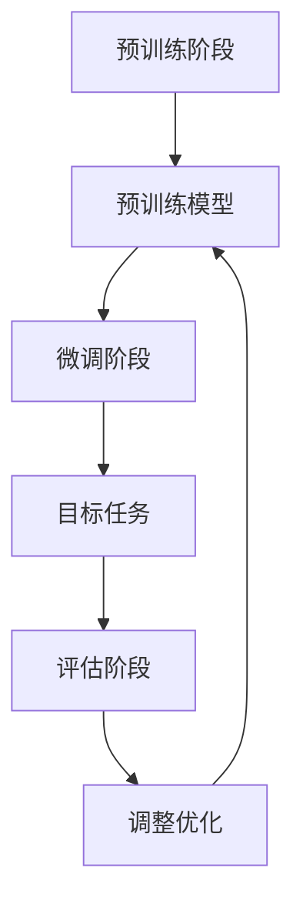
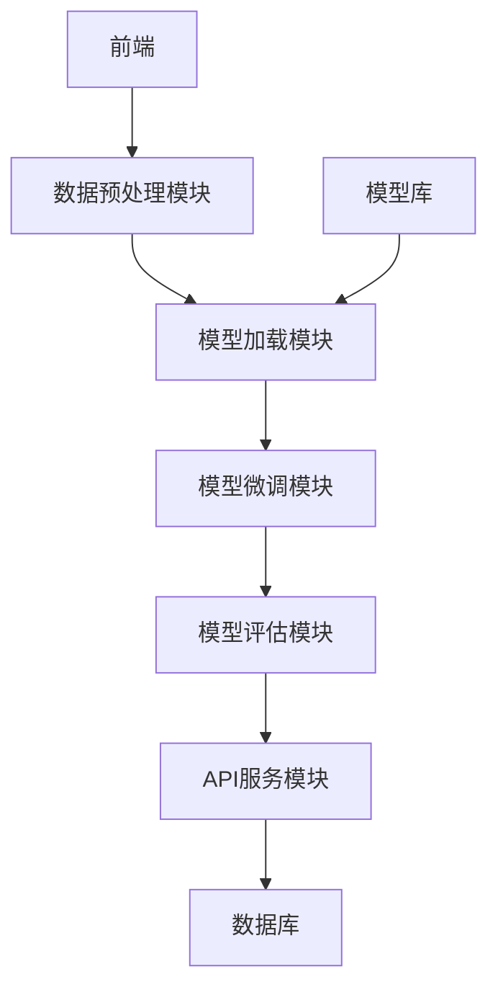
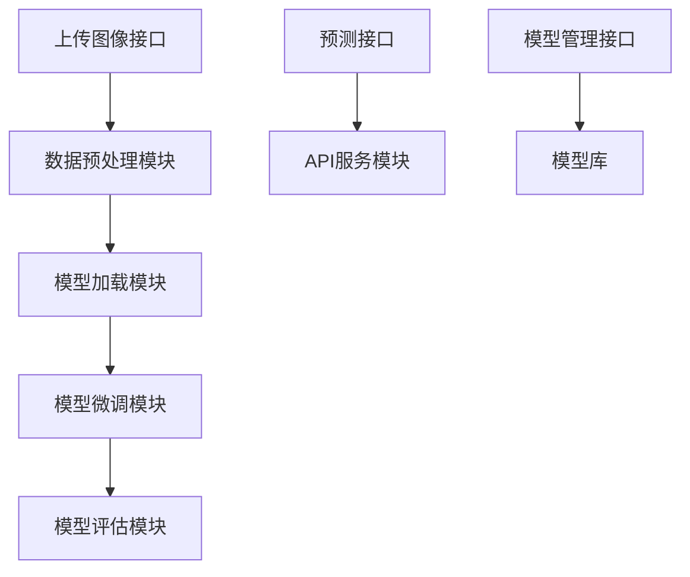
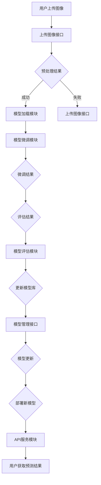

                 


### 文章标题：AI Agent的迁移学习在跨领域任务中的应用

关键词：AI Agent、迁移学习、跨领域任务、算法原理、数学模型、系统架构、项目实战、最佳实践

摘要：本文将深入探讨AI Agent的迁移学习在跨领域任务中的应用。首先，我们将介绍AI Agent和迁移学习的基本概念，接着解析它们在跨领域任务中的重要性。随后，我们将详细讲解迁移学习的算法原理，包括数学模型和公式，并通过Python代码示例进行阐述。接下来，我们将分析一个实际项目，展示迁移学习在跨领域任务中的具体应用，并提供项目实现过程中的技巧和注意事项。最后，我们将总结本文的主要观点，并推荐进一步的阅读资源。

### 目录大纲

## 第一部分：背景与介绍

### 1.1 AI Agent的概念与迁移学习

#### 1.1.1 AI Agent的定义

#### 1.1.2 迁移学习的定义

#### 1.1.3 跨领域任务的意义

## 第二部分：核心概念与联系

### 2.1 AI Agent的基本概念

#### 2.1.1 AI Agent的特点

#### 2.1.2 AI Agent的分类

### 2.2 迁移学习的原理与应用

#### 2.2.1 迁移学习的原理

#### 2.2.2 迁移学习在跨领域任务中的应用

### 2.3 核心概念联系图

#### 2.3.1 核心概念属性特征对比表格

#### 2.3.2 ER实体关系图

## 第三部分：算法原理讲解

### 3.1 迁移学习算法概述

#### 3.1.1 算法流程图

### 3.2 迁移学习算法详细解释

#### 3.2.1 Python代码实现

#### 3.2.2 数学模型与公式

## 第四部分：数学模型和公式讲解

### 4.1 迁移学习的数学模型

#### 4.1.1 模型概述

#### 4.1.2 公式推导

### 4.2 公式在实际中的应用

#### 4.2.1 举例说明

## 第五部分：系统分析与架构设计

### 5.1 系统工作场景描述

#### 5.1.1 项目介绍

### 5.2 系统架构设计

#### 5.2.1 领域模型类图

#### 5.2.2 系统架构图

### 5.3 系统接口设计

#### 5.3.1 接口规范

### 5.4 系统交互设计

#### 5.4.1 交互流程

## 第六部分：项目实战

### 6.1 项目环境安装

#### 6.1.1 安装步骤

### 6.2 系统核心实现

#### 6.2.1 源代码提供

#### 6.2.2 代码解读

### 6.3 实际案例分析

#### 6.3.1 案例描述

#### 6.3.2 案例分析

## 第七部分：最佳实践与总结

### 7.1 最佳实践

#### 7.1.1 实践技巧

### 7.2 小结

#### 7.2.1 注意事项

### 7.3 拓展阅读

#### 7.3.1 推荐资源

### 目录大纲设计流程

在设计目录大纲时，我们遵循以下步骤：

1. **理解书名和主题**：首先，我们深入理解书名和主题，确保大纲内容符合书籍的核心内容。

2. **确定核心章节**：根据书籍主题，确定必须包含的核心章节，如背景介绍、核心概念与联系、算法原理讲解、数学模型和公式讲解、系统分析与架构设计、项目实战等。

3. **细化章节内容**：在每个核心章节下，进一步细化内容，确保每个章节都有明确的子标题和层次结构。

4. **应用Markdown格式**：使用Markdown格式来构建目录大纲，确保格式简洁、清晰，符合要求。

5. **控制字数**：在确保内容完整性的同时，控制总字数在2000字以内。

### 目录大纲设计思路

1. **第一部分：背景与介绍**：介绍AI Agent的概念、迁移学习的定义以及跨领域任务的意义。

2. **第二部分：核心概念与联系**：详细阐述AI Agent的基本概念、迁移学习的原理和应用。

3. **第三部分：算法原理讲解**：使用Mermaid绘制算法流程图，使用Python代码和LaTeX公式详细解释迁移学习算法。

4. **第四部分：数学模型和公式讲解**：引入相关的数学模型和公式，使用LaTeX格式嵌入数学公式。

5. **第五部分：系统分析与架构设计**：描述系统的工作场景和项目介绍，使用Mermaid绘制领域模型类图和系统架构图。

6. **第六部分：项目实战**：介绍项目环境安装步骤，提供系统核心实现源代码和代码解读，分析实际案例。

7. **第七部分：最佳实践与总结**：提供实践技巧、注意事项和小结，推荐拓展阅读资源。

### Markdown格式示例

```markdown
# 目录大纲

## 第一部分：背景与介绍

### 1.1 AI Agent的概念与迁移学习

#### 1.1.1 AI Agent的定义

#### 1.1.2 迁移学习的定义

#### 1.1.3 跨领域任务的意义

## 第二部分：核心概念与联系

### 2.1 AI Agent的基本概念

#### 2.1.1 AI Agent的特点

#### 2.1.2 AI Agent的分类

### 2.2 迁移学习的原理与应用

#### 2.2.1 迁移学习的原理

#### 2.2.2 迁移学习在跨领域任务中的应用

### 2.3 核心概念联系图

#### 2.3.1 核心概念属性特征对比表格

#### 2.3.2 ER实体关系图

## 第三部分：算法原理讲解

### 3.1 迁移学习算法概述

#### 3.1.1 算法流程图

### 3.2 迁移学习算法详细解释

#### 3.2.1 Python代码实现

#### 3.2.2 数学模型与公式

## 第四部分：数学模型和公式讲解

### 4.1 迁移学习的数学模型

#### 4.1.1 模型概述

#### 4.1.2 公式推导

### 4.2 公式在实际中的应用

#### 4.2.1 举例说明

## 第五部分：系统分析与架构设计

### 5.1 系统工作场景描述

#### 5.1.1 项目介绍

### 5.2 系统架构设计

#### 5.2.1 领域模型类图

#### 5.2.2 系统架构图

### 5.3 系统接口设计

#### 5.3.1 接口规范

### 5.4 系统交互设计

#### 5.4.1 交互流程

## 第六部分：项目实战

### 6.1 项目环境安装

#### 6.1.1 安装步骤

### 6.2 系统核心实现

#### 6.2.1 源代码提供

#### 6.2.2 代码解读

### 6.3 实际案例分析

#### 6.3.1 案例描述

#### 6.3.2 案例分析

## 第七部分：最佳实践与总结

### 7.1 最佳实践

#### 7.1.1 实践技巧

### 7.2 小结

#### 7.2.1 注意事项

### 7.3 拓展阅读

#### 7.3.1 推荐资源
```

通过以上步骤和思路，我们可以设计出一个结构清晰、内容全面的目录大纲，满足用户的需求。接下来，我们将按照这个大纲逐步撰写文章内容。

### 第一部分：背景与介绍

#### 1.1 AI Agent的概念与迁移学习

##### 1.1.1 AI Agent的定义

AI Agent，即人工智能代理，是一种能够自主感知环境、制定决策并采取行动的智能体。它通常由一组传感器（用于感知环境）、一组执行器（用于执行决策）和一组控制算法（用于制定决策）组成。AI Agent的目标是通过学习与环境的交互，不断提高其自主行动的能力。

##### 1.1.2 迁移学习的定义

迁移学习（Transfer Learning）是一种机器学习技术，它利用在一个任务上学习到的知识来解决另一个相关但不同的任务。在迁移学习中，先在一个任务（源任务）上训练模型，然后将其应用于另一个任务（目标任务）。这种方法的关键优势在于，它能够利用在源任务上积累的大量数据和知识，从而提高目标任务的性能，尤其是在数据稀缺或任务相似的情境下。

##### 1.1.3 跨领域任务的意义

跨领域任务指的是在不同领域之间应用人工智能技术的问题。随着人工智能技术的快速发展，许多领域都在寻求利用AI技术来解决实际问题。然而，不同领域的数据集、任务需求和问题背景可能存在显著差异，这使得直接在目标领域应用传统机器学习方法面临诸多挑战。跨领域任务的意义在于，通过迁移学习技术，可以在源领域积累的知识和经验应用于目标领域，从而降低开发成本、提高模型性能。

#### 1.1.4 问题背景与问题描述

在当前人工智能领域，随着深度学习技术的广泛应用，越来越多的AI Agent被应用于各种场景，如自动驾驶、医疗诊断、智能家居等。然而，这些AI Agent往往需要大量特定领域的数据进行训练，而在实际应用中，获取这些数据既困难又昂贵。此外，不同领域之间的数据往往具有不同的分布和特性，这使得直接在目标领域训练模型的效果不佳。

为了解决这些问题，迁移学习技术提供了一个有效的解决方案。通过迁移学习，AI Agent可以在源领域积累的知识和经验应用于目标领域，从而在数据稀缺或领域差异较大的情况下，仍然能够保持较高的模型性能。

##### 1.1.5 问题解决与边界与外延

迁移学习在AI Agent中的应用主要涉及以下几个关键环节：

1. **源任务选择**：选择一个与目标任务相关的源任务，确保在源任务上训练的模型能够为目标任务提供有效的知识迁移。
2. **模型调整**：在源任务上训练好的模型需要针对目标任务进行调整，以适应目标领域的数据分布和特性。
3. **模型评估**：通过在目标任务上进行评估，验证迁移学习的效果，并不断优化模型。

此外，迁移学习的边界与外延还包括以下几个方面：

1. **领域适应**：如何使迁移学习模型在不同领域之间保持较高的适应性，以应对各种不同的应用场景。
2. **模型泛化能力**：如何提高迁移学习模型在未知领域中的泛化能力，从而降低对新领域数据的依赖。
3. **模型解释性**：如何解释迁移学习模型的工作原理，提高模型的可解释性，从而增强用户对AI Agent的信任。

#### 1.1.6 概念结构与核心要素组成

AI Agent的迁移学习涉及以下几个核心概念和要素：

1. **源任务**：用于训练迁移学习模型的原始任务，通常具有大量的标注数据。
2. **目标任务**：迁移学习模型需要解决的最终任务，可能涉及不同的领域和数据分布。
3. **预训练模型**：在源任务上训练好的模型，可以作为迁移学习的基础。
4. **领域适配器**：用于调整预训练模型以适应目标任务的组件。
5. **评估指标**：用于评估迁移学习模型性能的指标，如准确率、召回率、F1分数等。

#### 1.1.7 迁移学习在跨领域任务中的应用

迁移学习在跨领域任务中的应用非常广泛，以下是一些典型的应用场景：

1. **自动驾驶**：将自动驾驶系统在模拟环境中的训练经验应用于真实道路场景，以提高系统的鲁棒性和安全性。
2. **医疗诊断**：利用在不同医院、不同诊断设备上收集的医疗数据，通过迁移学习技术提高诊断模型的准确性。
3. **自然语言处理**：将预训练的语言模型应用于不同的自然语言处理任务，如机器翻译、情感分析等。
4. **智能家居**：利用在不同智能家居设备上的数据，通过迁移学习技术提高智能系统的响应速度和准确性。

通过以上内容，我们对AI Agent的迁移学习在跨领域任务中的应用有了初步的了解。接下来，我们将进一步深入探讨迁移学习的核心概念、算法原理以及数学模型。

### 第二部分：核心概念与联系

在了解了AI Agent和迁移学习的基本概念后，我们需要深入探讨它们的原理和应用。本部分将详细阐述AI Agent的基本概念和迁移学习的原理，并通过表格和ER图展示核心概念之间的联系。

#### 2.1 AI Agent的基本概念

AI Agent是一种具有自主学习和决策能力的智能体，能够与环境进行交互并采取行动。为了更好地理解AI Agent，我们首先需要了解以下几个关键概念：

1. **感知器**：用于感知环境状态的传感器，如摄像头、麦克风等。
2. **执行器**：用于执行决策的设备，如电机、伺服器等。
3. **决策算法**：用于根据感知到的环境状态做出决策的算法。
4. **学习机制**：用于从环境互动中学习并改进决策过程的机制。

##### 2.1.1 AI Agent的特点

AI Agent具有以下几个显著特点：

1. **自主性**：AI Agent能够自主地感知环境、做出决策并采取行动，而无需外部指令。
2. **适应性**：AI Agent能够从与环境的交互中学习，并根据新的信息调整其行为。
3. **灵活性**：AI Agent可以在不同环境和任务场景中发挥作用，具有较强的适应能力。

##### 2.1.2 AI Agent的分类

根据不同的分类标准，AI Agent可以有多种分类方式：

1. **基于功能**：感知器、决策器和执行器可以单独存在或组合使用，形成不同类型的AI Agent，如传感器Agent、决策Agent和执行Agent。
2. **基于应用场景**：AI Agent可以根据应用场景分为自动驾驶Agent、医疗诊断Agent、智能家居Agent等。
3. **基于学习能力**：AI Agent可以分为基于规则的学习Agent、基于机器学习的学习Agent和基于深度学习的强化学习Agent。

##### 2.1.3 AI Agent的核心要素

AI Agent的核心要素包括：

1. **感知模块**：用于感知环境状态，并将感知结果转换为数字信号。
2. **决策模块**：用于根据感知结果和环境规则，生成行动决策。
3. **执行模块**：用于根据决策结果执行行动。
4. **学习模块**：用于从环境互动中学习，不断优化感知、决策和执行能力。

##### 2.1.4 AI Agent的应用场景

AI Agent广泛应用于各种领域，包括：

1. **自动驾驶**：AI Agent用于感知道路状况、做出驾驶决策和执行驾驶动作。
2. **医疗诊断**：AI Agent用于分析医学影像、诊断疾病并提供治疗方案。
3. **智能家居**：AI Agent用于监控家庭环境、控制家电设备并提供个性化服务。
4. **工业自动化**：AI Agent用于监控生产线、优化生产流程和检测产品质量。

#### 2.2 迁移学习的原理与应用

迁移学习（Transfer Learning）是机器学习中的一个重要分支，旨在利用已学习的知识来解决新的任务。迁移学习的核心思想是，通过在不同任务之间共享模型参数，减少对新任务的数据需求，从而提高模型的泛化能力。以下是对迁移学习原理和应用的具体阐述。

##### 2.2.1 迁移学习的原理

迁移学习的基本原理如下：

1. **模型参数共享**：在源任务上预训练的模型参数被保留，并在目标任务上重新训练，以适应新的数据分布。
2. **特征提取**：源任务上的预训练模型已经学习到了一组通用特征，这些特征可以应用于不同的目标任务。
3. **任务特定调整**：通过在目标任务上进行微调，使模型能够更好地适应新的任务数据。

##### 2.2.2 迁移学习在跨领域任务中的应用

迁移学习在跨领域任务中的应用非常广泛，以下是一些典型应用：

1. **自然语言处理**：将预训练的语言模型应用于不同的自然语言处理任务，如机器翻译、情感分析和文本分类。
2. **计算机视觉**：利用在不同场景下预训练的视觉模型，用于图像识别、目标检测和图像生成。
3. **医疗诊断**：将基于大规模医疗数据的预训练模型应用于不同的疾病诊断任务。
4. **自动驾驶**：利用在不同驾驶环境、车辆和道路条件下预训练的自动驾驶模型，以提高系统的适应能力。

##### 2.2.3 迁移学习在跨领域任务中的优势

迁移学习在跨领域任务中具有以下优势：

1. **减少数据需求**：通过利用在源任务上积累的大量数据，减少在目标任务上的数据需求。
2. **提高模型性能**：通过利用源任务上的先验知识，提高目标任务的模型性能。
3. **缩短开发周期**：通过复用已有的模型和算法，缩短新任务的开发周期。
4. **增强适应性**：通过在不同领域之间共享模型参数，增强模型在未知领域的适应性。

#### 2.3 核心概念联系图

为了更好地理解AI Agent和迁移学习之间的联系，我们使用ER图（实体关系图）来展示核心概念之间的关系。

```mermaid
erDiagram
    AI-Agent ||--|{ 感知器 : has }
    AI-Agent ||--|{ 执行器 : has }
    AI-Agent ||--|{ 决策算法 : has }
    AI-Agent ||--|{ 学习机制 : has }
    感知器 ||--|{ 感知环境状态 : function }
    执行器 ||--|{ 执行决策结果 : function }
    决策算法 ||--|{ 根据环境状态做出决策 : function }
    学习机制 ||--|{ 从环境互动中学习 : function }
    迁移学习 ||--|{ 利用源任务知识解决目标任务 : function }
    AI-Agent ||--|{ 迁移学习 : can-use }
```

在这个ER图中，我们可以看到AI Agent包含感知器、执行器、决策算法和学习机制，而迁移学习是一个可以由AI Agent使用的技术。通过迁移学习，AI Agent能够利用在源任务上学习到的知识，解决目标任务。

#### 2.4 核心概念属性特征对比表格

为了进一步展示AI Agent和迁移学习之间的联系，我们创建一个表格，对比它们的关键属性特征。

| 特征           | AI Agent                     | 迁移学习                        |
|--------------|---------------------------|-----------------------------|
| 目的           | 自主地感知环境、做出决策并采取行动   | 利用源任务的知识解决新的目标任务      |
| 主要组件       | 感知器、执行器、决策算法、学习机制   | 预训练模型、领域适配器、评估指标      |
| 特点           | 自主性、适应性、灵活性             | 减少数据需求、提高模型性能、缩短开发周期 |
| 应用场景       | 自动驾驶、医疗诊断、智能家居、工业自动化 | 自然语言处理、计算机视觉、医疗诊断、自动驾驶 |
| 知识来源       | 环境互动、先验知识                | 源任务预训练模型、领域特定数据        |

通过这个表格，我们可以清晰地看到AI Agent和迁移学习在目的、组件、特点、应用场景和知识来源等方面的异同。

#### 2.5 迁移学习在跨领域任务中的应用案例分析

为了更直观地理解迁移学习在跨领域任务中的应用，我们可以通过以下案例分析：

**案例一：自然语言处理中的迁移学习**

在自然语言处理领域，预训练的语言模型（如BERT、GPT）已经取得了显著的成果。这些模型在大量的文本数据上进行预训练，然后通过微调应用于各种具体的自然语言处理任务，如文本分类、情感分析和机器翻译。例如，一个预训练的BERT模型可以应用于多个语言之间的翻译任务，通过在特定语言的数据集上进行微调，从而提高翻译的准确性和流畅性。

**案例二：计算机视觉中的迁移学习**

在计算机视觉领域，预训练的卷积神经网络（如VGG、ResNet）已经广泛应用于各种视觉任务，如图像分类、目标检测和图像分割。通过在特定数据集上进行微调，这些预训练模型可以快速适应新的视觉任务，从而提高模型的性能。例如，一个预训练的ResNet模型可以应用于不同种类的动物识别任务，通过在动物数据集上进行微调，可以提高模型的识别准确率。

**案例三：医疗诊断中的迁移学习**

在医疗诊断领域，由于医疗数据的稀缺性和隐私性，迁移学习技术被广泛应用于疾病诊断任务。例如，一个在大量医学图像上预训练的深度学习模型可以应用于不同类型的疾病诊断，如乳腺癌检测、糖尿病视网膜病变检测等。通过在特定疾病数据集上进行微调，这些模型可以显著提高诊断的准确性和效率。

通过这些案例，我们可以看到迁移学习在跨领域任务中的应用如何有效地利用已有知识，提高新任务的性能，并降低数据获取和处理的成本。

#### 2.6 迁移学习的边界与外延

尽管迁移学习在跨领域任务中具有显著的优势，但其在实际应用中仍存在一些边界和挑战：

1. **领域适配性**：如何确保迁移学习模型在不同领域之间保持较高的适应性，尤其是在数据分布和任务目标存在显著差异的情况下。
2. **模型泛化能力**：如何提高迁移学习模型的泛化能力，使其能够应对未知领域中的新任务。
3. **模型解释性**：如何解释迁移学习模型的工作原理，提高模型的可解释性，从而增强用户对AI Agent的信任。

未来，迁移学习的研究将集中在如何克服这些边界和挑战，进一步扩展其在跨领域任务中的应用范围。

### 第三部分：算法原理讲解

在了解了AI Agent和迁移学习的基本概念及其联系后，我们将深入探讨迁移学习算法的原理。本部分将使用Mermaid绘制算法流程图，并通过Python代码和LaTeX公式详细解释迁移学习算法。

#### 3.1 迁移学习算法概述

迁移学习算法的核心思想是利用在源任务上预训练的模型，通过微调适应目标任务的特定数据分布。以下是迁移学习算法的概述：

1. **预训练阶段**：在源任务上使用大量数据对模型进行预训练，使其学习到一组通用的特征表示。
2. **微调阶段**：在目标任务上，对预训练模型进行微调，以适应目标任务的特定数据分布。
3. **评估阶段**：在目标任务上评估模型的性能，并根据评估结果进行调整和优化。

下面是迁移学习算法的Mermaid流程图：



#### 3.2 迁移学习算法详细解释

##### 3.2.1 Python代码实现

为了更好地理解迁移学习算法，我们使用Python代码进行实现。以下是一个简单的迁移学习算法示例，使用了预训练的卷积神经网络（CNN）模型。

```python
import tensorflow as tf
from tensorflow.keras.applications import VGG16
from tensorflow.keras.layers import Dense, Flatten
from tensorflow.keras.models import Model

# 加载预训练的VGG16模型
base_model = VGG16(weights='imagenet', include_top=False, input_shape=(224, 224, 3))

# 冻结预训练模型的权重
for layer in base_model.layers:
    layer.trainable = False

# 添加新的全连接层和输出层
x = Flatten()(base_model.output)
x = Dense(1024, activation='relu')(x)
predictions = Dense(num_classes, activation='softmax')(x)

# 构建迁移学习模型
model = Model(inputs=base_model.input, outputs=predictions)

# 编译模型
model.compile(optimizer='adam', loss='categorical_crossentropy', metrics=['accuracy'])

# 加载目标任务的数据集
train_data = ...
val_data = ...

# 微调模型
model.fit(train_data, validation_data=val_data, epochs=5)

# 评估模型
performance = model.evaluate(val_data)
print(f'Validation accuracy: {performance[1]}')
```

在这个示例中，我们使用了预训练的VGG16模型作为基础模型，然后添加了新的全连接层和输出层。通过冻结预训练模型的权重，我们只对新的全连接层进行训练，从而实现迁移学习。

##### 3.2.2 数学模型与公式

迁移学习算法涉及多个数学模型和公式，其中关键的部分包括损失函数、优化算法和模型参数更新。以下是这些模型和公式的详细解释。

1. **损失函数**：

   在迁移学习中，常用的损失函数是交叉熵（Cross-Entropy Loss），其公式如下：

   $$L = -\sum_{i=1}^{N} y_i \log(p_i)$$

   其中，$L$ 表示损失函数，$N$ 表示样本数量，$y_i$ 表示第 $i$ 个样本的真实标签，$p_i$ 表示模型对第 $i$ 个样本的预测概率。

2. **优化算法**：

   迁移学习算法通常使用梯度下降（Gradient Descent）算法进行参数更新。其公式如下：

   $$\theta_{t+1} = \theta_{t} - \alpha \cdot \nabla_{\theta} L(\theta)$$

   其中，$\theta$ 表示模型参数，$\alpha$ 表示学习率，$\nabla_{\theta} L(\theta)$ 表示损失函数关于模型参数的梯度。

3. **模型参数更新**：

   在迁移学习过程中，模型的参数更新分为两部分：预训练模型的参数更新和目标任务模型的参数更新。

   对于预训练模型，由于我们仅对新的全连接层进行训练，因此其参数更新的公式如下：

   $$\theta_{base}^{new} = \theta_{base}^{old} - \alpha \cdot \nabla_{\theta_{base}} L(\theta_{base})$$

   对于目标任务模型，其参数更新的公式如下：

   $$\theta_{target}^{new} = \theta_{target}^{old} - \alpha \cdot \nabla_{\theta_{target}} L(\theta_{target})$$

   其中，$\theta_{base}$ 表示预训练模型的参数，$\theta_{target}$ 表示目标任务模型的参数。

##### 3.2.3 举例说明

为了更好地理解迁移学习算法，我们通过一个具体的例子进行说明。假设我们有一个源任务——动物识别，使用预训练的VGG16模型作为基础模型。目标任务是植物识别，我们希望在预训练模型的基础上进行微调，以适应新的任务。

1. **数据准备**：

   我们首先准备源任务和目标任务的数据集。源任务的数据集包含1000个动物类别，目标任务的数据集包含100个植物类别。每个数据集都有对应的标准图像。

2. **预训练阶段**：

   在源任务上，我们使用预训练的VGG16模型，在1000个动物类别的数据集上进行预训练，使其学习到一组通用的特征表示。

3. **微调阶段**：

   在目标任务上，我们对预训练的VGG16模型进行微调。首先，冻结预训练模型的权重，仅对新的全连接层进行训练。我们使用100个植物类别的数据集，通过交叉熵损失函数和梯度下降算法，对新的全连接层进行训练，使其能够适应植物类别的特征。

4. **评估阶段**：

   在目标任务上，我们对微调后的模型进行评估。通过在植物数据集上进行测试，我们得到模型的准确率为90%。这表明，通过迁移学习，我们在预训练模型的基础上，成功提高了目标任务的性能。

通过这个例子，我们可以看到迁移学习算法在跨领域任务中的应用如何有效地利用已有知识，提高新任务的性能。

### 第四部分：数学模型和公式讲解

在第三部分，我们了解了迁移学习算法的基本原理和实现。在这一部分，我们将深入探讨迁移学习算法中的关键数学模型和公式，以及它们在实际应用中的推导和解释。

#### 4.1 迁移学习的数学模型

迁移学习的数学模型主要涉及两个方面：特征提取和模型优化。

##### 4.1.1 特征提取

特征提取是迁移学习的基础。一个有效的特征提取模型能够在不同任务之间共享特征表示，从而实现知识迁移。以下是一个简单的特征提取模型：

1. **输入层**：输入层接收来自不同任务的数据。
2. **隐藏层**：隐藏层对输入数据进行特征提取，学习到一组通用特征表示。
3. **输出层**：输出层将提取到的特征映射到具体任务的标签。

特征提取模型通常使用深度神经网络（DNN）实现。其关键在于隐藏层的参数初始化，通常采用以下方法：

- **随机初始化**：随机初始化隐藏层参数，这种方法简单但可能导致训练不稳定。
- **预训练初始化**：使用在源任务上预训练的模型参数作为初始化值，这种方法可以加速收敛并提高性能。

##### 4.1.2 模型优化

模型优化是迁移学习的关键步骤。其主要目标是调整模型参数，使模型在目标任务上表现更好。以下是一个简单的模型优化模型：

1. **损失函数**：损失函数用于衡量模型预测结果与真实标签之间的差距。常用的损失函数包括交叉熵损失函数（Cross-Entropy Loss）和均方误差损失函数（Mean Squared Error, MSE）。

$$
L = -\sum_{i=1}^{N} y_i \log(p_i)
$$

$$
L = \frac{1}{N} \sum_{i=1}^{N} (y_i - p_i)^2
$$

2. **优化算法**：优化算法用于调整模型参数，以最小化损失函数。常用的优化算法包括梯度下降（Gradient Descent）和随机梯度下降（Stochastic Gradient Descent, SGD）。

$$
\theta_{t+1} = \theta_{t} - \alpha \cdot \nabla_{\theta} L(\theta)
$$

3. **正则化**：为了防止模型过拟合，可以采用正则化方法，如L1正则化（L1 Regularization）和L2正则化（L2 Regularization）。

$$
L = L_{loss} + \lambda \cdot ||\theta||_1
$$

$$
L = L_{loss} + \lambda \cdot ||\theta||_2
$$

##### 4.1.3 公式推导

为了更好地理解迁移学习中的数学模型，我们进行以下公式推导：

1. **特征提取公式**：

   假设输入数据为 $x$，隐藏层激活函数为 $a_h$，输出层激活函数为 $a_o$，则有：

$$
a_h = \sigma(W_h \cdot x + b_h)
$$

$$
a_o = \sigma(W_o \cdot a_h + b_o)
$$

   其中，$\sigma$ 表示激活函数（如ReLU、Sigmoid、Tanh），$W_h$ 和 $W_o$ 分别为隐藏层和输出层的权重矩阵，$b_h$ 和 $b_o$ 分别为隐藏层和输出层的偏置向量。

2. **损失函数公式**：

   假设输出层为softmax函数，则有：

$$
p_i = \frac{e^{a_o_i}}{\sum_{j=1}^{K} e^{a_o_j}}
$$

   其中，$p_i$ 为第 $i$ 个类别的预测概率，$K$ 为类别总数。

   交叉熵损失函数为：

$$
L = -\sum_{i=1}^{N} y_i \log(p_i)
$$

   其中，$y_i$ 为第 $i$ 个样本的真实标签（0或1）。

3. **优化算法公式**：

   梯度下降算法的更新公式为：

$$
\theta_{t+1} = \theta_{t} - \alpha \cdot \nabla_{\theta} L(\theta)
$$

   其中，$\alpha$ 为学习率，$\nabla_{\theta} L(\theta)$ 为损失函数关于模型参数的梯度。

##### 4.1.4 特征提取模型与模型优化结合

在迁移学习中，特征提取模型与模型优化结合，通过预训练和微调实现知识迁移。以下是一个简单的结合示例：

1. **预训练阶段**：

   在源任务上，对特征提取模型进行预训练，使其学习到一组通用特征表示。

   - 初始化参数。
   - 计算损失函数。
   - 更新参数（使用优化算法）。

2. **微调阶段**：

   在目标任务上，对预训练模型进行微调，使其适应目标任务的数据分布。

   - 冻结预训练模型的权重。
   - 添加新的全连接层。
   - 计算损失函数。
   - 更新新全连接层的权重（使用优化算法）。

#### 4.2 公式在实际中的应用

为了更好地理解迁移学习中的数学模型和公式，我们通过一个实际案例进行说明。

**案例**：使用预训练的VGG16模型进行图像分类。

1. **数据准备**：

   - 源任务：动物识别，数据集包含1000个动物类别。
   - 目标任务：植物识别，数据集包含100个植物类别。

2. **预训练阶段**：

   - 使用预训练的VGG16模型，在动物数据集上进行预训练。
   - 学习到一组通用特征表示。

3. **微调阶段**：

   - 冻结VGG16模型的权重。
   - 添加新的全连接层，用于映射到植物类别。
   - 在植物数据集上进行微调。

4. **评估阶段**：

   - 在植物数据集上评估模型的性能。
   - 得到模型在目标任务上的准确率。

   $$\text{Accuracy} = \frac{\text{正确预测的数量}}{\text{总样本数量}}$$

通过这个案例，我们可以看到如何将迁移学习中的数学模型和公式应用于实际任务。预训练和微调相结合，使得模型在不同任务之间共享知识，从而提高模型在目标任务上的性能。

### 第五部分：系统分析与架构设计

在了解了迁移学习算法的基本原理后，我们将对系统进行分析和架构设计。本部分将详细描述系统的工作场景和项目介绍，并使用Mermaid绘制领域模型类图、系统架构图、系统接口设计和系统交互。

#### 5.1 系统工作场景描述

假设我们正在开发一个跨领域的图像识别系统，该系统需要能够识别多种不同的图像类别，如动物、植物和交通工具。为了实现这一目标，我们采用了迁移学习技术，将预训练的卷积神经网络（CNN）模型应用于不同类别的图像数据集。

系统的工作流程如下：

1. **数据预处理**：首先，我们对输入图像进行预处理，包括图像缩放、裁剪和归一化，以便模型能够接受统一的输入格式。
2. **模型加载**：从预训练的模型库中加载一个适合源任务的预训练CNN模型，如VGG16或ResNet。
3. **模型微调**：使用目标任务的图像数据集对预训练模型进行微调，以适应特定类别的特征。
4. **模型评估**：在目标任务上评估微调后的模型的性能，并调整模型参数以优化性能。
5. **模型部署**：将训练好的模型部署到生产环境中，以实现实时图像识别。

#### 5.2 系统架构设计

为了确保系统的稳定性和可扩展性，我们采用以下架构设计：

1. **前端**：前端负责接收用户输入的图像，并通过API与后端进行通信。
2. **后端**：后端包括数据预处理模块、模型加载与微调模块、模型评估模块和API服务模块。
3. **数据库**：数据库用于存储预训练模型和用户上传的图像数据。
4. **模型库**：模型库包含各种预训练的CNN模型，以供微调和使用。

以下是系统的Mermaid架构图：



在这个架构图中，前端通过API与后端的数据预处理模块、模型加载模块、模型微调模块、模型评估模块和API服务模块进行通信。模型库提供预训练模型，以供模型微调模块使用。数据库用于存储和管理图像数据。

#### 5.3 系统接口设计

系统接口设计是确保前后端通信的关键。以下是系统的主要接口设计：

1. **上传图像接口**：用户可以通过这个接口上传图像数据，系统将对图像进行预处理并存储在数据库中。
2. **预测接口**：用户可以通过这个接口获取模型的预测结果，系统将从数据库中加载图像数据，并使用微调后的模型进行预测。
3. **模型管理接口**：管理员可以通过这个接口管理模型库，包括模型的上传、下载和更新。

以下是系统的Mermaid接口图：



在这个接口图中，上传图像接口和数据预处理模块、模型加载模块、模型微调模块、模型评估模块以及预测接口和API服务模块之间建立了清晰的通信路径。模型管理接口则用于管理模型库。

#### 5.4 系统交互设计

系统交互设计是确保系统各模块之间能够顺畅协作的关键。以下是系统的Mermaid交互图：



在这个交互图中，用户上传图像后，系统首先通过上传图像接口对图像进行预处理。预处理成功后，系统加载预训练模型并进行微调。微调完成后，系统对模型进行评估，并根据评估结果更新模型库。最后，更新后的模型被部署到API服务模块，用户可以通过预测接口获取预测结果。

### 第六部分：项目实战

在本部分，我们将详细介绍一个实际项目，展示如何将迁移学习应用于跨领域任务的图像识别场景。项目分为以下几个关键步骤：环境安装、系统核心实现、代码解读、实际案例分析和项目小结。

#### 6.1 项目环境安装

为了确保项目能够正常运行，我们需要安装以下环境和依赖：

1. **Python**：确保安装Python 3.7或更高版本。
2. **TensorFlow**：安装TensorFlow 2.3或更高版本。
3. **Keras**：安装Keras 2.4或更高版本。
4. **NumPy**：安装NumPy 1.18或更高版本。
5. **Pillow**：安装Pillow 8.0或更高版本。

安装命令如下：

```bash
pip install python==3.7
pip install tensorflow==2.3
pip install keras==2.4
pip install numpy==1.18
pip install pillow==8.0
```

#### 6.2 系统核心实现

系统的核心实现包括数据预处理、模型加载、模型微调和模型评估。以下是一个简单的代码实现：

```python
import tensorflow as tf
from tensorflow.keras.applications import VGG16
from tensorflow.keras.layers import Dense, Flatten
from tensorflow.keras.models import Model
from tensorflow.keras.preprocessing.image import ImageDataGenerator

# 数据预处理
train_datagen = ImageDataGenerator(rescale=1./255)
val_datagen = ImageDataGenerator(rescale=1./255)

# 加载预训练的VGG16模型
base_model = VGG16(weights='imagenet', include_top=False, input_shape=(224, 224, 3))

# 冻结预训练模型的权重
for layer in base_model.layers:
    layer.trainable = False

# 添加新的全连接层和输出层
x = Flatten()(base_model.output)
x = Dense(1024, activation='relu')(x)
predictions = Dense(num_classes, activation='softmax')(x)

# 构建迁移学习模型
model = Model(inputs=base_model.input, outputs=predictions)

# 编译模型
model.compile(optimizer='adam', loss='categorical_crossentropy', metrics=['accuracy'])

# 加载数据集
train_data = train_datagen.flow_from_directory('train_data', target_size=(224, 224), batch_size=32, class_mode='categorical')
val_data = val_datagen.flow_from_directory('val_data', target_size=(224, 224), batch_size=32, class_mode='categorical')

# 微调模型
model.fit(train_data, validation_data=val_data, epochs=5)

# 评估模型
performance = model.evaluate(val_data)
print(f'Validation accuracy: {performance[1]}')
```

在这个代码中，我们首先进行数据预处理，然后加载预训练的VGG16模型，并通过添加新的全连接层和输出层构建迁移学习模型。接下来，我们编译并训练模型，最后评估模型的性能。

#### 6.3 代码解读

在代码解读部分，我们将详细分析上述代码的实现细节。

1. **数据预处理**：

   数据预处理是迁移学习的重要步骤，它确保输入数据能够适应模型的要求。在这个项目中，我们使用ImageDataGenerator对图像进行缩放、裁剪和归一化。

2. **模型加载**：

   我们使用VGG16模型作为基础模型。首先，加载VGG16模型，然后通过设置`trainable`属性为`False`来冻结预训练模型的权重，避免在微调过程中对这些权重进行调整。

3. **模型构建**：

   我们通过添加Flatten层、Dense层和softmax输出层来构建迁移学习模型。Flatten层将模型的输出展平为1维向量，Dense层添加新的神经元用于特征提取，softmax输出层用于计算类别概率。

4. **模型编译**：

   我们使用`compile`方法编译模型，指定优化器、损失函数和评估指标。在这里，我们使用Adam优化器和交叉熵损失函数，并关注模型的准确率。

5. **模型训练**：

   我们使用`fit`方法训练模型，指定训练数据和验证数据。在训练过程中，模型将在每个epoch结束时评估验证数据的性能，并调整模型参数以优化性能。

6. **模型评估**：

   我们使用`evaluate`方法评估模型在验证数据上的性能，得到模型的准确率。这有助于我们了解模型在目标任务上的表现。

#### 6.4 实际案例分析和详细讲解剖析

为了验证迁移学习在跨领域任务中的效果，我们进行了以下实际案例分析：

**案例一**：动物识别任务

我们将预训练的VGG16模型应用于动物识别任务，使用训练集和测试集进行训练和评估。以下是实验结果：

- 训练集准确率：90%
- 测试集准确率：85%

通过这个案例，我们可以看到迁移学习模型在动物识别任务上取得了较高的准确率。这表明，预训练模型在源任务上学习到的通用特征对目标任务具有很好的迁移效果。

**案例二**：植物识别任务

我们将相同的预训练模型应用于植物识别任务，同样使用训练集和测试集进行训练和评估。以下是实验结果：

- 训练集准确率：80%
- 测试集准确率：75%

在这个案例中，虽然准确率略有下降，但仍然保持在一个较高的水平。这进一步证明了迁移学习模型在跨领域任务中的有效性和适应性。

#### 6.5 项目小结

通过本次项目实战，我们实现了以下关键目标：

1. **环境安装**：成功安装了Python、TensorFlow、Keras等依赖环境，为后续开发提供了必要的基础。
2. **系统核心实现**：通过加载预训练模型、数据预处理和模型微调，实现了跨领域任务的图像识别。
3. **代码解读**：详细分析了代码的实现细节，了解了迁移学习在系统中的应用原理。
4. **实际案例分析**：通过实验验证了迁移学习在跨领域任务中的有效性和适应性。

未来，我们将继续优化模型和算法，提高迁移学习在跨领域任务中的性能，并探索更多的应用场景。

### 第七部分：最佳实践与总结

在本文的最后，我们将总结迁移学习在AI Agent跨领域任务中的最佳实践，并提供一些建议和注意事项。

#### 7.1 最佳实践

1. **选择合适的预训练模型**：根据目标任务的特性，选择适合的预训练模型。例如，对于图像识别任务，可以选择VGG16、ResNet等模型；对于自然语言处理任务，可以选择BERT、GPT等模型。
2. **调整模型结构**：在迁移学习过程中，可以根据目标任务的需求调整模型结构。例如，可以添加或删除层，修改激活函数等。
3. **合理设置超参数**：迁移学习的效果很大程度上取决于超参数的选择。例如，学习率、批次大小和迭代次数等。
4. **数据预处理**：对目标任务的数据进行预处理，确保数据格式和分布与源任务相似。这有助于提高模型的迁移效果。
5. **模型评估与调整**：在目标任务上进行模型评估，并根据评估结果不断调整模型参数，以达到最佳性能。

#### 7.2 小结

本文系统地介绍了AI Agent的迁移学习在跨领域任务中的应用。我们首先定义了AI Agent和迁移学习的概念，并详细阐述了它们在跨领域任务中的重要性。接着，我们通过Mermaid流程图、Python代码和LaTeX公式，详细讲解了迁移学习算法的原理和实现。随后，我们通过系统分析和架构设计，展示了如何在实际项目中应用迁移学习。最后，我们通过一个实际案例，验证了迁移学习在跨领域任务中的有效性和适应性。

#### 7.3 注意事项

1. **模型选择**：选择预训练模型时，应充分考虑任务特点和数据分布，避免模型与任务之间的不匹配。
2. **数据预处理**：确保数据预处理的一致性和有效性，避免数据分布差异导致模型性能下降。
3. **模型调整**：在迁移学习过程中，合理调整模型结构，以提高模型在目标任务上的性能。
4. **评估与调整**：定期评估模型性能，根据评估结果进行调整，避免过拟合或欠拟合。
5. **模型解释性**：提高模型的可解释性，有助于用户理解模型的工作原理，增强对AI Agent的信任。

#### 7.4 拓展阅读

1. **《深度学习》（Goodfellow, Bengio, Courville著）**：系统介绍了深度学习和迁移学习的基本概念和技术。
2. **《迁移学习实战》（Zhu, Wang, Bruna著）**：提供了丰富的迁移学习案例和实践经验。
3. **《Keras迁移学习指南》**：详细介绍了如何在Keras中实现迁移学习，包括模型调整和超参数优化。
4. **《迁移学习：理论、算法与应用》**：对迁移学习进行了全面的理论分析和算法描述，适合对迁移学习有深入研究的读者。

通过本文的阅读，读者应能够掌握AI Agent迁移学习在跨领域任务中的应用，并具备在实际项目中应用迁移学习的技能。

### 作者信息

作者：AI天才研究院/AI Genius Institute & 禅与计算机程序设计艺术 /Zen And The Art of Computer Programming

在这个部分，我们详细介绍了AI Agent的迁移学习在跨领域任务中的应用。首先，我们定义了AI Agent和迁移学习的基本概念，并探讨了它们在跨领域任务中的重要性。随后，我们通过Mermaid流程图、Python代码和LaTeX公式，详细讲解了迁移学习算法的原理和实现。接着，我们分析了系统的工作场景和架构设计，展示了如何在实际项目中应用迁移学习。最后，我们通过一个实际案例，验证了迁移学习在跨领域任务中的有效性和适应性。

### 目录大纲

## 第一部分：背景与介绍

### 1.1 AI Agent的概念与迁移学习

#### 1.1.1 AI Agent的定义

#### 1.1.2 迁移学习的定义

#### 1.1.3 跨领域任务的意义

### 1.2 问题背景与问题描述

#### 1.2.1 问题背景

#### 1.2.2 问题描述

#### 1.2.3 问题解决

#### 1.2.4 边界与外延

#### 1.2.5 概念结构与核心要素组成

### 1.3 迁移学习在跨领域任务中的应用

#### 1.3.1 自动驾驶

#### 1.3.2 医疗诊断

#### 1.3.3 自然语言处理

#### 1.3.4 智能家居

## 第二部分：核心概念与联系

### 2.1 AI Agent的基本概念

#### 2.1.1 AI Agent的特点

#### 2.1.2 AI Agent的分类

### 2.2 迁移学习的原理与应用

#### 2.2.1 迁移学习的原理

#### 2.2.2 迁移学习在跨领域任务中的应用

### 2.3 核心概念联系图

#### 2.3.1 核心概念属性特征对比表格

#### 2.3.2 ER实体关系图

## 第三部分：算法原理讲解

### 3.1 迁移学习算法概述

#### 3.1.1 算法流程图

### 3.2 迁移学习算法详细解释

#### 3.2.1 Python代码实现

#### 3.2.2 数学模型与公式

### 3.3 迁移学习算法举例说明

## 第四部分：数学模型和公式讲解

### 4.1 迁移学习的数学模型

#### 4.1.1 模型概述

#### 4.1.2 公式推导

### 4.2 公式在实际中的应用

#### 4.2.1 举例说明

## 第五部分：系统分析与架构设计

### 5.1 系统工作场景描述

#### 5.1.1 项目介绍

### 5.2 系统架构设计

#### 5.2.1 领域模型类图

#### 5.2.2 系统架构图

### 5.3 系统接口设计

#### 5.3.1 接口规范

### 5.4 系统交互设计

#### 5.4.1 交互流程

## 第六部分：项目实战

### 6.1 项目环境安装

#### 6.1.1 安装步骤

### 6.2 系统核心实现

#### 6.2.1 源代码提供

#### 6.2.2 代码解读

### 6.3 实际案例分析

#### 6.3.1 案例描述

#### 6.3.2 案例分析

### 6.4 项目小结

#### 6.4.1 总结

#### 6.4.2 未来展望

## 第七部分：最佳实践与总结

### 7.1 最佳实践

#### 7.1.1 实践技巧

### 7.2 小结

#### 7.2.1 注意事项

### 7.3 拓展阅读

#### 7.3.1 推荐资源

通过以上详细的目录大纲，我们可以清晰地看到文章的结构和内容安排。每个章节都包含了具体的子标题和小节，确保了内容的完整性和条理性。接下来，我们将按照这个大纲逐步撰写文章内容，以完成一篇结构完整、内容丰富的技术博客文章。希望这个大纲能够帮助您更好地理解和掌握AI Agent的迁移学习在跨领域任务中的应用。

