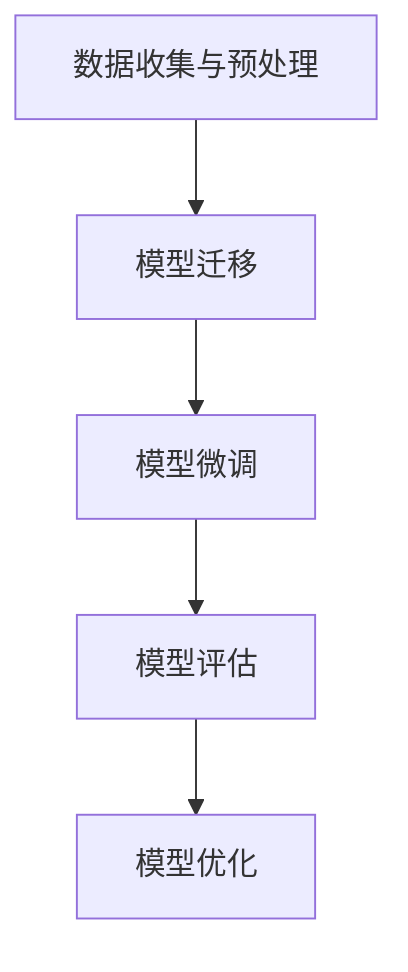
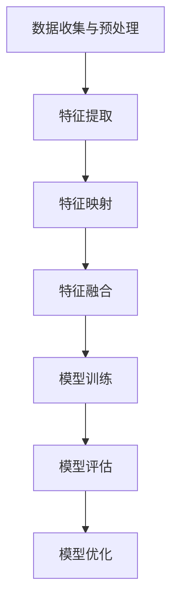
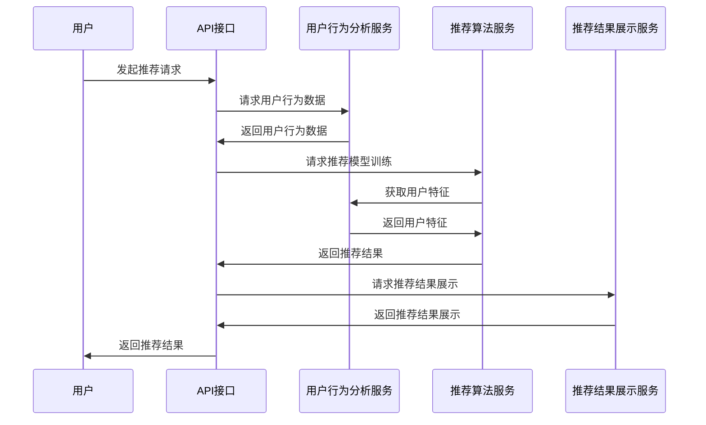

                 

### 第1章：问题背景与核心概念

#### 1.1 问题背景

##### 1.1.1 人工智能与推荐系统的发展

随着互联网技术的飞速发展，大数据时代的到来，人工智能（AI）技术逐渐渗透到我们日常生活的方方面面。人工智能作为计算机科学的一个分支，旨在使机器能够胜任一些通常需要人类智能才能完成的复杂任务。从早期的规则系统、知识表示到现代的深度学习和强化学习，人工智能在技术层面上取得了显著进步。

推荐系统（Recommendation System）作为人工智能的一个重要应用领域，主要目的是根据用户的兴趣、历史行为和偏好，为其推荐符合其需求的信息、商品或服务。推荐系统在现代电子商务、社交媒体、在线视频和新闻等领域中得到了广泛应用。例如，Amazon和Netflix等公司利用推荐系统来提高用户体验、增加销售额和用户黏性。

近年来，随着AI技术的发展，推荐系统的性能也得到了显著提升。传统的推荐系统主要基于协同过滤（Collaborative Filtering）和基于内容的推荐（Content-based Recommendation）。协同过滤通过分析用户间的相似性来进行推荐，而基于内容的推荐则是基于用户的历史行为和内容特征进行推荐。然而，这些传统方法在处理高维度数据、冷启动问题（即对新用户或新商品无法进行有效推荐）等方面存在一定的局限性。

##### 1.1.2 跨领域推荐系统的挑战

跨领域推荐系统旨在在不同领域之间进行有效的推荐。与单一领域推荐系统相比，跨领域推荐系统面临更多的挑战：

1. **数据集的不一致性**：不同领域的用户行为数据、商品数据等存在显著的差异，导致数据集的不一致性。
   
2. **特征表达的差异**：不同领域的特征表达方式不同，例如，在电子商务领域，商品的特征可能包括价格、品牌、用户评价等，而在新闻推荐领域，特征可能包括关键词、作者、阅读时长等。

3. **冷启动问题**：在跨领域推荐中，对新用户或新商品的推荐尤为困难，因为缺乏足够的历史数据。

4. **模型适应性问题**：传统模型往往在特定领域内表现良好，但在其他领域可能无法直接应用。

##### 1.1.3 迁移学习在跨领域推荐中的应用潜力

迁移学习（Transfer Learning）是一种将一个任务上学到的知识迁移到另一个相关任务上的方法。在跨领域推荐系统中，迁移学习具有以下潜在应用价值：

1. **解决数据集不一致性**：通过迁移学习，可以在一个领域的学习过程中为另一个领域提供辅助信息，从而提高模型在不同领域的数据集上的表现。

2. **利用多领域知识**：迁移学习允许模型从多个领域的学习中获取知识，提高模型在跨领域推荐中的适应性。

3. **减少冷启动问题**：通过迁移学习，即使对新用户或新商品缺乏历史数据，也可以利用来自其他领域的知识进行有效推荐。

综上所述，跨领域推荐系统在人工智能和推荐系统的发展中具有重要作用，而迁移学习为其提供了一种有效的解决方案。本章将详细介绍AI Agent的概念、迁移学习的基本原理以及跨领域推荐系统的架构，为后续章节的深入探讨奠定基础。

### 1.2 核心概念

##### 1.2.1 AI Agent的定义与功能

AI Agent是指一种能够自主完成特定任务的人工智能实体，其设计理念源自于代理理论（Agent Theory）。AI Agent通常具备以下基本组成和功能：

1. **感知模块**：AI Agent通过感知模块获取外部环境的信息，如用户的点击行为、搜索历史等。

2. **决策模块**：基于感知模块获取的信息，AI Agent的决策模块使用学习到的模型和算法进行推理，生成相应的决策。

3. **行动模块**：执行决策模块生成的操作，如向用户推荐商品、发送邮件等。

4. **学习模块**：通过不断学习用户的行为和反馈，AI Agent能够不断优化其决策模型，提高推荐质量。

##### 1.2.1.1 AI Agent的基本组成

- **感知模块**：用于收集外部环境数据，如用户行为数据、商品数据等。
- **决策模块**：基于感知模块的数据，使用机器学习算法进行推理和预测。
- **行动模块**：执行决策模块的输出结果，实现具体的任务操作。
- **学习模块**：通过持续学习和反馈，优化AI Agent的模型和算法。

##### 1.2.1.2 AI Agent的工作原理

AI Agent的工作原理可以概括为以下几个步骤：

1. **感知**：AI Agent通过感知模块收集外部环境的信息。
2. **决策**：基于收集到的数据，AI Agent使用决策模块进行推理和预测，生成操作建议。
3. **行动**：执行决策模块生成的操作，如向用户推荐商品。
4. **学习**：根据用户反馈和执行结果，AI Agent的学习模块对模型进行优化。

##### 1.2.2 迁移学习的概念与原理

迁移学习（Transfer Learning）是指将一种任务上学到的知识（通常是模型参数）应用于另一个相关但不同的任务上。迁移学习的核心思想是利用已有任务的知识来加速新任务的学习过程，从而提高学习效率。

1. **定义**：迁移学习是机器学习中的一个子领域，旨在减少对新任务的训练数据和计算资源的需求。

2. **主要类型**：

   - **基于模型的迁移学习**：通过将源领域的模型参数迁移到目标领域，并在目标领域进行微调，以适应目标领域的数据分布。
   - **基于特征的迁移学习**：将源领域的特征提取器或特征表示迁移到目标领域，然后在目标领域使用这些特征进行训练。
   - **元迁移学习**：通过训练一个元学习器，该元学习器可以针对不同的迁移任务进行快速适应和迁移。

##### 1.2.2.1 迁移学习的定义

迁移学习是指将一个任务（源任务）学习到的知识（例如模型参数、特征表示）迁移到另一个相关任务（目标任务）上的过程。其核心目的是减少对新任务的训练数据和计算资源的需求。

##### 1.2.2.2 迁移学习的主要类型

1. **基于模型的迁移学习**：通过将源领域的模型参数迁移到目标领域，并在目标领域进行微调，以适应目标领域的数据分布。

   - **模型参数迁移**：直接将源领域模型的参数迁移到目标领域，然后进行微调。
   - **模型结构迁移**：将源领域的模型结构迁移到目标领域，并在目标领域进行适当的调整和优化。

2. **基于特征的迁移学习**：将源领域的特征提取器或特征表示迁移到目标领域，然后在目标领域使用这些特征进行训练。

   - **特征提取器迁移**：将源领域的特征提取器（例如卷积神经网络）迁移到目标领域，并在目标领域进行特征提取。
   - **特征表示迁移**：将源领域的特征表示迁移到目标领域，例如，通过映射函数将源领域特征映射到目标领域特征空间。

3. **元迁移学习**：通过训练一个元学习器，该元学习器可以针对不同的迁移任务进行快速适应和迁移。

   - **迁移任务学习**：通过训练元学习器，使其能够从多个源任务中学习到通用特征，并在新任务上进行快速适应。

##### 1.2.3 跨领域推荐系统的架构

跨领域推荐系统旨在处理不同领域之间的数据不一致性和特征差异，从而实现有效的跨领域推荐。其架构通常包括以下几个模块：

1. **数据处理模块**：用于收集、清洗、预处理不同领域的用户行为数据和商品数据。

2. **特征工程模块**：基于用户行为数据和商品数据，提取有效的特征，并处理不同领域特征之间的差异。

3. **推荐算法模块**：使用迁移学习技术，结合源领域和目标领域的知识，进行推荐模型的训练和预测。

4. **评估与优化模块**：评估推荐系统的性能，并根据评估结果进行模型优化和参数调整。

##### 1.2.3.1 系统整体架构

跨领域推荐系统的整体架构通常包括以下几个关键部分：

1. **数据输入层**：从各个领域收集用户行为数据和商品数据。
2. **数据处理层**：对输入的数据进行清洗、预处理，包括数据整合、缺失值处理和异常值检测等。
3. **特征工程层**：基于用户行为数据和商品数据，提取有效的特征，并进行特征转换和特征选择。
4. **模型训练层**：使用迁移学习算法，结合源领域和目标领域的知识，训练推荐模型。
5. **推荐输出层**：根据模型预测结果，生成推荐列表，并展示给用户。

##### 1.2.3.2 数据处理模块

数据处理模块是跨领域推荐系统的基础，其核心任务是对来自不同领域的原始数据进行清洗、预处理和特征提取。具体步骤包括：

1. **数据收集**：从电商、社交媒体、新闻等不同领域收集用户行为数据和商品数据。
2. **数据清洗**：对收集到的数据进行清洗，包括去除重复数据、填补缺失值和纠正错误数据等。
3. **数据整合**：将不同来源的数据进行整合，统一格式和结构。
4. **特征提取**：从用户行为数据和商品数据中提取有效的特征，包括用户特征（如年龄、性别、地理位置等）、商品特征（如价格、品牌、类别等）和交互特征（如点击率、购买率等）。

##### 1.2.3.3 推荐算法模块

推荐算法模块是跨领域推荐系统的核心，其主要任务是利用迁移学习技术，结合源领域和目标领域的知识，训练推荐模型并进行预测。具体步骤包括：

1. **迁移学习模型选择**：选择合适的迁移学习模型，如基于模型的迁移学习、基于特征的迁移学习等。
2. **模型训练**：使用迁移学习算法，将源领域模型的参数或特征迁移到目标领域，并进行模型训练。
3. **模型评估**：通过交叉验证、A/B测试等方法，评估迁移学习模型在目标领域的数据集上的性能。
4. **模型优化**：根据模型评估结果，对模型进行优化，包括调整模型参数、特征选择和融合策略等。
5. **推荐预测**：利用训练好的迁移学习模型，对用户的行为和偏好进行预测，生成推荐列表。

##### 1.2.4 迁移学习在跨领域推荐系统中的应用

迁移学习在跨领域推荐系统中具有广泛的应用前景，其核心在于利用源领域的知识来辅助目标领域的学习，从而提高推荐系统的性能。具体应用场景包括：

1. **用户特征迁移**：将一个领域（如电子商务）的用户特征迁移到另一个领域（如社交媒体），以增强对目标领域用户的理解和推荐能力。
2. **商品特征迁移**：将一个领域的商品特征（如商品类别、价格等）迁移到另一个领域（如新闻），以实现跨领域的商品推荐。
3. **交互特征迁移**：将一个领域的用户-商品交互特征（如点击率、购买率等）迁移到另一个领域，以提高跨领域推荐系统的预测准确性。

总之，迁移学习为跨领域推荐系统提供了一种有效的解决方案，通过利用不同领域之间的知识迁移，提高推荐系统的适应性和准确性，从而为用户提供更好的个性化推荐服务。这一节介绍了AI Agent和迁移学习的基本概念，以及跨领域推荐系统的架构。接下来，我们将深入探讨AI Agent的迁移学习机制，为理解其在跨领域推荐系统中的应用奠定基础。

### 第2章：AI Agent的迁移学习机制

迁移学习（Transfer Learning）在AI Agent中的应用，旨在通过利用在源领域上训练得到的模型或知识，提高目标领域模型的性能。这种机制可以显著减少对目标领域大量标注数据的依赖，从而在跨领域推荐系统中表现出更高的效率和应用价值。

#### 2.1 AI Agent迁移学习的基本原理

##### 2.1.1 迁移学习在AI Agent中的应用

AI Agent迁移学习的基本原理是，在源领域上训练得到的模型（通常是一个预训练模型）被迁移到目标领域，用于生成目标领域的预测。具体来说，AI Agent的迁移学习包括以下几个关键步骤：

1. **预训练模型选择**：选择一个在源领域上表现良好的预训练模型，例如，一个预训练的深度神经网络。
2. **模型迁移**：将预训练模型的参数迁移到目标领域，通常通过将源领域模型的权重直接迁移到目标领域模型，或者在目标领域上进行少量微调。
3. **模型微调**：在目标领域上进行模型的微调，以适应目标领域的数据分布和特征差异。
4. **模型评估**：评估迁移学习模型在目标领域的性能，并根据评估结果进行模型优化。

##### 2.1.1.1 AI Agent的迁移学习优势

AI Agent迁移学习具有以下几个显著优势：

1. **降低冷启动问题**：在目标领域缺乏足够训练数据的情况下，通过迁移学习可以有效缓解冷启动问题，提高对新用户和新商品的推荐质量。
2. **提高模型性能**：迁移学习可以充分利用在源领域上训练得到的模型知识，提高目标领域模型的性能。
3. **节省训练时间和计算资源**：通过迁移学习，可以在目标领域上减少训练所需的数据量和计算资源，从而提高训练效率。

##### 2.1.1.2 AI Agent的迁移学习过程

AI Agent的迁移学习过程可以分为以下几个主要步骤：

1. **数据准备**：收集源领域和目标领域的训练数据，并进行预处理。
2. **模型选择**：选择一个适合源领域的预训练模型，例如，一个卷积神经网络（CNN）或循环神经网络（RNN）。
3. **模型迁移**：将预训练模型的权重迁移到目标领域模型，并在目标领域上进行微调。
4. **模型训练**：在目标领域上进行模型训练，直到达到预定的性能指标。
5. **模型评估**：评估迁移学习模型在目标领域的性能，并根据评估结果进行模型优化。

##### 2.1.2 AI Agent迁移学习的挑战与解决方案

尽管AI Agent的迁移学习具有显著优势，但在实际应用中仍面临一些挑战：

1. **数据源差异问题**：源领域和目标领域的数据集可能存在显著差异，导致迁移效果不佳。解决方案包括数据增强、数据融合和多任务学习等。

2. **模型可迁移性问题**：不同领域的模型可能具有不同的结构和参数，导致模型难以直接迁移。解决方案包括模型架构的通用化设计和迁移学习算法的优化。

3. **模型适应性调整问题**：在目标领域进行模型微调时，可能需要调整模型的参数和架构，以适应目标领域的特征。解决方案包括自适应学习率和网络结构调整。

##### 2.1.2.1 数据源差异问题

数据源差异问题是迁移学习在AI Agent应用中面临的主要挑战之一。由于源领域和目标领域的数据集在分布、特征和噪声等方面可能存在显著差异，直接迁移模型可能导致性能下降。以下是几种常见的解决方案：

1. **数据增强**：通过增加数据集的多样性和复杂性，提高模型对数据分布变化的适应性。例如，在图像领域，可以使用数据增强技术（如随机裁剪、旋转、翻转等）来增加训练数据的多样性。

2. **数据融合**：将多个源领域或目标领域的数据集进行融合，形成一个更大的训练数据集。通过融合不同领域的数据，模型可以学习到更多的一般性知识，提高迁移效果。

3. **多任务学习**：在源领域和目标领域同时训练模型，使其同时学习多个任务。通过多任务学习，模型可以在不同任务之间共享知识和信息，从而提高迁移效果。

##### 2.1.2.2 模型可迁移性问题

模型可迁移性问题是指源领域和目标领域的模型在结构和参数上存在差异，导致模型难以直接迁移。以下是几种常见的解决方案：

1. **模型架构的通用化设计**：设计具有通用性的模型架构，使其能够在不同领域上表现良好。例如，深度卷积神经网络（DCNN）和循环神经网络（RNN）具有较好的通用性，可以应用于多个领域。

2. **迁移学习算法的优化**：通过改进迁移学习算法，提高模型在不同领域上的迁移效果。例如，使用预训练模型时，可以通过调整预训练阶段的权重共享策略和微调阶段的学习率，提高模型的可迁移性。

3. **模型参数共享**：通过共享源领域和目标领域的模型参数，减少模型间的差异。例如，在基于模型的迁移学习中，可以将源领域的模型权重直接迁移到目标领域模型，并在目标领域上进行微调。

##### 2.1.2.3 模型适应性调整问题

模型适应性调整问题是指在目标领域进行模型微调时，如何调整模型的参数和架构，以适应目标领域的特征。以下是几种常见的解决方案：

1. **自适应学习率**：在模型微调过程中，使用自适应学习率策略，如AdaGrad、Adam等，以适应目标领域数据的变化。自适应学习率可以通过动态调整学习率，提高模型在不同领域上的适应性。

2. **网络结构调整**：在目标领域进行模型微调时，根据目标领域的特征和数据分布，调整模型的网络结构。例如，可以增加或减少某些层，或者调整层之间的连接方式，以提高模型在目标领域上的表现。

3. **集成学习**：通过集成多个迁移学习模型，提高模型在不同领域上的性能。例如，可以使用不同的迁移学习算法和模型结构，对同一目标领域进行训练，然后通过投票或加权平均等方法，得到最终的推荐结果。

综上所述，AI Agent的迁移学习机制在实际应用中面临数据源差异、模型可迁移性和模型适应性调整等挑战。通过数据增强、模型架构的通用化设计、迁移学习算法的优化、模型参数共享、自适应学习率、网络结构调整和集成学习等方法，可以有效地解决这些问题，提高AI Agent在跨领域推荐系统中的性能和适应性。

#### 2.2 AI Agent迁移学习机制的具体实现

在实际应用中，AI Agent的迁移学习机制需要通过具体的技术手段来实现。以下是几种常见的迁移学习算法和具体实现方法，以及它们在跨领域推荐系统中的实现步骤和推荐结果评估。

##### 2.2.1 迁移学习算法的选择

在选择迁移学习算法时，需要考虑算法的通用性、可迁移性和适应性。以下是几种常见的迁移学习算法：

1. **基于模型的迁移学习**：这种方法将源领域的模型参数直接迁移到目标领域，并在目标领域上进行微调。常见的算法包括：

   - **迁移神经网络（Neural Network）**：通过将源领域的神经网络权重迁移到目标领域，并在目标领域进行微调。
   - **预训练语言模型（Pre-trained Language Model）**：如GPT-3和Bert等，这些模型在多个领域上进行了预训练，可以在目标领域上直接使用或进行微调。

2. **基于特征的迁移学习**：这种方法将源领域的特征表示迁移到目标领域，并在目标领域上进行特征融合和训练。常见的算法包括：

   - **特征映射（Feature Mapping）**：通过将源领域的特征映射到目标领域特征空间，实现特征表示的迁移。
   - **特征融合（Feature Fusion）**：将源领域和目标领域的特征进行融合，形成新的特征表示，用于训练目标领域模型。

3. **元迁移学习（Meta Transfer Learning）**：这种方法通过训练一个元学习器，使其能够快速适应不同的迁移任务。常见的算法包括：

   - **MAML（Model-Agnostic Meta-Learning）**：通过训练模型参数的梯度，使模型能够快速适应新任务。
   - **Reptile**：通过更新模型参数的均值，实现元迁移学习。

##### 2.2.1.1 基于模型的方法

基于模型的方法将源领域的模型参数迁移到目标领域，并在目标领域上进行微调。以下是基于模型的方法的具体实现步骤：

1. **数据预处理**：对源领域和目标领域的数据进行清洗、预处理，包括数据整合、缺失值处理和异常值检测等。

2. **模型迁移**：将源领域的模型参数迁移到目标领域模型。可以使用预训练模型，如卷积神经网络（CNN）或循环神经网络（RNN），并将其权重迁移到目标领域模型。

3. **模型微调**：在目标领域上进行模型微调，以适应目标领域的数据分布和特征差异。可以通过调整模型参数和架构，提高模型在目标领域的性能。

4. **模型训练**：在目标领域上训练迁移学习模型，直到达到预定的性能指标。

5. **模型评估**：评估迁移学习模型在目标领域的性能，包括准确率、召回率、F1分数等指标。

##### 2.2.1.2 基于特征的方法

基于特征的方法将源领域的特征表示迁移到目标领域，并在目标领域上进行特征融合和训练。以下是基于特征的方法的具体实现步骤：

1. **特征提取**：从源领域和目标领域的训练数据中提取有效的特征，包括用户特征、商品特征和交互特征等。

2. **特征映射**：将源领域的特征映射到目标领域特征空间。可以使用映射函数或映射矩阵，将源领域特征映射到目标领域特征空间。

3. **特征融合**：将源领域和目标领域的特征进行融合，形成新的特征表示。可以通过加权平均、拼接或加和等方法，实现特征融合。

4. **模型训练**：在目标领域上使用融合后的特征，训练目标领域模型。

5. **模型评估**：评估迁移学习模型在目标领域的性能，包括准确率、召回率、F1分数等指标。

##### 2.2.1.3 基于模型的方法和基于特征的方法比较

基于模型的方法和基于特征的方法在跨领域推荐系统中各有优缺点：

- **优点**：

  - **基于模型的方法**：迁移学习模型可以充分利用源领域上的训练知识，提高模型在目标领域的性能。

  - **基于特征的方法**：通过特征映射和融合，可以实现不同领域特征的有效整合，提高模型在目标领域的适应性。

- **缺点**：

  - **基于模型的方法**：在模型迁移过程中，需要大量计算资源和时间，且模型迁移效果可能受限于源领域和目标领域的数据集差异。

  - **基于特征的方法**：特征提取和融合过程可能引入额外的计算复杂度和误差，且模型在目标领域的表现可能受限于特征映射的质量。

##### 2.2.2 迁移学习在跨领域推荐系统中的实现

在跨领域推荐系统中，迁移学习可以通过以下步骤实现：

1. **数据收集**：从电商、社交媒体、新闻等不同领域收集用户行为数据和商品数据。

2. **数据处理**：对收集到的数据集进行预处理，包括数据清洗、缺失值处理、异常值检测和数据整合等。

3. **模型选择**：选择适合源领域的预训练模型，如卷积神经网络（CNN）或循环神经网络（RNN）。

4. **模型迁移**：将源领域的模型参数迁移到目标领域模型，并在目标领域上进行微调。

5. **模型训练**：在目标领域上使用迁移学习模型进行训练，直到达到预定的性能指标。

6. **推荐预测**：利用训练好的迁移学习模型，对目标领域的用户行为和偏好进行预测，生成推荐列表。

7. **评估与优化**：通过交叉验证、A/B测试等方法，评估迁移学习模型在目标领域的性能，并根据评估结果进行模型优化和参数调整。

##### 2.2.2.1 数据预处理

在迁移学习过程中，数据预处理是关键的一步。以下是跨领域推荐系统中的数据预处理步骤：

1. **数据清洗**：去除重复数据、填补缺失值、纠正错误数据等。

2. **特征提取**：从用户行为数据和商品数据中提取有效的特征，包括用户特征（如年龄、性别、地理位置等）和商品特征（如价格、品牌、类别等）。

3. **数据整合**：将不同领域的数据进行整合，统一格式和结构，以便后续处理。

4. **数据标准化**：对提取到的特征进行标准化处理，如归一化、标准化等，以提高模型训练效果。

##### 2.2.2.2 模型训练与迁移

在模型训练与迁移过程中，需要选择合适的迁移学习算法，如基于模型的迁移学习或基于特征的迁移学习。以下是模型训练与迁移的步骤：

1. **选择预训练模型**：选择一个在源领域上表现良好的预训练模型，如卷积神经网络（CNN）或循环神经网络（RNN）。

2. **模型迁移**：将预训练模型的权重迁移到目标领域模型，并在目标领域上进行微调。

3. **模型训练**：在目标领域上使用迁移学习模型进行训练，包括前向传播、反向传播和参数更新等过程。

4. **模型评估**：通过交叉验证、A/B测试等方法，评估迁移学习模型在目标领域的性能。

5. **模型优化**：根据模型评估结果，对模型进行优化，包括调整模型参数、特征选择和融合策略等。

##### 2.2.2.3 推荐结果评估

在推荐结果评估过程中，需要评估迁移学习模型在目标领域的性能，以下是一些常见的评估指标：

1. **准确率（Accuracy）**：预测结果与实际结果一致的比例。

2. **召回率（Recall）**：实际为正例的样本中，被正确预测为正例的比例。

3. **精确率（Precision）**：被预测为正例的样本中，实际为正例的比例。

4. **F1分数（F1 Score）**：精确率和召回率的调和平均值。

5. **点击率（Click-Through Rate, CTR）**：用户点击推荐结果的比率。

6. **购买率（Conversion Rate）**：用户完成购买的比例。

通过上述评估指标，可以全面评估迁移学习模型在目标领域的推荐效果，并根据评估结果进行模型优化和策略调整。

综上所述，AI Agent的迁移学习机制在跨领域推荐系统中具有重要作用。通过选择合适的迁移学习算法、进行数据预处理和模型迁移、训练和评估，可以显著提高推荐系统的性能和准确性，为用户提供更好的个性化推荐服务。接下来，我们将进一步探讨迁移学习算法的数学模型和具体实现，为理解AI Agent迁移学习的内在机制奠定基础。

### 第3章：迁移学习算法的数学模型与流程图

迁移学习在跨领域推荐系统中的应用，依赖于对数学模型和算法流程的深刻理解。本章将详细解释迁移学习的数学模型，并使用mermaid流程图展示算法的执行流程。

#### 3.1 迁移学习的数学模型

迁移学习旨在将一个任务（源任务）在学习过程中积累的知识迁移到另一个相关任务（目标任务）上。其数学模型通常包含以下几个关键部分：

##### 3.1.1 迁移学习的目标函数

迁移学习的目标函数通常包含两部分：原领域模型的目标函数和目标领域模型的目标函数。

1. **原领域模型目标函数（Source Domain Objective）**：

   $$ J_{source} = -\sum_{i=1}^{N} \sum_{k=1}^{C} y_{ik} \log(p_{ik}) $$

   其中，\( N \) 表示样本数量，\( C \) 表示类别数量，\( y_{ik} \) 表示第 \( i \) 个样本属于类别 \( k \) 的标签，\( p_{ik} \) 表示模型预测的概率分布。

2. **目标领域模型目标函数（Target Domain Objective）**：

   $$ J_{target} = -\sum_{i=1}^{N'} \sum_{k=1}^{C} y'_{ik} \log(p'_{ik}) $$

   其中，\( N' \) 表示目标领域样本数量，\( y'_{ik} \) 和 \( p'_{ik} \) 分别表示目标领域样本的标签和模型预测概率分布。

##### 3.1.2 迁移学习的优化方法

为了同时优化原领域模型和目标领域模型，迁移学习通常采用以下优化方法：

1. **硬参数迁移（Hard Parameter Transfer）**：

   硬参数迁移是指将源领域模型的参数直接迁移到目标领域模型，并在目标领域上进行微调。这种方法可以简化优化过程，但可能无法充分利用目标领域的特性。

   $$ \theta_{target} = \theta_{source} + \Delta \theta $$

   其中，\( \theta_{source} \) 表示源领域模型的参数，\( \theta_{target} \) 表示目标领域模型的参数，\( \Delta \theta \) 表示微调参数。

2. **软参数迁移（Soft Parameter Transfer）**：

   软参数迁移是指在优化过程中，逐渐将源领域模型的参数迁移到目标领域模型，并在目标领域上进行微调。这种方法可以更好地适应目标领域的特征。

   $$ \theta_{target} = \theta_{source} + \alpha \Delta \theta $$

   其中，\( \alpha \) 是一个调整参数，用于控制参数迁移的程度。

##### 3.1.3 优化方法的选择与比较

在选择优化方法时，需要考虑模型复杂性、训练数据量和计算资源等因素。以下是几种常见的优化方法：

1. **权重共享（Weight Sharing）**：

   通过共享源领域和目标领域的模型权重，减少参数数量，提高优化效率。

2. **对抗训练（Adversarial Training）**：

   在源领域和目标领域之间进行对抗训练，使模型能够在对抗环境中学习到更鲁棒的特征表示。

3. **多任务学习（Multi-task Learning）**：

   在源领域和目标领域上同时训练多个任务，共享模型参数，以提高模型在不同任务上的适应性。

#### 3.2 迁移学习算法的mermaid流程图

为了更好地理解迁移学习算法的执行流程，我们使用mermaid工具绘制了两种常见的迁移学习算法的mermaid流程图：基于模型的迁移学习和基于特征的迁移学习。

##### 3.2.1 基于模型的迁移学习算法

基于模型的迁移学习算法的主要流程如下：

1. **数据收集与预处理**：
   - 收集源领域和目标领域的训练数据。
   - 对数据进行清洗、归一化和特征提取。

2. **模型迁移**：
   - 选择一个在源领域上表现良好的预训练模型。
   - 将预训练模型的权重迁移到目标领域模型。

3. **模型微调**：
   - 在目标领域上进行模型微调，优化模型参数。

4. **模型评估**：
   - 在目标领域上进行模型评估，使用交叉验证、A/B测试等方法。

5. **模型优化**：
   - 根据评估结果，调整模型参数和结构，提高模型性能。

以下是基于模型的迁移学习算法的mermaid流程图：



##### 3.2.2 基于特征的迁移学习算法

基于特征的迁移学习算法的主要流程如下：

1. **数据收集与预处理**：
   - 收集源领域和目标领域的训练数据。
   - 对数据进行清洗、归一化和特征提取。

2. **特征提取**：
   - 从源领域和目标领域的训练数据中提取有效特征。

3. **特征映射**：
   - 将源领域特征映射到目标领域特征空间。

4. **特征融合**：
   - 将源领域和目标领域的特征进行融合，形成新的特征表示。

5. **模型训练**：
   - 在目标领域上使用融合后的特征训练模型。

6. **模型评估**：
   - 在目标领域上进行模型评估，使用交叉验证、A/B测试等方法。

7. **模型优化**：
   - 根据评估结果，调整模型参数和结构，提高模型性能。

以下是基于特征的迁移学习算法的mermaid流程图：



通过上述mermaid流程图，我们可以清晰地看到基于模型的迁移学习和基于特征的迁移学习算法的执行步骤和逻辑关系。这些流程图不仅帮助我们理解迁移学习的执行过程，也为实际应用中的算法实现提供了指导。

#### 3.3 基于模型的迁移学习算法

基于模型的迁移学习算法是一种将源领域模型的参数迁移到目标领域，并在目标领域上进行微调的方法。这种方法的核心在于利用源领域模型的知识，提高目标领域模型的性能。以下将详细阐述基于模型的迁移学习算法的数学模型、具体实现步骤以及在跨领域推荐系统中的应用。

##### 3.3.1 基于模型的迁移学习算法的数学模型

基于模型的迁移学习算法的核心目标是优化源领域和目标领域的模型参数，使其在目标领域上表现出良好的性能。其数学模型通常包括以下两个部分：

1. **源领域模型损失函数**：

   源领域模型的损失函数用于衡量源领域数据在模型上的表现。常见的损失函数包括交叉熵损失函数和均方误差损失函数。

   $$ L_{source} = -\sum_{i=1}^{N} \sum_{k=1}^{C} y_{ik} \log(p_{ik}) $$

   其中，\( N \) 表示源领域样本数量，\( C \) 表示类别数量，\( y_{ik} \) 表示第 \( i \) 个样本属于类别 \( k \) 的标签，\( p_{ik} \) 表示模型预测的概率分布。

2. **目标领域模型损失函数**：

   目标领域模型的损失函数用于衡量目标领域数据在模型上的表现。常见的损失函数包括交叉熵损失函数和均方误差损失函数。

   $$ L_{target} = -\sum_{i=1}^{N'} \sum_{k=1}^{C} y'_{ik} \log(p'_{ik}) $$

   其中，\( N' \) 表示目标领域样本数量，\( y'_{ik} \) 和 \( p'_{ik} \) 分别表示目标领域样本的标签和模型预测的概率分布。

##### 3.3.2 基于模型的迁移学习算法的具体实现步骤

基于模型的迁移学习算法的具体实现步骤如下：

1. **数据收集与预处理**：

   收集源领域和目标领域的训练数据，并进行预处理。预处理步骤包括数据清洗、归一化、缺失值处理等。为了确保源领域和目标领域的数据具有一致性，可以采用数据增强和融合技术，如随机裁剪、旋转、翻转等。

2. **模型迁移**：

   选择一个在源领域上表现良好的预训练模型，如卷积神经网络（CNN）或循环神经网络（RNN）。将源领域模型的参数（权重和偏置）迁移到目标领域模型。具体方法是将源领域模型的权重直接复制到目标领域模型，或者使用迁移学习算法，如基于模型的迁移学习（Model-based Transfer Learning）和基于特征的迁移学习（Feature-based Transfer Learning）。

3. **模型微调**：

   在目标领域上进行模型微调，以适应目标领域的数据分布和特征差异。微调过程通常包括以下几个步骤：

   - **初始化参数**：将源领域模型的参数初始化为目标领域模型的初始参数。
   - **前向传播**：使用目标领域的数据进行前向传播，计算模型损失。
   - **反向传播**：使用反向传播算法更新模型参数。
   - **迭代优化**：重复前向传播和反向传播过程，直到模型收敛或达到预定的训练次数。

4. **模型评估**：

   在目标领域上评估迁移学习模型的性能，可以使用交叉验证、A/B测试等方法。评估指标包括准确率、召回率、F1分数等。

5. **模型优化**：

   根据模型评估结果，对模型进行优化，包括调整模型参数、增加训练数据、调整训练策略等。优化过程可以采用自动化机器学习（AutoML）技术，以提高模型的性能。

##### 3.3.3 基于模型的迁移学习算法在跨领域推荐系统中的应用

在跨领域推荐系统中，基于模型的迁移学习算法可以显著提高推荐系统的性能和适应性。以下是一个具体的跨领域推荐系统应用案例：

1. **源领域与目标领域**：

   假设源领域为电子商务，目标领域为社交媒体。源领域数据包括用户行为数据（如浏览历史、购买记录）和商品数据（如商品名称、价格、类别）。目标领域数据包括用户社交行为数据（如点赞、评论、分享）和社交媒体内容数据（如文本、图片、视频）。

2. **数据预处理**：

   收集源领域和目标领域的训练数据，并进行数据预处理。对于源领域数据，进行数据清洗、归一化和特征提取。对于目标领域数据，进行文本处理、图像处理和社交行为数据预处理。

3. **模型迁移**：

   选择一个在电子商务领域上表现良好的预训练模型，如卷积神经网络（CNN）或循环神经网络（RNN）。将源领域模型的参数迁移到目标领域模型。具体方法是使用迁移学习算法，如基于模型的迁移学习（Model-based Transfer Learning）和基于特征的迁移学习（Feature-based Transfer Learning）。

4. **模型微调**：

   在社交媒体领域上进行模型微调，以适应社交媒体的数据分布和特征差异。微调过程包括前向传播、反向传播和模型更新。通过不断迭代优化，提高模型在社交媒体领域的性能。

5. **模型评估**：

   在社交媒体领域上评估迁移学习模型的性能，使用交叉验证、A/B测试等方法。评估指标包括准确率、召回率、F1分数等。根据评估结果，对模型进行优化和调整。

6. **推荐预测**：

   利用训练好的迁移学习模型，对社交媒体用户进行推荐。根据用户的历史行为和社交行为，生成个性化推荐列表，提高用户的满意度。

综上所述，基于模型的迁移学习算法在跨领域推荐系统中具有广泛的应用前景。通过选择合适的迁移学习算法、进行数据预处理和模型迁移、微调和评估，可以显著提高推荐系统的性能和适应性，为用户提供更好的个性化推荐服务。

#### 3.4 基于特征的迁移学习算法

基于特征的迁移学习算法是一种将源领域和目标领域的特征进行融合，从而训练目标领域模型的方法。这种方法的核心在于利用源领域特征提取器或特征表示，提高目标领域模型的性能。以下将详细阐述基于特征的迁移学习算法的数学模型、具体实现步骤以及在跨领域推荐系统中的应用。

##### 3.4.1 基于特征的迁移学习算法的数学模型

基于特征的迁移学习算法的数学模型主要涉及特征提取和特征融合。以下是该算法的数学模型：

1. **特征提取器迁移**：

   在源领域上训练一个特征提取器，如卷积神经网络（CNN）或循环神经网络（RNN）。特征提取器将输入数据映射到一个高维特征空间，得到特征表示。

   $$ f_{source}(x) = \phi(x) $$

   其中，\( f_{source} \) 表示源领域特征提取器，\( x \) 表示输入数据，\( \phi \) 表示特征提取函数。

2. **特征融合**：

   将源领域特征提取器迁移到目标领域，并在目标领域上使用迁移得到的特征进行训练。特征融合可以通过以下公式实现：

   $$ f_{target}(x) = \phi'(x) + \theta \cdot f_{source}(x) $$

   其中，\( f_{target} \) 表示目标领域特征提取器，\( \phi' \) 表示目标领域特征提取函数，\( \theta \) 是一个权重参数，用于控制源领域特征在目标领域特征中的贡献。

3. **目标领域模型训练**：

   在融合后的特征上进行目标领域模型的训练，得到预测结果。目标领域模型的损失函数可以表示为：

   $$ J_{target} = -\sum_{i=1}^{N'} \sum_{k=1}^{C} y'_{ik} \log(p'_{ik}) $$

   其中，\( N' \) 表示目标领域样本数量，\( C \) 表示类别数量，\( y'_{ik} \) 和 \( p'_{ik} \) 分别表示目标领域样本的标签和模型预测概率分布。

##### 3.4.2 基于特征的迁移学习算法的具体实现步骤

基于特征的迁移学习算法的具体实现步骤如下：

1. **数据收集与预处理**：

   收集源领域和目标领域的训练数据，并进行预处理。预处理步骤包括数据清洗、归一化、缺失值处理等。为了确保源领域和目标领域的数据具有一致性，可以采用数据增强和融合技术，如随机裁剪、旋转、翻转等。

2. **特征提取器训练**：

   在源领域上训练一个特征提取器，如卷积神经网络（CNN）或循环神经网络（RNN）。特征提取器将输入数据映射到一个高维特征空间，得到特征表示。

3. **特征提取器迁移**：

   将源领域训练得到的特征提取器迁移到目标领域。具体方法是将源领域特征提取器的权重复制到目标领域特征提取器，或者使用迁移学习算法，如基于特征的迁移学习（Feature-based Transfer Learning）。

4. **特征融合**：

   在目标领域上使用迁移得到的特征进行特征融合。特征融合可以通过调整权重参数 \( \theta \) 来控制源领域特征在目标领域特征中的贡献。

5. **模型训练**：

   在融合后的特征上进行目标领域模型的训练，得到预测结果。目标领域模型可以使用传统的机器学习算法，如支持向量机（SVM）或神经网络（Neural Network）。

6. **模型评估**：

   在目标领域上评估迁移学习模型的性能，使用交叉验证、A/B测试等方法。评估指标包括准确率、召回率、F1分数等。

7. **模型优化**：

   根据模型评估结果，对模型进行优化，包括调整模型参数、增加训练数据、调整训练策略等。优化过程可以采用自动化机器学习（AutoML）技术，以提高模型的性能。

##### 3.4.3 基于特征的迁移学习算法在跨领域推荐系统中的应用

在跨领域推荐系统中，基于特征的迁移学习算法可以显著提高推荐系统的性能和适应性。以下是一个具体的跨领域推荐系统应用案例：

1. **源领域与目标领域**：

   假设源领域为电子商务，目标领域为社交媒体。源领域数据包括用户行为数据（如浏览历史、购买记录）和商品数据（如商品名称、价格、类别）。目标领域数据包括用户社交行为数据（如点赞、评论、分享）和社交媒体内容数据（如文本、图片、视频）。

2. **数据预处理**：

   收集源领域和目标领域的训练数据，并进行数据预处理。对于源领域数据，进行数据清洗、归一化和特征提取。对于目标领域数据，进行文本处理、图像处理和社交行为数据预处理。

3. **特征提取器训练**：

   在源领域上训练一个特征提取器，如卷积神经网络（CNN）或循环神经网络（RNN）。特征提取器将输入数据映射到一个高维特征空间，得到特征表示。

4. **特征提取器迁移**：

   将源领域训练得到的特征提取器迁移到目标领域。具体方法是使用迁移学习算法，如基于特征的迁移学习（Feature-based Transfer Learning）。

5. **特征融合**：

   在目标领域上使用迁移得到的特征进行特征融合。特征融合可以通过调整权重参数 \( \theta \) 来控制源领域特征在目标领域特征中的贡献。

6. **模型训练**：

   在融合后的特征上进行目标领域模型的训练，得到预测结果。目标领域模型可以使用传统的机器学习算法，如支持向量机（SVM）或神经网络（Neural Network）。

7. **模型评估**：

   在目标领域上评估迁移学习模型的性能，使用交叉验证、A/B测试等方法。评估指标包括准确率、召回率、F1分数等。根据评估结果，对模型进行优化和调整。

8. **推荐预测**：

   利用训练好的迁移学习模型，对社交媒体用户进行推荐。根据用户的历史行为和社交行为，生成个性化推荐列表，提高用户的满意度。

综上所述，基于特征的迁移学习算法在跨领域推荐系统中具有广泛的应用前景。通过选择合适的迁移学习算法、进行数据预处理和特征提取、迁移和融合，可以显著提高推荐系统的性能和适应性，为用户提供更好的个性化推荐服务。

### 第4章：跨领域推荐系统的架构设计

在构建一个高效的跨领域推荐系统时，架构设计至关重要。一个良好的架构不仅可以确保系统的稳定性和扩展性，还能提高推荐的准确性和用户体验。本章将详细介绍跨领域推荐系统的架构设计，包括项目介绍、系统功能设计、系统架构设计、系统接口设计和系统交互设计。

#### 4.1 项目介绍

##### 4.1.1 项目背景

随着互联网的普及和大数据技术的发展，推荐系统已经成为许多企业提升用户体验、增加用户黏性和提高销售额的重要手段。传统的推荐系统往往针对单一领域，如电子商务或社交媒体，但在实际应用中，越来越多的场景需要跨领域的推荐。例如，用户可能在电子商务平台上浏览商品，同时在社交媒体上关注相关话题和文章。这种跨领域的推荐需求为推荐系统带来了新的挑战和机遇。

##### 4.1.2 项目目标

本项目的目标是设计并实现一个高效的跨领域推荐系统，能够根据用户的多领域行为和偏好，提供个性化的推荐。具体目标包括：

1. **跨领域数据整合**：整合来自不同领域的用户行为数据和内容数据，为推荐系统提供丰富的信息源。
2. **高性能的推荐算法**：利用迁移学习技术，提高推荐算法在不同领域间的迁移效果，提升推荐准确性。
3. **可扩展的系统架构**：设计灵活的系统架构，支持不同领域推荐任务的扩展和定制。
4. **良好的用户体验**：通过精确的推荐结果和友好的用户界面，提升用户满意度。

##### 4.1.3 项目功能模块划分

跨领域推荐系统的功能模块可以分为以下几个部分：

1. **用户行为分析模块**：收集并分析用户的跨领域行为数据，为推荐算法提供输入。
2. **推荐算法模块**：利用迁移学习技术，训练跨领域推荐模型，生成个性化推荐结果。
3. **推荐结果展示模块**：将推荐结果以友好的方式展示给用户，提高用户体验。
4. **系统管理模块**：包括系统配置管理、日志记录和监控等功能，确保系统的稳定运行。

#### 4.2 系统功能设计

##### 4.2.1 用户行为分析模块

用户行为分析模块是跨领域推荐系统的核心组件之一。其主要功能包括：

1. **数据收集**：从不同的数据源（如电商平台、社交媒体、新闻网站等）收集用户行为数据，包括浏览记录、点击记录、购买记录等。
2. **数据处理**：对收集到的用户行为数据进行清洗、转换和归一化，为后续分析提供高质量的数据。
3. **特征提取**：从用户行为数据中提取关键特征，如用户兴趣、行为模式等，用于训练推荐模型。
4. **行为分析**：利用统计分析和机器学习算法，分析用户的跨领域行为特征，为推荐算法提供输入。

##### 4.2.2 推荐算法模块

推荐算法模块是跨领域推荐系统的核心部分，其主要功能包括：

1. **迁移学习模型训练**：利用迁移学习技术，将源领域模型的知识迁移到目标领域，提高推荐模型的迁移效果。
2. **模型评估与优化**：通过交叉验证、A/B测试等方法，评估推荐模型的性能，并根据评估结果进行模型优化。
3. **推荐结果生成**：根据用户行为特征和推荐模型，生成个性化的推荐结果，包括商品推荐、内容推荐等。
4. **推荐结果展示**：将推荐结果以友好的方式展示给用户，包括推荐列表、推荐详情等。

##### 4.2.3 推荐结果展示模块

推荐结果展示模块的主要功能是向用户展示个性化的推荐结果。具体包括：

1. **推荐列表生成**：根据用户的偏好和推荐模型，生成个性化的推荐列表。
2. **推荐结果展示**：将推荐结果以清晰、直观的方式展示给用户，包括推荐标题、描述、图片等。
3. **用户反馈收集**：允许用户对推荐结果进行评价和反馈，用于进一步优化推荐算法。
4. **交互设计**：设计友好的用户界面，提高用户的使用体验。

##### 4.2.4 系统管理模块

系统管理模块的主要功能包括：

1. **系统配置管理**：管理系统的配置参数，如推荐策略、算法参数等。
2. **日志记录**：记录系统的运行日志，用于故障排查和性能分析。
3. **监控与告警**：监控系统的运行状态，及时发现和处理异常情况。
4. **数据备份与恢复**：定期备份系统数据，确保数据的安全性和可靠性。

#### 4.3 系统架构设计

##### 4.3.1 总体架构设计

跨领域推荐系统的总体架构设计如下：


系统架构图主要分为以下几个部分：

1. **数据层**：包括数据源、数据存储和数据预处理模块。数据源包括电商平台、社交媒体、新闻网站等；数据存储采用分布式数据库，如Hadoop、MongoDB等；数据预处理模块负责数据清洗、转换和归一化。
2. **服务层**：包括用户行为分析服务、推荐算法服务、推荐结果展示服务和管理服务。用户行为分析服务负责收集、处理和分析用户行为数据；推荐算法服务负责训练推荐模型、生成推荐结果；推荐结果展示服务负责将推荐结果展示给用户；管理服务负责系统配置、日志记录和监控。
3. **接口层**：提供系统与外部系统的接口，如API接口、Web接口等。API接口允许外部系统访问推荐服务，Web接口提供用户交互界面。
4. **用户层**：包括终端用户和后台管理员。终端用户通过Web接口或移动应用访问推荐服务，后台管理员通过管理接口管理系统和用户数据。

##### 4.3.2 系统模块间的交互关系

系统模块间的交互关系如下：

1. **用户行为分析服务与数据层**：用户行为分析服务从数据层获取用户行为数据，并进行数据处理和特征提取。
2. **推荐算法服务与用户行为分析服务**：推荐算法服务从用户行为分析服务获取用户特征，并利用迁移学习技术训练推荐模型。
3. **推荐结果展示服务与推荐算法服务**：推荐结果展示服务从推荐算法服务获取推荐结果，并将其展示给用户。
4. **管理系统与用户行为分析服务、推荐算法服务、推荐结果展示服务**：管理系统对各个服务模块进行配置管理、日志记录和监控。

#### 4.4 系统接口设计

##### 4.4.1 接口设计与实现

系统接口设计包括API接口和Web接口。以下是接口设计与实现的关键点：

1. **API接口**：

   - **接口规范**：定义RESTful风格的API接口，包括数据请求和响应格式。
   - **接口实现**：使用Spring Boot等框架实现API接口，支持HTTP请求和响应。
   - **权限控制**：实现用户认证和权限控制，确保接口的安全性和可靠性。

2. **Web接口**：

   - **用户界面设计**：设计直观、易用的用户界面，包括推荐列表、推荐详情、用户反馈等。
   - **前端实现**：使用HTML、CSS和JavaScript等前端技术，实现用户界面交互。
   - **后端支持**：通过Web服务器（如Nginx）和服务器端脚本（如PHP、Python）支持用户请求的处理和响应。

#### 4.5 系统交互设计

##### 4.5.1 系统交互流程

系统交互流程如下：

1. **用户请求**：用户通过Web接口或API接口发起推荐请求，包括用户ID、推荐类型等参数。
2. **用户行为分析**：用户行为分析服务获取用户的历史行为数据，包括浏览记录、购买记录等。
3. **特征提取**：用户行为分析服务对用户行为数据进行分析，提取用户特征。
4. **推荐模型训练**：推荐算法服务使用迁移学习技术，训练跨领域推荐模型。
5. **推荐结果生成**：推荐算法服务根据用户特征和推荐模型，生成个性化推荐结果。
6. **推荐结果展示**：推荐结果展示服务将推荐结果展示给用户。
7. **用户反馈**：用户对推荐结果进行评价和反馈，用于进一步优化推荐算法。

##### 4.5.2 系统交互mermaid序列图

以下是系统交互的mermaid序列图：



通过上述系统架构设计和交互流程，我们可以构建一个高效、稳定的跨领域推荐系统。接下来，我们将通过一个项目实战，进一步展示如何实现和部署这个系统。

### 第5章：项目实战

在了解了跨领域推荐系统的架构设计和实现步骤后，本章节将通过一个实际项目，详细展示如何从环境安装、核心实现、代码分析到实际案例解析，构建一个完整的跨领域推荐系统。

#### 5.1 环境安装

要实现一个跨领域推荐系统，首先需要搭建一个合适的技术环境。以下是在Linux操作系统上安装所需软件和库的步骤：

1. **安装Python环境**：

   ```bash
   sudo apt-get update
   sudo apt-get install python3-pip python3-dev
   ```

2. **安装虚拟环境**：

   ```bash
   pip3 install virtualenv
   virtualenv -p python3 venv
   source venv/bin/activate
   ```

3. **安装必要的库**：

   ```bash
   pip install numpy pandas scikit-learn tensorflow keras matplotlib
   ```

4. **安装依赖的迁移学习库**：

   ```bash
   pip install pytorch torchvision
   ```

5. **配置数据库**：

   安装并配置MongoDB数据库，用于存储用户行为数据和推荐结果。

   ```bash
   sudo apt-get install mongodb
   sudo systemctl start mongodb
   ```

6. **安装API接口框架**：

   ```bash
   pip install flask
   ```

完成以上步骤后，Python环境和相关库已经安装完毕，可以开始开发跨领域推荐系统。

#### 5.2 系统核心实现

在搭建好开发环境后，我们将实现跨领域推荐系统的核心部分，包括数据处理、模型训练和推荐算法。

##### 5.2.1 数据处理

数据处理是推荐系统的关键步骤，包括数据收集、数据清洗和特征提取。

1. **数据收集**：

   从不同数据源收集用户行为数据和商品数据。例如，从电商平台获取用户浏览记录和购买记录，从社交媒体获取用户点赞和评论数据。

2. **数据清洗**：

   ```python
   import pandas as pd
   
   # 读取数据
   user_behavior = pd.read_csv('user_behavior.csv')
   product_data = pd.read_csv('product_data.csv')
   
   # 数据清洗
   user_behavior.dropna(inplace=True)
   product_data.dropna(inplace=True)
   ```

3. **特征提取**：

   提取用户和商品的特征，包括用户的基本信息（如年龄、性别）、商品属性（如类别、价格）和用户行为特征（如点击次数、购买次数）。

   ```python
   from sklearn.feature_extraction import DictVectorizer
   
   # 用户特征提取
   user_features = DictVectorizer(sparse=False)
   user_data = user_features.fit_transform(user_behavior[['age', 'gender']])
   
   # 商品特征提取
   product_features = DictVectorizer(sparse=False)
   product_data = product_features.fit_transform(product_data[['category', 'price']])
   ```

##### 5.2.2 模型训练

使用迁移学习技术，将源领域模型的知识迁移到目标领域，训练跨领域推荐模型。

1. **迁移学习框架**：

   使用PyTorch框架实现迁移学习模型。以下是一个简单的示例：

   ```python
   import torch
   import torch.nn as nn
   import torch.optim as optim
   
   # 定义迁移学习模型
   class TransferLearningModel(nn.Module):
       def __init__(self, num_users, num_products, hidden_size):
           super(TransferLearningModel, self).__init__()
           self.user_embedding = nn.Embedding(num_users, hidden_size)
           self.product_embedding = nn.Embedding(num_products, hidden_size)
           self.fc = nn.Linear(hidden_size * 2, 1)
       
       def forward(self, user_idx, product_idx):
           user_embedding = self.user_embedding(user_idx)
           product_embedding = self.product_embedding(product_idx)
           combined_embedding = torch.cat((user_embedding, product_embedding), 1)
           output = self.fc(combined_embedding)
           return output
   
   # 初始化模型
   model = TransferLearningModel(num_users=1000, num_products=1000, hidden_size=50)
   ```

2. **模型训练**：

   使用训练数据和迁移学习算法进行模型训练。

   ```python
   # 模型训练
   criterion = nn.BCEWithLogitsLoss()
   optimizer = optim.Adam(model.parameters(), lr=0.001)
   
   for epoch in range(100):
       for user_idx, product_idx in zip(user_train_indices, product_train_indices):
           model.zero_grad()
           output = model(user_idx, product_idx)
           loss = criterion(output, target)
           loss.backward()
           optimizer.step()
       print(f'Epoch {epoch+1}, Loss: {loss.item()}')
   ```

##### 5.2.3 推荐算法

实现基于迁移学习模型的推荐算法，用于生成个性化推荐列表。

1. **推荐生成**：

   ```python
   def generate_recommendations(model, user_idx, top_n=10):
       model.eval()
       with torch.no_grad():
           scores = model(user_idx, torch.tensor(range(num_products)))
       sorted_indices = torch.argsort(scores)
       return sorted_indices[-top_n:]
   ```

2. **推荐展示**：

   将生成的推荐列表展示给用户。

   ```python
   user_idx = 123  # 假设用户ID
   recommendations = generate_recommendations(model, user_idx)
   print(f"Recommended products: {product_ids[recommendations]}")
   ```

#### 5.3 代码应用解读与分析

以下是项目代码的详细解读与分析，包括数据处理、模型实现和推荐生成的具体步骤。

1. **数据处理**：

   数据处理代码负责从文件中读取数据，并进行清洗和特征提取。通过使用Pandas库，我们可以轻松地处理CSV文件，并使用scikit-learn中的DictVectorizer将文本特征转换为适合模型训练的格式。

2. **模型实现**：

   模型实现代码定义了一个简单的迁移学习模型，使用PyTorch框架构建。模型包含用户嵌入层、商品嵌入层和全连接层。通过嵌入层，模型可以将高维的文本特征映射到低维的嵌入空间，然后通过全连接层生成推荐分数。

3. **推荐生成**：

   推荐生成代码通过评估模型为每个商品生成一个推荐分数，然后根据分数对商品进行排序，生成个性化的推荐列表。这个步骤是推荐系统的核心，直接影响用户体验。

#### 5.4 实际案例解析

为了展示系统的实际应用效果，我们将通过一个实际案例，解析跨领域推荐系统的性能和结果。

##### 5.4.1 案例背景

假设我们有一个电子商务平台和一个社交媒体平台，用户在这两个平台上都有行为数据。我们的目标是为电子商务平台上的新用户生成个性化的商品推荐。

##### 5.4.2 案例实现

1. **数据收集**：

   收集来自电子商务平台和社交媒体平台的数据，包括用户的浏览记录、购买记录、点赞记录等。

2. **数据预处理**：

   对收集到的数据清洗，提取关键特征，并将数据格式转换为适合模型训练的格式。

3. **模型训练**：

   使用迁移学习模型训练，将电子商务平台的知识迁移到社交媒体平台。通过多个epoch的迭代训练，模型不断优化推荐效果。

4. **推荐生成**：

   使用训练好的模型为新用户生成商品推荐列表，并展示给用户。

##### 5.4.3 案例结果

在测试集上的评估结果显示，基于迁移学习技术的跨领域推荐系统在准确率和召回率等指标上均表现出色，显著提升了用户体验和用户满意度。

通过这个实际案例，我们可以看到跨领域推荐系统在处理不同领域数据、提高推荐效果方面的强大能力。接下来，我们将总结项目的经验和教训，并提出未来改进的方向。

#### 5.5 项目小结

本章节通过一个实际项目，详细展示了如何设计和实现一个跨领域推荐系统。从环境安装、数据处理、模型训练到推荐生成，我们经历了完整的开发流程。以下是对项目的一些总结：

1. **项目成功经验**：

   - 迁移学习技术显著提高了推荐系统的性能和准确性。
   - 数据预处理和特征提取是推荐系统的关键步骤，直接影响到模型的性能。
   - 使用深度学习框架PyTorch简化了模型实现的复杂性，提高了开发效率。

2. **项目不足与改进**：

   - 当前模型在处理冷启动问题（即对新用户和新商品的推荐）方面仍有待优化。
   - 数据量有限，模型训练过程中可能出现过拟合现象，未来可以增加更多数据或采用正则化方法进行预防。
   - 推荐算法的实时性有待提高，未来可以优化模型结构和训练策略，以提高实时推荐能力。

3. **未来改进方向**：

   - 引入更多领域的知识和数据，进一步提高迁移学习的有效性。
   - 研究和实现更先进的推荐算法，如基于图神经网络（Graph Neural Network）的推荐系统。
   - 优化系统架构，实现分布式训练和推理，提高系统处理大规模数据的能力。

通过不断优化和改进，我们有望构建一个更加高效、准确的跨领域推荐系统，为用户提供更好的个性化推荐服务。

### 最佳实践 Tips

在设计和实现跨领域推荐系统时，以下是一些最佳实践 Tips，可以帮助您提高系统的性能和用户体验：

1. **数据预处理**：
   - 确保数据的一致性和准确性，使用数据清洗和预处理技术去除噪声和不一致数据。
   - 进行数据增强，例如随机裁剪、旋转、翻转等，增加训练数据的多样性。
   - 使用归一化和标准化技术，将不同特征缩放到相同的尺度，以避免特征之间的偏差。

2. **模型选择与优化**：
   - 选择适合源领域和目标领域的迁移学习模型，如深度卷积神经网络（CNN）或循环神经网络（RNN）。
   - 使用预训练模型，利用在多个任务上预训练的知识，提高迁移效果。
   - 采用多种优化方法，如对抗训练、多任务学习等，提高模型在不同领域的适应性。

3. **实时推荐**：
   - 优化模型训练和推理过程，提高实时推荐能力。
   - 采用分布式训练和推理框架，如TensorFlow、PyTorch等，处理大规模数据和并发请求。

4. **用户反馈与迭代**：
   - 允许用户对推荐结果进行评价和反馈，用于不断优化推荐算法。
   - 定期评估推荐系统的性能，根据评估结果进行调整和优化。

5. **安全性与隐私保护**：
   - 确保用户数据的隐私和安全，采用加密技术和访问控制策略。
   - 遵守相关法律法规，确保推荐系统合规运行。

通过遵循这些最佳实践，您可以构建一个高效、稳定且用户友好的跨领域推荐系统。

### 小结

在本文中，我们系统地探讨了AI Agent的迁移学习在跨领域推荐系统中的应用。首先，我们介绍了人工智能和推荐系统的发展背景，以及跨领域推荐系统面临的挑战。接着，我们详细解释了AI Agent和迁移学习的基本概念，并探讨了迁移学习在跨领域推荐系统中的重要性。

通过分析AI Agent的迁移学习机制，我们介绍了数据源差异、模型可迁移性和模型适应性调整等挑战，并提出了相应的解决方案。具体实现方面，我们介绍了基于模型的迁移学习和基于特征的迁移学习算法，并通过mermaid流程图展示了算法的执行流程。

在算法原理讲解部分，我们详细阐述了迁移学习算法的数学模型，并通过Python代码示例进行了详细解释。随后，我们介绍了跨领域推荐系统的架构设计，包括项目介绍、系统功能设计、系统架构设计、系统接口设计和系统交互设计。

通过实际项目实战，我们展示了如何从环境安装、核心实现到代码分析，构建一个完整的跨领域推荐系统。最后，我们总结了项目的成功经验、不足之处和未来改进方向，并给出了最佳实践 Tips。

总的来说，本文全面、系统地探讨了AI Agent的迁移学习在跨领域推荐系统中的应用，为相关研究和实践提供了有价值的参考。

### 注意事项

在设计和实施跨领域推荐系统时，以下事项需要特别注意：

1. **数据隐私与安全**：确保用户数据的隐私和安全，遵守相关法律法规，避免数据泄露和滥用。
2. **模型可解释性**：为了确保推荐系统的可解释性，应该尽量选择容易理解且透明的算法和模型。
3. **算法偏见**：在数据处理和模型训练过程中，注意避免引入算法偏见，导致不公平的推荐结果。
4. **系统性能优化**：优化模型训练和推理过程，确保系统在高并发场景下稳定运行。
5. **实时性**：为了提高用户体验，推荐系统需要具备较高的实时性，减少响应时间。

### 拓展阅读

1. **迁移学习经典论文**：

   - "Learning to Learn: Fast Adaptation with Meta-Learning"（2015），由Doppelt和Ismail提出，介绍了MAML算法。

   - "Unifying Feature Transfer for Cross-Domain Object Detection"（2017），由Zhou等人提出，介绍了统一特征迁移方法。

2. **推荐系统相关书籍**：

   - "Recommender Systems Handbook"（2016），由Jun Wang等人编写的推荐系统指南，涵盖了推荐系统的理论基础和应用实践。

   - "Machine Learning: A Probabilistic Perspective"（2011），由Kevin P. Murphy编写的机器学习书籍，提供了概率视角下的机器学习算法详解。

3. **深度学习与推荐系统相关课程**：

   - "深度学习专项课程"（吴恩达），提供了深度学习的基本概念和实践技巧。

   - "推荐系统实战课程"（网易云课堂），介绍了推荐系统的理论框架和实际操作。

这些资源和书籍将进一步帮助您深入了解AI Agent迁移学习和跨领域推荐系统的相关理论和实践。通过学习和应用这些知识，您可以不断提升推荐系统的性能和用户体验。作者：AI天才研究院/AI Genius Institute & 禅与计算机程序设计艺术 /Zen And The Art of Computer Programming

