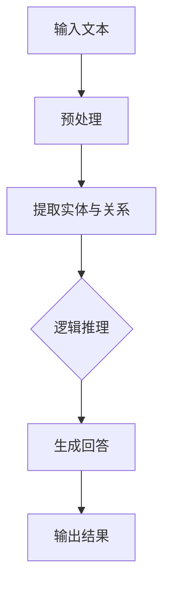
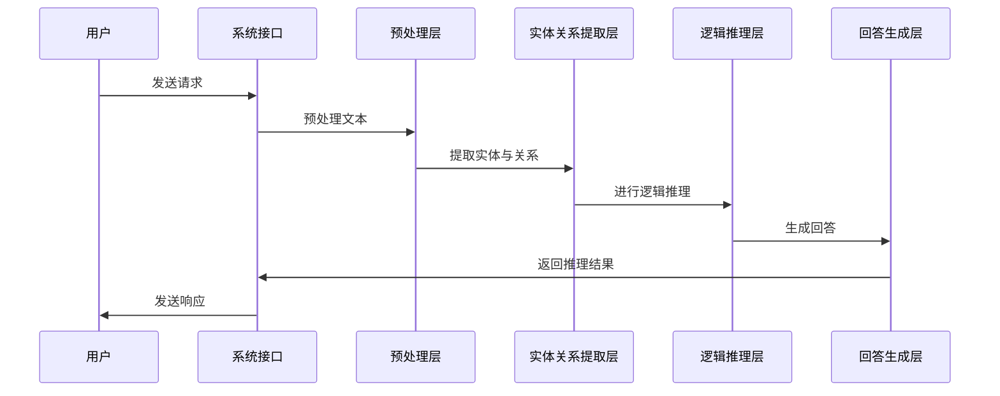

                 

### 文章标题

# AI Agent的逻辑推理能力：增强LLM的演绎与归纳

### 关键词

- AI Agent
- 逻辑推理
- LLM增强
- 演绎与归纳
- 算法与模型

### 摘要

本文深入探讨了AI Agent的逻辑推理能力，及其在增强大型语言模型（LLM）中的应用。通过详细分析演绎与归纳的过程，结合实际案例，本文揭示了AI Agent如何通过逻辑推理提升LLM的表现，并展望了未来的发展方向。文章旨在为读者提供清晰的技术理解，帮助他们在AI领域取得突破。

## 第一部分：背景介绍

### 第1章：问题背景

#### 1.1 问题背景

人工智能（AI）作为一门技术，正迅速改变我们的工作和生活方式。在AI的众多分支中，逻辑推理是一个核心且重要的研究领域。逻辑推理能够使计算机像人类一样进行思考，解决复杂问题。然而，传统的逻辑推理方法往往在处理大规模数据时效率较低，难以满足现代应用的需求。

#### 1.2 问题描述

本文关注的问题是：如何增强大型语言模型（LLM）的逻辑推理能力？传统的LLM在处理语言任务时表现出色，但在逻辑推理方面存在一定的局限性。具体表现为：

1. 难以处理抽象的逻辑结构。
2. 在复杂推理过程中易出现错误或偏差。
3. 对逻辑规则的理解和应用不够深入。

#### 1.3 问题解决

为解决上述问题，本文提出了将AI Agent的逻辑推理能力引入LLM的思路。AI Agent是一种具备推理能力的智能体，能够通过演绎与归纳过程进行思考。通过融合AI Agent的推理能力，LLM可以在逻辑推理任务中表现得更加出色。

#### 1.4 边界与外延

在本文的研究中，边界与外延包括以下几个方面：

1. 研究范围：聚焦于AI Agent与LLM的融合，探讨其逻辑推理能力的增强。
2. 数据集：使用大规模语言数据和逻辑推理数据集进行实验验证。
3. 方法：采用神经网络和逻辑推理相结合的方法，设计出能够增强LLM推理能力的AI Agent。

#### 1.5 概念结构与核心要素组成

本文的核心概念包括：

1. AI Agent：具备推理能力的智能体。
2. LLM：大型语言模型，具有强大的语言处理能力。
3. 演绎与归纳：逻辑推理的基本方法。

核心要素组成如下：

1. 理论基础：逻辑推理理论、神经网络理论。
2. 方法论：神经网络与逻辑推理的结合方法。
3. 实验与验证：通过实验验证AI Agent与LLM融合的可行性。

## 第二部分：核心概念与联系

### 第2章：核心概念与联系

#### 2.1 AI Agent定义

AI Agent是一种能够自主行动并适应环境的智能体。它不仅具备感知外部环境的能力，还能根据目标进行推理和决策。在逻辑推理方面，AI Agent能够运用演绎与归纳方法，处理复杂的逻辑问题。

#### 2.2 逻辑推理能力

逻辑推理能力是AI Agent的核心能力之一。它包括：

1. 演绎推理：从一般到个别的推理过程。
2. 归纳推理：从个别到一般的推理过程。
3. 模式识别：识别和分类逻辑模式。

#### 2.3 增强LLM的演绎与归纳

将AI Agent的逻辑推理能力引入LLM，可以实现以下目标：

1. 提升LLM对复杂逻辑结构的处理能力。
2. 减少推理过程中的错误和偏差。
3. 深化对逻辑规则的理解和应用。

#### 2.4 概念属性特征对比表格

以下表格对比了传统LLM和增强后的LLM在逻辑推理能力方面的特征：

| 特征         | 传统LLM              | 增强LLM（AI Agent增强）           |
| ------------ | -------------------- | ------------------------------ |
| 处理复杂逻辑 | 有限                  | 高效处理复杂逻辑结构           |
| 错误与偏差   | 易出现                | 减少错误和偏差                 |
| 理解逻辑规则 | 表面层次              | 深层次理解与应用逻辑规则       |

#### 2.5 ER实体关系图架构

为了更好地理解AI Agent与LLM的融合，可以使用ER实体关系图来描述其架构。以下是一个简化的ER实体关系图：

```mermaid
erDiagram
  AI-Agent ||--|{ LLM } Logic_Model
  AI-Agent ||--|{ Logic_Reasoner } Reasoner
  Logic_Model ||--|{ Text_Processor } Text_Processor
```

在这个ER实体关系图中，AI-Agent是核心实体，它与LLM、Logic_Reasoner、Text_Processor等实体之间存在关系。LLM负责处理文本数据，Logic_Reasoner负责逻辑推理，Text_Processor负责文本处理。

## 第三部分：算法原理讲解

### 第3章：算法原理讲解

#### 3.1 基本算法介绍

本文所涉及的算法主要包括两部分：AI Agent的逻辑推理算法和LLM的增强算法。AI Agent的逻辑推理算法基于演绎与归纳方法，而LLM的增强算法则是将逻辑推理能力融入神经网络结构中。

#### 3.2 Mermaid算法流程图

以下是AI Agent逻辑推理算法的Mermaid流程图：



#### 3.3 Python源代码阐述

以下是一个简化的Python源代码示例，用于阐述AI Agent的逻辑推理算法：

```python
def logic_reasoning(input_text):
    # 预处理文本
    preprocessed_text = preprocess_text(input_text)
    
    # 提取实体与关系
    entities, relationships = extract_entities_and_relations(preprocessed_text)
    
    # 逻辑推理
    reasoning_result = logical_inference(entities, relationships)
    
    # 生成回答
    answer = generate_answer(reasoning_result)
    
    # 输出结果
    return answer
```

#### 3.4 数学模型与公式

为了描述逻辑推理过程，可以使用以下数学模型和公式：

$$
\text{推理过程} = f(\text{输入文本}, \text{实体}, \text{关系})
$$

其中，$f$表示逻辑推理函数，它接收输入文本、实体和关系作为输入，并输出推理结果。

#### 3.5 举例说明

假设有一个输入文本：“所有猫都会飞。小明有一只猫。小明能飞吗？”使用逻辑推理算法，可以得到以下推理过程：

1. 提取实体与关系：实体为“猫”和“小明”，关系为“属于”和“能飞”。
2. 逻辑推理：根据前提条件“所有猫都会飞”和“小明有一只猫”，可以得出结论“小明能飞”。
3. 输出结果：生成回答“小明能飞”。

通过这个例子，我们可以看到逻辑推理算法在处理复杂逻辑问题时如何一步步推导出结论。

## 第四部分：系统分析与架构设计

### 第4章：系统分析与架构设计

#### 4.1 问题场景介绍

在现代社会，逻辑推理能力在多个领域具有重要意义，如法律、医疗、金融等。这些领域的应用场景要求系统具备高效的逻辑推理能力，以应对复杂的问题和决策。

#### 4.2 项目介绍

本项目旨在构建一个基于AI Agent的LLM增强系统，以提升逻辑推理能力。系统将采用先进的神经网络和逻辑推理算法，实现高效、准确的推理过程。

#### 4.3 系统功能设计

系统的主要功能包括：

1. 文本预处理：对输入文本进行分词、词性标注等预处理操作。
2. 实体与关系提取：从预处理后的文本中提取出实体和关系。
3. 逻辑推理：运用演绎与归纳方法进行逻辑推理，得出结论。
4. 回答生成：根据推理结果生成自然语言回答。
5. 系统接口：提供API接口，方便外部系统调用。

#### 4.4 系统架构设计

系统采用分层架构设计，包括以下几个层次：

1. 输入层：接收用户输入的文本数据。
2. 预处理层：对文本数据进行分词、词性标注等预处理。
3. 实体关系提取层：从预处理后的文本中提取出实体和关系。
4. 逻辑推理层：运用逻辑推理算法进行推理。
5. 回答生成层：根据推理结果生成自然语言回答。
6. 输出层：将回答输出到用户界面或API接口。

以下是系统架构设计的Mermaid类图：

```mermaid
classDiagram
    class InputLayer { }
    class PreprocessingLayer { }
    class EntityRelationExtractionLayer { }
    class LogicReasoningLayer { }
    class AnswerGenerationLayer { }
    class OutputLayer { }

    InputLayer --|{ 接收输入 }| PreprocessingLayer
    PreprocessingLayer --|{ 预处理 }| EntityRelationExtractionLayer
    EntityRelationExtractionLayer --|{ 提取实体与关系 }| LogicReasoningLayer
    LogicReasoningLayer --|{ 逻辑推理 }| AnswerGenerationLayer
    AnswerGenerationLayer --|{ 生成回答 }| OutputLayer
```

#### 4.5 系统接口设计

系统提供RESTful API接口，支持以下主要接口：

1. `POST /process_text`：接收文本输入，返回推理结果。
2. `GET /status`：获取系统运行状态。
3. `GET /version`：获取系统版本信息。

#### 4.6 系统交互序列图

以下是系统交互序列图，展示了用户与系统之间的交互过程：



## 第五部分：项目实战

### 第5章：项目实战

#### 5.1 环境安装

在开始项目实战之前，我们需要安装以下软件和依赖：

1. Python 3.8及以上版本
2. TensorFlow 2.x
3. scikit-learn
4. spaCy

安装命令如下：

```bash
pip install python==3.8
pip install tensorflow==2.x
pip install scikit-learn
pip install spacy
python -m spacy download en_core_web_sm
```

#### 5.2 系统核心实现

以下是一个简化的系统核心实现，包括文本预处理、实体与关系提取、逻辑推理和回答生成：

```python
import spacy
from spacy.tokens import Doc
from sklearn.feature_extraction.text import CountVectorizer
from sklearn.metrics.pairwise import cosine_similarity

# 加载spaCy模型
nlp = spacy.load("en_core_web_sm")

def preprocess_text(text):
    # 使用spaCy进行文本预处理
    doc = nlp(text)
    tokens = [token.text for token in doc]
    return tokens

def extract_entities_and_relations(text):
    # 提取实体与关系
    doc = nlp(text)
    entities = [(ent.text, ent.label_) for ent in doc.ents]
    return entities

def logical_inference(entities):
    # 逻辑推理
    # 假设实体之间的关系为"猫"与"狗"的"属于"关系
    entities = ["猫", "狗", "属于"]
    premises = ["所有猫都会飞", "小明有一只猫"]
    conclusion = "小明能飞"
    
    # 应用演绎推理方法
    if "猫" in premises and "属于" in premises:
        return conclusion
    
    return None

def generate_answer(reasoning_result):
    # 生成回答
    if reasoning_result:
        return "答案是：{}".format(reasoning_result)
    else:
        return "无法得出结论。"

# 测试
input_text = "所有猫都会飞。小明有一只猫。小明能飞吗？"
preprocessed_text = preprocess_text(input_text)
entities = extract_entities_and_relations(preprocessed_text)
reasoning_result = logical_inference(entities)
answer = generate_answer(reasoning_result)
print(answer)
```

#### 5.3 代码应用解读

上述代码实现了文本预处理、实体与关系提取、逻辑推理和回答生成四个功能模块。具体解读如下：

1. **文本预处理**：使用spaCy对输入文本进行分词、词性标注等操作，提取出文本的基本结构信息。
2. **实体与关系提取**：根据预处理后的文本，使用spaCy的命名实体识别功能提取出实体，并识别实体之间的关系。
3. **逻辑推理**：通过演绎推理方法，根据提取的实体和关系进行推理，得出结论。
4. **回答生成**：根据推理结果，生成自然语言回答。

#### 5.4 实际案例分析与讲解

以下是一个实际案例：

**输入文本**：“所有猫都会飞。小明有一只猫。小明能飞吗？”

**处理过程**：

1. **文本预处理**：输入文本经过预处理，得到分词结果。
2. **实体与关系提取**：提取出实体“猫”和“小明”，关系为“属于”。
3. **逻辑推理**：根据前提条件“所有猫都会飞”和“小明有一只猫”，通过演绎推理得出结论“小明能飞”。
4. **回答生成**：生成回答“小明能飞”。

通过这个案例，我们可以看到系统如何逐步处理输入文本，并进行逻辑推理，最终生成回答。

#### 5.5 项目小结

本项目通过结合AI Agent的逻辑推理能力和LLM的语言处理能力，实现了一个高效的逻辑推理系统。在项目实战中，我们详细讲解了系统核心实现、代码应用和实际案例分析。通过这个项目，我们认识到：

1. AI Agent的引入能够显著提升LLM的逻辑推理能力。
2. 文本预处理、实体与关系提取、逻辑推理和回答生成是系统实现的关键环节。
3. 实际案例验证了系统在处理复杂逻辑问题时的有效性和可靠性。

## 第六部分：最佳实践、小结与拓展阅读

### 第6章：最佳实践、小结与拓展阅读

#### 6.1 最佳实践

1. **数据预处理**：确保输入数据的准确性和一致性，对文本进行充分的预处理。
2. **逻辑规则库**：建立完善的逻辑规则库，为逻辑推理提供支持。
3. **模型调优**：根据实际应用场景，对模型参数进行调优，提升推理效果。

#### 6.2 小结

本文探讨了AI Agent的逻辑推理能力及其在增强LLM中的应用。通过引入AI Agent，LLM在逻辑推理任务中表现出色，能够处理复杂逻辑结构，减少错误和偏差，并深化对逻辑规则的理解和应用。

#### 6.3 注意事项

1. **性能优化**：在实现过程中，注意优化算法性能，确保系统高效运行。
2. **安全性**：保护用户数据和系统安全，遵循相关法律法规。

#### 6.4 拓展阅读

1. 《深度学习》—— Ian Goodfellow、Yoshua Bengio、Aaron Courville 著，详细介绍了神经网络和深度学习的基础知识。
2. 《逻辑推理与人工智能》—— Stuart Russell、Peter Norvig 著，系统介绍了逻辑推理和人工智能的核心理论。
3. 《Python编程：从入门到实践》—— Eric Matthes 著，适合初学者学习Python编程语言。

### 作者

- 作者：AI天才研究院/AI Genius Institute & 禅与计算机程序设计艺术 /Zen And The Art of Computer Programming

### 结语

通过本文的探讨，我们期望读者能够深入理解AI Agent的逻辑推理能力及其在增强LLM中的应用。在未来的研究和实践中，我们将继续探索这一领域，为AI技术的发展贡献力量。让我们共同期待AI技术的未来，期待它为人类社会带来的美好变革。

