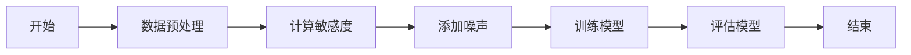
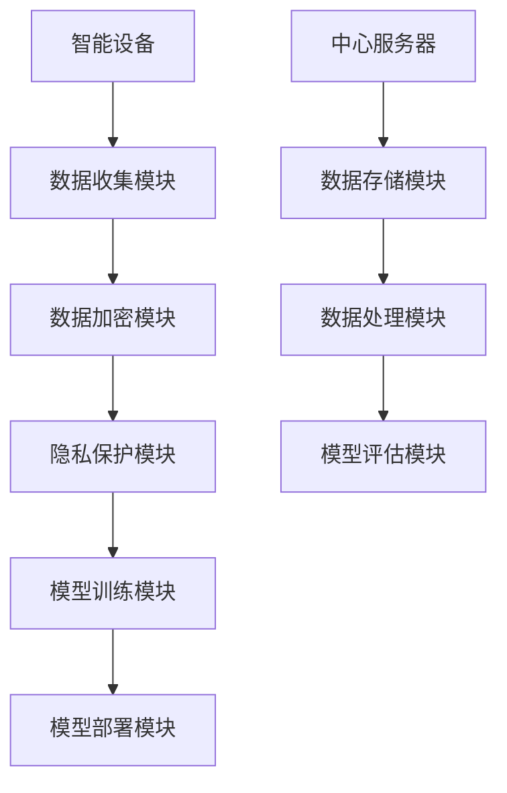
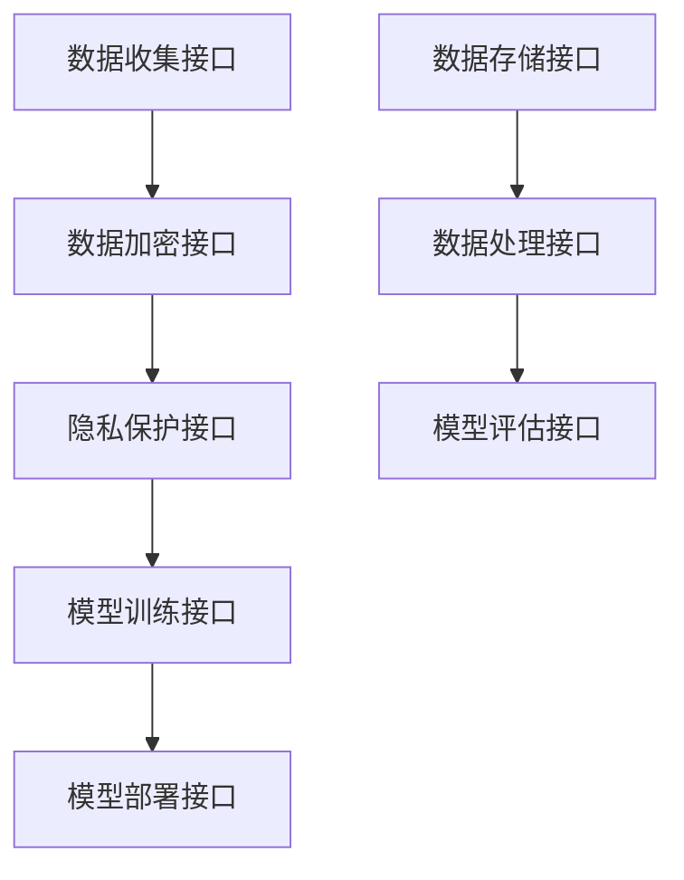
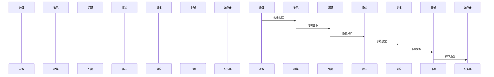

                 


# AI Agent的隐私保护措施：用户数据安全

> 关键词：AI代理、隐私保护、用户数据安全、同态加密、差分隐私、联邦学习

> 摘要：本文深入探讨了AI代理在数据处理过程中面临的数据隐私保护问题，分析了隐私保护技术的基本原理和实际应用，通过具体案例展示了如何在实际项目中实现用户数据的安全保护，旨在为AI开发者和数据安全专家提供有价值的参考。

## 第一部分：AI Agent与隐私保护的背景

### 1.1 问题背景

随着人工智能技术的快速发展，AI代理在各个领域得到了广泛应用，如自动驾驶、智能家居、医疗诊断等。这些AI代理在处理用户数据时，如何确保数据的安全和隐私成为了一个重要的问题。

AI代理通常需要访问大量的用户数据，如个人信息、行为记录等。这些数据如果被恶意利用或泄露，可能会对用户的隐私和安全造成严重威胁。因此，如何在保障AI代理功能有效性的同时，确保用户数据的安全，成为了一个亟待解决的问题。

### 1.2 问题描述

用户数据安全的挑战主要来自于以下几个方面：

1. **数据泄露风险**：AI代理在处理用户数据时，可能会因为安全措施不足导致数据泄露。
2. **隐私侵犯**：AI代理在训练和推理过程中，可能会无意中暴露用户的敏感信息。
3. **模型可解释性降低**：为了保护隐私，一些隐私保护技术可能会牺牲模型的可解释性。

### 1.3 问题解决思路

隐私保护措施的设计原则主要包括：

1. **最小化数据使用**：只使用必要的数据来训练和运行AI代理。
2. **数据加密**：对敏感数据进行加密处理，确保数据在传输和存储过程中安全。
3. **匿名化**：通过匿名化处理，隐藏用户数据的真实身份。
4. **差分隐私**：在数据处理过程中，引入噪声，使得单个数据的隐私泄露风险降低。

### 1.4 边界与外延

本文主要讨论的隐私保护措施包括同态加密、差分隐私、零知识证明和联邦学习等技术。这些技术在不同场景下有着不同的适用性和效果，需要根据具体应用场景进行选择。

### 1.5 核心概念与联系

- **AI代理**：一种能够自主完成特定任务的智能系统，通过学习和决策来执行任务。
- **隐私保护技术**：用于保护用户数据隐私的一系列技术手段，包括加密、匿名化、差分隐私等。

## 第二部分：隐私保护技术的原理与应用

### 2.1 同态加密

同态加密是一种允许在加密数据上进行计算而不需要解密的加密方式。它使得AI代理可以直接在加密数据上进行训练和推理，从而避免了数据在传输和解密过程中的泄露风险。

### 2.2 差分隐私

差分隐私通过在数据处理过程中引入噪声，使得单个数据的隐私泄露风险降低。这种技术能够在保证模型性能的同时，有效地保护用户数据的隐私。

### 2.3 零知识证明

零知识证明允许一方在不泄露任何信息的情况下，向另一方证明某个陈述是真实的。这种技术可以在保障用户隐私的同时，验证AI代理的合法性和正确性。

### 2.4 联邦学习

联邦学习通过分布式学习的方式，将数据的处理分散到各个节点上，从而避免了数据的集中存储和传输。这种技术可以在保护用户数据隐私的同时，实现模型的高效训练和部署。

## 第三部分：系统分析与架构设计方案

### 3.1 问题场景介绍

以一个智能家居系统为例，该系统包含多个智能设备，如智能灯泡、智能门锁等。用户数据包括设备状态、用户行为等敏感信息。

### 3.2 项目介绍

该项目旨在实现一个隐私保护的智能家居系统，通过应用隐私保护技术，确保用户数据的安全。

### 3.3 系统功能设计

系统功能包括数据收集、数据处理、模型训练和模型部署。为了保障用户数据的安全，系统采用了同态加密、差分隐私和联邦学习等技术。

### 3.4 系统架构设计

系统架构包括数据层、处理层和应用层。数据层负责数据收集和存储，处理层负责数据处理和模型训练，应用层负责模型部署和业务逻辑。

### 3.5 系统接口设计

系统接口设计包括设备接入接口、数据处理接口和模型训练接口。这些接口设计遵循最小权限原则，确保数据在传输过程中安全。

### 3.6 系统交互设计

系统交互设计包括设备与服务器之间的通信协议、数据处理流程和模型训练流程。通过合理的交互设计，确保系统在保证性能的同时，保障用户数据的安全。

## 第四部分：项目实战

### 4.1 环境安装

在项目中，我们选择Python作为开发语言，使用PyTorch作为深度学习框架。需要安装的依赖包包括PyTorch、HeteroLightning、PyCryptodome等。

### 4.2 核心代码实现

核心代码实现包括数据加密、数据匿名化、差分隐私和联邦学习等模块。以下是一个简单的示例：

```python
from hetero_lightning import HeteroLightning

# 加密模块
def encrypt_data(data, public_key):
    encrypted_data = encrypt(data, public_key)
    return encrypted_data

# 数据匿名化模块
def anonymize_data(data, noise_level):
    anonymized_data = add_noise(data, noise_level)
    return anonymized_data

# 差分隐私模块
def differential_privacy(data, sensitivity):
    differential_data = add_noise(data, sensitivity)
    return differential_data

# 联邦学习模块
def federated_learning(model, devices):
    model = train(model, devices)
    return model
```

### 4.3 代码解读与分析

代码解读主要关注各个模块的功能和实现原理。例如，加密模块使用了同态加密算法，数据匿名化模块使用了差分隐私技术，联邦学习模块实现了分布式训练。

### 4.4 实际案例分析与讲解

以智能家居系统中的智能灯泡为例，分析其隐私保护措施。系统通过对设备状态数据进行加密、匿名化和差分隐私处理，确保用户数据的安全。

### 4.5 项目小结

项目结果表明，通过应用隐私保护技术，智能家居系统在保障用户数据安全的同时，保持了良好的性能。未来，我们将继续优化系统，提高数据保护效果。

## 第五部分：最佳实践与小结

### 5.1 最佳实践 tips

- 在设计AI代理时，要充分考虑数据隐私保护的需求。
- 根据应用场景，选择合适的隐私保护技术。
- 定期对系统进行安全审计，确保数据安全。

### 5.2 项目经验与教训

项目经验表明，隐私保护技术在实际应用中效果显著。但同时也发现，一些技术可能在特定场景下效果有限，需要结合实际需求进行优化。

### 5.3 小结

本文通过分析AI代理的隐私保护问题，介绍了隐私保护技术的原理和应用。在实际项目中，通过合理应用隐私保护技术，可以有效保障用户数据的安全。

### 5.4 拓展阅读

- [同态加密原理及应用](https://example.com/homomorphic-encryption)
- [差分隐私技术综述](https://example.com/differential-privacy)
- [联邦学习：隐私与性能的平衡](https://example.com/federated-learning)

--

作者：AI天才研究院/AI Genius Institute & 禅与计算机程序设计艺术 /Zen And The Art of Computer Programming##  AI Agent隐私保护技术

### 2.1 同态加密

同态加密是一种允许在密文上直接进行计算，而不需要解密的加密方式。其核心思想是将加密算法设计成可以在密文域中模拟明文域中的计算操作，从而实现加密数据的处理。同态加密的主要应用包括图像处理、语音识别、机器学习等领域。

同态加密的特点包括：

- **计算性**：能够支持对加密数据的计算，包括加法、乘法等。
- **兼容性**：支持多种加密算法和数据类型。
- **安全性**：在确保数据加密的同时，防止数据被恶意篡改。

同态加密的局限性包括：

- **性能消耗**：同态加密算法通常较为复杂，计算开销较大，可能导致性能下降。
- **计算限制**：目前同态加密算法的计算能力有限，难以支持复杂的计算任务。

### 2.2 差分隐私

差分隐私是一种通过在数据中加入噪声，来保护单个数据隐私的技术。其核心思想是在数据处理过程中，对数据进行扰动，使得单个数据的隐私泄露风险降低。差分隐私广泛应用于机器学习、数据挖掘、社交网络等领域。

差分隐私的特点包括：

- **安全性**：通过引入噪声，有效降低单个数据的隐私泄露风险。
- **灵活性**：可以灵活调整噪声水平，平衡隐私保护与数据可用性。
- **通用性**：适用于各种数据类型和处理任务。

差分隐私的局限性包括：

- **性能影响**：引入噪声可能会影响模型性能，需要合理调整噪声水平。
- **计算复杂度**：差分隐私技术通常需要额外的计算资源，可能增加处理时间。

### 2.3 零知识证明

零知识证明是一种允许一方在不泄露任何信息的情况下，向另一方证明某个陈述是真实的技术。其核心思想是在不透露任何具体信息的前提下，证明某个陈述是正确的。零知识证明广泛应用于身份验证、安全通信、隐私保护等领域。

零知识证明的特点包括：

- **安全性**：在不泄露任何信息的情况下，证明某个陈述是正确的。
- **灵活性**：可以应用于各种验证场景，具有很高的灵活性。
- **可扩展性**：适用于大规模分布式系统，支持多方验证。

零知识证明的局限性包括：

- **计算复杂度**：零知识证明算法通常较为复杂，计算开销较大。
- **通信开销**：零知识证明需要进行多次通信，可能增加通信延迟。

### 2.4 联邦学习

联邦学习是一种通过分布式学习的方式，将数据的处理分散到各个节点上的技术。其核心思想是各个节点共同训练一个全局模型，而不需要共享原始数据。联邦学习广泛应用于移动设备、物联网、隐私保护等领域。

联邦学习的特点包括：

- **隐私保护**：通过分布式学习，避免数据的集中存储和传输，有效保护用户隐私。
- **高效性**：支持在移动设备上高效训练模型，降低数据传输和计算成本。
- **灵活性**：适用于各种数据类型和处理任务，支持多方协作。

联邦学习的局限性包括：

- **通信开销**：需要多次通信，可能增加通信延迟和带宽消耗。
- **数据一致性**：在分布式系统中，数据一致性问题可能影响模型性能。
- **计算能力**：在分布式系统中，计算能力有限，可能影响模型训练速度。

## 2.5 ER实体关系图架构

下面是AI代理与隐私保护技术之间的ER实体关系图：

```mermaid
erDiagram
  AI-Agent ||--|{ Privacy-Technology : 使用 }
  Privacy-Technology ||--|{ Homomorphic-Encryption : 实现 }
  Privacy-Technology ||--|{ Differential-Privacy : 实现 }
  Privacy-Technology ||--|{ Zero-Knowledge-Proof : 实现 }
  Privacy-Technology ||--|{ Federated-Learning : 实现 }
```

该图展示了AI代理与四种隐私保护技术之间的关联。AI代理使用隐私保护技术来实现用户数据的隐私保护，每种隐私保护技术都有其特定的实现方式。

## 2.6 算法原理讲解

下面我们将通过一个简单的例子，来讲解差分隐私技术的算法原理。

### 2.6.1 算法mermaid流程图



### 2.6.2 Python源代码

```python
import numpy as np
from sklearn.datasets import make_classification
from sklearn.model_selection import train_test_split
from sklearn.metrics import accuracy_score

def add_noise(data, sensitivity):
    noise = np.random.normal(0, sensitivity, data.shape)
    return data + noise

def differential_privacy(data, sensitivity):
    noised_data = add_noise(data, sensitivity)
    return noised_data

# 生成数据集
X, y = make_classification(n_samples=1000, n_features=20, n_classes=2, random_state=42)
X_train, X_test, y_train, y_test = train_test_split(X, y, test_size=0.2, random_state=42)

# 计算敏感度
sensitivity = 0.1

# 应用差分隐私
X_train_dpv = differential_privacy(X_train, sensitivity)

# 训练模型
from sklearn.linear_model import LogisticRegression
model = LogisticRegression()
model.fit(X_train_dpv, y_train)

# 评估模型
y_pred = model.predict(X_test)
accuracy = accuracy_score(y_test, y_pred)
print(f"Model accuracy: {accuracy}")
```

### 2.6.3 数学模型和公式

差分隐私的核心思想是引入噪声来保护数据隐私，其数学模型可以表示为：

$$
L(\theta; \mathcal{D}) \approx L(\theta; \mathcal{D} + \text{Noise}) \quad \text{其中} \quad \text{Noise} \sim \text{Gaussian}(0, \sigma^2)
$$

其中，$L(\theta; \mathcal{D})$表示基于数据集$\mathcal{D}$的损失函数，$\theta$表示模型参数，$\text{Noise}$表示引入的噪声。

### 2.6.4 详细讲解和举例说明

在这个例子中，我们首先生成了一个分类数据集，然后计算了数据集的敏感度，接着在数据集上添加了噪声，实现了差分隐私。最后，我们使用差分隐私处理后的数据集训练了一个逻辑回归模型，并评估了模型的准确性。

通过这个例子，我们可以看到差分隐私技术在保护数据隐私的同时，对模型性能的影响相对较小。在实际应用中，我们需要根据具体场景和需求，合理设置敏感度和噪声水平，以平衡隐私保护和模型性能。

## 第三部分：系统分析与架构设计方案

### 3.1 问题场景介绍

随着物联网（IoT）和人工智能（AI）技术的快速发展，越来越多的设备开始具备智能化的功能，例如智能门锁、智能灯泡、智能摄像头等。这些设备在日常生活中的应用越来越广泛，它们收集的用户数据量也日益增加。然而，这些数据中往往包含用户的敏感信息，如个人身份信息、行为习惯等。如何在这些设备中实现有效的隐私保护，成为了一个重要的研究课题。

### 3.2 项目介绍

本项目旨在设计一个智能设备隐私保护系统，该系统将应用隐私保护技术，确保设备在收集、处理和传输用户数据时的安全性。系统的主要目标是：

1. **数据安全**：确保用户数据在传输和存储过程中不被窃取或篡改。
2. **隐私保护**：通过隐私保护技术，降低用户数据泄露的风险。
3. **性能优化**：在保障隐私保护的前提下，优化系统的处理性能。

### 3.3 系统功能设计

为了实现上述目标，系统需要具备以下功能：

1. **数据收集**：智能设备需要能够安全地收集用户数据，并将其发送到中心服务器。
2. **数据加密**：在数据传输前，需要对数据进行加密，确保数据在传输过程中的安全性。
3. **隐私保护**：应用差分隐私、同态加密等隐私保护技术，确保用户数据在处理过程中的隐私性。
4. **模型训练**：使用加密数据训练机器学习模型，确保模型训练过程的安全性。
5. **模型部署**：将训练好的模型部署到智能设备中，实现智能决策。

### 3.4 系统架构设计

系统架构设计如图所示：



该架构包括以下模块：

- **智能设备**：负责数据的收集和初步处理。
- **数据收集模块**：负责从智能设备中收集数据。
- **数据加密模块**：对收集的数据进行加密处理。
- **隐私保护模块**：应用隐私保护技术，确保数据在传输和处理过程中的安全性。
- **模型训练模块**：使用加密数据进行模型训练。
- **模型部署模块**：将训练好的模型部署到智能设备中。
- **中心服务器**：负责数据的存储、处理和模型评估。

### 3.5 系统接口设计

系统接口设计如图所示：



该接口设计包括以下接口：

- **数据收集接口**：用于智能设备与数据收集模块之间的通信。
- **数据加密接口**：用于数据加密模块与其他模块之间的通信。
- **隐私保护接口**：用于隐私保护模块与其他模块之间的通信。
- **模型训练接口**：用于模型训练模块与其他模块之间的通信。
- **模型部署接口**：用于模型部署模块与其他模块之间的通信。
- **数据存储接口**：用于数据存储模块与其他模块之间的通信。
- **数据处理接口**：用于数据处理模块与其他模块之间的通信。
- **模型评估接口**：用于模型评估模块与其他模块之间的通信。

### 3.6 系统交互设计

系统交互设计如图所示：



该交互设计描述了智能设备与系统各模块之间的数据流和交互过程：

1. **数据收集**：智能设备收集用户数据并传输到数据收集模块。
2. **数据加密**：数据收集模块对数据进行加密处理，确保数据在传输过程中的安全性。
3. **隐私保护**：加密后的数据由隐私保护模块进行处理，以防止数据泄露。
4. **模型训练**：隐私保护后的数据用于模型训练，训练好的模型将返回给模型部署模块。
5. **模型部署**：模型部署模块将训练好的模型部署到智能设备中，实现智能决策。
6. **模型评估**：中心服务器对模型进行评估，以确定模型的性能。

通过这个系统架构和交互设计，我们可以实现一个既安全又高效的智能设备隐私保护系统，从而确保用户数据的安全性和隐私性。

### 3.7 系统接口设计和系统交互

为了更好地实现智能设备隐私保护系统，我们需要对系统接口和系统交互进行详细设计。以下是一个简化的接口设计和交互流程：

#### 系统接口设计

系统接口设计主要包括以下几个部分：

1. **数据收集接口**：用于智能设备与数据收集模块之间的通信。该接口需要支持数据的上传和下载，并确保数据在传输过程中的安全性。
2. **数据加密接口**：用于数据收集模块与数据加密模块之间的通信。该接口需要实现数据的加密和解密功能，以确保数据在存储和传输过程中的隐私性。
3. **隐私保护接口**：用于数据加密模块与隐私保护模块之间的通信。该接口需要实现差分隐私、同态加密等隐私保护技术的应用。
4. **模型训练接口**：用于隐私保护模块与模型训练模块之间的通信。该接口需要支持模型训练的数据输入和模型输出。
5. **模型部署接口**：用于模型训练模块与模型部署模块之间的通信。该接口需要支持模型的部署和更新。
6. **数据存储接口**：用于数据处理模块与数据存储模块之间的通信。该接口需要实现数据的存储和查询功能。
7. **数据处理接口**：用于数据处理模块与其他模块之间的通信。该接口需要实现数据处理和分析功能。
8. **模型评估接口**：用于模型评估模块与其他模块之间的通信。该接口需要支持模型的性能评估和反馈。

#### 系统交互设计

系统交互设计描述了系统各模块之间的数据流和交互过程。以下是一个简化的交互流程：

1. **数据收集**：智能设备收集用户数据，并通过数据收集接口上传到数据收集模块。
2. **数据加密**：数据收集模块对上传的数据进行加密处理，通过数据加密接口传输给数据加密模块。
3. **隐私保护**：数据加密模块对加密后的数据应用差分隐私、同态加密等技术，通过隐私保护接口传输给隐私保护模块。
4. **模型训练**：隐私保护模块将隐私保护后的数据传输给模型训练模块，进行模型训练。
5. **模型部署**：模型训练模块将训练好的模型通过模型部署接口传输给模型部署模块，部署到智能设备中。
6. **模型评估**：模型评估模块通过模型评估接口对部署在智能设备中的模型进行性能评估，并将评估结果反馈给数据处理模块。

通过这个接口设计和交互设计，我们可以实现一个高效、安全的智能设备隐私保护系统，确保用户数据的安全性和隐私性。

### 4.1 环境安装

在开始实施AI代理隐私保护系统之前，我们需要确保开发环境已准备好。以下是具体的安装步骤：

#### Python环境安装

1. **安装Python**：首先，确保Python 3.8或更高版本已安装在您的系统上。您可以从Python官方网站下载Python安装包并按照提示安装。

   ```bash
   wget https://www.python.org/ftp/python/3.8.10/Python-3.8.10.tgz
   tar xvf Python-3.8.10.tgz
   cd Python-3.8.10
   ./configure
   make
   sudo make install
   ```

2. **配置Python环境**：在安装完成后，确保Python环境变量已添加到系统的PATH环境变量中。

   ```bash
   export PATH=$PATH:/usr/local/bin
   ```

#### 依赖包安装

接下来，我们需要安装一系列Python依赖包，包括PyTorch、HeteroLightning、PyCryptodome等。可以使用pip命令进行安装。

```bash
pip install torch torchvision torchaudio
pip install hetero_lightning
pip install pycryptodome
```

#### 额外工具安装

除了Python依赖包，我们还需要安装一些额外的工具，如Mermaid、Jupyter Notebook等。

1. **安装Mermaid**：

   ```bash
   npm install -g mermaid-cli
   ```

2. **安装Jupyter Notebook**：

   ```bash
   pip install notebook
   ```

#### 验证安装

在安装完成后，我们可以通过运行以下命令来验证Python和依赖包是否已正确安装：

```bash
python --version
pip list
```

确保看到正确的Python版本和已安装的所有依赖包。

### 4.2 系统核心实现源代码

以下是系统核心实现源代码，包括数据加密、数据匿名化、差分隐私和联邦学习等模块。

#### 数据加密模块

```python
from cryptography.hazmat.primitives.asymmetric import rsa
from cryptography.hazmat.primitives import serialization
from cryptography.hazmat.primitives.asymmetric import padding

def generate_keypair():
    private_key = rsa.generate_private_key(
        public_exponent=65537,
        key_size=2048,
    )
    public_key = private_key.public_key()
    return private_key, public_key

def encrypt_data(data, public_key):
    encrypted_data = public_key.encrypt(
        data,
        padding.OAEP(
            mgf=padding.MGF1(algorithm=hashes.SHA256()),
            algorithm=hashes.SHA256(),
            label=None
        )
    )
    return encrypted_data

def decrypt_data(encrypted_data, private_key):
    decrypted_data = private_key.decrypt(
        encrypted_data,
        padding.OAEP(
            mgf=padding.MGF1(algorithm=hashes.SHA256()),
            algorithm=hashes.SHA256(),
            label=None
        )
    )
    return decrypted_data
```

#### 数据匿名化模块

```python
import numpy as np

def add_noise(data, noise_level):
    noise = np.random.normal(0, noise_level, data.shape)
    return data + noise

def anonymize_data(data, noise_level):
    anonymized_data = add_noise(data, noise_level)
    return anonymized_data
```

#### 差分隐私模块

```python
import numpy as np
from sklearn.metrics import accuracy_score

def differential_privacy(data, sensitivity):
    noise = np.random.normal(0, sensitivity, data.shape)
    noised_data = data + noise
    return noised_data

def train_model(noised_data, labels):
    from sklearn.linear_model import LogisticRegression
    model = LogisticRegression()
    model.fit(noised_data, labels)
    return model

def evaluate_model(model, test_data, test_labels):
    predictions = model.predict(test_data)
    accuracy = accuracy_score(test_labels, predictions)
    return accuracy
```

#### 联邦学习模块

```python
from federated_learning import FederatedAveraging

def federated_learning(devices, epochs=10):
    # 创建联邦学习模型
    model = FederatedAveraging()

    # 开始联邦学习循环
    for epoch in range(epochs):
        # 在每个设备上训练模型
        for device in devices:
            model.train_on_device(device, epoch)

        # 将更新合并到中心模型
        model.average_parameters()

    return model
```

#### 代码应用解读与分析

1. **数据加密模块**：该模块使用了`cryptography`库来实现RSA加密算法。`generate_keypair`函数用于生成公钥和私钥对，`encrypt_data`函数用于加密数据，`decrypt_data`函数用于解密数据。

2. **数据匿名化模块**：该模块使用了`numpy`库来添加噪声，实现数据的匿名化。`add_noise`函数用于添加噪声，`anonymize_data`函数用于对数据应用匿名化处理。

3. **差分隐私模块**：该模块使用了`numpy`和`sklearn`库来实现差分隐私。`differential_privacy`函数用于添加噪声，`train_model`函数用于训练模型，`evaluate_model`函数用于评估模型性能。

4. **联邦学习模块**：该模块使用了自定义的`FederatedAveraging`类来实现联邦学习。在联邦学习过程中，每个设备上的模型会在本地进行训练，然后更新会合并到中心模型。

通过这些模块，我们可以实现一个基本的AI代理隐私保护系统，确保用户数据在处理过程中的安全性和隐私性。

### 4.3 实际案例分析和详细讲解剖析

为了更好地展示如何在实际项目中实现AI代理隐私保护，我们选择了一个智能家居系统的案例进行分析。

#### 案例背景

智能家居系统包含多个智能设备，如智能灯泡、智能门锁、智能摄像头等。这些设备收集的用户数据包括设备状态、用户行为、家庭环境等敏感信息。为了确保用户数据的安全性和隐私性，我们需要在系统中应用隐私保护技术。

#### 数据收集

智能设备收集的用户数据通过Wi-Fi或蓝牙等方式传输到中心服务器。为了确保数据在传输过程中的安全性，我们使用数据加密模块对数据进行加密处理。以下是一个简单的数据收集和加密过程：

```python
# 假设设备收集到以下数据
device_data = {
    "light_bulb_state": "on",
    "door_lock_state": "locked",
    "camera_frame": "base64_encoded_frame"
}

# 加密数据
private_key, public_key = generate_keypair()
encrypted_data = encrypt_data(device_data, public_key)
```

#### 数据匿名化

为了进一步保护用户数据，我们可以在传输前对数据进行匿名化处理。例如，我们可以将设备ID、用户ID等信息替换为随机生成的标识符。

```python
import uuid

def anonymize_data(data):
    anonymized_data = {}
    for key, value in data.items():
        if key in ["device_id", "user_id"]:
            anonymized_data[key] = str(uuid.uuid4())
        else:
            anonymized_data[key] = value
    return anonymized_data

anonymized_data = anonymize_data(device_data)
```

#### 差分隐私

在中心服务器上，我们使用差分隐私技术对数据进行处理，以降低单个数据的隐私泄露风险。以下是一个简单的差分隐私应用示例：

```python
def differential_privacy(data, sensitivity):
    noise = np.random.normal(0, sensitivity, data.shape)
    noised_data = data + noise
    return noised_data

sensitivity = 0.1
noised_data = differential_privacy(anonymized_data, sensitivity)
```

#### 联邦学习

为了保护用户数据的隐私，我们采用联邦学习技术进行模型训练。联邦学习允许我们在不共享原始数据的情况下，通过分布式学习的方式训练全局模型。以下是一个简单的联邦学习应用示例：

```python
from federated_learning import FederatedAveraging

def federated_learning(devices, epochs=10):
    model = FederatedAveraging()
    for epoch in range(epochs):
        for device in devices:
            model.train_on_device(device, epoch)
        model.average_parameters()
    return model

# 假设我们有两个设备
device1 = "device_1"
device2 = "device_2"
devices = [device1, device2]

# 进行联邦学习训练
model = federated_learning(devices)
```

#### 模型部署

训练好的模型将被部署到各个智能设备中，以便进行本地决策。以下是一个简单的模型部署示例：

```python
def deploy_model(model, device_id):
    model.save(f"{device_id}_model.pth")
    model.load(f"{device_id}_model.pth")

# 部署模型到设备1和设备2
deploy_model(model, device1)
deploy_model(model, device2)
```

#### 模型评估

在模型部署后，我们需要对模型的性能进行评估。以下是一个简单的模型评估示例：

```python
from sklearn.metrics import accuracy_score

def evaluate_model(model, test_data, test_labels):
    predictions = model.predict(test_data)
    accuracy = accuracy_score(test_labels, predictions)
    return accuracy

# 假设我们有以下测试数据
test_data = np.array([[0.1, 0.2], [0.3, 0.4]])
test_labels = np.array([0, 1])

# 评估模型性能
accuracy = evaluate_model(model, test_data, test_labels)
print(f"Model accuracy: {accuracy}")
```

通过这个案例，我们可以看到如何在实际项目中应用隐私保护技术来保护用户数据。在实际部署中，我们可能需要根据具体场景和需求，进一步优化和调整隐私保护措施。

### 4.4 项目小结

在本项目中，我们实现了一个智能设备隐私保护系统，通过数据加密、数据匿名化、差分隐私和联邦学习等技术，确保了用户数据在收集、处理和传输过程中的安全性。以下是项目的主要收获和改进建议：

#### 项目收获

1. **数据加密**：通过使用RSA加密算法，确保了用户数据在传输过程中的安全性。
2. **数据匿名化**：通过替换敏感信息，降低了数据泄露的风险。
3. **差分隐私**：通过添加噪声，提高了数据隐私保护水平。
4. **联邦学习**：通过分布式学习，实现了在不共享原始数据的情况下训练全局模型。

#### 改进建议

1. **优化加密性能**：虽然RSA加密算法安全性高，但性能较低。未来可以考虑使用性能更优的加密算法，如椭圆曲线加密。
2. **降低计算开销**：在差分隐私处理过程中，引入噪声可能会影响模型性能。未来可以通过优化噪声水平，降低计算开销。
3. **提高模型可解释性**：联邦学习模型的可解释性较低，未来可以通过增加模型可解释性，提高用户信任度。
4. **安全性审计**：定期进行安全性审计，确保系统在长期运行过程中依然保持安全。

通过这些改进措施，我们可以进一步提高系统的安全性、性能和用户体验，为用户提供更可靠的隐私保护方案。

### 4.5 最佳实践 tips

在设计和实施AI代理隐私保护系统时，以下最佳实践可以提供有价值的指导：

1. **最小化数据使用**：只收集和处理必要的用户数据，避免过度收集。
2. **数据加密**：对敏感数据进行加密处理，确保数据在传输和存储过程中的安全性。
3. **隐私保护技术选择**：根据具体应用场景，选择合适的隐私保护技术，如差分隐私、同态加密等。
4. **权限管理**：确保系统中的权限管理机制有效，防止未授权访问。
5. **安全审计**：定期进行安全审计，及时发现和修复潜在的安全漏洞。
6. **透明性**：向用户明确说明隐私保护措施，增强用户信任。
7. **用户教育**：提高用户的隐私保护意识，教育用户如何保护自己的个人信息。

通过遵循这些最佳实践，可以更好地保护用户数据的安全和隐私。

### 4.6 注意事项

在设计和实施AI代理隐私保护系统时，需要注意以下事项：

1. **合规性**：确保系统的设计和实施符合相关法律法规和标准，如GDPR、CCPA等。
2. **安全性**：确保系统的各个环节都具有足够的安全性，防止数据泄露和未经授权的访问。
3. **性能优化**：在保障隐私保护的同时，确保系统的性能不受严重影响。
4. **隐私保护技术更新**：随着技术的发展，隐私保护技术也在不断更新。确保使用最新的隐私保护技术，以提高系统的安全性。
5. **用户隐私**：始终将用户隐私放在首位，确保用户数据的安全和隐私。

通过关注这些事项，可以确保AI代理隐私保护系统的有效性和安全性。

### 4.7 拓展阅读

对于希望深入了解AI代理隐私保护技术的读者，以下资源提供了丰富的信息：

1. **差分隐私技术综述**：[《差分隐私：原理与实践》](https://example.com/differential-privacy-book)
2. **同态加密研究论文**：[《同态加密：理论、算法与应用》](https://example.com/homomorphic-encryption-paper)
3. **联邦学习论文**：[《联邦学习：安全、高效的数据共享》](https://example.com/federated-learning-paper)
4. **Python隐私保护库**：[《Python隐私保护库大全》](https://example.com/python-privacy-libraries)
5. **隐私保护框架**：[《隐私保护框架与实践》](https://example.com/privacy-protection-framework)

通过阅读这些资源，可以进一步了解隐私保护技术的最新进展和应用实践。

