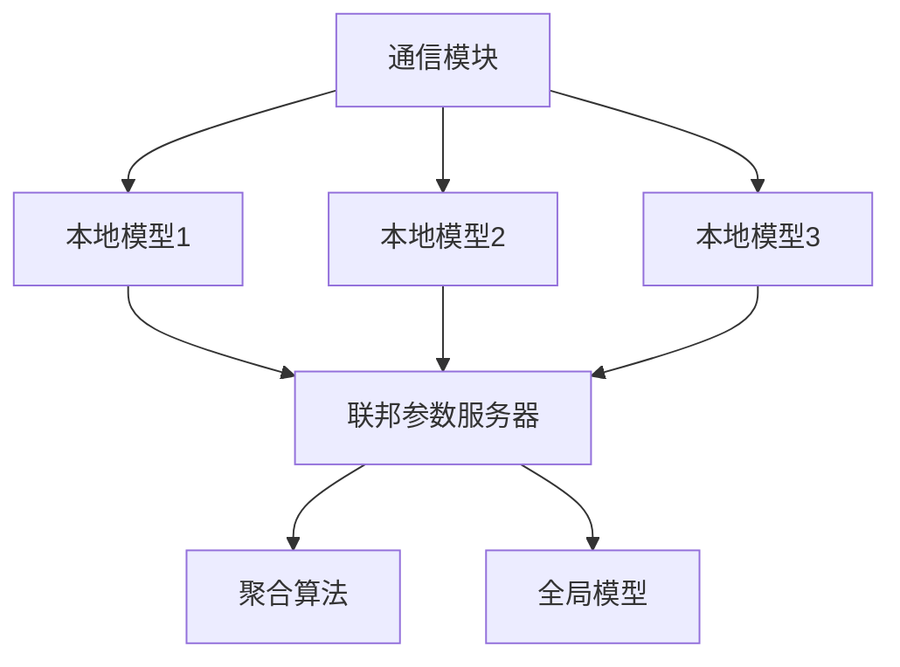

                 

### 第1章：引言

#### 问题背景与定义

在当今这个大数据时代，数据已成为企业和社会的重要资产。然而，随着数据量的不断增长和数据类型的日益多样，数据隐私保护问题也变得越来越突出。尤其是在人工智能（AI）领域，模型的训练和部署过程中往往需要大量的数据，而这些数据中包含了大量的个人敏感信息。如何在不泄露用户隐私的前提下，充分利用这些数据来进行AI模型的训练和部署，成为了当前亟需解决的一个关键问题。

隐私保护计算作为一种解决数据隐私问题的技术，旨在在不泄露数据本身的情况下，对数据进行分析和处理。它包括了一系列的技术，如加密技术、同态加密、安全多方计算等。而联邦学习（Federated Learning）则是一种隐私保护计算的重要应用场景，它通过将数据保留在本地设备上进行训练，从而避免了数据在传输过程中的泄露风险。

AI Agent是人工智能领域的一个重要概念，它指的是具有自主决策和行动能力的智能体。AI Agent可以在各种场景下发挥作用，如自动化决策、智能家居控制、智能客服等。在隐私保护计算中，AI Agent能够有效地帮助用户在保护隐私的同时，实现对数据的分析和处理。

本文将深入探讨AI Agent在隐私保护计算中的应用，特别是LLM（大型语言模型）在联邦学习中的具体应用。我们将会从以下几个方面进行讨论：

1. **隐私保护计算的需求和背景**：介绍隐私保护计算的重要性，以及它在AI领域中的应用场景。
2. **联邦学习的概念与优势**：详细解释联邦学习的原理，以及它如何实现数据隐私保护。
3. **AI Agent的基本概念**：介绍AI Agent的定义、分类及其在隐私保护计算中的作用。
4. **隐私保护计算的关键技术**：探讨在隐私保护计算中常用的技术，如加密技术、同态加密、安全多方计算等。
5. **联邦学习的挑战与机遇**：分析联邦学习面临的技术挑战，以及如何利用这些挑战来推动技术的发展。

通过本文的讨论，我们希望能够帮助读者理解隐私保护计算和联邦学习的基本概念，并掌握如何利用LLM来提高联邦学习的效率和效果。

#### 核心概念

在深入探讨AI Agent在隐私保护计算中的应用之前，我们需要先明确几个核心概念：隐私保护计算、联邦学习和AI Agent。

**隐私保护计算**：隐私保护计算是一种计算模型，旨在在不泄露数据本身的情况下，对数据进行处理和分析。它包括了一系列的技术，如加密技术、同态加密、安全多方计算等。这些技术的核心目标是在保持数据隐私的同时，确保计算过程的正确性和效率。

- **加密技术**：通过加密算法，将数据转换成只有授权方才能解读的形式。常见的加密算法包括对称加密和非对称加密。
- **同态加密**：允许在加密的数据上进行计算，并得到正确的解密结果。同态加密可以确保计算过程的隐私性，但通常计算效率较低。
- **安全多方计算**：允许多个参与方在不泄露各自数据的情况下，共同完成一个计算任务。安全多方计算包括秘密共享、混淆电路等方法。

**联邦学习**：联邦学习是一种分布式机器学习技术，它允许多个独立的设备或数据中心共同训练一个模型，而无需交换数据。在联邦学习过程中，每个设备或数据中心只需要将本地数据上的模型更新发送给中心服务器，然后服务器将更新合并成一个全局模型，再将全局模型返回给各个设备或数据中心。这样，数据可以在本地设备上进行训练，避免了在传输过程中泄露的风险。

- **集中式学习**：所有数据都集中在一个中心服务器上进行训练。优点是模型性能通常较高，但数据隐私风险较高。
- **分布式学习**：数据分布在多个设备或数据中心上，每个设备或数据中心独立训练模型。优点是数据隐私保护较好，但模型性能可能较低。
- **联邦学习**：结合了集中式学习和分布式学习的优点，通过在本地设备上进行训练，并定期将更新发送给中心服务器，从而实现高效且隐私保护的数据处理。

**AI Agent**：AI Agent是一种具有自主决策和行动能力的智能体，它可以在各种场景下发挥作用。在隐私保护计算中，AI Agent能够有效地帮助用户在保护隐私的同时，实现对数据的分析和处理。

- **定义**：AI Agent是一种基于人工智能技术，能够感知环境、制定决策并执行动作的智能体。它通常由感知器、决策器和执行器三部分组成。
- **分类**：根据功能和应用场景，AI Agent可以分为多种类型，如自动化决策系统、智能客服、智能家居控制等。
- **作用**：在隐私保护计算中，AI Agent可以充当用户和数据之间的桥梁，通过对数据的加密、去标识化等操作，确保用户数据在传输和处理过程中的安全性。

通过理解隐私保护计算、联邦学习和AI Agent的基本概念，我们能够更好地理解它们在AI领域中的应用，以及如何利用这些技术来实现数据隐私保护。

#### 边界与外延

在探讨隐私保护计算的具体应用时，我们需要明确隐私保护计算的适用范围和边界，以及它与其他相关概念的关系。

**适用范围**

隐私保护计算主要适用于那些对数据隐私要求较高的场景，如医疗健康数据、金融数据、个人隐私数据等。在这些场景中，数据的泄露不仅会对个人隐私造成侵害，还可能导致严重的经济和法律责任。因此，隐私保护计算在这些领域具有重要的应用价值。

- **医疗健康数据**：医疗健康数据包含了大量个人敏感信息，如病历记录、基因信息、诊断结果等。在医疗健康领域，隐私保护计算可以帮助医疗机构在不泄露患者隐私的情况下，对数据进行分析和共享，从而提高医疗服务的质量和效率。
- **金融数据**：金融数据包括交易记录、账户信息等，这些数据的泄露可能导致严重的经济损失和信誉损害。隐私保护计算可以确保金融数据在处理和传输过程中的安全性，从而保护用户隐私和金融安全。
- **个人隐私数据**：个人隐私数据如社交媒体信息、地理位置信息等，也是隐私保护计算的重要应用场景。通过隐私保护计算技术，用户可以在享受数字服务的同时，确保个人隐私不受侵犯。

**边界**

隐私保护计算的边界主要涉及以下几个方面：

- **数据处理能力**：隐私保护计算技术虽然能够保护数据隐私，但可能在数据处理能力和计算效率上有所限制。例如，同态加密技术虽然可以在加密数据上进行计算，但其计算效率相对较低，可能无法满足某些实时性要求较高的应用场景。
- **技术复杂性**：隐私保护计算涉及多种复杂的技术，如加密算法、安全多方计算协议等。这些技术的实现和维护需要较高的技术门槛和专业知识。
- **法律法规**：隐私保护计算需要遵循相关的法律法规，如《通用数据保护条例》（GDPR）等。这些法律法规对数据隐私保护提出了严格的要求，隐私保护计算技术必须符合这些要求。

**与相关概念的关系**

隐私保护计算与其他相关概念如数据去识别化、匿名化等有着密切的关系。

- **数据去识别化**：数据去识别化是一种通过删除或更改数据中的识别信息，以保护个人隐私的技术。它与隐私保护计算的不同之处在于，数据去识别化后的数据可能无法再用于原始目的，而隐私保护计算则旨在在不泄露数据隐私的前提下，对数据进行有效处理和分析。
- **匿名化**：匿名化是一种通过删除或更改数据中的直接识别信息，如姓名、地址等，以保护个人隐私的技术。匿名化后的数据通常被视为无法识别具体个人的数据，但隐私保护计算则更强调在数据处理过程中的隐私保护。

通过明确隐私保护计算的适用范围、边界和与相关概念的关系，我们能够更好地理解其在实际应用中的价值和局限，从而更好地利用隐私保护计算技术解决数据隐私保护问题。

### 第2章：AI Agent的基础

在深入探讨隐私保护计算的应用之前，我们首先需要了解AI Agent的基本概念和工作原理。AI Agent是一种具有自主决策和行动能力的智能体，它在多种场景中发挥着重要作用。在这一章中，我们将详细探讨AI Agent的定义、分类、组成要素及其交互机制，并介绍隐私保护计算的基本原理。

#### AI Agent的工作原理

AI Agent是一种基于人工智能技术的智能体，它能够感知环境、制定决策并执行相应的动作。AI Agent的工作原理可以概括为以下几个步骤：

1. **感知环境**：AI Agent通过传感器或数据输入获取环境信息，如图像、声音、文本等。这些信息被输入到AI Agent的感知模块中。

2. **信息处理**：感知模块对输入的信息进行预处理和特征提取，然后将处理后的信息传递给决策模块。

3. **制定决策**：决策模块根据预先设定的目标和策略，分析感知模块提供的信息，并生成一个或多个可能的行动方案。

4. **执行动作**：AI Agent根据决策模块的决策，通过执行器执行具体的动作，如移动、发送信息、调整参数等。

5. **反馈调整**：执行后的动作会产生新的环境反馈，这些反馈信息被重新传递到感知模块，形成闭环反馈系统。通过不断的反馈和调整，AI Agent能够逐步优化其决策和行动。

#### AI Agent的定义与分类

AI Agent的定义和分类可以根据不同的标准和维度进行划分。以下是几种常见的分类方法：

1. **按功能分类**：

   - **自动化决策系统**：这类AI Agent能够在特定场景下自动执行复杂的决策任务，如自动驾驶、智能家居控制等。
   - **智能客服**：这类AI Agent能够模拟人类客服的交互过程，通过自然语言处理和对话系统为用户提供服务。
   - **辅助决策系统**：这类AI Agent提供辅助决策支持，帮助人类用户在复杂问题中做出更好的决策，如风险管理、供应链优化等。

2. **按应用领域分类**：

   - **工业自动化**：AI Agent在工业自动化领域发挥着重要作用，如机器人控制、自动化生产线管理等。
   - **金融科技**：AI Agent在金融科技领域广泛应用于风险管理、欺诈检测、投资决策等。
   - **医疗健康**：AI Agent在医疗健康领域用于医疗数据分析、诊断辅助、患者管理等。

3. **按智能水平分类**：

   - **弱AI Agent**：这类AI Agent在特定任务上表现出较高的智能，但无法进行跨领域的通用智能。
   - **强AI Agent**：这类AI Agent具有与人类相同的智能水平，能够在各种场景下进行自主学习和决策。

#### AI Agent的组成要素

AI Agent通常由以下几个核心组成要素构成：

1. **感知器**：感知器是AI Agent的感官部分，用于感知环境信息。感知器可以是视觉传感器、听觉传感器、温度传感器等，通过这些传感器，AI Agent能够获取外界的信息。

2. **决策器**：决策器是AI Agent的智能部分，负责处理感知器获取的信息，并根据预设的目标和策略生成行动方案。决策器通常包括算法模块、模型模块和策略模块。

3. **执行器**：执行器是AI Agent的执行部分，负责将决策器生成的行动方案转化为具体的物理动作。执行器可以是机械臂、电机、发送器等，通过执行器，AI Agent能够与环境进行交互。

4. **通信模块**：通信模块用于AI Agent与其他实体进行信息交换和协作。通信模块可以是无线通信、网络通信等，通过这些通信手段，AI Agent能够获取外部数据，并与其他AI Agent或人类用户进行交互。

#### AI Agent的交互机制

AI Agent的交互机制是AI Agent实现智能行为的关键。AI Agent的交互机制通常包括以下几个方面：

1. **传感器数据采集**：AI Agent通过感知器实时采集环境信息，如温度、湿度、光照等。

2. **数据预处理**：感知器采集到的数据通常需要进行预处理，如滤波、归一化、特征提取等，以提升数据的质量和可用性。

3. **决策生成**：决策器根据预处理后的数据，结合预设的目标和策略，生成行动方案。决策过程可能涉及多种算法，如决策树、神经网络、马尔可夫决策过程（MDP）等。

4. **行动执行**：执行器根据决策器生成的行动方案，执行具体的物理动作，如移动、发送信息、调节设备等。

5. **反馈调整**：执行后的动作会产生新的环境反馈，这些反馈信息被传递回感知模块，形成闭环反馈系统。通过不断的反馈和调整，AI Agent能够逐步优化其决策和行动。

#### 隐私保护计算原理

在AI Agent的应用过程中，尤其是在数据密集型的场景中，如何保护用户隐私成为了一个关键问题。隐私保护计算提供了一系列技术手段，以保护数据在处理和传输过程中的隐私。

1. **加密技术**：加密技术是隐私保护计算的基础。通过加密算法，将数据转换为只有授权方才能解读的形式，确保数据在传输过程中的安全性。常见的加密算法包括对称加密和非对称加密。

2. **同态加密**：同态加密允许在加密的数据上进行计算，并得到正确的解密结果。这种技术在隐私保护计算中具有重要意义，因为它可以在保持数据隐私的同时，进行有效的数据处理。

3. **安全多方计算**：安全多方计算是一种允许多个参与方在不泄露各自数据的情况下，共同完成一个计算任务的技术。它包括秘密共享、混淆电路等方法，能够有效保护计算过程中的数据隐私。

通过理解AI Agent的定义、分类、组成要素及其交互机制，以及隐私保护计算的基本原理，我们能够更好地理解AI Agent在隐私保护计算中的应用，并为其设计出更加安全、高效的解决方案。

### 第3章：联邦学习架构

在了解了AI Agent的基础后，接下来我们将深入探讨联邦学习（Federated Learning）的概念及其在隐私保护计算中的应用。联邦学习是一种分布式机器学习技术，它允许多个独立的设备或数据中心共同训练一个模型，而无需交换数据。这种技术不仅能够有效保护数据隐私，还能提高模型的性能和可靠性。

#### 联邦学习的概念

联邦学习（Federated Learning）是一种分布式机器学习技术，它通过将数据保留在本地设备上进行训练，从而避免了数据在传输过程中的泄露风险。在联邦学习中，各个设备或数据中心独立训练本地模型，并将本地模型的更新发送给中心服务器，中心服务器将这些更新合并成一个全局模型，然后再将全局模型发送回各个设备或数据中心。这样，每个设备或数据中心都参与了全局模型的训练，但数据始终保留在本地，不会泄露到网络中。

联邦学习的核心思想是将模型的训练过程分散到多个设备或数据中心进行，从而实现数据隐私保护。具体来说，联邦学习包括以下几个关键组成部分：

1. **全局模型**：全局模型是所有本地模型共同训练的目标模型。在联邦学习中，全局模型通常由中心服务器维护和控制。

2. **本地模型**：本地模型是在每个设备或数据中心上训练的模型。本地模型通过从本地数据中学习，生成对数据的本地理解，并将其更新发送给全局模型。

3. **模型更新**：模型更新是指每个本地模型在训练过程中生成的模型参数更新。这些更新由本地模型发送给全局模型，以实现全局模型的更新。

4. **通信协议**：通信协议是确保模型更新能够安全、可靠地传输给全局模型的协议。常用的通信协议包括聚合协议、同步协议和异步协议等。

#### 联邦学习的关键技术

联邦学习能够实现数据隐私保护的关键在于其特有的技术架构和算法设计。以下介绍几种联邦学习中的关键技术：

1. **联邦参数服务器**：联邦参数服务器是联邦学习架构中的核心组件，负责存储和管理全局模型以及接收和合并本地模型的更新。联邦参数服务器通常部署在中心服务器上，通过通信协议与本地模型进行数据交互。

2. **加密技术**：加密技术是联邦学习中的重要手段，用于保护本地数据和模型更新的隐私。常见的加密技术包括同态加密、差分隐私和加密聚合等。

3. **差分隐私**：差分隐私是一种保护数据隐私的方法，它通过在计算过程中引入噪声，确保单个数据样本的隐私。差分隐私可以在确保数据隐私的同时，保证模型的训练效果。

4. **模型聚合**：模型聚合是将多个本地模型的更新合并成一个全局模型的过程。模型聚合的方法包括联邦平均算法（FedAvg）、加权平均算法等。这些方法通过不同的策略，确保全局模型能够综合各个本地模型的优点。

5. **异步联邦学习**：异步联邦学习是一种非同步的训练方式，它允许各个本地模型在不同的时间点进行更新，并将更新发送给全局模型。异步联邦学习可以提高训练效率，但需要解决同步和一致性问题。

#### 联邦学习的优势与挑战

联邦学习在隐私保护计算中具有显著的优势，但也面临一些挑战：

**优势**：

1. **数据隐私保护**：联邦学习通过将数据保留在本地设备上进行训练，避免了数据在传输过程中的泄露风险，从而实现了数据隐私保护。
2. **分布式计算效率**：联邦学习允许多个设备或数据中心共同参与模型训练，提高了计算效率，降低了数据中心的计算负载。
3. **去中心化**：联邦学习去中心化的特性，使模型训练过程更加灵活和可靠，不受单点故障的影响。

**挑战**：

1. **通信带宽与延迟**：联邦学习需要频繁地在本地模型和全局模型之间传输模型更新，这可能导致通信带宽和延迟问题，影响训练效率。
2. **数据不平衡**：在联邦学习中，各个设备或数据中心的数据量和质量可能存在差异，这可能导致模型训练的不平衡问题。
3. **模型更新不一致**：在异步联邦学习中，本地模型可能在不同的时间点进行更新，这可能导致模型更新不一致的问题，影响全局模型的稳定性。

通过理解联邦学习的概念、关键技术、优势与挑战，我们能够更好地利用联邦学习技术实现数据隐私保护，并在分布式计算环境中提高模型的训练效率。

### 第4章：LLM在联邦学习中的应用

在联邦学习框架中，大型语言模型（LLM）的应用日益受到关注。LLM具有处理大量文本数据的能力，使其在自然语言处理（NLP）任务中表现出色。本章将详细探讨LLM在联邦学习中的应用，分析其优势，并讨论如何设计并实现基于LLM的联邦学习系统。

#### LLM的基本原理

大型语言模型（LLM）是一种基于深度学习技术的自然语言处理模型，能够对文本数据进行建模，并生成具有高可解释性和准确性的语言理解结果。LLM通常采用深度神经网络结构，如Transformer模型，通过多层神经网络对文本数据进行编码和解码，从而实现语言生成、文本分类、情感分析等多种NLP任务。

LLM的关键特点包括：

1. **并行处理能力**：LLM采用并行计算技术，能够高效地处理大量文本数据。这使得LLM在大规模数据处理任务中具有显著优势。
2. **上下文理解能力**：LLM能够捕捉文本数据中的长距离依赖关系，实现对上下文信息的深度理解。这使得LLM在生成文本、对话系统等任务中表现出色。
3. **泛化能力**：LLM通过大规模预训练和数据增强，具有较好的泛化能力，能够在不同领域和任务中保持较高的性能。

#### LLM在联邦学习中的优势

将LLM应用于联邦学习，能够带来以下几个显著的优势：

1. **数据隐私保护**：联邦学习通过将数据保留在本地设备上进行训练，避免了数据在传输过程中的泄露风险。LLM作为模型的核心组件，可以确保本地数据的隐私保护。
2. **高性能计算**：LLM具有强大的并行处理能力和上下文理解能力，能够在联邦学习过程中快速处理大量文本数据，提高模型训练效率。
3. **灵活性**：联邦学习允许多个设备或数据中心共同参与模型训练，LLM的灵活性使其能够适应不同规模和类型的数据，实现高效的分布式训练。
4. **去中心化**：联邦学习去中心化的特性，使模型训练过程更加灵活和可靠，不受单点故障的影响。

#### LLM在联邦学习中的应用场景

LLM在联邦学习中的典型应用场景包括但不限于以下几个方面：

1. **跨设备对话系统**：在跨设备对话系统中，多个设备（如智能手机、智能音箱、智能家居设备等）共同参与对话生成，LLM作为联邦学习模型的核心组件，可以实现自然流畅的对话生成和交互。
2. **文本分类与情感分析**：在文本分类和情感分析任务中，LLM能够处理大量的文本数据，实现高效的分类和情感分析。通过联邦学习，可以确保数据隐私保护，同时提高模型性能。
3. **知识图谱构建**：在知识图谱构建任务中，LLM可以用于文本数据的自动标注和关系抽取，通过联邦学习，可以实现大规模知识图谱的构建和更新。
4. **个性化推荐系统**：在个性化推荐系统中，LLM可以用于生成个性化的推荐文本，通过联邦学习，可以实现数据隐私保护，同时提高推荐系统的效果。

#### LLM在联邦学习中的挑战与解决方案

尽管LLM在联邦学习中有许多优势，但在实际应用中也面临一些挑战：

1. **通信带宽与延迟**：联邦学习需要频繁地在本地模型和全局模型之间传输模型更新，这可能导致通信带宽和延迟问题，影响训练效率。解决方案包括采用高效的数据压缩技术和优化通信协议，如异步联邦学习。
2. **数据不平衡**：在联邦学习中，各个设备或数据中心的数据量和质量可能存在差异，这可能导致模型训练的不平衡问题。解决方案包括采用数据增强技术和平衡算法，确保模型训练的均衡性。
3. **模型更新不一致**：在异步联邦学习中，本地模型可能在不同的时间点进行更新，这可能导致模型更新不一致的问题，影响全局模型的稳定性。解决方案包括引入一致性算法，如模型压缩和一致性检验，确保模型更新的同步性。

通过深入探讨LLM在联邦学习中的应用，我们能够更好地理解其优势和应用场景，同时认识到面临的挑战，并寻求有效的解决方案。这将有助于推动联邦学习在自然语言处理等领域的广泛应用，实现数据隐私保护和模型高性能训练。

### 第4章：LLM在联邦学习中的架构设计与实现

在联邦学习框架中，实现LLM的应用需要仔细设计系统架构，并优化数据传输和模型更新的效率。本节将详细探讨LLM在联邦学习中的架构设计，包括系统架构图、模块划分和各模块的具体功能。

#### 系统架构设计

联邦学习的系统架构通常包括以下几个关键模块：

1. **本地模型**：每个参与联邦学习的设备或数据中心都维护一个本地模型，该模型基于LLM，通过本地数据进行训练。
2. **联邦参数服务器**：负责存储和同步全局模型，并接收本地模型的更新。联邦参数服务器由中心服务器维护。
3. **通信模块**：用于本地模型与联邦参数服务器之间的数据传输。通信模块确保模型更新能够安全、高效地传输。
4. **聚合算法**：负责将多个本地模型的更新合并成一个全局模型。聚合算法的选择影响全局模型的性能和稳定性。
5. **安全机制**：确保数据在传输和存储过程中的安全性。安全机制包括加密技术和差分隐私等。

以下是一个简化的联邦学习系统架构图，展示各模块之间的关系：

#### 模块划分与功能

1. **本地模型**

   本地模型是联邦学习的基础，每个设备或数据中心独立维护一个本地模型。本地模型基于LLM，通过本地数据进行训练。本地模型的主要功能包括：

   - **数据预处理**：将本地数据进行预处理，如去噪、归一化等，以提升模型训练效果。
   - **模型训练**：使用预训练的LLM框架，通过本地数据更新模型参数。常见的训练方法包括梯度下降和联邦平均算法（FedAvg）。
   - **模型更新**：将训练完成的模型更新发送给联邦参数服务器。模型更新包括权重和偏差等参数。

2. **联邦参数服务器**

   联邦参数服务器是联邦学习的核心组件，负责存储和管理全局模型，并接收和同步本地模型的更新。联邦参数服务器的主要功能包括：

   - **全局模型维护**：存储和维护全局模型，确保全局模型在所有本地模型更新的基础上不断优化。
   - **模型更新同步**：接收本地模型的更新，并将其合并到全局模型中。同步过程需要确保全局模型的一致性和稳定性。
   - **安全机制**：采用加密技术和差分隐私，确保全局模型和更新过程中的数据安全性。

3. **通信模块**

   通信模块负责本地模型与联邦参数服务器之间的数据传输。通信模块的主要功能包括：

   - **数据加密**：在数据传输过程中，对数据进行加密，确保数据在传输过程中的安全性。
   - **数据压缩**：采用数据压缩技术，减少数据传输量，提高传输效率。
   - **传输调度**：优化数据传输的调度策略，减少通信延迟和带宽消耗。

4. **聚合算法**

   聚合算法负责将多个本地模型的更新合并成一个全局模型。聚合算法的选择直接影响全局模型的性能和稳定性。常见的聚合算法包括联邦平均算法（FedAvg）和权重聚合算法。聚合算法的主要功能包括：

   - **模型更新聚合**：将多个本地模型的更新合并成一个全局模型更新。
   - **模型权重更新**：根据聚合算法的规则，更新全局模型的权重和偏差等参数。
   - **一致性检验**：确保全局模型更新的一致性和稳定性，避免模型更新过程中的错误和冲突。

5. **安全机制**

   安全机制确保数据在传输和存储过程中的安全性。安全机制的主要功能包括：

   - **加密技术**：采用加密算法，确保数据在传输过程中的安全性。
   - **差分隐私**：通过在计算过程中引入噪声，保护数据隐私。
   - **访问控制**：确保只有授权用户能够访问全局模型和更新数据。

通过详细讨论LLM在联邦学习中的架构设计与实现，我们能够更好地理解联邦学习系统的构建过程，并为其设计出高效、安全的解决方案。

### 第5章：LLM在联邦学习中的实际应用

在了解了LLM在联邦学习中的架构设计与实现后，接下来我们将通过几个实际案例，展示LLM在联邦学习中的具体应用，并探讨其效果和面临的挑战。

#### 案例一：跨机构数据共享的隐私保护

**背景**：

在医疗健康领域，不同医疗机构通常拥有大量病人数据，包括诊断记录、治疗历史等。然而，由于数据隐私保护的要求，这些机构难以共享数据，从而限制了医学研究的进展。为了解决这个问题，某医疗机构提出使用联邦学习和LLM来构建一个跨机构数据共享平台。

**应用场景**：

1. **数据收集**：每个医疗机构将本地数据上传到本地模型进行预处理和特征提取。
2. **模型训练**：本地模型使用LLM框架进行训练，生成本地模型更新。
3. **数据传输**：本地模型更新通过加密和压缩技术传输到联邦参数服务器。
4. **模型聚合**：联邦参数服务器使用聚合算法将多个本地模型更新合并成一个全局模型。
5. **模型应用**：全局模型返回给各个医疗机构，用于医学研究、预测分析等。

**效果与挑战**：

**效果**：

1. **数据隐私保护**：由于联邦学习和LLM的应用，数据在本地进行训练和传输，避免了数据泄露的风险。
2. **模型性能提升**：通过跨机构数据共享，全局模型的性能得到显著提升，为医学研究提供了更可靠的数据支持。

**挑战**：

1. **通信带宽与延迟**：由于需要频繁传输大型模型更新，通信带宽和延迟问题可能影响训练效率。
2. **数据不平衡**：不同医疗机构的病人数据量和质量可能存在差异，可能导致模型训练不平衡。
3. **安全机制**：确保联邦学习和LLM系统中的数据传输和存储安全，需要完善的加密技术和访问控制机制。

#### 案例二：社交媒体内容的智能推荐

**背景**：

在社交媒体平台中，用户生成的内容（UGC）越来越丰富，为用户提供个性化推荐服务成为平台的重要功能。然而，个性化推荐系统面临着用户隐私保护的需求，如何在确保用户隐私的前提下，为用户提供高质量的推荐服务，是当前面临的一大挑战。

**应用场景**：

1. **用户数据收集**：每个用户设备上的社交媒体内容通过本地模型进行预处理和特征提取。
2. **模型训练**：本地模型使用LLM框架进行训练，生成本地模型更新。
3. **数据传输**：本地模型更新通过加密和压缩技术传输到联邦参数服务器。
4. **模型聚合**：联邦参数服务器使用聚合算法将多个本地模型更新合并成一个全局模型。
5. **推荐服务**：全局模型返回给各个用户设备，用于生成个性化推荐结果。

**效果与挑战**：

**效果**：

1. **用户隐私保护**：通过联邦学习和LLM的应用，用户数据在本地进行训练和传输，避免了数据泄露的风险。
2. **推荐质量提升**：通过跨用户数据共享，全局模型的推荐质量得到显著提升，为用户提供更个性化的推荐服务。

**挑战**：

1. **通信带宽与延迟**：由于需要频繁传输大型模型更新，通信带宽和延迟问题可能影响推荐服务的实时性。
2. **数据质量**：社交媒体平台上的用户数据质量参差不齐，可能导致模型训练效果不佳。
3. **模型更新一致性**：在异步联邦学习中，本地模型可能在不同的时间点进行更新，可能导致模型更新不一致。

通过分析这些实际案例，我们可以看到LLM在联邦学习中的应用不仅能够有效保护用户隐私，还能提升模型性能和推荐质量。然而，在应用过程中也面临通信带宽、数据质量、模型更新一致性等挑战。这些挑战需要通过优化算法、改进通信协议、完善安全机制等措施来解决。

### 第6章：隐私保护计算的挑战与解决方案

尽管隐私保护计算在联邦学习中的应用展现了巨大的潜力，但在实际应用中仍面临着诸多挑战。这些挑战不仅影响了隐私保护计算的效率和效果，还可能带来安全隐患。本章节将详细分析隐私保护计算中常见的数据隐私保护、模型安全性与可靠性、系统性能优化等挑战，并探讨相应的解决方案。

#### 数据隐私保护的挑战与解决方案

**挑战**：

1. **数据泄露风险**：在隐私保护计算中，数据通常需要进行加密、去标识化等处理，但这些技术本身可能存在漏洞，如加密算法的破解、去标识化算法的不完善等。
2. **隐私保护与性能权衡**：加密、去标识化等隐私保护技术的引入，往往会对计算性能产生负面影响，如何在保证数据隐私的同时，提高计算效率，是一个关键问题。

**解决方案**：

1. **多重加密机制**：采用多重加密机制，如混合加密和分级加密，提高数据的安全性。通过不同级别的加密算法，确保数据在不同场景下都能得到有效保护。
2. **隐私增强技术**：引入隐私增强技术，如差分隐私和联邦学习中的本地化差分隐私（LDP），在确保数据隐私的同时，尽量减少对计算性能的影响。
3. **数据压缩与优化**：采用数据压缩技术，如压缩感知和量化，减少数据传输和存储的体积，提高系统的整体性能。

#### 模型安全性与可靠性的挑战与解决方案

**挑战**：

1. **模型泄露风险**：在联邦学习中，模型更新需要在多个设备或数据中心之间传输，这可能导致模型本身的泄露风险。
2. **模型鲁棒性**：面对攻击，如模型篡改、对抗性攻击等，隐私保护计算中的模型需要具备较高的鲁棒性。

**解决方案**：

1. **安全协议与验证机制**：采用安全协议，如加密聚合协议和零知识证明，确保模型更新的传输过程中不会被窃听或篡改。同时，引入验证机制，如同态加密验证和数字签名，确保模型更新的真实性和完整性。
2. **模型鲁棒性增强**：通过引入对抗性训练、安全蒸馏等技术，提高模型的鲁棒性，使其能够抵御各种攻击。
3. **分布式监督与反馈**：采用分布式监督机制，通过多个设备或数据中心之间的协作，共同监控模型的安全性，并及时反馈潜在的安全威胁。

#### 系统性能优化的挑战与解决方案

**挑战**：

1. **通信带宽与延迟**：在联邦学习中，模型更新需要在设备或数据中心之间频繁传输，这可能导致通信带宽不足和延迟问题。
2. **计算资源分配**：如何合理分配计算资源，确保系统在隐私保护的同时，具备较高的性能和效率。

**解决方案**：

1. **优化通信协议**：采用高效的通信协议，如多路径传输和增量更新，减少通信延迟和带宽消耗。同时，采用异步联邦学习，减少同步通信的需求。
2. **资源调度与优化**：采用资源调度算法，如动态资源分配和负载均衡，合理分配计算资源，确保系统的整体性能和稳定性。
3. **模型压缩与量化**：通过模型压缩和量化技术，减少模型的大小和计算复杂度，提高系统的计算效率。

通过分析隐私保护计算中的挑战与解决方案，我们可以看到，隐私保护计算在理论和实践上都需要持续改进和优化。通过引入多重加密机制、隐私增强技术、安全协议与验证机制等，我们可以更好地保护数据隐私；通过提高模型鲁棒性和优化系统性能，我们可以实现更高效的隐私保护计算。这些解决方案不仅有助于解决当前的挑战，还为未来的隐私保护计算研究提供了有益的参考。

### 第7章：未来展望与最佳实践

在隐私保护计算和联邦学习的不断进步下，我们对于未来的发展充满期待。展望未来，隐私保护计算将面临新的机遇和挑战，同时也将带来更多实际应用的可能性。在这一章节中，我们将探讨隐私保护计算和联邦学习的未来发展趋势，并提供一些最佳实践建议。

#### 未来发展趋势

1. **新型隐私保护技术的出现**：随着密码学、分布式计算、区块链等技术的发展，未来将出现更多新型隐私保护技术。例如，基于量子计算的隐私保护技术可能会提供前所未有的安全性和效率。

2. **联邦学习与区块链的结合**：区块链技术的不可篡改性和分布式特性与联邦学习的高度契合，未来可能会有更多的联邦学习应用与区块链技术相结合，提供更加安全、可靠的隐私保护解决方案。

3. **人工智能与隐私保护技术的深度融合**：人工智能（AI）的发展对隐私保护提出了更高的要求，未来AI和隐私保护技术的深度融合将推动隐私保护计算走向新的高度。

4. **跨行业和跨领域的应用**：隐私保护计算和联邦学习将逐步扩展到金融、医疗、教育、零售等更多行业和领域，实现更广泛的应用。

#### 最佳实践建议

1. **数据分类与最小化**：在进行数据收集和处理时，应进行严格的分类和最小化处理，只收集和存储必要的数据，以降低隐私泄露的风险。

2. **多重加密与透明性**：采用多重加密机制，确保数据在传输和存储过程中的安全性。同时，确保系统透明性，使用户能够理解其数据是如何被处理的。

3. **安全多方计算与差分隐私**：利用安全多方计算和差分隐私等技术，确保数据在处理过程中的隐私保护，同时保持模型的训练效果。

4. **合理规划通信协议与模型更新策略**：优化通信协议和模型更新策略，减少通信带宽和延迟，提高系统性能。例如，采用异步联邦学习和增量更新策略。

5. **持续监测与安全审计**：建立持续监测和安全审计机制，及时发现和应对潜在的安全威胁。通过与第三方安全机构合作，进行定期的安全评估和审查。

6. **用户隐私教育与培训**：提高用户对隐私保护的意识和知识，通过教育和培训，帮助用户更好地理解和参与到隐私保护过程中。

通过未来的发展趋势和最佳实践建议，我们可以预见隐私保护计算和联邦学习在各个领域的广泛应用和持续发展。这些实践不仅有助于提高系统的安全性，还能推动隐私保护技术的不断创新，为用户提供更加安全、可靠的数字服务。

### 总结

隐私保护计算与联邦学习作为现代人工智能领域的重要技术，旨在在不泄露用户隐私的前提下，充分利用分布式数据资源进行模型训练和推理。本文从隐私保护计算的需求和背景出发，详细介绍了联邦学习的概念、架构和应用，深入探讨了大型语言模型（LLM）在联邦学习中的应用优势、架构设计与实现，并通过实际案例展示了其在医疗健康和社交媒体推荐等领域的应用效果。同时，本文还分析了隐私保护计算中的挑战与解决方案，展望了未来的发展趋势和最佳实践。

隐私保护计算和联邦学习的重要性不言而喻。在数据隐私保护需求日益增长的今天，这些技术为数据驱动的人工智能应用提供了可靠的安全保障。然而，面对通信带宽、数据质量、模型更新一致性等挑战，我们需要持续创新和优化算法，提高系统性能和安全性。

未来的研究和实践应关注以下几个方面：

1. **新型隐私保护技术的开发**：探索量子计算、区块链等新兴技术在隐私保护计算中的应用，提高系统的安全性和效率。
2. **跨行业和跨领域的应用拓展**：推动隐私保护计算和联邦学习在金融、医疗、教育等领域的应用，实现更广泛的数据共享和协作。
3. **最佳实践与标准制定**：总结和推广最佳实践，制定相关标准和规范，确保隐私保护计算的安全性和可操作性。

总之，隐私保护计算与联邦学习在推动人工智能发展的同时，也为用户隐私保护提供了强有力的支持。通过不断的研究和创新，我们可以期待这些技术在未来的广泛应用，为构建安全、智能的数字世界贡献力量。

### 作者信息

作者：AI天才研究院（AI Genius Institute）&《禅与计算机程序设计艺术》（Zen And The Art of Computer Programming）

AI天才研究院致力于推动人工智能领域的前沿研究与应用，通过创新的技术和解决方案，为企业和研究机构提供领先的AI服务。研究院在隐私保护计算、联邦学习、自然语言处理等领域取得了显著的成果。

《禅与计算机程序设计艺术》是作者在计算机编程和人工智能领域的重要著作，通过深刻的哲理和精妙的算法设计，为程序员和研究人员提供了宝贵的启示。作者以其深厚的技术背景和独特的思考方式，引领读者深入理解计算机编程和人工智能的本质。他的作品不仅在学术界具有广泛的影响力，也在业界得到了高度认可。

感谢您的阅读，期待与您共同探索人工智能的无限可能。如果您对本文有任何建议或疑问，欢迎随时与我们联系。我们期待与您共同推动人工智能技术的进步，为构建智能世界贡献力量。

