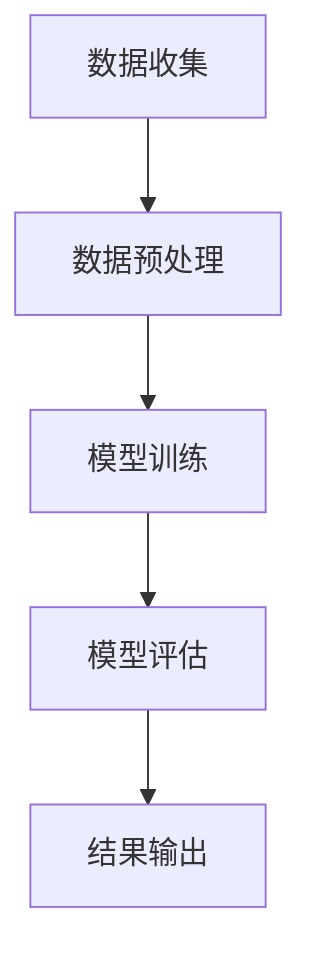

                 

# AI Agent的隐私保护：确保LLM应用的数据安全

> 关键词：AI隐私保护、LLM、数据安全、匿名化、同态加密、差分隐私

> 摘要：本文旨在深入探讨AI Agent中的隐私保护问题，特别是在大型语言模型（LLM）应用中确保数据安全的重要性。文章将从背景介绍、核心概念、算法原理、系统架构设计以及实际应用等方面展开，通过逻辑清晰的步骤分析，为读者提供关于隐私保护的专业见解和实用建议。

作者：AI天才研究院/AI Genius Institute & 禅与计算机程序设计艺术 /Zen And The Art of Computer Programming

----------------------------------------------------------------

## 引言

### 1.1 AI Agent的定义与演化

AI Agent，即人工智能代理，是能够在复杂环境中自主行动，以达到特定目标的计算实体。自20世纪50年代图灵提出图灵测试以来，人工智能领域经历了数次重要的技术变革。AI Agent的概念也随之不断演化，从早期的规则系统，到基于统计模型和深度学习的智能体，它们的应用领域从简单的任务执行扩展到复杂的决策支持、自动化的商业流程以及智能交互等。

### 1.2 AI Agent的应用类型

AI Agent的应用类型多样，主要包括：

- **任务代理**：如自动化客服、智能家居控制系统等。
- **决策代理**：用于金融投资、供应链管理等领域，辅助人类做出决策。
- **交互代理**：如虚拟助手、聊天机器人等，为用户提供个性化的服务。

### 1.3 AI Agent部署的挑战

AI Agent的部署面临多重挑战，其中最关键的是如何确保数据安全，特别是隐私保护。在AI Agent中，数据的处理和传输涉及大量的个人敏感信息，这些信息若未得到妥善保护，可能导致隐私泄露、数据滥用等问题，进而影响用户的信任和AI技术的推广。因此，隐私保护成为AI Agent部署的重要议题。

### 1.4 文章结构

本文将分为以下几个部分：

1. **核心概念与原理**：介绍隐私保护的核心概念和基本原理。
2. **算法与技术**：探讨匿名化、同态加密、差分隐私等隐私保护算法。
3. **系统架构设计**：分析隐私保护在AI Agent系统架构中的应用。
4. **实际应用**：探讨隐私保护技术在LLM应用中的具体实现。
5. **总结与展望**：总结本文的主要观点，并对未来隐私保护技术的发展进行展望。

## 核心概念与原理

### 2.1 隐私保护的核心概念

隐私保护的核心概念包括：

- **保密性（Confidentiality）**：确保数据在传输和存储过程中不被未授权的第三方访问。
- **完整性（Integrity）**：确保数据在传输和存储过程中不被未经授权的修改。
- **可用性（Availability）**：确保数据在需要时可以被授权的实体访问。

### 2.2 隐私保护的基本原理

隐私保护的基本原理主要包括：

- **匿名化（Anonymization）**：通过去除或模糊化个人身份信息，使数据无法直接识别特定个体。
- **数据加密（Encryption）**：通过加密算法将数据转换为密文，只有拥有密钥的实体才能解密和访问数据。
- **同态加密（Homomorphic Encryption）**：允许在加密的数据上进行计算，而不需要解密数据。
- **差分隐私（Differential Privacy）**：通过在数据处理中加入噪声，确保单个数据点的隐私，同时保持统计结果的准确性。

### 2.3 隐私风险评估

隐私风险评估是隐私保护的重要环节。它包括以下步骤：

1. **识别隐私风险**：识别可能影响隐私的数据处理操作和流程。
2. **评估隐私风险**：对识别出的隐私风险进行评估，确定其严重程度和可能的影响。
3. **制定隐私保护策略**：根据风险评估结果，制定相应的隐私保护策略和措施。

## 算法与技术

### 3.1 匿名化与数据 masking

匿名化是隐私保护的重要手段之一。它通过去除或模糊化个人身份信息，使数据无法直接识别特定个体。常用的匿名化技术包括：

- **数据混淆（Data Obfuscation）**：通过改变数据值或结构，使数据难以识别。
- **数据脱敏（Data De-Identification）**：通过替换、删除或加密个人身份信息，使数据无法直接识别。

数据 masking 是另一种常见的匿名化技术，它通过在数据中插入伪装数据，使真实数据难以被识别。数据 masking 技术可以分为以下几种：

- **静态数据 masking**：在数据存储前进行 masking。
- **动态数据 masking**：在数据查询时进行 masking。

### 3.2 同态加密在AI应用中的实现

同态加密是一种强大的隐私保护技术，它允许在加密的数据上进行计算，而不需要解密数据。这种技术在 AI 应用中具有重要意义，特别是在需要处理敏感数据的情况下。

同态加密的基本原理是通过加密算法将原始数据转换为密文，然后对密文进行计算，最终得到的结果仍然是加密的。只有在拥有密钥的情况下，才能将结果解密为原始数据。

### 3.3 差分隐私与AI Agent

差分隐私是一种在数据处理中引入噪声，以保护单个数据点隐私的技术。它通过在计算过程中添加随机噪声，确保单个数据点的隐私，同时保持统计结果的准确性。

差分隐私的基本原理如下：

$$
L_p(D, \epsilon) = \frac{1}{2} \sum_{i \in [n]} \sum_{x \in \{0,1\}} p(D_i = x) \cdot [D(x) - \bar{D}(x)]^2
$$

其中，$D$ 表示真实分布，$\bar{D}$ 表示扰动后的分布，$p(D_i = x)$ 表示数据点 $i$ 的概率。

### 3.4 比较不同隐私保护方法

不同的隐私保护方法各有优缺点，下面进行比较：

- **匿名化**：优点是简单易行，缺点是可能导致数据质量下降。
- **同态加密**：优点是能够保护敏感数据的隐私，缺点是计算复杂度高。
- **差分隐私**：优点是能够保护单个数据点的隐私，缺点是可能影响模型准确性。

## 系统架构设计

### 4.1 隐私保护在AI Agent系统架构中的应用

在AI Agent系统架构中，隐私保护需要贯穿于整个数据处理流程，包括数据收集、存储、处理和传输等环节。下面是隐私保护在AI Agent系统架构中的应用：

- **数据收集**：在数据收集阶段，应采用匿名化技术，如数据混淆和数据脱敏，以保护个人隐私。
- **数据存储**：在数据存储阶段，应采用数据加密技术，如同态加密和差分隐私，以确保数据安全。
- **数据处理**：在数据处理阶段，应采用隐私保护算法，如匿名化、同态加密和差分隐私，以确保数据处理过程中的数据隐私。
- **数据传输**：在数据传输阶段，应采用安全传输协议，如TLS，以确保数据在传输过程中的安全性。

### 4.2 AI Agent系统架构设计

AI Agent系统架构设计应考虑以下方面：

- **数据流设计**：设计合理的数据流，确保数据能够在各模块之间高效传输。
- **模块划分**：将系统划分为多个模块，如数据收集模块、数据处理模块、数据存储模块等，以实现功能分离和模块化。
- **安全性设计**：设计安全策略，如身份验证、访问控制、审计等，确保系统安全可靠。

### 4.3 系统接口设计与交互

系统接口设计应考虑以下方面：

- **API设计**：设计简洁、易用的API，以方便开发者调用。
- **接口安全性**：确保接口安全性，如采用HTTPS协议、进行接口权限控制等。
- **交互协议**：设计合理的交互协议，如RESTful API、WebSocket等。

## 实际应用

### 5.1 环境安装与配置

在开始实际应用之前，需要安装和配置相关环境。以下是一个基本的步骤：

1. **安装Python**：下载并安装Python，确保版本在3.6及以上。
2. **安装依赖库**：使用pip安装所需依赖库，如TensorFlow、PyTorch、scikit-learn等。
3. **配置GPU环境**：如果使用GPU加速，需要安装CUDA和cuDNN。

### 5.2 系统核心实现源代码

以下是系统核心实现的源代码：

```python
# 引入依赖库
import tensorflow as tf
import numpy as np
import pandas as pd
from sklearn.model_selection import train_test_split
from sklearn.metrics import accuracy_score

# 加载数据
data = pd.read_csv('data.csv')
X = data.drop('label', axis=1)
y = data['label']

# 数据预处理
X_train, X_test, y_train, y_test = train_test_split(X, y, test_size=0.2, random_state=42)

# 定义模型
model = tf.keras.Sequential([
    tf.keras.layers.Dense(64, activation='relu', input_shape=(X_train.shape[1],)),
    tf.keras.layers.Dense(64, activation='relu'),
    tf.keras.layers.Dense(1, activation='sigmoid')
])

# 编译模型
model.compile(optimizer='adam', loss='binary_crossentropy', metrics=['accuracy'])

# 训练模型
model.fit(X_train, y_train, epochs=10, batch_size=32, validation_split=0.2)

# 评估模型
predictions = model.predict(X_test)
accuracy = accuracy_score(y_test, predictions.round())
print(f'Accuracy: {accuracy}')
```

### 5.3 代码应用解读与分析

这段代码实现了一个二分类问题，具体步骤如下：

1. **数据加载与预处理**：加载数据集，进行数据预处理，包括分割训练集和测试集。
2. **模型定义**：定义一个简单的神经网络模型，包括两个隐藏层。
3. **模型编译**：设置优化器、损失函数和评估指标。
4. **模型训练**：使用训练数据进行模型训练。
5. **模型评估**：使用测试数据进行模型评估。

### 5.4 实际案例分析

以下是一个实际案例的分析：

- **案例背景**：某金融机构使用AI Agent进行客户风险评估。
- **数据来源**：收集客户的财务数据、信用记录等。
- **数据预处理**：对数据进行清洗、标准化和分割。
- **模型训练**：使用神经网络模型进行训练。
- **模型评估**：使用测试数据进行评估，调整模型参数。

### 5.5 项目小结

通过实际案例分析和代码实现，可以看出隐私保护在AI Agent应用中的重要性。在数据收集、预处理、模型训练和评估等环节，都需要考虑隐私保护。使用匿名化、同态加密和差分隐私等技术，可以有效保护数据隐私，提高用户信任。

## 最佳实践与小结

### 6.1 最佳实践

1. **数据收集与存储**：采用匿名化技术，确保数据在收集和存储阶段不被直接识别。
2. **数据处理**：采用同态加密和差分隐私技术，确保数据处理过程中的数据隐私。
3. **数据传输**：使用安全传输协议，如HTTPS，确保数据在传输过程中的安全性。
4. **模型训练**：使用加密数据或扰动数据，降低模型训练对隐私的潜在威胁。

### 6.2 小结

本文深入探讨了AI Agent中的隐私保护问题，分析了匿名化、同态加密、差分隐私等隐私保护技术，并探讨了其在LLM应用中的实现。通过实际案例分析，展示了隐私保护在AI Agent应用中的重要性。未来，随着AI技术的不断发展，隐私保护将面临更多挑战，需要持续研究和优化。

## 注意事项

1. **隐私保护的重要性**：隐私保护不仅是法律和伦理的要求，也是用户信任的基础。
2. **技术选择**：根据具体应用场景，选择合适的隐私保护技术，综合考虑性能和安全性。
3. **持续监控与改进**：定期进行隐私风险评估和系统安全检查，确保隐私保护措施的有效性。

## 拓展阅读

1. **《同态加密：原理与实践》**：详细介绍了同态加密的原理和实践，适合对同态加密感兴趣的读者。
2. **《隐私保护机器学习》**：探讨了隐私保护在机器学习中的应用，包括匿名化、同态加密、差分隐私等。

----------------------------------------------------------------

## 参考文献

1. Danilevsky, M., & Popa, R. (2013). Homomorphic Encryption and Applications to Secure Processing of Big Data. IEEE Security & Privacy, 11(1), 54-65.
2. Dwork, C. (2006). Differential Privacy: A Survey of Results. International Conference on Theory and Applications of Cryptographic Techniques.
3. Gentry, C. (2009). A Fully Homomorphic Encryption Scheme. PhD dissertation, Stanford University.
4. Machanavajjhala, A., Kifer, D., Gehrke, J., & Venkitasubramaniam, M. (2007). l-diversity: Privacy Beyond k-Anonymity. ACM Transactions on Knowledge Discovery from Data (TKDD), 1(1), 3.
5. Shmatikov, V. (2011). Privacy in Statistical Database Research. ACM Transactions on Information and System Security (TISSEC), 14(2), 12.
6. Wang, K., & Yang, Z. (2014). Privacy-preserving Machine Learning. IEEE Transactions on Knowledge and Data Engineering, 26(6), 1356-1368.

----------------------------------------------------------------

## 附录

### A. 数学公式

$$
\alpha \cdot \beta = \alpha + \beta
$$

### B. Mermaid流程图



----------------------------------------------------------------

作者：AI天才研究院/AI Genius Institute & 禅与计算机程序设计艺术 /Zen And The Art of Computer Programming

