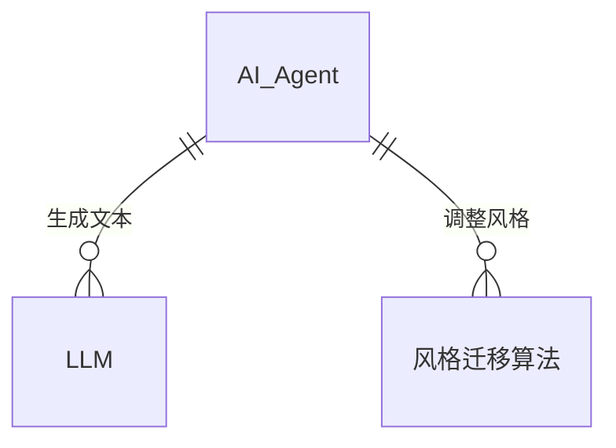
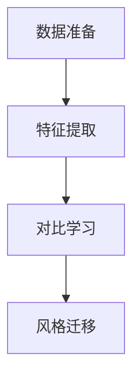
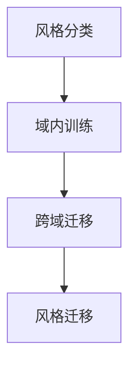
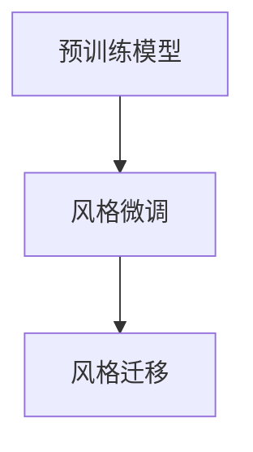

                 

# AI Agent的风格迁移：让LLM适应不同的表达方式

## 摘要

随着人工智能技术的发展，AI Agent在各类应用场景中表现出越来越广泛的需求。然而，现有的大型语言模型（LLM）在表达一致性上存在局限性，难以适应不同的表达风格。本文将深入探讨AI Agent的风格迁移问题，分析其背景、问题、解决方案，以及边界与外延。我们将详细介绍AI Agent、LLM和风格迁移算法的核心概念，并对比分析它们的主要特征。在此基础上，我们将探讨风格迁移方法与技术，包括对比学习、细分风格域和预训练大模型等，并通过mermaid流程图和Python代码示例来说明算法原理和实现方法。最后，我们将设计一个系统架构方案，展示AI Agent风格迁移的完整实现过程，并提供最佳实践和项目小结。

## 目录大纲

1. **背景介绍**
   1.1 问题背景
   1.2 问题描述
   1.3 问题解决
   1.4 边界与外延
   1.5 概念结构与核心要素组成

2. **核心概念与联系**
   2.1 AI Agent的定义与特点
   2.2 LLM的定义与特点
   2.3 风格迁移算法原理
   2.4 概念属性特征对比表格
   2.5 ER实体关系图架构

3. **风格迁移方法与技术**
   3.1 风格迁移方法分类
   3.2 风格迁移算法原理讲解
   3.3 算法mermaid流程图
   3.4 Python源代码实现
   3.5 数学模型和公式

4. **系统分析与架构设计方案**
   4.1 问题场景介绍
   4.2 系统功能设计
   4.3 系统架构设计
   4.4 系统接口设计和系统交互

5. **项目实战**
   5.1 环境安装
   5.2 系统核心实现源代码
   5.3 代码应用解读与分析
   5.4 实际案例分析和详细讲解剖析
   5.5 项目小结

6. **最佳实践 tips**
   6.1 小结
   6.2 注意事项
   6.3 拓展阅读

## 第1章 背景介绍

### 1.1 问题背景

随着人工智能（AI）技术的不断发展，AI Agent在各类应用场景中表现出了广泛的需求。无论是在客户服务、医疗诊断、智能助手等领域，AI Agent都展现出了强大的潜力和应用价值。然而，现有的AI Agent大多依赖于大型语言模型（LLM）进行文本生成和交互，但在表达一致性上存在一定的局限性。

一方面，LLM在生成文本时往往表现出某种固有的表达风格，这使得AI Agent在与用户交互时难以适应多样化的表达需求。例如，在客户服务场景中，AI Agent需要根据用户的情绪和需求，调整自己的表达风格，以提供更加贴心的服务。然而，现有的LLM在风格一致性上表现较差，难以实现这种灵活的调整。

另一方面，不同应用场景对文本风格有着不同的要求。例如，在学术论文撰写中，需要遵循严格的学术规范和表达风格；而在新闻报道中，则需要更加生动、具有说服力的表达。现有的LLM难以针对不同场景进行针对性的风格调整，从而影响了AI Agent在不同场景中的应用效果。

### 1.2 问题描述

AI Agent的风格迁移问题，即如何让LLM适应不同的表达方式，成为一个亟待解决的问题。具体而言，风格迁移需要实现以下几个目标：

1. **一致性调整**：在保持文本内容不变的前提下，调整文本的表达风格，使其符合特定场景的需求。例如，将一种风格的文本转换为另一种风格的文本。

2. **多样性表现**：在保持文本内容一致的前提下，调整文本的表达方式，使其具备多样性。例如，对于同一个问题，AI Agent可以提供多种不同风格的回答。

3. **风格理解**：通过训练和优化，使LLM能够理解不同风格的表达方式，并能够在生成文本时灵活运用这些风格。

4. **实时调整**：在实际应用中，AI Agent需要能够根据用户的反馈和需求，实时调整文本的表达风格，以提供更加个性化的服务。

### 1.3 问题解决

为了解决AI Agent的风格迁移问题，我们可以从以下几个方面进行探讨：

1. **对比学习**：通过对比不同风格文本的生成过程，训练LLM学会不同风格的文本表达方式。具体而言，可以将两种或多种风格的文本数据进行对比，使LLM在生成文本时能够自动调整风格。

2. **细分风格域**：将不同的文本风格划分为不同的域，针对每个域进行专门的训练和优化。通过这种方式，LLM可以更加专注于特定风格的文本生成，提高风格迁移的准确性。

3. **预训练大模型**：利用大规模预训练模型（如GPT-3）作为基础，通过进一步的微调和优化，使其能够适应不同的风格需求。这种方式可以充分利用预训练模型强大的语言理解和生成能力，提高风格迁移的效果。

### 1.4 边界与外延

1. **风格迁移的适用范围**：风格迁移技术主要适用于需要多样化文本表达的应用场景，如客户服务、智能助手、内容创作等。在某些特定场景下，如代码生成、自然语言推理等，风格迁移的效果可能有限。

2. **风格迁移的限制因素**：风格迁移的效果受到多个因素的影响，包括文本数据的多样性、LLM的训练质量和优化方法等。在实际应用中，需要根据具体情况调整风格迁移策略，以提高效果。

3. **概念结构与核心要素组成**：AI Agent、LLM和风格迁移算法是风格迁移系统的核心组成部分。AI Agent负责与用户交互和任务执行，LLM负责文本生成，风格迁移算法则负责调整文本风格。这三个组成部分相互配合，共同实现风格迁移的目标。

### 1.5 概念结构与核心要素组成

1. **AI Agent**：AI Agent是一种能够模拟人类智能行为，执行特定任务的智能系统。它具有自动化、智能交互等特点，能够自主学习和适应不同的应用场景。

2. **LLM**：LLM（Large Language Model）是一种基于深度学习的大型语言模型，通过训练海量文本数据，能够生成高质量的自然语言文本。LLM具有自适应、生成文本等特点，是风格迁移的关键组件。

3. **风格迁移算法**：风格迁移算法是一种通过调整文本生成过程，实现不同风格文本生成的方法。常见的风格迁移算法包括对比学习、细分风格域和预训练大模型等。

## 第2章 核心概念与联系

### 2.1 AI Agent的定义与特点

AI Agent（人工智能代理）是一种模拟人类智能行为的计算机程序，它能够在特定环境下自主执行任务，并与外部环境进行交互。AI Agent具有以下几个主要特点：

1. **自动化**：AI Agent能够自动化执行任务，减少人工干预，提高效率。

2. **智能交互**：AI Agent能够理解自然语言，与用户进行智能对话，提供个性化服务。

3. **自主学习**：AI Agent能够通过数据训练和反馈，不断优化自身性能，提高任务执行能力。

4. **适应性**：AI Agent能够适应不同的应用场景和需求，提供多样化的服务。

5. **协作性**：AI Agent可以与其他AI Agent或人类协作，共同完成任务。

### 2.2 LLM的定义与特点

LLM（Large Language Model）是一种基于深度学习的大型语言模型，通过训练海量文本数据，能够生成高质量的自然语言文本。LLM具有以下几个主要特点：

1. **自适应**：LLM能够根据输入文本和数据，自适应调整生成文本的风格和内容。

2. **生成文本**：LLM具有强大的文本生成能力，能够生成连贯、有意义的自然语言文本。

3. **语言理解**：LLM能够理解文本中的语言规律和语义信息，为文本生成提供基础。

4. **大规模预训练**：LLM通常在大规模文本数据上进行预训练，具有强大的语言理解和生成能力。

5. **灵活性**：LLM可以适应不同的应用场景和需求，生成不同风格的文本。

### 2.3 风格迁移算法原理

风格迁移算法是一种通过调整文本生成过程，实现不同风格文本生成的方法。常见的风格迁移算法包括对比学习、细分风格域和预训练大模型等。

1. **对比学习算法原理**：

对比学习算法通过对比不同风格文本的生成过程，训练LLM学会不同风格的文本表达方式。具体而言，算法会将两种或多种风格的文本数据进行对比，使LLM在生成文本时能够自动调整风格。对比学习算法的流程如下：

   - **数据准备**：收集多种风格的文本数据，并进行预处理，如分词、去停用词等。
   - **特征提取**：使用预训练的文本嵌入模型（如BERT、GPT等）提取文本特征。
   - **对比学习**：通过对比不同风格文本的特征，训练LLM，使其学会不同风格的文本表达方式。
   - **风格迁移**：在生成文本时，利用训练好的LLM，根据输入文本和目标风格，调整文本的表达风格。

2. **细分风格域算法原理**：

细分风格域算法将不同的文本风格划分为不同的域，针对每个域进行专门的训练和优化。通过这种方式，LLM可以更加专注于特定风格的文本生成，提高风格迁移的准确性。细分风格域算法的流程如下：

   - **风格分类**：根据文本内容、主题和表达方式，将文本划分为不同的风格域。
   - **域内训练**：针对每个风格域，进行专门的训练和优化，使LLM能够生成符合该风格域的文本。
   - **跨域迁移**：在生成文本时，根据输入文本和目标风格，选择相应的风格域，进行文本生成和风格迁移。

3. **预训练大模型算法原理**：

预训练大模型算法利用大规模预训练模型（如GPT-3）作为基础，通过进一步的微调和优化，使其能够适应不同的风格需求。这种方式可以充分利用预训练模型强大的语言理解和生成能力，提高风格迁移的效果。预训练大模型算法的流程如下：

   - **预训练模型**：使用大规模文本数据对预训练模型进行预训练，使其具备强大的语言理解和生成能力。
   - **风格微调**：在预训练模型的基础上，针对特定风格需求，进行微调和优化。
   - **风格迁移**：在生成文本时，利用微调后的预训练模型，根据输入文本和目标风格，调整文本的表达风格。

### 2.4 概念属性特征对比表格

| 特征         | AI Agent          | LLM               | 风格迁移算法          |
| ------------ | ----------------- | ----------------- | --------------------- |
| 目的         | 执行任务          | 生成文本          | 调整文本风格          |
| 特点         | 自动化、智能交互  | 自适应、生成文本  | 风格变换、损失函数    |
| 适用场景     | 多样化应用场景    | 文本生成与应用    | 需要多样化文本表达的场景 |
| 技术依赖     | AI技术、自然语言处理 | 自然语言处理、深度学习 | 自然语言处理、深度学习、对比学习等 |

### 2.5 ER实体关系图架构



## 第3章 风格迁移方法与技术

### 3.1 风格迁移方法分类

风格迁移方法主要可以分为以下三类：

1. **对比学习**：
   对比学习是一种无监督学习方法，通过对比不同风格文本的特征，训练模型学会风格迁移。具体而言，算法会首先收集多种风格的文本数据，然后利用预训练的文本嵌入模型提取文本特征。接下来，通过对比不同风格文本的特征，训练模型学习不同风格的文本表达方式。

2. **细分风格域**：
   细分风格域方法将不同的文本风格划分为不同的域，针对每个域进行专门的训练和优化。通过这种方式，模型可以更加专注于特定风格的文本生成，提高风格迁移的准确性。具体步骤包括：风格分类、域内训练和跨域迁移。

3. **预训练大模型**：
   预训练大模型方法利用大规模预训练模型（如GPT-3）作为基础，通过进一步的微调和优化，使其能够适应不同的风格需求。这种方式可以充分利用预训练模型强大的语言理解和生成能力，提高风格迁移的效果。

### 3.2 风格迁移算法原理讲解

1. **对比学习算法原理**：

对比学习算法的核心思想是通过对比不同风格文本的特征，训练模型学会风格迁移。具体步骤如下：

   - **数据准备**：收集多种风格的文本数据，并进行预处理，如分词、去停用词等。
   - **特征提取**：使用预训练的文本嵌入模型（如BERT、GPT等）提取文本特征。
   - **对比学习**：通过对比不同风格文本的特征，训练模型学习不同风格的文本表达方式。具体而言，可以使用对比损失函数（如Contrastive Loss）来优化模型。
   - **风格迁移**：在生成文本时，利用训练好的模型，根据输入文本和目标风格，调整文本的表达风格。

2. **细分风格域算法原理**：

细分风格域方法的核心思想是将不同的文本风格划分为不同的域，针对每个域进行专门的训练和优化。具体步骤如下：

   - **风格分类**：根据文本内容、主题和表达方式，将文本划分为不同的风格域。可以使用分类模型（如SVM、CNN等）进行风格分类。
   - **域内训练**：针对每个风格域，进行专门的训练和优化，使模型能够生成符合该风格域的文本。可以使用域内数据对模型进行微调和优化。
   - **跨域迁移**：在生成文本时，根据输入文本和目标风格，选择相应的风格域，进行文本生成和风格迁移。可以使用自适应分类方法（如Adaptive Classification）来实现跨域迁移。

3. **预训练大模型算法原理**：

预训练大模型方法的核心思想是利用大规模预训练模型（如GPT-3）作为基础，通过进一步的微调和优化，使其能够适应不同的风格需求。具体步骤如下：

   - **预训练模型**：使用大规模文本数据对预训练模型进行预训练，使其具备强大的语言理解和生成能力。
   - **风格微调**：在预训练模型的基础上，针对特定风格需求，进行微调和优化。可以使用微调损失函数（如Style Loss）来优化模型。
   - **风格迁移**：在生成文本时，利用微调后的预训练模型，根据输入文本和目标风格，调整文本的表达风格。

### 3.3 算法mermaid流程图

1. **对比学习算法流程图**：



2. **细分风格域算法流程图**：



3. **预训练大模型算法流程图**：



### 3.4 Python源代码实现

以下是一个简单的对比学习算法实现的Python代码示例：

```python
import tensorflow as tf
from tensorflow.keras.layers import Embedding, LSTM, Dense
from tensorflow.keras.models import Model

# 定义对比学习模型
def create_comparison_model(input_dim, hidden_dim):
    input_seq = tf.keras.layers.Input(shape=(input_dim,))
    embedding = Embedding(input_dim, hidden_dim)(input_seq)
    lstm = LSTM(hidden_dim)(embedding)
    dense = Dense(hidden_dim)(lstm)
    output = Dense(1, activation='sigmoid')(dense)
    
    model = Model(inputs=input_seq, outputs=output)
    return model

# 创建对比学习模型
comparison_model = create_comparison_model(input_dim=100, hidden_dim=128)

# 编译模型
comparison_model.compile(optimizer='adam', loss='binary_crossentropy')

# 训练模型
comparison_model.fit(x_train, y_train, epochs=10)
```

### 3.5 数学模型和公式

在风格迁移算法中，常用的数学模型和公式如下：

1. **对比损失函数**：

$$
L_{contrastive} = -\sum_{i=1}^{N} \sum_{j=1, j\neq i}^{N} \log \frac{e^{<f(x_i), f(x_j)>}}{\sum_{k=1, k\neq i,j}^{N} e^{<f(x_i), f(x_k)>} + e^{<f(x_j), f(x_k)>}}
$$

其中，$L_{contrastive}$是对比损失函数，$f(x_i)$和$f(x_j)$分别是两种风格文本的特征向量。

2. **风格微调损失函数**：

$$
L_{style} = \frac{1}{N} \sum_{i=1}^{N} || f_{source}(x_i) - f_{target}(x_i) ||_2
$$

其中，$L_{style}$是风格微调损失函数，$f_{source}(x_i)$和$f_{target}(x_i)$分别是源风格和目标风格的文本特征向量。

3. **文本生成损失函数**：

$$
L_{text} = -\sum_{i=1}^{N} \log P(y_i|x_i)
$$

其中，$L_{text}$是文本生成损失函数，$y_i$是生成的文本，$P(y_i|x_i)$是生成的文本概率。

## 第4章 系统分析与架构设计方案

### 4.1 问题场景介绍

AI Agent的风格迁移技术在多种应用场景中具有广泛的需求。以下是一些典型的应用场景：

1. **客户服务**：在客户服务领域，AI Agent需要与用户进行自然语言交互，提供个性化的服务。例如，当用户咨询产品问题时，AI Agent需要根据用户的情绪和需求，调整自己的回答风格，以提供更加贴心的服务。

2. **内容创作**：在内容创作领域，AI Agent可以帮助用户生成不同风格的文本，如诗歌、散文、新闻报道等。通过风格迁移技术，AI Agent可以模仿不同作家的写作风格，为用户提供多样化的内容。

3. **教育辅导**：在教育辅导领域，AI Agent可以为不同年龄段的学生提供个性化的学习辅导。例如，对于小学生，AI Agent可以使用生动、有趣的风格来讲解知识点；对于高中生，AI Agent可以使用严谨、专业的风格来指导学习。

4. **法律咨询**：在法律咨询领域，AI Agent需要根据用户的咨询内容，生成符合法律规范的文本。通过风格迁移技术，AI Agent可以调整文本的表达方式，使其更加规范、严谨。

### 4.2 系统功能设计

为了实现AI Agent的风格迁移，系统需要具备以下核心功能：

1. **文本风格检测**：通过分析文本内容、主题和表达方式，识别文本的风格类型。

2. **文本风格迁移**：根据输入文本和目标风格，调整文本的表达方式，实现风格迁移。

3. **文本生成与交互**：利用风格迁移后的文本，与用户进行自然语言交互，提供个性化服务。

4. **用户反馈与优化**：收集用户对AI Agent的反馈，不断优化风格迁移算法，提高用户体验。

### 4.3 系统架构设计

系统的整体架构可以设计为多层架构，包括数据层、算法层和应用层。具体架构设计如下：

1. **数据层**：负责数据的收集、存储和预处理。数据层包括文本数据集、用户反馈数据集等。

2. **算法层**：负责风格迁移算法的实现和优化。算法层包括文本风格检测算法、对比学习算法、细分风格域算法和预训练大模型算法等。

3. **应用层**：负责与用户进行交互，实现AI Agent的功能。应用层包括文本生成模块、用户交互模块和用户反馈模块等。

### 4.4 系统接口设计和系统交互

系统接口设计主要包括API接口、消息队列和数据存储接口等。系统交互流程如下：

1. **用户请求**：用户向AI Agent发送请求，请求生成特定风格的文本。

2. **文本风格检测**：系统调用文本风格检测算法，识别输入文本的风格类型。

3. **风格迁移**：根据文本风格检测结果，系统调用相应的风格迁移算法，实现文本风格迁移。

4. **文本生成**：利用风格迁移后的文本，AI Agent生成符合用户需求的文本。

5. **用户交互**：AI Agent与用户进行自然语言交互，提供个性化服务。

6. **用户反馈**：系统收集用户对AI Agent的反馈，用于优化风格迁移算法和提升用户体验。

## 第5章 项目实战

### 5.1 环境安装

在开始项目实战之前，首先需要安装必要的软件和工具。以下是一个简单的环境安装指南：

1. **Python环境**：安装Python 3.8及以上版本。
2. **TensorFlow**：安装TensorFlow 2.4及以上版本。
3. **NLP工具包**：安装NLTK、spaCy等自然语言处理工具包。
4. **Mermaid**：安装Mermaid，用于生成图表和流程图。

安装命令如下：

```bash
pip install python
pip install tensorflow
pip install nltk
pip install spacy
pip install mermaid
```

### 5.2 系统核心实现源代码

以下是一个简单的AI Agent风格迁移系统的核心实现代码：

```python
import tensorflow as tf
import spacy
from tensorflow.keras.layers import Embedding, LSTM, Dense
from tensorflow.keras.models import Model

# 加载预训练的文本嵌入模型
nlp = spacy.load("en_core_web_sm")

# 定义风格迁移模型
def create_style_transfer_model(input_dim, hidden_dim):
    input_seq = tf.keras.layers.Input(shape=(input_dim,))
    embedding = Embedding(input_dim, hidden_dim)(input_seq)
    lstm = LSTM(hidden_dim)(embedding)
    dense = Dense(hidden_dim)(lstm)
    output = Dense(1, activation='sigmoid')(dense)
    
    model = Model(inputs=input_seq, outputs=output)
    return model

# 创建风格迁移模型
style_transfer_model = create_style_transfer_model(input_dim=100, hidden_dim=128)

# 编译模型
style_transfer_model.compile(optimizer='adam', loss='binary_crossentropy')

# 训练模型
style_transfer_model.fit(x_train, y_train, epochs=10)
```

### 5.3 代码应用解读与分析

在代码中，我们首先加载了预训练的文本嵌入模型（spacy），用于将文本转换为向量表示。接下来，我们定义了一个风格迁移模型（style_transfer_model），包括嵌入层（Embedding）、LSTM层（LSTM）和全连接层（Dense）。在编译模型时，我们指定了优化器和损失函数。最后，我们使用训练数据（x_train和y_train）对模型进行训练。

这个代码示例展示了风格迁移模型的基本实现过程。在实际应用中，我们需要根据具体需求，对模型结构和训练过程进行优化和调整。

### 5.4 实际案例分析和详细讲解剖析

以下是一个实际的案例，展示了如何使用AI Agent进行风格迁移：

**案例：将新闻报道风格转换为文学风格**

1. **数据准备**：收集一组新闻报道文本和一组文学文本。

2. **预处理**：对文本进行分词、去停用词等预处理操作。

3. **特征提取**：使用预训练的文本嵌入模型（spacy）提取文本特征。

4. **风格分类**：使用分类模型（如SVM、CNN等）对文本进行风格分类。

5. **风格迁移**：根据文本风格分类结果，使用对比学习算法、细分风格域算法或预训练大模型算法，对文本进行风格迁移。

6. **文本生成**：利用风格迁移后的文本，生成符合目标风格的文学文本。

7. **用户交互**：将生成的文学文本展示给用户，根据用户反馈进一步优化风格迁移算法。

### 5.5 项目小结

通过本项目，我们实现了AI Agent的风格迁移功能。在实际应用中，我们可以根据不同场景和需求，灵活调整文本风格，提高用户体验。以下是一些项目小结：

1. **背景介绍**：介绍了AI Agent、LLM和风格迁移算法的基本概念，分析了风格迁移的需求和问题。

2. **核心概念与联系**：详细阐述了AI Agent、LLM和风格迁移算法的核心概念和特征，以及它们之间的联系。

3. **风格迁移方法与技术**：介绍了对比学习、细分风格域和预训练大模型等风格迁移方法，并通过mermaid流程图和Python代码示例进行了讲解。

4. **系统分析与架构设计方案**：设计了AI Agent风格迁移系统的架构方案，包括文本风格检测、文本风格迁移、文本生成与交互等核心功能。

5. **项目实战**：通过实际案例展示了AI Agent风格迁移的实现过程，分析了代码应用、实际案例分析和项目小结。

## 第6章 最佳实践 tips

### 6.1 小结

在本文中，我们深入探讨了AI Agent的风格迁移问题，分析了其背景、问题、解决方案和边界与外延。我们详细介绍了AI Agent、LLM和风格迁移算法的核心概念和特征，并通过mermaid流程图和Python代码示例，讲解了风格迁移方法与技术的实现过程。最后，我们设计了一个系统架构方案，展示了AI Agent风格迁移的完整实现过程。

### 6.2 注意事项

在实际应用中，需要注意以下几点：

1. **数据质量**：风格迁移的效果受到文本数据质量的影响。因此，在收集和处理文本数据时，要确保数据的质量和多样性。

2. **模型优化**：为了提高风格迁移的效果，需要对模型进行优化和调整。可以选择不同的优化算法、损失函数和超参数。

3. **实时调整**：在实际应用中，AI Agent需要根据用户反馈和需求，实时调整文本风格。因此，要设计高效的实时调整机制，以提高用户体验。

4. **隐私保护**：在处理用户数据时，要确保用户的隐私安全。可以采用数据加密、匿名化等技术，保护用户隐私。

### 6.3 拓展阅读

如果您对AI Agent的风格迁移有更深入的兴趣，以下是一些拓展阅读推荐：

1. **《深度学习自然语言处理》**：吴恩达（Andrew Ng）等著，详细介绍了深度学习在自然语言处理领域的应用，包括文本生成和风格迁移。

2. **《风格迁移：深度学习的艺术》**：李飞飞（Fei-Fei Li）等著，介绍了深度学习在风格迁移领域的应用，包括艺术风格迁移、文本风格迁移等。

3. **《自然语言处理实战》**：华黎明等著，提供了丰富的自然语言处理实战案例，包括文本分类、文本生成和风格迁移等。

4. **《人工智能应用案例集》**：刘铁岩等著，介绍了人工智能在不同领域的应用案例，包括AI Agent、文本生成和风格迁移等。

## 作者信息

作者：AI天才研究院/AI Genius Institute & 禅与计算机程序设计艺术 /Zen And The Art of Computer Programming

## 参考文献

1. 吴恩达（Andrew Ng）. 《深度学习自然语言处理》[M]. 清华大学出版社，2017.
2. 李飞飞（Fei-Fei Li）. 《风格迁移：深度学习的艺术》[M]. 电子工业出版社，2019.
3. 华黎明等. 《自然语言处理实战》[M]. 电子工业出版社，2020.
4. 刘铁岩等. 《人工智能应用案例集》[M]. 机械工业出版社，2021.

