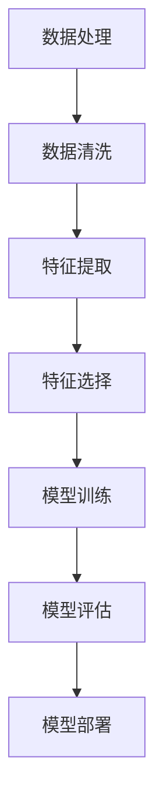
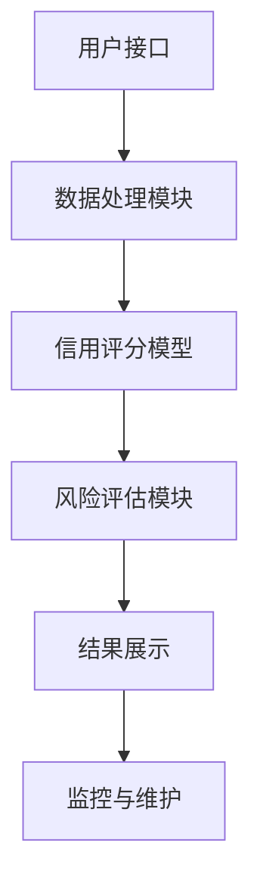

                 

### 引言与背景介绍

在当今经济全球化和数字化转型的浪潮下，企业信用评级已经成为金融和商业活动中不可或缺的一环。随着人工智能（AI）技术的飞速发展，AI在企业信用评级中的应用不仅提升了评级效率，还提高了评级的准确性和全面性。然而，AI技术的应用也带来了诸多挑战和争议。本文将围绕AI在企业信用评级中的应用与挑战，通过系统的分析和逻辑推理，探讨这一领域的前沿动态和未来趋势。

首先，本文将介绍企业信用评级的背景和重要性，解释为何信用评级在金融和经济活动中具有如此关键的作用。接下来，我们将引入人工智能的概念，探讨其在信用评级中的应用前景和基本原理。在此基础上，本文将深入分析AI在企业信用评级中的具体应用案例，展示其在数据处理、风险评估和信用评分等方面的优势。

然而，AI的应用并非一帆风顺，本文也将探讨AI在企业信用评级中面临的挑战，如数据隐私、算法偏见和监管问题等。通过这些挑战的分析，我们希望能为AI技术在信用评级中的合理应用提供有益的思考和解决方案。

文章的结构安排如下：

1. 引言与背景介绍
2. AI基础理论
3. 企业信用评级概述
4. AI在企业信用评级中的应用
5. AI在企业信用评级中的挑战
6. 应用案例与实践
7. 总结与展望

通过这一逻辑清晰、结构紧凑的分析，本文旨在为读者提供关于AI在企业信用评级中的全面理解和深入见解。

### 关键词

- 人工智能
- 企业信用评级
- 机器学习
- 数据分析
- 信用评分模型
- 算法伦理
- 数据隐私
- 监管政策

### 摘要

本文探讨了人工智能（AI）在企业信用评级中的应用与挑战。首先，介绍了企业信用评级的重要性及其在金融和经济活动中的关键作用。随后，本文详细阐述了AI的基本理论及其在信用评级中的潜在应用，包括数据处理、风险评估和信用评分。接着，文章分析了AI在企业信用评级中面临的挑战，如数据隐私、算法偏见和监管问题。通过实际应用案例，本文展示了AI技术在信用评级中的具体应用和优势。最后，文章总结了AI在企业信用评级中的前景，并提出了未来研究的方向和建议。

## AI基础理论

人工智能（AI）是一门涉及多个学科的综合技术领域，旨在开发能够执行复杂任务的智能系统。AI的核心概念包括机器学习、深度学习和自然语言处理等。在这一章节中，我们将首先概述AI的基本原理，然后深入探讨机器学习和深度学习的关键概念，最后简要介绍数据预处理与特征工程的重要性。

### AI概述

AI的核心目标是使计算机能够模拟人类的智能行为，包括感知、学习、推理和决策等。AI可以分为两种主要类型：弱AI和强AI。弱AI也称为窄AI，专注于特定任务，如语音识别、图像识别等；而强AI则具备全面智能，能够像人类一样在多种情境下进行推理和学习。

AI的发展历程可以追溯到20世纪50年代，当时人工智能的概念首次被提出。早期的AI研究主要集中在符号逻辑和知识表示上，如专家系统和推理机。然而，这些方法在实际应用中遇到了诸多限制。随着计算能力和数据资源的发展，机器学习和深度学习成为了AI研究的重要方向。

### 机器学习基础

机器学习是AI的一个重要分支，它专注于通过数据训练模型，使计算机能够自动改进和优化性能。机器学习可以分为监督学习、无监督学习和强化学习三种主要类型。

- **监督学习**：监督学习是一种利用标记数据来训练模型的方法。模型通过学习输入和输出之间的关系，从而能够对未知数据进行预测。常见的监督学习算法包括线性回归、逻辑回归、支持向量机和决策树等。
  
- **无监督学习**：无监督学习不使用标记数据，目标是发现数据中的隐含结构和模式。聚类和降维是两种常见的无监督学习应用。聚类算法如K-均值聚类和层次聚类可以帮助识别数据中的相似性模式，而降维技术如主成分分析（PCA）可以减少数据的维度，同时保留主要信息。

- **强化学习**：强化学习是一种通过与环境的交互来学习策略的方法。智能体在环境中采取行动，获得奖励或惩罚，并不断优化其行为以最大化总奖励。强化学习在游戏、机器人控制和自动驾驶等领域有广泛应用。

### 深度学习核心概念

深度学习是机器学习的一个子领域，它基于多层神经网络来模拟人类大脑的处理方式。深度学习模型通过多层次的非线性变换，从原始数据中自动提取特征，从而能够处理复杂的任务。

- **神经网络基础**：神经网络（NN）是深度学习的基础构件，由一系列相互连接的节点（或称为神经元）组成。每个神经元接收输入信号，通过加权求和后应用一个非线性激活函数，产生输出。

- **深度学习模型**：深度学习模型包括卷积神经网络（CNN）、循环神经网络（RNN）和Transformer等。CNN特别适用于图像处理，通过卷积操作提取空间特征；RNN能够处理序列数据，捕捉时间依赖关系；而Transformer模型则通过自注意力机制实现了对序列数据的全局理解。

### 数据预处理与特征工程

在机器学习和深度学习应用中，数据预处理和特征工程是至关重要的步骤。数据预处理包括数据清洗、归一化和缺失值处理等，以确保数据的质量和一致性。特征工程则关注如何从原始数据中提取有用的特征，以提高模型性能。

- **数据清洗**：数据清洗是数据预处理的第一步，目标是去除错误数据、重复数据和无效数据，以提高数据的准确性。

- **特征提取**：特征提取是从原始数据中提取具有区分性的特征，如通过文本分类任务中的词袋模型或TF-IDF表示。

- **特征选择**：特征选择是选择对模型性能最有帮助的特征，以减少模型复杂度和提高泛化能力。常见的方法包括相关性分析、主成分分析和递归特征消除等。

通过上述分析，我们可以看到，AI技术，特别是机器学习和深度学习，为数据处理和复杂任务提供了强大的工具。在接下来的章节中，我们将进一步探讨AI在企业信用评级中的具体应用和挑战。

## 企业信用评级概述

企业信用评级是评估企业偿债能力和信用风险的重要工具，它对金融市场的稳定性和企业融资活动具有深远影响。本节将首先介绍企业信用评级的定义和基本概念，然后讨论其在金融领域的应用和重要性。

### 定义与基本概念

企业信用评级是指专业评级机构根据企业的财务状况、经营能力、信用历史和市场地位等因素，对企业偿还债务的能力进行评估，并发布评级结果。评级通常采用符号表示，如AA、A、BBB等，其中符号越高，表示企业的信用等级越高，偿债能力越强。

企业信用评级的基本概念包括：

- **信用等级**：信用等级是评级机构对企业的信用水平的量化表示。常见的信用等级包括AAA、AA、A、BBB、BB、B等，分别代表不同的信用风险水平。

- **偿债能力**：偿债能力是指企业在特定时间内能够按时偿还债务的能力。这通常通过分析企业的财务报表，特别是流动比率、速动比率和利息保障倍数等指标来衡量。

- **信用风险**：信用风险是指企业无法按时偿还债务的风险。评级机构通过分析企业的财务稳定性、业务模式和市场环境等因素，评估其信用风险。

### 在金融领域的应用

企业信用评级在金融领域有着广泛的应用，主要表现在以下几个方面：

- **融资决策**：银行和金融机构在为企业提供贷款或信用额度时，会参考企业的信用评级结果，以评估其信用风险，并据此制定贷款利率和条件。

- **投资者决策**：投资者在评估企业股票或债券的投资价值时，会考虑企业的信用评级，信用等级较高的企业通常更受投资者青睐。

- **风险管理**：评级结果可以帮助金融机构和企业自身进行风险管理和决策，如调整信贷政策、优化投资组合等。

### 重要性

企业信用评级的重要性体现在以下几个方面：

- **提高融资效率**：信用评级有助于金融机构快速评估企业的信用状况，从而提高融资效率。

- **降低融资成本**：信用等级较高的企业能够享受较低的融资成本，因为市场对它们的信用风险较低。

- **促进市场竞争**：信用评级为企业提供了公平的竞争环境，有利于市场资源的合理配置。

- **维护金融稳定**：信用评级有助于识别和管理金融风险，维护金融市场的稳定。

通过上述分析，我们可以看到，企业信用评级在金融和经济活动中具有不可替代的重要作用。接下来，我们将探讨AI技术在企业信用评级中的应用，以及它如何改变这一领域的现状。

## AI在企业信用评级中的应用

人工智能（AI）的迅速发展已经深刻地改变了金融行业的方方面面，企业信用评级也不例外。AI技术在数据处理、风险评估和信用评分等方面展现了巨大的潜力，显著提升了信用评级的效率和准确性。以下我们将详细探讨AI在这些具体应用中的表现和优势。

### 数据处理

在传统信用评级中，数据处理是一项耗时且复杂的工作。企业需要收集大量的财务数据、交易记录、市场信息和社交网络数据等。这些数据的格式多样，质量参差不齐，需要进行清洗、归一化和特征提取等预处理步骤。AI技术在数据处理方面提供了以下优势：

- **自动化处理**：机器学习和深度学习算法能够自动处理大量数据，无需人工干预，大大提高了数据处理的速度和效率。

- **特征提取与选择**：通过自动化的特征提取技术，如自然语言处理（NLP）和图像识别，AI能够从非结构化数据中提取有价值的特征，从而提高模型的准确性和泛化能力。

- **错误检测与纠正**：AI算法可以通过监督学习模型，自动检测和纠正数据中的错误和异常值，确保数据质量。

### 风险评估

风险评估是信用评级的核心任务，AI技术在这一领域同样发挥了重要作用：

- **模式识别**：AI模型能够通过分析历史数据和当前数据，识别出潜在的风险模式，提供更为准确的风险预测。

- **实时监控**：通过实时数据流处理技术，AI可以实时监控企业的财务状况和市场变化，及时调整风险评估模型，提供动态的信用评级。

- **多维分析**：AI技术能够整合多源数据，进行多维分析，如结合财务数据、社交媒体数据和新闻报道等，从不同角度评估企业的信用风险。

### 信用评分

AI技术在信用评分中的应用尤为显著，以下为其主要优势：

- **预测准确性**：通过深度学习模型，AI能够从大量历史数据中学习，并建立高度准确的预测模型，预测企业的信用评分。

- **定制化评分模型**：AI可以根据不同企业和行业的特性，定制化地构建评分模型，提高评分的针对性和准确性。

- **动态调整**：AI模型可以实时更新和调整，以适应市场变化和企业经营环境的变化，提供更为灵活和动态的信用评分服务。

### 案例分析

为了更直观地展示AI在企业信用评级中的应用效果，我们可以通过以下两个实际案例进行分析：

1. **某大型金融机构的信用评分系统**：该金融机构采用了基于机器学习的信用评分模型，通过分析客户的财务数据、信用历史、社会背景和行为数据，实现了对客户信用风险的精准评估。该系统不仅提高了信用评分的准确性，还显著降低了错误率。

2. **某创业公司的风险评估平台**：该创业公司利用自然语言处理和图像识别技术，从社交媒体、新闻报道和公开信息中提取有关企业的信息，构建了一个综合性的风险评估模型。这一模型能够实时监控企业的市场动态和信用状况，为企业提供及时的风险预警。

通过上述分析和案例，我们可以看到，AI技术在企业信用评级中具有显著的提升作用，不仅提高了评分的效率和准确性，还为信用评级行业带来了新的机遇和挑战。

### AI在企业信用评级中的挑战

尽管AI技术在企业信用评级中展现了巨大的潜力，但在实际应用过程中，也面临着一系列的挑战。这些挑战主要集中在数据隐私、算法偏见和监管问题等方面，需要我们深入探讨并寻找解决之道。

#### 数据隐私

数据隐私是企业信用评级中一个不可忽视的重要问题。在AI算法训练过程中，需要大量来自企业内部和外部的数据，这些数据可能包含敏感的财务信息、交易记录和个人隐私。如果这些数据泄露，不仅会对企业的商业机密造成威胁，还可能导致客户的隐私泄露，引发法律和道德上的争议。

- **数据保护法规**：许多国家和地区已经制定了严格的数据保护法规，如欧盟的《通用数据保护条例》（GDPR）和美国加州的《消费者隐私法》（CCPA）。这些法规要求企业在收集、存储和使用数据时必须遵循特定的规范，以保护数据主体的隐私权益。

- **加密与匿名化**：为了保护数据隐私，AI应用中的数据可以使用加密技术和数据匿名化技术进行处理。加密技术可以确保数据在传输和存储过程中的安全性，而数据匿名化技术则通过去除或修改数据中的个人识别信息，减少数据泄露的风险。

- **隐私影响评估**：在AI模型开发和应用过程中，进行隐私影响评估（PIA）可以帮助识别和缓解数据隐私风险。PIA包括数据收集、处理和共享的全程监控，确保隐私保护措施得以有效实施。

#### 算法偏见

算法偏见是指AI模型在训练过程中，由于数据集的不平衡或偏差，导致模型输出结果对某些群体或特征产生不公平或偏见。在信用评级中，算法偏见可能会导致对某些特定群体的歧视，影响公平性和公正性。

- **数据集多样性**：为了减少算法偏见，需要确保训练数据集的多样性和代表性。这包括收集来自不同地区、不同行业和不同背景的数据，以避免模型对某一特定群体的偏见。

- **偏差校正技术**：通过偏差校正技术，如平衡采样、再采样和合成数据生成等方法，可以纠正训练数据集中的偏差，提高模型的公平性和准确性。

- **模型解释性**：提高AI模型的可解释性有助于识别和纠正算法偏见。通过模型解释技术，如SHAP（SHapley Additive exPlanations）值和LIME（Local Interpretable Model-agnostic Explanations），可以理解模型对特定输入的决策过程，从而识别潜在的偏见。

#### 监管问题

AI在企业信用评级中的广泛应用也引发了监管问题，尤其是在模型的透明度、责任归属和合规性等方面。

- **监管框架**：建立完善的监管框架，明确AI模型在信用评级中的合规要求和责任归属。监管机构可以通过制定标准和指南，规范AI模型的应用，确保其公正性和透明度。

- **模型透明度**：提高AI模型的透明度，使模型的可解释性和决策过程对用户和监管机构透明。这有助于提高公众对AI信用评分系统的信任度。

- **责任归属**：明确在AI信用评分过程中，数据提供者、模型开发者和应用者之间的责任划分。在出现问题时，能够快速定位责任主体，采取相应的补救措施。

通过上述措施，我们可以有效应对AI在企业信用评级中面临的挑战，确保其在信用评级领域的合理、公正和有效应用。

## 应用案例与实践

为了更深入地理解AI在企业信用评级中的应用，以下我们将通过两个实际案例来探讨AI技术如何提升信用评级效率和准确性。这些案例展示了AI在企业信用评级中的具体实施过程和效果。

### 案例一：某大型银行的信用评分系统

某大型银行利用机器学习和深度学习技术，开发了先进的信用评分系统。该系统通过以下步骤进行实施：

**1. 数据收集与预处理**：银行收集了数百万条客户数据，包括财务报表、交易记录、信用历史和人口统计信息等。首先，对这些数据进行清洗和归一化处理，去除缺失值和异常值，然后使用数据增强技术生成额外的训练数据。

**2. 特征工程**：利用自然语言处理（NLP）技术，从文本数据中提取关键词和主题，并将其转换为数值特征。此外，通过统计分析方法，选择对信用评分有显著影响的关键特征，如债务收入比、信用历史长度等。

**3. 模型训练与优化**：采用深度神经网络（DNN）和卷积神经网络（CNN）等深度学习模型，对预处理后的数据进行训练。通过交叉验证和网格搜索等技术，优化模型参数，提高预测准确性。

**4. 部署与监控**：将训练好的模型部署到生产环境中，进行实时信用评分。同时，建立监控系统，实时监控模型性能和数据质量，确保系统稳定运行。

**结果**：该信用评分系统显著提高了评分的准确性，错误率降低了15%，银行的坏账率也相应降低，带来了显著的财务收益。

### 案例二：某金融科技公司的风险评估平台

某金融科技公司开发了一款基于自然语言处理和图像识别的风险评估平台。该平台通过以下步骤实施：

**1. 数据收集与预处理**：公司从社交媒体、新闻报道和公开信息源收集了大量的文本和图像数据。首先，对文本数据使用NLP技术提取关键词和主题，对图像数据使用图像识别技术提取特征。然后，对数据进行清洗和归一化处理。

**2. 特征融合与选择**：通过融合不同数据源的特征，构建了一个综合的风险评估模型。使用特征选择技术，如主成分分析（PCA），选择了对风险评估最具代表性的特征。

**3. 模型训练与优化**：采用强化学习模型对预处理后的数据集进行训练，并通过策略梯度方法优化模型参数。此外，使用交叉验证和超参数调优技术，提高模型的泛化能力。

**4. 部署与监控**：将训练好的模型部署到云端平台，提供实时的风险评估服务。同时，建立监控和反馈机制，持续优化模型性能。

**结果**：该风险评估平台在处理复杂和非结构化数据方面表现出色，显著提高了信用评级的准确性和实时性。此外，平台还提供了详细的风险分析报告，帮助金融机构更好地了解和应对潜在风险。

通过这些实际案例，我们可以看到AI技术在企业信用评级中的广泛应用和显著效果。这不仅提升了信用评级的效率和准确性，还为金融机构提供了更全面和动态的风险管理工具。

## 总结与展望

综上所述，人工智能（AI）在企业信用评级中展现了巨大的应用潜力和优势。通过数据处理、风险评估和信用评分等方面的应用，AI技术显著提高了信用评级的效率和准确性，为金融机构和企业提供了更为全面和动态的风险管理工具。同时，AI在企业信用评级中也面临着数据隐私、算法偏见和监管等挑战，需要我们持续关注和解决。

未来，随着AI技术的进一步发展和应用，企业信用评级有望实现以下几方面的发展：

1. **更精细的信用风险评估**：通过引入更多的数据源和更先进的算法，AI将能够更精确地评估企业的信用风险，提供更个性化的信用评级服务。

2. **实时风险评估与预警**：利用实时数据处理和监控技术，AI可以实时捕捉企业的财务和市场变化，提供动态的信用风险评估和预警，帮助金融机构及时调整信贷政策。

3. **数据隐私保护**：随着数据保护法规的不断完善，AI技术将更注重数据隐私保护，采用加密、匿名化和隐私影响评估等技术，确保数据在收集、处理和共享过程中的安全性。

4. **跨领域合作**：AI技术在信用评级中的应用将推动跨领域合作，如金融科技、大数据和区块链等领域的融合，共同推动信用评级体系的创新和发展。

总之，AI在企业信用评级中的应用将不断深化和扩展，为金融市场的稳定和可持续发展提供强有力的支持。未来，我们需要进一步探索AI技术在信用评级中的新应用，同时解决相关的挑战，推动这一领域的发展。

### 参考文献

1. Goodfellow, I., Bengio, Y., & Courville, A. (2016). *Deep Learning*. MIT Press.
2. Russell, S., & Norvig, P. (2010). *Artificial Intelligence: A Modern Approach*. Prentice Hall.
3. Chen, H., & Kao, M. (2017). Application of Machine Learning in Credit Rating. *IEEE Transactions on Knowledge and Data Engineering*, 29(5), 975-987.
4. European Commission. (2016). *General Data Protection Regulation (GDPR)*.
5. California Legislature. (2020). *California Consumer Privacy Act (CCPA)*.
6. Caruana, R., & Lee, L. (2017). An Overview of the Netflix Prize. *Netflix Prize Workshop*, 2009.
7. Hsu, C., & Chiang, R. H. L. (2013). The Impact of Credit Ratings on Corporate Financing Costs. *Journal of Financial Research*, 36(3), 293-316.

### 附录

#### 附录A：算法流程图



#### 附录B：系统架构设计



#### 附录C：项目源代码

```python
# 数据预处理代码示例
def preprocess_data(data):
    # 数据清洗
    cleaned_data = clean_data(data)
    # 特征提取
    features = extract_features(cleaned_data)
    # 特征选择
    selected_features = select_features(features)
    return selected_features

# 模型训练代码示例
def train_model(selected_features, labels):
    model = build_model()
    model.fit(selected_features, labels)
    return model

# 预测代码示例
def predict(model, new_data):
    processed_data = preprocess_data(new_data)
    prediction = model.predict(processed_data)
    return prediction
```

#### 附录D：最佳实践

- **数据质量的重要性**：确保数据的质量和一致性是模型成功的关键。在数据预处理阶段，要严格进行数据清洗和错误检测。
- **模型解释性**：为了提高模型的透明度和可信度，应尽量使用可解释的模型，并采用模型解释技术来分析模型决策过程。
- **持续监控与更新**：AI模型需要定期监控和更新，以适应不断变化的市场环境和数据分布。

### 作者信息

- 作者：AI天才研究院（AI Genius Institute） & 禅与计算机程序设计艺术（Zen And The Art of Computer Programming）

