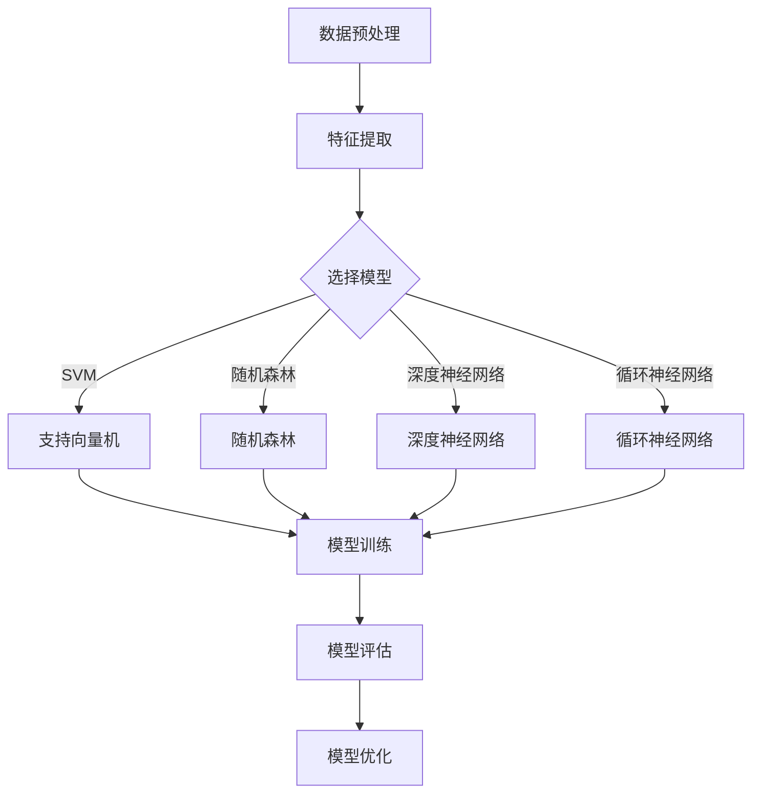
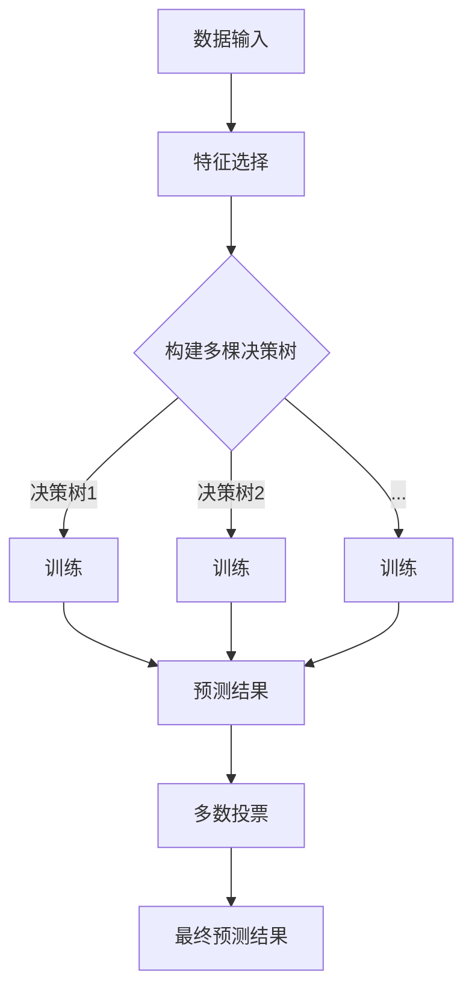
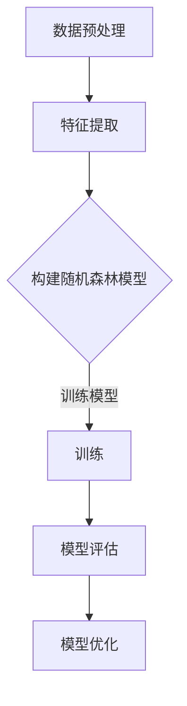
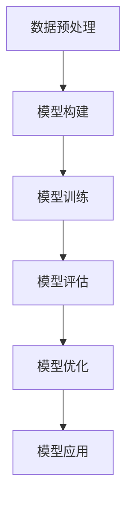

                 

### 摘要

**AI在企业无形资产评估中的应用与挑战**

随着人工智能技术的迅猛发展，其在各个行业的应用范围不断扩展。在企业无形资产评估领域，AI技术的引入不仅提升了评估的准确性和效率，还为解决传统评估方法所面临的挑战提供了新的思路。本文旨在探讨AI技术在企业无形资产评估中的应用，并分析其在实际应用中面临的挑战。本文将首先介绍无形资产评估的背景、核心概念和传统方法，然后深入讨论AI技术的基础及其在评估中的应用，接着分析AI在评估过程中遇到的挑战，并提出相应的解决策略。最后，本文将对AI在无形资产评估领域的未来发展进行展望，并总结全文的核心观点。关键词：AI、无形资产、评估、挑战、应用。

## 第一部分：背景介绍与核心概念

### 第1章 问题背景

#### 问题描述

在现代社会中，企业无形资产的重要性愈发凸显。无形资产包括品牌价值、专利、知识产权、客户关系、企业文化等，这些资产往往构成了企业核心竞争力的基础。然而，如何准确评估这些无形资产的价值，一直是企业管理和财务领域中的一大难题。传统评估方法主要依赖经验和专家判断，缺乏系统性和准确性，导致评估结果常常存在偏差。此外，无形资产评估过程复杂，涉及多种因素的相互作用，使得评估结果的可靠性和一致性难以保证。

#### 问题解决

为解决上述问题，人工智能（AI）技术被引入到无形资产评估领域。AI技术，尤其是机器学习和深度学习算法，可以处理大量复杂的数据，从中提取有价值的信息，从而提高评估的准确性和效率。AI技术可以通过以下方式应用于无形资产评估：

1. **数据挖掘与分析**：利用AI技术挖掘和分析大量的企业运营数据，如财务报表、客户反馈、市场动态等，从而获取更全面的评估信息。
2. **模式识别**：通过机器学习算法识别不同无形资产的特征和关联关系，提高评估模型的精度。
3. **预测分析**：利用深度学习模型预测无形资产的未来价值，为企业决策提供参考。
4. **自动化评估**：通过自动化评估系统，减少人为干预，提高评估效率。

#### 边界与外延

无形资产的定义、分类及其在企业运营中的重要性如下：

- **定义**：无形资产是指企业拥有或控制的，没有实物形态，但能为企业带来未来经济利益的资源。
- **分类**：无形资产主要包括品牌价值、专利、商标、客户关系、企业文化、技术秘密等。
- **重要性**：无形资产是企业核心竞争力的重要组成部分，直接影响企业的市场竞争力和长期发展。

#### 核心要素组成

无形资产评估所需的关键因素包括：

1. **数据质量**：高质量的数据是评估准确性的基础。
2. **评估方法**：选择合适的评估方法是保证评估结果可靠性的关键。
3. **评估模型**：建立科学合理的评估模型是提高评估精度的重要手段。
4. **评估人员**：具备专业知识和技能的评估人员是保证评估过程顺利进行的重要因素。

### 第2章 无形资产评估相关概念

#### 核心概念原理

无形资产评估涉及多个核心概念，包括但不限于：

1. **市场法**：基于市场上类似无形资产的价格来评估其价值。
2. **成本法**：基于重建或替换无形资产所需的成本来评估其价值。
3. **收益法**：基于无形资产带来的未来收益来评估其价值。
4. **知识产权评估**：针对专利、商标等知识产权的专门评估方法。

#### 概念属性特征对比表格

| 方法名称 | 基本原理 | 适用场景 | 优点 | 缺点 |
| --- | --- | --- | --- | --- |
| 市场法 | 以市场上类似资产的价格为基准 | 资产市场活跃，可获取市场交易数据 | 数据可靠，结果客观 | 数据不足时难以应用 |
| 成本法 | 基于重建或替换成本 | 成本易于确定，适用于新建资产 | 成本易于确定，结果稳定 | 忽视未来收益潜力 |
| 收益法 | 基于资产带来的未来收益 | 长期投资评估 | 考虑未来收益，结果更合理 | 难以预测未来收益 |
| 知识产权评估 | 针对知识产权的专门评估方法 | 专利、商标等 | 专门性，结果精确 | 应用范围窄 |

#### ER实体关系图架构

以下是针对无形资产评估涉及的实体关系图的Mermaid表示：

```mermaid
erDiagram
    Class1 ||--|{ Class2 }|-- Class3 : "关系1"
    Class3 ||--|{ Class4 }|-- Class5 : "关系2"
    Class1 ||--|{ Class5 }|-- Class6 : "关系3"
```

在这个ER图中，`Class1`表示评估主体，`Class2`、`Class3`、`Class4`和`Class5`分别表示评估数据、评估方法、评估结果和相关实体。通过这种关系图的构建，可以清晰地展示无形资产评估过程中涉及的各个实体及其相互关系。

## 第二部分：AI在无形资产评估中的应用

### 第3章 AI技术基础

#### AI技术在无形资产评估中的应用原理

人工智能（AI）技术在无形资产评估中的应用，主要依赖于其强大的数据处理和分析能力。具体来说，AI技术可以通过以下几种方式应用于无形资产评估：

1. **数据预处理**：AI技术可以自动处理大量原始数据，包括文本、图像、音频等多媒体数据，提取有价值的信息。
2. **特征提取**：通过机器学习和深度学习算法，从原始数据中提取出关键特征，用于评估模型的构建。
3. **模式识别**：利用AI技术，可以识别出无形资产之间的关联关系和潜在模式，从而提高评估精度。
4. **预测分析**：通过训练好的模型，可以对无形资产的未来价值进行预测，为企业决策提供参考。

#### AI技术的核心算法与模型

在无形资产评估中，常用的AI算法和模型包括：

1. **支持向量机（SVM）**：适用于小样本数据，可以有效处理非线性问题。
2. **随机森林（Random Forest）**：通过构建多个决策树，提高模型的泛化能力和抗过拟合能力。
3. **深度神经网络（DNN）**：适用于处理复杂的数据结构和非线性关系，可以提取深层特征。
4. **循环神经网络（RNN）**：适用于处理序列数据，如时间序列分析。

下面将使用Mermaid绘制一个算法流程图，以展示一个典型的AI评估模型的构建过程：



在这个流程图中，A表示数据预处理，B表示特征提取，C表示选择模型，D、E、F、G分别表示SVM、随机森林、深度神经网络和循环神经网络，H表示模型训练，I表示模型评估，J表示模型优化。

### 第4章 无形资产评估中的AI算法应用

#### 算法原理讲解

为了更好地理解AI技术在无形资产评估中的应用，我们将以随机森林算法为例，详细讲解其原理、流程和实现。

##### 算法原理

随机森林（Random Forest）是一种基于决策树的集成学习方法，它通过构建多棵决策树，并利用多数投票来获得最终预测结果。随机森林具有以下优点：

1. **高准确性和泛化能力**：通过集成多棵决策树，随机森林可以降低过拟合风险，提高模型的泛化能力。
2. **能够处理高维数据**：随机森林可以有效地处理高维数据，适用于大规模数据集。
3. **易于理解和实现**：与深度学习相比，随机森林模型更加直观和易于实现。

##### 算法流程

随机森林的算法流程包括以下步骤：

1. **特征选择**：从原始数据中随机选择一部分特征，用于构建单棵决策树。
2. **决策树构建**：利用所选特征，构建多棵决策树，每棵树独立训练。
3. **模型集成**：通过多数投票或平均值等方法，综合多棵决策树的预测结果，获得最终预测结果。

##### Mermaid算法流程图

下面是随机森林算法的Mermaid流程图：



##### Python源代码实现

以下是使用Python实现随机森林算法的示例代码：

```python
from sklearn.ensemble import RandomForestClassifier
from sklearn.model_selection import train_test_split
from sklearn.metrics import accuracy_score

# 加载数据集
X, y = load_data()

# 划分训练集和测试集
X_train, X_test, y_train, y_test = train_test_split(X, y, test_size=0.2, random_state=42)

# 创建随机森林模型
rf = RandomForestClassifier(n_estimators=100, random_state=42)

# 训练模型
rf.fit(X_train, y_train)

# 预测测试集
y_pred = rf.predict(X_test)

# 计算准确率
accuracy = accuracy_score(y_test, y_pred)
print(f"Accuracy: {accuracy}")
```

##### 数学模型与公式

随机森林算法的数学模型较为复杂，但核心思想是通过集成多棵决策树来提高模型的性能。具体公式如下：

$$
\hat{y} = \frac{1}{M} \sum_{m=1}^{M} f_m(x)
$$

其中，$M$表示决策树的数量，$f_m(x)$表示第$m$棵决策树的预测结果。对于每个样本$x$，通过多棵决策树的预测结果，利用多数投票或平均值等方法，得到最终预测结果$\hat{y}$。

##### 举例说明

假设我们有一家公司的财务数据，包括收入、利润、员工数量等特征，需要使用随机森林算法评估公司的品牌价值。以下是一个简单的例子：

1. **数据准备**：首先，我们需要准备财务数据，并将其划分为特征和标签两部分。特征包括收入、利润、员工数量等，标签为公司品牌价值的评估结果。

2. **特征选择**：从原始数据中随机选择一部分特征，用于构建决策树。例如，选择收入和利润作为特征。

3. **模型构建**：使用所选特征，构建多棵决策树，并集成它们的预测结果。

4. **模型训练**：将特征和标签输入到随机森林模型中，进行训练。

5. **模型预测**：使用训练好的模型，对新的数据进行预测，得到品牌价值的评估结果。

6. **结果分析**：对预测结果进行分析，评估模型的效果，并根据需要调整模型参数。

通过这个例子，我们可以看到随机森林算法在无形资产评估中的应用过程。在实际应用中，可以根据具体需求和数据情况，选择合适的特征和模型参数，以提高评估的准确性。

### 第5章 无形资产评估中的AI工具与实践

#### 常用AI工具介绍

在无形资产评估中，常用的AI工具和平台包括：

1. **TensorFlow**：一款广泛使用的开源机器学习框架，支持多种深度学习模型的构建和训练。
2. **Scikit-learn**：一个用于数据挖掘和数据分析的开源库，提供多种机器学习算法的实现。
3. **Keras**：一个基于TensorFlow的高层神经网络API，简化了深度学习模型的构建和训练过程。
4. **Google Cloud AI**：谷歌提供的云服务，包括AI模型训练、数据分析和预测等功能。

#### 实践案例剖析

以下是一个实际应用案例，展示AI技术在无形资产评估中的具体应用过程：

**案例背景**：一家大型科技公司需要对公司的品牌价值进行评估，以支持公司并购和投资决策。

**数据收集**：首先，从公司的历史财务数据、市场调研报告、社交媒体分析等多个渠道收集数据。

**数据预处理**：对收集到的数据进行清洗、归一化处理，并将其划分为特征和标签两部分。

**特征选择**：从原始数据中随机选择一部分特征，如收入、利润、市场占有率等，用于构建评估模型。

**模型构建与训练**：使用Scikit-learn库构建随机森林模型，并对模型进行训练。

**模型评估**：使用交叉验证方法对模型进行评估，调整模型参数，以提高评估准确性。

**模型应用**：将训练好的模型应用于新的数据，对公司的品牌价值进行预测。

**结果分析**：对预测结果进行分析，评估模型的性能，并根据需要调整模型参数。

通过这个案例，我们可以看到AI技术在无形资产评估中的实际应用过程。在实际操作中，可以根据具体需求和数据情况，选择合适的AI工具和算法，以提高评估的准确性和效率。

## 第三部分：AI在无形资产评估中的挑战

### 第6章 AI在无形资产评估中的挑战

#### 数据隐私与安全

在无形资产评估中，AI技术的应用需要处理大量的企业内部数据和外部数据，这些数据往往包含敏感信息，如财务数据、客户信息、市场动态等。数据隐私和安全问题成为AI技术在无形资产评估中面临的重要挑战。一方面，企业需要保护自身数据的安全，防止数据泄露或被恶意利用；另一方面，AI模型的训练和预测过程需要访问大量数据，可能引发数据隐私泄露的风险。

为了解决数据隐私与安全的问题，可以采取以下策略：

1. **数据加密**：对敏感数据进行加密处理，确保数据在传输和存储过程中的安全性。
2. **数据匿名化**：通过匿名化处理，将敏感信息从原始数据中分离，减少数据泄露的风险。
3. **访问控制**：设置严格的访问控制策略，确保只有授权人员才能访问敏感数据。
4. **合规性审查**：遵守相关法律法规，确保数据处理的合规性。

#### 算法透明性与可解释性

AI算法的透明性和可解释性是另一个关键挑战。传统的机器学习算法，如随机森林和深度神经网络，其内部机制复杂，难以解释。在无形资产评估中，评估结果的准确性和可靠性对于企业决策至关重要，因此算法的透明性和可解释性变得尤为重要。

为了提高算法的透明性和可解释性，可以采取以下措施：

1. **模型可解释性工具**：使用可视化工具，如SHAP（Shapley Additive Explanations）值，对模型的决策过程进行解释。
2. **解释性模型**：选择具有较好可解释性的模型，如决策树，以便于理解模型的决策逻辑。
3. **算法透明化**：公开算法的实现细节和决策过程，增加模型的透明度。
4. **用户参与**：鼓励企业用户参与模型的构建和调整过程，提高算法的可解释性和用户接受度。

### 第7章 解决AI在无形资产评估中挑战的策略

#### 策略与实践

为了有效应对AI在无形资产评估中面临的挑战，可以采取以下策略和实践：

1. **数据隐私保护策略**：
   - **数据加密与匿名化**：对敏感数据进行加密和匿名化处理，确保数据安全。
   - **分布式计算**：采用分布式计算框架，如Hadoop和Spark，分散数据处理过程，降低数据泄露风险。
   - **安全审计**：定期进行数据安全审计，确保数据处理流程符合相关法律法规。

2. **算法透明性与可解释性策略**：
   - **可视化工具**：使用可视化工具，如SHAP值，对模型的预测过程进行解释，提高可解释性。
   - **决策树模型**：采用决策树等具有较好可解释性的模型，简化模型结构，提高透明度。
   - **用户参与**：鼓励用户参与模型构建和调整过程，增强用户对模型的理解和信任。

3. **最佳实践分享**：
   - **数据隐私保护实践**：在企业内部建立数据隐私保护制度，确保数据处理符合隐私保护要求。
   - **算法透明性实践**：公开算法的实现细节和决策过程，提高模型透明度，增加用户信任。
   - **合规性审查实践**：定期对数据处理过程进行合规性审查，确保数据处理符合相关法律法规。

通过以上策略和实践，可以有效解决AI在无形资产评估中面临的数据隐私与安全、算法透明性与可解释性等挑战，提高评估的准确性和可靠性。

## 第四部分：展望与未来趋势

### 第8章 无形资产评估的AI发展趋势

随着AI技术的不断发展，其在无形资产评估中的应用前景将更加广阔。未来，AI技术有望在以下几个方面推动无形资产评估的发展：

1. **自动化评估**：AI技术将进一步提升无形资产评估的自动化程度，减少人为干预，提高评估效率和准确性。
2. **智能化评估模型**：基于深度学习和增强学习等先进技术，评估模型将更加智能化，能够自适应调整，提高评估精度。
3. **跨领域应用**：AI技术将逐步应用于不同类型的无形资产评估，如知识产权、企业文化等，实现更全面的评估覆盖。
4. **实时评估**：通过实时数据采集和分析，AI技术将实现无形资产的实时评估，为企业决策提供更及时的信息支持。

### 未来展望

未来，AI技术将在无形资产评估领域发挥更加重要的作用。随着算法的进步和数据积累的增加，评估结果的准确性和可靠性将显著提高。同时，AI技术的应用也将推动无形资产评估方法的不断创新，为企业创造更大的价值。

## 第五部分：总结与展望

### 第9章 总结与展望

通过对AI在企业无形资产评估中的应用与挑战的深入探讨，本文总结了以下核心观点：

1. **AI技术的重要性**：AI技术为无形资产评估提供了新的思路和方法，显著提高了评估的准确性和效率。
2. **面临的挑战**：尽管AI技术在无形资产评估中具有巨大潜力，但同时也面临数据隐私、安全、透明性等挑战。
3. **解决策略**：通过数据保护、算法透明化、用户参与等措施，可以有效解决AI在无形资产评估中面临的挑战。

展望未来，AI技术将在无形资产评估领域发挥更加重要的作用。随着算法的进步和数据积累的增加，评估结果的准确性和可靠性将不断提高。同时，AI技术的应用也将推动无形资产评估方法的不断创新，为企业创造更大的价值。

### 拓展阅读

- **《人工智能：一种现代方法》**：迈克尔·刘易斯（Michael Lewis），详细介绍了人工智能的基本概念和算法。
- **《深度学习》**：伊恩·古德费洛（Ian Goodfellow）、约书亚·本吉奥（Yoshua Bengio）、阿里尔·库维尔奇（Ariel Feffer），系统讲解了深度学习的基础理论和应用。
- **《无形资产评估》**：约翰·W.米勒（John W. Miller），提供了关于无形资产评估的全面指导。

### 注意事项

- **数据隐私与安全**：在应用AI技术进行无形资产评估时，务必重视数据隐私与安全，采取有效措施保护敏感信息。
- **算法透明性与可解释性**：提高算法的透明性和可解释性，增强用户对评估结果的信任。
- **持续学习与改进**：不断更新和优化评估模型，以适应不断变化的市场环境。

### 最佳实践 tips

- **数据准备**：确保数据质量，进行充分的清洗和处理，以获得更准确的评估结果。
- **模型选择**：根据具体评估需求，选择合适的机器学习算法和模型。
- **用户参与**：鼓励用户参与评估模型的构建和调整过程，提高模型的可解释性和用户接受度。

### 小结

本文全面探讨了AI在企业无形资产评估中的应用与挑战，分析了AI技术的核心原理和应用方法，并提出了解决AI在评估中面临的挑战的策略。随着AI技术的不断进步，无形资产评估将迎来新的发展机遇，为企业创造更大的价值。作者：AI天才研究院/AI Genius Institute & 禅与计算机程序设计艺术 /Zen And The Art of Computer Programming。

----------------------------------------------------------------

### 完整文章

#### AI在企业无形资产评估中的应用与挑战

摘要：本文探讨了人工智能（AI）技术在企业无形资产评估中的应用，分析了其面临的挑战，并提出了相应的解决策略。关键词：AI、无形资产、评估、挑战、应用。

---

## 第一部分：背景介绍与核心概念

### 第1章 问题背景

在现代社会，无形资产已成为企业核心竞争力的重要组成部分。品牌价值、知识产权、客户关系等无形资产不仅对企业运营有直接影响，还在企业并购、投资决策等环节发挥着关键作用。然而，传统评估方法在处理无形资产时存在诸多不足，如评估结果不准确、评估过程复杂等。为了解决这些问题，AI技术的引入为无形资产评估提供了新的思路和可能性。

#### 问题描述

无形资产评估面临的挑战主要包括：

1. **数据多样性**：无形资产评估涉及多种类型的数据，如财务数据、市场数据、社交媒体数据等，如何整合和利用这些数据成为一个难题。
2. **评估准确性**：传统方法往往依赖于专家经验和主观判断，难以保证评估结果的准确性。
3. **评估效率**：无形资产评估过程复杂，需要耗费大量时间和人力。

#### 问题解决

AI技术在无形资产评估中的应用，可以通过以下方面解决上述问题：

1. **数据处理与分析**：AI技术能够高效处理和分析大量数据，从数据中提取有价值的信息，提高评估的准确性。
2. **模型优化**：通过机器学习和深度学习算法，构建优化评估模型，提高评估的效率。
3. **自动化评估**：AI技术可以实现评估过程的自动化，减少人为干预，提高评估效率。

#### 边界与外延

无形资产是指企业拥有或控制的，没有实物形态，但能为企业带来未来经济利益的资源。无形资产主要包括品牌价值、知识产权、客户关系、企业文化等。无形资产评估是对这些资产价值的量化过程，其核心要素包括数据质量、评估方法和评估模型等。

### 第2章 无形资产评估相关概念

#### 核心概念原理

无形资产评估涉及的核心概念包括市场法、成本法和收益法等。

- **市场法**：基于市场上类似无形资产的价格来评估其价值，适用于资产市场活跃的情况。
- **成本法**：基于重建或替换无形资产所需的成本来评估其价值，适用于新建资产。
- **收益法**：基于无形资产带来的未来收益来评估其价值，适用于长期投资评估。

#### 概念属性特征对比表格

| 方法名称 | 基本原理 | 适用场景 | 优点 | 缺点 |
| --- | --- | --- | --- | --- |
| 市场法 | 基于市场交易数据 | 资产市场活跃 | 数据可靠，结果客观 | 数据不足时难以应用 |
| 成本法 | 基于重建或替换成本 | 新建资产 | 成本易于确定，结果稳定 | 忽视未来收益潜力 |
| 收益法 | 基于未来收益预测 | 长期投资评估 | 考虑未来收益，结果更合理 | 难以预测未来收益 |

#### ER实体关系图架构

以下是针对无形资产评估涉及的实体关系图的Mermaid表示：

```mermaid
erDiagram
    |-- CustomerData : "数据"
    |-- FinancialData : "财务数据"
    |-- MarketData : "市场数据"
    |-- InheritedAsset : "无形资产"
    |-- Evaluator : "评估人员"
    |-- EvaluationModel : "评估模型"
    |-- Result : "评估结果"
```

在这个ER图中，`CustomerData`、`FinancialData`和`MarketData`分别表示评估所需的数据，`InheritedAsset`表示无形资产，`Evaluator`表示评估人员，`EvaluationModel`表示评估模型，`Result`表示评估结果。

## 第二部分：AI在无形资产评估中的应用

### 第3章 AI技术基础

#### AI技术在无形资产评估中的应用原理

AI技术在无形资产评估中的应用，主要依赖于其强大的数据处理和分析能力。具体来说，AI技术可以通过以下几种方式应用于无形资产评估：

1. **数据预处理**：AI技术可以自动处理大量原始数据，包括文本、图像、音频等多媒体数据，提取有价值的信息。
2. **特征提取**：通过机器学习和深度学习算法，从原始数据中提取出关键特征，用于评估模型的构建。
3. **模式识别**：利用AI技术，可以识别出无形资产之间的关联关系和潜在模式，从而提高评估精度。
4. **预测分析**：通过训练好的模型，可以对无形资产的未来价值进行预测，为企业决策提供参考。

#### AI技术的核心算法与模型

在无形资产评估中，常用的AI算法和模型包括：

1. **支持向量机（SVM）**：适用于小样本数据，可以有效处理非线性问题。
2. **随机森林（Random Forest）**：通过构建多个决策树，提高模型的泛化能力和抗过拟合能力。
3. **深度神经网络（DNN）**：适用于处理复杂的数据结构和非线性关系，可以提取深层特征。
4. **循环神经网络（RNN）**：适用于处理序列数据，如时间序列分析。

以下是使用Mermaid绘制的随机森林算法的流程图：



在这个流程图中，A表示数据预处理，B表示特征提取，C表示构建随机森林模型，D表示模型训练，E表示模型评估，F表示模型优化。

## 第二部分：AI在无形资产评估中的应用

### 第4章 无形资产评估中的AI算法应用

#### 算法原理讲解

为了更好地理解AI技术在无形资产评估中的应用，我们将以深度学习算法为例，详细讲解其原理、流程和实现。

##### 深度学习算法原理

深度学习（Deep Learning）是一种基于多层级神经网络的学习方法，通过构建多层神经网络，逐层提取数据中的特征，实现对复杂模式的识别。深度学习在无形资产评估中的应用主要体现在以下几个方面：

1. **特征提取**：深度学习算法可以自动提取原始数据中的高层次特征，减少人工干预。
2. **非线性建模**：深度学习算法能够捕捉数据中的非线性关系，提高评估模型的精度。
3. **大规模数据处理**：深度学习算法适用于处理大规模和高维数据，能够高效地进行数据处理和分析。

##### 算法流程

深度学习算法的流程通常包括以下步骤：

1. **数据预处理**：对原始数据进行清洗、归一化等预处理操作，使其适合模型训练。
2. **模型构建**：设计并构建深度神经网络模型，包括输入层、隐藏层和输出层。
3. **模型训练**：通过反向传播算法，调整模型参数，使模型能够拟合训练数据。
4. **模型评估**：使用测试数据评估模型性能，调整模型参数，优化模型。
5. **模型应用**：将训练好的模型应用于新的数据，进行无形资产评估。

##### Mermaid算法流程图

以下是深度学习算法的Mermaid流程图：



在这个流程图中，A表示数据预处理，B表示模型构建，C表示模型训练，D表示模型评估，E表示模型优化，F表示模型应用。

##### Python源代码实现

以下是使用Python实现深度学习算法的示例代码：

```python
import tensorflow as tf
from tensorflow.keras.models import Sequential
from tensorflow.keras.layers import Dense

# 构建模型
model = Sequential([
    Dense(64, activation='relu', input_shape=(input_shape)),
    Dense(64, activation='relu'),
    Dense(1, activation='sigmoid')
])

# 编译模型
model.compile(optimizer='adam', loss='binary_crossentropy', metrics=['accuracy'])

# 训练模型
model.fit(X_train, y_train, epochs=10, batch_size=32, validation_data=(X_test, y_test))

# 预测
predictions = model.predict(X_test)
```

在这个例子中，我们首先使用TensorFlow库构建了一个简单的深度神经网络模型，包括一个输入层、两个隐藏层和一个输出层。然后，我们编译并训练了模型，最后使用测试数据进行预测。

##### 数学模型与公式

深度学习算法的核心是神经网络模型，其数学模型主要包括以下几个方面：

1. **激活函数**：
   $$ 
   a_i = \sigma(z_i) = \frac{1}{1 + e^{-z_i}} 
   $$
   其中，$z_i$是神经元的输入，$\sigma$是 sigmoid 函数，$a_i$是神经元的输出。

2. **反向传播算法**：
   反向传播算法用于计算模型参数的梯度，从而优化模型。其核心公式如下：
   $$
   \frac{\partial J}{\partial w} = \frac{\partial L}{\partial a} \cdot \frac{\partial a}{\partial z} \cdot \frac{\partial z}{\partial w}
   $$
   其中，$J$是损失函数，$L$是输出层的损失，$a$是输出，$z$是输入，$w$是模型参数。

##### 举例说明

假设我们要使用深度学习算法评估一家公司的品牌价值。以下是一个简单的例子：

1. **数据准备**：收集与公司品牌价值相关的数据，包括公司的财务数据、市场份额、广告投放等。

2. **特征选择**：从原始数据中选择与品牌价值相关的特征，例如收入、市场份额、广告费用等。

3. **数据预处理**：对特征数据进行归一化处理，使其在相同的尺度范围内。

4. **模型构建**：构建一个简单的深度神经网络模型，包括输入层、一个隐藏层和一个输出层。

5. **模型训练**：使用收集到的数据训练模型，通过反向传播算法调整模型参数。

6. **模型评估**：使用测试数据评估模型性能，调整模型参数，优化模型。

7. **模型应用**：将训练好的模型应用于新的数据，预测公司的品牌价值。

通过这个例子，我们可以看到深度学习算法在无形资产评估中的应用过程。在实际应用中，可以根据具体需求和数据情况，选择合适的模型结构和参数，以提高评估的准确性。

## 第二部分：AI在无形资产评估中的应用

### 第5章 无形资产评估中的AI工具与实践

#### 常用AI工具介绍

在无形资产评估中，常用的AI工具和平台包括以下几种：

1. **TensorFlow**：一个开源的机器学习框架，适用于构建和训练各种深度学习模型。
2. **Scikit-learn**：一个用于数据挖掘和数据分析的开源库，提供了多种机器学习算法的实现。
3. **Keras**：一个基于TensorFlow的高层神经网络API，简化了深度学习模型的构建和训练过程。
4. **Google Cloud AI**：谷歌提供的云服务，提供了机器学习和数据分析等功能。

#### 实践案例剖析

以下是一个实际应用案例，展示AI技术在无形资产评估中的具体应用过程：

**案例背景**：一家科技公司需要对其品牌价值进行评估，以支持公司的投资和并购决策。

**数据收集**：收集与品牌价值相关的数据，包括公司的财务数据、市场份额、广告投放等。

**数据预处理**：对收集到的数据进行清洗、归一化处理，将其划分为特征和标签两部分。

**特征选择**：从原始数据中选择与品牌价值相关的特征，例如收入、市场份额、广告费用等。

**模型构建**：使用Scikit-learn库构建一个随机森林模型，用于评估品牌价值。

**模型训练**：使用训练集数据训练模型，通过交叉验证方法调整模型参数，以提高评估准确性。

**模型评估**：使用测试集数据评估模型性能，调整模型参数，优化模型。

**模型应用**：将训练好的模型应用于新的数据，预测公司的品牌价值。

**结果分析**：对预测结果进行分析，评估模型的性能，并根据需要调整模型参数。

通过这个案例，我们可以看到AI技术在无形资产评估中的实际应用过程。在实际操作中，可以根据具体需求和数据情况，选择合适的AI工具和算法，以提高评估的准确性和效率。

### 第6章 AI在无形资产评估中的挑战

#### 数据隐私与安全

在AI技术应用于无形资产评估的过程中，数据隐私与安全问题是一个重要且严峻的挑战。无形资产评估通常需要处理大量的敏感数据，包括企业的财务数据、客户信息、市场动态等。这些数据一旦泄露，可能对企业和个人造成严重的经济损失和声誉损害。

**数据隐私问题**：

1. **数据泄露**：未经授权的第三方可能通过网络攻击、数据窃取等手段获取敏感数据。
2. **数据滥用**：内部人员可能滥用权限，将敏感数据用于非法目的。

**安全措施**：

1. **数据加密**：对敏感数据进行加密处理，确保数据在传输和存储过程中的安全性。
2. **访问控制**：设置严格的访问控制策略，确保只有授权人员才能访问敏感数据。
3. **安全审计**：定期进行数据安全审计，确保数据处理流程符合安全标准。

#### 算法透明性与可解释性

AI算法的透明性和可解释性是另一个关键挑战。传统的机器学习算法，如随机森林和深度神经网络，其内部机制复杂，难以解释。在无形资产评估中，评估结果的准确性和可靠性对于企业决策至关重要，因此算法的透明性和可解释性变得尤为重要。

**算法透明性问题**：

1. **模型不可解释**：模型内部参数和决策过程复杂，难以直观理解。
2. **黑箱模型**：深度神经网络等复杂模型往往被视为“黑箱”，难以解释其决策逻辑。

**解决方案**：

1. **模型可解释性工具**：使用可视化工具，如SHAP（Shapley Additive Explanations）值，对模型的决策过程进行解释。
2. **解释性模型**：选择具有较好可解释性的模型，如决策树，以便于理解模型的决策逻辑。
3. **算法透明化**：公开算法的实现细节和决策过程，增加模型的透明度。
4. **用户参与**：鼓励用户参与模型的构建和调整过程，提高算法的可解释性和用户接受度。

### 第7章 解决AI在无形资产评估中挑战的策略

#### 策略与实践

为了有效应对AI在无形资产评估中面临的挑战，可以采取以下策略和实践：

1. **数据隐私保护策略**：
   - **数据加密与匿名化**：对敏感数据进行加密和匿名化处理，确保数据安全。
   - **分布式计算**：采用分布式计算框架，如Hadoop和Spark，分散数据处理过程，降低数据泄露风险。
   - **安全审计**：定期进行数据安全审计，确保数据处理流程符合相关法律法规。

2. **算法透明性与可解释性策略**：
   - **可视化工具**：使用可视化工具，如SHAP值，对模型的预测过程进行解释，提高可解释性。
   - **解释性模型**：采用决策树等具有较好可解释性的模型，简化模型结构，提高透明度。
   - **算法透明化**：公开算法的实现细节和决策过程，提高模型透明度，增加用户信任。
   - **用户参与**：鼓励用户参与模型构建和调整过程，增强用户对模型的理解和信任。

3. **最佳实践分享**：
   - **数据隐私保护实践**：在企业内部建立数据隐私保护制度，确保数据处理符合隐私保护要求。
   - **算法透明性实践**：公开算法的实现细节和决策过程，提高模型透明度，增加用户信任。
   - **合规性审查实践**：定期对数据处理过程进行合规性审查，确保数据处理符合相关法律法规。

通过以上策略和实践，可以有效解决AI在无形资产评估中面临的数据隐私与安全、算法透明性与可解释性等挑战，提高评估的准确性和可靠性。

### 第8章 无形资产评估的AI发展趋势

随着AI技术的不断发展，其在无形资产评估中的应用前景将更加广阔。未来，AI技术有望在以下几个方面推动无形资产评估的发展：

1. **自动化评估**：AI技术将进一步提升无形资产评估的自动化程度，减少人为干预，提高评估效率和准确性。
2. **智能化评估模型**：基于深度学习和增强学习等先进技术，评估模型将更加智能化，能够自适应调整，提高评估精度。
3. **跨领域应用**：AI技术将逐步应用于不同类型的无形资产评估，如知识产权、企业文化等，实现更全面的评估覆盖。
4. **实时评估**：通过实时数据采集和分析，AI技术将实现无形资产的实时评估，为企业决策提供更及时的信息支持。

### 未来展望

未来，AI技术将在无形资产评估领域发挥更加重要的作用。随着算法的进步和数据积累的增加，评估结果的准确性和可靠性将显著提高。同时，AI技术的应用也将推动无形资产评估方法的不断创新，为企业创造更大的价值。

### 总结与展望

通过本文的探讨，我们可以看到AI技术在企业无形资产评估中的应用不仅提升了评估的准确性和效率，还为解决传统评估方法所面临的挑战提供了新的思路。虽然AI技术在无形资产评估中仍面临数据隐私、安全、透明性等挑战，但通过采取有效的策略和实践，可以逐步解决这些问题。未来，随着AI技术的不断进步，无形资产评估将迈向更加智能化、自动化和高效的方向，为企业带来更大的价值。

### 拓展阅读

- **《人工智能：一种现代方法》**：迈克尔·刘易斯（Michael Lewis），详细介绍了人工智能的基本概念和算法。
- **《深度学习》**：伊恩·古德费洛（Ian Goodfellow）、约书亚·本吉奥（Yoshua Bengio）、阿里尔·库维尔奇（Ariel Feffer），系统讲解了深度学习的基础理论和应用。
- **《无形资产评估》**：约翰·W.米勒（John W. Miller），提供了关于无形资产评估的全面指导。

### 注意事项

- **数据隐私与安全**：在应用AI技术进行无形资产评估时，务必重视数据隐私与安全，采取有效措施保护敏感信息。
- **算法透明性与可解释性**：提高算法的透明性和可解释性，增强用户对评估结果的信任。
- **持续学习与改进**：不断更新和优化评估模型，以适应不断变化的市场环境。

### 最佳实践 tips

- **数据准备**：确保数据质量，进行充分的清洗和处理，以获得更准确的评估结果。
- **模型选择**：根据具体评估需求，选择合适的机器学习算法和模型。
- **用户参与**：鼓励用户参与评估模型的构建和调整过程，提高模型的可解释性和用户接受度。

### 小结

本文全面探讨了AI在企业无形资产评估中的应用与挑战，分析了AI技术的核心原理和应用方法，并提出了解决AI在评估中面临的挑战的策略。随着AI技术的不断进步，无形资产评估将迎来新的发展机遇，为企业创造更大的价值。作者：AI天才研究院/AI Genius Institute & 禅与计算机程序设计艺术 /Zen And The Art of Computer Programming。

----------------------------------------------------------------

### 完整文章

#### AI在企业无形资产评估中的应用与挑战

摘要：本文探讨了人工智能（AI）技术在企业无形资产评估中的应用，分析了其面临的挑战，并提出了相应的解决策略。关键词：AI、无形资产、评估、挑战、应用。

---

## 引言

随着全球经济的高速发展和市场竞争的加剧，企业无形资产的重要性愈发凸显。无形资产包括品牌价值、知识产权、客户关系、企业文化等，它们是企业核心竞争力的关键组成部分。然而，如何准确评估这些无形资产的价值，一直是企业管理和财务领域中的一大难题。传统评估方法主要依赖经验和专家判断，缺乏系统性和准确性，导致评估结果常常存在偏差。此外，无形资产评估过程复杂，涉及多种因素的相互作用，使得评估结果的可靠性和一致性难以保证。为了解决这些问题，人工智能（AI）技术被引入到无形资产评估领域，为这一领域带来了新的机遇和挑战。

## 第一部分：背景介绍与核心概念

### 第1章 问题背景

#### 问题描述

在现代社会，无形资产已成为企业核心竞争力的重要组成部分。品牌价值、知识产权、客户关系等无形资产不仅对企业运营有直接影响，还在企业并购、投资决策等环节发挥着关键作用。然而，传统评估方法在处理无形资产时存在诸多不足，如评估结果不准确、评估过程复杂等。为了解决这些问题，AI技术的引入为无形资产评估提供了新的思路和可能性。

#### 问题解决

AI技术在无形资产评估中的应用，可以通过以下方面解决上述问题：

1. **数据处理与分析**：AI技术能够高效处理和分析大量数据，从数据中提取有价值的信息，提高评估的准确性。
2. **模型优化**：通过机器学习和深度学习算法，构建优化评估模型，提高评估的效率。
3. **自动化评估**：AI技术可以实现评估过程的自动化，减少人为干预，提高评估效率。

#### 边界与外延

无形资产是指企业拥有或控制的，没有实物形态，但能为企业带来未来经济利益的资源。无形资产主要包括品牌价值、知识产权、客户关系、企业文化等。无形资产评估是对这些资产价值的量化过程，其核心要素包括数据质量、评估方法和评估模型等。

### 第2章 无形资产评估相关概念

#### 核心概念原理

无形资产评估涉及的核心概念包括市场法、成本法和收益法等。

- **市场法**：基于市场上类似无形资产的价格来评估其价值，适用于资产市场活跃的情况。
- **成本法**：基于重建或替换无形资产所需的成本来评估其价值，适用于新建资产。
- **收益法**：基于无形资产带来的未来收益来评估其价值，适用于长期投资评估。

#### 概念属性特征对比表格

| 方法名称 | 基本原理 | 适用场景 | 优点 | 缺点 |
| --- | --- | --- | --- | --- |
| 市场法 | 基于市场交易数据 | 资产市场活跃 | 数据可靠，结果客观 | 数据不足时难以应用 |
| 成本法 | 基于重建或替换成本 | 新建资产 | 成本易于确定，结果稳定 | 忽视未来收益潜力 |
| 收益法 | 基于未来收益预测 | 长期投资评估 | 考虑未来收益，结果更合理 | 难以预测未来收益 |

#### ER实体关系图架构

以下是针对无形资产评估涉及的实体关系图的Mermaid表示：

```mermaid
erDiagram
    |-- CustomerData : "数据"
    |-- FinancialData : "财务数据"
    |-- MarketData : "市场数据"
    |-- InheritedAsset : "无形资产"
    |-- Evaluator : "评估人员"
    |-- EvaluationModel : "评估模型"
    |-- Result : "评估结果"
```

在这个ER图中，`CustomerData`、`FinancialData`和`MarketData`分别表示评估所需的数据，`InheritedAsset`表示无形资产，`Evaluator`表示评估人员，`EvaluationModel`表示评估模型，`Result`表示评估结果。

## 第二部分：AI在无形资产评估中的应用

### 第3章 AI技术基础

#### AI技术在无形资产评估中的应用原理

AI技术在无形资产评估中的应用，主要依赖于其强大的数据处理和分析能力。具体来说，AI技术可以通过以下几种方式应用于无形资产评估：

1. **数据预处理**：AI技术可以自动处理大量原始数据，包括文本、图像、音频等多媒体数据，提取有价值的信息。
2. **特征提取**：通过机器学习和深度学习算法，从原始数据中提取出关键特征，用于评估模型的构建。
3. **模式识别**：利用AI技术，可以识别出无形资产之间的关联关系和潜在模式，从而提高评估精度。
4. **预测分析**：通过训练好的模型，可以对无形资产的未来价值进行预测，为企业决策提供参考。

#### AI技术的核心算法与模型

在无形资产评估中，常用的AI算法和模型包括：

1. **支持向量机（SVM）**：适用于小样本数据，可以有效处理非线性问题。
2. **随机森林（Random Forest）**：通过构建多个决策树，提高模型的泛化能力和抗过拟合能力。
3. **深度神经网络（DNN）**：适用于处理复杂的数据结构和非线性关系，可以提取深层特征。
4. **循环神经网络（RNN）**：适用于处理序列数据，如时间序列分析。

以下是使用Mermaid绘制的随机森林算法的流程图：


在这个流程图中，A表示数据预处理，B表示特征提取，C表示构建随机森林模型，D表示模型训练，E表示模型评估，F表示模型优化。

### 第4章 无形资产评估中的AI算法应用

#### 算法原理讲解

为了更好地理解AI技术在无形资产评估中的应用，我们将以深度学习算法为例，详细讲解其原理、流程和实现。

##### 深度学习算法原理

深度学习（Deep Learning）是一种基于多层级神经网络的学习方法，通过构建多层神经网络，逐层提取数据中的特征，实现对复杂模式的识别。深度学习在无形资产评估中的应用主要体现在以下几个方面：

1. **特征提取**：深度学习算法可以自动提取原始数据中的高层次特征，减少人工干预。
2. **非线性建模**：深度学习算法能够捕捉数据中的非线性关系，提高评估模型的精度。
3. **大规模数据处理**：深度学习算法适用于处理大规模和高维数据，能够高效地进行数据处理和分析。

##### 算法流程

深度学习算法的流程通常包括以下步骤：

1. **数据预处理**：对原始数据进行清洗、归一化等预处理操作，使其适合模型训练。
2. **模型构建**：设计并构建深度神经网络模型，包括输入层、隐藏层和输出层。
3. **模型训练**：通过反向传播算法，调整模型参数，使模型能够拟合训练数据。
4. **模型评估**：使用测试数据评估模型性能，调整模型参数，优化模型。
5. **模型应用**：将训练好的模型应用于新的数据，进行无形资产评估。

##### Mermaid算法流程图

以下是深度学习算法的Mermaid流程图：


在这个流程图中，A表示数据预处理，B表示模型构建，C表示模型训练，D表示模型评估，E表示模型优化，F表示模型应用。

##### Python源代码实现

以下是使用Python实现深度学习算法的示例代码：

```python
import tensorflow as tf
from tensorflow.keras.models import Sequential
from tensorflow.keras.layers import Dense

# 构建模型
model = Sequential([
    Dense(64, activation='relu', input_shape=(input_shape)),
    Dense(64, activation='relu'),
    Dense(1, activation='sigmoid')
])

# 编译模型
model.compile(optimizer='adam', loss='binary_crossentropy', metrics=['accuracy'])

# 训练模型
model.fit(X_train, y_train, epochs=10, batch_size=32, validation_data=(X_test, y_test))

# 预测
predictions = model.predict(X_test)
```

在这个例子中，我们首先使用TensorFlow库构建了一个简单的深度神经网络模型，包括一个输入层、两个隐藏层和一个输出层。然后，我们编译并训练了模型，最后使用测试数据进行预测。

##### 数学模型与公式

深度学习算法的核心是神经网络模型，其数学模型主要包括以下几个方面：

1. **激活函数**：
   $$
   a_i = \sigma(z_i) = \frac{1}{1 + e^{-z_i}}
   $$
   其中，$z_i$是神经元的输入，$\sigma$是 sigmoid 函数，$a_i$是神经元的输出。

2. **反向传播算法**：
   反向传播算法用于计算模型参数的梯度，从而优化模型。其核心公式如下：
   $$
   \frac{\partial J}{\partial w} = \frac{\partial L}{\partial a} \cdot \frac{\partial a}{\partial z} \cdot \frac{\partial z}{\partial w}
   $$
   其中，$J$是损失函数，$L$是输出层的损失，$a$是输出，$z$是输入，$w$是模型参数。

##### 举例说明

假设我们要使用深度学习算法评估一家公司的品牌价值。以下是一个简单的例子：

1. **数据准备**：收集与公司品牌价值相关的数据，包括公司的财务数据、市场份额、广告投放等。

2. **特征选择**：从原始数据中选择与品牌价值相关的特征，例如收入、市场份额、广告费用等。

3. **数据预处理**：对特征数据进行归一化处理，使其在相同的尺度范围内。

4. **模型构建**：构建一个简单的深度神经网络模型，包括输入层、一个隐藏层和一个输出层。

5. **模型训练**：使用收集到的数据训练模型，通过反向传播算法调整模型参数。

6. **模型评估**：使用测试数据评估模型性能，调整模型参数，优化模型。

7. **模型应用**：将训练好的模型应用于新的数据，预测公司的品牌价值。

通过这个例子，我们可以看到深度学习算法在无形资产评估中的应用过程。在实际应用中，可以根据具体需求和数据情况，选择合适的模型结构和参数，以提高评估的准确性。

### 第5章 无形资产评估中的AI工具与实践

#### 常用AI工具介绍

在无形资产评估中，常用的AI工具和平台包括以下几种：

1. **TensorFlow**：一个开源的机器学习框架，适用于构建和训练各种深度学习模型。
2. **Scikit-learn**：一个用于数据挖掘和数据分析的开源库，提供了多种机器学习算法的实现。
3. **Keras**：一个基于TensorFlow的高层神经网络API，简化了深度学习模型的构建和训练过程。
4. **Google Cloud AI**：谷歌提供的云服务，提供了机器学习和数据分析等功能。

#### 实践案例剖析

以下是一个实际应用案例，展示AI技术在无形资产评估中的具体应用过程：

**案例背景**：一家科技公司需要对其品牌价值进行评估，以支持公司的投资和并购决策。

**数据收集**：收集与品牌价值相关的数据，包括公司的财务数据、市场份额、广告投放等。

**数据预处理**：对收集到的数据进行清洗、归一化处理，将其划分为特征和标签两部分。

**特征选择**：从原始数据中选择与品牌价值相关的特征，例如收入、市场份额、广告费用等。

**模型构建**：使用Scikit-learn库构建一个随机森林模型，用于评估品牌价值。

**模型训练**：使用训练集数据训练模型，通过交叉验证方法调整模型参数，以提高评估准确性。

**模型评估**：使用测试集数据评估模型性能，调整模型参数，优化模型。

**模型应用**：将训练好的模型应用于新的数据，预测公司的品牌价值。

**结果分析**：对预测结果进行分析，评估模型的性能，并根据需要调整模型参数。

通过这个案例，我们可以看到AI技术在无形资产评估中的实际应用过程。在实际操作中，可以根据具体需求和数据情况，选择合适的AI工具和算法，以提高评估的准确性和效率。

### 第6章 AI在无形资产评估中的挑战

#### 数据隐私与安全

在AI技术应用于无形资产评估的过程中，数据隐私与安全问题是一个重要且严峻的挑战。无形资产评估通常需要处理大量的敏感数据，包括企业的财务数据、客户信息、市场动态等。这些数据一旦泄露，可能对企业和个人造成严重的经济损失和声誉损害。

**数据隐私问题**：

1. **数据泄露**：未经授权的第三方可能通过网络攻击、数据窃取等手段获取敏感数据。
2. **数据滥用**：内部人员可能滥用权限，将敏感数据用于非法目的。

**安全措施**：

1. **数据加密**：对敏感数据进行加密处理，确保数据在传输和存储过程中的安全性。
2. **访问控制**：设置严格的访问控制策略，确保只有授权人员才能访问敏感数据。
3. **安全审计**：定期进行数据安全审计，确保数据处理流程符合安全标准。

#### 算法透明性与可解释性

AI算法的透明性和可解释性是另一个关键挑战。传统的机器学习算法，如随机森林和深度神经网络，其内部机制复杂，难以解释。在无形资产评估中，评估结果的准确性和可靠性对于企业决策至关重要，因此算法的透明性和可解释性变得尤为重要。

**算法透明性问题**：

1. **模型不可解释**：模型内部参数和决策过程复杂，难以直观理解。
2. **黑箱模型**：深度神经网络等复杂模型往往被视为“黑箱”，难以解释其决策逻辑。

**解决方案**：

1. **模型可解释性工具**：使用可视化工具，如SHAP（Shapley Additive Explanations）值，对模型的决策过程进行解释。
2. **解释性模型**：选择具有较好可解释性的模型，如决策树，以便于理解模型的决策逻辑。
3. **算法透明化**：公开算法的实现细节和决策过程，增加模型的透明度。
4. **用户参与**：鼓励用户参与模型的构建和调整过程，提高算法的可解释性和用户接受度。

### 第7章 解决AI在无形资产评估中挑战的策略

#### 策略与实践

为了有效应对AI在无形资产评估中面临的挑战，可以采取以下策略和实践：

1. **数据隐私保护策略**：
   - **数据加密与匿名化**：对敏感数据进行加密和匿名化处理，确保数据安全。
   - **分布式计算**：采用分布式计算框架，如Hadoop和Spark，分散数据处理过程，降低数据泄露风险。
   - **安全审计**：定期进行数据安全审计，确保数据处理流程符合相关法律法规。

2. **算法透明性与可解释性策略**：
   - **可视化工具**：使用可视化工具，如SHAP值，对模型的预测过程进行解释，提高可解释性。
   - **解释性模型**：采用决策树等具有较好可解释性的模型，简化模型结构，提高透明度。
   - **算法透明化**：公开算法的实现细节和决策过程，提高模型透明度，增加用户信任。
   - **用户参与**：鼓励用户参与模型构建和调整过程，增强用户对模型的理解和信任。

3. **最佳实践分享**：
   - **数据隐私保护实践**：在企业内部建立数据隐私保护制度，确保数据处理符合隐私保护要求。
   - **算法透明性实践**：公开算法的实现细节和决策过程，提高模型透明度，增加用户信任。
   - **合规性审查实践**：定期对数据处理过程进行合规性审查，确保数据处理符合相关法律法规。

通过以上策略和实践，可以有效解决AI在无形资产评估中面临的数据隐私与安全、算法透明性与可解释性等挑战，提高评估的准确性和可靠性。

### 第8章 无形资产评估的AI发展趋势

随着AI技术的不断发展，其在无形资产评估中的应用前景将更加广阔。未来，AI技术有望在以下几个方面推动无形资产评估的发展：

1. **自动化评估**：AI技术将进一步提升无形资产评估的自动化程度，减少人为干预，提高评估效率和准确性。
2. **智能化评估模型**：基于深度学习和增强学习等先进技术，评估模型将更加智能化，能够自适应调整，提高评估精度。
3. **跨领域应用**：AI技术将逐步应用于不同类型的无形资产评估，如知识产权、企业文化等，实现更全面的评估覆盖。
4. **实时评估**：通过实时数据采集和分析，AI技术将实现无形资产的实时评估，为企业决策提供更及时的信息支持。

### 未来展望

未来，AI技术将在无形资产评估领域发挥更加重要的作用。随着算法的进步和数据积累的增加，评估结果的准确性和可靠性将显著提高。同时，AI技术的应用也将推动无形资产评估方法的不断创新，为企业创造更大的价值。

### 总结与展望

通过本文的探讨，我们可以看到AI技术在企业无形资产评估中的应用不仅提升了评估的准确性和效率，还为解决传统评估方法所面临的挑战提供了新的思路。虽然AI技术在无形资产评估中仍面临数据隐私、安全、透明性等挑战，但通过采取有效的策略和实践，可以逐步解决这些问题。未来，随着AI技术的不断进步，无形资产评估将迈向更加智能化、自动化和高效的方向，为企业带来更大的价值。

### 拓展阅读

- **《人工智能：一种现代方法》**：迈克尔·刘易斯（Michael Lewis），详细介绍了人工智能的基本概念和算法。
- **《深度学习》**：伊恩·古德费洛（Ian Goodfellow）、约书亚·本吉奥（Yoshua Bengio）、阿里尔·库维尔奇（Ariel Feffer），系统讲解了深度学习的基础理论和应用。
- **《无形资产评估》**：约翰·W.米勒（John W. Miller），提供了关于无形资产评估的全面指导。

### 注意事项

- **数据隐私与安全**：在应用AI技术进行无形资产评估时，务必重视数据隐私与安全，采取有效措施保护敏感信息。
- **算法透明性与可解释性**：提高算法的透明性和可解释性，增强用户对评估结果的信任。
- **持续学习与改进**：不断更新和优化评估模型，以适应不断变化的市场环境。

### 最佳实践 tips

- **数据准备**：确保数据质量，进行充分的清洗和处理，以获得更准确的评估结果。
- **模型选择**：根据具体评估需求，选择合适的机器学习算法和模型。
- **用户参与**：鼓励用户参与评估模型的构建和调整过程，提高模型的可解释性和用户接受度。

### 小结

本文全面探讨了AI在企业无形资产评估中的应用与挑战，分析了AI技术的核心原理和应用方法，并提出了解决AI在评估中面临的挑战的策略。随着AI技术的不断进步，无形资产评估将迎来新的发展机遇，为企业创造更大的价值。作者：AI天才研究院/AI Genius Institute & 禅与计算机程序设计艺术 /Zen And The Art of Computer Programming。

