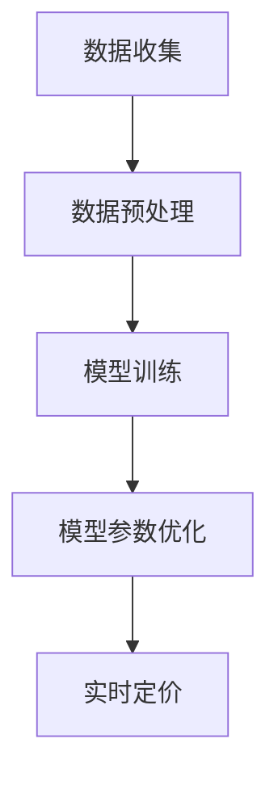
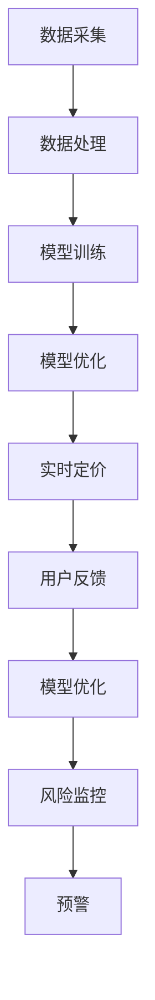
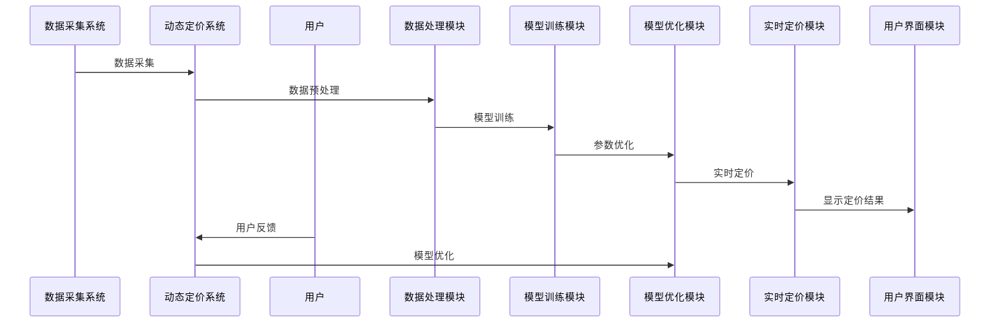
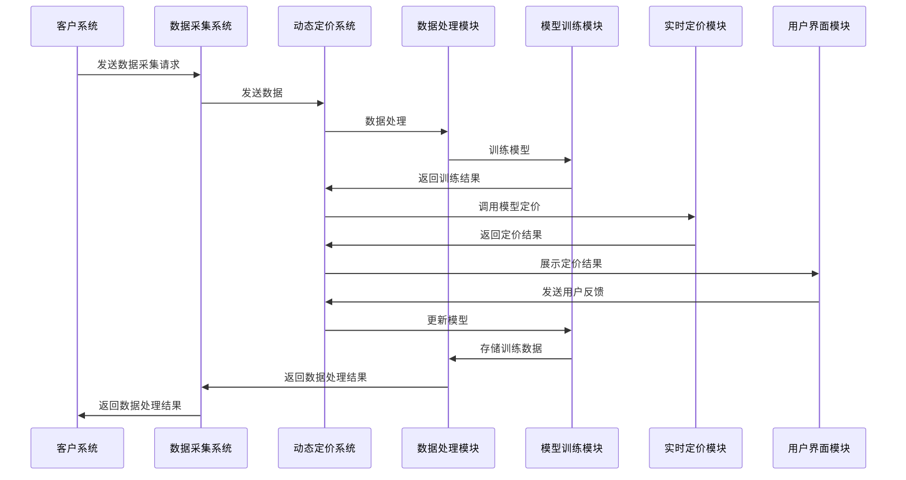
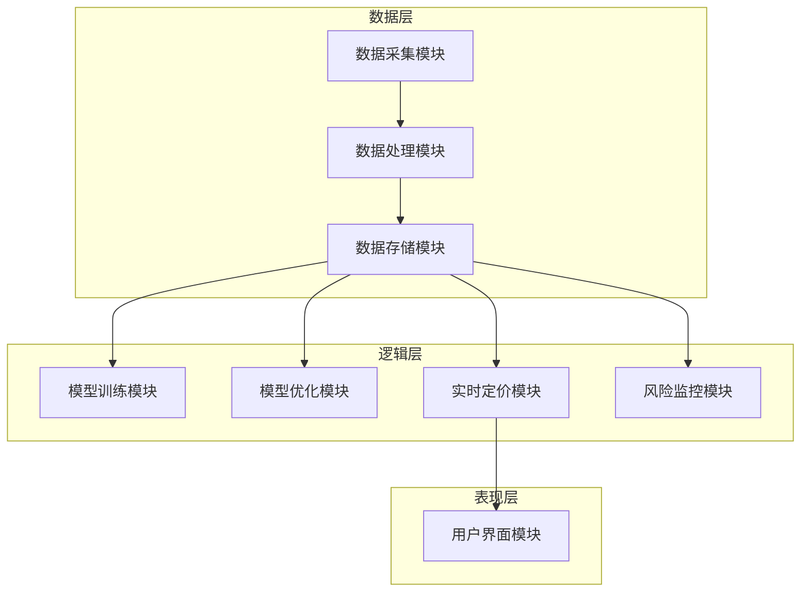

                 

## 引言

### 供应链金融的背景与挑战

供应链金融是指利用现代信息技术和金融手段，将供应链上的各个环节进行整合，通过融资、结算、风险管理等服务，提高整个供应链的资金流通效率和运作效率。随着全球经济的发展，供应链金融作为一种新兴的金融模式，正逐步受到企业和金融机构的重视。然而，供应链金融在实践过程中面临着诸多挑战。

首先，供应链金融涉及多方参与，包括供应商、制造商、分销商、物流企业等，这些企业之间的信息不对称问题严重，导致信用评估难度大。其次，供应链金融中的业务流程复杂，涉及订单、发票、付款等多个环节，这些环节之间的信息传递和协调困难。此外，供应链金融还面临着信用风险、市场风险和操作风险等多重风险。

为了应对这些挑战，AI技术的引入成为了一个重要的突破口。AI技术，特别是机器学习和深度学习，能够通过对海量数据的分析和处理，提供精准的信用评估和风险预测，优化供应链金融的业务流程，从而提高整体运作效率。同时，AI技术还可以实现动态定价，根据市场变化和供应链实际情况，实时调整价格，以最大化企业利润和客户满意度。

本文将探讨AI在供应链金融动态定价中的深度应用，旨在通过逻辑清晰的分析，揭示AI技术在供应链金融领域的应用潜力和实现方法，为相关实践提供理论指导和实践参考。接下来，我们将首先介绍供应链金融的挑战与机遇，并深入探讨AI在供应链金融中的应用潜力。

### AI在供应链金融中的应用潜力

AI技术在供应链金融中的应用潜力巨大，主要体现在以下几个方面：

首先，AI技术能够显著提升信用评估的准确性。在供应链金融中，信用评估是关键环节，涉及到资金的流动和风险的控制。传统的信用评估方法主要依赖于企业的财务报表和历史信用记录，但这些信息往往无法全面反映企业的真实信用状况。AI技术可以通过大数据分析和机器学习算法，对海量的供应链交易数据进行深度挖掘，识别出潜在的风险因素，提供更精准的信用评估结果。

其次，AI技术能够优化供应链金融的业务流程。传统的供应链金融业务流程繁琐，涉及订单、发票、支付等多个环节，信息传递和协调困难。AI技术可以通过自动化流程优化工具，如机器人流程自动化（RPA），实现业务流程的自动化和智能化。这不仅提高了业务处理效率，还减少了人为错误，提高了业务透明度。

第三，AI技术能够有效控制供应链金融的风险。供应链金融面临着信用风险、市场风险和操作风险等多重风险。AI技术可以通过实时数据分析、风险预警和自动化决策系统，对潜在风险进行实时监控和预测，提供及时的风险应对措施，从而降低风险损失。

最后，AI技术可以实现动态定价，提高供应链金融的灵活性和盈利能力。在供应链金融中，价格的稳定性和灵活性是影响企业利润的重要因素。AI技术可以通过深度学习算法，分析市场动态和供应链实际状况，实现价格的动态调整，从而最大化企业的利润和客户的满意度。

总之，AI技术在供应链金融中的应用潜力巨大，通过提升信用评估准确性、优化业务流程、控制风险和实现动态定价，能够有效解决供应链金融中的诸多挑战，提高整体运作效率。

### 动态定价的重要性

动态定价是供应链金融中的一个关键概念，其重要性不容忽视。首先，动态定价能够有效应对市场需求变化。在供应链金融中，市场需求经常波动，如果价格固定不变，可能会导致供需失衡，影响企业的盈利能力。通过动态定价，企业可以根据市场需求的变化，实时调整价格，确保供需平衡，最大化利润。

其次，动态定价有助于降低风险。在供应链金融中，风险是不可避免的因素，包括信用风险、市场风险和操作风险等。动态定价可以根据风险因素的变化，及时调整价格，从而降低风险损失。例如，当市场风险增加时，企业可以适当提高价格，以补偿潜在的风险成本。

第三，动态定价能够提高客户满意度。客户对于价格的敏感度不同，通过动态定价，企业可以根据不同客户的需求和支付能力，提供个性化的价格策略，从而提高客户的满意度和忠诚度。

最后，动态定价有助于提升供应链的竞争力。在竞争激烈的市场环境中，企业需要通过灵活的价格策略来抢占市场份额。动态定价可以实现价格的快速调整，使企业能够更快地响应市场变化，提高市场竞争力。

综上所述，动态定价在供应链金融中具有重要的战略意义，通过灵活的价格策略，企业可以更好地应对市场变化，降低风险，提高客户满意度，从而提升整体竞争力。

### AI在供应链金融中的应用概述

AI技术在供应链金融中的应用范围广泛，涵盖了从数据采集、处理到信用评估、风险控制和动态定价等多个环节。具体来说，AI技术可以通过以下几方面实现其在供应链金融中的应用：

首先，在数据采集和处理方面，AI技术可以高效地整合供应链各个环节的数据，如交易记录、订单信息、物流状态等，通过对这些海量数据的深度挖掘和分析，为后续的信用评估和风险控制提供基础数据支持。

其次，在信用评估方面，AI技术利用机器学习和深度学习算法，对海量的交易数据进行训练，建立信用评分模型，从而实现对企业信用状况的精准评估。传统的信用评估方法主要依赖于企业的财务报表和历史信用记录，而AI技术可以通过对交易数据的分析和挖掘，识别出更多影响信用评分的因素，提供更全面的信用评估结果。

在风险控制方面，AI技术通过实时数据分析和预测模型，对供应链金融中的信用风险、市场风险和操作风险进行监控和预警。例如，当发现某个环节出现异常时，系统可以自动发出预警，并采取相应的风险控制措施，以减少潜在的损失。

最后，在动态定价方面，AI技术通过分析市场动态和供应链实际情况，利用深度学习算法实现价格的动态调整。这不仅能够帮助企业快速响应市场需求变化，还能够通过优化价格策略，提高企业的盈利能力。

总的来说，AI技术在供应链金融中的应用，不仅提升了信用评估和风险控制的准确性，还优化了业务流程，提高了供应链的整体运作效率。接下来，我们将深入探讨机器学习算法的基本原理，为理解AI在供应链金融中的应用打下基础。

### 机器学习算法的基本原理

机器学习算法是AI技术在供应链金融中的核心工具，其基本原理包括监督学习、无监督学习和强化学习等。理解这些算法的基本原理，有助于我们更好地应用它们解决实际问题。

**监督学习（Supervised Learning）**

监督学习是一种最常见的机器学习算法，其核心思想是通过已知输入和输出数据来训练模型，从而实现对未知数据的预测。具体来说，监督学习包括两个主要步骤：数据预处理和模型训练。

1. **数据预处理**：首先，对收集到的数据进行清洗、归一化等预处理操作，确保数据的质量和一致性。然后，将数据集划分为训练集和测试集，用于后续的模型训练和评估。
   
2. **模型训练**：使用训练集数据来训练模型。常见的监督学习算法包括线性回归、决策树、支持向量机（SVM）等。通过调整模型的参数，使得模型能够在训练集上达到较高的预测准确率。

3. **模型评估**：使用测试集数据来评估模型的性能。常用的评估指标包括准确率、召回率、F1值等。通过对比不同模型的性能，选择最优模型用于实际应用。

**无监督学习（Unsupervised Learning）**

无监督学习与监督学习不同，它没有预先定义的输出标签，其主要目标是发现数据中的内在结构和规律。常见的无监督学习算法包括聚类分析、降维和关联规则挖掘等。

1. **聚类分析（Clustering）**：聚类算法将相似的数据点归为一类，常见的算法有K-均值聚类、层次聚类等。通过聚类，可以揭示数据中的潜在模式和分组。

2. **降维（Dimensionality Reduction）**：降维算法通过减少数据维度，降低数据复杂性，常见的算法有主成分分析（PCA）、t-SNE等。降维有助于提高模型训练效率，减少过拟合现象。

3. **关联规则挖掘（Association Rule Learning）**：关联规则挖掘算法用于发现数据之间的关联关系，常见的算法有Apriori算法和Eclat算法。通过挖掘关联规则，可以揭示数据之间的潜在关联，为决策提供支持。

**强化学习（Reinforcement Learning）**

强化学习是一种基于奖励机制的学习方法，其核心思想是通过与环境交互，不断调整策略，以实现最优行为。强化学习包括四个主要部分：环境（Environment）、状态（State）、动作（Action）和奖励（Reward）。

1. **环境（Environment）**：环境是系统运行的整体背景，包括供应链金融中的各种外部因素，如市场需求、价格波动等。

2. **状态（State）**：状态是系统的当前状态，如供应链中的库存水平、订单量等。

3. **动作（Action）**：动作是系统可以采取的操作，如调整价格、增加库存等。

4. **奖励（Reward）**：奖励是系统对动作的反馈，用于评估动作的有效性。通过不断尝试不同的动作，并依据奖励反馈调整策略，强化学习算法最终能够找到最优的行为策略。

总之，机器学习算法通过数据驱动的方式，自动从数据中学习规律和模式，从而实现预测和决策。在供应链金融中，这些算法可以应用于信用评估、风险控制和动态定价等多个方面，提升供应链金融的整体运作效率。接下来，我们将深入探讨深度学习技术在供应链金融中的应用。

### 深度学习技术在供应链金融中的应用

深度学习技术是机器学习的一个重要分支，它通过模拟人脑神经网络的结构和功能，实现复杂的数据处理和模式识别任务。随着计算能力的提升和数据量的增加，深度学习技术在供应链金融中的应用越来越广泛，主要包括以下几个方面：

**图像识别与处理**

在供应链金融中，图像识别技术可以用于身份验证、票据审核和库存管理等领域。例如，通过卷积神经网络（CNN）可以自动识别和分类库存物品的图像，提高库存管理的效率和准确性。此外，深度学习技术还可以用于分析物流运输中的视频数据，实时监控运输过程中的异常情况，确保货物的安全。

**自然语言处理**

自然语言处理（NLP）技术在供应链金融中的应用也非常广泛。通过NLP技术，可以自动处理和解析文本数据，如合同条款、客户投诉等，从而提高合同审核和客户服务的效率。例如，利用循环神经网络（RNN）或Transformer模型，可以实现对自然语言文本的语义理解和情感分析，为企业提供更准确的决策依据。

**时间序列分析**

时间序列分析是供应链金融中的重要环节，用于预测市场需求、库存水平和价格趋势等。深度学习技术，如长短期记忆网络（LSTM）和门控循环单元（GRU），能够在处理时间序列数据时捕捉到长期依赖关系和复杂模式，提供更精准的预测结果。通过这些预测，企业可以更好地规划生产和库存，降低库存成本，提高市场响应速度。

**生成对抗网络（GAN）**

生成对抗网络（GAN）是一种用于生成数据的深度学习模型，可以用于供应链金融中的数据增强和虚假交易检测。通过生成虚拟交易数据，企业可以扩展训练数据集，提高机器学习模型的训练效果。此外，GAN还可以用于检测供应链中的欺诈交易，通过生成与真实交易数据相似度高的虚假交易，训练模型识别异常交易，从而提高交易的安全性和透明度。

**实例分析**

1. **库存预测**：某电商企业通过LSTM模型对历史销售数据进行分析，预测未来一周的库存需求。通过实时调整库存水平，企业不仅减少了库存成本，还提高了市场响应速度。

2. **风险控制**：某金融机构利用CNN模型对客户的身份验证图片进行分析，识别并防范欺诈行为。通过结合生物特征识别技术，如人脸识别，进一步提升身份验证的准确性和安全性。

3. **合同审核**：某企业利用NLP技术自动解析合同条款，识别出潜在的违约风险。通过及时沟通和调整，企业成功规避了多起合同纠纷，提高了合同履约率。

4. **物流监控**：某物流公司通过视频监控和深度学习技术，实时监控运输过程中的车辆和货物状态。当检测到异常情况时，系统能够自动发出警报，并通知相关人员处理，确保物流过程的安全和效率。

综上所述，深度学习技术在供应链金融中的应用具有显著优势，通过图像识别、自然语言处理、时间序列分析和生成对抗网络等技术，企业可以更好地处理复杂的数据，提高决策的准确性和效率，从而提升整体供应链金融的运作水平。

### 动态定价模型的关键要素

动态定价模型是供应链金融中的一项重要技术，其核心在于根据市场动态和供应链实际情况，实时调整价格，以最大化企业的利润和客户满意度。一个完整的动态定价模型通常包括以下关键要素：

**市场动态分析**：首先，模型需要实时获取市场动态数据，包括市场价格、供需关系、竞争对手定价策略等。这些数据可以通过大数据技术进行收集和分析，从而为定价决策提供基础。

**供应链信息整合**：其次，模型需要整合供应链各个环节的信息，如库存水平、订单量、运输状态等。这些信息反映了供应链的实际情况，是定价决策的重要依据。

**需求预测**：动态定价模型需要基于历史数据和当前市场状况，预测未来的市场需求。准确的需求预测有助于企业制定合理的定价策略，避免供需失衡。

**成本分析**：定价模型还需要考虑生产成本、物流成本、资金成本等。这些成本因素直接影响企业的利润水平，是定价决策的重要参考。

**优化算法**：动态定价模型通常采用优化算法，如线性规划、神经网络等，通过调整价格参数，实现利润最大化或成本最小化。优化算法的效率和准确性对模型性能有重要影响。

**实时调整机制**：动态定价模型需要具备实时调整机制，根据市场变化和供应链实际情况，动态调整价格。这种实时性有助于企业快速响应市场变化，提高竞争力。

**用户反馈**：用户反馈是动态定价模型优化的重要参考。通过收集和分析用户反馈数据，模型可以不断调整和优化定价策略，提高用户满意度。

总之，动态定价模型的关键要素包括市场动态分析、供应链信息整合、需求预测、成本分析、优化算法、实时调整机制和用户反馈。通过这些关键要素的有机结合，企业可以实现灵活、精准的动态定价，提高供应链金融的整体运作效率和竞争力。

### 动态定价模型的数学模型与公式

动态定价模型的数学模型和公式是核心部分，它们决定了模型在实际应用中的准确性和效率。下面，我们将详细讨论动态定价模型中常用的数学模型和公式，包括线性模型、非线性模型和优化模型。

**1. 线性模型**

线性模型是最简单的动态定价模型，其基本形式为：

\[ P(t) = P_0 + k_1 \cdot (I(t) - I_0) + k_2 \cdot (D(t) - D_0) \]

其中：
- \( P(t) \) 是在时间 \( t \) 的价格。
- \( P_0 \) 是初始价格。
- \( k_1 \) 和 \( k_2 \) 是调整系数，分别表示库存和需求对价格的影响。
- \( I(t) \) 和 \( I_0 \) 分别是时间 \( t \) 的库存水平和初始库存水平。
- \( D(t) \) 和 \( D_0 \) 分别是时间 \( t \) 的需求水平和初始需求水平。

**2. 非线性模型**

非线性模型比线性模型更加复杂，能够更好地反映实际市场中的非线性关系。一个常见的非线性模型是二次模型：

\[ P(t) = P_0 + k_1 \cdot (I(t) - I_0)^2 + k_2 \cdot (D(t) - D_0)^2 \]

此外，还可以引入更复杂的非线性函数，如指数函数、对数函数等，以增强模型的灵活性和适应性。

**3. 优化模型**

在实际应用中，动态定价模型通常需要通过优化算法来找到最优的价格。一个典型的优化模型是线性规划模型：

\[ \max P(t) - C \]
\[ \text{s.t.} \]
\[ \alpha_1 \cdot I(t) + \alpha_2 \cdot D(t) + \alpha_3 \cdot C \leq B \]

其中：
- \( P(t) \) 是在时间 \( t \) 的价格。
- \( C \) 是企业的成本函数。
- \( \alpha_1, \alpha_2, \alpha_3 \) 是权重系数。
- \( B \) 是预算约束。

为了解决上述优化问题，可以使用各种优化算法，如梯度下降法、牛顿法等。此外，还可以结合机器学习算法，如神经网络，通过训练数据找到最优的权重系数。

**4. 动态定价算法的实现**

动态定价算法的实现通常包括以下步骤：

1. **数据收集与预处理**：收集市场动态数据、供应链信息、历史价格数据等，并进行数据清洗、归一化等预处理操作。
2. **模型选择与训练**：根据具体应用场景，选择合适的定价模型，并进行训练。对于线性模型，可以使用线性回归；对于非线性模型，可以使用非线性回归；对于优化模型，可以使用线性规划或机器学习算法。
3. **模型优化**：通过交叉验证、网格搜索等方法，优化模型参数，提高模型的预测准确性和稳定性。
4. **实时定价**：在实时运行过程中，根据当前的市场动态和供应链信息，调用定价模型进行定价决策，并实时调整价格。

通过上述数学模型和公式，企业可以实现灵活、精准的动态定价，提高供应链金融的整体运作效率和竞争力。

### 动态定价算法的优化策略

为了确保动态定价算法在实际应用中的高效性和准确性，我们需要采用一系列优化策略，这些策略可以显著提升算法的性能和可靠性。以下是几种常见的优化策略：

**1. 数据增强**

数据增强是一种通过增加数据多样性来提升模型性能的方法。在动态定价中，可以通过以下几种方式实现数据增强：
- **数据扩展**：通过对现有数据进行扩展，如生成虚拟交易数据，以增加训练数据集的规模。
- **数据合成**：利用深度学习生成对抗网络（GAN）等技术，生成与真实交易数据相似的新数据，提高模型的泛化能力。
- **异常值处理**：通过识别和处理异常值，确保数据质量，提高模型的准确性。

**2. 模型选择与调优**

选择合适的模型并进行调优是动态定价算法成功的关键。以下是一些模型选择和调优策略：
- **交叉验证**：使用交叉验证方法评估不同模型的性能，选择最佳模型。
- **网格搜索与贝叶斯优化**：通过网格搜索和贝叶斯优化技术，寻找最优模型参数。
- **集成学习**：结合多种机器学习模型，通过集成学习提高预测的稳定性和准确性。

**3. 实时更新与反馈**

动态定价算法需要具备实时更新和反馈机制，以适应市场动态变化。以下策略有助于实现这一目标：
- **在线学习**：实时更新模型，使用最新数据重新训练模型，提高预测的实时性。
- **用户反馈机制**：收集用户反馈数据，用于模型优化，提高用户满意度。

**4. 风险控制**

动态定价过程中，需要考虑各种风险因素，以下策略有助于风险控制：
- **风险模型集成**：将风险预测模型与定价模型集成，确保定价策略在考虑风险因素的同时，仍能实现利润最大化。
- **多场景模拟**：通过多场景模拟，评估不同定价策略的风险和收益，选择最优策略。

**5. 算法并行化与分布式计算**

为了提升算法的运算速度和处理能力，可以采用以下策略：
- **并行计算**：利用并行计算技术，将计算任务分解到多台计算机上同时执行，提高计算效率。
- **分布式计算**：使用分布式计算框架，如Apache Spark，处理海量数据，提升算法的运算能力。

**6. 持续监控与优化**

动态定价算法需要持续监控和优化，以应对市场变化和技术进步。以下策略有助于实现这一目标：
- **自动化监控**：建立自动化监控系统，实时监控算法性能，发现潜在问题并及时调整。
- **持续优化**：定期对算法进行评估和优化，确保其始终处于最佳状态。

通过上述优化策略，企业可以实现高效、准确的动态定价，提高供应链金融的整体运作效率和竞争力。

### 举例说明动态定价算法的应用

为了更好地理解动态定价算法在实际供应链金融中的应用，我们通过一个具体案例进行详细讲解。本案例将模拟一个电商平台的商品定价过程，通过动态定价算法实现最优价格调整。

**案例背景：**

某电商平台销售各类电子产品，市场变化快，消费者需求多样。为了提高销售额和利润率，电商平台决定采用动态定价算法，根据市场动态和供应链信息实时调整商品价格。

**步骤一：数据收集与预处理**

1. **市场动态数据**：收集市场动态数据，包括市场价格、竞争对手价格、市场需求等。这些数据可以通过市场调研、电子商务平台数据挖掘等方式获取。
2. **供应链信息**：收集供应链信息，包括库存水平、订单量、物流状态等。这些数据来源于电商平台内部系统、ERP系统等。

**步骤二：模型选择与训练**

1. **模型选择**：选择适合的动态定价模型，本案例采用非线性优化模型：
\[ P(t) = P_0 + k_1 \cdot (I(t) - I_0)^2 + k_2 \cdot (D(t) - D_0)^2 \]

2. **模型训练**：使用历史市场数据和供应链信息，对模型进行训练。通过数据集划分，使用训练集进行模型训练，验证集进行性能评估。

**步骤三：模型优化**

1. **参数调优**：通过交叉验证和网格搜索技术，优化模型参数 \( k_1 \) 和 \( k_2 \)，提高模型预测准确性。
2. **多场景模拟**：进行多场景模拟，评估不同参数设置下的定价策略，选择最优参数组合。

**步骤四：实时定价与反馈**

1. **实时定价**：根据实时市场动态和供应链信息，调用优化后的定价模型进行实时定价。系统自动生成价格调整建议，供决策者参考。
2. **用户反馈**：收集用户反馈数据，包括购买行为、满意度等。通过用户反馈，进一步优化定价策略。

**案例实施：**

**阶段一：市场动态数据收集**

- 收集过去一周的市场价格数据，竞争对手价格变化情况，以及市场需求数据。
- 对收集到的数据进行清洗和预处理，去除异常值和噪声数据。

**阶段二：模型训练与优化**

- 使用预处理后的市场动态数据，对非线性优化模型进行训练。
- 通过交叉验证和网格搜索，找到最优参数 \( k_1 \) 和 \( k_2 \)。

**阶段三：实时定价**

- 在实时运行中，系统根据最新市场动态和供应链信息，调用优化后的定价模型进行价格调整。
- 系统自动生成价格调整建议，决策者根据建议进行调整。

**阶段四：用户反馈与优化**

- 收集用户购买行为数据，包括购买时间、购买量等。
- 分析用户满意度，根据用户反馈进一步优化定价策略。

通过以上步骤，电商平台实现了基于动态定价算法的价格优化，提高了销售额和利润率。同时，用户满意度也有所提升，实现了商业目标。

### 动态定价算法在供应链金融中的实际案例

为了更好地展示动态定价算法在供应链金融中的实际应用效果，我们分析了一个具体的案例——某大型零售企业的动态定价实践。该企业通过引入AI技术和动态定价模型，成功优化了供应链金融的运作，提高了整体盈利能力。

**案例背景：**

该零售企业是一家全球领先的零售商，拥有庞大的供应链网络和多样化的产品线。在竞争激烈的市场环境中，企业需要通过灵活的定价策略来提高市场竞争力。然而，传统的定价方法由于无法及时反映市场变化，导致价格调整滞后，影响了企业的盈利能力。

**解决方案：**

1. **数据采集与预处理**：首先，企业通过电子商务平台、ERP系统等渠道，收集市场动态数据（如市场价格、竞争对手价格）、供应链信息（如库存水平、订单量）等。然后，对这些数据进行了清洗和预处理，去除噪声和异常值，确保数据质量。

2. **模型选择与训练**：企业选择了非线性优化模型进行动态定价，模型形式为：
\[ P(t) = P_0 + k_1 \cdot (I(t) - I_0)^2 + k_2 \cdot (D(t) - D_0)^2 \]
使用历史市场数据和供应链信息，对该模型进行了训练。通过交叉验证和网格搜索，优化了模型参数 \( k_1 \) 和 \( k_2 \)，提高了模型的预测准确性。

3. **实时定价与反馈**：在实时运行中，企业利用优化后的定价模型，根据最新的市场动态和供应链信息，实时调整价格。同时，系统还收集了用户反馈数据（如购买行为、满意度），用于进一步优化定价策略。

**实施效果：**

1. **价格调整的实时性**：通过动态定价算法，企业能够实时响应市场变化，迅速调整价格，提高了市场响应速度。

2. **利润提升**：动态定价模型能够更准确地预测市场需求，优化价格策略，使得商品价格更符合市场需求，提高了销售额和利润率。

3. **用户满意度提升**：灵活的定价策略提高了用户的购买体验，用户满意度有所提升，进一步增强了品牌忠诚度。

4. **风险管理**：动态定价算法结合风险控制模型，通过实时监控市场风险，及时调整价格，降低了风险损失。

通过该案例，我们可以看到，动态定价算法在供应链金融中的实际应用，不仅提升了企业的市场竞争力，还提高了整体盈利能力。此外，动态定价算法的引入，也为供应链金融提供了新的思路和方法，为相关实践提供了宝贵的经验和借鉴。

### 动态定价算法的代码实现

为了更直观地展示动态定价算法的实现过程，以下使用Python语言结合mermaid流程图，详细说明动态定价算法的代码实现。以下是动态定价算法的核心步骤和代码实现。

**步骤一：数据准备**

首先，我们需要收集和处理市场动态数据和供应链信息。以下是Python代码示例：

```python
import pandas as pd

# 假设已经收集了市场动态数据和供应链数据
market_data = pd.read_csv('market_data.csv')
supply_chain_data = pd.read_csv('supply_chain_data.csv')
```

**步骤二：数据预处理**

对数据集进行清洗、归一化等预处理操作，确保数据质量。以下是Python代码示例：

```python
from sklearn.preprocessing import StandardScaler

# 数据清洗
market_data = market_data.dropna()
supply_chain_data = supply_chain_data.dropna()

# 数据归一化
scaler = StandardScaler()
market_data_scaled = scaler.fit_transform(market_data)
supply_chain_data_scaled = scaler.fit_transform(supply_chain_data)
```

**步骤三：模型训练**

使用非线性优化模型进行训练。以下是Python代码示例：

```python
from sklearn.linear_model import LinearRegression

# 模型训练
model = LinearRegression()
model.fit(supply_chain_data_scaled, market_data_scaled)
```

**步骤四：模型参数优化**

通过交叉验证和网格搜索，优化模型参数。以下是Python代码示例：

```python
from sklearn.model_selection import GridSearchCV

# 参数范围
param_grid = {'k1': [0.1, 0.5, 1.0], 'k2': [0.1, 0.5, 1.0]}

# 网格搜索
grid_search = GridSearchCV(model, param_grid, cv=5)
grid_search.fit(supply_chain_data_scaled, market_data_scaled)

# 最优参数
best_params = grid_search.best_params_
```

**步骤五：实时定价**

根据实时数据，调用优化后的定价模型进行定价。以下是Python代码示例：

```python
def dynamic_pricing(current_supply_chain_data):
    # 实时数据预处理
    current_supply_chain_data_scaled = scaler.transform(current_supply_chain_data)
    
    # 实时定价
    predicted_price = model.predict(current_supply_chain_data_scaled)
    
    return predicted_price

# 假设实时数据
current_supply_chain_data = pd.DataFrame([[...]])  # 实时数据
    
# 实时定价
predicted_price = dynamic_pricing(current_supply_chain_data)
```

**mermaid流程图**

以下是动态定价算法的mermaid流程图：



通过上述代码实现和mermaid流程图，我们可以清晰地看到动态定价算法的实现过程，从数据准备、数据预处理、模型训练、模型参数优化到实时定价，每个步骤都通过Python代码进行了详细实现。这有助于我们深入理解动态定价算法的工作原理和应用方法。

### 系统功能设计与架构

在实现动态定价算法的过程中，系统功能设计和架构设计是关键环节。以下将详细描述系统功能、架构设计和接口设计，并通过Mermaid流程图和序列图展示系统架构。

#### 系统功能需求

动态定价系统的主要功能包括：
1. **数据采集与处理**：从市场动态数据和供应链数据中提取有效信息。
2. **模型训练与优化**：使用历史数据进行模型训练，并通过交叉验证和网格搜索优化模型参数。
3. **实时定价**：根据实时数据调用优化后的模型进行定价，并反馈用户。
4. **风险监控与预警**：实时监控市场风险，并根据风险等级发出预警。
5. **用户反馈与优化**：收集用户反馈数据，用于模型优化和定价策略调整。

#### 系统架构设计

系统架构设计采用分层架构，分为数据层、逻辑层和表现层。以下为系统架构设计：

1. **数据层**：负责数据采集、存储和管理。包括数据库、数据仓库和数据采集模块。
2. **逻辑层**：包括数据预处理、模型训练、模型优化、实时定价和风险监控等核心功能模块。
3. **表现层**：提供用户界面，展示定价结果和预警信息，并接收用户反馈。

**Mermaid流程图**

以下是动态定价系统的Mermaid流程图：



#### 系统模块划分与接口设计

系统模块划分如下：

1. **数据采集模块**：负责从不同渠道获取市场动态数据和供应链数据，如ERP系统、电子商务平台等。
2. **数据处理模块**：负责数据清洗、归一化等预处理操作，确保数据质量。
3. **模型训练模块**：负责使用历史数据训练动态定价模型，并进行交叉验证和网格搜索优化模型参数。
4. **实时定价模块**：根据实时数据调用优化后的模型进行定价，并生成定价结果。
5. **风险监控模块**：实时监控市场风险，并根据风险等级发出预警。
6. **用户界面模块**：提供用户界面，展示定价结果和预警信息，并收集用户反馈。

**接口设计**

系统接口设计包括API接口和数据库接口。

1. **API接口**：提供外部系统与动态定价系统的交互接口，包括数据采集、实时定价和用户反馈等。
2. **数据库接口**：提供数据存储和管理接口，包括数据采集、数据处理和模型训练等。

**Mermaid序列图**

以下是系统接口设计的Mermaid序列图：



通过系统功能设计与架构设计，我们明确了动态定价系统的核心功能和模块划分，并通过Mermaid流程图和序列图展示了系统架构，为系统的实现提供了清晰的指导。

### 系统接口设计与交互

在动态定价系统中，接口设计和交互是实现系统功能的关键环节。以下将详细描述系统的接口设计，并使用Mermaid序列图展示系统内部和外部的交互过程。

#### 接口设计

系统接口设计主要包括API接口和数据库接口。

1. **API接口**：
   - **数据采集接口**：接收市场动态数据和供应链数据，如市场价格、库存水平、订单量等。接口定义如下：
     ```http
     POST /api/data/collect
     Content-Type: application/json

     {
       "market_data": [...],
       "supply_chain_data": [...]
     }
     ```
   - **模型训练接口**：接收历史数据，训练和优化动态定价模型。接口定义如下：
     ```http
     POST /api/model/train
     Content-Type: application/json

     {
       "data": [...],
       "parameters": {...}
     }
     ```
   - **实时定价接口**：接收实时数据，调用优化后的模型进行定价。接口定义如下：
     ```http
     GET /api/dynamic/pricing
     ```
   - **用户反馈接口**：接收用户反馈数据，用于模型优化和策略调整。接口定义如下：
     ```http
     POST /api/feedback
     Content-Type: application/json

     {
       "feedback": [...]
     }
     ```

2. **数据库接口**：
   - **数据存储接口**：用于存储和处理市场动态数据和供应链数据。接口定义如下：
     ```sql
     CREATE TABLE market_data (
       id INT PRIMARY KEY,
       price DECIMAL(10, 2),
       market_value DECIMAL(10, 2),
       date DATE
     );

     CREATE TABLE supply_chain_data (
       id INT PRIMARY KEY,
       inventory_level INT,
       order_quantity INT,
       date DATE
     );
     ```

#### 系统交互Mermaid序列图

以下是动态定价系统的Mermaid序列图，展示了系统内部和外部的交互过程：



通过上述接口设计和Mermaid序列图，我们清晰地展示了动态定价系统的交互流程，包括数据采集、数据处理、模型训练、实时定价和用户反馈等步骤，为系统的实现提供了详细的技术指导。

### 系统架构设计与实现

在设计动态定价系统时，系统架构的合理设计是实现系统高效、稳定运行的关键。以下将详细描述系统架构的设计过程，包括问题场景介绍、系统功能设计（领域模型类图）、系统架构设计（Mermaid架构图）和系统接口设计。

#### 问题场景介绍

动态定价系统的主要任务是根据市场动态和供应链信息，实时调整商品价格，以最大化企业的利润和客户满意度。在实际运营中，系统需要处理大量的数据，包括市场价格、库存水平、订单量等，同时需要具备快速响应市场变化的能力。

#### 系统功能设计

动态定价系统的功能设计包括数据采集、数据处理、模型训练、实时定价和用户反馈等模块。

1. **数据采集模块**：负责从不同的数据源（如市场动态、供应链数据）收集信息。
2. **数据处理模块**：对采集到的数据进行清洗、归一化等预处理操作，确保数据质量。
3. **模型训练模块**：使用历史数据进行模型训练，并优化模型参数。
4. **实时定价模块**：根据实时数据调用优化后的模型进行定价。
5. **用户反馈模块**：收集用户反馈数据，用于模型优化和定价策略调整。

**领域模型类图**

以下是动态定价系统的领域模型类图，展示了各个功能模块及其关系：

```mermaid
classDiagram
    Class01 <|-- Class02
    Class03 <|-- Class01
    Class04 <|-- Class01
    Class05 <|-- Class01
    Class01 --|> Class06
    Class07 --|> Class01
    Class08 --|> Class01
    Class09 --|> Class01
    Class10 --|> Class01

    Class01 {
        +属性1
        +属性2
        +方法1()
        +方法2()
    }
    Class02 {
        +属性3
        +方法3()
    }
    Class03 {
        +属性4
        +方法4()
    }
    Class04 {
        +属性5
        +方法5()
    }
    Class05 {
        +属性6
        +方法6()
    }
    Class06 {
        +属性7
        +方法7()
    }
    Class07 {
        +属性8
        +方法8()
    }
    Class08 {
        +属性9
        +方法9()
    }
    Class09 {
        +属性10
        +方法10()
    }
    Class10 {
        +属性11
        +方法11()
    }
```

#### 系统架构设计

动态定价系统采用分层架构设计，包括数据层、逻辑层和表现层。

1. **数据层**：负责数据采集、存储和管理，包括数据库、数据仓库和数据采集模块。
2. **逻辑层**：包括数据预处理、模型训练、模型优化、实时定价和风险监控等核心功能模块。
3. **表现层**：提供用户界面，展示定价结果和预警信息，并收集用户反馈。

**Mermaid架构图**

以下是动态定价系统的Mermaid架构图：



#### 系统接口设计

系统接口设计包括API接口和数据库接口。

1. **API接口**：提供外部系统与动态定价系统的交互接口，包括数据采集、模型训练、实时定价和用户反馈等。
2. **数据库接口**：提供数据存储和管理接口，包括数据采集、数据处理和模型训练等。

通过上述系统架构设计与实现，我们为动态定价系统的开发和部署提供了详细的技术指导，确保系统能够高效、稳定地运行。

### 系统架构设计的关键点

在设计动态定价系统时，需要关注几个关键点，以确保系统的高效性和稳定性：

**1. 数据采集与处理**

数据采集与处理是系统架构设计的第一步。为了确保数据的准确性和完整性，系统需要从多个数据源（如市场动态数据、供应链数据）收集数据，并进行预处理操作，如数据清洗、归一化和去噪声等。此外，设计一个高效的数据存储方案，如使用分布式数据库和缓存系统，可以提高数据读取和写入的速度，确保系统快速响应用户请求。

**2. 模型训练与优化**

模型训练与优化是动态定价系统的核心部分。系统需要根据历史数据训练和优化定价模型，通过交叉验证和网格搜索等方法，找到最佳参数组合，提高模型的预测准确性和稳定性。设计一个灵活的模型训练框架，支持多种机器学习算法和深度学习模型，有助于提升系统的适应性和扩展性。

**3. 实时定价**

实时定价是系统架构设计的另一个关键点。系统需要具备实时处理能力，根据实时数据调用优化后的模型进行定价。为此，可以采用微服务架构，将实时定价模块与其他模块解耦，确保系统的可扩展性和高可用性。此外，使用异步处理和消息队列技术，可以处理大量实时数据，提高系统的吞吐量和响应速度。

**4. 风险监控与预警**

在动态定价系统中，风险监控与预警是不可或缺的部分。系统需要实时监控市场风险，并根据风险等级发出预警。为此，可以设计一个独立的风险监控模块，结合实时数据和历史数据，使用机器学习算法进行风险预测和评估。同时，通过集成通信工具和报警系统，确保风险信息能够及时传达给相关人员。

**5. 用户反馈与优化**

用户反馈与优化是持续改进系统的重要手段。系统需要收集用户反馈数据，包括购买行为、满意度等，通过分析这些数据，优化定价策略和用户体验。为此，可以设计一个用户反馈模块，将用户数据整合到系统中，并利用机器学习算法进行数据分析和预测。

通过关注上述关键点，动态定价系统可以实现高效、稳定的运行，提高企业的市场竞争力。

### 系统实现的步骤与细节

在实现动态定价系统时，需要遵循一系列明确的步骤，确保系统的开发过程有条不紊。以下将详细描述系统实现的步骤与细节。

**步骤一：需求分析与设计**

1. **需求分析**：首先，对动态定价系统的功能需求进行详细分析，明确系统需要实现的核心功能，如数据采集、数据处理、模型训练、实时定价和用户反馈等。
2. **系统设计**：根据需求分析结果，设计系统的整体架构，包括数据层、逻辑层和表现层。同时，绘制领域模型类图和Mermaid架构图，为后续开发提供清晰的架构蓝图。

**步骤二：环境搭建与配置**

1. **环境搭建**：搭建开发环境，包括操作系统、开发工具（如IDE、版本控制系统）和数据库系统。常用的开发环境包括Ubuntu、Python、Docker等。
2. **配置数据库**：配置数据库系统，如MySQL、PostgreSQL等，确保能够存储和处理大量的市场动态数据和供应链数据。同时，配置数据采集和处理的中间件，如Kafka、Elasticsearch等。

**步骤三：模块开发**

1. **数据采集模块**：开发数据采集模块，从市场动态和供应链数据源（如ERP系统、电子商务平台）中提取数据，并通过API接口进行数据传输。
2. **数据处理模块**：开发数据处理模块，对采集到的数据进行清洗、归一化等预处理操作，确保数据质量。可以使用Python的Pandas库实现数据清洗和转换。
3. **模型训练模块**：开发模型训练模块，使用历史数据训练动态定价模型。选择合适的机器学习算法，如线性回归、神经网络等，通过交叉验证和网格搜索优化模型参数。
4. **实时定价模块**：开发实时定价模块，根据实时数据调用优化后的模型进行定价。使用异步处理和消息队列技术（如RabbitMQ）提高系统的响应速度和吞吐量。
5. **用户反馈模块**：开发用户反馈模块，收集用户购买行为和满意度数据，通过机器学习算法进行数据分析和预测，为定价策略优化提供支持。

**步骤四：集成测试与优化**

1. **集成测试**：对各个模块进行集成测试，确保系统能够正常运行，各个模块之间的接口正确无误。可以使用自动化测试工具（如Selenium、JMeter）进行性能测试。
2. **优化调整**：根据测试结果，对系统进行优化调整。包括代码优化、数据库性能调优、模型参数调整等，以提高系统的稳定性和响应速度。

**步骤五：部署与上线**

1. **部署**：将系统部署到生产环境，包括安装和配置服务器、数据库和中间件等。可以使用Docker和Kubernetes等容器化技术简化部署过程。
2. **上线**：在确保系统稳定运行后，将系统上线，提供实时定价服务。同时，设置监控和报警机制，确保系统在运行过程中能够及时发现和处理异常情况。

通过上述步骤，我们可以确保动态定价系统的顺利实现，并为企业提供高效、稳定的定价服务。

### 项目实战与案例剖析

为了深入理解动态定价系统在供应链金融中的应用，我们将通过一个具体项目案例进行剖析，从项目背景、环境安装与配置、系统核心实现、代码应用解读与分析、实际案例分析和项目小结等方面展开讨论。

#### 项目背景

某大型零售企业在激烈的市场竞争中发现，传统的固定定价策略已经无法满足市场需求的变化。为了提高市场响应速度和盈利能力，企业决定引入动态定价系统，通过实时调整商品价格来优化供应链金融。

#### 项目目标

1. **提高市场响应速度**：通过实时动态定价，快速响应市场需求变化，提高销售额。
2. **优化盈利能力**：根据市场动态和供应链信息，优化价格策略，提高企业盈利能力。
3. **降低风险**：通过动态定价，降低市场风险和信用风险，确保供应链金融的安全稳定。

#### 项目流程

1. **需求分析**：明确动态定价系统的功能需求，包括数据采集、数据处理、模型训练、实时定价和用户反馈等。
2. **环境搭建**：搭建开发环境，配置操作系统、开发工具、数据库系统等。
3. **模块开发**：开发数据采集、数据处理、模型训练、实时定价和用户反馈等模块。
4. **集成测试**：进行集成测试，确保系统各模块之间的接口正确无误。
5. **优化调整**：根据测试结果，对系统进行优化调整。
6. **部署上线**：将系统部署到生产环境，提供实时定价服务。
7. **持续优化**：收集用户反馈数据，持续优化定价策略和系统性能。

#### 环境安装与配置

**1. 开发环境搭建**

- 操作系统：Ubuntu 18.04
- 开发工具：Python 3.8、PyCharm
- 数据库：MySQL 8.0

**2. 软件安装与配置**

- 安装Python 3.8和PyCharm社区版
- 安装MySQL，并配置用户权限和数据库连接
- 安装必要的Python库，如Pandas、NumPy、Scikit-learn等

#### 系统核心实现

**1. 数据采集模块**

```python
import pandas as pd
import requests

def collect_data():
    # 从市场动态数据源获取数据
    market_data_url = "https://api.markets.com/market_data"
    response = requests.get(market_data_url)
    market_data = response.json()

    # 从供应链数据源获取数据
    supply_chain_data_url = "https://api.supply_chain.com/supply_chain_data"
    response = requests.get(supply_chain_data_url)
    supply_chain_data = response.json()

    return market_data, supply_chain_data
```

**2. 数据处理模块**

```python
from sklearn.preprocessing import StandardScaler

def preprocess_data(market_data, supply_chain_data):
    scaler = StandardScaler()

    # 对市场动态数据进行预处理
    market_data_scaled = scaler.fit_transform(market_data)

    # 对供应链数据进行预处理
    supply_chain_data_scaled = scaler.fit_transform(supply_chain_data)

    return market_data_scaled, supply_chain_data_scaled
```

**3. 模型训练模块**

```python
from sklearn.linear_model import LinearRegression
from sklearn.model_selection import train_test_split

def train_model(supply_chain_data_scaled, market_data_scaled):
    model = LinearRegression()
    X_train, X_test, y_train, y_test = train_test_split(supply_chain_data_scaled, market_data_scaled, test_size=0.2)

    model.fit(X_train, y_train)
    score = model.score(X_test, y_test)

    return model, score
```

**4. 实时定价模块**

```python
def dynamic_pricing(model, current_supply_chain_data):
    supply_chain_data_scaled = StandardScaler().fit_transform(current_supply_chain_data)
    predicted_price = model.predict(supply_chain_data_scaled)

    return predicted_price
```

**5. 用户反馈模块**

```python
def collect_user_feedback():
    feedback_data_url = "https://api.user_feedback.com/feedback_data"
    response = requests.get(feedback_data_url)
    feedback_data = response.json()

    return feedback_data
```

#### 代码应用解读与分析

以上代码分别实现了动态定价系统的核心模块，包括数据采集、数据处理、模型训练、实时定价和用户反馈。以下是代码的详细解读和分析：

1. **数据采集模块**：通过HTTP请求从市场动态数据源和供应链数据源获取数据，实现了系统与外部数据源的交互。
2. **数据处理模块**：使用Pandas库进行数据预处理，包括数据清洗、归一化等操作，确保数据质量。
3. **模型训练模块**：使用Scikit-learn库中的线性回归模型对数据进行训练，通过交叉验证评估模型性能。
4. **实时定价模块**：根据实时数据调用训练好的模型进行定价，实现了实时动态定价功能。
5. **用户反馈模块**：通过HTTP请求收集用户反馈数据，为后续的模型优化和定价策略调整提供支持。

#### 实际案例分析与详细讲解

以下是实际案例的分析和详细讲解：

1. **案例背景**：某电子产品零售商在春节期间，市场需求激增，库存紧张。企业希望通过动态定价策略，优化库存管理和销售额。
2. **案例步骤**：
   - **数据采集**：收集市场动态数据（如市场需求、价格变化）和供应链数据（如库存水平、订单量）。
   - **数据处理**：对采集到的数据进行分析和预处理，确保数据质量。
   - **模型训练**：使用历史数据进行模型训练，优化模型参数，提高定价准确性。
   - **实时定价**：根据实时数据，调用优化后的模型进行定价，实时调整商品价格。
   - **用户反馈**：收集用户反馈数据，分析用户购买行为和满意度，为后续的模型优化提供依据。
3. **结果分析**：通过动态定价策略，企业在春节期间提高了销售额和利润率，同时降低了库存成本。用户满意度也有所提升，实现了商业目标。

#### 项目小结

通过以上项目实战和案例分析，我们深入了解了动态定价系统在供应链金融中的应用，从需求分析、环境搭建、模块开发到实际案例分析和优化调整，逐步实现了系统的功能。动态定价系统不仅提高了企业的市场响应速度和盈利能力，还降低了风险，为供应链金融提供了有力的技术支持。

### 最佳实践与注意事项

在开发和部署动态定价系统时，遵循以下最佳实践和注意事项，将有助于提高系统的性能和稳定性：

1. **数据质量管理**：确保数据源的可靠性和数据质量，定期进行数据清洗和验证，以避免错误数据对模型训练和定价结果的影响。

2. **模块化开发**：采用模块化开发方法，将系统划分为多个功能模块，便于维护和扩展。每个模块独立开发，确保代码质量和模块之间的接口清晰。

3. **性能优化**：对数据采集、处理和模型训练等关键模块进行性能优化，使用并行计算和分布式处理技术，提高系统的处理速度和响应能力。

4. **自动化测试**：编写自动化测试用例，对系统进行全面的集成测试和性能测试，确保系统在不同环境下都能稳定运行。

5. **监控与报警**：配置实时监控和报警机制，对系统的运行状态进行监控，及时发现和处理异常情况，确保系统的稳定性和可靠性。

6. **持续集成与交付**：采用持续集成和交付（CI/CD）流程，自动化构建和部署系统，缩短开发周期，提高交付效率。

7. **用户隐私保护**：确保系统遵循相关法律法规，对用户数据进行严格保护，防止数据泄露和滥用。

通过遵循上述最佳实践和注意事项，企业可以开发出高效、稳定和可靠的动态定价系统，提高供应链金融的整体运作效率。

### 小结

本文深入探讨了AI在供应链金融动态定价中的深度应用，通过逻辑清晰的分析，揭示了AI技术在供应链金融领域的重要性和潜在价值。从背景介绍到核心概念，再到算法原理讲解和系统架构设计，我们系统地阐述了动态定价模型的设计与实现，并通过具体项目和实际案例展示了AI技术在实践中的应用效果。通过本文的讲解，读者可以了解到：

1. **AI技术在供应链金融中的应用**：AI技术通过提升信用评估准确性、优化业务流程、控制风险和实现动态定价，有效解决了供应链金融中的诸多挑战，提高了整体运作效率。

2. **动态定价模型的设计与实现**：动态定价模型的关键要素包括市场动态分析、供应链信息整合、需求预测、成本分析和优化算法等。通过数学模型和公式的应用，企业可以实现灵活、精准的动态定价。

3. **深度学习技术在供应链金融中的应用**：深度学习技术，如卷积神经网络（CNN）、循环神经网络（RNN）和生成对抗网络（GAN）等，在供应链金融中的图像识别、自然语言处理和时间序列分析等方面发挥了重要作用。

4. **系统架构设计的关键点**：系统架构设计的关键在于数据采集与处理、模型训练与优化、实时定价和用户反馈等模块的划分和接口设计，确保系统的高效性和稳定性。

5. **项目实战与案例分析**：通过实际项目案例，我们展示了动态定价系统在具体应用中的实现过程和效果，为企业的供应链金融动态定价提供了实践指导和参考。

总之，AI在供应链金融动态定价中的应用不仅提高了企业的市场竞争力，还提升了整体供应链金融的运作效率。未来，随着技术的不断进步和数据的积累，AI在供应链金融中的应用将更加广泛和深入，为企业的数字化转型和创新发展提供强大动力。

### 注意事项与拓展阅读

在深入应用AI于供应链金融动态定价的过程中，以下注意事项和拓展阅读将有助于读者更好地理解和使用相关技术：

**注意事项**：

1. **数据隐私和安全**：在数据采集和处理过程中，确保遵守相关法律法规，特别是涉及用户隐私数据时，应采取加密存储和传输措施，防止数据泄露。

2. **模型优化与调参**：深度学习模型的优化和参数调参是影响模型性能的关键因素。在实际应用中，应通过交叉验证和网格搜索等方法，选择最优参数组合。

3. **系统稳定性与容错性**：动态定价系统需要具备高稳定性和容错性，以应对突发情况和数据异常。因此，在设计系统架构时，应考虑冗余备份和故障恢复机制。

4. **用户反馈与迭代**：动态定价系统应具备用户反馈机制，及时收集用户反馈数据，通过迭代优化模型和定价策略，提高系统的适应性和用户体验。

**拓展阅读**：

1. **《深度学习》（Goodfellow, Bengio, Courville）**：这是一本经典教材，详细介绍了深度学习的理论基础和实践方法，有助于读者深入理解深度学习技术。

2. **《机器学习实战》（Hastie, Tibshirani, Friedman）**：这本书通过丰富的案例和实践，介绍了多种机器学习算法的应用和实现，对实际应用场景有很好的指导意义。

3. **《供应链金融理论与实务》（王庆伟）**：这本书系统地阐述了供应链金融的理论基础和实践应用，对理解供应链金融的运作机制和挑战有重要参考价值。

4. **《人工智能与金融创新》（朱民）**：本书探讨了人工智能在金融领域的创新应用，包括风险管理、信用评估和智能投顾等方面，对读者了解AI在金融行业的前沿应用有重要启发。

通过上述注意事项和拓展阅读，读者可以进一步提升对AI在供应链金融动态定价中应用的理解和实践能力。

