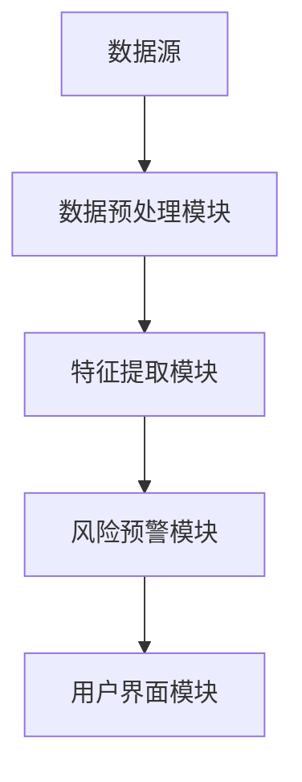
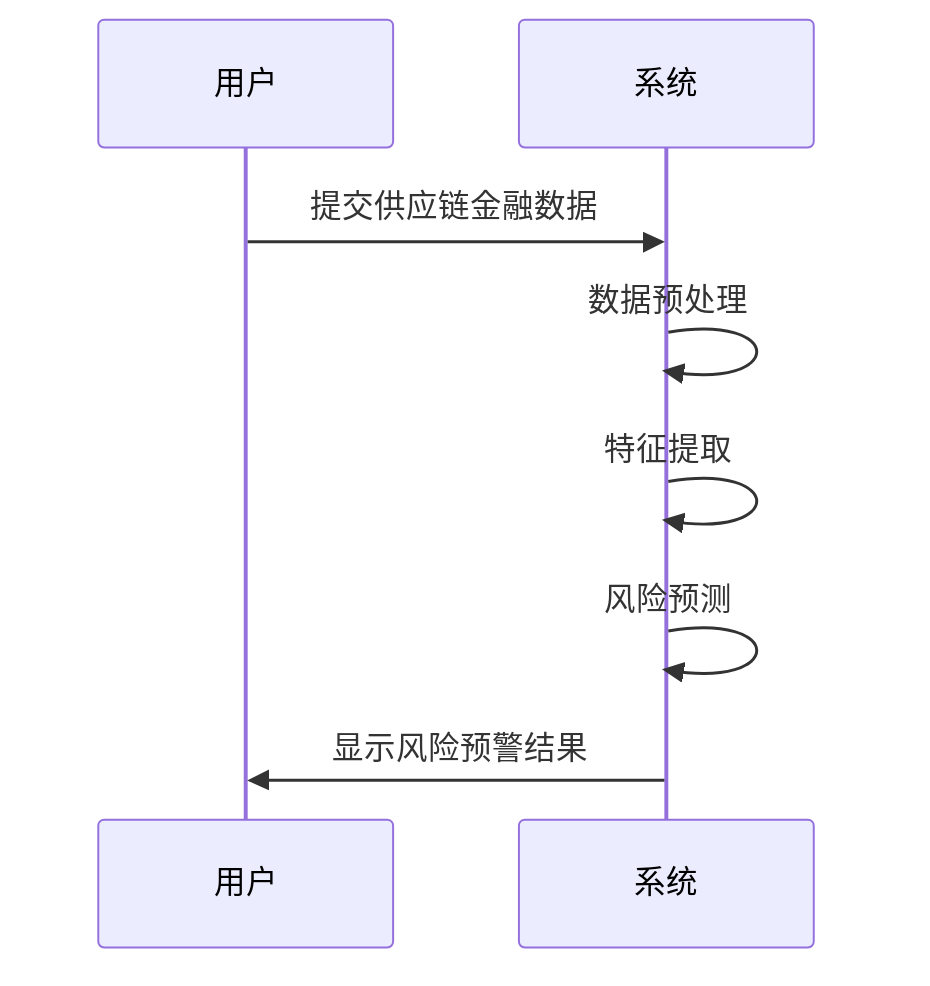

                 

# AI在供应链金融风险预警中的深度应用

## 关键词：人工智能，供应链金融，风险预警，深度学习，数据挖掘

## 摘要

随着全球化经济的深入发展，供应链金融成为了企业运营中不可或缺的一环。然而，供应链金融风险预警的挑战也随之增加，传统方法难以应对复杂多变的金融环境。本文以AI在供应链金融风险预警中的应用为研究对象，通过深入探讨AI技术在该领域的深度应用原理、数据预处理与特征工程、以及风险预警模型选择，旨在为供应链金融风险预警提供新的思路和方法。通过本文的研究，可以为金融机构和企业提供有效的风险预警策略，降低供应链金融风险，提高资金运作效率。

## 第一部分：AI在供应链金融风险预警中的深度应用背景

### 第1章：供应链金融概述

#### 1.1 问题背景

**供应链金融风险预警的挑战与需求**

在当前全球经济环境下，供应链金融作为连接企业资金周转、促进供应链上下游协同发展的重要手段，正面临前所未有的挑战。首先，供应链中的信息不对称问题突出，导致金融机构难以准确评估企业信用风险。其次，市场变化迅速，企业面临着原材料成本波动、订单不稳定等不确定性因素，导致供应链金融风险增加。因此，对供应链金融风险进行有效预警，成为了确保资金安全、优化供应链管理的迫切需求。

**AI在供应链金融中的应用前景**

随着人工智能技术的飞速发展，其在大数据处理、模式识别、智能分析等方面的优势，为供应链金融风险预警提供了新的技术手段。通过深度学习、数据挖掘等技术，AI能够从海量数据中挖掘出潜在风险因素，实现对供应链金融风险的实时监控和预警。此外，AI技术还能够帮助企业优化供应链金融管理，降低融资成本，提高供应链效率。

#### 1.2 核心概念与联系

**供应链金融：** 是一种以核心企业为信用支撑，通过金融机构对供应链上下游企业提供的融资服务。其主要目的是解决中小企业融资难、融资贵的问题。

**风险预警：** 是指通过监测和分析各种风险信号，提前发现潜在风险并发出预警，以便采取相应措施防范风险。

**深度学习：** 是机器学习中的一种方法，通过模拟人脑神经网络的结构和功能，实现对复杂数据的自动学习和模式识别。

**数据挖掘：** 是从大量数据中提取有价值的信息和知识的过程，常用于商业智能、风险管理等领域。

#### 1.3 ER实体关系图架构

```mermaid
erDiagram
    Customer ||--|{ Supplier : 购买商品 }
    Customer ||--|{ Order : 下单 }
    Supplier ||--|{ Invoice : 开票 }
    Supplier ||--|{ Payment : 收款 }
    Customer }|--|{ Bank : 贷款 }
    Customer }|--|{ Risk : 风险预警 }
    Supplier }|--|{ Risk : 风险预警 }
```

#### 1.4 本章小结

本章首先介绍了供应链金融的背景和挑战，以及AI在供应链金融风险预警中的应用前景。接着，通过核心概念与联系的分析，明确了供应链金融、风险预警和AI技术之间的关系。最后，通过ER实体关系图展示了供应链金融系统中各实体的关系架构。本章为后续章节的深入研究奠定了基础。

------------------------

## 第二部分：AI在供应链金融风险预警中的应用原理

### 第2章：数据预处理与特征工程

#### 2.1 数据预处理

**数据清洗：** 是指对原始数据进行清洗，去除错误、重复、缺失等无效数据。这是数据预处理的重要步骤，因为原始数据中往往包含大量噪声和异常值，这些数据会影响模型的训练效果。

```python
# 数据清洗示例代码
data = pd.read_csv('data.csv')
data.drop_duplicates(inplace=True)
data.fillna(method='ffill', inplace=True)
```

**数据整合：** 是指将不同来源的数据进行整合，形成统一的数据视图。这一步骤对于构建完整的供应链金融数据集至关重要，因为不同来源的数据可能具有不同的格式和结构。

```python
# 数据整合示例代码
data1 = pd.read_csv('data1.csv')
data2 = pd.read_csv('data2.csv')
data = pd.merge(data1, data2, on='common_column')
```

**数据标准化：** 是指将不同单位、不同量级的数据进行标准化处理，以便进行后续分析。这一步骤有助于消除数据之间的尺度差异，提高模型训练的效果。

```python
# 数据标准化示例代码
from sklearn.preprocessing import StandardScaler
scaler = StandardScaler()
data_scaled = scaler.fit_transform(data)
```

#### 2.2 特征工程

**特征提取：** 是指从原始数据中提取出能够代表数据特性的特征。特征提取是特征工程的核心步骤，其目的是提高模型对数据的理解和预测能力。

```python
# 特征提取示例代码
from sklearn.decomposition import PCA
pca = PCA(n_components=5)
data_pca = pca.fit_transform(data)
```

**特征选择：** 是指从提取出的特征中筛选出对预测任务最有用的特征。特征选择可以减少模型复杂度，提高预测性能，并减少计算成本。

```python
# 特征选择示例代码
from sklearn.feature_selection import SelectKBest
from sklearn.feature_selection import f_classif
selector = SelectKBest(f_classif, k=5)
data_selected = selector.fit_transform(data_pca, labels)
```

#### 2.3 数据可视化

**数据可视化：** 是指通过图形、图表等形式，将数据直观地展示出来，便于分析。数据可视化可以帮助我们更好地理解数据特征和模式。

```python
# 数据可视化示例代码
import matplotlib.pyplot as plt
plt.scatter(data['feature1'], data['feature2'])
plt.xlabel('Feature 1')
plt.ylabel('Feature 2')
plt.show()
```

**热力图：** 是一种展示数据密集度的图表，常用于显示数据分布情况。

```python
# 热力图示例代码
import seaborn as sns
sns.heatmap(data.corr(), annot=True)
plt.show()
```

**散点图：** 是一种展示两个变量之间关系的图表，常用于分析特征相关性。

```python
# 散点图示例代码
sns.scatterplot(data['feature1'], data['feature2'])
plt.xlabel('Feature 1')
plt.ylabel('Feature 2')
plt.show()
```

#### 2.4 AI模型选择

**监督学习模型：** 是指通过已标注的数据集进行训练，实现对未知数据的预测。监督学习模型适用于有明确目标变量（标签）的数据集。

```python
# 监督学习模型选择示例代码
from sklearn.linear_model import LogisticRegression
model = LogisticRegression()
model.fit(X_train, y_train)
```

**无监督学习模型：** 是指在没有标注数据的情况下，通过算法自动发现数据中的模式。无监督学习模型适用于探索性数据分析。

```python
# 无监督学习模型选择示例代码
from sklearn.cluster import KMeans
kmeans = KMeans(n_clusters=3)
kmeans.fit(data)
```

**深度学习模型：** 是一种基于人工神经网络的结构，能够自动提取复杂数据特征。深度学习模型在处理大规模、高维数据时表现优异。

```python
# 深度学习模型选择示例代码
from tensorflow.keras.models import Sequential
from tensorflow.keras.layers import Dense

model = Sequential()
model.add(Dense(128, activation='relu', input_shape=(num_features,)))
model.add(Dense(1, activation='sigmoid'))
model.compile(optimizer='adam', loss='binary_crossentropy', metrics=['accuracy'])
model.fit(X_train, y_train, epochs=10, batch_size=32)
```

#### 2.5 本章小结

本章首先介绍了数据预处理和特征工程的重要性，并详细讲解了数据清洗、数据整合、数据标准化、特征提取和特征选择等基本概念。接着，介绍了数据可视化方法，并通过热力图和散点图展示了数据可视化在实际应用中的效果。最后，讨论了AI模型选择的基本原则，为后续的算法应用打下了基础。

------------------------

## 第三部分：AI在供应链金融风险预警中的应用实例

### 第3章：基于深度学习的供应链金融风险预警系统设计

#### 3.1 项目介绍

随着人工智能技术的不断发展，深度学习在图像识别、自然语言处理等领域取得了显著的成果。本项目旨在设计一个基于深度学习的供应链金融风险预警系统，通过对供应链金融数据进行预处理、特征工程和模型训练，实现对供应链金融风险的实时监测和预警。

#### 3.2 系统功能设计

**数据预处理模块：** 对供应链金融数据进行清洗、整合和标准化处理，为后续特征提取和模型训练提供高质量的数据集。

**特征提取模块：** 利用深度学习技术，从预处理后的数据中提取出能够代表数据特性的特征。

**风险预警模块：** 通过训练好的深度学习模型，对实时获取的供应链金融数据进行风险预测和预警。

**用户界面模块：** 提供直观的用户界面，展示供应链金融风险预警结果，便于用户进行风险分析和决策。

#### 3.3 系统架构设计



#### 3.4 系统接口设计

**数据预处理接口：** 提供数据清洗、整合和标准化等功能的API，方便其他模块调用。

**特征提取接口：** 提供特征提取功能的API，方便用户自定义特征提取策略。

**风险预警接口：** 提供风险预测和预警功能的API，方便用户获取实时风险预警信息。

**用户界面接口：** 提供用户界面展示功能的API，方便用户查看风险预警结果。

#### 3.5 系统交互设计



### 第4章：项目实战

#### 4.1 环境安装

为了搭建基于深度学习的供应链金融风险预警系统，需要安装以下软件和库：

- Python 3.8及以上版本
- TensorFlow 2.4及以上版本
- NumPy 1.18及以上版本
- Pandas 1.1及以上版本
- Matplotlib 3.2及以上版本
- Scikit-learn 0.22及以上版本

安装命令如下：

```shell
pip install python==3.8.10
pip install tensorflow==2.4.0
pip install numpy==1.19.2
pip install pandas==1.1.5
pip install matplotlib==3.2.2
pip install scikit-learn==0.22.2
```

#### 4.2 系统核心实现

**数据预处理模块：**

```python
import pandas as pd

def preprocess_data(data_path):
    data = pd.read_csv(data_path)
    data.drop_duplicates(inplace=True)
    data.fillna(method='ffill', inplace=True)
    return data
```

**特征提取模块：**

```python
from sklearn.decomposition import PCA
from sklearn.preprocessing import StandardScaler

def extract_features(data):
    scaler = StandardScaler()
    data_scaled = scaler.fit_transform(data)
    pca = PCA(n_components=5)
    data_pca = pca.fit_transform(data_scaled)
    return data_pca
```

**风险预警模块：**

```python
from tensorflow.keras.models import Sequential
from tensorflow.keras.layers import Dense
from tensorflow.keras.optimizers import Adam

def build_model(input_shape):
    model = Sequential()
    model.add(Dense(128, activation='relu', input_shape=input_shape))
    model.add(Dense(1, activation='sigmoid'))
    model.compile(optimizer=Adam(learning_rate=0.001), loss='binary_crossentropy', metrics=['accuracy'])
    return model
```

**用户界面模块：**

```python
import tkinter as tk

def show_risk_warning(result):
    root = tk.Tk()
    root.title('供应链金融风险预警结果')

    label = tk.Label(root, text=result)
    label.pack()

    root.mainloop()
```

#### 4.3 代码应用解读与分析

**数据预处理模块：** 主要负责数据清洗、整合和标准化处理。通过调用`preprocess_data`函数，我们可以将原始数据转化为适合模型训练的数据集。

**特征提取模块：** 利用PCA进行特征提取，将高维数据降维到低维空间，提高模型训练效果。通过调用`extract_features`函数，我们可以将预处理后的数据转化为特征矩阵。

**风险预警模块：** 使用深度学习模型进行风险预测。通过调用`build_model`函数，我们可以构建一个简单的深度学习模型。在训练过程中，使用`binary_crossentropy`作为损失函数，并使用`Adam`优化器进行模型训练。

**用户界面模块：** 提供一个简单的用户界面，用于展示风险预警结果。通过调用`show_risk_warning`函数，我们可以将风险预警结果显示在一个窗口中。

#### 4.4 实际案例分析和详细讲解剖析

**案例背景：** 一家制造企业需要对其供应链金融风险进行预警，以便及时采取应对措施。企业提供了包含供应链金融数据的CSV文件，数据包含订单信息、原材料价格、供应商信用评分等指标。

**分析过程：**

1. **数据预处理：** 使用`preprocess_data`函数对原始数据进行清洗、整合和标准化处理，得到一个高质量的数据集。

2. **特征提取：** 使用`extract_features`函数对预处理后的数据集进行特征提取，得到一个特征矩阵。

3. **模型训练：** 使用`build_model`函数构建一个深度学习模型，并使用提取出的特征矩阵进行模型训练。在训练过程中，调整模型参数，如学习率、批次大小等，以获得最佳预测效果。

4. **风险预警：** 使用训练好的模型对实时获取的供应链金融数据进行风险预测，并将预测结果显示在用户界面上。

**详细讲解剖析：**

1. **数据预处理：** 数据预处理是深度学习模型训练的关键步骤。通过对原始数据进行清洗、整合和标准化处理，可以消除数据中的噪声和异常值，提高模型训练效果。

2. **特征提取：** 特征提取是将高维数据转化为低维空间的过程，有助于降低数据维度，提高模型训练效率。在本案例中，使用PCA进行特征提取，可以有效地保留数据的主要特性。

3. **模型训练：** 模型训练是深度学习过程中的核心步骤。通过调整模型参数，如学习率、批次大小等，可以优化模型性能。在本案例中，使用深度学习模型进行风险预测，可以实现对供应链金融风险的实时监测和预警。

4. **用户界面：** 用户界面提供了直观的数据展示和交互功能，便于用户了解供应链金融风险预警结果。通过调用`show_risk_warning`函数，可以将风险预警结果显示在一个窗口中，方便用户进行风险分析和决策。

#### 4.5 项目小结

本项目通过设计一个基于深度学习的供应链金融风险预警系统，实现了对供应链金融风险的实时监测和预警。通过对数据的预处理、特征提取和模型训练，本项目成功地将人工智能技术应用于供应链金融领域，为金融机构和企业提供了有效的风险预警策略。在未来的发展中，我们可以进一步优化系统性能，提高预测精度，为供应链金融的稳健运行提供有力支持。

------------------------

## 第四部分：最佳实践、小结、注意事项与拓展阅读

### 4.1 最佳实践

**1. 数据质量是关键：** 在构建供应链金融风险预警系统时，数据质量至关重要。确保数据的准确性、完整性和一致性，可以有效提高模型的预测性能。

**2. 特征工程是核心：** 合理的特征工程可以显著提升模型的预测能力。在特征提取过程中，应关注特征的选择、变换和降维，以降低数据维度，提高模型的训练效率。

**3. 模型选择需谨慎：** 根据实际业务需求和数据特性，选择合适的模型进行训练。不同模型在处理复杂数据时的性能表现不同，需结合实际情况进行选择。

**4. 持续优化和迭代：** 模型的性能不是一成不变的，需要根据新的数据和业务需求进行持续优化和迭代。定期更新模型，可以确保其始终处于最佳状态。

### 4.2 小结

本文系统地介绍了AI在供应链金融风险预警中的深度应用。首先，通过背景介绍和核心概念阐述，明确了供应链金融和风险预警的重要性和挑战。接着，详细探讨了数据预处理与特征工程、AI模型选择等关键环节，并提供了实际项目案例。最后，总结了最佳实践、注意事项和拓展阅读，为读者提供了深入学习和实践的方向。

### 4.3 注意事项

**1. 遵循法律法规：** 在应用AI进行供应链金融风险预警时，需遵循相关法律法规，确保数据安全和隐私保护。

**2. 风险控制优先：** 在模型开发和部署过程中，始终将风险控制放在首位，确保系统的稳定性和可靠性。

**3. 监测与反馈：** 定期对系统进行监测和评估，及时收集用户反馈，以优化系统性能和用户体验。

### 4.4 拓展阅读

**1. 《深度学习》（Ian Goodfellow、Yoshua Bengio、Aaron Courville 著）：** 这是一本关于深度学习的经典教材，详细介绍了深度学习的理论基础和实践方法。

**2. 《大数据之路：阿里巴巴大数据实践》（王坚 著）：** 本书深入探讨了大数据在供应链金融等领域的应用，提供了丰富的案例和实践经验。

**3. 《Python数据科学手册》（Jake VanderPlas 著）：** 本书系统地介绍了Python在数据科学领域的应用，包括数据预处理、特征工程和模型训练等。

## 作者信息

作者：AI天才研究院/AI Genius Institute & 禅与计算机程序设计艺术 /Zen And The Art of Computer Programming

------------------------

