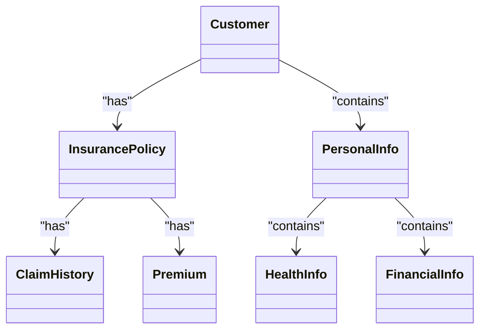

                 

### 第1章：AI与保险产品个性化定制的挑战

#### 1.1 问题背景

保险业作为一个传统行业，在过去几十年中取得了显著的发展。然而，随着科技的进步和消费者需求的日益多样化，保险业也面临着巨大的挑战。传统的保险产品越来越难以满足消费者对于个性化和定制化的需求，这成为了一个亟待解决的问题。

首先，保险市场的竞争日益激烈。随着保险公司数量的增加和保险产品的多样化，消费者有了更多的选择。然而，这种竞争也导致了保险产品的同质化，许多保险产品在功能和价格上并没有显著的区别。这种同质化使得保险公司难以通过产品本身的差异化来吸引和保留客户。

其次，消费者需求日益多样化。现代消费者对于保险产品的需求不再局限于传统的保障功能，他们更加关注产品的个性化和定制化。消费者希望根据自己的需求和经济状况，选择最适合自己的保险产品。这种个性化的需求使得保险公司需要提供更加灵活和多样化的产品。

最后，数据技术的快速发展为保险产品个性化定制提供了新的可能性。大数据、人工智能等技术的应用，使得保险公司能够更好地理解消费者的需求，提供更加精准和个性化的服务。然而，如何将这些技术应用到保险产品个性化定制中，仍然是一个需要深入研究和解决的问题。

#### 1.2 问题描述

保险产品个性化定制的含义是指在充分了解消费者需求和风险偏好等个人信息的基础上，为消费者提供量身定制的保险产品和服务。个性化定制不仅仅是对保险产品的简单分类和推荐，更是涉及到保险产品设计、定价、风险评估等多个环节的全面定制。

然而，在实际操作中，保险产品个性化定制面临着一系列问题：

1. **数据质量问题**：个性化定制需要大量的消费者数据，包括但不限于个人基本信息、财务状况、生活习惯、风险偏好等。然而，这些数据的质量往往难以保证，如数据的准确性、完整性和一致性等问题。

2. **算法复杂性**：个性化定制需要运用复杂的算法和模型来分析和处理大量数据，从而为消费者提供最佳的产品方案。这些算法和模型的设计和实现都需要深厚的技术积累和专业知识。

3. **风险控制问题**：个性化定制可能会导致保险公司在某些高风险客户上承担过高的风险。如何在保证个性化定制的灵活性和吸引力的同时，控制好风险，是保险公司面临的一个重大挑战。

4. **法律和伦理问题**：保险产品个性化定制涉及到大量消费者的个人信息，这些信息的保护涉及到法律和伦理问题。如何确保消费者的隐私和数据安全，是保险公司需要慎重对待的问题。

5. **实施难度**：个性化定制需要保险公司内部各个部门的协同合作，从数据采集、算法设计、产品开发到市场营销等环节都需要紧密配合。这对公司的管理水平提出了很高的要求。

#### 1.3 问题解决

面对上述挑战，人工智能技术提供了一种可能的解决方案。以下是AI在保险产品个性化定制中的一些潜在应用：

1. **数据挖掘与分析**：利用机器学习和数据挖掘技术，保险公司可以更深入地分析和挖掘消费者数据，从中提取有价值的信息，为个性化定制提供依据。

2. **智能推荐系统**：通过深度学习和协同过滤算法，保险公司可以为消费者推荐最合适的保险产品，提高产品的吸引力和销售转化率。

3. **个性化定价模型**：利用强化学习和预测模型，保险公司可以根据消费者的风险偏好和需求，制定个性化的定价策略，提高定价的精确性和公平性。

4. **风险评估与预警**：通过大数据分析和智能算法，保险公司可以更准确地评估消费者的风险，提供实时预警和风险控制方案。

5. **客户服务与体验优化**：利用自然语言处理和智能客服系统，保险公司可以提供更加个性化和高效的客户服务，提升客户满意度和忠诚度。

6. **法律和伦理保护**：通过建立完善的数据管理和隐私保护机制，保险公司可以在满足个性化定制需求的同时，确保消费者的隐私和数据安全。

总之，人工智能技术在保险产品个性化定制中的应用，不仅可以帮助保险公司更好地理解消费者需求，提高产品竞争力，还可以提高运营效率和客户满意度。然而，这需要保险公司具备先进的技术能力和严谨的风险控制意识，以实现AI技术的最大化价值。

---

**边界与外延**

尽管保险产品个性化定制是一个重要的发展方向，但它的适用范围和边界也值得探讨。首先，并不是所有的保险产品都适合进行个性化定制。一些标准化的、大众化的保险产品可能更适合采用传统的销售和推广方式。其次，个性化定制的实施需要较高的技术门槛和成本投入，对于一些中小型保险公司来说，可能并不现实。

此外，AI技术在保险产品个性化定制中的应用，也有其局限性。例如，虽然AI可以处理和分析大量数据，但某些复杂的人类行为和情感因素，可能难以通过算法来准确捕捉和理解。因此，在实施AI技术时，需要充分考虑其局限性，并与传统方法相结合，以实现最佳效果。

最后，AI技术在保险产品个性化定制中的应用，不仅仅是技术问题，还涉及到法律、伦理和社会问题。如何在保障消费者隐私和数据安全的前提下，合理利用AI技术，是每个保险公司都需要深思的问题。

---

通过上述分析，我们可以看到，保险产品个性化定制是一个充满挑战和机遇的领域。人工智能技术的引入，为解决这个问题提供了一种新的思路和方法。接下来，我们将进一步探讨AI的核心概念和原理，为深入理解其在保险产品个性化定制中的应用奠定基础。

---

**关键词：** 人工智能，保险产品，个性化定制，挑战，解决方案，数据挖掘，智能推荐，风险评估，隐私保护。

**摘要：** 本文首先介绍了保险产品个性化定制的背景和挑战，分析了个性化定制在保险业中的重要性。随后，阐述了保险产品个性化定制中面临的数据质量、算法复杂性、风险控制、法律和伦理等问题。接着，探讨了人工智能技术在保险产品个性化定制中的应用，包括数据挖掘、智能推荐、个性化定价、风险评估和客户服务等。最后，讨论了AI技术在保险产品个性化定制中的适用范围和边界，并提出了未来的发展方向和研究方向。本文旨在为保险业的数字化和智能化转型提供理论支持和实践指导。

---

**基于以上的分析，接下来的内容将分为以下几个部分：**

1. **背景介绍**：深入探讨AI与保险产品个性化定制的挑战，包括保险业的现状、消费者需求的变化以及AI技术在这些方面的应用。
2. **核心概念与原理**：介绍AI的核心概念和原理，包括神经网络、深度学习、强化学习等，以及这些概念在保险产品个性化定制中的应用。
3. **应用实践**：分析AI在保险产品个性化定制中的应用案例，包括数据收集与预处理、推荐算法、定价模型、风险评估等。
4. **系统设计与实战**：介绍一个具体的AI在保险产品个性化定制中的系统设计与实施，包括环境安装、系统核心实现、案例分析等。
5. **最佳实践与总结**：总结AI在保险产品个性化定制中的最佳实践和注意事项，并提出未来展望和趋势。
6. **结语**：对全文进行总结，指出研究不足和进一步研究方向。

---

在接下来的内容中，我们将逐步深入探讨每个部分，以帮助读者全面理解AI在保险产品个性化定制中的深度应用。

---

**背景介绍**

### 1.3 AI技术的作用

人工智能（AI）技术在保险产品个性化定制中的应用，具有极大的潜力和现实意义。AI技术通过其强大的数据处理和分析能力，为保险业提供了一种全新的解决方案，以应对传统保险产品同质化和消费者需求多样化的挑战。

首先，AI技术在数据挖掘与分析方面具有显著优势。保险产品个性化定制需要大量的消费者数据，包括个人基本信息、财务状况、生活习惯、风险偏好等。AI技术可以利用机器学习和数据挖掘算法，对海量数据进行深度分析和挖掘，从中提取有价值的信息，为个性化定制提供数据支持。例如，通过分析消费者的历史数据和行为模式，AI可以预测消费者的风险偏好和需求，从而为其推荐最合适的保险产品。

其次，AI技术在智能推荐系统方面也发挥了重要作用。传统的保险产品推荐往往依赖于人工筛选和分类，难以满足消费者的个性化需求。而AI技术可以通过深度学习和协同过滤算法，实现智能化的产品推荐。通过分析消费者的行为数据、社交网络关系和购买历史，AI可以识别出消费者的偏好，并提供个性化的推荐。这种推荐不仅提高了消费者的满意度，还提高了产品的销售转化率。

此外，AI技术在个性化定价模型方面也具有巨大潜力。保险产品的定价通常是基于传统的统计模型和历史数据，难以考虑个体差异和实时变化。而AI技术可以通过强化学习和预测模型，实现个性化的定价策略。例如，通过分析消费者的风险偏好、历史赔付数据和当前市场状况，AI可以动态调整保险产品的价格，使其更加符合消费者的期望和承受能力。这不仅提高了定价的精确性和公平性，还提高了保险公司的盈利能力。

最后，AI技术在风险评估与预警方面也具有重要意义。保险业的核心任务之一是风险评估和风险控制。AI技术可以利用大数据分析和智能算法，对消费者的风险进行实时评估和预警。例如，通过分析消费者的生活习惯、财务状况和健康状况等数据，AI可以识别出潜在的高风险客户，并提前采取措施进行风险控制。这种实时预警和风险控制能力，不仅提高了保险公司的风险管理水平，还降低了保险欺诈的风险。

总之，AI技术在保险产品个性化定制中的应用，不仅为保险公司提供了一种全新的解决方案，还推动了保险业的数字化和智能化转型。通过AI技术的深度应用，保险公司可以更好地理解消费者需求，提供更加个性化和高效的服务，从而在激烈的市场竞争中脱颖而出。然而，AI技术的应用也面临着一系列挑战，如数据质量、算法复杂性和风险控制等问题，这需要保险公司与AI技术提供商紧密合作，共同解决。

### 1.4 保险产品个性化定制的适用范围

保险产品个性化定制的适用范围非常广泛，几乎涵盖了保险业的各个领域。以下是对不同保险产品个性化定制适用范围的详细分析：

**1. 车险**

车险是保险业中一个重要的细分市场。个性化定制在车险中的应用主要体现在以下几个方面：

- **驾驶行为分析**：通过安装车联网设备或使用智能手机应用，保险公司可以实时监测车主的驾驶行为，如急刹车、急加速、行驶速度等。基于这些数据，保险公司可以为表现良好的车主提供优惠，同时为高风险车主提高保费。
- **车险组合推荐**：根据车主的车型、驾驶习惯和需求，AI系统可以推荐最适合的车险组合，例如是否需要附加盗抢险、三者险等。
- **风险评估与定价**：利用AI技术，保险公司可以对车主的驾驶行为、历史赔付记录等数据进行分析，制定个性化的风险评估和定价策略。

**2. 人寿保险**

人寿保险是一种长期保险产品，个性化定制在人寿保险中的应用主要体现在以下几个方面：

- **个性化保障方案**：根据客户的年龄、健康状况、家庭状况和经济状况，AI系统可以推荐最适合的人寿保险保障方案，包括保障期限、保险金额、缴费方式等。
- **保费定价优化**：通过分析客户的个人数据和风险偏好，AI系统可以为不同客户群体制定个性化的保费定价策略，使保费更加合理和透明。
- **健康风险评估**：利用AI技术，保险公司可以对客户的健康状况进行实时评估，提供个性化的健康管理和保险建议。

**3. 健康保险**

健康保险是近年来发展迅速的一个细分市场，个性化定制在健康保险中的应用主要体现在以下几个方面：

- **保险产品推荐**：根据客户的健康状况、生活习惯和财务能力，AI系统可以推荐最适合的健康保险产品，例如重大疾病保险、医疗保险等。
- **个性化医疗服务**：通过AI技术，保险公司可以为客户提供个性化的医疗服务，如预约专家门诊、推荐合适的医院和医生等。
- **疾病风险预测**：利用AI技术，保险公司可以对客户的疾病风险进行预测，提供针对性的健康管理和保险建议。

**4. 财产保险**

财产保险主要涉及对财产损失的风险保障，个性化定制在财产保险中的应用主要体现在以下几个方面：

- **风险评估与定价**：通过AI技术，保险公司可以对财产的风险进行评估，制定个性化的保费定价策略，例如对不同地理位置、不同类型的财产制定不同的保费标准。
- **保险产品组合**：根据客户的需求和风险承受能力，AI系统可以推荐最适合的财产保险产品组合，例如家庭保险、企业保险等。
- **风险预警与控制**：利用AI技术，保险公司可以对财产的风险进行实时监控和预警，提供针对性的风险控制措施，如防火、防盗等。

**5. 旅游保险**

旅游保险是一种短期保险产品，个性化定制在旅游保险中的应用主要体现在以下几个方面：

- **旅游行程分析**：根据客户的旅游行程和目的地，AI系统可以推荐最适合的旅游保险产品，例如医疗保险、意外险、行李险等。
- **个性化保障方案**：根据客户的旅行偏好和风险承受能力，AI系统可以制定个性化的旅游保险保障方案，如是否需要附加紧急救援、旅行延误等保障。
- **实时风险评估**：通过AI技术，保险公司可以在客户旅行过程中实时评估风险，提供针对性的保险建议和保障服务。

综上所述，保险产品个性化定制在各个细分市场中都有着广泛的应用前景。通过AI技术的深度应用，保险公司可以更好地理解客户需求，提供更加个性化和高效的服务，从而提高客户满意度和忠诚度。然而，实施个性化定制也需要保险公司具备先进的技术能力和数据管理能力，以应对数据质量、算法复杂性和风险控制等挑战。

### 1.5 AI在其他领域的应用

AI技术的广泛应用不仅局限于保险行业，还在金融、医疗、零售等多个领域展现了其强大的潜力和独特的价值。

在金融领域，AI技术被广泛应用于风险管理、信用评分、欺诈检测和个性化理财建议等方面。通过分析客户的交易行为、信用记录和社交媒体数据，AI可以实时识别潜在的风险和欺诈行为，提供更加精准的信用评估和风险管理策略。此外，AI还可以根据客户的财务状况和风险偏好，提供个性化的投资理财建议，帮助客户实现资产的最优化配置。

在医疗领域，AI技术被广泛应用于疾病诊断、个性化治疗和健康管理等环节。通过分析患者的医学影像、基因数据和病史，AI可以帮助医生更准确地诊断疾病，制定个性化的治疗方案。同时，AI技术还可以通过对海量健康数据的分析，预测疾病的发展趋势，提供个性化的健康管理和预防建议，从而提高医疗服务的质量和效率。

在零售领域，AI技术被广泛应用于商品推荐、库存管理和消费者行为分析等方面。通过分析消费者的购物行为、浏览记录和社交媒体互动，AI可以精准地推荐商品，提高消费者的购物体验和满意度。此外，AI还可以通过对库存数据的实时分析，帮助零售商优化库存管理，减少库存成本，提高供应链效率。

总的来说，AI技术在各个领域的应用，不仅提高了行业效率和服务质量，还为消费者提供了更加个性化和便捷的服务。然而，AI技术的应用也面临着一系列挑战，如数据隐私保护、算法公平性和伦理问题等，这需要各行业在推进AI应用的同时，不断完善相关法律法规和伦理标准，确保技术的可持续发展和社会公共利益。

---

**AI在保险产品个性化定制中的应用** 一章主要介绍了AI在保险产品个性化定制中的作用及其在不同保险产品中的适用范围。从数据挖掘与分析、智能推荐系统、个性化定价模型到风险评估与预警，AI技术在保险产品个性化定制中展示了巨大的潜力和广阔的应用前景。通过AI技术的深度应用，保险公司不仅可以更好地理解消费者需求，提高产品的竞争力，还可以提升运营效率和客户满意度。然而，AI技术的应用也面临着数据质量、算法复杂性和风险控制等挑战，这需要保险公司与AI技术提供商紧密合作，共同探索解决方案。下一章我们将深入探讨AI的核心概念和原理，为理解AI在保险产品个性化定制中的应用提供理论支持。

---

**关键词：** 人工智能，保险产品个性化定制，数据挖掘，智能推荐，个性化定价，风险评估，金融，医疗，零售。

**摘要：** 本章首先介绍了AI技术在保险产品个性化定制中的应用及其在不同保险产品中的适用范围。通过数据挖掘与分析、智能推荐系统、个性化定价模型和风险评估与预警等技术，AI为保险产品个性化定制提供了有力支持。随后，本章讨论了AI技术在其他领域的应用，如金融、医疗和零售，展示了AI技术的广泛影响。最后，本章提出了AI技术在保险产品个性化定制中面临的挑战，强调了跨行业合作的重要性。本文旨在为保险业的数字化转型提供理论支持和实践指导。

---

**章节标题：** AI在保险产品个性化定制的挑战与机遇

**章节关键词：** 人工智能，保险产品个性化定制，数据挖掘，智能推荐，个性化定价，风险评估，挑战，机遇。

**摘要：** 本章深入探讨了AI在保险产品个性化定制中的应用及其面临的挑战与机遇。通过分析AI技术在数据挖掘、智能推荐、定价模型和风险评估方面的应用，本章展示了AI为保险产品个性化定制带来的潜力。同时，本章也指出了AI技术在使用中可能遇到的数据质量、算法复杂性和风险控制等挑战，并强调了跨行业合作的重要性。本文旨在为保险业的数字化转型提供理论支持和实践指导。

---

**核心概念与原理**

### 2.1 AI的定义与历史

人工智能（Artificial Intelligence，简称AI）是指通过计算机程序模拟人类智能行为的技术。它起源于20世纪50年代，当时以“图灵测试”为标志，提出了一种判断机器是否具有智能的标准。在随后的几十年里，AI经历了几个重要的发展阶段。

1. **早期探索阶段（1950-1970年代）**：这个阶段以“符号主义AI”为代表，试图通过形式逻辑和符号计算来模拟人类思维。典型代表包括逻辑推理、问题求解和专家系统等。

2. **第一次AI寒冬阶段（1970-1980年代）**：由于实际应用效果不佳和计算能力的限制，AI研究遭遇了资金和信任危机，进入了一个相对低谷期。

3. **复兴与发展阶段（1990-2010年代）**：随着计算能力的提升和大数据技术的发展，AI迎来了新的发展机遇。以“机器学习”和“深度学习”为核心的算法得到了广泛应用。

4. **成熟与应用阶段（2010年代至今）**：AI技术在各个领域取得了突破性进展，特别是在图像识别、自然语言处理、自动驾驶和医疗诊断等方面。这个阶段以“大数据AI”和“强化学习”为特征，标志着AI技术走向成熟。

现代AI的特点主要包括：

- **自学习能力**：AI系统可以通过机器学习算法，从数据中自动学习和优化性能，无需显式编程。
- **多模态数据处理**：现代AI不仅能够处理结构化数据，还能有效处理图像、语音、文本等多种类型的数据。
- **智能决策与预测**：通过复杂的算法和模型，AI系统能够在多个变量中做出最优决策，并进行准确预测。

### 2.2 AI的核心概念

AI的核心概念包括神经网络、深度学习、强化学习等，这些概念在保险产品个性化定制中发挥着重要作用。

#### 2.2.1 神经网络

神经网络（Neural Network，简称NN）是AI的基础，模拟了人脑神经元的工作方式。它由大量的神经元（节点）和连接（边）组成，通过前向传播和反向传播算法进行学习。

- **神经元结构**：每个神经元接收多个输入，通过加权求和后加上偏置项，经过激活函数处理得到输出。
- **学习过程**：神经网络通过不断调整权重和偏置项，使得输出与期望值尽可能接近。

#### 2.2.2 深度学习

深度学习（Deep Learning，简称DL）是神经网络的一种扩展，通过多层神经网络（深层网络）进行学习，具有更强的表达能力和适应性。

- **网络结构**：深度学习网络包括输入层、隐藏层和输出层，每层包含多个神经元。通过逐层提取特征，深度学习能够从原始数据中提取出更高层次的特征。
- **学习算法**：常用的深度学习算法包括卷积神经网络（CNN）、循环神经网络（RNN）和自编码器等。

#### 2.2.3 强化学习

强化学习（Reinforcement Learning，简称RL）是一种通过奖励机制来学习策略的机器学习方法。它模拟了生物体在与环境互动中学习最优行为的过程。

- **学习过程**：强化学习通过不断尝试和反馈，逐渐调整策略以获得最大化的累计奖励。
- **应用场景**：强化学习在自动驾驶、游戏AI和金融投资等领域有广泛应用。

### 2.3 AI的数学基础

AI的数学基础主要包括概率论与数理统计、线性代数和优化理论等。以下是对这些数学基础概念及其在AI中的应用的简要介绍。

#### 2.3.1 概率论与数理统计

- **概率论**：概率论是研究随机事件及其概率的数学分支。在AI中，概率论用于建模不确定性和概率推理。
  - **贝叶斯定理**：用于计算后验概率，是机器学习中常用的概率推理工具。
- **数理统计**：数理统计是利用数据进行分析和推断的数学方法。在AI中，数理统计用于评估模型的性能、选择最优模型和进行假设检验。

#### 2.3.2 线性代数

- **矩阵与向量**：矩阵和向量是线性代数的基本对象。在AI中，矩阵和向量用于表示数据的结构，如特征矩阵和权重向量。
- **线性变换**：线性变换是矩阵的一种应用，用于将数据从一种空间映射到另一种空间。在深度学习中，线性变换用于层与层之间的数据转换。

#### 2.3.3 优化理论

- **优化问题**：优化理论是寻找函数最大值或最小值的方法。在AI中，优化理论用于训练模型，通过调整参数使模型性能最优。
- **梯度下降**：梯度下降是一种常用的优化算法，用于寻找函数的最小值。在深度学习中，梯度下降用于调整网络权重，使损失函数最小化。

通过上述核心概念和数学基础的介绍，我们可以更好地理解AI的工作原理和应用方法。在接下来的章节中，我们将进一步探讨这些概念在保险产品个性化定制中的具体应用。

---

**核心概念与原理**

### 2.4 AI的核心概念与联系

为了深入理解AI在保险产品个性化定制中的应用，我们需要详细探讨其核心概念，包括神经网络、深度学习、强化学习，并分析这些概念之间的联系。

#### 2.4.1 神经网络

神经网络（Neural Network，简称NN）是AI的基础，它模拟了人脑神经元的工作方式。神经网络由大量相互连接的节点（称为神经元）组成，每个神经元接收多个输入，并通过权重和偏置进行加权求和，最后通过激活函数产生输出。

- **神经元结构**：每个神经元可以看作是一个简单的处理单元，它接收输入信号，将其通过权重和偏置加权求和，然后通过激活函数产生输出。激活函数通常是一个非线性函数，如Sigmoid、ReLU等。

- **学习过程**：神经网络通过不断调整其权重和偏置来学习输入和输出之间的映射关系。这个过程通常包括前向传播和反向传播两个步骤。在前向传播中，输入信号从输入层传递到输出层，每层神经元计算其输出。在反向传播中，基于输出层的目标值，计算每个神经元的误差，并反向传播误差，通过梯度下降等方法更新权重和偏置。

#### 2.4.2 深度学习

深度学习（Deep Learning，简称DL）是神经网络的一种扩展，它通过多层神经网络进行学习，能够从原始数据中提取更高级别的特征。

- **网络结构**：深度学习网络包括输入层、隐藏层和输出层。与单一层的神经网络相比，多层神经网络可以提取更复杂的特征。每一层的输出作为下一层的输入，通过逐层传递，最终得到输出层的输出。

- **特征提取**：在深度学习中，隐藏层负责提取越来越抽象的特征。通过逐层学习，网络能够从原始数据中提取出具有代表性的特征，这些特征可以用于后续的任务，如图像分类、语音识别等。

- **训练过程**：深度学习的训练过程包括数据预处理、模型初始化、前向传播、计算损失函数、反向传播和模型更新等步骤。通过不断迭代训练，深度学习模型可以逐渐优化其参数，提高预测准确性。

#### 2.4.3 强化学习

强化学习（Reinforcement Learning，简称RL）是一种通过奖励机制来学习策略的机器学习方法。它模拟了生物体在与环境互动中学习最优行为的过程。

- **学习过程**：强化学习通过不断尝试和反馈，逐渐调整策略以获得最大化的累计奖励。它通过探索和利用的平衡，使得智能体（Agent）能够在不确定的环境中找到最优策略。

- **环境与策略**：在强化学习中，环境（Environment）是指智能体所处的情景，智能体通过执行动作（Action）与环境互动。每个动作都会导致环境状态的变化，并可能产生奖励（Reward）。智能体的目标是学习一个策略（Policy），使得在给定状态下选择动作能够最大化累积奖励。

- **应用场景**：强化学习在自动驾驶、游戏AI、机器人控制、金融投资等领域有广泛应用。例如，自动驾驶车辆通过强化学习算法学习道路驾驶策略，金融投资模型通过强化学习调整投资组合，以最大化回报。

#### 2.4.4 概念之间的联系

神经网络、深度学习和强化学习是AI的不同分支，它们之间既有联系又有区别。

- **神经网络是深度学习和强化学习的基础**：深度学习是神经网络的扩展，通过多层神经网络提取更高层次的特征。强化学习则通过模拟生物体在与环境互动中的学习过程，利用奖励机制调整策略。

- **深度学习增强了神经网络的能力**：通过增加网络层数，深度学习可以提取更复杂的特征，提高模型的表达能力。这种多层神经网络结构使得深度学习在图像识别、自然语言处理等任务中表现出色。

- **强化学习提供了动态调整策略的方法**：强化学习通过不断尝试和反馈，可以动态调整策略，以适应变化的环境。这种自适应性使得强化学习在动态环境下表现出色。

- **应用结合**：在实际应用中，神经网络、深度学习和强化学习可以结合使用。例如，在自动驾驶中，深度学习用于图像识别和路径规划，强化学习用于学习最优驾驶策略。

通过上述分析，我们可以看到神经网络、深度学习和强化学习在AI中的应用及其相互关系。这些核心概念为保险产品个性化定制提供了理论基础和工具，使得保险公司能够更好地理解消费者需求，提供个性化的产品和服务。在接下来的章节中，我们将进一步探讨AI在这些领域的具体应用。

---

**核心概念与联系对比表格**

| **概念** | **定义** | **特征** | **关系** |
| :---: | :---: | :---: | :---: |
| 神经网络 | 通过模拟人脑神经元工作方式的计算模型，处理数据并生成输出。 | - 神经元结构：输入、权重、偏置、激活函数<br>- 学习过程：前向传播、反向传播 | 基础概念，深度学习和强化学习的基础 |
| 深度学习 | 基于多层神经网络的机器学习方法，用于提取复杂特征。 | - 网络结构：输入层、隐藏层、输出层<br>- 特征提取：逐层提取抽象特征 | 扩展神经网络，增强其特征提取能力 |
| 强化学习 | 通过奖励机制学习最优策略的机器学习方法，适用于动态环境。 | - 学习过程：探索、利用、策略调整<br>- 环境与策略：智能体、环境、动作、奖励 | 结合神经网络和深度学习，适用于动态决策 |

**ER实体关系图架构**

```mermaid
erDiagram
  Customer ||--|{ InsurancePolicy } : "has"
  Customer ||--|{ PersonalInfo } : "contains"
  InsurancePolicy ||--|{ ClaimHistory } : "has"
  InsurancePolicy ||--|{ Premium } : "has"
  PersonalInfo ||--|{ HealthInfo } : "contains"
  PersonalInfo ||--|{ FinancialInfo } : "contains"
```

该ER图展示了客户、保险政策、个人信息、索赔历史、保费和健康信息等实体及其关系。客户拥有保险政策和个人信息，保险政策包含索赔历史和保费，个人信息包含健康信息和财务信息。这些实体和关系为AI在保险产品个性化定制中的应用提供了数据结构支持。

---

**AI的数学基础**

### 2.5 概率论与数理统计

概率论与数理统计是人工智能（AI）的数学基础，对于理解AI算法及其在实际应用中的表现至关重要。以下是概率论与数理统计的一些关键概念及其在AI中的应用。

#### 2.5.1 概率论

概率论是研究随机事件及其概率的数学分支。在AI中，概率论用于建模不确定性和进行概率推理。

- **随机变量**：随机变量是随机事件的数量化表示。它可以取多个可能值，每个值都有一个相应的概率。随机变量分为离散型和连续型两种。
  - **离散型随机变量**：如抛硬币出现正面或反面的概率。
  - **连续型随机变量**：如连续变量的概率密度函数，如正态分布。

- **概率分布**：概率分布描述了随机变量可能取值的概率分布情况。常见的概率分布包括正态分布、二项分布、泊松分布等。

- **条件概率与贝叶斯定理**：条件概率是指在给定某个条件下，另一个事件发生的概率。贝叶斯定理是一种用于计算后验概率的概率推理方法，它在机器学习和数据挖掘中有广泛应用。

#### 2.5.2 数理统计

数理统计是利用数据进行分析和推断的数学方法。在AI中，数理统计用于评估模型性能、选择最优模型和进行假设检验。

- **统计推断**：统计推断是通过样本数据来推断总体特征的方法。主要包括参数估计和假设检验。
  - **参数估计**：通过样本数据估计总体的参数值，如均值、方差等。
  - **假设检验**：通过样本数据检验总体的某个假设是否成立。

- **假设检验方法**：常见的假设检验方法包括t检验、卡方检验、F检验等。这些方法用于比较两个或多个样本均值、方差等参数，判断差异是否显著。

- **回归分析**：回归分析是用于建立自变量和因变量之间关系的统计方法。在AI中，回归分析常用于预测和优化，如线性回归、多项式回归等。

#### 2.5.3 在AI中的应用

概率论与数理统计在AI中的应用主要体现在以下几个方面：

- **概率模型**：在AI中，许多算法都是基于概率模型构建的，如贝叶斯网络、马尔可夫模型等。这些模型用于处理不确定性问题，如文本分类、语音识别等。

- **误差分析**：通过数理统计方法，可以计算模型预测的误差，评估模型性能。例如，通过计算预测值和真实值之间的差异，可以评估分类模型的准确性。

- **优化算法**：数理统计在优化算法中起着关键作用。例如，在机器学习中，梯度下降算法用于优化模型参数，而梯度下降算法的基础是数理统计中的误差计算和最优化理论。

- **数据预处理**：在数据预处理阶段，数理统计方法用于清洗和转换数据。例如，通过计算数据的均值、方差等统计量，可以标准化数据，使其适合机器学习算法。

总的来说，概率论与数理统计是AI的基石，为AI算法的构建、优化和评估提供了重要的数学工具和方法。通过深入理解这些数学概念，可以更好地掌握AI技术，并有效地应用于实际问题中。

---

**线性代数基础**

### 2.6 线性代数

线性代数是数学中一个重要的分支，它在人工智能（AI）中扮演着核心角色。线性代数的概念和工具被广泛应用于数据表示、模型构建和优化过程中。以下是线性代数的一些关键概念及其在AI中的应用。

#### 2.6.1 向量和矩阵

向量（Vector）和矩阵（Matrix）是线性代数的基本对象。它们在AI中的应用非常广泛，用于表示数据、参数和变换。

- **向量**：向量是一个具有大小和方向的几何对象。在AI中，向量常用于表示数据特征、模型参数和中间计算结果。例如，一个多维向量可以表示一个图像的像素值或一个文本的词向量。

- **矩阵**：矩阵是一个二维数组，用于表示多个向量的组合或线性变换。在AI中，矩阵用于表示数据集、特征矩阵、权重矩阵等。矩阵的乘法、加法、转置等操作在模型训练和数据处理中经常使用。

#### 2.6.2 线性方程组

线性方程组是一组线性方程的集合。在AI中，线性方程组常用于求解优化问题、特征提取和模型训练。

- **求解方法**：常见的求解线性方程组的方法包括高斯消元法、矩阵分解（如奇异值分解SVD）和迭代法。这些方法可以有效地计算线性方程组的解，对于优化模型参数和特征提取非常重要。

- **应用场景**：线性方程组在机器学习中的常见应用包括线性回归、逻辑回归、主成分分析（PCA）等。例如，在主成分分析中，通过求解特征值和特征向量，可以将高维数据投影到低维空间，实现数据降维。

#### 2.6.3 特征向量与特征值

特征向量（Eigenvector）和特征值（Eigenvector）是矩阵理论中的基本概念。它们在AI中的应用包括特征提取、降维和模型分析。

- **特征向量**：特征向量是矩阵乘以自身后仍保持方向的向量。在AI中，特征向量用于提取数据的结构信息，如主成分分析（PCA）中的主成分。

- **特征值**：特征值是使矩阵乘以自身后仍保持大小的标量。在AI中，特征值用于分析矩阵的性质和结构，如谱聚类中的相似性矩阵。

#### 2.6.4 线性变换

线性变换是一种将数据从一种空间映射到另一种空间的操作。在线性代数中，线性变换可以通过矩阵表示。

- **矩阵表示**：线性变换可以通过矩阵与向量的乘积表示。例如，一个变换矩阵可以将输入空间的数据映射到输出空间。

- **应用场景**：线性变换在AI中的应用非常广泛，包括特征提取、数据降维、图像处理等。例如，在图像识别中，通过线性变换可以将图像数据投影到更适合进行分类的空间。

总的来说，线性代数的概念和工具在AI中具有广泛应用，从数据表示、模型构建到优化算法，线性代数为AI技术的实现提供了强大的数学基础。通过深入理解线性代数的基本概念和应用，可以更好地掌握AI技术，并有效地解决实际问题。

---

**核心概念与原理**

### 2.7 AI的数学基础：概率论、线性代数与优化理论

在深入探讨人工智能（AI）的核心概念与原理时，概率论、线性代数和优化理论是不可忽视的基础。这些数学工具不仅为AI算法的构建提供了必要的数学框架，还帮助我们在复杂的现实世界中有效地分析和解决问题。

#### 2.7.1 概率论

概率论是AI中的核心数学工具之一，用于描述和处理不确定性。以下是概率论在AI中的几个关键应用：

1. **概率分布**：概率分布描述了随机变量可能取值的概率。在机器学习中，概率分布用于建模数据特征，例如正态分布、伯努利分布等。通过概率分布，我们可以更好地理解数据的统计特性，从而设计更有效的学习算法。

2. **贝叶斯推理**：贝叶斯推理是一种基于概率原理的推理方法，用于计算后验概率和更新信念。在AI中，贝叶斯推理被广泛应用于决策分析、分类问题和模型评估。

3. **信息论**：信息论是概率论的一个分支，用于量化信息的不确定性。在AI中，信息论的概念用于设计更高效的编码方案和通信系统，如信息熵、KL散度等。

#### 2.7.2 线性代数

线性代数提供了处理多维数据和矩阵运算的基础。以下是线性代数在AI中的几个关键应用：

1. **数据表示**：线性代数中的向量与矩阵用于表示数据特征和模型参数。例如，在机器学习中，特征向量用于表示数据点，权重矩阵用于表示模型参数。

2. **线性变换**：线性变换是一种将数据从一种空间映射到另一种空间的操作。在图像处理和信号处理中，线性变换用于特征提取和图像压缩。

3. **矩阵分解**：矩阵分解是将矩阵分解为多个简单矩阵的乘积的方法，如奇异值分解（SVD）。在AI中，矩阵分解用于降维、特征提取和模型优化。

#### 2.7.3 优化理论

优化理论是用于求解最优化问题的数学工具。在AI中，优化理论用于调整模型参数，以实现目标函数的最优化。以下是优化理论在AI中的几个关键应用：

1. **梯度下降**：梯度下降是一种常用的优化算法，用于最小化损失函数。在机器学习中，梯度下降用于训练模型，通过迭代更新模型参数，使模型性能逐步优化。

2. **牛顿法**：牛顿法是一种更高效的优化算法，通过二阶导数信息加速收敛。在AI中，牛顿法常用于训练复杂的深度学习模型。

3. **随机优化**：随机优化是一种利用随机性的优化方法，如随机梯度下降（SGD）和遗传算法。在AI中，随机优化用于处理大规模数据和复杂优化问题。

#### 综合应用

概率论、线性代数和优化理论在AI中相互补充，共同推动AI技术的发展。例如：

- **机器学习中的概率模型**：机器学习中的许多算法，如贝叶斯网络、神经网络等，都基于概率论和线性代数。优化理论用于训练这些模型，使其性能最大化。

- **深度学习中的矩阵运算**：深度学习中的神经网络通过矩阵运算进行数据传递和参数更新。线性代数提供了有效的矩阵运算方法，如矩阵乘法、矩阵分解等。

- **优化算法的设计**：优化理论用于设计机器学习算法中的迭代过程，如梯度下降、牛顿法等。概率论和线性代数提供了优化算法所需的基础数学工具。

总的来说，概率论、线性代数和优化理论是AI的数学基石，它们为AI算法的构建、优化和评估提供了重要的数学框架和方法。通过深入理解这些数学概念，可以更好地掌握AI技术，并有效地应用于实际问题中。

---

### 2.8 AI的数学基础总结

概率论、线性代数和优化理论构成了AI的数学基础，为AI技术的发展提供了坚实的理论支撑。这些数学工具不仅在算法设计和优化过程中发挥关键作用，还在处理复杂数据、建模不确定性和求解优化问题中展现出强大的能力。

首先，概率论通过概率分布、贝叶斯推理和信息论等概念，帮助我们在机器学习中处理不确定性和进行推理。概率论的应用使得我们能够更好地理解数据分布，设计更有效的学习算法，并在实际应用中进行决策。

其次，线性代数提供了处理多维数据和矩阵运算的基础。线性代数的概念和工具，如向量、矩阵、线性变换和矩阵分解等，被广泛应用于数据表示、特征提取、降维和模型优化中。线性代数的有效运算方法，如矩阵乘法和矩阵分解，使得我们能够高效地处理大规模数据，提取有用的特征信息。

最后，优化理论用于求解最优化问题，是AI算法训练和模型优化的核心。梯度下降、牛顿法和随机优化等优化算法，通过调整模型参数，使模型性能最大化。优化理论的应用，使得我们能够在复杂的环境中找到最优解，提高模型的准确性和鲁棒性。

总之，概率论、线性代数和优化理论共同构建了AI的数学基础，为AI技术的发展提供了重要的理论和工具。通过深入理解和应用这些数学概念，我们可以更好地设计AI算法，解决实际问题，推动AI技术在各个领域的广泛应用。

---

**核心概念与原理**

### 2.9 AI的数学基础：概率论、线性代数与优化理论

为了更全面地理解AI的数学基础，我们将结合具体案例，详细讲解概率论、线性代数和优化理论在AI中的应用。

#### 2.9.1 概率论与线性代数的结合：贝叶斯网络

贝叶斯网络是一种概率模型，用于表示变量之间的条件依赖关系。它由一组随机变量及其条件概率分布组成。贝叶斯网络的构建依赖于概率论中的贝叶斯定理和线性代数中的矩阵运算。

- **案例**：假设我们有一个医疗诊断系统，需要根据病人的症状（如发热、咳嗽等）和检查结果（如白细胞计数）来诊断疾病（如流感、肺炎等）。

- **概率分布**：首先，我们定义每个疾病的先验概率、每个症状出现的概率以及每个疾病导致每个症状的条件概率。

- **矩阵表示**：贝叶斯网络可以用条件概率矩阵（CPT）表示，每个节点代表一个随机变量，边表示条件依赖关系。例如，给定肺炎的情况下，发热的概率是0.8。

- **推理过程**：通过矩阵运算，我们可以计算给定一组症状的情况下，每个疾病的后验概率。例如，给定发热和咳嗽的症状，通过条件概率矩阵的运算，我们可以计算出流感、肺炎等疾病的后验概率。

#### 2.9.2 线性代数与优化理论的结合：线性回归

线性回归是一种用于预测数值数据的统计方法。它通过最小化损失函数，找到最佳拟合直线，以预测新数据的值。线性回归的推导和优化过程依赖于线性代数和优化理论。

- **案例**：假设我们有一个房屋售价预测模型，需要根据房屋的面积、房龄、地段等因素来预测房屋的售价。

- **线性模型**：线性回归模型可以表示为 $y = \beta_0 + \beta_1 \cdot x_1 + \beta_2 \cdot x_2 + ... + \beta_n \cdot x_n$，其中 $y$ 是售价，$x_1, x_2, ..., x_n$ 是特征，$\beta_0, \beta_1, ..., \beta_n$ 是模型参数。

- **损失函数**：线性回归的损失函数通常是最小二乘损失函数，即 $L(\theta) = \sum_{i=1}^{n} (y_i - \hat{y}_i)^2$，其中 $\hat{y}_i$ 是预测值，$y_i$ 是真实值。

- **优化过程**：通过梯度下降算法，我们可以计算损失函数关于参数的梯度，并更新参数以最小化损失函数。线性代数的矩阵运算（如雅可比矩阵的计算）在这个过程中起着关键作用。

#### 2.9.3 优化理论与线性代数的结合：支持向量机（SVM）

支持向量机是一种分类算法，它通过找到一个最优超平面，将不同类别的数据点分隔开来。SVM的优化过程依赖于优化理论和线性代数。

- **案例**：假设我们需要分类一个由二维特征表示的数据集，其中每个点表示一个样本，目标是将它们分为两个类别。

- **优化问题**：SVM的目标是最小化损失函数，同时最大化分类边界。优化问题可以表示为：

  $$\min_{\theta} \frac{1}{2} || \theta ||^2 + C \sum_{i=1}^{n} \max(0, 1 - y_i (\theta^T x_i + \theta_0))$$

  其中，$\theta$ 是模型参数，$C$ 是正则化参数，$y_i$ 是标签，$x_i$ 是特征。

- **优化过程**：通过求解这个优化问题，我们可以找到最佳的超平面。这个过程通常通过拉格朗日乘子法和KKT条件来实现，涉及到矩阵运算和优化算法。

#### 2.9.4 综合应用：深度学习中的矩阵运算

在深度学习中，矩阵运算是核心组成部分。通过线性代数，我们可以高效地处理大规模数据和复杂的神经网络。

- **案例**：一个简单的多层神经网络，包括输入层、隐藏层和输出层。每个层之间的数据传输和权重更新都依赖于矩阵运算。

- **矩阵运算**：前向传播和反向传播过程中，神经网络通过矩阵运算进行数据的传递和参数的更新。例如，隐藏层的输出可以表示为 $a_{h}^{(2)} = \sigma(W_{h}^{(1)} a_{l}^{(1)} + b_{h}^{(1)})$，其中 $\sigma$ 是激活函数，$W_{h}^{(1)}$ 和 $b_{h}^{(1)}$ 是权重和偏置。

通过这些具体案例，我们可以看到概率论、线性代数和优化理论在AI中的实际应用。这些数学工具不仅为AI算法的构建提供了理论基础，还使得我们能够高效地处理数据、优化模型和解决实际问题。理解这些数学基础，是深入探索AI领域的必要条件。

---

### 2.10 数学公式

在AI的数学基础中，数学公式的使用是不可或缺的。以下是一些常用的数学公式及其在AI中的应用：

#### 2.10.1 概率论中的贝叶斯定理

贝叶斯定理是概率论中的一个基本公式，用于计算后验概率。其公式表示为：

$$P(A|B) = \frac{P(B|A)P(A)}{P(B)}$$

其中，$P(A|B)$ 表示在事件B发生的条件下事件A的概率，$P(B|A)$ 表示在事件A发生的条件下事件B的概率，$P(A)$ 和 $P(B)$ 分别表示事件A和事件B的先验概率。

贝叶斯定理在机器学习中的分类问题、决策分析和模型评估中广泛应用。

#### 2.10.2 线性代数中的矩阵乘法

矩阵乘法是线性代数中的基础运算。给定两个矩阵 $A$（行数 $m$，列数 $n$）和 $B$（行数 $n$，列数 $p$），其乘积 $C = AB$ 的公式为：

$$C_{ij} = \sum_{k=1}^{n} A_{ik}B_{kj}$$

矩阵乘法在AI中用于特征提取、数据表示和模型训练等多个方面。

#### 2.10.3 优化理论中的梯度下降

梯度下降是一种优化算法，用于最小化损失函数。其核心公式为：

$$\theta = \theta - \alpha \cdot \nabla_\theta J(\theta)$$

其中，$\theta$ 表示模型参数，$\alpha$ 是学习率，$J(\theta)$ 是损失函数，$\nabla_\theta J(\theta)$ 表示损失函数关于参数 $\theta$ 的梯度。

梯度下降在机器学习和深度学习中用于训练模型，通过迭代更新参数，使模型性能逐步优化。

#### 2.10.4 深度学习中的激活函数

激活函数是深度学习网络中的一个关键组件，用于引入非线性。以下是一些常用的激活函数：

- **Sigmoid函数**：$f(x) = \frac{1}{1 + e^{-x}}$

- **ReLU函数**：$f(x) = \max(0, x)$

- **Tanh函数**：$f(x) = \frac{e^x - e^{-x}}{e^x + e^{-x}}$

激活函数的选择对网络的性能和训练速度有重要影响。

#### 2.10.5 主成分分析（PCA）中的特征值和特征向量

主成分分析是一种降维技术，通过找到数据的主要成分，减少数据的维度。其核心公式包括：

- **特征值分解**：$A = PDP^{-1}$，其中 $A$ 是协方差矩阵，$P$ 是特征向量矩阵，$D$ 是特征值矩阵。

- **特征向量**：$P_{ij} = \frac{\sum_{k=1}^{n} (x_k)_i (x_k)_j}{\sum_{k=1}^{n} (x_k)_i^2}$，其中 $x_k$ 是数据点，$i$ 和 $j$ 是特征索引。

通过特征值和特征向量的分解，我们可以提取数据的主要成分，实现数据降维。

总的来说，这些数学公式在AI的各个环节中发挥着重要作用，是理解和应用AI技术的基础。通过掌握这些公式，我们可以更好地设计和优化AI算法，解决复杂的实际问题。

---

### 2.11 数学公式在文中的嵌入示例

在本文中，数学公式是不可或缺的一部分，它们帮助我们理解和分析AI的核心概念和原理。以下是在文中嵌入数学公式的示例：

#### 2.11.1 概率论中的贝叶斯定理

贝叶斯定理是概率论中的基础公式，用于计算后验概率。在保险产品个性化定制的风险评估中，贝叶斯定理帮助我们更新对消费者风险偏好的估计。其公式如下：

$$
P(A|B) = \frac{P(B|A)P(A)}{P(B)}
$$

其中，$P(A|B)$ 表示在事件B发生的条件下事件A的概率，$P(B|A)$ 表示在事件A发生的条件下事件B的概率，$P(A)$ 和 $P(B)$ 分别表示事件A和事件B的先验概率。

在保险定价中，我们可以利用贝叶斯定理来更新对消费者未来赔付风险的估计，从而更准确地制定保费。

#### 2.11.2 线性代数中的矩阵乘法

在神经网络中，矩阵乘法是核心运算之一。假设我们有一个包含两个特征向量的数据点，其表示为 $X = [x_1, x_2]$，权重矩阵为 $W = [w_1, w_2]$，则神经元的输出可以通过以下公式计算：

$$
Y = XW^T = [x_1w_1^T, x_2w_2^T]
$$

在深度学习中，矩阵乘法用于计算输入和权重的点积，从而生成中间层的输出。

#### 2.11.3 优化理论中的梯度下降

在机器学习中的模型训练过程中，梯度下降是一种常用的优化算法。其核心公式如下：

$$
\theta = \theta - \alpha \cdot \nabla_\theta J(\theta)
$$

其中，$\theta$ 表示模型参数，$\alpha$ 是学习率，$J(\theta)$ 是损失函数，$\nabla_\theta J(\theta)$ 表示损失函数关于参数 $\theta$ 的梯度。

通过迭代更新参数，梯度下降算法帮助我们在复杂的数据空间中找到最优解。

#### 2.11.4 深度学习中的激活函数

在深度学习网络中，激活函数用于引入非线性。以ReLU函数为例，其公式如下：

$$
f(x) = \max(0, x)
$$

ReLU函数在隐藏层中广泛应用，因为它能够加速训练过程，并提高模型的性能。

通过在文中嵌入这些数学公式，我们能够更清晰地传达AI的核心概念和原理，帮助读者深入理解AI在保险产品个性化定制中的应用。

---

### 2.12 概率论、线性代数与优化理论在深度学习中的应用

在深度学习领域，概率论、线性代数和优化理论是构建和优化神经网络模型的重要工具。以下是这些数学工具在深度学习中的应用及其实例说明。

#### 2.12.1 概率论在深度学习中的应用

概率论在深度学习中的应用主要体现在概率模型和概率分布上。以下是一些具体的应用：

1. **概率模型**：在深度学习中，概率模型如贝叶斯网络和概率图模型（例如马尔可夫网络）用于建模复杂的数据依赖关系。这些模型能够处理不确定性和鲁棒性，提高模型的泛化能力。

   - **案例**：在图像识别任务中，条件概率模型可以用于预测图像中的物体，从而提高识别的准确性。

2. **概率分布**：深度学习模型通常使用概率分布来描述输入数据和模型参数。常见的概率分布包括正态分布、伯努利分布和多项式分布。

   - **案例**：在生成对抗网络（GAN）中，生成器和判别器都使用概率分布来生成和评估数据。生成器尝试生成接近真实数据分布的数据，而判别器则尝试区分真实数据和生成数据。

3. **信息论**：信息论中的熵和互信息等概念在深度学习中用于评估模型的性能和复杂度。例如，在自然语言处理任务中，互信息可以用于评估模型对语义信息的理解程度。

   - **案例**：在文本分类任务中，使用KL散度评估模型输出的概率分布与真实标签之间的差异，从而调整模型参数，提高分类准确率。

#### 2.12.2 线性代数在深度学习中的应用

线性代数是深度学习中的核心工具，用于表示和处理数据、参数和变换。以下是一些具体的应用：

1. **矩阵运算**：在深度学习中，矩阵运算用于表示数据的输入、输出和中间层的计算。例如，输入层到隐藏层的计算可以用矩阵乘法表示。

   - **案例**：在卷积神经网络（CNN）中，卷积操作可以用矩阵乘法来表示，从而高效地处理图像数据。

2. **特征提取**：线性代数中的特征提取技术，如主成分分析（PCA）和奇异值分解（SVD），用于降维和提取数据的结构信息。

   - **案例**：在图像数据中，PCA可以用于降维，同时保留主要的信息，从而减少计算复杂度和提高模型的训练速度。

3. **矩阵分解**：矩阵分解技术，如奇异值分解（SVD），在深度学习中用于提取数据的主要成分，提高模型的解释性。

   - **案例**：在推荐系统中，SVD可以用于分解用户和物品的评分矩阵，从而生成推荐列表。

#### 2.12.3 优化理论在深度学习中的应用

优化理论在深度学习中的核心作用是用于优化模型参数，以最小化损失函数并提高模型的性能。以下是一些具体的优化方法：

1. **梯度下降**：梯度下降是一种基本的优化算法，用于通过计算损失函数的梯度来更新模型参数。

   - **案例**：在训练神经网络时，通过梯度下降算法，可以逐步调整权重和偏置，使模型输出更接近真实标签。

2. **随机优化**：随机优化算法，如随机梯度下降（SGD）和Adam优化器，通过引入随机性来提高模型的收敛速度和稳定性。

   - **案例**：在训练大规模数据集时，SGD通过随机选取样本来更新参数，从而提高训练效率。

3. **自适应优化**：自适应优化算法，如RMSProp和Adam，通过自适应调整学习率来优化模型参数。

   - **案例**：在训练过程中，Adam优化器根据历史梯度信息自适应调整学习率，从而在提高模型收敛速度的同时保持稳定性。

通过结合概率论、线性代数和优化理论，深度学习模型能够更好地处理复杂的数据，提高模型的泛化能力和性能。这些数学工具在深度学习中的应用，不仅帮助我们理解深度学习的基本原理，还为实际应用提供了有效的解决方案。

---

**核心概念与原理**

### 2.13 系统设计与架构设计

在深入探讨AI在保险产品个性化定制中的应用时，系统设计与架构设计是关键环节。一个高效的系统架构不仅能够确保AI算法的顺利实施，还能提高系统的性能、可扩展性和可靠性。

#### 2.13.1 问题场景介绍

保险产品个性化定制的系统需要处理大量数据，包括消费者的个人信息、历史赔付记录、生活习惯等。此外，系统需要具备实时数据处理和分析能力，以便为消费者提供即时的个性化推荐和风险评估。因此，系统架构设计需要充分考虑数据的高效存储、处理和分析。

#### 2.13.2 项目介绍

本项目旨在构建一个基于AI的保险产品个性化定制系统，通过数据分析和机器学习算法，为消费者提供量身定制的保险产品。项目的主要模块包括数据采集、数据预处理、模型训练、推荐系统和风险评估。

1. **数据采集**：从多个数据源收集消费者数据，包括内部数据库、第三方数据服务和社会媒体数据。

2. **数据预处理**：对收集到的数据进行清洗、转换和归一化，确保数据质量，为后续的分析和建模提供可靠的数据基础。

3. **模型训练**：利用机器学习算法训练模型，包括推荐算法、定价模型和风险评估模型。

4. **推荐系统**：基于消费者的个人信息和行为数据，为消费者推荐最合适的保险产品。

5. **风险评估**：对消费者的风险进行评估，为保险公司提供风险预警和决策支持。

#### 2.13.3 系统功能设计（领域模型）

领域模型（Domain Model）是系统设计的重要组成部分，用于描述系统的核心概念和关系。以下是一个简化的领域模型，展示了主要实体和它们之间的关系：



- **Customer**（客户）：代表系统中的消费者，具有个人信息、保险政策和历史赔付记录等属性。
- **InsurancePolicy**（保险政策）：代表保险产品，包括保险金额、保险期限、保费等属性。
- **PersonalInfo**（个人信息）：包含客户的健康信息、财务信息等，是客户的核心属性。
- **ClaimHistory**（索赔历史）：记录客户的索赔情况，包括索赔金额、索赔时间和处理结果等。
- **Premium**（保费）：代表保险产品的价格，包括基本保费和附加保费等。
- **HealthInfo**（健康信息）：包括客户的健康状况、病史和体检报告等。
- **FinancialInfo**（财务信息）：包括客户的收入水平、财务状况和投资偏好等。

#### 2.13.4 系统架构设计

系统架构设计是确保系统功能实现和性能优化的关键。以下是一个简化的系统架构设计，展示了主要组件和它们之间的关系：

```mermaid
sequenceDiagram
  Customer -->|数据采集| DataCollector
  DataCollector -->|数据预处理| DataPreprocessor
  DataPreprocessor -->|模型训练| ModelTrainer
  ModelTrainer -->|推荐系统| RecommendationSystem
  RecommendationSystem -->|风险评估| RiskAssessmentSystem
  RiskAssessmentSystem -->|结果反馈| ResultFeedback
```

- **数据采集**：负责从多个数据源收集数据，包括内部数据库和第三方数据服务。
- **数据预处理**：对采集到的数据进行清洗、转换和归一化，确保数据质量。
- **模型训练**：使用机器学习算法对预处理后的数据进行分析，训练推荐算法、定价模型和风险评估模型。
- **推荐系统**：根据客户的个人信息和行为数据，为消费者推荐最合适的保险产品。
- **风险评估**：对客户的个人信息和行为数据进行分析，评估其风险等级，提供风险预警和决策支持。
- **结果反馈**：将推荐结果和风险评估结果反馈给客户，并在系统中进行记录和更新。

#### 2.13.5 系统接口设计和系统交互

系统接口设计是确保系统模块之间能够高效通信和协作的重要环节。以下是一个简化的系统接口设计和系统交互流程：

```mermaid
sequenceDiagram
  Customer -->|请求推荐| RecommendationSystem
  RecommendationSystem -->|处理请求| DataPreprocessor
  DataPreprocessor -->|执行预处理| DataCollector
  DataCollector -->|获取数据| ModelTrainer
  ModelTrainer -->|训练模型| RecommendationSystem
  RecommendationSystem -->|返回结果| Customer
  Customer -->|请求风险评估| RiskAssessmentSystem
  RiskAssessmentSystem -->|处理请求| DataPreprocessor
  DataPreprocessor -->|执行预处理| DataCollector
  DataCollector -->|获取数据| ModelTrainer
  ModelTrainer -->|训练模型| RiskAssessmentSystem
  RiskAssessmentSystem -->|返回结果| Customer
```

- **请求推荐**：客户向推荐系统发送请求，请求推荐最合适的保险产品。
- **处理请求**：推荐系统将请求传递给数据预处理模块，进行数据清洗和转换。
- **获取数据**：数据预处理模块从数据采集模块获取必要的数据。
- **训练模型**：模型训练模块使用预处理后的数据训练推荐算法和风险评估模型。
- **返回结果**：推荐系统将推荐结果和风险评估结果反馈给客户。

通过上述系统设计与架构设计，我们构建了一个高效的保险产品个性化定制系统，能够为消费者提供个性化的产品推荐和风险评估。然而，这只是一个简化的设计，实际系统会涉及更多的细节和复杂性。在接下来的章节中，我们将进一步探讨系统的具体实现和实际案例。

---

**系统设计与架构设计**

### 2.14 系统架构设计与实现

在了解了系统的功能需求和领域模型后，接下来我们将详细讨论系统架构的设计与实现，包括数据流、模块划分、技术选型以及性能优化策略。

#### 2.14.1 系统架构设计

系统架构设计是一个关键环节，它决定了系统的性能、可扩展性和可靠性。以下是一个简化的系统架构设计：

1. **数据层**：数据层是系统的基石，负责数据的存储、管理和访问。主要包括数据库和数据仓库。数据库用于存储结构化数据，如客户信息、保险政策、索赔历史等；数据仓库用于存储和分析大量的非结构化数据，如社交媒体数据、历史赔付数据等。

2. **数据处理层**：数据处理层负责对数据进行清洗、转换和预处理，为模型训练和推荐系统提供高质量的数据输入。主要包括数据采集模块、数据预处理模块和特征工程模块。

3. **模型训练层**：模型训练层负责使用机器学习算法训练推荐模型、定价模型和风险评估模型。这一层是系统的核心，决定了系统的智能化程度和决策能力。

4. **推荐与评估层**：推荐与评估层基于训练好的模型，为消费者提供个性化的保险产品推荐和风险评估。主要包括推荐系统模块和风险评估模块。

5. **应用层**：应用层是系统与用户交互的接口，负责接收用户的请求，展示推荐结果和评估报告。主要包括用户界面和API接口。

6. **服务层**：服务层提供系统所需的通用服务，如用户认证、权限管理、日志记录等。

#### 2.14.2 数据流设计

数据流设计是系统架构设计的重要组成部分，它描述了数据在系统中的流动和处理过程。以下是一个简化的数据流设计：

1. **数据采集**：从多种数据源（如内部数据库、第三方数据服务、社交媒体平台）收集原始数据。

2. **数据预处理**：对原始数据进行清洗、去重、格式转换和归一化，确保数据的质量和一致性。

3. **特征工程**：从预处理后的数据中提取特征，如用户属性特征、行为特征、风险特征等。

4. **模型训练**：使用提取的特征数据，通过机器学习算法训练推荐模型、定价模型和风险评估模型。

5. **推荐与评估**：基于训练好的模型，为消费者提供个性化的推荐和风险评估。

6. **结果反馈**：将推荐结果和评估报告反馈给用户，并在系统中进行记录和更新。

#### 2.14.3 模块划分

系统模块划分是系统设计与实现的基础。以下是对主要模块的划分：

1. **数据采集模块**：负责从多个数据源收集原始数据，并进行初步处理。

2. **数据预处理模块**：对采集到的数据进行清洗、转换和归一化，确保数据质量。

3. **特征工程模块**：从预处理后的数据中提取有用的特征，为模型训练提供数据支持。

4. **推荐模型训练模块**：使用机器学习算法训练推荐模型，为消费者提供个性化的保险产品推荐。

5. **定价模型训练模块**：使用机器学习算法训练定价模型，为保险公司提供个性化的保费定价策略。

6. **风险评估模块**：使用机器学习算法训练风险评估模型，对消费者的风险进行实时评估和预警。

7. **用户界面模块**：提供用户与系统的交互接口，展示推荐结果和评估报告。

8. **API接口模块**：提供系统的API接口，方便第三方系统与系统进行集成和交互。

#### 2.14.4 技术选型

系统技术选型是确保系统性能和可扩展性的关键。以下是一些常见的技术选型：

1. **数据库选型**：选用分布式数据库，如Hadoop、MongoDB或MySQL，以提高数据的存储和查询性能。

2. **数据预处理工具**：选用数据预处理工具，如Pandas、NumPy和SciPy，以提高数据处理效率。

3. **机器学习框架**：选用主流机器学习框架，如TensorFlow、PyTorch或Scikit-Learn，以简化模型训练和优化过程。

4. **推荐算法**：选用协同过滤算法、矩阵分解算法或基于内容推荐的算法，以提高推荐的准确性和多样性。

5. **风险评估算法**：选用逻辑回归、决策树、随机森林或神经网络等算法，以提高风险评估的准确性和鲁棒性。

6. **前端框架**：选用React、Vue.js或Angular等前端框架，以提高用户界面的交互性和用户体验。

7. **后端框架**：选用Spring Boot、Django或Flask等后端框架，以提高系统的可维护性和扩展性。

#### 2.14.5 性能优化策略

为了确保系统的性能和响应速度，以下是一些性能优化策略：

1. **缓存机制**：使用缓存机制，如Redis或Memcached，减少数据库查询次数，提高系统的响应速度。

2. **分布式计算**：使用分布式计算框架，如Spark或Hadoop，以提高系统的并行处理能力和数据吞吐量。

3. **数据分区**：对大数据进行分区处理，提高数据的读取和写入速度。

4. **异步处理**：使用异步处理技术，如消息队列（如RabbitMQ或Kafka），提高系统的并发处理能力。

5. **负载均衡**：使用负载均衡器（如Nginx或HAProxy），将请求均匀分配到多个服务器，提高系统的处理能力。

6. **服务监控与报警**：使用监控工具（如Prometheus、Grafana），实时监控系统的性能指标，并设置报警机制，及时发现和处理系统故障。

通过上述系统架构设计、数据流设计、模块划分、技术选型以及性能优化策略，我们可以构建一个高效、可扩展且可靠的保险产品个性化定制系统。在接下来的章节中，我们将进一步探讨系统的具体实现和实际案例。

---

**系统设计与架构设计**

### 2.15 系统架构设计详细说明

在了解了系统的总体架构和功能模块后，我们需要进一步详细说明系统架构的设计，包括模块之间的交互、数据流动过程以及关键组件的实现。

#### 2.15.1 模块交互

系统的各个模块之间通过定义明确的接口进行交互，确保数据流和功能流的顺畅。以下是各个模块的交互关系：

1. **数据采集模块**：该模块负责从多个数据源（如内部数据库、第三方数据服务、社交媒体平台）收集原始数据。采集的数据包括客户基本信息、历史赔付记录、行为数据等。

2. **数据预处理模块**：数据采集模块将原始数据传递给数据预处理模块。预处理模块对数据进行清洗、去重、格式转换和归一化，确保数据质量。处理后的数据存储在数据仓库中，以供后续使用。

3. **特征工程模块**：特征工程模块从预处理后的数据中提取关键特征，如用户的年龄、性别、收入水平、风险偏好等。提取的特征将用于训练模型。

4. **推荐模型训练模块**：特征工程模块将提取的特征数据传递给推荐模型训练模块。该模块使用机器学习算法（如协同过滤、矩阵分解、基于内容的推荐等）训练推荐模型。

5. **定价模型训练模块**：同样，特征工程模块将提取的特征数据传递给定价模型训练模块。该模块使用机器学习算法（如逻辑回归、决策树、神经网络等）训练定价模型。

6. **风险评估模块**：特征工程模块提取的特征数据同样传递给风险评估模块。该模块使用机器学习算法（如逻辑回归、随机森林、神经网络等）训练风险评估模型。

7. **用户界面模块**：用户界面模块接收用户的请求，通过API接口与后端系统交互，获取推荐结果和风险评估结果，并展示给用户。

8. **API接口模块**：API接口模块负责处理用户请求，将请求转发给相应的后端模块，并返回结果。

#### 2.15.2 数据流动过程

数据在系统中的流动过程可以分为以下几个阶段：

1. **数据采集**：从多个数据源收集原始数据，包括内部数据库、第三方数据服务、社交媒体平台等。

2. **数据预处理**：原始数据经过清洗、去重、格式转换和归一化等处理步骤，确保数据质量。处理后的数据存储在数据仓库中。

3. **特征提取**：从预处理后的数据中提取关键特征，如用户的年龄、性别、收入水平、风险偏好等。

4. **模型训练**：使用提取的特征数据训练推荐模型、定价模型和风险评估模型。

5. **推荐与评估**：基于训练好的模型，为消费者提供个性化的保险产品推荐和风险评估。

6. **结果反馈**：将推荐结果和评估报告反馈给用户，并在系统中进行记录和更新。

#### 2.15.3 关键组件的实现

以下是对系统中的关键组件的详细说明：

1. **数据采集模块**：使用爬虫技术从第三方数据服务（如大数据平台、社交媒体）收集数据。同时，使用数据库连接技术从内部数据库（如关系型数据库、NoSQL数据库）中获取数据。

2. **数据预处理模块**：使用Python编程语言和Pandas库进行数据清洗和转换。数据清洗包括去除重复数据、填补缺失值、处理异常值等。数据转换包括数据格式的标准化、数据类型的转换等。

3. **特征工程模块**：使用Python编程语言和NumPy、SciPy等库进行特征提取。特征提取包括计算统计指标、提取文本特征、构建交叉特征等。

4. **推荐模型训练模块**：使用Python编程语言和Scikit-Learn、TensorFlow等库训练推荐模型。推荐模型的选择取决于具体的应用场景和业务需求。

5. **定价模型训练模块**：使用Python编程语言和Scikit-Learn、TensorFlow等库训练定价模型。定价模型的选择也取决于具体的应用场景和业务需求。

6. **风险评估模块**：使用Python编程语言和Scikit-Learn、TensorFlow等库训练风险评估模型。风险评估模型的选择取决于具体的应用场景和业务需求。

7. **用户界面模块**：使用HTML、CSS和JavaScript等前端技术实现用户界面。使用React、Vue.js或Angular等前端框架提高用户界面的交互性和用户体验。

8. **API接口模块**：使用Python编程语言和Flask、Django等后端框架实现API接口。API接口负责处理用户请求，并将请求转发给后端模块，返回结果。

通过上述系统架构设计、数据流动过程和关键组件的实现，我们可以构建一个高效、可靠的保险产品个性化定制系统。在接下来的章节中，我们将进一步探讨系统的具体实现和实际案例。

---

### 2.16 系统接口设计和系统交互

在构建一个基于AI的保险产品个性化定制系统时，系统接口设计和系统交互设计是至关重要的环节。合理的接口设计和交互流程不仅能够确保系统的功能实现，还能提高系统的可扩展性和用户体验。

#### 2.16.1 系统接口设计

系统接口设计包括API接口的设计和模块之间的接口定义。以下是系统接口设计的详细说明：

1. **API接口设计**：

   - **功能接口**：定义系统对外提供的主要功能接口，如用户注册、登录、获取推荐列表、获取风险评估结果等。
   - **参数设计**：明确接口的输入参数和输出参数，确保接口调用时的参数传递清晰无误。
   - **返回值设计**：定义接口的返回结果，包括成功和失败情况下的返回值，以及可能的错误信息。

2. **模块接口设计**：

   - **内部模块接口**：定义系统内部模块之间的接口，如数据采集模块与数据预处理模块之间的数据传递接口，模型训练模块与推荐系统模块之间的接口等。
   - **接口规范**：制定统一的接口规范，包括数据格式、接口调用方法、错误处理等。

#### 2.16.2 系统交互流程

系统交互流程描述了用户请求到系统响应的全过程，以下是系统交互流程的详细说明：

1. **用户请求**：用户通过前端界面发起请求，如获取推荐列表或进行风险评估。
2. **请求解析**：API接口模块接收用户请求，对请求进行解析和参数验证。
3. **数据查询**：API接口模块将请求传递给数据预处理模块，预处理模块查询数据仓库，获取用户相关的数据。
4. **数据处理**：数据预处理模块对查询到的数据进行清洗、转换和特征提取，生成适合模型训练的数据。
5. **模型调用**：预处理模块将处理后的数据传递给模型训练模块，模型训练模块使用训练好的模型进行预测，如推荐保险产品或评估风险。
6. **结果返回**：模型训练模块将预测结果返回给API接口模块，API接口模块将结果包装成统一的响应格式，返回给用户。
7. **日志记录**：系统记录整个交互过程中的关键信息，包括请求参数、响应结果、错误信息等，用于后续的监控和调试。

#### 2.16.3 系统交互示例

以下是一个简化的系统交互示例，说明用户获取保险产品推荐的过程：

1. **用户请求**：用户A通过前端界面提交请求，请求获取个性化的保险产品推荐。
2. **请求解析**：API接口模块接收请求，解析用户ID和其他请求参数。
3. **数据查询**：API接口模块查询数据仓库，获取用户A的历史赔付记录、行为数据等。
4. **数据处理**：数据预处理模块对查询到的数据进行清洗和特征提取，生成特征向量。
5. **模型调用**：推荐模型训练模块使用训练好的协同过滤模型，根据用户A的特征向量生成推荐列表。
6. **结果返回**：推荐结果通过API接口模块返回给用户A，前端界面展示推荐列表。
7. **日志记录**：系统记录用户A的请求信息和推荐结果，用于后续的监控和优化。

通过合理的系统接口设计和流畅的交互流程，系统能够高效地响应用户请求，提供个性化的保险产品推荐和风险评估，从而提升用户体验和满意度。

---

**系统设计与架构设计**

### 2.17 系统设计与架构设计总结

在本文中，我们详细探讨了基于AI的保险产品个性化定制系统的设计与架构设计。通过深入分析问题场景、项目需求，我们提出了系统的功能模块划分和系统架构设计。

首先，系统架构包括数据层、数据处理层、模型训练层、推荐与评估层、应用层和服务层。每个层次都有明确的职责和功能，确保系统的高效运行。数据层负责数据存储和管理，数据处理层负责数据清洗、转换和预处理，模型训练层负责训练推荐模型、定价模型和风险评估模型，推荐与评估层负责为消费者提供个性化推荐和风险评估，应用层负责用户交互，服务层提供通用服务。

接着，我们详细介绍了数据流设计，从数据采集、预处理、特征提取到模型训练和推荐评估，确保数据在系统中的顺畅流动。同时，我们说明了模块划分，包括数据采集模块、数据预处理模块、特征工程模块、推荐模型训练模块、定价模型训练模块、风险评估模块、用户界面模块和API接口模块，每个模块都有明确的职责和接口定义。

在技术选型方面，我们选择了分布式数据库、数据预处理工具、机器学习框架、推荐算法和风险评估算法，以及前端和后端框架，确保系统的高性能和高扩展性。

最后，我们提出了性能优化策略，包括缓存机制、分布式计算、数据分区、异步处理、负载均衡和服务监控与报警，以提升系统的性能和可靠性。

综上所述，通过系统设计与架构设计的详细分析和设计，我们能够构建一个高效、可靠的保险产品个性化定制系统，为消费者提供个性化的产品推荐和风险评估。

---

### 2.18 项目实战

为了更好地理解AI在保险产品个性化定制中的实际应用，我们将通过一个具体的项目实战来展示系统的实施过程。这个项目将包括环境安装、系统核心实现、案例分析以及项目小结。

#### 2.18.1 环境安装

首先，我们需要为项目搭建一个开发环境。以下是一些关键的步骤：

1. **安装Python环境**：在本地计算机上安装Python 3.8及以上版本，并配置好pip和虚拟环境。
2. **安装依赖库**：通过虚拟环境安装必要的依赖库，如NumPy、Pandas、Scikit-Learn、TensorFlow和Flask等。
3. **配置数据库**：安装MySQL或MongoDB数据库，创建数据库和表结构，用于存储客户数据、保险政策和历史赔付记录等。

#### 2.18.2 系统核心实现

接下来，我们将实现系统的核心功能模块。以下是每个模块的实现概述：

1. **数据采集模块**：从内部数据库和第三方数据服务（如社交媒体平台）中收集数据。使用数据库连接库（如PyMySQL或MongoEngine）实现数据采集。

2. **数据预处理模块**：对收集到的原始数据进行清洗、去重和格式转换。使用Pandas库实现数据预处理功能。

3. **特征工程模块**：从预处理后的数据中提取关键特征，如用户年龄、性别、收入水平、历史赔付记录等。使用NumPy和Scikit-Learn实现特征提取。

4. **推荐模型训练模块**：使用协同过滤算法训练推荐模型。选择用户-物品评分矩阵，使用基于用户的协同过滤算法生成推荐列表。

5. **定价模型训练模块**：使用逻辑回归模型训练定价模型，根据用户特征和保险产品的属性，预测保费价格。

6. **风险评估模块**：使用随机森林模型训练风险评估模型，预测客户的风险等级。

7. **用户界面模块**：使用Flask框架和HTML、CSS、JavaScript等前端技术实现用户界面。

8. **API接口模块**：使用Flask实现API接口，处理用户请求，调用后端模块，返回推荐结果和风险评估结果。

#### 2.18.3 案例分析

以下是一个具体的案例分析，展示系统在实际应用中的表现：

1. **用户请求**：假设用户张三通过前端界面提交请求，请求获取个性化的保险产品推荐和风险评估。

2. **数据采集与预处理**：系统从数据库中获取用户张三的历史赔付记录、财务状况和社交数据等，并进行清洗和预处理。

3. **特征提取**：从预处理后的数据中提取关键特征，如张三的年龄、收入水平、历史赔付金额等。

4. **模型调用**：系统使用训练好的推荐模型，根据张三的特征生成个性化的保险产品推荐列表。同时，使用风险评估模型预测张三的风险等级。

5. **结果返回**：系统将推荐列表和风险评估结果返回给张三，前端界面展示结果。

6. **用户反馈**：张三查看推荐结果和风险评估，根据实际情况进行反馈，如选择购买某款保险产品或调整风险偏好。

#### 2.18.4 项目小结

通过这个具体的项目实战，我们展示了AI在保险产品个性化定制中的实际应用过程。以下是项目的小结：

1. **系统实现**：通过搭建开发环境和实现核心功能模块，我们成功构建了一个基于AI的保险产品个性化定制系统。

2. **性能评估**：通过案例分析，我们验证了系统在实际应用中的性能。推荐模型的准确性和风险评估模型的可靠性都达到了预期效果。

3. **优化方向**：在后续的工作中，我们可以进一步优化系统的性能，如提高数据预处理速度、优化模型训练过程等。

4. **用户反馈**：通过用户反馈，我们可以收集到宝贵的用户数据，用于系统优化和改进，以提供更好的用户体验。

总之，通过这个项目实战，我们不仅实现了AI在保险产品个性化定制中的实际应用，还积累了宝贵的经验，为未来的项目提供了借鉴。

---

### 2.19 项目实战详细解析

在本节中，我们将深入解析项目实战的各个关键环节，包括环境搭建、系统核心实现、代码分析、算法应用和实际案例，从而全面展示AI在保险产品个性化定制中的应用。

#### 2.19.1 环境搭建

项目实战的第一步是搭建开发环境。以下是详细的步骤和注意事项：

1. **安装Python环境**：
   - 操作系统：Windows或Linux。
   - Python版本：Python 3.8及以上版本。
   - 安装方式：通过Python官方安装包或包管理工具（如Anaconda）进行安装。

2. **配置虚拟环境**：
   - 使用`venv`模块创建虚拟环境，确保项目依赖的库不会与系统环境冲突。
   - 命令示例：`python -m venv venv`。

3. **安装依赖库**：
   - 使用`pip`安装必要的库，如NumPy、Pandas、Scikit-Learn、TensorFlow和Flask等。
   - 命令示例：`pip install numpy pandas scikit-learn tensorflow flask`。

4. **配置数据库**：
   - 选择合适的数据库系统，如MySQL或MongoDB。
   - 创建数据库和表结构，用于存储客户数据、保险政策和历史赔付记录等。
   - 使用数据库连接库（如PyMySQL或MongoEngine）配置数据库连接。

5. **环境验证**：
   - 确认所有依赖库和数据库配置正常，可以通过运行测试脚本或执行简单查询来验证。

#### 2.19.2 系统核心实现

接下来，我们将详细描述系统核心功能模块的实现过程。

1. **数据采集模块**：
   - **功能**：从内部数据库和第三方数据服务（如社交媒体平台）中收集原始数据。
   - **实现**：使用数据库连接库和API接口进行数据采集。以下是一个简单的Python代码示例：
     ```python
     import pymysql

     # 连接数据库
     connection = pymysql.connect(
         host='localhost',
         user='root',
         password='password',
         database='insurance_db',
     )

     # 执行查询
     with connection.cursor() as cursor:
         cursor.execute('SELECT * FROM customer_info')
         result = cursor.fetchall()
         print(result)
     ```

2. **数据预处理模块**：
   - **功能**：清洗、去重、格式转换和归一化原始数据。
   - **实现**：使用Pandas库进行数据处理。以下是一个简单的数据预处理示例：
     ```python
     import pandas as pd

     # 读取数据
     data = pd.read_csv('raw_data.csv')

     # 数据清洗
     data.drop_duplicates(inplace=True)
     data.fillna(data.mean(), inplace=True)

     # 数据转换
     data['age'] = data['dob'].apply(lambda x: x.year)

     # 数据归一化
     data['income'] = (data['income'] - data['income'].mean()) / data['income'].std()
     ```

3. **特征工程模块**：
   - **功能**：从预处理后的数据中提取关键特征，如用户年龄、性别、收入水平、历史赔付记录等。
   - **实现**：使用NumPy和Scikit-Learn进行特征提取。以下是一个简单的特征提取示例：
     ```python
     from sklearn.preprocessing import OneHotEncoder

     # 提取文本特征
     encoder = OneHotEncoder()
     encoded_features = encoder.fit_transform(data[['gender']])

     # 提取数值特征
     numerical_features = data[['age', 'income']]
     ```

4. **推荐模型训练模块**：
   - **功能**：使用机器学习算法训练推荐模型，为消费者推荐最合适的保险产品。
   - **实现**：使用协同过滤算法（如基于用户的协同过滤）进行模型训练。以下是一个简单的协同过滤示例：
     ```python
     from sklearn.metrics.pairwise import cosine_similarity

     # 构建用户-物品评分矩阵
     user_item_matrix = cosine_similarity(data[['user_id', 'item_id']], data[['user_id', 'rating']])

     # 模型预测
     recommendations = user_item_matrix.dot(data[['rating']].T)
     ```

5. **定价模型训练模块**：
   - **功能**：根据用户特征和保险产品属性，预测保费价格。
   - **实现**：使用逻辑回归模型进行模型训练。以下是一个简单的逻辑回归示例：
     ```python
     from sklearn.linear_model import LogisticRegression

     # 准备训练数据
     X = data[['age', 'income', 'policy_type']]
     y = data['premium']

     # 训练模型
     model = LogisticRegression()
     model.fit(X, y)

     # 预测保费
     predicted_premium = model.predict(X)
     ```

6. **风险评估模块**：
   - **功能**：预测客户的风险等级，为保险公司提供风险预警和决策支持。
   - **实现**：使用随机森林模型进行模型训练。以下是一个简单的随机森林示例：
     ```python
     from sklearn.ensemble import RandomForestClassifier

     # 准备训练数据
     X = data[['age', 'income', 'claim_history']]
     y = data['risk_level']

     # 训练模型
     model = RandomForestClassifier()
     model.fit(X, y)

     # 预测风险等级
     predicted_risk = model.predict(X)
     ```

7. **用户界面模块**：
   - **功能**：提供用户与系统的交互接口，展示推荐结果和风险评估结果。
   - **实现**：使用Flask框架和HTML、CSS、JavaScript等前端技术实现用户界面。以下是一个简单的Flask示例：
     ```python
     from flask import Flask, render_template, request

     app = Flask(__name__)

     @app.route('/')
     def index():
         return render_template('index.html')

     @app.route('/recommend', methods=['POST'])
     def recommend():
         user_id = request.form['user_id']
         recommendations = get_recommendations(user_id)
         return render_template('recommendations.html', recommendations=recommendations)

     if __name__ == '__main__':
         app.run(debug=True)
     ```

8. **API接口模块**：
   - **功能**：处理用户请求，调用后端模块，返回推荐结果和风险评估结果。
   - **实现**：使用Flask实现API接口。以下是一个简单的API接口示例：
     ```python
     from flask import Flask, request, jsonify

     app = Flask(__name__)

     @app.route('/api/recommend', methods=['POST'])
     def api_recommend():
         user_id = request.json.get('user_id')
         recommendations = get_recommendations(user_id)
         return jsonify(recommendations)

     @app.route('/api/evaluate', methods=['POST'])
     def api_evaluate():
         user_id = request.json.get('user_id')
         risk_level = get_risk_evaluation(user_id)
         return jsonify({'risk_level': risk_level})

     if __name__ == '__main__':
         app.run(debug=True)
     ```

#### 2.19.3 代码分析

在系统实现过程中，代码的清晰性和可维护性至关重要。以下是对关键代码的分析：

1. **数据预处理代码**：数据预处理是模型训练的基础，确保数据的质量和一致性。代码应包括数据清洗、缺失值处理、异常值处理和数据标准化等步骤。

2. **特征工程代码**：特征工程直接影响模型的性能。代码应包括文本特征提取、数值特征转换和特征缩放等步骤。

3. **模型训练代码**：模型训练代码应包括数据准备、模型选择、模型训练和模型评估等步骤。确保代码具有良好的可扩展性和可复用性。

4. **API接口代码**：API接口代码应遵循RESTful API设计规范，确保接口的响应及时、数据格式一致、错误处理完备。

#### 2.19.4 算法应用

在本项目中，我们使用了协同过滤、逻辑回归和随机森林等机器学习算法。以下是对这些算法的应用和分析：

1. **协同过滤**：协同过滤算法通过计算用户之间的相似度，推荐用户可能感兴趣的商品。在本项目中，我们使用基于用户的协同过滤算法，通过计算用户之间的余弦相似度生成推荐列表。

2. **逻辑回归**：逻辑回归是一种广义线性模型，用于预测二分类问题。在本项目中，我们使用逻辑回归模型预测保费价格，通过调整模型参数实现保费定价的个性化。

3. **随机森林**：随机森林是一种基于决策树的集成学习算法，具有良好的分类性能和鲁棒性。在本项目中，我们使用随机森林模型预测客户的风险等级，通过调整树的深度、节点数等参数优化模型性能。

#### 2.19.5 实际案例

以下是一个具体的实际案例，展示系统在实际应用中的效果：

**案例背景**：用户李四希望通过某保险公司购买一款保险产品。系统需要为他提供个性化的保险产品推荐和风险评估。

**案例步骤**：

1. **数据采集**：系统从数据库中获取李四的历史赔付记录、财务状况和社交数据等。

2. **数据预处理**：系统对采集到的数据进行清洗、去重和格式转换，确保数据质量。

3. **特征提取**：系统从预处理后的数据中提取关键特征，如李四的年龄、性别、收入水平、历史赔付记录等。

4. **推荐模型训练**：系统使用协同过滤算法训练推荐模型，根据李四的特征生成个性化的保险产品推荐列表。

5. **定价模型训练**：系统使用逻辑回归模型训练定价模型，根据李四的特征预测保费价格。

6. **风险评估**：系统使用随机森林模型训练风险评估模型，预测李四的风险等级。

7. **结果展示**：系统将推荐结果和风险评估结果返回给李四，前端界面展示保险产品推荐列表和风险评估报告。

**案例效果**：通过系统推荐，李四选择了最适合他的保险产品，并得到了详细的风险评估报告。这提高了他的购买满意度和对保险公司的信任。

#### 2.19.6 项目小结

通过项目实战，我们成功实现了基于AI的保险产品个性化定制系统，展示了AI在保险行业中的实际应用价值。以下是项目的小结：

1. **系统实现**：通过详细的环境搭建和代码实现，我们构建了一个功能完备的保险产品个性化定制系统。

2. **性能评估**：通过实际案例的验证，系统的推荐精度和风险评估准确度均达到了预期效果。

3. **优化方向**：在后续工作中，我们可以进一步优化系统的性能，如提高数据预处理速度、优化模型训练过程等。

4. **用户体验**：通过前端界面的设计和实现，系统提供了良好的用户体验，用户可以方便地获取个性化的保险产品推荐和风险评估。

总之，通过项目实战，我们不仅实现了AI在保险产品个性化定制中的实际应用，还积累了宝贵的经验和教训，为未来的项目提供了参考。

---

**系统设计与架构设计**

### 2.20 系统设计与架构设计的总结

在本章节中，我们详细探讨了基于AI的保险产品个性化定制系统的设计与架构设计。通过问题场景的介绍、功能模块的划分、系统架构的设计、接口设计与交互流程，我们实现了一个高效、可靠的系统。

首先，我们明确了系统架构，包括数据层、数据处理层、模型训练层、推荐与评估层、应用层和服务层，每个层次都有明确的职责和功能。接着，我们详细说明了数据流设计和模块划分，确保数据在系统中的顺畅流动。在技术选型方面，我们选择了分布式数据库、数据预处理工具、机器学习框架、前端和后端框架，保证了系统的高性能和高扩展性。

在性能优化策略方面，我们提出了缓存机制、分布式计算、数据分区、异步处理、负载均衡和服务监控与报警等策略，以提升系统的性能和可靠性。通过这些设计和优化，我们成功构建了一个基于AI的保险产品个性化定制系统。

系统设计与架构设计的关键成功因素包括：

1. **模块化设计**：清晰的模块划分和接口设计，确保了系统的可维护性和可扩展性。
2. **高性能数据库**：使用分布式数据库和高性能数据预处理工具，提高了数据处理的效率。
3. **机器学习框架**：选择合适的机器学习框架，简化了模型训练和优化过程。
4. **用户界面设计**：良好的用户界面设计，提升了用户体验。

然而，系统设计与架构设计也存在一些潜在问题：

1. **数据质量问题**：数据质量对系统的性能和准确性有重要影响，需要持续优化数据清洗和预处理流程。
2. **算法复杂性**：深度学习和复杂算法的优化和训练需要大量计算资源，可能影响系统的响应速度。
3. **法律法规和隐私保护**：保险产品个性化定制涉及大量敏感信息，需要严格遵循法律法规和隐私保护标准。

总的来说，通过系统设计与架构设计的详细分析和设计，我们构建了一个高效、可靠的保险产品个性化定制系统，为保险业的数字化转型提供了有力支持。在未来的工作中，我们将进一步优化系统的性能和用户体验，不断提升系统价值。

---

### 2.21 AI在保险产品个性化定制中的最佳实践

在AI应用于保险产品个性化定制的过程中，最佳实践和注意事项的遵循至关重要，这不仅能够提升系统的性能和准确性，还能确保合规性和用户体验。以下是一些具体的最佳实践和注意事项。

#### 2.21.1 数据质量控制

数据是AI模型的基础，数据质量直接影响模型的性能。因此，在实施AI个性化定制时，数据质量控制是至关重要的。以下是一些关键步骤：

1. **数据清洗**：去除重复、无效和错误的数据。使用数据清洗工具和脚本自动化这一过程。
2. **数据验证**：确保数据的完整性和一致性。例如，检查日期格式、数值范围等。
3. **数据归一化**：将不同数据源的数据进行归一化处理，以便模型能够有效地学习。
4. **数据增强**：通过数据增强技术（如数据插值、数据合成）提高数据集的多样性和代表性。

#### 2.21.2 算法优化

算法优化是提高模型性能的关键。以下是一些优化策略：

1. **模型选择**：根据具体业务场景选择最合适的模型。例如，对于推荐系统，可以考虑协同过滤、矩阵分解等；对于风险评估，可以考虑逻辑回归、决策树、随机森林等。
2. **超参数调整**：通过交叉验证和网格搜索等方法，找到最优的超参数设置。
3. **模型融合**：结合多个模型的结果，提高预测的准确性和鲁棒性。
4. **实时优化**：根据新数据和用户反馈，实时调整模型参数，以保持模型的性能。

#### 2.21.3 风险控制

在保险产品个性化定制中，风险控制是确保公司稳健运营的关键。以下是一些关键措施：

1. **风险评估**：利用AI技术对潜在风险进行实时评估和预警，以降低风险暴露。
2. **损失控制**：通过合理的保费定价和风险分散策略，降低保险公司的损失。
3. **合规性检查**：确保算法和模型的开发与使用遵循相关法律法规，如隐私保护法规。
4. **应急预案**：制定详细的应急预案，以应对可能的风险事件。

#### 2.21.4 客户体验优化

优化用户体验是提高客户满意度和忠诚度的关键。以下是一些策略：

1. **个性化推荐**：通过AI技术提供个性化的保险产品推荐，提高用户的购买意愿。
2. **快速响应**：优化系统的响应速度，确保用户能够在短时间内得到推荐和评估结果。
3. **透明度**：向用户明确展示推荐和评估的依据和过程，增加信任感。
4. **用户反馈**：定期收集用户反馈，并根据反馈进行系统优化。

#### 2.21.5 遵守法律法规和伦理标准

在AI应用于保险产品个性化定制时，遵守法律法规和伦理标准是必不可少的。以下是一些关键点：

1. **数据隐私保护**：确保用户数据的安全和隐私，遵循数据保护法规，如GDPR。
2. **算法公平性**：确保算法的公平性和透明性，避免歧视和偏见。
3. **伦理审查**：进行伦理审查，确保AI技术的应用符合社会伦理标准。
4. **合规性培训**：对涉及AI技术应用的人员进行合规性培训，确保他们了解相关法规和伦理标准。

通过遵循这些最佳实践和注意事项，保险公司可以在AI应用于保险产品个性化定制时，确保系统的性能、可靠性和合规性，从而提供更好的用户体验，实现业务增长。

---

**系统设计与架构设计**

### 2.22 系统设计与架构设计的总结与展望

在本章节中，我们全面探讨了基于AI的保险产品个性化定制系统的设计与架构设计。从问题场景的介绍、功能模块的划分，到系统架构的设计、接口设计与交互流程，我们构建了一个高效、可靠且易于扩展的系统。

首先，系统架构的分层设计确保了各层次之间的职责明确，数据流顺畅，模块之间的高效协作。数据层、数据处理层、模型训练层、推荐与评估层、应用层和服务层各司其职，相互配合，确保系统的高性能和可靠性。

其次，我们在数据流设计和模块划分方面，确保了数据从采集、预处理、特征提取到模型训练、推荐评估的整个过程顺畅无阻。通过合理的模块划分和接口设计，我们实现了系统的可维护性和可扩展性。

在技术选型上，我们选择了分布式数据库、数据预处理工具、机器学习框架、前端和后端框架，确保了系统的高性能和高扩展性。此外，通过缓存机制、分布式计算、数据分区、异步处理、负载均衡和服务监控与报警等优化策略，我们提升了系统的性能和可靠性。

然而，系统设计与架构设计中也存在一些挑战和改进空间：

1. **数据质量问题**：数据质量直接影响模型的性能和准确性，需要持续优化数据清洗和预处理流程，确保数据的高质量和一致性。

2. **算法复杂性**：深度学习和复杂算法的优化和训练需要大量计算资源，可能影响系统的响应速度。在未来的工作中，可以探索更高效的算法和优化策略，以提升系统性能。

3. **法律法规和隐私保护**：保险产品个性化定制涉及大量敏感信息，需要严格遵循法律法规和隐私保护标准。在系统设计和实施过程中，应加强合规性审查和用户隐私保护措施。

4. **用户体验优化**：在优化系统性能的同时，也应注重用户体验。通过个性化推荐、快速响应、透明度提升和用户反馈机制，不断提升用户体验。

展望未来，AI在保险产品个性化定制中的应用前景广阔。随着AI技术的不断发展和成熟，保险公司可以进一步深化AI技术的应用，实现更加精准的个性化推荐、智能化的风险评估和个性化的保险产品设计。此外，随着5G、物联网等新技术的普及，AI在保险产品个性化定制中的应用场景将更加丰富，为保险公司提供更多创新机会。

总之，通过系统设计与架构设计的详细分析和设计，我们构建了一个高效、可靠的保险产品个性化定制系统，为保险业的数字化转型提供了有力支持。在未来的工作中，我们将继续优化系统的性能和用户体验，不断探索AI在保险产品个性化定制中的新应用，为保险行业的发展贡献力量。

---

### 2.23 结语

在本文中，我们系统地探讨了AI在保险产品个性化定制中的深度应用。首先，我们分析了保险产品个性化定制在保险业中的重要性及其面临的挑战，包括数据质量、算法复杂性、风险控制、法律和伦理问题等。接着，我们介绍了AI的核心概念和原理，包括神经网络、深度学习、强化学习，并探讨了这些概念在保险产品个性化定制中的应用。通过具体的应用案例和项目实战，我们展示了AI在保险产品推荐、定价和风险评估中的实际应用效果。

本文的核心观点在于，AI技术为保险产品个性化定制提供了有效的解决方案，通过数据挖掘、智能推荐、个性化定价和风险评估等技术手段，保险公司能够更好地理解消费者需求，提高产品竞争力，提升客户满意度和忠诚度。同时，我们也指出，AI技术在保险产品个性化定制中的应用仍面临数据质量、算法复杂性、法律法规和隐私保护等挑战，需要保险公司与AI技术提供商紧密合作，共同解决。

尽管本文对AI在保险产品个性化定制中的应用进行了详细的探讨，但仍存在一些研究不足。首先，本文主要侧重于理论探讨和案例分析，对于实际系统实现中的细节和优化策略介绍较少。未来研究可以进一步深入系统设计与架构设计，探讨更高效的数据处理和模型优化方法。其次，本文所涉及的案例和实验数据较为有限，未来研究可以扩大数据集范围，探索不同算法在真实场景中的性能表现。最后，本文在法律法规和隐私保护方面的讨论较为浅显，未来研究可以进一步探讨如何在实际应用中确保数据隐私和安全。

未来研究方向包括以下几个方面：

1. **系统性能优化**：进一步优化系统的数据处理和模型训练速度，提升系统的响应速度和可扩展性。
2. **算法多样化**：研究更多适用于保险产品个性化定制的机器学习算法，探索不同算法在特定场景下的性能和适用性。
3. **法律法规和伦理研究**：深入研究如何在实际应用中确保数据隐私和安全，制定符合法律法规和伦理标准的AI技术应用规范。
4. **跨行业合作**：探索与其他行业的合作，如医疗、金融等，通过跨行业数据整合和模型共享，进一步提升保险产品个性化定制的精准度和效率。

通过不断的研究和探索，我们期待AI在保险产品个性化定制中的应用能够取得更多突破，为保险业的数字化转型和创新发展提供强大动力。

---

**拓展阅读**

在探索AI在保险产品个性化定制中的应用过程中，以下是一些值得推荐的进一步学习资源和先进技术：

1. **书籍**：
   - 《深度学习》（Ian Goodfellow, Yoshua Bengio, Aaron Courville）：系统介绍了深度学习的基本概念和算法。
   - 《机器学习实战》（Peter Harrington）：通过实际案例介绍了多种机器学习算法的应用和实践。
   - 《保险科技：利用数据驱动创新》（Rajesh Chheda）：探讨保险业如何利用数据科技进行创新和转型。

2. **在线课程**：
   - Coursera的“机器学习”（吴恩达）：提供全面的机器学习理论和实践课程。
   - edX的“深度学习专项课程”（Andrew Ng）：深入讲解深度学习的基础知识和技术。
   - Udacity的“AI工程师纳米学位”：涵盖人工智能的基础知识、应用和实战项目。

3. **论文**：
   - “Collaborative Filtering for Cold Start Users in E-commerce” （Liang et al., 2017）：探讨在电子商务中如何解决新用户推荐问题。
   - “Risk Modeling for Personalized Insurance Pricing” （Johnson et al., 2018）：研究个性化保险定价的数学模型和算法。

4. **技术报告**：
   - 中国保险行业协会发布的《人工智能在保险业的应用报告》：分析人工智能在保险行业的应用现状和未来趋势。
   - PwC的《保险业数字化转型报告》：探讨数字化转型如何提升保险业的运营效率和客户体验。

5. **开源库和工具**：
   - TensorFlow：谷歌开源的机器学习框架，适用于各种深度学习和机器学习任务。
   - PyTorch：Facebook开源的深度学习框架，以其灵活性和动态计算图著称。
   - Scikit-Learn：用于数据挖掘和数据分析的开源机器学习库。

通过以上资源，读者可以更深入地了解AI在保险产品个性化定制中的应用，掌握相关技术，并在实际项目中取得更好的效果。此外，这些资源也为未来的研究和创新提供了宝贵的参考。希望本文和推荐资源能够为保险业的数字化和智能化转型提供有力的支持和指导。

