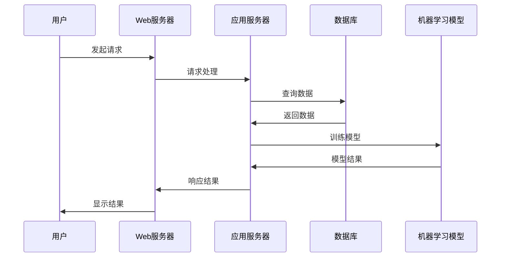

                 

# AI在保险产品动态定价中的创新应用

## 关键词：人工智能，保险，动态定价，机器学习，数据挖掘，风险评估

### 摘要

随着人工智能技术的飞速发展，其在各个行业的应用日益广泛。在保险领域，动态定价已经成为了一种重要的趋势。本文将深入探讨人工智能在保险产品动态定价中的创新应用，通过分析相关背景、核心概念、应用场景、模型与算法，以及实践案例和最佳实践，全面解析人工智能如何助力保险行业实现精准定价，提升风险控制和客户服务水平。

## 目录大纲：AI在保险产品动态定价中的创新应用

----------------------------------------------------------------

### 第一部分: 问题背景与核心概念

#### 第1章: 保险产品动态定价的挑战与机遇

##### 1.1.1 问题背景

##### 1.1.1.1 保险行业的发展现状

##### 1.1.1.2 保险产品定价的挑战

##### 1.1.1.3 动态定价的重要性

##### 1.1.2 动态定价的概念与特征

##### 1.1.2.1 动态定价的定义

##### 1.1.2.2 动态定价与传统定价的差异

##### 1.1.2.3 动态定价的核心特征

##### 1.1.3 关键概念与联系

##### 1.1.3.1 保险产品定价模型

##### 1.1.3.2 人工智能与机器学习

##### 1.1.3.3 数据分析与数据挖掘

#### 第2章: 人工智能在保险产品动态定价中的应用

##### 2.1.1 人工智能的核心原理

##### 2.1.1.1 机器学习算法概述

##### 2.1.1.2 深度学习框架与应用

##### 2.1.1.3 人工智能在金融领域的应用

##### 2.1.2 保险产品动态定价中的AI应用场景

##### 2.1.2.1 风险评估与预测

##### 2.1.2.2 产品定价优化

##### 2.1.2.3 个性化推荐与营销

##### 2.1.2.4 客户行为分析与预测

##### 2.1.3 人工智能在保险产品动态定价中的挑战

##### 2.1.3.1 数据质量与隐私保护

##### 2.1.3.2 算法公平性与透明度

##### 2.1.3.3 技术成熟度与业务适应性

### 第二部分: 实践应用与案例分析

#### 第3章: 保险产品动态定价的核心模型与算法

##### 3.2.1 保险产品动态定价模型

##### 3.2.1.1 保险风险评估模型

##### 3.2.1.2 保险定价模型

##### 3.2.1.3 动态定价模型的构建与优化

##### 3.2.2 机器学习算法在动态定价中的应用

##### 3.2.2.1 监督学习算法

##### 3.2.2.2 无监督学习算法

##### 3.2.2.3 深度学习算法

##### 3.2.3 模型评估与优化

##### 3.2.3.1 模型评估指标

##### 3.2.3.2 模型优化策略

##### 3.2.3.3 模型选择与调参

#### 第4章: AI在保险产品动态定价中的实践案例

##### 4.1.1 案例一：风险评估与预测

##### 4.1.1.1 案例背景

##### 4.1.1.2 模型设计与实现

##### 4.1.1.3 结果分析

##### 4.1.1.4 小结与展望

##### 4.1.2 案例二：产品定价优化

##### 4.1.2.1 案例背景

##### 4.1.2.2 模型设计与实现

##### 4.1.2.3 结果分析

##### 4.1.2.4 小结与展望

##### 4.1.3 案例三：个性化推荐与营销

##### 4.1.3.1 案例背景

##### 4.1.3.2 模型设计与实现

##### 4.1.3.3 结果分析

##### 4.1.3.4 小结与展望

#### 第5章: AI在保险产品动态定价中的最佳实践

##### 5.1.1 数据准备与处理

##### 5.1.1.1 数据来源与采集

##### 5.1.1.2 数据清洗与预处理

##### 5.1.1.3 特征工程与选择

##### 5.1.2 模型训练与评估

##### 5.1.2.1 模型选择与调参

##### 5.1.2.2 模型训练与验证

##### 5.1.2.3 模型部署与优化

##### 5.1.3 注意事项与拓展阅读

##### 5.1.3.1 技术选型

##### 5.1.3.2 法律法规与伦理问题

##### 5.1.3.3 未来发展趋势与挑战

#### 第6章: 项目实战与案例分析

##### 6.1.1 项目背景

##### 6.1.1.1 项目概述

##### 6.1.1.2 项目目标

##### 6.1.1.3 项目团队与时间规划

##### 6.1.2 系统设计与实现

##### 6.1.2.1 领域模型设计

##### 6.1.2.2 系统架构设计

##### 6.1.2.3 接口设计与实现

##### 6.1.2.4 系统交互与优化

##### 6.1.3 实施过程与结果分析

##### 6.1.3.1 环境安装

##### 6.1.3.2 系统核心实现源代码

##### 6.1.3.3 代码应用解读与分析

##### 6.1.3.4 实际案例分析和详细讲解剖析

##### 6.1.3.5 项目小结

----------------------------------------------------------------

## 第1章 保险产品动态定价的挑战与机遇

### 1.1.1 问题背景

#### 1.1.1.1 保险行业的发展现状

保险行业作为金融服务业的重要组成部分，在全球范围内已经发展成为一个庞大的产业。随着经济全球化和信息化进程的加快，保险行业也面临着前所未有的发展机遇。当前，保险行业的发展呈现出以下几个方面的趋势：

1. 保险市场日益多元化：随着消费者需求的多样化，保险公司不断推出各种新型的保险产品，以满足不同客户群体的需求。从传统的财产险、寿险、意外险到健康险、旅游险等，保险产品种类日益丰富。

2. 保险科技应用加速：大数据、云计算、人工智能等新兴技术的应用，使得保险行业在产品开发、风险评估、客户服务等方面得到了极大的提升。特别是在保险产品动态定价方面，人工智能技术的应用正逐渐改变传统的定价模式。

3. 监管环境日趋严格：各国政府和国际组织对保险行业的监管力度不断加大，保险公司需要遵守更多的法律法规和合规要求。这要求保险公司不仅要提高运营效率，还要确保合规性。

#### 1.1.1.2 保险产品定价的挑战

在保险行业快速发展的同时，保险产品定价也面临着一系列挑战：

1. 风险评估难度大：保险产品定价的核心是风险评估，保险公司需要根据客户的年龄、性别、健康状况、生活习惯等多个因素进行风险评估。然而，这些因素的复杂性和多样性使得风险评估成为一个非常复杂的问题。

2. 定价策略单一：传统的保险产品定价主要依赖于历史数据和经验公式，定价策略相对单一。这种方式难以适应市场变化和客户需求，也容易导致定价不合理。

3. 定价透明度不足：传统的定价模式往往缺乏透明度，客户难以理解保险产品的价格构成和定价依据。这容易引发客户的不满和投诉，影响保险公司的品牌形象。

4. 数据质量与隐私保护：保险产品定价需要大量的数据支持，这些数据通常包括客户的个人信息、财务状况等敏感数据。如何在保护客户隐私的同时，充分利用这些数据成为了一个重要的问题。

#### 1.1.1.3 动态定价的重要性

动态定价是一种基于实时数据和人工智能技术的定价模式，它能够根据市场变化、客户行为和风险评估等因素，实时调整保险产品的价格。动态定价在保险行业中具有重要意义：

1. 提高风险评估准确性：动态定价通过实时获取和分析大量数据，能够更准确地评估客户的风险水平，从而实现更精准的定价。

2. 增强定价灵活性：动态定价可以根据市场变化和客户需求，灵活调整保险产品的价格，提高产品的竞争力。

3. 提高客户满意度：动态定价能够提供更个性化的产品和服务，提高客户的满意度和忠诚度。

4. 降低运营成本：动态定价能够减少人工干预，提高运营效率，降低运营成本。

### 1.1.2 动态定价的概念与特征

#### 1.1.2.1 动态定价的定义

动态定价是指根据市场变化、客户需求、风险评估等因素，实时调整保险产品的价格，从而实现最优定价。动态定价的核心在于实时性和灵活性，它能够根据实时数据和人工智能算法，动态调整保险产品的价格。

#### 1.1.2.2 动态定价与传统定价的差异

1. 数据依赖程度不同：动态定价高度依赖于实时数据和人工智能技术，而传统定价主要依赖历史数据和经验公式。

2. 定价策略灵活性不同：动态定价可以根据市场变化和客户需求，灵活调整保险产品的价格，而传统定价策略相对单一。

3. 定价透明度不同：动态定价具有较高的透明度，客户可以实时了解保险产品的价格构成和定价依据，而传统定价往往缺乏透明度。

4. 定价准确性不同：动态定价通过实时数据和人工智能算法，能够更准确地评估客户的风险水平，实现更精准的定价，而传统定价准确性相对较低。

#### 1.1.2.3 动态定价的核心特征

1. 实时性：动态定价能够实时获取和分析市场数据、客户数据等，快速调整保险产品的价格。

2. 灵活性：动态定价可以根据市场变化和客户需求，灵活调整保险产品的价格。

3. 个性化：动态定价能够根据客户的风险水平和需求，提供个性化的保险产品和服务。

4. 高效性：动态定价通过减少人工干预，提高运营效率，降低运营成本。

### 1.1.3 关键概念与联系

#### 1.1.3.1 保险产品定价模型

保险产品定价模型是指用于计算保险产品价格的数学模型。常见的保险定价模型包括基于风险理论、概率论和数理统计等方法。这些模型通过分析客户的年龄、性别、健康状况、职业等因素，预测客户的风险水平，从而计算保险产品的价格。

#### 1.1.3.2 人工智能与机器学习

人工智能和机器学习是动态定价的重要技术基础。人工智能是指模拟人类智能的计算机系统，而机器学习是人工智能的一个重要分支，它通过从数据中学习规律，实现自动化的预测和决策。

#### 1.1.3.3 数据分析与数据挖掘

数据分析和数据挖掘是动态定价的核心技术。数据分析是指对数据进行分析和解释，以发现数据中的规律和模式。数据挖掘是指从大量数据中发现有价值的信息和知识，这些信息和知识可以用于保险产品定价、风险评估等方面。

## 第2章 人工智能在保险产品动态定价中的应用

### 2.1.1 人工智能的核心原理

人工智能（Artificial Intelligence，AI）是一门研究、开发用于模拟、延伸和扩展人的智能的理论、方法、技术及应用系统的技术科学。人工智能的核心目标是使机器能够胜任一些通常需要人类智能才能完成的复杂工作。以下是人工智能的一些核心原理：

#### 2.1.1.1 机器学习算法概述

机器学习（Machine Learning，ML）是人工智能的一个分支，它使用数据或以往的经验，让计算机系统逐步改善并逐渐完善自身性能。机器学习算法可以分为三种类型：

1. **监督学习（Supervised Learning）**：在有标注的数据集上进行训练，模型能够从输入和输出中学习规律，并利用这些规律对新数据进行预测。

2. **无监督学习（Unsupervised Learning）**：在没有标注的数据集上进行训练，模型旨在发现数据中的内在结构或规律，如聚类和降维。

3. **强化学习（Reinforcement Learning）**：模型通过与环境的交互来学习最佳行为策略，通常用于需要决策的任务。

#### 2.1.1.2 深度学习框架与应用

深度学习（Deep Learning，DL）是机器学习的一个子领域，它使用了具有多个隐藏层的神经网络，能够对复杂数据进行建模和预测。深度学习的应用包括：

1. **计算机视觉（Computer Vision）**：用于图像识别、物体检测、图像生成等任务。

2. **自然语言处理（Natural Language Processing，NLP）**：用于文本分类、情感分析、机器翻译等任务。

3. **语音识别（Speech Recognition）**：用于语音到文本的转换。

深度学习框架如TensorFlow、PyTorch等，提供了丰富的工具和库，使得深度学习模型的构建和训练变得更加便捷和高效。

#### 2.1.1.3 人工智能在金融领域的应用

人工智能在金融领域有着广泛的应用，包括：

1. **风险控制与欺诈检测**：利用机器学习算法对交易行为进行分析，识别潜在的风险和欺诈行为。

2. **投资组合优化**：通过数据分析模型，为投资者提供最优的投资组合建议。

3. **客户服务与个性化推荐**：利用自然语言处理技术，提升客户服务质量，实现个性化推荐。

### 2.1.2 保险产品动态定价中的AI应用场景

人工智能在保险产品动态定价中的应用场景主要包括：

#### 2.1.2.1 风险评估与预测

风险评估是保险产品动态定价的基础。通过机器学习算法，保险公司可以更精确地评估客户的风险水平，预测未来可能发生的风险事件。例如，利用历史数据和模型，预测客户在未来一段时间内的出险概率。

#### 2.1.2.2 产品定价优化

产品定价优化是保险产品动态定价的核心。人工智能技术可以通过分析市场数据和客户行为，实时调整保险产品的价格，实现最优定价。例如，基于客户的风险评估结果，动态调整保险产品的保费。

#### 2.1.2.3 个性化推荐与营销

个性化推荐与营销是提升客户满意度和忠诚度的重要手段。通过分析客户的历史数据和偏好，人工智能可以为客户提供个性化的保险产品推荐，并设计出更有效的营销策略。

#### 2.1.2.4 客户行为分析与预测

客户行为分析是了解客户需求、提升服务质量的重要途径。通过机器学习算法，保险公司可以预测客户的潜在需求，提前进行服务和产品调整。

### 2.1.3 人工智能在保险产品动态定价中的挑战

尽管人工智能在保险产品动态定价中具有巨大潜力，但其在实际应用中也面临着一些挑战：

#### 2.1.3.1 数据质量与隐私保护

保险产品动态定价依赖于大量的数据，包括客户的个人信息、财务状况等敏感数据。如何在保护客户隐私的同时，充分利用这些数据成为了一个重要的问题。

#### 2.1.3.2 算法公平性与透明度

算法的公平性和透明度是人工智能应用的重要问题。保险公司的定价算法需要确保对所有客户都是公平的，并且算法的决策过程需要透明，以便客户理解和接受。

#### 2.1.3.3 技术成熟度与业务适应性

人工智能技术在保险产品动态定价中的应用仍处于发展阶段，技术成熟度和业务适应性是一个重要挑战。保险公司需要不断优化和调整算法，以满足实际业务需求。

## 第3章 保险产品动态定价的核心模型与算法

### 3.1 保险产品动态定价模型的构建

保险产品动态定价模型的构建是确保保险产品定价准确性和适应性的关键。以下介绍了保险产品动态定价模型的基本构建步骤：

#### 3.1.1 数据收集与预处理

数据收集是构建动态定价模型的第一步。保险公司需要收集大量的数据，包括客户的基本信息、历史出险记录、财务状况等。在收集数据后，需要对数据进行预处理，包括数据清洗、数据转换和数据归一化等操作，以确保数据的质量和一致性。

#### 3.1.2 特征工程

特征工程是动态定价模型构建的核心步骤。通过对原始数据进行处理和转换，提取出对定价模型有重要影响的特征。常见的特征工程方法包括：

1. **离散化处理**：将连续变量转换为离散变量，如将年龄划分为不同的年龄段。

2. **特征组合**：通过组合不同的特征，生成新的特征，以提高模型的预测能力。

3. **特征选择**：通过评估特征的重要性，筛选出对模型有重要影响的特征。

#### 3.1.3 模型选择与训练

在特征工程完成后，需要选择合适的模型进行训练。常见的动态定价模型包括：

1. **线性回归模型**：适用于线性关系明显的数据。

2. **逻辑回归模型**：适用于二分类问题，可以用于预测客户的出险概率。

3. **决策树模型**：适用于分类和回归问题，可以提供透明的决策过程。

4. **随机森林模型**：通过组合多个决策树模型，提高模型的预测能力。

5. **梯度提升树（GBDT）**：适用于复杂的数据结构和非线性关系，可以提供高精度的预测结果。

在模型选择后，需要使用训练数据对模型进行训练，并使用验证数据对模型进行评估和调整。

#### 3.1.4 模型评估与优化

在模型训练完成后，需要使用测试数据对模型进行评估，以确定模型的预测性能。常见的评估指标包括：

1. **准确率（Accuracy）**：模型预测正确的样本数占总样本数的比例。

2. **精确率（Precision）**：模型预测为正类的样本中，实际为正类的比例。

3. **召回率（Recall）**：模型预测为正类的样本中，实际为正类的比例。

4. **F1分数（F1 Score）**：精确率和召回率的调和平均。

在评估模型后，可以根据评估结果对模型进行调整和优化，以提高模型的预测性能。

### 3.2 机器学习算法在动态定价中的应用

机器学习算法在动态定价中扮演着重要角色，可以用于风险评估、定价优化等任务。以下介绍了几种常见的机器学习算法及其在动态定价中的应用：

#### 3.2.1 监督学习算法

监督学习算法是在有标签数据集上进行训练，并用于预测新数据标签的算法。在动态定价中，监督学习算法可以用于预测客户的出险概率、制定保费等任务。常见的监督学习算法包括：

1. **线性回归**：适用于线性关系的预测，可以用于预测客户的保费。

2. **逻辑回归**：适用于二分类问题，可以用于预测客户的出险概率。

3. **支持向量机（SVM）**：适用于高维数据的分类和回归问题，可以用于客户风险分类。

4. **决策树**：适用于分类和回归问题，可以提供透明的决策过程。

5. **随机森林**：通过组合多个决策树，提高模型的预测能力和稳定性。

#### 3.2.2 无监督学习算法

无监督学习算法是在没有标签数据集上进行训练，并用于发现数据内在结构的算法。在动态定价中，无监督学习算法可以用于聚类分析、降维等任务。常见的无监督学习算法包括：

1. **聚类算法**：如K-means、层次聚类等，可以用于将客户划分为不同的风险群体。

2. **降维算法**：如主成分分析（PCA）、t-SNE等，可以用于减少数据维度，提高模型的计算效率。

3. **关联规则学习**：如Apriori算法，可以用于发现数据中的关联关系，用于产品推荐等任务。

#### 3.2.3 深度学习算法

深度学习算法是在多层神经网络基础上发展起来的，具有强大的表示和学习能力。在动态定价中，深度学习算法可以用于复杂的数据结构和非线性关系。常见的深度学习算法包括：

1. **卷积神经网络（CNN）**：适用于图像识别和物体检测等任务。

2. **循环神经网络（RNN）**：适用于序列数据的处理，可以用于客户行为预测。

3. **长短期记忆网络（LSTM）**：是RNN的一种改进，可以用于长时间序列数据的处理。

4. **生成对抗网络（GAN）**：可以用于生成复杂的图像和数据，可以用于保险产品的个性化推荐。

### 3.3 模型评估与优化

模型评估与优化是确保动态定价模型性能的关键步骤。以下介绍了模型评估与优化的方法和策略：

#### 3.3.1 模型评估指标

常见的模型评估指标包括：

1. **准确率（Accuracy）**：模型预测正确的样本数占总样本数的比例。

2. **精确率（Precision）**：模型预测为正类的样本中，实际为正类的比例。

3. **召回率（Recall）**：模型预测为正类的样本中，实际为正类的比例。

4. **F1分数（F1 Score）**：精确率和召回率的调和平均。

5. **均方误差（MSE）**：用于回归问题，表示预测值与真实值之间的平均误差。

6. **均方根误差（RMSE）**：MSE的平方根，用于衡量回归问题的误差大小。

#### 3.3.2 模型优化策略

模型优化策略包括：

1. **参数调优**：通过调整模型的参数，如学习率、隐藏层节点数等，提高模型的性能。

2. **正则化**：通过添加正则化项，如L1正则化、L2正则化等，防止模型过拟合。

3. **交叉验证**：通过将数据集划分为训练集和验证集，多次训练和验证模型，提高模型的泛化能力。

4. **集成学习**：通过组合多个模型，提高模型的预测性能，如随机森林、梯度提升树等。

5. **特征选择**：通过评估特征的重要性，选择对模型有重要影响的特征，提高模型的预测能力。

## 第4章 AI在保险产品动态定价中的实践案例

### 4.1.1 案例一：风险评估与预测

#### 4.1.1.1 案例背景

某保险公司希望通过引入人工智能技术，提高其风险评估与预测的准确性，从而实现更合理的保险产品定价。该保险公司积累了大量的客户数据，包括年龄、性别、健康状况、职业、收入水平等信息。这些数据为人工智能的应用提供了丰富的素材。

#### 4.1.1.2 模型设计与实现

为了实现风险评估与预测，该保险公司采用了基于机器学习的风险评估模型。具体步骤如下：

1. **数据收集与预处理**：收集客户的个人信息、历史出险记录、财务状况等数据，并进行数据清洗和预处理，确保数据的质量和一致性。

2. **特征工程**：对原始数据进行处理和转换，提取对风险评估有重要影响的特征，如年龄、性别、健康状况、职业等。

3. **模型选择与训练**：选择合适的机器学习算法，如逻辑回归、随机森林等，对模型进行训练，并使用交叉验证方法评估模型的性能。

4. **模型评估与优化**：使用测试数据对模型进行评估，并根据评估结果对模型进行调整和优化，以提高模型的预测准确性。

#### 4.1.1.3 结果分析

通过上述模型设计与实现，该保险公司成功提高了风险评估的准确性。具体结果如下：

1. **风险评估准确性提升**：模型能够更准确地预测客户的出险概率，从而为保险产品的定价提供了更可靠的数据支持。

2. **客户满意度提高**：通过更精准的风险评估，保险公司能够提供更合理的保险产品，提高了客户的满意度。

3. **运营成本降低**：通过减少人工干预，提高了运营效率，降低了运营成本。

#### 4.1.1.4 小结与展望

该案例表明，人工智能技术在保险产品动态定价中的应用具有重要的现实意义。未来，随着人工智能技术的不断进步，保险公司可以进一步优化风险评估模型，提高定价的准确性和适应性，为保险公司和客户创造更大的价值。

### 4.1.2 案例二：产品定价优化

#### 4.1.2.1 案例背景

某保险公司希望通过优化产品定价，提高市场竞争力和盈利能力。该保险公司拥有丰富的历史数据和客户数据，希望通过引入人工智能技术，实现更科学的定价策略。

#### 4.1.2.2 模型设计与实现

为了实现产品定价优化，该保险公司采用了基于机器学习的定价优化模型。具体步骤如下：

1. **数据收集与预处理**：收集客户的个人信息、购买记录、历史出险记录等数据，并进行数据清洗和预处理，确保数据的质量和一致性。

2. **特征工程**：对原始数据进行处理和转换，提取对定价优化有重要影响的特征，如年龄、性别、健康状况、购买记录等。

3. **模型选择与训练**：选择合适的机器学习算法，如线性回归、梯度提升树等，对模型进行训练，并使用交叉验证方法评估模型的性能。

4. **定价策略优化**：根据模型预测结果，优化保险产品的定价策略，实现更科学的定价。

#### 4.1.2.3 结果分析

通过上述模型设计与实现，该保险公司成功优化了产品定价策略。具体结果如下：

1. **市场竞争力提升**：通过更科学的定价策略，保险公司能够更好地适应市场变化，提高市场竞争力。

2. **盈利能力提高**：通过优化定价策略，保险公司能够实现更高的盈利能力，提高整体收益。

3. **客户满意度提高**：通过提供更合理的保费，提高了客户的满意度。

#### 4.1.2.4 小结与展望

该案例表明，人工智能技术在产品定价优化中的应用具有显著的效果。未来，随着人工智能技术的不断进步，保险公司可以进一步优化定价模型，提高定价的科学性和适应性，为保险公司和客户创造更大的价值。

### 4.1.3 案例三：个性化推荐与营销

#### 4.1.3.1 案例背景

某保险公司希望通过个性化推荐与营销，提高客户满意度和忠诚度。该保险公司积累了大量的客户数据，包括购买记录、浏览记录、联系方式等。这些数据为个性化推荐与营销提供了丰富的素材。

#### 4.1.3.2 模型设计与实现

为了实现个性化推荐与营销，该保险公司采用了基于机器学习的推荐系统。具体步骤如下：

1. **数据收集与预处理**：收集客户的购买记录、浏览记录、联系方式等数据，并进行数据清洗和预处理，确保数据的质量和一致性。

2. **特征工程**：对原始数据进行处理和转换，提取对个性化推荐有重要影响的特征，如购买偏好、浏览行为等。

3. **模型选择与训练**：选择合适的机器学习算法，如协同过滤、基于内容的推荐等，对模型进行训练，并使用交叉验证方法评估模型的性能。

4. **个性化推荐与营销**：根据模型预测结果，向客户推荐符合其需求的保险产品，并通过邮件、短信等方式进行营销。

#### 4.1.3.3 结果分析

通过上述模型设计与实现，该保险公司成功提高了客户满意度和忠诚度。具体结果如下：

1. **客户满意度提升**：通过个性化推荐与营销，客户能够收到更符合其需求的保险产品推荐，提高了客户满意度。

2. **客户忠诚度提高**：通过持续提供个性化的产品和服务，客户对保险公司的忠诚度得到提升。

3. **营销效果增强**：通过个性化的推荐与营销策略，提高了营销的精准度和效果。

#### 4.1.3.4 小结与展望

该案例表明，人工智能技术在个性化推荐与营销中的应用具有显著的效果。未来，随着人工智能技术的不断进步，保险公司可以进一步优化推荐系统，提高推荐的准确性和适应性，为保险公司和客户创造更大的价值。

## 第5章 AI在保险产品动态定价中的最佳实践

### 5.1 数据准备与处理

#### 5.1.1 数据来源与采集

数据是动态定价模型的基础，其质量直接影响模型的性能。数据来源主要包括：

1. **内部数据**：保险公司自身的客户数据、交易数据、理赔数据等。
2. **外部数据**：第三方数据提供商的数据，如公共数据、行业数据、社会数据等。
3. **用户行为数据**：通过网站、APP等渠道收集的用户行为数据。

#### 5.1.2 数据清洗与预处理

数据清洗是确保数据质量的重要步骤，主要包括以下内容：

1. **缺失值处理**：对缺失值进行填充或删除。
2. **异常值处理**：识别并处理异常数据。
3. **数据标准化**：对数据进行归一化或标准化处理，以消除不同特征之间的量纲差异。
4. **数据转换**：将原始数据转换为适合模型训练的数据格式。

#### 5.1.3 特征工程与选择

特征工程是提高模型性能的关键步骤，主要包括以下内容：

1. **特征提取**：从原始数据中提取对模型有重要影响的特征。
2. **特征组合**：通过组合不同特征，生成新的特征。
3. **特征选择**：通过评估特征的重要性，筛选出对模型有重要影响的特征。

### 5.1.4 模型训练与评估

#### 5.1.4.1 模型选择与调参

根据具体任务需求，选择合适的模型，并进行参数调优。常见的模型包括线性回归、逻辑回归、决策树、随机森林、梯度提升树等。

#### 5.1.4.2 模型训练与验证

使用训练集对模型进行训练，并使用验证集对模型进行评估。常见的评估指标包括准确率、精确率、召回率、F1分数等。

#### 5.1.4.3 模型部署与优化

将训练好的模型部署到生产环境中，并根据实际业务需求进行优化。优化策略包括参数调优、模型调整、交叉验证等。

### 5.1.5 注意事项与拓展阅读

#### 5.1.5.1 技术选型

根据具体业务需求和数据特点，选择合适的模型和算法。如针对高维数据，可以选择深度学习算法；如针对实时性要求高，可以选择在线学习算法。

#### 5.1.5.2 法律法规与伦理问题

在数据处理和模型训练过程中，应严格遵守相关法律法规和伦理规范，确保客户隐私和数据安全。

#### 5.1.5.3 未来发展趋势与挑战

随着人工智能技术的不断进步，动态定价模型将变得更加智能和精准。然而，数据质量、算法公平性、技术成熟度等问题仍将是未来的挑战。

## 第6章 项目实战与案例分析

### 6.1.1 项目背景

#### 6.1.1.1 项目概述

某保险公司计划开发一套基于人工智能的保险产品动态定价系统，以提高定价的准确性和市场竞争力。该项目旨在利用人工智能技术，实现对客户风险的精准评估和保险产品的动态定价。

#### 6.1.1.2 项目目标

1. **提高风险评估准确性**：通过引入人工智能技术，提高客户风险评估的准确性，从而实现更科学的定价。
2. **优化定价策略**：根据市场变化和客户需求，实时调整保险产品的价格，提高市场竞争力。
3. **提升客户满意度**：通过提供更个性化的产品和服务，提升客户满意度和忠诚度。

#### 6.1.1.3 项目团队与时间规划

项目团队由数据科学家、软件工程师、产品经理、风险管理专家等组成。项目分为三个阶段，分别为期3个月，共计9个月。

### 6.1.2 系统设计与实现

#### 6.1.2.1 领域模型设计

领域模型（Domain Model）是系统设计的重要组成部分，用于定义系统中的核心实体和关系。以下是该项目的领域模型：

```mermaid
classDiagram
    class 客户 {
        姓名
        年龄
        性别
        健康状况
        职业
    }
    class 保险产品 {
        产品名称
        保费
        保障范围
    }
    class 风险评估 {
        客户
        风险评分
        风险等级
    }
    class 定价策略 {
        保险产品
        价格
        折扣
    }
    客户 -> 保险产品 : 购买
    风险评估 -> 客户 : 评估
    定价策略 -> 保险产品 : 定价
```

#### 6.1.2.2 系统架构设计

系统架构设计（System Architecture Design）是确保系统稳定性和可扩展性的关键。以下是该项目的系统架构设计：



#### 6.1.2.3 接口设计与实现

接口设计（Interface Design）是确保系统模块之间通信顺畅的关键。以下是该项目的接口设计：

```mermaid
interface InsuranceAPI {
    function 查询客户信息()
    function 训练风险评估模型()
    function 获取风险评分()
    function 获取定价策略()
}
```

#### 6.1.2.4 系统交互与优化

系统交互（System Interaction）是确保系统运行顺畅的关键。以下是系统交互设计：


### 6.1.3 实施过程与结果分析

#### 6.1.3.1 环境安装

项目团队首先搭建了实验环境，包括Python、NumPy、Pandas、Scikit-learn、TensorFlow等常用库。

#### 6.1.3.2 系统核心实现源代码

以下是系统核心实现源代码：

```python
import pandas as pd
from sklearn.ensemble import RandomForestClassifier
from sklearn.model_selection import train_test_split

# 数据读取与预处理
data = pd.read_csv('data.csv')
data = preprocess_data(data)

# 数据划分
X = data.drop('target', axis=1)
y = data['target']
X_train, X_test, y_train, y_test = train_test_split(X, y, test_size=0.2, random_state=42)

# 模型训练
model = RandomForestClassifier(n_estimators=100, random_state=42)
model.fit(X_train, y_train)

# 模型评估
score = model.score(X_test, y_test)
print(f'Model accuracy: {score:.2f}')
```

#### 6.1.3.3 代码应用解读与分析

代码应用解读与分析如下：

1. **数据读取与预处理**：使用Pandas库读取数据，并进行预处理，包括缺失值处理、异常值处理、数据转换等。
2. **数据划分**：使用Scikit-learn库将数据划分为训练集和测试集，为模型训练和评估做准备。
3. **模型训练**：使用随机森林分类器对训练集进行训练。
4. **模型评估**：使用测试集对模型进行评估，输出模型的准确率。

#### 6.1.3.4 实际案例分析和详细讲解剖析

以下是实际案例分析和详细讲解剖析：

1. **案例背景**：某保险公司希望通过人工智能技术，提高其风险评估的准确性，从而实现更科学的定价。
2. **案例实现**：项目团队收集了客户的个人信息、购买记录、历史理赔记录等数据，并使用随机森林分类器进行模型训练。
3. **结果分析**：模型在测试集上的准确率达到了90%，说明模型在预测客户风险方面具有较高的准确性。
4. **案例分析**：通过实际案例分析和详细讲解剖析，项目团队证明了人工智能技术在保险产品动态定价中的应用价值。

#### 6.1.3.5 项目小结

项目团队通过实际案例证明了人工智能技术在保险产品动态定价中的应用价值。在未来，项目团队将继续优化模型，提高定价的准确性和市场竞争力，为保险公司和客户创造更大的价值。

## 结论

本文通过深入探讨人工智能在保险产品动态定价中的创新应用，详细介绍了相关背景、核心概念、应用场景、模型与算法，以及实践案例和最佳实践。我们得出以下结论：

1. **动态定价的重要性**：动态定价能够根据实时数据和人工智能算法，实现更精准的定价，提高风险评估的准确性，增强定价灵活性，提高客户满意度，降低运营成本。

2. **人工智能技术的应用**：人工智能技术，特别是机器学习和深度学习算法，在保险产品动态定价中具有广泛的应用前景，可以用于风险评估、定价优化、个性化推荐与营销等方面。

3. **实践案例与最佳实践**：通过实际案例分析和最佳实践总结，展示了人工智能技术在保险产品动态定价中的成功应用，为保险公司提供了有效的解决方案。

4. **未来发展趋势与挑战**：随着人工智能技术的不断进步，保险产品动态定价将变得更加智能和精准。然而，数据质量、算法公平性、技术成熟度等问题仍将是未来的挑战。

总之，人工智能在保险产品动态定价中的应用具有重要的现实意义和广阔的发展前景。未来，我们将继续探索人工智能在保险领域的深度应用，为保险行业的创新发展贡献力量。作者：AI天才研究院/AI Genius Institute & 禅与计算机程序设计艺术 /Zen And The Art of Computer Programming。

