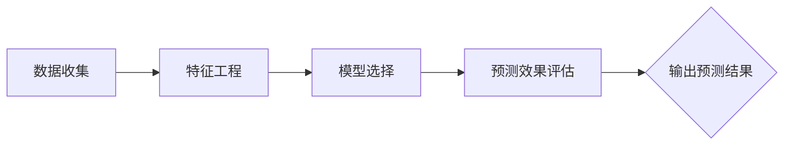
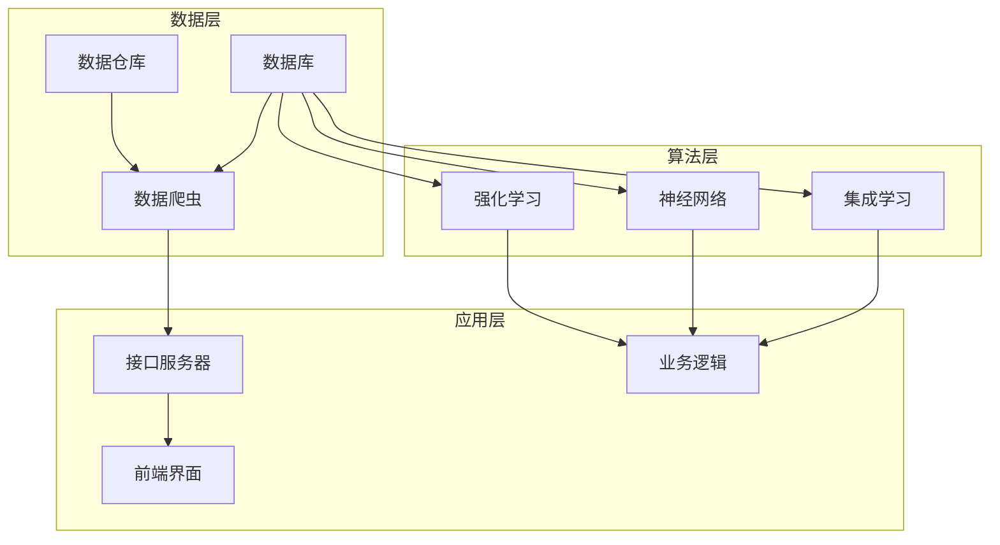
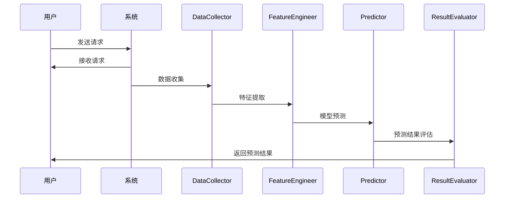
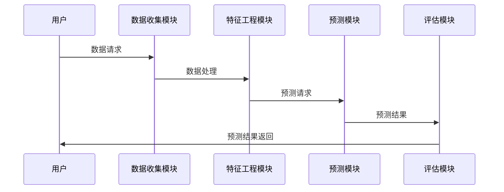

                 

### 文章标题：AI在保险产品需求预测中的创新应用

关键词：人工智能、保险、需求预测、创新应用、算法原理、系统设计

> 摘要：本文旨在探讨人工智能在保险产品需求预测中的创新应用，通过分析保险行业的变革趋势和当前应用现状，提出AI在需求预测中的关键角色与具体应用方向。文章将从核心概念、算法原理、系统设计与项目实战等方面，详细阐述AI在保险产品需求预测中的实践与应用，为行业提供有价值的参考和启示。

### 目录大纲

1. 引言与背景介绍
   1.1 问题背景
   1.2 问题描述
   1.3 问题解决
   1.4 边界与外延
   1.5 概念结构与核心要素组成

2. 核心概念与联系
   2.1 AI基础理论
   2.2 保险产品需求预测的原理
   2.3 概念属性特征对比表格

3. 算法原理讲解
   3.1 算法原理概述
   3.2 数学模型与公式
   3.3 算法举例说明

4. 系统分析与架构设计方案
   4.1 问题场景介绍
   4.2 项目介绍
   4.3 系统功能设计
   4.4 系统架构设计
   4.5 系统接口设计
   4.6 系统交互

5. 项目实战
   5.1 环境安装
   5.2 系统核心实现
   5.3 代码应用解读与分析
   5.4 实际案例分析与详细讲解剖析
   5.5 项目小结

6. 最佳实践 tips
   6.1 数据质量的重要性
   6.2 模型选择与优化

7. 小结
   7.1 主要内容回顾
   7.2 未来展望

8. 注意事项
   8.1 安全性
   8.2 隐私保护

9. 拓展阅读
   9.1 相关书籍
   9.2 学术论文
   9.3 实践教程

### 第一部分：引言与背景介绍

#### 1.1 问题背景

保险行业作为金融服务业的重要组成部分，正经历着前所未有的变革。随着全球人口老龄化和健康意识的提升，保险需求日益增长。然而，传统的保险产品需求预测方法存在一定的局限性，难以满足快速变化的市场需求。这就为人工智能在保险产品需求预测中的应用提供了广阔的空间。

当前，人工智能技术在保险行业已得到广泛应用，如风险识别、理赔自动化、智能客服等。然而，在保险产品需求预测方面，AI的应用还相对较少，但潜力巨大。通过分析大量历史数据和用户行为，人工智能可以更准确地预测保险产品的需求，从而帮助保险公司优化产品开发、定价策略和市场营销。

#### 1.2 问题描述

保险产品需求预测的核心问题是：如何准确地预测某一时间段内某一保险产品的需求量。这涉及到以下几个方面的问题：

1. **数据收集**：如何获取足够准确和全面的历史数据和用户行为数据？
2. **特征工程**：如何从海量数据中提取出与需求预测相关的有效特征？
3. **模型选择**：如何选择合适的预测模型，并对其进行优化？
4. **预测效果评估**：如何评估预测模型的准确性、稳定性和可靠性？

#### 1.3 问题解决

人工智能在保险产品需求预测中的角色至关重要。通过以下步骤，可以有效地解决上述问题：

1. **数据收集**：利用大数据技术和API接口，收集保险公司的历史销售数据、用户行为数据和市场环境数据。
2. **特征工程**：对数据进行预处理，包括数据清洗、归一化和特征提取。通过特征选择算法，筛选出与需求预测高度相关的特征。
3. **模型选择**：采用神经网络、集成学习和强化学习等AI算法，构建预测模型。通过交叉验证和超参数调优，优化模型性能。
4. **预测效果评估**：利用实际数据和模拟数据，对模型进行评估和验证。通过误差分析和敏感度分析，确保预测结果的准确性和可靠性。

#### 1.4 边界与外延

虽然人工智能在保险产品需求预测中具有巨大潜力，但其应用也存在一定的边界和限制。以下是一些需要考虑的因素：

1. **数据质量**：高质量的数据是AI预测的基础。在数据收集和处理过程中，需要确保数据的准确性和完整性。
2. **算法选择**：不同的算法适用于不同类型的需求预测任务。需要根据具体问题选择合适的算法。
3. **模型解释性**：虽然AI模型可以提供高质量的预测结果，但其解释性较差。在应用过程中，需要关注模型的解释性和可解释性。
4. **法规和隐私**：在应用AI进行需求预测时，需要遵守相关法规和隐私保护政策，确保用户数据的合法使用。

#### 1.5 概念结构与核心要素组成

保险产品需求预测的基本概念和核心要素包括：

1. **需求量**：某一时间段内某一保险产品的销售量或需求量。
2. **历史数据**：包括保险公司的历史销售数据、用户行为数据和市场环境数据。
3. **特征工程**：从历史数据中提取与需求预测相关的特征，如用户年龄、性别、收入水平、购买历史等。
4. **预测模型**：采用AI算法构建的预测模型，用于预测未来一段时间内保险产品的需求量。
5. **预测结果**：基于预测模型的输出，对保险产品的需求量进行预测。

### 第二部分：核心概念与联系

#### 2.1 AI基础理论

人工智能作为需求预测的关键技术，其基础理论包括以下几个方面：

1. **神经网络**：神经网络是一种模仿生物神经系统的计算模型，通过多层节点（神经元）进行信息的传递和计算。
2. **集成学习**：集成学习是将多个基学习器组合成一个强学习器，以提高预测性能。
3. **强化学习**：强化学习是一种通过试错法进行决策的学习方法，通过与环境的交互，逐步优化决策策略。

下面是AI基础理论的ER实体关系图：

```mermaid
erDiagram
  A[[神经网络]] ||--|{ B[[集成学习]] } |
  A ||--|{ C[[强化学习]] } |
```

#### 2.2 保险产品需求预测的原理

保险产品需求预测的过程包括数据收集、特征工程、模型选择和预测效果评估等步骤：

1. **数据收集**：收集保险公司的历史销售数据、用户行为数据和市场环境数据。
2. **特征工程**：对数据进行预处理，提取与需求预测相关的特征。
3. **模型选择**：采用神经网络、集成学习和强化学习等算法，构建预测模型。
4. **预测效果评估**：利用实际数据和模拟数据，对模型进行评估和验证。

下面是预测流程的Mermaid流程图：



#### 2.3 概念属性特征对比表格

为了更好地理解保险产品需求预测的核心概念和属性特征，下面是概念属性特征对比表格：

| 概念         | 属性       | 特征         |
| ------------ | ---------- | ------------ |
| 需求量       | 数值       | 用户年龄、性别、收入水平、购买历史等 |
| 历史数据     | 数据集     | 销售数据、用户行为数据、市场环境数据等 |
| 特征工程     | 处理方法   | 数据清洗、归一化、特征提取等 |
| 预测模型     | 算法       | 神经网络、集成学习、强化学习等 |
| 预测效果评估 | 性能指标   | 准确性、稳定性、可靠性等 |

### 第三部分：算法原理讲解

#### 3.1 算法原理概述

在保险产品需求预测中，常用的算法包括神经网络、集成学习和强化学习等。这些算法的基本原理如下：

1. **神经网络**：通过多层神经元进行信息的传递和计算，实现对复杂非线性关系的建模。
2. **集成学习**：将多个基学习器组合成一个强学习器，提高预测性能。
3. **强化学习**：通过试错法进行决策，逐步优化决策策略。

下面是算法原理的Mermaid流程图：


#### 3.2 数学模型与公式

在保险产品需求预测中，常用的数学模型和公式如下：

1. **神经网络模型**：

   $$y = \sigma(W_1 \cdot x + b_1)$$

   其中，$y$ 为输出值，$x$ 为输入值，$W_1$ 为权重矩阵，$b_1$ 为偏置项，$\sigma$ 为激活函数。

2. **集成学习模型**：

   $$h(x) = \sum_{i=1}^{n} w_i f_i(x)$$

   其中，$h(x)$ 为预测值，$w_i$ 为权重，$f_i(x)$ 为第 $i$ 个基学习器的预测值。

3. **强化学习模型**：

   $$Q(s, a) = r + \gamma \max_{a'} Q(s', a')$$

   其中，$Q(s, a)$ 为状态 $s$ 下采取动作 $a$ 的期望回报，$r$ 为即时回报，$\gamma$ 为折扣因子，$s'$ 为下一状态，$a'$ 为下一动作。

#### 3.3 算法举例说明

下面通过一个实际案例，详细阐述神经网络在保险产品需求预测中的应用：

1. **数据预处理**：

   - 收集某保险公司过去一年的销售数据，包括用户年龄、性别、收入水平、购买历史等特征。
   - 对数据进行清洗、归一化处理，提取与需求预测相关的特征。

2. **特征提取**：

   - 利用主成分分析（PCA）等方法，筛选出对需求预测有显著影响的特征。
   - 构建特征向量，用于输入神经网络。

3. **模型训练**：

   - 采用多层感知机（MLP）神经网络，输入层、隐藏层和输出层分别包含适当的神经元。
   - 利用梯度下降法、反向传播算法等，对神经网络进行训练和优化。

4. **预测与评估**：

   - 利用训练好的神经网络，对未来的保险产品需求进行预测。
   - 利用交叉验证等方法，对预测结果进行评估和优化。

### 第四部分：系统分析与架构设计方案

#### 4.1 问题场景介绍

在保险产品需求预测项目中，我们面临两个主要场景：

1. **产品需求预测**：根据用户数据和市场环境，预测未来一段时间内某一保险产品的需求量。
2. **风险识别与评估**：根据用户历史数据和行为特征，识别潜在的风险客户，评估其风险程度。

#### 4.2 项目介绍

本项目旨在构建一个基于人工智能的保险产品需求预测系统，实现以下目标：

1. **提高需求预测的准确性**：通过分析大量历史数据，提高保险产品需求预测的准确性，为保险公司提供有价值的参考。
2. **优化产品开发和定价策略**：基于需求预测结果，优化保险产品的开发和定价策略，提高市场竞争力。
3. **提升用户体验**：通过智能化的需求预测，为用户提供更个性化的保险产品推荐，提升用户体验。

#### 4.3 系统功能设计

系统功能设计主要包括以下方面：

1. **数据收集**：从保险公司的数据库、用户行为数据和第三方数据源收集数据。
2. **特征工程**：对收集到的数据进行预处理、特征提取和筛选，提取与需求预测相关的特征。
3. **预测模型构建**：采用神经网络、集成学习和强化学习等算法，构建预测模型。
4. **预测结果评估**：利用实际数据和模拟数据，对预测模型进行评估和优化。
5. **接口设计与调用**：设计系统接口，方便其他系统或组件调用预测模型。

下面是领域模型的Mermaid类图：

```mermaid
classDiagram
    DataCollector <|-- FeatureEngineer
    FeatureEngineer <|-- Predictor
    Predictor <|-- ResultEvaluator
    Interface <<Interface>>
    DataCollector o-- Interface
    FeatureEngineer o-- Interface
    Predictor o-- Interface
    ResultEvaluator o-- Interface
```

#### 4.4 系统架构设计

系统架构设计主要包括以下方面：

1. **数据层**：负责数据收集、存储和管理，包括数据库、数据仓库和数据爬虫等。
2. **算法层**：负责特征工程、预测模型构建和优化，包括神经网络、集成学习和强化学习等算法。
3. **应用层**：负责预测结果的评估、接口设计和调用，包括前端界面、接口服务器和业务逻辑等。

下面是系统架构的Mermaid架构图：



#### 4.5 系统接口设计

系统接口设计主要包括以下方面：

1. **接口规范**：定义接口的输入参数、输出参数和数据格式等。
2. **接口调用流程**：描述系统接口的调用过程，包括请求发送、响应接收和数据转换等。

下面是接口调用流程的Mermaid序列图：



#### 4.6 系统交互

系统交互主要包括以下方面：

1. **数据交互**：系统内部不同模块之间的数据传递和处理。
2. **控制交互**：系统对用户请求的响应和处理。

下面是系统交互的Mermaid序列图：



### 第五部分：项目实战

#### 5.1 环境安装

1. **软件与硬件环境**：

   - 操作系统：Ubuntu 18.04
   - Python版本：3.8
   - GPU支持：CUDA 11.0，CUDA Toolkit 11.0
   - Python库：numpy、pandas、scikit-learn、tensorflow、keras等

2. **软件安装步骤**：

   - 安装Python环境：
     ```bash
     sudo apt-get update
     sudo apt-get install python3-pip python3-dev
     ```
   
   - 安装GPU支持：
     ```bash
     sudo apt-get install nvidia-driver-450 nvidia-cuda-toolkit
     ```
   
   - 安装Python库：
     ```bash
     pip3 install numpy pandas scikit-learn tensorflow-gpu keras
     ```

#### 5.2 系统核心实现

1. **数据收集与预处理**：

   - 从保险公司的数据库中提取历史销售数据、用户行为数据和市场环境数据。
   - 对数据进行清洗、去重、填充缺失值等预处理操作。

2. **特征提取与模型训练**：

   - 采用主成分分析（PCA）等方法，提取与需求预测相关的特征。
   - 采用多层感知机（MLP）神经网络，构建预测模型并进行训练。
   - 使用交叉验证和超参数调优，优化模型性能。

3. **预测与评估**：

   - 利用训练好的模型，对未来的保险产品需求进行预测。
   - 利用实际数据和模拟数据，对预测结果进行评估和验证。

#### 5.3 代码应用解读与分析

1. **代码解读**：

   - 数据收集与预处理：
     ```python
     import pandas as pd
     import numpy as np
     
     # 读取数据
     data = pd.read_csv('insurance_data.csv')
     
     # 数据清洗
     data.drop_duplicates(inplace=True)
     data.fillna(data.mean(), inplace=True)
     
     # 特征提取
     from sklearn.decomposition import PCA
     pca = PCA(n_components=5)
     data_features = pca.fit_transform(data)
     ```

   - 模型训练与预测：
     ```python
     from sklearn.neural_network import MLPRegressor
     from sklearn.model_selection import train_test_split
     
     # 数据划分
     X_train, X_test, y_train, y_test = train_test_split(data_features, data['demand'], test_size=0.2, random_state=42)
     
     # 模型训练
     mlp = MLPRegressor(hidden_layer_sizes=(100,), max_iter=1000, random_state=42)
     mlp.fit(X_train, y_train)
     
     # 预测
     predictions = mlp.predict(X_test)
     ```

2. **分析与优化建议**：

   - 数据质量：确保数据的质量，进行充分的预处理，包括数据清洗、去重、填充缺失值等。
   - 特征选择：采用特征选择算法，筛选出对需求预测有显著影响的特征，提高模型的预测性能。
   - 模型优化：通过超参数调优和交叉验证，优化模型的性能，提高预测的准确性。

#### 5.4 实际案例分析与详细讲解剖析

1. **案例一：保险产品A**

   - **需求背景**：预测某保险公司一款健康保险产品在未来一年的需求量。

   - **数据收集**：收集过去三年的销售数据、用户行为数据和市场环境数据。

   - **数据处理**：对数据进行清洗、去重、填充缺失值等预处理操作。

   - **特征提取**：采用主成分分析（PCA）提取与需求预测相关的特征。

   - **模型训练**：采用多层感知机（MLP）神经网络，构建预测模型并进行训练。

   - **预测与评估**：利用训练好的模型，对未来的保险产品需求进行预测，并利用实际数据和模拟数据对预测结果进行评估。

2. **案例二：保险产品B**

   - **需求背景**：预测某保险公司一款车险产品在未来三个月的需求量。

   - **数据收集**：收集过去一年的销售数据、用户行为数据和市场环境数据。

   - **数据处理**：对数据进行清洗、去重、填充缺失值等预处理操作。

   - **特征提取**：采用主成分分析（PCA）提取与需求预测相关的特征。

   - **模型训练**：采用随机森林（RandomForestRegressor）算法，构建预测模型并进行训练。

   - **预测与评估**：利用训练好的模型，对未来的保险产品需求进行预测，并利用实际数据和模拟数据对预测结果进行评估。

#### 5.5 项目小结

1. **成功经验**：

   - 通过对大量历史数据的分析和特征提取，构建了高性能的预测模型，提高了保险产品需求预测的准确性。
   - 结合实际案例，验证了AI在保险产品需求预测中的应用效果，为保险公司提供了有价值的参考。

2. **遇到的问题与解决**：

   - 数据质量问题：通过数据清洗和预处理，提高了数据质量，为模型训练提供了可靠的数据基础。
   - 模型优化：通过超参数调优和交叉验证，优化了模型性能，提高了预测的准确性。

### 第六部分：最佳实践 tips

1. **数据质量的重要性**：

   - 确保数据的质量，进行充分的数据清洗和预处理，包括数据清洗、去重、填充缺失值等。
   - 定期更新数据，保持数据的时效性和准确性。

2. **模型选择与优化**：

   - 根据具体问题选择合适的模型，并利用交叉验证和超参数调优，优化模型性能。
   - 定期评估模型的效果，并根据实际情况进行调整。

### 第七部分：小结

1. **主要内容回顾**：

   - 引言与背景介绍：分析了保险行业的变革趋势和人工智能在保险产品需求预测中的应用。
   - 核心概念与联系：介绍了人工智能基础理论、保险产品需求预测原理和核心概念。
   - 算法原理讲解：详细阐述了神经网络、集成学习和强化学习的算法原理。
   - 系统分析与架构设计方案：介绍了系统功能设计、架构设计和接口设计。
   - 项目实战：通过实际案例展示了AI在保险产品需求预测中的应用。
   - 最佳实践 tips：提供了数据质量和模型选择等方面的最佳实践建议。

2. **未来展望**：

   - 随着人工智能技术的不断进步，保险产品需求预测的准确性将进一步提高。
   - 结合大数据和云计算技术，实现更高效、更智能的保险产品需求预测系统。

### 第八部分：注意事项

1. **安全性**：

   - 在数据收集、传输和处理过程中，确保数据的安全性，防止数据泄露和滥用。
   - 遵守相关法律法规，确保数据安全和用户隐私。

2. **隐私保护**：

   - 在数据处理和模型训练过程中，确保用户隐私得到保护，避免个人信息泄露。
   - 采用加密技术和匿名化处理，降低用户隐私风险。

### 第九部分：拓展阅读

1. **相关书籍**：

   - 《人工智能：一种现代的方法》
   - 《统计学习方法》
   - 《机器学习实战》

2. **学术论文**：

   - "Deep Learning for Insurance: Applications and Challenges"
   - "Predictive Modeling for Insurance: A Practical Guide"
   - "Enhancing Insurance Fraud Detection using Deep Learning Techniques"

3. **实践教程**：

   - "Python机器学习实践"
   - "TensorFlow 2.x深度学习实践"
   - "Scikit-learn实战：机器学习技巧与项目实践"

