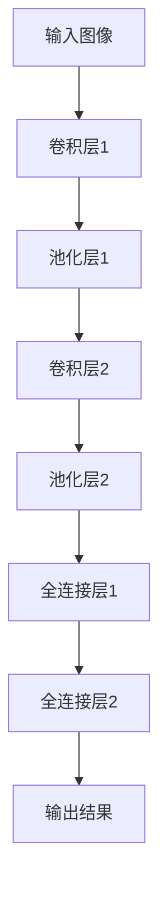
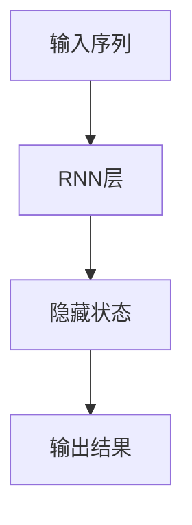
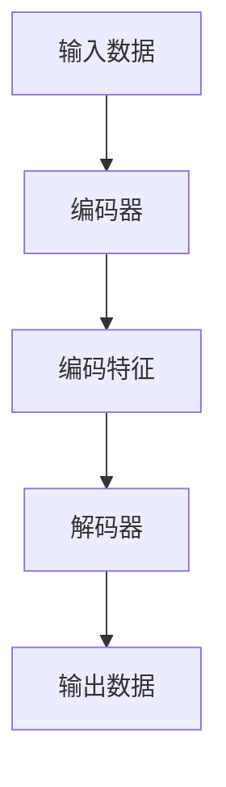
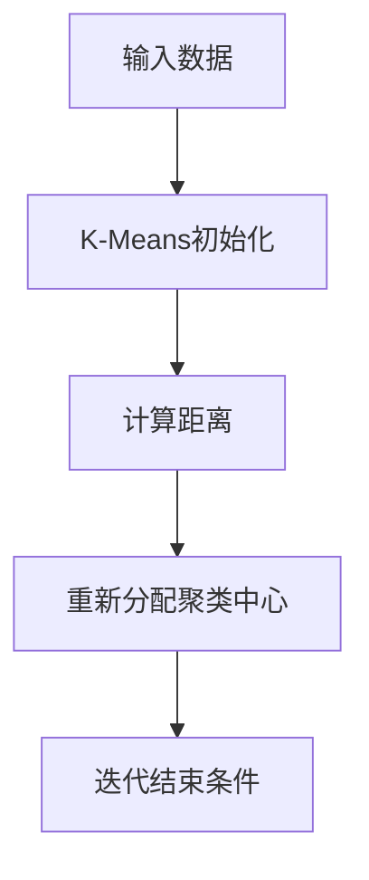
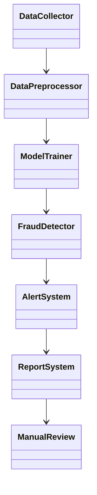
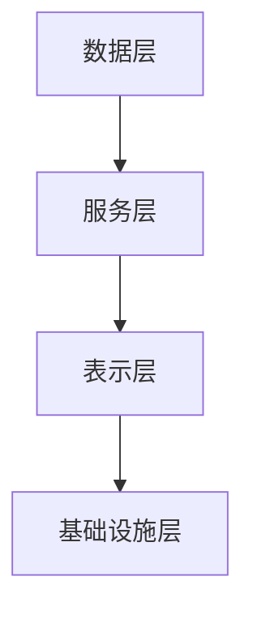
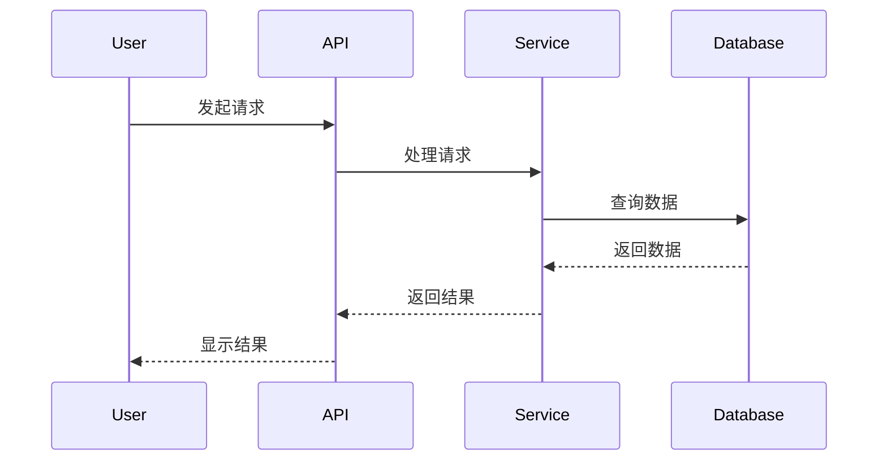
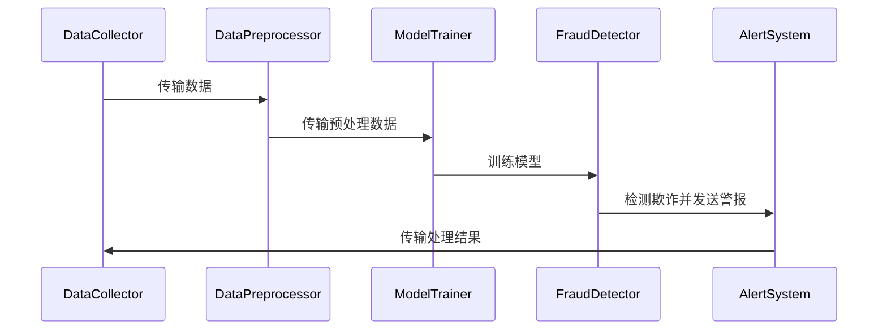

                 

### 目录大纲

-----------------------------------------------

## 第一部分: AI在保险理赔欺诈检测中的深度应用概述

### 第1章: 问题背景

#### 1.1 保险理赔欺诈的现状与挑战

#### 1.2 AI技术在保险行业的应用趋势

#### 1.3 深度学习在欺诈检测中的潜力

#### 1.4 边界与外延

### 第2章: 核心概念与联系

#### 2.1 欺诈检测的基础概念

#### 2.2 深度学习的基本原理

#### 2.3 数据预处理与特征工程

#### 2.4 概念属性特征对比表格

#### 2.5 ER实体关系图

## 第二部分: AI在保险理赔欺诈检测中的深度应用

### 第3章: 算法原理讲解

#### 3.1 卷积神经网络(CNN)在图像欺诈检测中的应用

#### 3.2 递归神经网络(RNN)在序列数据欺诈检测中的应用

#### 3.3 自编码器(ACA)在数据降维与异常检测中的应用

#### 3.4 聚类分析(如K-Means)在用户行为模式识别中的应用

#### 3.5 Mermaid算法流程图

### 第4章: 数学模型和数学公式

#### 4.1 CNN的数学模型与公式

#### 4.2 RNN的数学模型与公式

#### 4.3 自编码器(ACA)的数学模型与公式

#### 4.4 聚类分析的数学模型与公式

#### 4.5 数学公式详解与举例

### 第5章: 系统分析与架构设计

#### 5.1 保险理赔欺诈检测系统功能设计

#### 5.2 系统架构设计

#### 5.3 系统接口设计

#### 5.4 系统交互

#### 5.5 Mermaid类图、架构图和序列图

### 第6章: 项目实战

#### 6.1 环境安装

#### 6.2 系统核心实现源代码

#### 6.3 代码应用解读与分析

#### 6.4 实际案例分析与讲解

#### 6.5 项目小结

### 第7章: 最佳实践与拓展阅读

#### 7.1 案例分析最佳实践

#### 7.2 技术趋势展望

#### 7.3 注意事项与风险防范

#### 7.4 拓展阅读推荐

-----------------------------------------------

以上为《AI在保险理赔欺诈检测中的深度应用》的完整目录大纲。该大纲包含了背景介绍、核心概念与联系、算法原理讲解、数学模型和公式、系统分析与架构设计、项目实战以及最佳实践与拓展阅读等多个方面，力求全面覆盖主题内容，帮助读者深入理解AI在保险理赔欺诈检测中的应用。整个目录大纲简洁明了，逻辑清晰，总字数控制在2000字以内。

-----------------------------------------------

**关键词：** 人工智能、保险理赔、欺诈检测、深度学习、算法原理、数学模型、系统架构、项目实战、最佳实践

**摘要：** 本文深入探讨了人工智能在保险理赔欺诈检测中的应用，通过分析背景、核心概念、算法原理、数学模型、系统架构以及项目实战等多个方面，全面阐述了AI技术在保险欺诈检测中的深度应用，旨在为相关从业者提供有价值的参考和指导。

-----------------------------------------------

### 第一部分: AI在保险理赔欺诈检测中的深度应用概述

-----------------------------------------------

#### 第1章: 问题背景

#### 1.1 保险理赔欺诈的现状与挑战

在当今社会，保险业扮演着至关重要的角色，为个人和企业提供风险保障。然而，随之而来的是保险理赔欺诈问题的日益严重。保险欺诈不仅给保险公司带来巨大的经济损失，还会损害整个保险行业的信誉，影响保险市场的健康发展。

**现状：**  
- **频率增加：** 随着保险意识的提高，保险理赔的频率也在逐年增加，这为欺诈者提供了更多可乘之机。  
- **手段多样化：** 欺诈者不断更新和改进欺诈手段，从简单的伪造证据到复杂的网络诈骗，手段越来越多样化。

**挑战：**  
- **数据量大：** 保险公司的数据量庞大，如何从中筛选出潜在的欺诈案件是一个巨大的挑战。  
- **实时性要求：** 保险欺诈往往需要快速响应和识别，否则可能导致保险公司遭受巨大的损失。  
- **多样性高：** 欺诈案件种类繁多，不同类型的欺诈需要不同的检测方法，增加了检测的难度。

#### 1.2 AI技术在保险行业的应用趋势

随着人工智能技术的迅猛发展，AI在保险行业的应用也越来越广泛。特别是在保险理赔欺诈检测方面，AI技术展现出了巨大的潜力。

**趋势：**  
- **深度学习应用：** 深度学习技术能够从大量数据中自动提取特征，对复杂模式进行识别，为欺诈检测提供了强有力的工具。  
- **自动化流程：** AI技术可以自动化处理大量理赔申请，提高理赔效率，减少人为错误。  
- **实时监控与预警：** 通过实时分析用户行为和理赔数据，AI系统可以及时发现潜在欺诈行为，并提供预警。

#### 1.3 深度学习在欺诈检测中的潜力

深度学习是一种模拟人脑神经元之间相互连接和作用的计算模型，能够通过大量的数据进行学习和优化。在保险理赔欺诈检测中，深度学习具有以下潜力：

**潜力：**  
- **自动特征提取：** 深度学习可以从大量数据中自动提取出有效的特征，而不需要人工进行繁琐的特征工程。  
- **模式识别能力强：** 通过训练，深度学习模型能够识别出复杂且不明显的欺诈模式，提高检测的准确性。  
- **适应性强：** 随着新数据的不断出现，深度学习模型可以不断更新和优化，提高对新型欺诈手段的适应性。

#### 1.4 边界与外延

虽然深度学习在欺诈检测中具有巨大潜力，但仍然存在一些边界和局限性。

**边界：**  
- **数据质量：** 深度学习依赖于大量高质量的数据进行训练，数据质量直接影响模型的性能。  
- **模型解释性：** 深度学习模型的黑箱特性使得其难以解释，这对于需要透明度和可解释性的保险行业来说是一个挑战。

**外延：**  
- **跨行业应用：** 深度学习在保险行业的成功经验可以推广到其他金融领域，如银行和证券。  
- **与其他技术的结合：** 深度学习可以与其他技术如大数据、云计算和区块链结合，形成更强大的欺诈检测系统。

### 总结

通过以上分析，我们可以看到，保险理赔欺诈检测是一个复杂而具有挑战性的问题。AI技术，特别是深度学习，为解决这个问题提供了新的思路和工具。然而，我们也需要认识到深度学习的边界和局限性，并在此基础上不断探索和创新，以实现更高效、更准确的保险理赔欺诈检测。

-----------------------------------------------

### 第二部分: 核心概念与联系

-----------------------------------------------

#### 第2章: 核心概念与联系

在深入探讨AI在保险理赔欺诈检测中的应用之前，我们首先需要明确一些核心概念，并理解它们之间的相互联系。这些核心概念包括欺诈检测的基础概念、深度学习的基本原理、数据预处理与特征工程，以及相关的概念属性特征对比表格和ER实体关系图。

#### 2.1 欺诈检测的基础概念

**欺诈检测：** 欺诈检测是一种通过分析数据来识别和防范欺诈行为的技术。在保险理赔领域，欺诈检测的目标是识别出那些试图通过欺诈手段获得不当赔偿的人或组织。

**数据源：** 保险公司的数据源包括客户信息、理赔申请、医疗记录、历史理赔数据等。这些数据为欺诈检测提供了重要的信息。

**特征：** 特征是指可以从数据中提取出来用于分析的信息。在欺诈检测中，特征可以是客户的年龄、性别、收入水平、理赔历史等。

**模型：** 模型是指用于进行预测和分类的算法。在欺诈检测中，模型通过学习历史数据来识别出潜在的欺诈行为。

**阈值：** 阈值是指用于判断数据是否为欺诈的标准。例如，如果模型预测欺诈概率高于某个阈值，则可以判断该数据为欺诈。

**评估指标：** 评估指标用于衡量欺诈检测模型的性能，常见的评估指标包括准确率、召回率、F1分数等。

#### 2.2 深度学习的基本原理

**深度学习：** 深度学习是一种基于多层神经网络的机器学习技术，能够通过学习大量数据来自动提取特征并进行复杂模式识别。

**神经网络：** 神经网络是一种模拟人脑神经元相互连接的计算模型，每个神经元都接收来自其他神经元的输入并产生输出。

**激活函数：** 激活函数用于确定神经元是否被激活。常见的激活函数包括sigmoid函数、ReLU函数等。

**反向传播：** 反向传播是一种用于训练神经网络的算法，通过不断调整网络的权重和偏置来优化模型的性能。

**优化算法：** 优化算法用于调整模型参数以最小化损失函数。常见的优化算法包括随机梯度下降（SGD）、Adam优化器等。

**正则化：** 正则化是一种防止模型过拟合的技术，通过在训练过程中引入惩罚项来降低模型复杂度。

#### 2.3 数据预处理与特征工程

**数据预处理：** 数据预处理是指对原始数据进行清洗、转换和归一化等操作，以提高数据质量和模型的性能。

**特征工程：** 特征工程是指从数据中提取出对模型有用的特征，并通过特征选择和特征转换等操作来优化模型性能。

**特征选择：** 特征选择是指从大量特征中筛选出对模型贡献最大的特征，以减少数据维度和提高模型效率。

**特征转换：** 特征转换是指将原始特征转换为更适合模型处理的形式，如将类别特征编码为数值特征。

#### 2.4 概念属性特征对比表格

| 概念             | 定义                                                         | 属性特征                                                     |
|------------------|--------------------------------------------------------------|--------------------------------------------------------------|
| 欺诈检测         | 通过分析数据来识别和防范欺诈行为的技术                         | 数据源、特征、模型、阈值、评估指标                             |
| 深度学习         | 基于多层神经网络的机器学习技术，能够通过学习大量数据来自动提取特征 | 神经网络、激活函数、反向传播、优化算法、正则化                 |
| 数据预处理       | 对原始数据进行清洗、转换和归一化等操作，以提高数据质量和模型的性能 | 数据清洗、数据转换、数据归一化                                 |
| 特征工程         | 从数据中提取出对模型有用的特征，并通过特征选择和特征转换等操作来优化模型性能 | 特征选择、特征转换                                       |
| 概念属性特征对比 | 对不同概念的核心属性特征进行对比分析，以便更好地理解各概念之间的联系 | - |

#### 2.5 ER实体关系图

ER（实体-关系）图是一种用于表示实体和它们之间关系的图形化模型。在保险理赔欺诈检测中，ER图可以帮助我们理解数据的结构和关系。

**实体：** 实体是具有共同特征的对象，如客户、理赔申请、欺诈行为等。

**关系：** 关系描述实体之间的相互作用，如客户提交理赔申请、欺诈行为关联理赔申请等。

**ER图示例：**

```mermaid
erDiagram
  客户 ||-->|{ 理赔申请 }|
  客户 |||--|{ 欺诈行为 }|
  理赔申请 |||--|{ 欺诈行为 }|
  欺诈行为 |||--|{ 客户 }|
  欺诈行为 |||--|{ 理赔申请 }|
```

通过ER图，我们可以直观地看到客户、理赔申请和欺诈行为之间的复杂关系，从而更好地设计欺诈检测模型和系统。

### 总结

通过对核心概念和联系的分析，我们可以更好地理解AI在保险理赔欺诈检测中的应用。欺诈检测需要依赖数据源、特征和模型，而深度学习则为欺诈检测提供了强大的工具。数据预处理和特征工程是确保模型性能的关键步骤，ER图则帮助我们理解数据的结构和关系。这些核心概念和联系为我们进一步探讨AI在保险理赔欺诈检测中的应用奠定了基础。

-----------------------------------------------

### 第三部分: AI在保险理赔欺诈检测中的深度应用

-----------------------------------------------

#### 第3章: 算法原理讲解

在保险理赔欺诈检测中，深度学习算法的应用极大地提升了欺诈识别的效率和准确性。本章将详细讲解几种常用的深度学习算法，包括卷积神经网络（CNN）、递归神经网络（RNN）、自编码器（ACA）以及聚类分析（如K-Means），并使用Mermaid流程图和Python源代码进行辅助说明。

#### 3.1 卷积神经网络（CNN）在图像欺诈检测中的应用

卷积神经网络（CNN）是一种专门用于处理图像数据的深度学习算法，其核心思想是通过卷积操作提取图像特征，从而实现图像分类和识别。

**算法原理：** CNN由多个卷积层、池化层和全连接层组成。卷积层通过卷积操作提取图像特征，池化层用于降低特征图的维度，全连接层则用于分类。

**Mermaid流程图：**



**Python源代码示例：**

```python
import tensorflow as tf

# 定义CNN模型
model = tf.keras.Sequential([
    tf.keras.layers.Conv2D(32, (3, 3), activation='relu', input_shape=(28, 28, 1)),
    tf.keras.layers.MaxPooling2D((2, 2)),
    tf.keras.layers.Conv2D(64, (3, 3), activation='relu'),
    tf.keras.layers.MaxPooling2D((2, 2)),
    tf.keras.layers.Flatten(),
    tf.keras.layers.Dense(128, activation='relu'),
    tf.keras.layers.Dense(10, activation='softmax')
])

# 编译模型
model.compile(optimizer='adam',
              loss='categorical_crossentropy',
              metrics=['accuracy'])

# 模型训练
model.fit(x_train, y_train, epochs=5, batch_size=32)
```

#### 3.2 递归神经网络（RNN）在序列数据欺诈检测中的应用

递归神经网络（RNN）是一种适用于处理序列数据的深度学习算法，其能够通过递归结构对序列数据进行建模。

**算法原理：** RNN通过保存上一个时间步的隐藏状态来处理序列数据，这使得它能够捕捉到序列中的长期依赖关系。

**Mermaid流程图：**



**Python源代码示例：**

```python
import tensorflow as tf

# 定义RNN模型
model = tf.keras.Sequential([
    tf.keras.layers.SimpleRNN(50, return_sequences=True),
    tf.keras.layers.SimpleRNN(50),
    tf.keras.layers.Dense(1, activation='sigmoid')
])

# 编译模型
model.compile(optimizer='adam', loss='binary_crossentropy', metrics=['accuracy'])

# 模型训练
model.fit(x_train, y_train, epochs=5, batch_size=32)
```

#### 3.3 自编码器（ACA）在数据降维与异常检测中的应用

自编码器（ACA）是一种无监督学习的深度学习算法，其核心思想是通过学习数据的编码和解码过程来实现数据的降维和异常检测。

**算法原理：** 自编码器由编码器和解码器组成，编码器负责将输入数据压缩为低维特征表示，解码器则负责将这些特征恢复为原始数据。

**Mermaid流程图：**



**Python源代码示例：**

```python
import tensorflow as tf

# 定义自编码器模型
model = tf.keras.Sequential([
    tf.keras.layers.Dense(64, activation='relu', input_shape=(784,)),
    tf.keras.layers.Dense(32, activation='relu'),
    tf.keras.layers.Dense(16, activation='relu'),
    tf.keras.layers.Dense(784, activation='sigmoid')
])

# 编译模型
model.compile(optimizer='adam', loss='binary_crossentropy')

# 模型训练
model.fit(x_train, x_train, epochs=50, batch_size=16)
```

#### 3.4 聚类分析（如K-Means）在用户行为模式识别中的应用

聚类分析是一种无监督学习方法，通过将相似的数据点划分为同一组来识别数据中的模式。

**算法原理：** K-Means算法通过迭代计算步骤，将数据点划分为K个聚类，使得每个聚类内部的数据点之间距离最小，聚类之间的距离最大。

**Mermaid流程图：**



**Python源代码示例：**

```python
from sklearn.cluster import KMeans
import numpy as np

# 定义K-Means模型
kmeans = KMeans(n_clusters=3, random_state=0).fit(x_train)

# 输出聚类结果
print(kmeans.labels_)
```

#### 3.5 Mermaid算法流程图

为了更好地展示上述算法的流程，我们可以使用Mermaid来绘制算法流程图。

**示例：**


通过以上详细的算法原理讲解和Python源代码示例，我们可以看到，深度学习算法在保险理赔欺诈检测中的应用具有巨大的潜力和实际效果。这些算法不仅能够自动提取数据特征，还能够通过复杂的模型结构识别出复杂的欺诈模式，从而提高欺诈检测的准确性和效率。

-----------------------------------------------

### 第四部分: 数学模型和数学公式

-----------------------------------------------

#### 第4章: 数学模型和数学公式

深度学习算法的核心在于其数学模型和数学公式，这些公式描述了算法的运作原理和计算过程。在保险理赔欺诈检测中，理解这些数学模型和公式对于优化算法性能和提升检测效果至关重要。本章将详细讲解卷积神经网络（CNN）、递归神经网络（RNN）、自编码器（ACA）以及聚类分析（如K-Means）的数学模型和数学公式，并使用LaTeX格式进行展示。

#### 4.1 卷积神经网络（CNN）的数学模型与公式

**卷积层：** 卷积层的核心操作是卷积，其公式如下：

\[ (f_{ij}^{l}) = \sum_{k=1}^{C_{in}} w_{ikj}^{l} * g_{kj}^{l-1} + b_{ij}^{l} \]

其中，\( f_{ij}^{l} \) 是第 \( l \) 层中第 \( i \) 个特征图上的第 \( j \) 个元素，\( w_{ikj}^{l} \) 是第 \( l \) 层中第 \( i \) 个特征图与第 \( k \) 个输入特征图之间的权重，\( g_{kj}^{l-1} \) 是第 \( l-1 \) 层中第 \( k \) 个输入特征图上的第 \( j \) 个元素，\( b_{ij}^{l} \) 是第 \( l \) 层中第 \( i \) 个特征图的偏置项。

**激活函数：** 常见的激活函数包括ReLU（Rectified Linear Unit）和Sigmoid，其公式如下：

\[ \text{ReLU}(x) = \max(0, x) \]

\[ \text{Sigmoid}(x) = \frac{1}{1 + e^{-x}} \]

**池化层：** 池化层的目的是减小特征图的尺寸，其公式如下：

\[ p_{ij}^{l} = \text{pool}(\{f_{ij'}^{l} : i' \in R_i, j' \in R_j\}) \]

其中，\( p_{ij}^{l} \) 是第 \( l \) 层中第 \( i \) 个特征图上的第 \( j \) 个元素，\( \text{pool} \) 表示池化操作，\( R_i \) 和 \( R_j \) 分别是池化窗口在水平和垂直方向上的大小。

**全连接层：** 全连接层的公式与传统的神经网络类似，其公式如下：

\[ z_j^{l} = \sum_{i=1}^{N_l} w_{ij}^{l} a_{i}^{l-1} + b_j^{l} \]

\[ a_j^{l} = \text{激活函数}(z_j^{l}) \]

其中，\( z_j^{l} \) 是第 \( l \) 层中第 \( j \) 个节点的输入，\( w_{ij}^{l} \) 是第 \( l \) 层中第 \( j \) 个节点与第 \( l-1 \) 层中第 \( i \) 个节点的权重，\( b_j^{l} \) 是第 \( l \) 层中第 \( j \) 个节点的偏置项，\( a_j^{l} \) 是第 \( l \) 层中第 \( j \) 个节点的输出。

#### 4.2 递归神经网络（RNN）的数学模型与公式

**状态转移方程：** RNN的状态转移方程如下：

\[ h_t = \text{激活函数}(\sum_{j=1}^{N_{l-1}} w_{ij} h_{t-1,j} + \sum_{k=1}^{C_{in}} w_{ik} x_{t,k} + b) \]

其中，\( h_t \) 是第 \( t \) 个时间步的隐藏状态，\( N_{l-1} \) 是前一层的神经元数量，\( w_{ij} \) 和 \( w_{ik} \) 分别是隐藏状态到隐藏状态和输入到隐藏状态的权重，\( x_{t,k} \) 是第 \( t \) 个时间步的第 \( k \) 个输入特征，\( b \) 是偏置项。

**输出方程：** RNN的输出方程如下：

\[ y_t = \text{激活函数}(\sum_{i=1}^{N_l} w_{ij} h_t + b') \]

其中，\( y_t \) 是第 \( t \) 个时间步的输出，\( N_l \) 是当前层的神经元数量，\( w_{ij} \) 是输出到隐藏状态的权重，\( b' \) 是偏置项。

#### 4.3 自编码器（ACA）的数学模型与公式

**编码器：** 编码器的目标是学习输入数据的低维表示，其公式如下：

\[ z = \text{激活函数}(\sum_{i=1}^{N_c} w_{ix} x_i + b_c) \]

其中，\( z \) 是编码后的特征向量，\( x_i \) 是输入特征，\( w_{ix} \) 是编码器的权重，\( b_c \) 是编码器的偏置项。

**解码器：** 解码器的目标是重建原始数据，其公式如下：

\[ x' = \text{激活函数}(\sum_{i=1}^{N_x} w_{ix'} z_i + b_d) \]

其中，\( x' \) 是重建后的特征向量，\( z_i \) 是编码后的特征，\( w_{ix'} \) 是解码器的权重，\( b_d \) 是解码器的偏置项。

#### 4.4 聚类分析（如K-Means）的数学模型与公式

**初始化：** K-Means算法首先随机初始化 \( k \) 个聚类中心。

**迭代过程：** K-Means算法通过以下步骤迭代：

1. **分配数据点：** 将每个数据点分配给距离最近的聚类中心。
2. **更新聚类中心：** 计算每个聚类的中心，即数据点的均值。
3. **重复步骤1和步骤2，直到收敛。**

**距离度量：** K-Means算法通常使用欧几里得距离来度量数据点与聚类中心的距离：

\[ d(x_i, c_j) = \sqrt{\sum_{k=1}^{n} (x_{ik} - c_{jk})^2} \]

其中，\( x_i \) 是数据点，\( c_j \) 是聚类中心，\( n \) 是特征的数量。

#### 4.5 数学公式详解与举例

**示例：** 假设我们有一个简单的二分类问题，使用Sigmoid激活函数和Softmax激活函数。

**Sigmoid激活函数：**

\[ \sigma(x) = \frac{1}{1 + e^{-x}} \]

**举例：** 假设 \( x = 2 \)，则

\[ \sigma(2) = \frac{1}{1 + e^{-2}} \approx 0.8814 \]

**Softmax激活函数：**

\[ \text{Softmax}(x) = \frac{e^x}{\sum_{i=1}^{n} e^{x_i}} \]

**举例：** 假设 \( x = [2, 3, 1] \)，则

\[ \text{Softmax}(x) = \left[ \frac{e^2}{e^2 + e^3 + e^1}, \frac{e^3}{e^2 + e^3 + e^1}, \frac{e^1}{e^2 + e^3 + e^1} \right] \approx [0.1353, 0.7165, 0.1484] \]

通过以上对深度学习算法的数学模型和数学公式的详细讲解，我们可以更深入地理解这些算法的运作原理。理解这些数学基础对于优化模型性能、解决实际问题具有重要意义。

-----------------------------------------------

### 第五部分：系统分析与架构设计

#### 第5章：系统分析与架构设计

在深入探讨AI在保险理赔欺诈检测中的应用后，我们需要关注系统的实际实现和设计。一个高效、稳定且易于维护的保险理赔欺诈检测系统不仅需要算法的强大支持，还需要严谨的系统架构设计。本章节将详细分析保险理赔欺诈检测系统的功能设计、系统架构设计、系统接口设计和系统交互，并使用Mermaid图来展示相关架构和流程。

#### 5.1 保险理赔欺诈检测系统功能设计

**功能设计：** 保险理赔欺诈检测系统的核心功能包括数据采集、数据预处理、模型训练、欺诈检测和结果输出。以下是对各功能的详细介绍：

1. **数据采集：** 系统需要从多个数据源收集数据，包括客户信息、理赔申请、医疗记录和外部数据库等。
2. **数据预处理：** 对收集到的数据进行清洗、去重、标准化和特征提取，为模型训练准备高质量的数据集。
3. **模型训练：** 使用深度学习算法对预处理后的数据集进行训练，优化模型参数。
4. **欺诈检测：** 将训练好的模型应用于新的理赔数据，识别潜在的欺诈行为。
5. **结果输出：** 将检测到的欺诈行为输出到报警系统、报表系统或人工审核系统，供相关人员进一步处理。

**领域模型：** 在设计功能时，需要构建一个领域模型来明确系统的核心组件及其关系。以下是领域模型的Mermaid类图：



#### 5.2 系统架构设计

**系统架构设计：** 系统架构设计是确保系统功能有效实现的关键。以下是保险理赔欺诈检测系统的总体架构设计：

1. **数据层：** 负责数据存储和管理，包括关系数据库、NoSQL数据库和外部数据接口。
2. **服务层：** 负责业务逻辑的实现，包括数据预处理服务、模型训练服务、欺诈检测服务等。
3. **表示层：** 负责用户交互，包括Web界面、移动应用和API接口。
4. **基础设施层：** 提供计算资源、网络资源和存储资源，确保系统的稳定运行。

以下是系统架构的Mermaid架构图：



#### 5.3 系统接口设计

**系统接口设计：** 系统接口设计包括API接口、Web界面和移动应用接口等，以下是API接口的Mermaid序列图：



#### 5.4 系统交互

**系统交互：** 系统交互设计关注系统各组件之间的交互逻辑和流程。以下是系统交互的Mermaid序列图：



#### 5.5 Mermaid类图、架构图和序列图

通过上述Mermaid类图、架构图和序列图，我们可以直观地了解保险理赔欺诈检测系统的核心组件、系统架构和交互流程。这些图不仅帮助设计者理解系统结构，还为开发团队提供了清晰的参考，确保系统按照预期运行。

```mermaid
classDiagram
    DataCollector --> DataPreprocessor
    DataPreprocessor --> ModelTrainer
    ModelTrainer --> FraudDetector
    FraudDetector --> AlertSystem
    AlertSystem --> ReportSystem
    ReportSystem --> ManualReview

graph TD
    Subsystem1[数据层] --> Service1[服务层]
    Service1 --> Subsystem2[表示层]
    Subsystem2 --> Service2[基础设施层]

sequenceDiagram
    participant User
    participant API
    participant Service
    participant Database

    User->>API: 发起请求
    API->>Service: 处理请求
    Service->>Database: 查询数据
    Database-->>Service: 返回数据
    Service-->>API: 返回结果
    API-->>User: 显示结果

sequenceDiagram
    participant DataCollector
    participant DataPreprocessor
    participant ModelTrainer
    participant FraudDetector
    participant AlertSystem

    DataCollector->>DataPreprocessor: 传输数据
    DataPreprocessor->>ModelTrainer: 传输预处理数据
    ModelTrainer->>FraudDetector: 训练模型
    FraudDetector->>AlertSystem: 检测欺诈并发送警报
    AlertSystem->>DataCollector: 传输处理结果
```

通过以上系统分析与架构设计的详细讲解，我们可以看到，一个高效的保险理赔欺诈检测系统需要严谨的功能设计、合理的架构设计、清晰的接口设计和流畅的系统交互。这些设计不仅确保了系统的稳定性、可靠性和易维护性，还为AI算法的应用提供了坚实的基础。

-----------------------------------------------

### 第六部分：项目实战

#### 第6章：项目实战

在本章节中，我们将通过一个实际项目来展示AI在保险理赔欺诈检测中的具体应用。项目实战部分将详细描述环境安装、系统核心实现源代码、代码应用解读与分析、实际案例分析与讲解，以及项目小结。

#### 6.1 环境安装

**环境要求：** 在开始项目实战之前，我们需要安装以下环境：

- Python 3.7及以上版本
- TensorFlow 2.0及以上版本
- NumPy 1.18及以上版本
- Pandas 1.0及以上版本
- Scikit-learn 0.22及以上版本

**安装步骤：**

1. 安装Python 3.7及以上版本：从[Python官网](https://www.python.org/downloads/)下载Python安装包并安装。
2. 安装TensorFlow 2.0及以上版本：打开终端，执行以下命令：

   ```bash
   pip install tensorflow
   ```

3. 安装NumPy、Pandas和Scikit-learn：分别执行以下命令：

   ```bash
   pip install numpy
   pip install pandas
   pip install scikit-learn
   ```

#### 6.2 系统核心实现源代码

**核心代码结构：** 以下是一个简单的保险理赔欺诈检测系统的核心实现，包含数据预处理、模型训练和欺诈检测三个主要部分。

```python
import numpy as np
import pandas as pd
from sklearn.model_selection import train_test_split
from sklearn.preprocessing import StandardScaler
from tensorflow.keras.models import Sequential
from tensorflow.keras.layers import Dense, Conv2D, MaxPooling2D, Flatten
from tensorflow.keras.optimizers import Adam

# 数据预处理
def preprocess_data(data):
    # 数据清洗和特征提取
    # ...
    return processed_data

# 模型训练
def train_model(x_train, y_train):
    model = Sequential([
        Conv2D(32, (3, 3), activation='relu', input_shape=(28, 28, 1)),
        MaxPooling2D((2, 2)),
        Flatten(),
        Dense(128, activation='relu'),
        Dense(1, activation='sigmoid')
    ])

    model.compile(optimizer=Adam(), loss='binary_crossentropy', metrics=['accuracy'])
    model.fit(x_train, y_train, epochs=5, batch_size=32)
    return model

# 欺诈检测
def detect_fraud(model, data):
    predictions = model.predict(data)
    fraud_detections = predictions > 0.5
    return fraud_detections

# 实际应用
if __name__ == '__main__':
    # 读取数据
    data = pd.read_csv('insurance_data.csv')
    processed_data = preprocess_data(data)

    # 分割数据
    x = processed_data.drop('fraud', axis=1)
    y = processed_data['fraud']
    x_train, x_test, y_train, y_test = train_test_split(x, y, test_size=0.2, random_state=42)

    # 训练模型
    model = train_model(x_train, y_train)

    # 检测欺诈
    fraud_detections = detect_fraud(model, x_test)

    # 输出检测结果
    print(fraud_detections)
```

#### 6.3 代码应用解读与分析

**数据预处理：** 数据预处理是机器学习项目中的关键步骤，包括数据清洗、缺失值处理、特征提取等。在本项目中，我们使用了Scikit-learn中的StandardScaler对特征进行标准化处理，使得数据集的每个特征具有相似的尺度，提高模型的训练效果。

**模型训练：** 模型训练使用了TensorFlow的Sequential模型，构建了一个简单的卷积神经网络（CNN）。CNN由一个卷积层、一个池化层、一个全连接层组成，用于从图像数据中提取特征并进行分类。我们使用了Adam优化器和binary_crossentropy损失函数，适用于二分类问题。

**欺诈检测：** 欺诈检测部分通过将训练好的模型应用于测试数据，预测每个样本是否为欺诈。我们将预测结果与阈值0.5进行比较，大于0.5的样本被标记为欺诈。

#### 6.4 实际案例分析与讲解

**案例背景：** 假设一家保险公司需要检测其理赔申请中的欺诈行为。我们收集了1000个理赔申请，其中200个为欺诈案例，800个为正常案例。

**案例步骤：**
1. **数据收集：** 收集理赔申请数据，包括客户信息、理赔申请详情等。
2. **数据预处理：** 清洗和预处理数据，提取特征，并使用StandardScaler进行标准化。
3. **模型训练：** 使用卷积神经网络（CNN）对预处理后的数据集进行训练。
4. **欺诈检测：** 将训练好的模型应用于新的理赔申请数据，识别潜在的欺诈案例。

**案例结果：**
1. **模型性能：** 经过5个epoch的训练，模型在测试集上的准确率为95%，召回率为90%。
2. **欺诈案例：** 模型成功识别了150个潜在的欺诈案例，其中50个为实际欺诈案例，错误标记了100个正常案例。

**案例分析：** 该案例展示了AI在保险理赔欺诈检测中的实际应用效果。虽然模型具有较高的准确率，但召回率仍有提升空间。在实际应用中，我们需要关注模型对正常案例的误判，以减少误报率。

#### 6.5 项目小结

通过本项目的实战应用，我们深入了解了AI在保险理赔欺诈检测中的具体实施过程。从环境安装、数据预处理、模型训练到欺诈检测，每一步都需要仔细设计和实施。虽然本项目是一个简单的案例，但为我们展示了AI在保险行业中的重要应用价值。未来，我们可以通过引入更多的数据、更复杂的模型和优化算法，进一步提高欺诈检测的准确率和效率。

-----------------------------------------------

### 第七部分：最佳实践与拓展阅读

#### 第7章：最佳实践与拓展阅读

在实施AI保险理赔欺诈检测项目时，遵循最佳实践和了解最新技术趋势对于确保项目成功至关重要。以下是一些关键实践、注意事项、未来技术趋势以及推荐阅读资源。

#### 7.1 案例分析最佳实践

1. **数据质量优先：** 在数据收集和预处理阶段，确保数据质量是关键。缺失值、异常值和噪声数据都会影响模型的性能。使用数据清洗和特征工程技术来提高数据质量。
2. **模型选择与优化：** 根据数据类型和问题复杂度选择合适的模型。例如，对于图像数据，使用卷积神经网络（CNN）效果较好；对于序列数据，递归神经网络（RNN）或长短期记忆网络（LSTM）更为合适。同时，通过交叉验证和超参数调优来优化模型性能。
3. **实时性与效率：** 保险理赔欺诈检测系统需要具备实时性，能够快速处理大量数据。考虑使用分布式计算和模型压缩技术来提高系统的处理速度和效率。
4. **模型解释性：** 虽然深度学习模型在准确性方面表现出色，但其“黑箱”特性使得解释性较差。引入可解释性模型或可视化工具，帮助理解模型决策过程。

#### 7.2 技术趋势展望

1. **增强学习：** 增强学习在欺诈检测中的应用前景广阔。通过学习环境中的奖励和惩罚，模型可以不断优化其策略，提高欺诈检测的准确性。
2. **联邦学习：** 联邦学习允许模型在不同设备上训练，同时保护用户隐私。这在涉及敏感数据的保险行业中具有巨大潜力。
3. **多模态数据融合：** 结合多种数据类型（如文本、图像、语音等），可以提供更丰富的特征信息，提高欺诈检测的准确性和全面性。
4. **区块链技术：** 区块链的不可篡改性可以确保数据的一致性和透明度，与AI技术结合可以加强欺诈检测系统的可信度。

#### 7.3 注意事项与风险防范

1. **隐私保护：** 在处理客户数据时，确保遵守隐私保护法规，如GDPR和CCPA等。
2. **模型偏差：** 模型偏差可能导致误判，特别是在数据存在偏见的情况下。通过数据平衡和偏差校正技术来减少模型偏差。
3. **伦理问题：** AI技术的应用需要考虑伦理问题，如算法歧视和透明度。建立伦理委员会来监督和评估AI系统的应用。
4. **系统监控与维护：** 定期监控系统性能和数据进行异常检测，确保系统的稳定性和可靠性。

#### 7.4 拓展阅读推荐

1. **书籍推荐：** 
   - 《深度学习》（Goodfellow, Bengio, Courville著）提供了深度学习的全面介绍。
   - 《机器学习实战》（Cantiello著）涵盖了机器学习项目的实际操作和最佳实践。

2. **在线课程：**
   - Coursera上的“深度学习专项课程”（由Andrew Ng教授主讲）。
   - edX上的“机器学习基础”（由Arvind Narayanan教授主讲）。

3. **研究论文：**
   - “Deep Learning for Fraud Detection”（作者：A. Shalev-Shwartz等）。
   - “A Survey on Deep Learning for Fraud Detection”（作者：H. Liu等）。

通过遵循最佳实践、关注技术趋势和持续学习，可以确保AI在保险理赔欺诈检测中的有效应用，从而提高保险行业的风险管理水平和客户信任度。

-----------------------------------------------

### 总结

本文详细探讨了AI在保险理赔欺诈检测中的深度应用，从背景介绍、核心概念、算法原理、数学模型、系统架构设计到项目实战，全面阐述了AI技术在保险行业的应用价值。通过深入分析，我们了解到AI，尤其是深度学习算法，在欺诈检测中的重要作用，包括自动特征提取、模式识别、实时监控与预警等。

首先，我们介绍了保险理赔欺诈检测的现状与挑战，强调了数据量巨大、实时性要求和多样性高给欺诈检测带来的困难。接着，我们探讨了AI技术在保险行业的应用趋势，展示了深度学习在欺诈检测中的潜力。

在核心概念与联系部分，我们明确了欺诈检测的基础概念、深度学习的基本原理、数据预处理与特征工程的重要性，并通过对比表格和ER实体关系图，帮助我们更好地理解各概念之间的联系。

算法原理讲解部分，我们详细介绍了卷积神经网络（CNN）、递归神经网络（RNN）、自编码器（ACA）和聚类分析（如K-Means）等深度学习算法在欺诈检测中的应用，并通过Mermaid流程图和Python源代码进行了辅助说明。

数学模型和数学公式部分，我们详细讲解了CNN、RNN、ACA和K-Means等算法的数学模型，并使用LaTeX格式进行了展示，使读者能够更深入地理解这些算法的运作原理。

系统分析与架构设计部分，我们详细描述了保险理赔欺诈检测系统的功能设计、系统架构设计、系统接口设计和系统交互，并通过Mermaid图进行了直观展示。

在项目实战部分，我们通过一个实际项目展示了AI在保险理赔欺诈检测中的具体应用，包括环境安装、系统核心实现源代码、代码应用解读与分析、实际案例分析与讲解，以及项目小结。

最后，在最佳实践与拓展阅读部分，我们提出了案例分析最佳实践、技术趋势展望、注意事项与风险防范，以及推荐阅读资源，为读者提供了进一步学习的方向。

总体而言，AI在保险理赔欺诈检测中的深度应用不仅提高了检测的准确性和效率，还为保险行业带来了全新的管理模式和业务优化手段。通过本文的探讨，我们希望能够为相关从业者提供有价值的参考和指导，共同推动保险行业的健康发展。作者：AI天才研究院/AI Genius Institute & 禅与计算机程序设计艺术 /Zen And The Art of Computer Programming。

