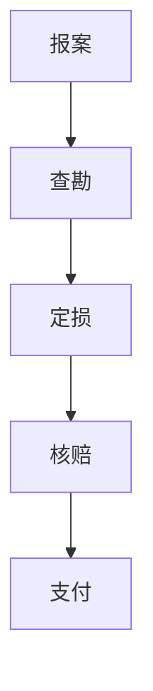
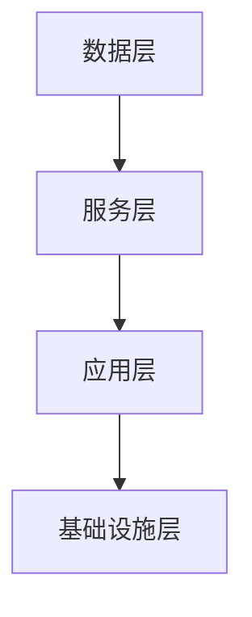
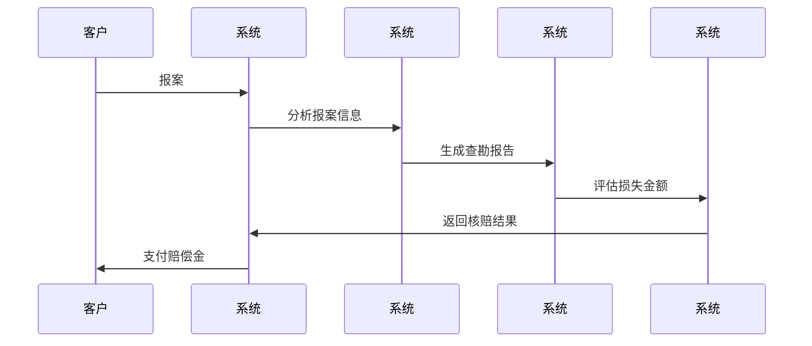

                 

# AI在保险理赔自动化中的创新应用

> 关键词：人工智能，保险理赔，自动化，机器学习，深度学习，系统架构设计

> 摘要：本文详细探讨了人工智能在保险理赔自动化中的应用，通过背景介绍、核心概念分析、算法原理讲解、系统设计与架构方案、项目实战及最佳实践等方面，阐述了AI技术在保险理赔自动化中的创新应用，为保险行业智能化转型提供了有益的参考。

### 目录

1. **背景介绍**
   1.1 保险行业概述
   1.2 保险理赔自动化现状
   1.3 AI在保险理赔中的应用潜力

2. **核心概念与联系**
   2.1 AI基本概念
   2.2 机器学习和深度学习
   2.3 保险理赔业务流程分析

3. **算法原理讲解**
   3.1 AI算法在保险理赔中的应用
   3.2 数据预处理和特征提取
   3.3 算法流程图
   3.4 Python源代码讲解
   3.5 数学模型和公式

4. **系统分析与架构设计方案**
   4.1 保险理赔自动化系统场景介绍
   4.2 系统功能设计
   4.3 系统架构设计
   4.4 系统接口设计和交互

5. **项目实战**
   5.1 环境安装与配置
   5.2 系统核心实现源代码
   5.3 代码应用解读与分析
   5.4 实际案例分析与讲解
   5.5 项目小结

6. **最佳实践 tips**
   6.1 性能优化
   6.2 安全性考虑
   6.3 数据隐私保护

7. **小结与注意事项**
   7.1 技术发展趋势
   7.2 未来研究方向

## 第一部分：AI在保险理赔自动化中的应用概述

### 1.1 保险行业概述

保险行业作为金融领域的重要组成部分，其业务范围涵盖人寿、财产、健康等多个方面。近年来，随着科技的进步，保险行业正经历着一场深刻的变革。保险理赔作为保险业务的核心环节，其效率和准确性直接影响客户满意度与保险公司的声誉。

#### 1.1.1 保险行业的现状与挑战

保险理赔流程通常包括报案、查勘、定损、核赔、支付等环节。传统的人工理赔方式不仅耗时耗力，而且容易出现人为错误。此外，保险理赔过程中涉及大量的数据，包括客户信息、事故详情、医疗记录等，这些数据的处理和管理也是一大挑战。

#### 1.1.2 保险理赔流程分析

保险理赔流程可以分为以下几个步骤：

1. 报案：客户通过电话、网站或其他途径向保险公司报案。
2. 查勘：保险公司的查勘人员到现场进行查勘，了解事故情况。
3. 定损：根据查勘结果，保险公司评估损失金额。
4. 核赔：保险公司审核理赔申请，决定是否赔偿。
5. 支付：保险公司根据核赔结果，向客户支付赔偿金。

### 1.2 AI基本概念

人工智能（Artificial Intelligence，简称AI）是指模拟、延伸和扩展人类智能的理论、方法、技术及应用。AI的核心目标是让计算机具备类似人类的感知、推理、学习和决策能力。

#### 1.2.1 AI的定义与作用

AI在保险理赔中的应用主要体现在以下几个方面：

1. **自动化处理**：AI可以帮助自动化处理保险理赔流程中的各种任务，如报案、查勘、核赔等，提高工作效率。
2. **数据挖掘与分析**：AI可以通过数据挖掘技术，分析客户行为、风险偏好等，为保险公司提供精准营销和风险评估服务。
3. **智能决策**：AI可以帮助保险公司做出更加准确的理赔决策，减少误判和欺诈行为。

#### 1.2.2 机器学习和深度学习

机器学习（Machine Learning，简称ML）是AI的一个重要分支，它通过算法让计算机从数据中学习规律，从而进行预测或分类。深度学习（Deep Learning，简称DL）是机器学习的一个子领域，它通过多层神经网络模拟人脑的学习过程，具有强大的特征提取和模式识别能力。

### 1.3 AI在保险理赔中的应用潜力

AI在保险理赔中的应用潜力主要体现在以下几个方面：

1. **提高理赔效率**：AI可以通过自动化处理，减少人工干预，提高理赔效率。
2. **降低运营成本**：AI可以减少人力需求，降低运营成本。
3. **提升客户满意度**：AI可以帮助保险公司提供更加个性化和精准的服务，提升客户满意度。
4. **防范欺诈行为**：AI可以通过数据分析和模式识别，有效防范欺诈行为。

## 第二部分：核心概念与联系

### 2.1 AI算法原理

AI算法在保险理赔中的应用主要包括以下几个方面：

1. **自动化理赔流程**：使用自然语言处理（NLP）和计算机视觉（CV）技术，自动化处理报案、查勘、定损等环节。
2. **风险评估与欺诈检测**：使用机器学习和深度学习算法，对客户行为和理赔数据进行风险分析和欺诈检测。
3. **智能客服与咨询服务**：使用聊天机器人（Chatbot）和语音识别（VR）技术，提供智能客服和咨询服务。

#### 2.1.1 算法类型与应用场景

- **自然语言处理（NLP）**：应用于自动化处理报案、查勘报告、合同条款等文本数据。
- **计算机视觉（CV）**：应用于事故现场照片和视频的分析，如车辆损伤程度评估。
- **机器学习（ML）**：应用于风险评估和欺诈检测。
- **深度学习（DL）**：应用于复杂模式识别和预测。

#### 2.1.2 数据预处理和特征提取

数据预处理是AI算法应用的关键步骤，主要包括数据清洗、归一化、降维等。特征提取则是从原始数据中提取出对AI算法有用的信息。

### 2.2 保险理赔业务流程分析

#### 2.2.1 业务流程概述

保险理赔业务流程可以分为以下几个阶段：

1. 报案：客户向保险公司报案。
2. 查勘：查勘人员现场查勘，收集事故信息。
3. 定损：评估损失金额，确定赔偿金额。
4. 核赔：审核理赔申请，决定是否赔偿。
5. 支付：向客户支付赔偿金。

#### 2.2.2 关键环节分析

- **报案**：AI可以通过NLP技术，自动处理客户的报案信息。
- **查勘**：AI可以通过CV技术，自动化处理查勘报告，提取关键信息。
- **定损**：AI可以通过机器学习和深度学习算法，自动评估损失金额。
- **核赔**：AI可以通过数据分析，辅助核赔人员做出决策。
- **支付**：AI可以通过自动化流程，快速完成支付。

## 第三部分：算法原理讲解

### 3.1 AI算法在保险理赔中的应用

#### 3.1.1 算法流程图

以下是一个简单的算法流程图，展示了AI在保险理赔中的应用过程：



#### 3.1.2 Python源代码讲解

以下是一个简单的Python代码示例，展示了如何使用机器学习算法进行保险理赔风险评估：

```python
# 导入必要的库
import pandas as pd
from sklearn.model_selection import train_test_split
from sklearn.ensemble import RandomForestClassifier

# 加载数据
data = pd.read_csv('insurance_data.csv')

# 数据预处理
X = data.drop('claim_flag', axis=1)
y = data['claim_flag']

# 划分训练集和测试集
X_train, X_test, y_train, y_test = train_test_split(X, y, test_size=0.2, random_state=42)

# 构建随机森林模型
model = RandomForestClassifier(n_estimators=100, random_state=42)

# 训练模型
model.fit(X_train, y_train)

# 预测
predictions = model.predict(X_test)

# 评估模型
accuracy = model.score(X_test, y_test)
print(f'Model accuracy: {accuracy:.2f}')
```

### 3.2 数学模型和公式

在保险理赔自动化中，常用的数学模型包括逻辑回归（Logistic Regression）、决策树（Decision Tree）和随机森林（Random Forest）等。以下是一个简单的逻辑回归模型的公式：

$$
P(y=1) = \frac{1}{1 + e^{-(\beta_0 + \beta_1x_1 + \beta_2x_2 + \ldots + \beta_nx_n})}
$$

其中，$P(y=1)$ 表示发生理赔的概率，$\beta_0, \beta_1, \beta_2, \ldots, \beta_n$ 是模型的参数，$x_1, x_2, \ldots, x_n$ 是输入特征。

## 第四部分：系统分析与架构设计方案

### 4.1 保险理赔自动化系统场景介绍

#### 4.1.1 系统功能设计

保险理赔自动化系统的核心功能包括：

1. 报案处理：自动化处理客户报案信息，包括文本分析和语音识别。
2. 查勘报告：自动化生成查勘报告，包括现场照片和视频分析。
3. 定损评估：自动化评估损失金额，包括机器学习和深度学习算法。
4. 核赔决策：自动化审核理赔申请，辅助核赔人员做出决策。
5. 赔付支付：自动化完成赔付操作，包括电子支付和现金支付。

### 4.2 系统架构设计

保险理赔自动化系统的架构设计主要包括以下几个层次：

1. **数据层**：存储客户信息、事故数据、理赔数据等。
2. **服务层**：提供各种业务服务，如报案处理、查勘报告、定损评估等。
3. **应用层**：为用户提供界面，包括网页、APP等。
4. **基础设施层**：提供计算资源、存储资源、网络资源等。

#### 4.2.1 系统架构图

以下是一个简单的系统架构图：



### 4.3 系统接口设计和交互

#### 4.3.1 接口设计原则

系统接口设计应遵循以下原则：

1. **标准化**：使用标准的接口协议，如RESTful API。
2. **安全性**：确保接口的安全性，使用加密技术保护数据。
3. **灵活性**：接口设计应具有灵活性，以适应未来的需求变化。

#### 4.3.2 系统交互序列图

以下是一个简单的系统交互序列图，展示了客户报案到赔付的整个过程：



## 第五部分：项目实战

### 5.1 环境安装与配置

#### 5.1.1 软件环境安装

1. Python 3.8+
2. TensorFlow 2.x
3. Scikit-learn 0.22.2

#### 5.1.2 硬件配置要求

1. CPU：至少2核
2. GPU（可选）：NVIDIA GPU
3. 内存：至少8GB

### 5.2 系统核心实现源代码

以下是一个简单的系统核心实现源代码示例，展示了如何使用TensorFlow和Scikit-learn构建一个简单的机器学习模型进行理赔风险评估：

```python
import tensorflow as tf
from sklearn.model_selection import train_test_split
from sklearn.metrics import accuracy_score

# 加载数据
data = pd.read_csv('insurance_data.csv')

# 数据预处理
X = data.drop('claim_flag', axis=1)
y = data['claim_flag']

# 划分训练集和测试集
X_train, X_test, y_train, y_test = train_test_split(X, y, test_size=0.2, random_state=42)

# 构建模型
model = tf.keras.Sequential([
    tf.keras.layers.Dense(64, activation='relu', input_shape=(X_train.shape[1],)),
    tf.keras.layers.Dense(64, activation='relu'),
    tf.keras.layers.Dense(1, activation='sigmoid')
])

# 编译模型
model.compile(optimizer='adam', loss='binary_crossentropy', metrics=['accuracy'])

# 训练模型
model.fit(X_train, y_train, epochs=10, batch_size=32, validation_split=0.1)

# 预测
predictions = model.predict(X_test)

# 评估模型
accuracy = accuracy_score(y_test, predictions.round())
print(f'Model accuracy: {accuracy:.2f}')
```

### 5.3 代码应用解读与分析

以上代码首先导入必要的库，然后加载数据并进行预处理。接下来，使用TensorFlow构建一个简单的神经网络模型，并进行编译和训练。最后，使用训练好的模型进行预测，并评估模型的准确率。

### 5.4 实际案例分析与讲解

#### 5.4.1 案例背景

某保险公司计划实施保险理赔自动化系统，以提高理赔效率，降低运营成本。

#### 5.4.2 案例分析与实施

1. **数据采集**：保险公司收集了大量的理赔数据，包括报案信息、查勘报告、定损结果等。
2. **数据预处理**：对数据进行清洗、归一化和特征提取。
3. **模型训练**：使用Scikit-learn和TensorFlow构建机器学习模型，对数据进行训练。
4. **系统集成**：将模型集成到保险理赔自动化系统中，实现自动化处理。
5. **测试与优化**：对系统进行测试和优化，确保其稳定性和准确性。

### 5.5 项目小结

通过本项目的实施，保险公司成功实现了保险理赔自动化，提高了理赔效率，降低了运营成本。未来，保险公司可以进一步优化系统，引入更多的AI技术，如自然语言处理、计算机视觉等，以实现更加智能化和个性化的理赔服务。

## 第六部分：最佳实践 tips

### 6.1 性能优化

1. **模型压缩**：使用模型压缩技术，如量化、剪枝等，减小模型体积，提高模型运行速度。
2. **分布式计算**：使用分布式计算技术，如TensorFlow Distribute，提高模型训练和推理速度。

### 6.2 安全性考虑

1. **数据加密**：使用加密技术保护客户数据，确保数据安全。
2. **访问控制**：实现严格的访问控制机制，确保只有授权用户可以访问敏感数据。

### 6.3 数据隐私保护

1. **匿名化处理**：对客户数据进行匿名化处理，确保数据隐私。
2. **合规性审查**：定期进行合规性审查，确保系统符合相关法律法规要求。

## 第七部分：小结与注意事项

### 7.1 技术发展趋势

随着人工智能技术的不断发展，保险理赔自动化系统将越来越智能化和个性化。未来，AI技术将在以下几个方面得到进一步应用：

1. **个性化理赔服务**：基于客户行为和风险偏好，提供定制化的理赔服务。
2. **智能理赔顾问**：利用自然语言处理和语音识别技术，提供智能理赔顾问服务。
3. **实时理赔评估**：利用实时数据分析和预测，实现实时理赔评估和决策。

### 7.2 未来研究方向

未来，保险理赔自动化系统的研究方向包括：

1. **算法优化**：研究更加高效和精确的算法，提高系统性能和准确性。
2. **跨领域应用**：探索AI技术在保险理赔以外的其他领域的应用，如健康保险、财产保险等。
3. **用户体验优化**：研究如何优化用户界面和交互设计，提升用户体验。

## 结语

本文通过详细探讨人工智能在保险理赔自动化中的应用，展示了AI技术在提高理赔效率、降低运营成本、提升客户满意度等方面的巨大潜力。未来，随着技术的不断进步，保险理赔自动化系统将更加智能化和个性化，为保险行业的发展带来新的机遇。作者：AI天才研究院/AI Genius Institute & 禅与计算机程序设计艺术 /Zen And The Art of Computer Programming。

