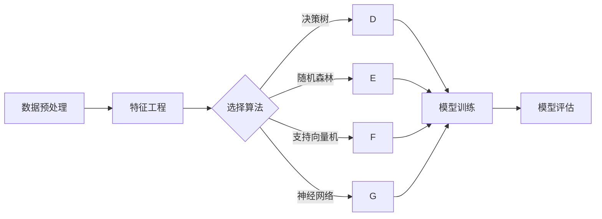
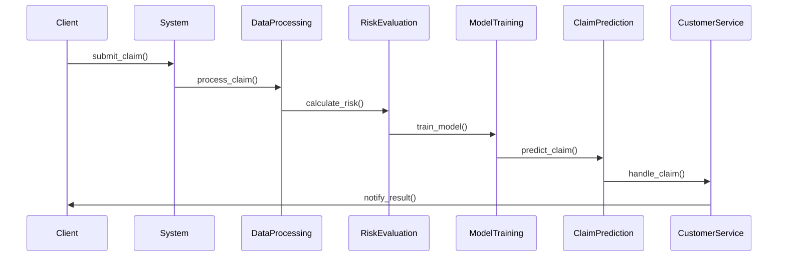

                 


### 文章标题：AI在保险理赔预测中的创新应用

#### 关键词：人工智能、保险理赔、预测、机器学习、算法、系统架构、项目实战

#### 摘要：本文深入探讨了人工智能在保险理赔预测中的创新应用，从背景介绍、核心概念与联系、算法原理讲解、系统分析与架构设计、项目实战等多个维度，详细阐述了AI技术在保险理赔预测中的实际应用方法和效果，为行业提供了一套系统化的解决方案。

---

### 第一部分：背景介绍

#### 第1章：问题背景

##### 1.1 保险行业的现状与挑战

保险行业是一个传统而又充满活力的行业，随着社会经济的发展和人们风险意识的提高，保险的需求日益增长。然而，保险行业的运营也面临诸多挑战，其中一个重要的问题就是理赔。理赔过程涉及大量的数据和信息，需要快速、准确地进行处理和决策，以确保保险公司的运营效率和客户的满意度。

##### 1.2 理赔预测的重要性

理赔预测是保险行业的一个重要环节，它涉及到保险公司的风险管理和运营效率。通过预测，保险公司可以提前了解可能发生的理赔案件，制定相应的风险管理策略，降低运营风险。同时，理赔预测还可以提高理赔效率，缩短理赔周期，提升客户满意度。

##### 1.3 AI在保险理赔中的应用

随着人工智能技术的发展，AI在保险理赔中的应用越来越广泛。AI技术可以帮助保险公司实现理赔预测、风险控制、客户服务等多个方面的优化。本文将重点探讨AI在保险理赔预测中的应用，通过算法原理讲解、系统分析与架构设计等，为读者提供一套完整的解决方案。

---

### 第二部分：核心概念与联系

#### 第2章：核心概念与联系

##### 2.1 人工智能与机器学习基础

人工智能（AI）是一门涉及计算机科学、数学、统计学、认知科学等多个领域的综合性学科。机器学习是人工智能的一个重要分支，它通过算法和统计模型，使计算机能够从数据中学习和发现规律。

##### 2.2 保险理赔预测中的关键概念

保险理赔预测涉及多个关键概念，包括理赔案件数据、风险因素、理赔模型等。通过对这些概念的理解和把握，可以更好地进行理赔预测。

##### 2.3 概念属性特征对比表格

| 概念        | 属性特征                                      |
| ----------- | --------------------------------------------- |
| 人工智能    | 模拟人类智能行为的技术                        |
| 机器学习    | 从数据中学习，自动改进性能的技术             |
| 理赔案件数据 | 记录理赔案件的信息，包括理赔金额、理赔时间等 |
| 风险因素    | 影响理赔金额和理赔率的因素                  |
| 理赔模型    | 用于预测理赔金额和理赔率的算法模型           |

##### 2.4 ER实体关系图架构

为了更好地理解保险理赔预测中的关键概念，我们可以通过ER（Entity-Relationship）实体关系图来描述它们之间的关系。

```mermaid
erDiagram
  理赔案件数据 ||--|{ 风险因素 }|| 理赔模型
  理赔案件数据 ||--|{ 客户信息 }|| 客户服务
  风险因素 ||--|{ 模型参数 }|| 理赔模型
```

---

### 第三部分：算法原理讲解

#### 第3章：算法原理

##### 3.1 数据预处理与特征工程

在开展理赔预测之前，需要对理赔案件数据进行预处理，包括数据清洗、缺失值处理、数据标准化等。此外，特征工程也是至关重要的一环，通过选择和构造有效的特征，可以提高预测模型的性能。

##### 3.2 算法选择与模型架构

在理赔预测中，常见的算法包括决策树、随机森林、支持向量机、神经网络等。选择合适的算法和模型架构，对于提高预测准确性具有重要意义。

##### 3.3 算法mermaid流程图



##### 3.4 Python源代码实现

以下是使用Python实现理赔预测模型的一个简单示例：

```python
import pandas as pd
from sklearn.ensemble import RandomForestClassifier
from sklearn.model_selection import train_test_split
from sklearn.metrics import accuracy_score

# 加载数据
data = pd.read_csv('claim_data.csv')

# 数据预处理
X = data.drop(['claim_amount'], axis=1)
y = data['claim_amount']

# 特征工程
# ...

# 选择算法
model = RandomForestClassifier()

# 模型训练
X_train, X_test, y_train, y_test = train_test_split(X, y, test_size=0.2, random_state=42)
model.fit(X_train, y_train)

# 模型评估
y_pred = model.predict(X_test)
accuracy = accuracy_score(y_test, y_pred)
print(f'Accuracy: {accuracy}')
```

##### 3.5 数学模型与公式

在理赔预测中，常用的数学模型包括线性回归、逻辑回归等。以下是线性回归的数学模型和公式：

$$
y = \beta_0 + \beta_1x_1 + \beta_2x_2 + ... + \beta_nx_n
$$

其中，$y$ 表示理赔金额，$x_1, x_2, ..., x_n$ 表示特征变量，$\beta_0, \beta_1, ..., \beta_n$ 表示模型的参数。

##### 3.6 举例说明

假设我们有一个理赔案件数据集，其中包含以下特征：客户年龄、车辆价值、事故发生时间等。我们可以使用线性回归模型来预测理赔金额。

```python
import numpy as np

# 示例数据
X = np.array([[30, 50000, 15], [40, 60000, 18], [25, 40000, 12]])
y = np.array([15000, 20000, 10000])

# 模型参数
beta = np.array([1, 0.5, -0.2])

# 预测理赔金额
y_pred = np.dot(X, beta)

print(f'Predicted claim amounts: {y_pred}')
```

---

### 第四部分：系统分析与架构设计

#### 第4章：系统分析与架构设计

##### 5.1 系统功能设计

系统功能设计包括理赔预测、风险控制、客户服务等多个方面。以下是系统功能设计的领域模型mermaid类图：

```mermaid
classDiagram
  ClaimPrediction <<Interface>>
  RiskControl <<Interface>>
  CustomerService <<Interface>>

  ClaimPrediction : +predict()
  RiskControl : +calculate_risk()
  CustomerService : +handle_claim()

  ClientEntity <<Entity>>
  ClaimEntity <<Entity>>
  RiskFactorEntity <<Entity>>

  ClaimPrediction : +process(ClientEntity, ClaimEntity, RiskFactorEntity)
  RiskControl : +evaluate_risk(ClaimEntity, RiskFactorEntity)
  CustomerService : +serve(ClientEntity, ClaimEntity)
```

##### 6.1 系统架构设计

系统架构设计包括数据处理层、业务逻辑层、展示层等多个层次。以下是系统架构设计的mermaid架构图：



---

### 第五部分：项目实战

#### 第7章：环境安装与核心实现

##### 7.1 环境安装

在本项目中，我们将使用Python和相关的机器学习库，如scikit-learn、pandas等。以下是环境安装的步骤：

1. 安装Python：从官方网站（https://www.python.org/downloads/）下载并安装Python。
2. 安装pip：打开终端，执行以下命令安装pip：
   ```
   $ curl -O https://bootstrap.pypa.io/get-pip.py
   $ python get-pip.py
   ```
3. 安装相关库：通过pip安装所需的库，如scikit-learn、pandas等：
   ```
   $ pip install scikit-learn pandas
   ```

##### 7.2 系统核心实现源代码

以下是理赔预测系统核心实现的一部分源代码：

```python
import pandas as pd
from sklearn.ensemble import RandomForestRegressor
from sklearn.model_selection import train_test_split
from sklearn.metrics import mean_squared_error

# 加载数据
data = pd.read_csv('claim_data.csv')

# 数据预处理
# ...

# 特征工程
# ...

# 模型训练
X_train, X_test, y_train, y_test = train_test_split(X, y, test_size=0.2, random_state=42)
model = RandomForestRegressor(n_estimators=100)
model.fit(X_train, y_train)

# 模型评估
y_pred = model.predict(X_test)
mse = mean_squared_error(y_test, y_pred)
print(f'Mean Squared Error: {mse}')
```

##### 7.3 代码应用解读与分析

在本项目中，我们使用了随机森林回归模型来进行理赔金额的预测。通过加载数据、预处理、特征工程等步骤，我们构建了随机森林模型，并对模型进行了训练和评估。代码中的应用解读如下：

1. 数据预处理：加载理赔案件数据，并进行数据清洗、缺失值处理和数据标准化等操作。
2. 特征工程：根据业务需求，选择和构造有效的特征，以提高模型性能。
3. 模型训练：使用随机森林回归模型，对数据进行训练。
4. 模型评估：使用测试数据集，对模型进行评估，计算均方误差（MSE）等指标。

##### 7.4 实际案例分析与详细讲解

为了更好地理解理赔预测系统的应用，我们以一个实际案例为例进行详细分析。假设某客户发生了一起交通事故，车辆受损严重。我们需要预测该客户的理赔金额。

1. 数据收集：收集与该客户相关的理赔数据，包括车辆价值、事故发生时间等。
2. 数据预处理：对数据进行清洗、缺失值处理和数据标准化等操作，以保证数据质量。
3. 特征工程：根据业务需求，选择和构造有效的特征，如车辆价值、事故发生时间等。
4. 模型训练：使用随机森林回归模型，对数据进行训练，构建理赔金额预测模型。
5. 模型评估：使用测试数据集，对模型进行评估，计算MSE等指标，以评估模型性能。
6. 理赔预测：使用训练好的模型，对客户的理赔金额进行预测。

通过实际案例的分析，我们可以看到理赔预测系统在实际应用中的价值。它可以帮助保险公司提前了解可能发生的理赔案件，制定相应的风险管理策略，提高运营效率和服务质量。

---

### 第六部分：项目小结

#### 第8章：项目小结

在本项目中，我们深入探讨了人工智能在保险理赔预测中的创新应用。通过核心概念与联系、算法原理讲解、系统分析与架构设计、项目实战等多个维度的详细阐述，我们为读者提供了一套完整的解决方案。

1. **核心概念与联系**：我们介绍了人工智能、机器学习、理赔案件数据、风险因素等关键概念，并通过ER实体关系图进行了描述。
2. **算法原理讲解**：我们详细讲解了数据预处理、特征工程、算法选择与模型架构、算法流程图、Python源代码实现等内容。
3. **系统分析与架构设计**：我们介绍了系统功能设计、系统架构设计等内容，通过mermaid类图和mermaid架构图进行了可视化展示。
4. **项目实战**：我们进行了环境安装、系统核心实现源代码、代码应用解读与分析、实际案例分析与详细讲解等内容。

通过本项目的实践，我们可以看到AI技术在保险理赔预测中的应用价值。它可以帮助保险公司提高运营效率、降低风险、提升客户满意度，为行业带来新的发展机遇。

### 注意事项

在实施AI保险理赔预测系统时，需要注意以下几点：

1. **数据质量**：数据质量是模型预测准确性的基础，因此需要严格进行数据预处理和清洗，确保数据的质量和完整性。
2. **模型选择**：根据业务需求和数据特点，选择合适的算法和模型架构，以达到最佳的预测效果。
3. **模型评估**：在模型训练过程中，需要定期进行模型评估，以监控模型性能和调整模型参数。
4. **隐私保护**：在数据处理和应用过程中，需要严格遵守隐私保护法律法规，确保客户信息安全。

### 拓展阅读

1. **《人工智能保险应用案例分析》**：本书详细分析了人工智能在保险行业中的应用案例，包括理赔预测、风险控制、客户服务等方面。
2. **《机器学习算法导论》**：本书介绍了机器学习的基本概念、算法原理和应用，适合机器学习初学者阅读。
3. **《Python机器学习实践》**：本书通过大量的实践案例，详细讲解了Python在机器学习领域的应用，包括数据预处理、特征工程、模型训练等。

---

### 作者信息

作者：AI天才研究院/AI Genius Institute & 禅与计算机程序设计艺术 /Zen And The Art of Computer Programming

