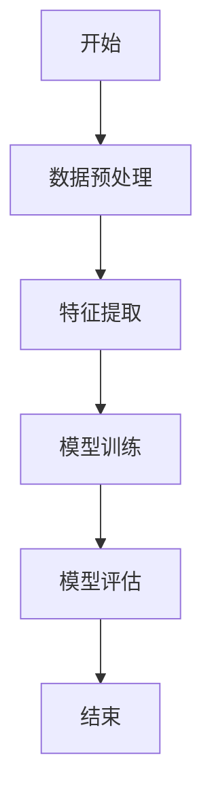
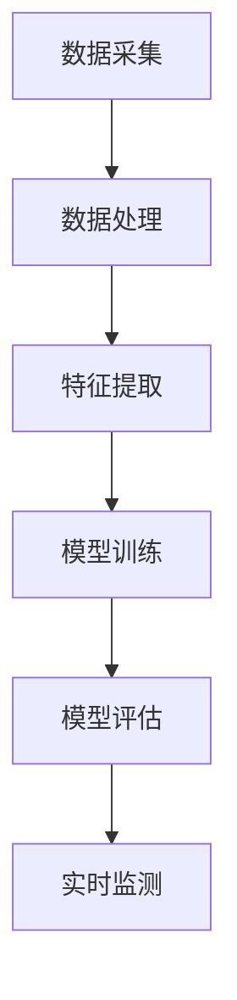
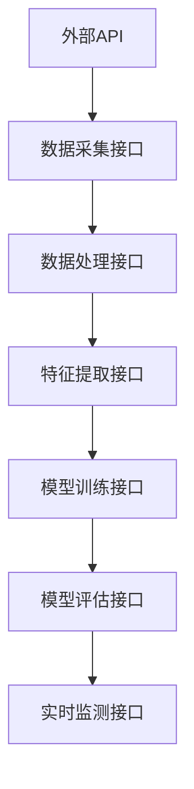
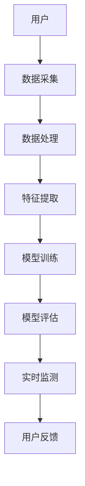

                 


### AI在反洗钱模式识别中的深度应用研究

关键词：人工智能、反洗钱、深度学习、模式识别、算法

摘要：本文详细探讨了人工智能在反洗钱（AML）模式识别中的深度应用。通过对AI与AML的基本概念介绍，深入分析了机器学习和深度学习在AML中的应用技术，展示了实际案例中的成功应用，并对系统设计和未来研究方向进行了探讨。

## 引言

随着全球经济的快速发展，金融科技的应用日益广泛，反洗钱（Anti-Money Laundering，AML）的重要性也日益凸显。AML旨在防止和打击洗钱活动，保护金融系统的稳定性和合法性。然而，传统的反洗钱手段往往依赖于人工审核和数据筛查，效率低下且容易出现误判。

近年来，人工智能（AI）技术的快速发展为反洗钱领域带来了新的机遇。AI，特别是机器学习和深度学习技术，能够在海量数据中快速识别模式，提高检测效率和准确性。本文将深入探讨AI在反洗钱模式识别中的深度应用，为金融行业提供新的解决方案。

## 第一部分：AI与反洗钱的基本概念

### 2.1 反洗钱的背景与重要性

反洗钱是指一系列旨在防止和打击洗钱活动的措施。洗钱是指将非法所得通过一系列复杂的金融交易转化为看似合法的资金。洗钱活动不仅侵犯了法律，而且还会给金融系统带来巨大的风险，包括资金流动的不稳定性、金融犯罪的增加以及国家安全的威胁。

### 2.2 人工智能的基本概念

人工智能是指使计算机系统能够模拟人类智能行为的技术。人工智能包括多个子领域，如机器学习、自然语言处理、计算机视觉等。在这些子领域中，机器学习和深度学习是近年来最为活跃且应用广泛的技术。

### 2.3 AI与反洗钱的关键概念

AI与反洗钱的结合主要体现在以下几个方面：

1. **模式识别**：AI系统可以分析大量交易数据，识别异常模式和可疑活动。
2. **自动化分析**：AI可以自动化筛查和分析数据，减少人工干预，提高效率。
3. **实时监测**：AI系统可以实时监测交易活动，及时识别和报告可疑行为。
4. **风险评估**：AI可以基于历史数据和模型，对交易进行风险评估，帮助金融机构制定更有效的风险管理策略。

## 第二部分：AI在反洗钱中的核心技术

### 3.1 机器学习技术在反洗钱中的应用

机器学习技术在反洗钱中的应用主要包括以下几个方面：

1. **分类算法**：通过分类算法，可以将正常交易与可疑交易区分开来。常用的分类算法包括支持向量机（SVM）、决策树（Decision Tree）、随机森林（Random Forest）等。
2. **聚类算法**：聚类算法可以将相似交易分组，帮助识别潜在的洗钱活动。常用的聚类算法包括K-means、层次聚类（Hierarchical Clustering）等。
3. **异常检测**：异常检测算法用于识别与历史行为显著不同的交易，常用的算法包括孤立森林（Isolation Forest）、Local Outlier Factor（LOF）等。

### 3.2 深度学习技术在反洗钱中的应用

深度学习技术在反洗钱中的应用主要体现在以下几个方面：

1. **卷积神经网络（CNN）**：CNN在图像识别方面表现出色，可以用于交易图像的分析，如信用卡交易的图像识别。
2. **循环神经网络（RNN）**：RNN在处理序列数据方面有优势，可以用于分析交易序列，识别潜在的洗钱活动。
3. **生成对抗网络（GAN）**：GAN可以生成真实的交易数据，用于训练模型，提高模型的鲁棒性。

### 3.3 特征提取与选择策略

特征提取与选择是机器学习和深度学习模型的关键步骤。在反洗钱中，特征的选择和提取直接影响模型的性能。常用的特征提取方法包括：

1. **统计特征**：如交易金额、交易频率、交易时间等。
2. **文本特征**：如交易描述、账户名称等。
3. **图像特征**：如交易图像的颜色、形状等。

特征选择策略包括：

1. **过滤法**：通过统计方法筛选出具有显著差异的特征。
2. **包裹法**：通过迭代方法筛选特征子集，选择最优特征组合。
3. **嵌入法**：通过模型训练自动学习特征重要性。

## 第三部分：AI在反洗钱中的实际应用案例

### 4.1 银行业务中的AI反洗钱应用

银行业是金融行业的重要组成部分，也是反洗钱工作的重点领域。AI技术在银行业务中的反洗钱应用主要包括：

1. **自动化交易监测**：通过AI系统自动化监测交易行为，及时发现异常交易。
2. **客户风险评估**：基于客户的交易历史和特征，使用AI模型评估客户的风险等级，为风险管理提供支持。
3. **交易分类**：使用AI模型对交易进行分类，区分正常交易和可疑交易。

### 4.2 电子商务中的AI反洗钱应用

电子商务的快速发展为洗钱活动提供了新的渠道。AI技术在电子商务中的反洗钱应用主要包括：

1. **支付监控**：通过AI系统监控支付行为，识别异常支付模式。
2. **用户行为分析**：分析用户的购物行为，识别潜在的风险用户。
3. **风险评分**：使用AI模型对用户进行风险评分，为支付策略提供支持。

### 4.3 金融科技中的AI反洗钱应用

金融科技（FinTech）的崛起为金融行业带来了新的机遇和挑战。AI技术在金融科技中的反洗钱应用主要包括：

1. **区块链监控**：通过AI系统监控区块链交易，识别潜在的洗钱活动。
2. **智能合约审计**：使用AI系统对智能合约进行审计，确保合约的合法性。
3. **风险预测**：使用AI模型预测未来的风险趋势，为金融科技企业提供风险预警。

## 第四部分：系统设计与实现

### 5.1 系统设计

反洗钱系统的设计需要考虑以下几个方面：

1. **数据采集**：收集金融机构的交易数据、客户信息等。
2. **数据处理**：对采集到的数据进行清洗、去重、归一化等预处理。
3. **特征提取**：提取与交易行为相关的特征。
4. **模型训练**：使用机器学习或深度学习算法训练模型。
5. **模型评估**：评估模型的性能，调整模型参数。
6. **实时监测**：实时监测交易行为，识别可疑交易。

### 5.2 系统实现

反洗钱系统的实现包括以下几个步骤：

1. **环境搭建**：搭建机器学习或深度学习的开发环境。
2. **数据预处理**：编写代码进行数据清洗、去重、归一化等预处理。
3. **模型训练**：编写代码训练机器学习或深度学习模型。
4. **模型评估**：编写代码评估模型的性能。
5. **系统集成**：将模型集成到金融系统的交易监测模块。
6. **部署上线**：将系统部署到生产环境，进行实时监测。

## 第五部分：挑战与未来方向

### 6.1 技术挑战

AI在反洗钱中的应用面临以下技术挑战：

1. **数据质量**：反洗钱系统的性能很大程度上取决于数据质量。数据的不完整、不一致或噪声会影响模型的准确性。
2. **模型解释性**：深度学习模型通常具有很高的准确性，但其内部机制复杂，缺乏解释性，难以被非技术人士理解。
3. **计算资源**：深度学习模型的训练通常需要大量的计算资源，对硬件性能有较高的要求。

### 6.2 伦理与法律挑战

AI在反洗钱中的应用也面临伦理和法律挑战：

1. **隐私保护**：反洗钱系统需要处理大量的个人数据，需要确保数据的安全和隐私。
2. **责任归属**：当AI系统出现误判时，责任归属难以界定。
3. **监管合规**：AI系统的应用需要遵守相关的法律法规，确保其合法性。

### 6.3 未来方向

未来，AI在反洗钱中的应用将朝着以下方向发展：

1. **智能化升级**：通过不断优化算法和模型，提高系统的智能化水平。
2. **跨领域合作**：与法律、金融、技术等领域进行合作，共同推动反洗钱技术的发展。
3. **法律法规完善**：完善相关的法律法规，为AI在反洗钱中的应用提供法律保障。

## 结论

人工智能在反洗钱模式识别中的应用具有重要意义。通过机器学习和深度学习技术，AI系统能够在海量数据中快速识别模式，提高反洗钱工作的效率和准确性。未来，随着AI技术的不断发展，反洗钱领域将迎来更多的创新和变革。

### 附录

#### 附录A：核心概念原理与联系

| 核心概念 | 概念属性特征对比 | ER实体关系图 |
| --- | --- | --- |
| 机器学习 | 基于数据的预测和决策 |  |

#### 附录B：算法原理讲解

##### 算法流程图



##### 算法原理

```python
# 数据预处理
def preprocess_data(data):
    # 数据清洗、去重、归一化等操作
    pass

# 特征提取
def extract_features(data):
    # 提取交易金额、交易频率等特征
    pass

# 模型训练
def train_model(features, labels):
    # 使用机器学习算法训练模型
    pass

# 模型评估
def evaluate_model(model, test_data):
    # 评估模型性能
    pass
```

##### 数学公式

```latex
$$
y = \sum_{i=1}^{n} w_i \cdot x_i + b
$$
```

#### 附录C：系统分析与架构设计方案

##### 项目介绍

反洗钱系统旨在通过AI技术提高金融机构的交易监测能力，防范洗钱风险。

##### 系统功能设计

| 功能模块 | 功能描述 |
| --- | --- |
| 数据采集 | 从金融机构获取交易数据 |
| 数据处理 | 对交易数据进行清洗、去重、归一化等预处理 |
| 特征提取 | 提取与交易行为相关的特征 |
| 模型训练 | 使用机器学习算法训练反洗钱模型 |
| 模型评估 | 评估模型性能，调整模型参数 |
| 实时监测 | 实时监测交易行为，识别可疑交易 |

##### 系统架构设计



##### 系统接口设计



##### 系统交互



### 最佳实践 Tips

1. **数据质量至关重要**：确保数据的质量和准确性是AI系统成功的关键。
2. **模型解释性不可忽视**：为了提高模型的接受度，需要确保模型具有可解释性。
3. **持续优化**：定期评估和优化模型，以提高系统的性能和准确性。

### 小结

AI在反洗钱模式识别中的应用具有重要意义，通过机器学习和深度学习技术，可以显著提高反洗钱工作的效率和准确性。未来，随着AI技术的不断发展，反洗钱领域将迎来更多的创新和变革。

### 注意事项

1. **数据隐私保护**：在处理个人数据时，需要严格遵守相关的法律法规，确保数据的安全和隐私。
2. **系统稳定性**：确保AI系统在实时监测中的稳定性，避免出现误判或漏判。

### 拓展阅读

1. **《深度学习》**：Ian Goodfellow、Yoshua Bengio、Aaron Courville 著
2. **《机器学习实战》**：Peter Harrington 著
3. **《反洗钱与反恐怖融资》**：陈炜 著

### 作者信息

作者：AI天才研究院/AI Genius Institute & 禅与计算机程序设计艺术 /Zen And The Art of Computer Programming

