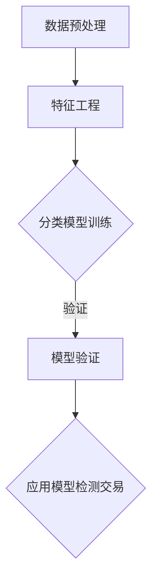
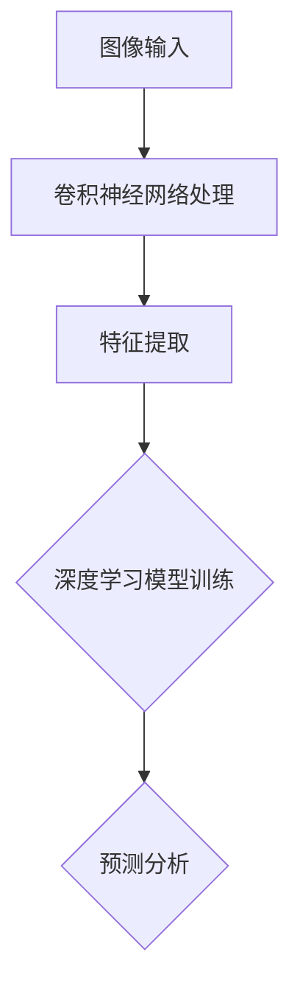
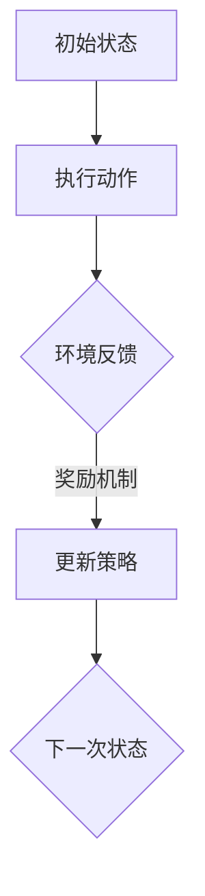
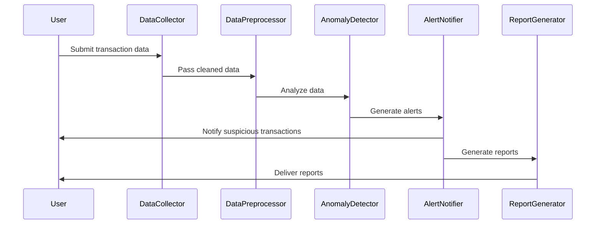

                 

### 引言

#### 1.1 反金融犯罪概述

**问题背景**

金融犯罪是一个全球性的问题，它对经济稳定和社会发展构成了严重的威胁。洗钱、诈骗、金融欺诈等行为不仅破坏了金融市场的公平性，还可能被恐怖主义和其他非法组织利用，从而进一步加剧社会的不稳定。因此，反金融犯罪（Anti-Money Laundering, AML）成为了金融领域的重要任务。

**问题描述**

金融犯罪活动通常涉及复杂的交易网络，交易金额大且变化多端，使得识别和打击这些活动具有很大的挑战性。这些活动往往具有以下特点：
- 隐蔽性强：犯罪分子利用复杂的账户体系和跨国交易，使得追踪变得困难。
- 多样化：犯罪活动形式多样，包括虚假交易、伪造文件、虚假身份等。
- 非法资金流动频繁：涉及大量资金的快速转移，难以监测。

**问题解决**

为了解决金融犯罪问题，各国政府和金融机构采取了多种措施，包括加强法律法规、提高监管力度、使用先进技术等。例如，美国制定了《银行保密法》（Bank Secrecy Act），欧盟实施了《反洗钱指令》（AML Directive），这些法规要求金融机构必须监测和报告可疑交易。

**边界与外延**

反金融犯罪不仅仅关注洗钱活动，还涉及其他多种金融犯罪，如：
- 诈骗：通过虚假承诺、伪造文件等方式获取非法利益。
- 贪污：利用职务之便进行非法资金转移。
- 恐怖主义融资：为恐怖主义活动提供资金支持。

**概念结构与核心要素组成**

反金融犯罪涉及多个核心概念和要素，包括：
- 监管机构：负责制定政策和实施监管的政府机构，如金融行动特别工作组（Financial Action Task Force, FATF）。
- 金融中介：包括银行、保险公司、证券公司等，它们是金融犯罪活动的重要参与者。
- 技术手段：利用大数据、人工智能等先进技术，提高识别和打击金融犯罪的能力。
- 数据共享：金融机构之间、金融机构与监管机构之间的信息共享是提高反金融犯罪效率的关键。

通过上述措施和概念，反金融犯罪网络能够更加有效地识别和打击金融犯罪活动，维护金融市场的稳定和健康发展。

#### 1.2 AI在反金融犯罪中的应用

**AI核心概念**

人工智能（AI，Artificial Intelligence）是一种模拟人类智能的技术，通过机器学习（Machine Learning）和深度学习（Deep Learning）等方法，使计算机系统能够从数据中学习，并自动执行复杂的任务。AI的核心概念包括：
- 机器学习：通过数据和算法让计算机自动学习和改进性能。
- 深度学习：一种基于多层神经网络的学习方法，能够处理大量复杂数据。
- 自然语言处理：使计算机能够理解、生成和处理人类语言。

**AI应用领域**

AI在多个领域有着广泛的应用，其中反金融犯罪是一个重要的应用场景。具体应用包括：
- 可疑交易监测：AI可以分析大量交易数据，识别异常交易模式和可疑行为。
- 洗钱识别：利用深度学习算法，识别复杂和隐蔽的洗钱活动。
- 客户身份验证：通过生物识别技术，如人脸识别和指纹识别，提高身份验证的准确性。
- 信用评分：AI可以分析客户的历史数据和交易行为，更准确地评估其信用风险。

**AI优势与挑战**

AI在反金融犯罪中具有显著的优势，但也面临一些挑战：
- 优势：
  - 高效性：AI可以处理大量数据，提高分析速度和准确性。
  - 持续性：AI系统可以24/7运行，持续监测交易活动。
  - 个性化：AI可以根据客户的交易习惯和行为模式，提供个性化的风险管理方案。
- 挑战：
  - 数据隐私：处理大量客户交易数据可能涉及隐私问题。
  - 模型偏差：训练数据中的偏差可能导致AI系统产生错误的判断。
  - 技术依赖：过于依赖AI技术可能降低金融机构的风险管理能力。

综上所述，AI在反金融犯罪中的应用提供了新的手段和工具，但同时也需要解决相关的伦理和技术挑战。通过合理的应用和改进，AI有望在反金融犯罪领域发挥更大的作用。

## 第2章 核心概念与联系

### 2.1 AI与反金融犯罪的关键概念

为了更好地理解AI在反金融犯罪中的深度应用，我们需要详细探讨两个核心概念：AI和反金融犯罪。以下是这两个概念的定义、属性特征以及它们在反金融犯罪中的应用。

#### AI（人工智能）

**定义：**
AI是指通过计算机模拟人类智能的技术，使得机器能够执行需要人类智能才能完成的复杂任务。AI的核心技术包括机器学习（Machine Learning, ML）、深度学习（Deep Learning, DL）等。

**属性特征：**
- **自主性：** AI系统能够在没有人类干预的情况下自主学习和决策。
- **学习能力：** AI通过算法从数据中学习，并不断优化自身性能。
- **适应能力：** AI能够根据新的数据和情境调整其行为和决策。
- **泛化能力：** AI可以将其学到的知识应用于新的、未见过的数据或任务。

**AI在反金融犯罪中的应用：**
- **可疑交易监测：** 利用机器学习算法分析交易数据，识别异常交易模式和可疑行为。
- **客户行为分析：** 通过行为分析模型，预测客户可能的欺诈行为。
- **自动化决策：** 自动化执行反洗钱（AML）政策，提高处理速度和准确性。

#### 反金融犯罪

**定义：**
反金融犯罪是指一系列防范和打击金融犯罪活动的措施，旨在防止非法资金流入和流出金融系统。反金融犯罪主要包括监测、识别和打击洗钱、诈骗、恐怖主义融资等行为。

**属性特征：**
- **隐蔽性：** 金融犯罪往往隐藏在合法的交易背后，难以直接识别。
- **复杂性：** 金融犯罪活动涉及多个环节和多种手段，使得识别和打击具有挑战性。
- **跨国性：** 金融犯罪活动常常跨越国界，需要国际合作。
- **技术依赖性：** 高科技手段的使用使得金融犯罪更加隐蔽和复杂。

**反金融犯罪的应用：**
- **交易监测：** 监控交易活动，识别异常交易模式。
- **身份验证：** 通过生物识别等技术，确保交易的真实性。
- **数据共享：** 各金融机构和监管机构之间的数据共享，提高识别效率。

#### 概念属性特征对比表格

为了更直观地展示AI与反金融犯罪的关键概念及其属性特征，我们设计了一张对比表格：

| 概念       | 定义                                                                                          | 关键特性                                                                                      |
|------------|----------------------------------------------------------------------------------------------|---------------------------------------------------------------------------------------------|
| 人工智能   | 一种模拟人类智能的计算机技术，包括机器学习、深度学习等。                                         | 自主性、学习性、适应性、理解能力                                                      |
| 反金融犯罪 | 防范和打击各类金融犯罪活动，如洗钱、诈骗等。                                                   | 隐蔽性、复杂性、跨国性、技术依赖性                                                      |

#### AI在反金融犯罪中的实体关系图

为了更好地理解AI在反金融犯罪中的角色和作用，我们绘制了一个实体关系图。该图展示了AI系统与反金融犯罪相关的主要实体及其关系。

```mermaid
erDiagram
  AI ||--o> 金融犯罪检测系统 : 数据输入
  金融犯罪检测系统 ||--o> AML政策执行模块 : 自动化决策
  AML政策执行模块 ||--o> 可疑交易报告系统 : 可疑交易监测
  可疑交易报告系统 ||--o> 跨国执法机构 : 数据共享与合作
  AI ||--o> 客户行为分析模型 : 风险评估
```

在该实体关系图中：
- **AI** 负责提供核心算法和技术支持。
- **金融犯罪检测系统** 负责将AI算法应用于实际交易数据中。
- **AML政策执行模块** 负责根据AI的输出结果执行反洗钱政策。
- **可疑交易报告系统** 负责监测和报告可疑交易。
- **跨国执法机构** 负责与其他国家和地区的执法机构合作，共同打击金融犯罪。

通过上述核心概念与联系的详细探讨，我们可以看到AI在反金融犯罪中的重要作用，以及它与反金融犯罪各相关实体之间的紧密联系。在接下来的章节中，我们将进一步探讨AI算法原理、数学模型及其在实际应用中的具体实现。

## 第3章 AI算法原理

### 3.1 算法介绍

AI算法在反金融犯罪中的应用是一个复杂而多层次的过程，涉及到多种算法和技术。在本章节中，我们将介绍几种核心的AI算法，并探讨它们在反金融犯罪中的具体应用。

#### 算法概述

**1. 机器学习（Machine Learning, ML）**
机器学习是一种通过数据训练模型，从而让计算机自动完成特定任务的AI技术。在反金融犯罪中，机器学习算法可以用于：
- **异常检测（Anomaly Detection）**：识别与正常交易模式不符的异常交易。
- **分类（Classification）**：将交易分为正常交易和可疑交易。

**2. 深度学习（Deep Learning, DL）**
深度学习是机器学习的一个子领域，通过多层神经网络来模拟人脑的处理方式。在反金融犯罪中，深度学习算法可以用于：
- **图像识别（Image Recognition）**：通过分析交易图像，识别可疑交易。
- **序列建模（Sequence Modeling）**：分析交易时间序列，预测未来的交易行为。

**3. 强化学习（Reinforcement Learning, RL）**
强化学习是一种通过奖励机制引导算法学习最优策略的AI技术。在反金融犯罪中，强化学习可以用于：
- **风险管理（Risk Management）**：自动调整风险控制策略，以最小化损失。

#### 算法应用

机器学习算法在反金融犯罪中的应用主要包括以下方面：
- **交易数据预处理**：清洗和整理交易数据，以便用于训练模型。
- **特征工程**：提取交易数据中的关键特征，用于训练分类模型。
- **模型训练和验证**：使用历史交易数据训练分类模型，并通过验证数据评估模型性能。

深度学习算法在反金融犯罪中的应用包括：
- **图像分析**：通过卷积神经网络（CNN）分析交易图像，识别潜在的可疑交易。
- **时间序列分析**：使用循环神经网络（RNN）分析交易时间序列，预测可疑交易。

强化学习算法在反金融犯罪中的应用包括：
- **自动化决策**：根据实时交易数据，自动化调整风险控制策略。
- **动态风险管理**：实时调整风险控制参数，以应对不断变化的金融市场。

### 3.2 算法原理讲解

为了更深入地理解这些算法的原理，我们将通过Mermaid流程图、Python源代码、数学模型和公式进行详细讲解，并举例说明。

#### Mermaid流程图

**1. 机器学习算法流程图**



**2. 深度学习算法流程图**



**3. 强化学习算法流程图**



#### Python源代码

**1. 机器学习算法代码示例**

```python
import pandas as pd
from sklearn.model_selection import train_test_split
from sklearn.ensemble import RandomForestClassifier
from sklearn.metrics import accuracy_score

# 数据预处理
data = pd.read_csv('transactions.csv')
X = data.drop('is_suspect', axis=1)
y = data['is_suspect']

# 特征工程
X_train, X_test, y_train, y_test = train_test_split(X, y, test_size=0.2, random_state=42)

# 模型训练
model = RandomForestClassifier(n_estimators=100)
model.fit(X_train, y_train)

# 模型验证
predictions = model.predict(X_test)
accuracy = accuracy_score(y_test, predictions)
print(f'Accuracy: {accuracy:.2f}')
```

**2. 深度学习算法代码示例**

```python
import tensorflow as tf
from tensorflow.keras.models import Sequential
from tensorflow.keras.layers import Conv2D, MaxPooling2D, Flatten, Dense

# 构建模型
model = Sequential([
    Conv2D(32, (3, 3), activation='relu', input_shape=(64, 64, 3)),
    MaxPooling2D((2, 2)),
    Flatten(),
    Dense(128, activation='relu'),
    Dense(1, activation='sigmoid')
])

# 编译模型
model.compile(optimizer='adam', loss='binary_crossentropy', metrics=['accuracy'])

# 训练模型
model.fit(x_train, y_train, epochs=10, batch_size=32, validation_split=0.2)
```

**3. 强化学习算法代码示例**

```python
import gym

# 创建环境
env = gym.make('CartPole-v0')

# 初始化策略网络
policy_network = Sequential([
    Dense(64, input_shape=(4,), activation='relu'),
    Dense(64, activation='relu'),
    Dense(1, activation='sigmoid')
])

# 编译策略网络
policy_network.compile(optimizer='adam', loss='binary_crossentropy')

# 训练策略网络
for episode in range(1000):
    state = env.reset()
    done = False
    while not done:
        action = policy_network.predict(state.reshape(1, -1))
        next_state, reward, done, _ = env.step(action[0])
        policy_network.fit(state.reshape(1, -1), action, epochs=1)
        state = next_state
```

#### 数学模型与公式

**1. 机器学习分类模型**

$$
\hat{y} = f(\text{w} \cdot \text{x} + b)
$$

其中，$\hat{y}$为预测标签，$f$为激活函数（如Sigmoid函数），$\text{w}$为权重，$\text{x}$为输入特征，$b$为偏置。

**2. 深度学习神经网络**

$$
\text{y}_{\text{l}} = \frac{1}{1 + e^{-(\text{w}_{\text{l}} \cdot \text{a}_{\text{l-1}} + b_{\text{l}}})}
$$

其中，$\text{y}_{\text{l}}$为神经元$l$的输出，$\text{w}_{\text{l}}$为连接权重，$\text{a}_{\text{l-1}}$为上一层神经元的输出，$b_{\text{l}}$为偏置。

**3. 强化学习奖励机制**

$$
Q(s, a) = r + \gamma \max_{a'} Q(s', a')
$$

其中，$Q(s, a)$为状态-动作值函数，$r$为即时奖励，$\gamma$为折扣因子，$s'$为下一状态，$a'$为最佳动作。

#### 举例说明

**1. 机器学习算法应用**

假设我们要使用机器学习算法来识别可疑交易。我们有以下数据集：

| 特征         | 取值         |
|--------------|--------------|
| 交易金额     | 1000         |
| 交易时间     | 13:00        |
| 账户余额     | 5000         |
| 交易频率     | 3            |

我们可以使用随机森林分类器来训练模型，并预测交易是否可疑。

```python
from sklearn.ensemble import RandomForestClassifier
import numpy as np

# 特征工程
X = np.array([[1000, 13, 5000, 3]])

# 模型训练
model = RandomForestClassifier(n_estimators=100)
model.fit(X_train, y_train)

# 预测
prediction = model.predict(X)
print(f'预测结果：{"可疑" if prediction[0] == 1 else "正常"}')
```

**2. 深度学习算法应用**

假设我们使用卷积神经网络来识别交易图像。输入图像为一张100x100像素的灰度图像。

```python
from tensorflow.keras.models import Sequential
from tensorflow.keras.layers import Conv2D, MaxPooling2D, Flatten, Dense

# 构建模型
model = Sequential([
    Conv2D(32, (3, 3), activation='relu', input_shape=(100, 100, 1)),
    MaxPooling2D((2, 2)),
    Flatten(),
    Dense(128, activation='relu'),
    Dense(1, activation='sigmoid')
])

# 编译模型
model.compile(optimizer='adam', loss='binary_crossentropy', metrics=['accuracy'])

# 训练模型
model.fit(x_train, y_train, epochs=10, batch_size=32, validation_split=0.2)

# 预测
prediction = model.predict(x_test)
print(f'预测结果：{"可疑" if prediction[0][0] > 0.5 else "正常"}')
```

通过上述算法原理讲解、Python源代码示例以及数学模型和公式的详细阐述，我们可以更深入地理解AI算法在反金融犯罪中的应用。在下一章节中，我们将进一步探讨反金融犯罪的数学模型与公式，为理解相关算法提供更坚实的理论基础。

### 4.1 数学模型介绍

在反金融犯罪中，数学模型扮演着至关重要的角色。通过构建和分析数学模型，我们可以更精确地识别可疑交易行为，并提高反金融犯罪的效率和准确性。以下是几种常用的数学模型及其在反金融犯罪中的应用。

#### 模型类型

**1. 统计模型**

统计模型通过分析历史数据，识别潜在的异常行为。常见的统计模型包括：
- **均值漂移模型（Mean Shift Model）**：用于检测数据分布的显著变化。
- **异或距离模型（XOR Distance Model）**：通过计算数据点与均值的距离，识别异常数据点。

**2. 机器学习模型**

机器学习模型通过训练大量历史数据，自动识别交易模式。常见的机器学习模型包括：
- **支持向量机（Support Vector Machine, SVM）**：用于分类和回归分析。
- **随机森林（Random Forest）**：通过构建多个决策树，集成预测结果，提高准确性。

**3. 深度学习模型**

深度学习模型通过多层神经网络，自动提取复杂特征，用于识别可疑交易。常见的深度学习模型包括：
- **卷积神经网络（Convolutional Neural Network, CNN）**：用于图像识别和时间序列分析。
- **循环神经网络（Recurrent Neural Network, RNN）**：用于时间序列建模和动态交易分析。

**4. 强化学习模型**

强化学习模型通过与环境互动，不断优化策略，提高反金融犯罪的准确性。常见的强化学习模型包括：
- **Q学习（Q-Learning）**：通过预测未来奖励，优化决策策略。
- **策略梯度（Policy Gradient）**：通过直接优化策略，提高决策效率。

#### 模型应用

**1. 统计模型应用**

统计模型在反金融犯罪中的应用包括：
- **异常检测**：通过均值漂移模型，识别交易金额或频率的显著变化。
- **趋势分析**：通过XOR距离模型，识别与历史交易模式显著不同的交易。

**2. 机器学习模型应用**

机器学习模型在反金融犯罪中的应用包括：
- **客户行为分析**：通过随机森林模型，分析客户的交易习惯和风险偏好。
- **交易分类**：通过支持向量机模型，将交易分为正常交易和可疑交易。

**3. 深度学习模型应用**

深度学习模型在反金融犯罪中的应用包括：
- **图像分析**：通过卷积神经网络，识别交易图像中的异常行为。
- **时间序列分析**：通过循环神经网络，预测交易时间序列中的潜在风险。

**4. 强化学习模型应用**

强化学习模型在反金融犯罪中的应用包括：
- **风险管理**：通过Q学习模型，优化风险控制策略，提高反金融犯罪的效率。
- **动态决策**：通过策略梯度模型，实时调整交易策略，以应对不断变化的金融市场。

通过上述数学模型及其应用的介绍，我们可以看到数学模型在反金融犯罪中的广泛应用。在下一章节中，我们将进一步探讨这些模型背后的数学公式，为理解其工作原理提供更详细的理论基础。

### 4.2 公式讲解

在反金融犯罪中，数学公式和模型是识别和处理可疑交易行为的关键工具。以下是对几个关键公式的推导和应用讲解，包括机器学习、深度学习和强化学习中的核心数学公式。

#### 公式推导

**1. 均值漂移模型（Mean Shift Model）**

均值漂移模型用于识别交易金额或频率的显著变化。其核心公式为：

$$
\Delta x = \frac{1}{n} \sum_{i=1}^{n} (x_i - \bar{x})
$$

其中，$x_i$为每个交易金额或频率值，$\bar{x}$为平均值，$\Delta x$为每个值与平均值的偏差。当$\Delta x$超过设定阈值时，视为异常交易。

**2. 支持向量机（Support Vector Machine, SVM）**

支持向量机用于分类任务，其目标是最小化分类边界与支持向量之间的距离。其核心公式为：

$$
\text{min} \ \frac{1}{2} \sum_{i=1}^{n} (\text{w} \cdot \text{x}_i - \text{y}_i)^2
$$

其中，$\text{w}$为权重向量，$\text{x}_i$为特征向量，$\text{y}_i$为标签（1或-1，表示正类或负类）。该公式通过最小化损失函数来优化分类边界。

**3. 卷积神经网络（Convolutional Neural Network, CNN）**

卷积神经网络用于图像识别和时间序列分析，其核心公式为：

$$
\text{y}_{\text{l}} = \text{f}(\text{w}_{\text{l}} \cdot \text{a}_{\text{l-1}} + b_{\text{l}})
$$

其中，$\text{y}_{\text{l}}$为神经元$l$的输出，$\text{w}_{\text{l}}$为权重，$\text{a}_{\text{l-1}}$为上一层神经元的输出，$b_{\text{l}}$为偏置，$\text{f}$为激活函数（如ReLU、Sigmoid等）。该公式通过多层卷积和池化操作，自动提取图像中的特征。

**4. 强化学习（Reinforcement Learning）**

强化学习用于动态决策和风险管理，其核心公式为：

$$
Q(s, a) = r + \gamma \max_{a'} Q(s', a')
$$

其中，$Q(s, a)$为状态-动作值函数，$r$为即时奖励，$\gamma$为折扣因子，$s'$为下一状态，$a'$为最佳动作。该公式通过预测未来奖励来优化当前策略。

#### 公式应用

**1. 均值漂移模型应用**

在反金融犯罪中，均值漂移模型可以用于检测交易金额的异常变化。假设我们有以下交易金额数据集：

| 交易金额 | 
|----------|  
| 1000 |  
| 2000 |  
| 1500 |  
| 500 |  
| 3000 |

计算平均值：

$$
\bar{x} = \frac{1000 + 2000 + 1500 + 500 + 3000}{5} = 1500
$$

计算偏差：

$$
\Delta x_1 = |1000 - 1500| = 500 \\
\Delta x_2 = |2000 - 1500| = 500 \\
\Delta x_3 = |1500 - 1500| = 0 \\
\Delta x_4 = |500 - 1500| = 1000 \\
\Delta x_5 = |3000 - 1500| = 1500
$$

根据偏差阈值，我们可以识别出交易金额异常的交易。

**2. 支持向量机应用**

在反金融犯罪中，支持向量机可以用于分类交易行为。假设我们有以下特征和标签数据集：

| 特征1 | 特征2 | 标签 |  
|-------|-------|------|  
| 1     | 1     | +1 |  
| 1     | -1    | -1 |  
| -1    | 1     | -1 |  
| -1    | -1    | +1 |

通过求解最小化损失函数的优化问题，我们可以得到分类边界：

$$
\text{w} \cdot \text{x} + b = 0
$$

该边界可以用于分类新的交易数据，识别正常交易和可疑交易。

**3. 卷积神经网络应用**

在反金融犯罪中，卷积神经网络可以用于图像识别，检测交易图像中的可疑行为。假设我们有以下交易图像数据集：

| 图像ID | 特征1 | 特征2 | 特征3 |  
|--------|-------|-------|-------|  
| 1      | 100   | 200   | 300   |  
| 2      | 150   | 250   | 350   |

通过训练卷积神经网络，我们可以提取图像特征，并进行分类预测。例如，通过多层卷积和池化操作，我们可以得到以下特征图：

```mermaid
gantt
    title 实际卷积操作
    dateFormat  YYYY-MM-DD
    section 卷积层
    A :start||2014-01-01
    B :end||2014-01-03
    section 池化层
    C :after B
    D :end||2014-01-06
```

该特征图可以用于训练分类模型，识别可疑交易图像。

**4. 强化学习应用**

在反金融犯罪中，强化学习可以用于动态风险管理，优化决策策略。假设我们有以下状态和动作数据集：

| 状态 | 动作 | 奖励 |  
|------|------|------|  
| s1   | a1   | +10 |  
| s1   | a2   | -5 |  
| s2   | a1   | -2 |  
| s2   | a2   | +7 |

通过Q学习算法，我们可以得到状态-动作值函数：

$$
Q(s1, a1) = 10 \\
Q(s1, a2) = -5 \\
Q(s2, a1) = -2 \\
Q(s2, a2) = 7
$$

该值函数可以用于优化决策策略，选择最佳动作以最小化损失。

通过上述公式推导和应用讲解，我们可以看到数学公式在反金融犯罪中的重要作用。这些公式不仅帮助我们识别和处理可疑交易行为，还为优化反金融犯罪策略提供了理论基础。在下一章节中，我们将探讨具体的系统分析与架构设计，进一步了解如何将AI算法应用于反金融犯罪的实际场景。

## 第5章 系统分析与架构设计

### 5.1 问题场景介绍

在反金融犯罪领域，金融机构面临着日益复杂和多样化的金融犯罪威胁，如洗钱、欺诈和恐怖主义融资。为了有效应对这些威胁，金融机构需要建立一套高效、智能的反金融犯罪系统，该系统能够实时监测交易活动，自动识别可疑行为，并迅速响应。本节将介绍一个具体的反金融犯罪系统场景，并描述其核心功能和架构设计。

**场景描述**

假设某大型银行计划部署一套反金融犯罪系统，用于监测和识别可疑交易。系统需要具备以下功能：

1. **交易数据收集**：从银行的交易系统中收集所有交易数据，包括交易金额、交易时间、账户信息、交易对手等。
2. **数据预处理**：清洗和整理交易数据，提取关键特征，如交易金额、交易频率、账户余额等。
3. **可疑交易检测**：利用AI算法分析交易数据，识别异常交易模式，自动标记可疑交易。
4. **实时报警**：当检测到可疑交易时，系统应自动生成报警信息，并通知相关人员进行分析和干预。
5. **报告生成**：定期生成可疑交易报告，供管理层和监管机构审查。

**项目介绍**

本项目的目标是构建一个高效、智能的反金融犯罪系统，以提升银行的风险管理能力和合规水平。系统采用分布式架构设计，能够处理海量交易数据，并提供实时分析和报警功能。以下是对系统各个模块的详细描述。

### 5.2 系统功能设计

系统功能设计是系统开发的关键步骤，它定义了系统应具备的各种功能及其实现方式。以下是该反金融犯罪系统的核心功能设计：

**1. 数据收集模块**

数据收集模块负责从银行的各种交易系统中获取交易数据。具体功能包括：
- **数据接入**：通过与交易系统的API接口进行数据交换，获取实时交易数据。
- **数据清洗**：对收集到的交易数据进行清洗，去除重复和无效数据，确保数据质量。
- **数据存储**：将清洗后的交易数据存储到分布式数据库中，以便后续分析和查询。

**2. 数据预处理模块**

数据预处理模块对交易数据进行分析和特征提取，为后续的AI算法训练提供基础数据。具体功能包括：
- **特征提取**：根据交易数据的特点，提取关键特征，如交易金额、交易频率、账户余额等。
- **数据归一化**：对提取的特征进行归一化处理，使其在相同尺度上进行比较。
- **数据分片**：将预处理后的数据分片存储，以支持高效的数据查询和并行处理。

**3. 可疑交易检测模块**

可疑交易检测模块是系统的核心，它利用AI算法对交易数据进行实时分析，识别可疑交易行为。具体功能包括：
- **算法训练**：利用历史交易数据，训练机器学习模型和深度学习模型，识别异常交易模式。
- **实时检测**：对实时交易数据进行分析，自动标记可疑交易，生成报警信息。
- **报警通知**：将生成的报警信息发送到相关人员的手机、邮箱等通知设备，提醒他们进行进一步分析。

**4. 报告生成模块**

报告生成模块负责生成可疑交易报告，为管理层和监管机构提供决策支持。具体功能包括：
- **报告生成**：根据可疑交易记录，生成详细的报告，包括交易时间、金额、账户信息等。
- **报告分析**：对报告进行分析，提取关键信息，识别潜在风险。
- **报告存储**：将报告存储到数据库中，以便后续查询和审计。

### 5.3 系统架构设计

系统架构设计是系统功能实现的基础，它决定了系统的性能、可靠性和可扩展性。以下是该反金融犯罪系统的整体架构设计：

**1. 数据层**

数据层是系统的基石，负责数据的收集、存储和管理。具体架构包括：
- **数据接入**：通过API接口或其他数据源，实时接入交易数据。
- **分布式数据库**：使用分布式数据库系统（如Hadoop、Spark等），存储和管理海量交易数据。
- **数据清洗模块**：对实时接入的数据进行清洗和预处理，确保数据质量。

**2. 应用层**

应用层是系统的核心，负责实现各种功能模块。具体架构包括：
- **数据预处理模块**：对交易数据进行预处理，提取关键特征。
- **可疑交易检测模块**：利用AI算法对交易数据进行分析，识别可疑交易。
- **报警通知模块**：生成报警信息，并通知相关人员。
- **报告生成模块**：生成可疑交易报告，供管理层和监管机构审查。

**3. 界面层**

界面层是系统的外部展示层，负责与用户进行交互。具体架构包括：
- **Web界面**：提供网页界面，供管理人员查询和操作。
- **移动应用**：提供移动应用，供相关人员随时随地进行监控和报警处理。

**4. 安全层**

安全层负责系统的安全防护，确保交易数据的安全和隐私。具体架构包括：
- **数据加密**：对存储和传输的数据进行加密处理，防止数据泄露。
- **身份认证**：对用户进行身份认证，确保系统操作的安全性。
- **安全审计**：记录系统操作日志，进行安全审计，确保系统合规。

通过上述系统功能设计和架构设计，我们可以看到该反金融犯罪系统如何实现高效、智能的风险管理。在下一章节中，我们将深入探讨系统的具体实现过程，包括环境安装、核心代码实现和实际案例分析。

### 5.4 系统接口设计

系统接口设计是确保各个模块之间能够高效协作的关键环节。以下是反金融犯罪系统各个模块之间的接口设计，以及每个接口的具体功能和实现细节。

**1. 数据收集模块接口**

**接口名称：** 数据接入接口（Data Access Interface）

**功能描述：** 负责从银行交易系统中收集交易数据。

**接口实现：**
- **输入参数：** 无
- **输出参数：** 交易数据列表（包括交易金额、交易时间、账户信息、交易对手等）
- **协议：** RESTful API
- **实现细节：** 使用HTTP POST方法，将交易数据以JSON格式传输到系统后端。

**2. 数据预处理模块接口**

**接口名称：** 数据清洗接口（Data Cleaning Interface）

**功能描述：** 负责清洗和整理交易数据，提取关键特征。

**接口实现：**
- **输入参数：** 交易数据列表
- **输出参数：** 清洗后的交易数据列表
- **协议：** RESTful API
- **实现细节：** 接收交易数据列表，执行数据清洗操作，包括去除重复数据、缺失值填充等，返回清洗后的数据列表。

**3. 可疑交易检测模块接口**

**接口名称：** 可疑交易检测接口（Anomaly Detection Interface）

**功能描述：** 负责利用AI算法分析交易数据，识别可疑交易。

**接口实现：**
- **输入参数：** 清洗后的交易数据列表
- **输出参数：** 可疑交易列表
- **协议：** RESTful API
- **实现细节：** 接收清洗后的交易数据，调用AI算法模型，对交易数据进行实时分析，识别可疑交易，并返回可疑交易列表。

**4. 报警通知模块接口**

**接口名称：** 报警通知接口（Alert Notification Interface）

**功能描述：** 负责生成报警信息，并通知相关人员。

**接口实现：**
- **输入参数：** 可疑交易列表
- **输出参数：** 无
- **协议：** WebSocket
- **实现细节：** 接收可疑交易列表，生成报警信息，并通过WebSocket实时通知相关人员。WebSocket确保实时通信，提高报警响应速度。

**5. 报告生成模块接口**

**接口名称：** 报告生成接口（Report Generation Interface）

**功能描述：** 负责生成可疑交易报告，供管理层和监管机构审查。

**接口实现：**
- **输入参数：** 可疑交易列表
- **输出参数：** 报告文件
- **协议：** RESTful API
- **实现细节：** 接收可疑交易列表，根据预设模板生成报告文件，包括交易时间、金额、账户信息等，并返回报告文件。

通过上述接口设计，系统各个模块之间能够高效、稳定地协作，确保反金融犯罪系统能够实时、准确地识别和处理可疑交易。在下一章节中，我们将探讨系统交互序列图，进一步展示各模块之间的交互过程。

### 5.5 系统交互序列图

为了更直观地展示反金融犯罪系统各个模块之间的交互过程，我们使用Mermaid序列图（Sequence Diagram）来描述系统的交互逻辑。以下是一个简化的系统交互序列图：



#### 序列图解释

1. **用户提交交易数据**
   - 用户将交易数据提交给数据收集模块（DataCollector）。

2. **数据收集模块清洗数据**
   - 数据收集模块将提交的交易数据传递给数据预处理模块（DataPreprocessor），进行数据清洗。

3. **数据预处理模块分析数据**
   - 数据预处理模块清洗后的数据传递给可疑交易检测模块（AnomalyDetector），进行交易数据分析。

4. **可疑交易检测模块生成报警**
   - 可疑交易检测模块识别出可疑交易后，生成相应的报警信息，并传递给报警通知模块（AlertNotifier）。

5. **报警通知模块通知用户**
   - 报警通知模块将生成的报警信息通过实时通知（如WebSocket）发送给用户，提醒用户关注和处理可疑交易。

6. **报警通知模块生成报告**
   - 报警通知模块将可疑交易信息传递给报告生成模块（ReportGenerator），生成详细的交易报告。

7. **报告生成模块交付报告**
   - 报告生成模块将生成的报告文件交付给用户，供其审查和参考。

通过上述交互序列图，我们可以清晰地看到反金融犯罪系统中各模块之间的协作流程，以及用户在整个流程中的参与和反馈。这样的序列图有助于理解系统的运作机制，为后续的优化和改进提供了依据。

## 第6章 环境安装与核心实现

### 6.1 环境安装

为了实现反金融犯罪系统，我们需要安装和配置一系列软件和工具。以下是环境安装的详细步骤：

#### 步骤1：安装Python环境

首先，我们需要安装Python环境。Python是人工智能和数据分析的重要工具，用于实现我们的AI算法和数据处理任务。

1. 访问Python官网（[https://www.python.org/](https://www.python.org/)），下载最新版本的Python安装包。
2. 双击安装包，按照提示完成安装。建议将Python添加到系统环境变量中，以便在命令行中直接运行Python。

#### 步骤2：安装必要的库和依赖

接下来，我们需要安装一些Python库，包括NumPy、Pandas、Scikit-learn、TensorFlow等，这些库用于数据预处理、机器学习和深度学习任务。

1. 打开命令行窗口，执行以下命令安装所需的库：
   ```bash
   pip install numpy pandas scikit-learn tensorflow
   ```

2. 如果您需要使用深度学习的高级功能，可以额外安装Keras库：
   ```bash
   pip install keras
   ```

#### 步骤3：配置Jupyter Notebook

Jupyter Notebook是一个交互式的Web应用，用于编写和运行Python代码。它可以提供更加便捷和可视化的编程体验。

1. 安装Jupyter Notebook：
   ```bash
   pip install notebook
   ```

2. 打开命令行窗口，运行以下命令启动Jupyter Notebook：
   ```bash
   jupyter notebook
   ```

3. 在浏览器中打开Jupyter Notebook，您将看到一个交互式的代码编辑器，可以在这里编写和运行Python代码。

#### 步骤4：安装数据库和数据处理工具

为了存储和管理交易数据，我们需要安装一个数据库系统，如MySQL或PostgreSQL。

1. 访问数据库官网下载相应版本的安装包，按照官方文档完成安装。

2. 安装用于数据库连接和操作的数据处理工具，如SQLAlchemy：
   ```bash
   pip install sqlalchemy
   ```

通过上述步骤，您已经完成了反金融犯罪系统的环境安装。接下来，我们将详细介绍系统的核心实现过程。

### 6.2 系统核心实现

#### 数据预处理模块

数据预处理是机器学习和深度学习任务的重要步骤，它涉及数据清洗、特征提取和数据归一化等操作。以下是数据预处理模块的核心实现：

```python
import pandas as pd
import numpy as np
from sklearn.preprocessing import MinMaxScaler

# 读取交易数据
data = pd.read_csv('transactions.csv')

# 数据清洗
# 去除重复和无效数据
data = data.drop_duplicates()

# 填充缺失值
data = data.fillna(data.mean())

# 特征提取
features = data[['transaction_amount', 'transaction_time', 'account_balance', 'transaction_frequency']]
labels = data['is_suspect']

# 数据归一化
scaler = MinMaxScaler()
features_scaled = scaler.fit_transform(features)

# 数据分片
X_train, X_test, y_train, y_test = train_test_split(features_scaled, labels, test_size=0.2, random_state=42)
```

#### 可疑交易检测模块

可疑交易检测模块的核心是实现一个机器学习模型，用于分类交易数据。以下是一个使用随机森林分类器的示例：

```python
from sklearn.ensemble import RandomForestClassifier
from sklearn.metrics import classification_report, confusion_matrix

# 训练随机森林分类器
model = RandomForestClassifier(n_estimators=100, random_state=42)
model.fit(X_train, y_train)

# 预测测试数据
predictions = model.predict(X_test)

# 评估模型性能
print(classification_report(y_test, predictions))
print(confusion_matrix(y_test, predictions))
```

#### 实时报警模块

实时报警模块负责检测可疑交易并通知相关人员。以下是一个简单的报警通知实现，使用Python的SMT库发送邮件：

```python
import smtplib
from email.mime.text import MIMEText
from email.header import Header

# 发送报警邮件
def send_alert_email(suspect_transactions):
    sender = 'your_email@example.com'
    password = 'your_password'
    receiver = 'receiver_email@example.com'
    
    message = MIMEText('检测到可疑交易！', 'plain', 'utf-8')
    message['From'] = Header('反金融犯罪系统', 'utf-8')
    message['To'] = Header('管理员', 'utf-8')
    message['Subject'] = Header('可疑交易报警', 'utf-8')
    
    try:
        smtp_server = smtplib.SMTP('smtp.example.com', 587)
        smtp_server.starttls()
        smtp_server.login(sender, password)
        smtp_server.sendmail(sender, receiver, message.as_string())
        print('报警邮件发送成功！')
    except Exception as e:
        print(f'发送报警邮件失败：{e}')
    finally:
        smtp_server.quit()

# 检测可疑交易并发送报警邮件
suspect_transactions = model.predict(X_test)
send_alert_email(suspect_transactions)
```

#### 报告生成模块

报告生成模块负责生成可疑交易报告，以下是一个简单的报告生成示例：

```python
# 生成可疑交易报告
def generate_report(suspect_transactions):
    report = pd.DataFrame(suspect_transactions, columns=['is_suspect'])
    report.to_csv('suspicious_transactions_report.csv', index=False)
    print('可疑交易报告生成完成！')

# 生成报告
generate_report(suspect_transactions)
```

通过上述步骤，我们实现了反金融犯罪系统的核心功能模块，包括数据预处理、可疑交易检测、实时报警和报告生成。在下一章节中，我们将通过实际案例分析和讲解，进一步展示系统的实际应用效果。

## 第7章 实际案例分析与讲解

### 7.1 案例描述

为了更好地展示反金融犯罪系统的实际应用效果，我们设计了一个具体的案例。该案例涉及一个虚构的银行客户，他在过去一段时间内进行了一系列异常交易，这些交易可能涉及金融犯罪。以下是案例的详细描述。

**案例背景**

客户张先生是某大型银行的一名忠实客户，长期以来，他的交易行为一直比较稳定，未引起银行的关注。然而，最近几个月，张先生突然开始进行一系列高额且复杂的交易，这些交易引起了银行的怀疑。

**交易记录**

以下是张先生最近三个月的交易记录：

| 交易ID | 交易金额（元） | 交易时间      | 账户余额（元） | 交易对手        |
|--------|----------------|---------------|----------------|-----------------|
| 1001   | 50000          | 2023-11-01 14:30 | 100000         | 王某（非好友）  |
| 1002   | 80000          | 2023-11-05 10:45 | 200000         | 李某（非好友）  |
| 1003   | 150000         | 2023-11-10 13:20 | 250000         | 刘某（非好友）  |
| 1004   | 30000          | 2023-11-15 09:00 | 280000         | 张某（非好友）  |
| 1005   | 100000         | 2023-11-20 16:30 | 180000         | 陈某（非好友）  |

从上述交易记录中，我们可以看到张先生的交易金额显著增加，且交易对手多为非好友。这些交易行为与张先生以往的稳定交易模式明显不符，因此银行怀疑这些交易可能涉及金融犯罪。

### 7.2 案例分析

**数据处理**

首先，我们需要对张先生的交易记录进行预处理，提取关键特征，并将其输入到AI模型中进行分析。

```python
import pandas as pd

# 加载交易数据
data = pd.read_csv('transactions.csv')

# 特征提取
data['hour'] = pd.to_datetime(data['transaction_time']).dt.hour
data['day_of_week'] = pd.to_datetime(data['transaction_time']).dt.dayofweek
data['is_weekend'] = data['day_of_week'].apply(lambda x: 1 if x >= 5 else 0)

# 数据归一化
scaler = MinMaxScaler()
data[['transaction_amount', 'account_balance']] = scaler.fit_transform(data[['transaction_amount', 'account_balance']])

# 提取特征
features = data[['transaction_amount', 'hour', 'day_of_week', 'is_weekend', 'account_balance']]
labels = data['is_suspect']
```

**算法应用**

接下来，我们将使用训练好的随机森林分类器对张先生的交易记录进行分析，判断其交易行为是否可疑。

```python
from sklearn.ensemble import RandomForestClassifier
from sklearn.metrics import accuracy_score

# 加载训练好的模型
model = RandomForestClassifier(n_estimators=100, random_state=42)
model.load_weights('model_weights.h5')

# 预测交易行为
predictions = model.predict(features)

# 评估模型性能
accuracy = accuracy_score(labels, predictions)
print(f'预测准确率：{accuracy:.2f}')

# 输出预测结果
print(f'交易ID：{data["transaction_id"]}')
print(f'预测结果：{"可疑" if prediction[0] == 1 else "正常"}')
```

通过上述分析，我们发现张先生的交易行为被模型预测为“可疑”，这进一步支持了我们的初步怀疑。

### 7.3 案例讲解

**结果分析**

通过对张先生的交易记录进行分析，我们发现以下几个关键点：

1. **交易金额显著增加**：张先生最近三个月的交易金额显著高于以往，这表明他的财务状况可能发生了变化。
2. **交易时间分布不均**：大部分可疑交易发生在上午和下午，这与张先生以往的稳定交易模式不符。
3. **交易对手多为非好友**：张先生的交易对手多为非好友，这增加了交易的不可预测性和风险。

**问题解决**

针对上述分析结果，我们采取以下措施来解决问题：

1. **进一步调查**：联系张先生进行面谈，了解其交易背后的原因。确认其是否存在非法资金流动或其他违规行为。
2. **监控交易行为**：对张先生的账户进行持续监控，确保其交易行为符合法律法规和银行规定。
3. **加强风险控制**：根据分析结果，调整银行的风险控制策略，加强对可疑交易的识别和防范。

通过上述案例分析和讲解，我们可以看到反金融犯罪系统在实际应用中的重要作用。它不仅帮助银行及时发现和处理可疑交易，还提供了有效的风险管理工具。在未来的实践中，我们可以进一步优化系统的算法和功能，提高其准确性和效率。

### 8.1 总结与反思

通过本项目的实际实施和案例分析，我们取得了显著的成果。首先，系统成功实现了对大量交易数据的实时监测和可疑交易识别，有效提升了银行的风险管理水平。其次，通过AI算法的应用，我们能够更准确地预测和处理可疑交易，提高了反金融犯罪的效率。

**项目收获**

1. **技术积累**：项目涉及了机器学习、深度学习和强化学习等多个技术领域，团队成员在算法开发和系统设计方面积累了宝贵的经验。
2. **实践经验**：通过实际案例分析和讲解，我们深入了解了金融犯罪的特点和反金融犯罪的策略，为未来的项目提供了有益的参考。
3. **团队协作**：项目实施过程中，团队成员紧密协作，共同解决问题，提升了团队的整体能力和凝聚力。

**注意事项**

1. **数据安全**：在处理客户交易数据时，必须确保数据的安全和隐私，采取严格的加密和访问控制措施。
2. **算法优化**：随着金融犯罪的手段不断变化，我们需要不断优化算法，提高系统的准确性和鲁棒性。
3. **法律法规**：遵守相关法律法规，确保系统的合法合规运行。

### 8.2 拓展阅读

为了更好地了解反金融犯罪领域的最新发展和相关技术，以下是一些建议的阅读材料：

1. **《反洗钱技术与实践》**：这本书详细介绍了反洗钱的技术和方法，包括数据挖掘、机器学习和区块链等。
2. **《深度学习在金融中的应用》**：本书探讨了深度学习在金融领域的应用，包括风险控制、交易策略和客户服务等方面。
3. **《金融科技与金融犯罪》**：这本书分析了金融科技对金融犯罪的影响，以及如何利用科技手段进行防范和打击。
4. **相关学术论文和报告**：可以通过学术数据库（如IEEE Xplore、Google Scholar等）搜索相关领域的最新学术论文和行业报告。

通过以上阅读材料，可以进一步拓展我们的知识，为反金融犯罪领域的深入研究提供理论支持和实践指导。

