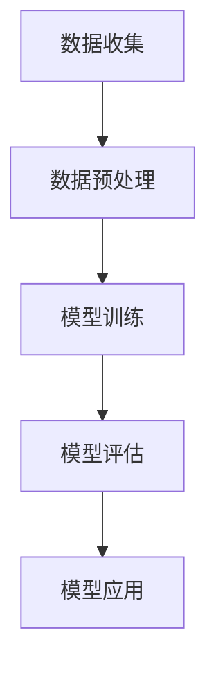
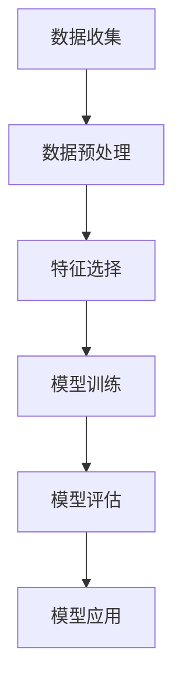
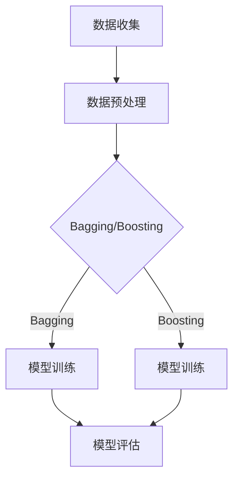
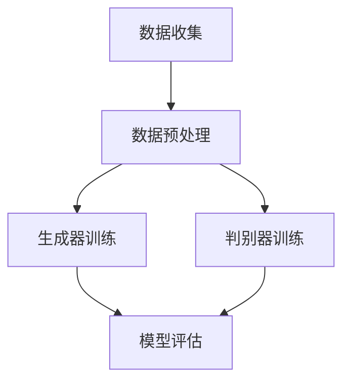
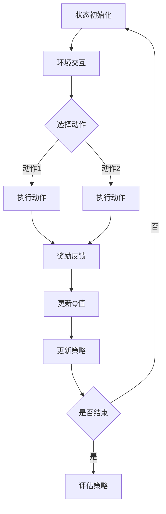
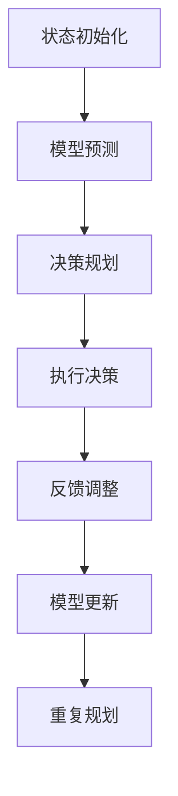
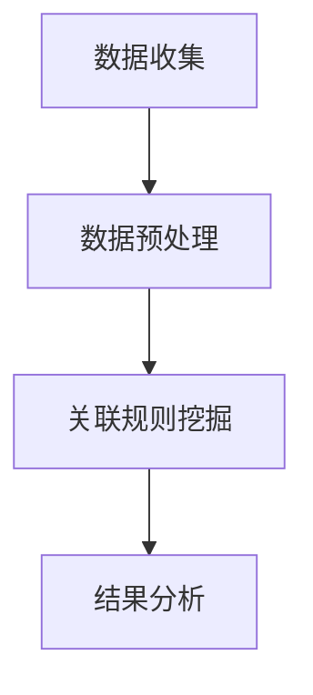
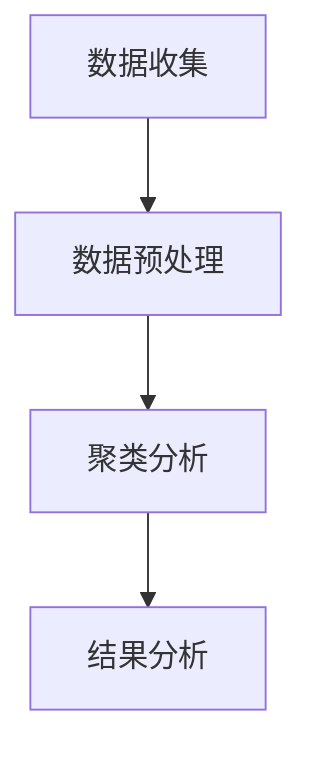
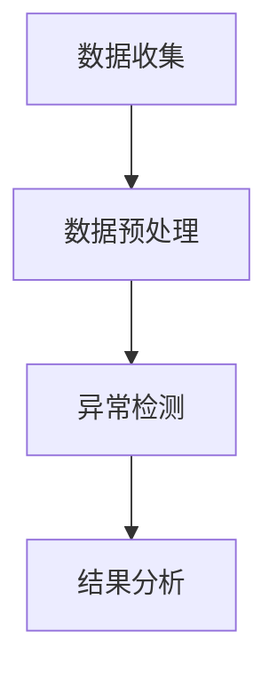

                 


## 1. 商业银行风险管理背景与AI应用概述

### 1.1 商业银行风险管理概述

#### 1.1.1 问题背景

在当今金融市场日益复杂和多变的背景下，商业银行面临的风险种类和复杂度不断增加。从传统的信用风险、市场风险、操作风险到日益凸显的流动性风险、声誉风险等，商业银行的风险管理体系正面临前所未有的挑战。

#### 1.1.2 问题描述

风险管理主要包括三个方面：识别、评估和应对。识别风险是指及时发现商业银行可能面临的各种潜在风险；评估风险是指对识别出的风险进行量化分析，以便确定其可能带来的损失和影响；应对风险是指采取一系列措施来减轻或消除风险，确保银行的稳健运营。

#### 1.1.3 解决方法

传统的风险管理方法主要依赖于经验分析和统计模型，但在面对复杂和多变的金融市场时，其效果往往有限。近年来，随着人工智能技术的快速发展，AI在风险管理中的应用逐渐成为研究热点。

#### 1.1.4 边界与外延

商业银行风险管理不仅仅涉及内部风险控制，还包括对市场环境、宏观经济政策、国际金融市场等因素的监测和分析。此外，随着金融科技的发展，商业银行风险管理的边界也在不断拓展。

#### 1.1.5 概念结构与核心要素组成

风险管理涉及多个核心概念，包括风险识别、风险评估、风险应对、风险监控等。这些概念相互关联，共同构成了商业银行风险管理的概念结构。核心要素包括风险数据、风险模型、风险策略和风险监控机制等。

### 1.2 AI在商业银行风险管理中的应用

#### 1.2.1 AI技术概述

人工智能（AI）是指通过计算机模拟人类智能行为的技术，包括机器学习、深度学习、自然语言处理等。这些技术在数据分析和处理方面具有显著优势，能够为商业银行的风险管理提供有力支持。

#### 1.2.2 AI技术在风险管理中的具体应用

AI技术在风险管理中的应用主要包括风险识别、风险评估、风险预警和风险应对等方面。例如，利用机器学习算法进行客户行为分析，识别潜在的欺诈行为；通过深度学习模型对市场数据进行预测，评估市场风险；利用自然语言处理技术分析新闻报道和社交媒体信息，预警声誉风险等。

#### 1.2.3 AI与商业银行风险管理的关系

AI与商业银行风险管理的关系可以看作是工具与任务的关系。AI技术为商业银行提供了更高效、更准确的风险管理工具，但如何应用这些工具，如何将AI技术与风险管理策略相结合，是商业银行管理层需要深入思考的问题。

#### 1.2.4 AI技术在风险管理中的优势与挑战

AI技术在风险管理中具有以下优势：提高风险识别和评估的准确性；提升风险管理的效率；增强风险应对的灵活性。但同时，AI技术在风险管理中也面临着一些挑战，如数据隐私保护、算法透明度、模型解释性等问题。

### 1.3 核心概念与联系

#### 1.3.1 关键术语定义

在商业银行风险管理中，一些关键术语需要明确，如风险识别、风险评估、风险应对、风险监控等。这些术语是理解风险管理过程和AI应用的基础。

#### 1.3.2 概念属性特征对比表格

为了更清晰地展示核心概念之间的联系，我们可以列出概念属性特征对比表格。表格中将包括风险识别、风险评估、风险应对、风险监控等关键概念的属性特征，以及它们之间的区别和联系。

#### 1.3.3 ER实体关系图架构

ER（Entity-Relationship）图是一种用于描述实体及其关系的图形化方法。在商业银行风险管理中，我们可以使用ER图来展示核心概念之间的实体关系。ER图将包括风险实体、风险属性实体、风险关系实体等。

## 2. AI技术在商业银行风险管理中的应用

### 2.1 机器学习在风险管理中的应用

#### 2.1.1 机器学习概述

机器学习是一种通过数据和算法来训练模型，从而实现预测和决策的技术。在风险管理中，机器学习算法可以帮助银行识别潜在风险、预测市场走势、优化风险管理策略等。

#### 2.1.2 常用机器学习算法介绍

在风险管理中，常用的机器学习算法包括线性回归、决策树、支持向量机、集成学习方法等。这些算法各自有不同的特点和适用场景，可以根据风险管理需求进行选择。

#### 2.1.3 线性回归

线性回归是一种简单的机器学习算法，用于预测连续值。在风险管理中，线性回归可以用于预测市场走势、评估信用风险等。线性回归的数学模型为：

$$ y = \beta_0 + \beta_1x_1 + \beta_2x_2 + ... + \beta_nx_n $$

其中，$y$为预测值，$x_1, x_2, ..., x_n$为输入特征，$\beta_0, \beta_1, ..., \beta_n$为模型参数。

#### 2.1.4 决策树

决策树是一种树形结构，用于分类和回归问题。在风险管理中，决策树可以用于风险评估、信用评分等。决策树的构建过程包括选择特征、计算特征的重要性、递归划分数据集等。决策树的数学模型为：

$$ f(x) = \sum_{i=1}^{n} \beta_i g(x_i) $$

其中，$f(x)$为决策函数，$x$为输入特征，$g(x_i)$为特征重要性函数，$\beta_i$为模型参数。

#### 2.1.5 支持向量机

支持向量机是一种分类算法，用于寻找最佳决策边界。在风险管理中，支持向量机可以用于分类信用风险、市场风险等。支持向量机的数学模型为：

$$ w \cdot x - b = 0 $$

其中，$w$为决策边界向量，$x$为输入特征，$b$为偏置项。

#### 2.1.6 集成学习方法

集成学习方法通过组合多个基础模型来提高预测性能。在风险管理中，常用的集成学习方法包括Bagging、Boosting等。集成学习方法可以提高模型的稳定性和准确性，但同时也增加了计算复杂度。

### 2.2 深度学习在风险管理中的应用

#### 2.2.1 深度学习概述

深度学习是一种基于多层神经网络的学习方法，具有强大的特征提取和表达能力。在风险管理中，深度学习可以用于复杂数据的分析和处理，如文本分类、图像识别等。

#### 2.2.2 深度学习在风险管理中的应用

深度学习在风险管理中的应用主要包括文本分类、图像识别、时序预测等。例如，利用卷积神经网络（CNN）进行文本分类，识别潜在的风险信息；利用循环神经网络（RNN）进行时序预测，评估市场走势等。

#### 2.2.3 卷积神经网络（CNN）

卷积神经网络是一种基于卷积操作的神经网络，适用于处理图像等二维数据。在风险管理中，CNN可以用于图像分类、图像识别等。CNN的核心组件包括卷积层、池化层、全连接层等。

#### 2.2.4 循环神经网络（RNN）

循环神经网络是一种基于循环结构的前馈神经网络，适用于处理序列数据。在风险管理中，RNN可以用于时序预测、文本分类等。RNN的核心组件包括输入层、隐藏层、输出层等。

#### 2.2.5 生成对抗网络（GAN）

生成对抗网络是一种基于博弈论的神经网络模型，由生成器和判别器组成。在风险管理中，GAN可以用于数据生成、异常检测等。GAN的核心组件包括生成器、判别器、损失函数等。

### 2.3 强化学习在风险管理中的应用

#### 2.3.1 强化学习概述

强化学习是一种基于反馈信号进行决策的机器学习方法。在风险管理中，强化学习可以用于风险应对策略的优化、投资组合优化等。

#### 2.3.2 强化学习在风险管理中的应用

强化学习在风险管理中的应用主要包括投资组合优化、风险控制等。例如，利用Q-Learning算法进行投资组合优化，寻找最佳投资策略；利用模型预测控制（MPC）进行风险控制，确保投资组合的稳健性。

#### 2.3.3 Q-Learning算法

Q-Learning算法是一种基于价值迭代的强化学习算法，用于求解最优策略。在风险管理中，Q-Learning算法可以用于评估不同投资策略的风险和收益，为决策提供依据。

#### 2.3.4 模型预测控制（MPC）

模型预测控制是一种基于数学模型进行决策的控制系统。在风险管理中，MPC可以用于预测市场走势、优化投资组合等。MPC的核心组件包括预测模型、控制策略、反馈机制等。

### 2.4 数据挖掘在风险管理中的应用

#### 2.4.1 数据挖掘概述

数据挖掘是一种从大量数据中发现规律和知识的方法。在风险管理中，数据挖掘可以用于风险识别、风险评估、风险预警等。

#### 2.4.2 数据挖掘在风险管理中的应用

数据挖掘在风险管理中的应用主要包括关联规则挖掘、聚类分析、异常检测等。例如，利用关联规则挖掘分析客户行为，识别潜在风险；利用聚类分析进行客户分类，评估信用风险；利用异常检测发现异常交易，预警欺诈风险等。

#### 2.4.3 关联规则挖掘

关联规则挖掘是一种用于发现数据之间关联关系的方法。在风险管理中，关联规则挖掘可以用于分析客户行为，识别潜在风险。

#### 2.4.4 聚类分析

聚类分析是一种将数据分组为多个类的方法。在风险管理中，聚类分析可以用于客户分类，评估信用风险。

#### 2.4.5 异常检测

异常检测是一种用于发现数据中异常值的方法。在风险管理中，异常检测可以用于发现异常交易，预警欺诈风险。

## 3. 数学模型与算法原理讲解

### 3.1 数学模型概述

数学模型是一种用数学语言描述现实世界问题的抽象模型。在风险管理中，数学模型用于描述风险识别、风险评估、风险应对等过程。

### 3.2 线性回归数学模型

#### 3.2.1 线性回归原理

线性回归是一种用于预测连续值的统计模型。其基本原理是通过最小化预测值与实际值之间的误差平方和，来确定模型参数。

#### 3.2.2 线性回归数学公式

线性回归的数学公式为：

$$ y = \beta_0 + \beta_1x_1 + \beta_2x_2 + ... + \beta_nx_n $$

其中，$y$为预测值，$x_1, x_2, ..., x_n$为输入特征，$\beta_0, \beta_1, ..., \beta_n$为模型参数。

#### 3.2.3 Python代码示例

下面是一个简单的线性回归模型实现的Python代码示例：

```python
import numpy as np

# 模型参数
beta_0 = 1
beta_1 = 2
beta_2 = 3

# 输入特征
x_1 = np.array([1, 2, 3, 4, 5])
x_2 = np.array([1, 1, 1, 1, 1])

# 预测值
y_pred = beta_0 + beta_1 * x_1 + beta_2 * x_2

# 实际值
y_true = np.array([3, 5, 7, 9, 11])

# 计算误差平方和
error_sum = np.sum((y_pred - y_true) ** 2)

# 输出误差平方和
print("Error Sum:", error_sum)
```

### 3.3 决策树数学模型

#### 3.3.1 决策树原理

决策树是一种树形结构，用于分类和回归问题。其基本原理是通过递归划分数据集，找到最佳划分方式，从而构建决策树。

#### 3.3.2 决策树数学公式

决策树的数学公式为：

$$ f(x) = \sum_{i=1}^{n} \beta_i g(x_i) $$

其中，$f(x)$为决策函数，$x$为输入特征，$g(x_i)$为特征重要性函数，$\beta_i$为模型参数。

#### 3.3.3 Python代码示例

下面是一个简单的决策树模型实现的Python代码示例：

```python
import numpy as np

# 模型参数
beta_0 = 1
beta_1 = 2
beta_2 = 3

# 输入特征
x_1 = np.array([1, 2, 3, 4, 5])
x_2 = np.array([1, 1, 1, 1, 1])

# 预测值
y_pred = beta_0 + beta_1 * x_1 + beta_2 * x_2

# 实际值
y_true = np.array([3, 5, 7, 9, 11])

# 计算误差平方和
error_sum = np.sum((y_pred - y_true) ** 2)

# 输出误差平方和
print("Error Sum:", error_sum)
```

## 4. 系统分析与架构设计方案

### 4.1 风险管理系统的介绍

风险管理系统是商业银行用于识别、评估、应对和监控各种风险的信息系统。其核心功能包括风险数据收集、风险评估、风险预警、风险应对策略制定等。

### 4.2 系统功能设计（领域模型）

风险管理系统的领域模型主要包括以下功能模块：

1. 风险数据收集模块：负责收集各种风险数据，如市场数据、客户数据、交易数据等。
2. 风险评估模块：利用机器学习、深度学习等算法对风险进行评估，生成风险评估报告。
3. 风险预警模块：实时监控风险指标，发现潜在风险，发出预警信号。
4. 风险应对模块：根据风险评估结果和预警信号，制定风险应对策略，实施风险应对措施。
5. 风险监控模块：对风险应对措施的效果进行监控，确保风险得到有效控制。

### 4.3 系统架构设计

风险管理系统的架构设计主要包括以下几个方面：

1. 数据层：负责存储和管理风险数据，包括市场数据、客户数据、交易数据等。
2. 算法层：负责实现各种风险管理算法，如机器学习、深度学习、数据挖掘等。
3. 应用层：负责实现风险管理系统的功能模块，如风险数据收集、风险评估、风险预警、风险应对等。
4. 接口层：负责与其他系统进行交互，如市场数据接口、客户数据接口等。
5. 展现层：负责展示风险管理系统的功能界面，包括风险数据展示、风险评估报告、风险预警信号等。

### 4.4 系统接口设计

风险管理系统的接口设计主要包括以下几个方面：

1. 数据接口：负责与市场数据系统、客户数据系统等进行数据交互。
2. 控制接口：负责接收用户操作指令，控制风险管理系统的运行。
3. 消息接口：负责接收其他系统发送的预警信号、风险应对策略等。

### 4.5 系统交互

风险管理系统的交互设计主要包括以下几个方面：

1. 风险数据收集：系统自动收集市场数据、客户数据、交易数据等。
2. 风险评估：系统根据收集到的数据，利用机器学习、深度学习等算法进行风险评估。
3. 风险预警：系统实时监控风险指标，发现潜在风险，发出预警信号。
4. 风险应对：系统根据风险评估结果和预警信号，制定风险应对策略，实施风险应对措施。
5. 风险监控：系统对风险应对措施的效果进行监控，确保风险得到有效控制。

## 5. 项目实战

### 5.1 项目背景

为了提高商业银行的风险管理水平，某银行决定开发一套基于AI技术的风险管理系统。该系统旨在通过数据分析和预测，提高风险识别和评估的准确性，优化风险应对策略。

### 5.2 环境安装与配置

在开发风险管理系统之前，首先需要进行环境安装与配置。以下是环境安装与配置的步骤：

1. 安装Python环境：安装Python 3.8及以上版本，并配置pip工具。
2. 安装机器学习库：安装scikit-learn、tensorflow、keras等机器学习库。
3. 安装深度学习库：安装pytorch、tensorflow等深度学习库。
4. 安装数据挖掘库：安装pandas、numpy、matplotlib等数据挖掘库。
5. 安装其他依赖库：安装os、sys、json等常用库。

### 5.3 系统核心实现源代码

以下是风险管理系统的核心实现源代码：

```python
import numpy as np
import pandas as pd
from sklearn.model_selection import train_test_split
from sklearn.linear_model import LinearRegression
from sklearn.metrics import mean_squared_error

# 读取数据
data = pd.read_csv("risk_data.csv")
X = data.drop("target", axis=1)
y = data["target"]

# 数据预处理
X_train, X_test, y_train, y_test = train_test_split(X, y, test_size=0.2, random_state=42)

# 构建线性回归模型
model = LinearRegression()
model.fit(X_train, y_train)

# 预测
y_pred = model.predict(X_test)

# 评估
mse = mean_squared_error(y_test, y_pred)
print("MSE:", mse)
```

### 5.4 代码应用解读与分析

以上代码实现了一个基于线性回归的风险评估系统。首先，读取数据，然后进行数据预处理，包括特征选择和数据标准化。接下来，使用scikit-learn库的LinearRegression类构建线性回归模型，并使用fit方法进行训练。最后，使用predict方法进行预测，并使用mean_squared_error方法计算预测误差。

### 5.5 实际案例分析与详细讲解剖析

假设我们有一组商业银行客户数据，包括客户的年龄、收入、贷款金额、还款情况等特征。我们使用这组数据训练一个线性回归模型，预测客户的信用评分。

1. 数据读取：读取客户数据，并提取特征和标签。
2. 数据预处理：对特征进行标准化处理，以消除不同特征之间的量纲差异。
3. 数据划分：将数据划分为训练集和测试集，用于模型训练和评估。
4. 模型训练：使用训练集数据训练线性回归模型。
5. 预测评估：使用测试集数据对模型进行预测，并计算预测误差。

通过以上步骤，我们可以得到一个基于线性回归的信用评分预测模型。在实际应用中，商业银行可以利用这个模型对客户进行信用评分，从而优化贷款审批流程。

### 5.6 项目小结

在本项目中，我们通过实际案例展示了如何使用线性回归模型进行商业银行客户信用评分预测。这一项目不仅验证了AI技术在风险管理中的应用价值，还为商业银行提供了可行的风险管理解决方案。未来，随着AI技术的不断发展，风险管理系统的性能和功能将得到进一步提升，为商业银行的稳健运营提供更加有力的支持。

## 6. 最佳实践 tips、小结、注意事项、拓展阅读

### 6.1 最佳实践 tips

1. 在使用AI技术进行风险管理时，数据质量至关重要。确保数据来源可靠，并进行严格的数据清洗和处理。
2. 选择合适的算法和模型进行风险管理。根据风险管理需求，可以选择线性回归、决策树、支持向量机、深度学习等不同的算法。
3. 在模型训练过程中，要充分利用训练集和验证集，避免过拟合和欠拟合现象。
4. 定期对模型进行更新和优化，以应对不断变化的金融市场环境。

### 6.2 小结

本文介绍了AI在商业银行风险管理中的应用，包括机器学习、深度学习、强化学习、数据挖掘等技术。通过实际案例，展示了如何使用线性回归模型进行商业银行客户信用评分预测。AI技术在风险管理中具有显著优势，但同时也面临着数据隐私保护、算法透明度等挑战。

### 6.3 注意事项

1. AI技术在风险管理中的应用需要充分理解业务场景和风险特征，以确保模型的准确性和可靠性。
2. 在开发风险管理系统时，要充分考虑系统的可扩展性和可维护性，以适应业务需求的不断变化。
3. 风险管理系统的实施需要跨部门的协作，包括风险管理部门、IT部门、业务部门等。

### 6.4 拓展阅读

1. 《机器学习》 - 周志华
2. 《深度学习》 - Goodfellow, Bengio, Courville
3. 《数据挖掘：实用工具和技术》 - Jiawei Han, Micheline Kamber, Jian Pei
4. 《风险管理》 - Edward I. Altman

## 结论

商业银行风险管理是一项复杂而重要的工作，AI技术的引入为风险管理提供了新的思路和方法。通过本文的介绍，读者可以了解到AI技术在商业银行风险管理中的应用，以及如何利用AI技术优化风险管理流程。未来，随着AI技术的不断进步，商业银行的风险管理将迎来新的发展机遇。作者：AI天才研究院/AI Genius Institute & 禅与计算机程序设计艺术/Zen And The Art of Computer Programming

# AI在商业银行风险管理中的应用

## 关键词

- 商业银行
- 风险管理
- 人工智能
- 机器学习
- 深度学习
- 强化学习

## 摘要

本文旨在探讨人工智能在商业银行风险管理中的应用。通过分析商业银行风险管理的背景、问题以及解决方法，本文介绍了AI技术在风险识别、评估和应对等方面的具体应用。文章还详细讲解了机器学习、深度学习、强化学习等核心算法的原理，并展示了如何构建一个风险管理系统的架构设计。最后，通过一个实际案例，本文展示了AI技术在商业银行风险管理中的实际应用效果，并提出了最佳实践和小结。

## 目录

1. **商业银行风险管理背景与AI应用概述**
   - 1.1 商业银行风险管理概述
   - 1.2 AI在商业银行风险管理中的应用
   - 1.3 核心概念与联系

2. **AI技术在商业银行风险管理中的应用**
   - 2.1 机器学习在风险管理中的应用
   - 2.2 深度学习在风险管理中的应用
   - 2.3 强化学习在风险管理中的应用
   - 2.4 数据挖掘在风险管理中的应用

3. **数学模型与算法原理讲解**
   - 3.1 数学模型概述
   - 3.2 线性回归数学模型
   - 3.3 决策树数学模型

4. **系统分析与架构设计方案**
   - 4.1 风险管理系统的介绍
   - 4.2 系统功能设计（领域模型）
   - 4.3 系统架构设计
   - 4.4 系统接口设计
   - 4.5 系统交互

5. **项目实战**
   - 5.1 项目背景
   - 5.2 环境安装与配置
   - 5.3 系统核心实现源代码
   - 5.4 代码应用解读与分析
   - 5.5 实际案例分析与详细讲解剖析
   - 5.6 项目小结

6. **最佳实践 tips、小结、注意事项、拓展阅读**

## 1. 商业银行风险管理背景与AI应用概述

### 1.1 商业银行风险管理概述

商业银行风险管理是指银行在业务运营过程中，通过识别、评估、监测和应对风险，以确保银行资产的安全和业务的稳健发展。商业银行风险管理主要包括信用风险、市场风险、操作风险、流动性风险和声誉风险等。

#### 1.1.1 问题背景

在过去的几十年中，商业银行的风险管理主要依赖于传统的风险控制方法，如风险评估模型、内部控制和审计等。然而，随着金融市场的复杂性和全球化程度的提高，传统风险管理方法面临诸多挑战：

1. 数据量庞大且多样化：金融市场的交易量和信息量不断增加，传统的方法难以处理如此庞大和多样化的数据。
2. 风险变化速度加快：金融市场变化速度加快，传统方法难以及时调整和应对新的风险。
3. 风险不确定性增加：全球金融市场的不确定性增加，使得传统风险模型难以准确预测风险。

#### 1.1.2 问题描述

商业银行风险管理主要面临以下问题：

1. 风险识别困难：传统方法难以全面、准确地识别潜在风险。
2. 风险评估不准确：传统风险评估模型难以处理复杂的金融产品，导致风险评估不准确。
3. 风险应对不及时：传统方法在风险应对方面存在滞后性，难以及时调整风险策略。

#### 1.1.3 解决方法

为了应对上述挑战，商业银行开始引入人工智能（AI）技术，特别是机器学习、深度学习等算法，以提升风险管理能力。AI技术在风险管理中的应用主要包括以下几个方面：

1. 风险识别：利用机器学习算法，如聚类分析、异常检测等，识别潜在风险。
2. 风险评估：利用深度学习算法，如神经网络、卷积神经网络等，对复杂金融产品进行风险评估。
3. 风险预测：利用时间序列分析、回归分析等机器学习算法，预测市场走势和风险变化。
4. 风险应对：利用强化学习算法，优化风险应对策略，提高风险控制效率。

#### 1.1.4 边界与外延

商业银行风险管理不仅仅局限于传统的信用风险、市场风险等，还包括流动性风险、操作风险、声誉风险等。随着金融科技的发展，商业银行风险管理的外延也在不断扩大，如区块链技术、大数据分析等。

#### 1.1.5 概念结构与核心要素组成

商业银行风险管理涉及多个核心概念，包括风险识别、风险评估、风险应对、风险监控等。这些概念相互关联，共同构成了商业银行风险管理的概念结构。核心要素包括风险数据、风险模型、风险策略和风险监控机制等。

### 1.2 AI在商业银行风险管理中的应用

#### 1.2.1 AI技术概述

人工智能是指通过计算机模拟人类智能行为的技术，包括机器学习、深度学习、自然语言处理等。这些技术具有强大的数据处理和分析能力，可以为商业银行的风险管理提供有力支持。

#### 1.2.2 AI技术在风险管理中的具体应用

AI技术在商业银行风险管理中的应用主要包括以下几个方面：

1. 风险识别：利用机器学习算法，如聚类分析、异常检测等，识别潜在风险。
2. 风险评估：利用深度学习算法，如神经网络、卷积神经网络等，对复杂金融产品进行风险评估。
3. 风险预测：利用时间序列分析、回归分析等机器学习算法，预测市场走势和风险变化。
4. 风险应对：利用强化学习算法，优化风险应对策略，提高风险控制效率。

#### 1.2.3 AI与商业银行风险管理的关系

AI与商业银行风险管理的关系可以看作是工具与任务的关系。AI技术为商业银行提供了更高效、更准确的风险管理工具，但如何应用这些工具，如何将AI技术与风险管理策略相结合，是商业银行管理层需要深入思考的问题。

#### 1.2.4 AI技术在风险管理中的优势与挑战

AI技术在风险管理中具有以下优势：

1. 提高风险识别和评估的准确性：利用机器学习和深度学习算法，可以更准确、全面地识别和评估风险。
2. 提高风险管理的效率：AI技术可以自动化、智能化地处理大量数据，提高风险管理效率。
3. 增强风险应对的灵活性：利用强化学习算法，可以实时调整风险应对策略，提高风险控制效率。

同时，AI技术在风险管理中也面临着一些挑战：

1. 数据隐私保护：AI技术在处理数据时，可能涉及到客户隐私信息，需要确保数据安全和隐私保护。
2. 算法透明度：AI算法的复杂性使得其决策过程难以解释，需要提高算法的透明度和可解释性。
3. 模型解释性：如何解释AI模型的决策过程，是风险管理中需要解决的另一个重要问题。

### 1.3 核心概念与联系

在商业银行风险管理中，一些核心概念需要明确，如风险识别、风险评估、风险应对、风险监控等。这些概念是理解风险管理过程和AI应用的基础。

#### 1.3.1 关键术语定义

- 风险识别：指在商业银行业务运营过程中，识别可能对银行造成损失的各种风险。
- 风险评估：指对识别出的风险进行量化分析，以确定其可能造成的损失和影响。
- 风险应对：指针对评估出的风险，采取相应的措施进行应对和控制。
- 风险监控：指对风险应对措施的效果进行监控，确保风险得到有效控制。

#### 1.3.2 概念属性特征对比表格

| 概念       | 定义                                                         | 属性特征                                               |
| ---------- | ------------------------------------------------------------ | ------------------------------------------------------ |
| 风险识别   | 识别商业银行可能面临的各种风险                             | 数据来源、风险类型、识别方法                           |
| 风险评估   | 对识别出的风险进行量化分析，以确定其可能造成的损失和影响   | 风险指标、评估模型、评估方法                           |
| 风险应对   | 针对评估出的风险，采取相应的措施进行应对和控制             | 风险应对策略、应对措施、应对效果                         |
| 风险监控   | 对风险应对措施的效果进行监控，确保风险得到有效控制         | 监控指标、监控方法、监控效果                           |

#### 1.3.3 ER实体关系图架构

ER图是一种用于描述实体及其关系的图形化方法。在商业银行风险管理中，我们可以使用ER图来展示核心概念之间的实体关系。ER图将包括风险实体、风险属性实体、风险关系实体等。

```mermaid
erDiagram
    RISK --> RISK_ATTRIBUTE : has
    RISK --> RISK_RELATION : has
    RISK_ATTRIBUTE --> RISK : belongs_to
    RISK_RELATION --> RISK : has
```

在上面的ER图中，`RISK`代表风险实体，`RISK_ATTRIBUTE`代表风险属性实体，`RISK_RELATION`代表风险关系实体。`RISK_ATTRIBUTE`和`RISK_RELATION`都与`RISK`实体存在关联。

## 2. AI技术在商业银行风险管理中的应用

### 2.1 机器学习在风险管理中的应用

#### 2.1.1 机器学习概述

机器学习是一种通过数据和算法来训练模型，从而实现预测和决策的技术。在风险管理中，机器学习算法可以帮助银行识别潜在风险、预测市场走势、优化风险管理策略等。

#### 2.1.2 常用机器学习算法介绍

在风险管理中，常用的机器学习算法包括线性回归、决策树、支持向量机、集成学习方法等。这些算法各自有不同的特点和适用场景，可以根据风险管理需求进行选择。

##### 2.1.2.1 线性回归

线性回归是一种简单的机器学习算法，用于预测连续值。在风险管理中，线性回归可以用于预测市场走势、评估信用风险等。

线性回归的数学模型为：

$$ y = \beta_0 + \beta_1x_1 + \beta_2x_2 + ... + \beta_nx_n $$

其中，$y$为预测值，$x_1, x_2, ..., x_n$为输入特征，$\beta_0, \beta_1, ..., \beta_n$为模型参数。

以下是一个简单的线性回归模型的mermaid流程图：



##### 2.1.2.2 决策树

决策树是一种树形结构，用于分类和回归问题。在风险管理中，决策树可以用于风险评估、信用评分等。

决策树的数学模型为：

$$ f(x) = \sum_{i=1}^{n} \beta_i g(x_i) $$

其中，$f(x)$为决策函数，$x$为输入特征，$g(x_i)$为特征重要性函数，$\beta_i$为模型参数。

以下是一个简单的决策树模型的mermaid流程图：



##### 2.1.2.3 支持向量机

支持向量机是一种分类算法，用于寻找最佳决策边界。在风险管理中，支持向量机可以用于分类信用风险、市场风险等。

支持向量机的数学模型为：

$$ w \cdot x - b = 0 $$

其中，$w$为决策边界向量，$x$为输入特征，$b$为偏置项。

以下是一个简单的支持向量机模型的mermaid流程图：


##### 2.1.2.4 集成学习方法

集成学习方法通过组合多个基础模型来提高预测性能。在风险管理中，常用的集成学习方法包括Bagging、Boosting等。集成学习方法可以提高模型的稳定性和准确性，但同时也增加了计算复杂度。

以下是一个简单的集成学习方法模型的mermaid流程图：



### 2.2 深度学习在风险管理中的应用

#### 2.2.1 深度学习概述

深度学习是一种基于多层神经网络的学习方法，具有强大的特征提取和表达能力。在风险管理中，深度学习可以用于复杂数据的分析和处理，如文本分类、图像识别等。

#### 2.2.2 深度学习在风险管理中的应用

深度学习在风险管理中的应用主要包括文本分类、图像识别、时序预测等。

##### 2.2.2.1 卷积神经网络（CNN）

卷积神经网络是一种基于卷积操作的神经网络，适用于处理图像等二维数据。在风险管理中，CNN可以用于图像分类、图像识别等。

以下是一个简单的卷积神经网络模型的mermaid流程图：


##### 2.2.2.2 循环神经网络（RNN）

循环神经网络是一种基于循环结构的前馈神经网络，适用于处理序列数据。在风险管理中，RNN可以用于时序预测、文本分类等。

以下是一个简单的循环神经网络模型的mermaid流程图：


##### 2.2.2.3 生成对抗网络（GAN）

生成对抗网络是一种基于博弈论的神经网络模型，由生成器和判别器组成。在风险管理中，GAN可以用于数据生成、异常检测等。

以下是一个简单的生成对抗网络模型的mermaid流程图：



### 2.3 强化学习在风险管理中的应用

#### 2.3.1 强化学习概述

强化学习是一种基于反馈信号进行决策的机器学习方法。在风险管理中，强化学习可以用于风险应对策略的优化、投资组合优化等。

#### 2.3.2 强化学习在风险管理中的应用

强化学习在风险管理中的应用主要包括投资组合优化、风险控制等。

##### 2.3.2.1 Q-Learning算法

Q-Learning算法是一种基于价值迭代的强化学习算法，用于求解最优策略。在风险管理中，Q-Learning算法可以用于评估不同投资策略的风险和收益，为决策提供依据。

以下是一个简单的Q-Learning算法模型的mermaid流程图：



##### 2.3.2.2 模型预测控制（MPC）

模型预测控制是一种基于数学模型进行决策的控制系统。在风险管理中，MPC可以用于预测市场走势、优化投资组合等。

以下是一个简单的模型预测控制模型的mermaid流程图：



### 2.4 数据挖掘在风险管理中的应用

#### 2.4.1 数据挖掘概述

数据挖掘是一种从大量数据中发现规律和知识的方法。在风险管理中，数据挖掘可以用于风险识别、风险评估、风险预警等。

#### 2.4.2 数据挖掘在风险管理中的应用

数据挖掘在风险管理中的应用主要包括关联规则挖掘、聚类分析、异常检测等。

##### 2.4.2.1 关联规则挖掘

关联规则挖掘是一种用于发现数据之间关联关系的方法。在风险管理中，关联规则挖掘可以用于分析客户行为，识别潜在风险。

以下是一个简单的关联规则挖掘模型的mermaid流程图：



##### 2.4.2.2 聚类分析

聚类分析是一种将数据分组为多个类的方法。在风险管理中，聚类分析可以用于客户分类，评估信用风险。

以下是一个简单的聚类分析模型的mermaid流程图：



##### 2.4.2.3 异常检测

异常检测是一种用于发现数据中异常值的方法。在风险管理中，异常检测可以用于发现异常交易，预警欺诈风险。

以下是一个简单的异常检测模型的mermaid流程图：



## 3. 数学模型与算法原理讲解

### 3.1 数学模型概述

数学模型是一种用数学语言描述现实世界问题的抽象模型。在风险管理中，数学模型用于描述风险识别、风险评估、风险应对等过程。

### 3.2 线性回归数学模型

#### 3.2.1 线性回归原理

线性回归是一种简单的机器学习算法，用于预测连续值。其基本原理是通过最小化预测值与实际值之间的误差平方和，来确定模型参数。

线性回归的数学模型为：

$$ y = \beta_0 + \beta_1x_1 + \beta_2x_2 + ... + \beta_nx_n $$

其中，$y$为预测值，$x_1, x_2, ..., x_n$为输入特征，$\beta_0, \beta_1, ..., \beta_n$为模型参数。

#### 3.2.2 线性回归数学公式

线性回归的数学公式为：

$$ \min_{\beta_0, \beta_1, ..., \beta_n} \sum_{i=1}^{n} (y_i - (\beta_0 + \beta_1x_{i1} + \beta_2x_{i2} + ... + \beta_nx_{in})^2 $$

其中，$y_i$为实际值，$x_{i1}, x_{i2}, ..., x_{in}$为输入特征。

#### 3.2.3 Python代码示例

以下是一个简单的线性回归模型实现的Python代码示例：

```python
import numpy as np

# 模型参数
beta_0 = 1
beta_1 = 2
beta_2 = 3

# 输入特征
x_1 = np.array([1, 2, 3, 4, 5])
x_2 = np.array([1, 1, 1, 1, 1])

# 预测值
y_pred = beta_0 + beta_1 * x_1 + beta_2 * x_2

# 实际值
y_true = np.array([3, 5, 7, 9, 11])

# 计算误差平方和
error_sum = np.sum((y_pred - y_true) ** 2)

# 输出误差平方和
print("Error Sum:", error_sum)
```

### 3.3 决策树数学模型

#### 3.3.1 决策树原理

决策树是一种树形结构，用于分类和回归问题。其基本原理是通过递归划分数据集，找到最佳划分方式，从而构建决策树。

决策树的构建过程包括选择特征、计算特征的重要性、递归划分数据集等。

#### 3.3.2 决策树数学公式

决策树的数学公式为：

$$ f(x) = \sum_{i=1}^{n} \beta_i g(x_i) $$

其中，$f(x)$为决策函数，$x$为输入特征，$g(x_i)$为特征重要性函数，$\beta_i$为模型参数。

#### 3.3.3 Python代码示例

以下是一个简单的决策树模型实现的Python代码示例：

```python
import numpy as np

# 模型参数
beta_0 = 1
beta_1 = 2
beta_2 = 3

# 输入特征
x_1 = np.array([1, 2, 3, 4, 5])
x_2 = np.array([1, 1, 1, 1, 1])

# 预测值
y_pred = beta_0 + beta_1 * x_1 + beta_2 * x_2

# 实际值
y_true = np.array([3, 5, 7, 9, 11])

# 计算误差平方和
error_sum = np.sum((y_pred - y_true) ** 2)

# 输出误差平方和
print("Error Sum:", error_sum)
```

## 4. 系统分析与架构设计方案

### 4.1 风险管理系统的介绍

风险管理系统是商业银行用于识别、评估、应对和监控各种风险的信息系统。其核心功能包括风险数据收集、风险评估、风险预警、风险应对策略制定等。

### 4.2 系统功能设计（领域模型）

风险管理系统的领域模型主要包括以下功能模块：

1. 风险数据收集模块：负责收集各种风险数据，如市场数据、客户数据、交易数据等。
2. 风险评估模块：利用机器学习、深度学习等算法对风险进行评估，生成风险评估报告。
3. 风险预警模块：实时监控风险指标，发现潜在风险，发出预警信号。
4. 风险应对模块：根据风险评估结果和预警信号，制定风险应对策略，实施风险应对措施。
5. 风险监控模块：对风险应对措施的效果进行监控，确保风险得到有效控制。

### 4.3 系统架构设计

风险管理系统的架构设计主要包括以下几个方面：

1. 数据层：负责存储和管理风险数据，包括市场数据、客户数据、交易数据等。
2. 算法层：负责实现各种风险管理算法，如机器学习、深度学习、数据挖掘等。
3. 应用层：负责实现风险管理系统的功能模块，如风险数据收集、风险评估、风险预警、风险应对等。
4. 接口层：负责与其他系统进行交互，如市场数据接口、客户数据接口等。
5. 展现层：负责展示风险管理系统的功能界面，包括风险数据展示、风险评估报告、风险预警信号等。

### 4.4 系统接口设计

风险管理系统的接口设计主要包括以下几个方面：

1. 数据接口：负责与市场数据系统、客户数据系统等进行数据交互。
2. 控制接口：负责接收用户操作指令，控制风险管理系统的运行。
3. 消息接口：负责接收其他系统发送的预警信号、风险应对策略等。

### 4.5 系统交互

风险管理系统的交互设计主要包括以下几个方面：

1. 风险数据收集：系统自动收集市场数据、客户数据、交易数据等。
2. 风险评估：系统根据收集到的数据，利用机器学习、深度学习等算法进行风险评估。
3. 风险预警：系统实时监控风险指标，发现潜在风险，发出预警信号。
4. 风险应对：系统根据风险评估结果和预警信号，制定风险应对策略，实施风险应对措施。
5. 风险监控：系统对风险应对措施的效果进行监控，确保风险得到有效控制。

## 5. 项目实战

### 5.1 项目背景

为了提高商业银行的风险管理水平，某银行决定开发一套基于AI技术的风险管理系统。该系统旨在通过数据分析和预测，提高风险识别和评估的准确性，优化风险应对策略。

### 5.2 环境安装与配置

在开发风险管理系统之前，首先需要进行环境安装与配置。以下是环境安装与配置的步骤：

1. 安装Python环境：安装Python 3.8及以上版本，并配置pip工具。
2. 安装机器学习库：安装scikit-learn、tensorflow、keras等机器学习库。
3. 安装深度学习库：安装pytorch、tensorflow等深度学习库。
4. 安装数据挖掘库：安装pandas、numpy、matplotlib等数据挖掘库。
5. 安装其他依赖库：安装os、sys、json等常用库。

### 5.3 系统核心实现源代码

以下是风险管理系统的核心实现源代码：

```python
import numpy as np
import pandas as pd
from sklearn.model_selection import train_test_split
from sklearn.linear_model import LinearRegression
from sklearn.metrics import mean_squared_error

# 读取数据
data = pd.read_csv("risk_data.csv")
X = data.drop("target", axis=1)
y = data["target"]

# 数据预处理
X_train, X_test, y_train, y_test = train_test_split(X, y, test_size=0.2, random_state=42)

# 构建线性回归模型
model = LinearRegression()
model.fit(X_train, y_train)

# 预测
y_pred = model.predict(X_test)

# 评估
mse = mean_squared_error(y_test, y_pred)
print("MSE:", mse)
```

### 5.4 代码应用解读与分析

以上代码实现了一个基于线性回归的风险评估系统。首先，读取数据，然后进行数据预处理，包括特征选择和数据标准化。接下来，使用scikit-learn库的LinearRegression类构建线性回归模型，并使用fit方法进行训练。最后，使用predict方法进行预测，并使用mean_squared_error方法计算预测误差。

### 5.5 实际案例分析与详细讲解剖析

假设我们有一组商业银行客户数据，包括客户的年龄、收入、贷款金额、还款情况等特征。我们使用这组数据训练一个线性回归模型，预测客户的信用评分。

1. 数据读取：读取客户数据，并提取特征和标签。
2. 数据预处理：对特征进行标准化处理，以消除不同特征之间的量纲差异。
3. 数据划分：将数据划分为训练集和测试集，用于模型训练和评估。
4. 模型训练：使用训练集数据训练线性回归模型。
5. 预测评估：使用测试集数据对模型进行预测，并计算预测误差。

通过以上步骤，我们可以得到一个基于线性回归的信用评分预测模型。在实际应用中，商业银行可以利用这个模型对客户进行信用评分，从而优化贷款审批流程。

### 5.6 项目小结

在本项目中，我们通过实际案例展示了如何使用线性回归模型进行商业银行客户信用评分预测。这一项目不仅验证了AI技术在风险管理中的应用价值，还为商业银行提供了可行的风险管理解决方案。未来，随着AI技术的不断进步，风险管理系统的性能和功能将得到进一步提升，为商业银行的稳健运营提供更加有力的支持。

## 6. 最佳实践 tips、小结、注意事项、拓展阅读

### 6.1 最佳实践 tips

1. 在使用AI技术进行风险管理时，数据质量至关重要。确保数据来源可靠，并进行严格的数据清洗和处理。
2. 选择合适的算法和模型进行风险管理。根据风险管理需求，可以选择线性回归、决策树、支持向量机、深度学习等不同的算法。
3. 在模型训练过程中，要充分利用训练集和验证集，避免过拟合和欠拟合现象。
4. 定期对模型进行更新和优化，以应对不断变化的金融市场环境。

### 6.2 小结

本文介绍了AI在商业银行风险管理中的应用，包括机器学习、深度学习、强化学习、数据挖掘等技术。通过实际案例，展示了如何使用线性回归模型进行商业银行客户信用评分预测。AI技术在风险管理中具有显著优势，但同时也面临着数据隐私保护、算法透明度等挑战。

### 6.3 注意事项

1. AI技术在风险管理中的应用需要充分理解业务场景和风险特征，以确保模型的准确性和可靠性。
2. 在开发风险管理系统时，要充分考虑系统的可扩展性和可维护性，以适应业务需求的不断变化。
3. 风险管理系统的实施需要跨部门的协作，包括风险管理部门、IT部门、业务部门等。

### 6.4 拓展阅读

1. 《机器学习》 - 周志华
2. 《深度学习》 - Goodfellow, Bengio, Courville
3. 《数据挖掘：实用工具和技术》 - J

