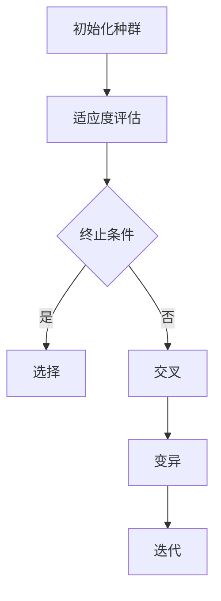
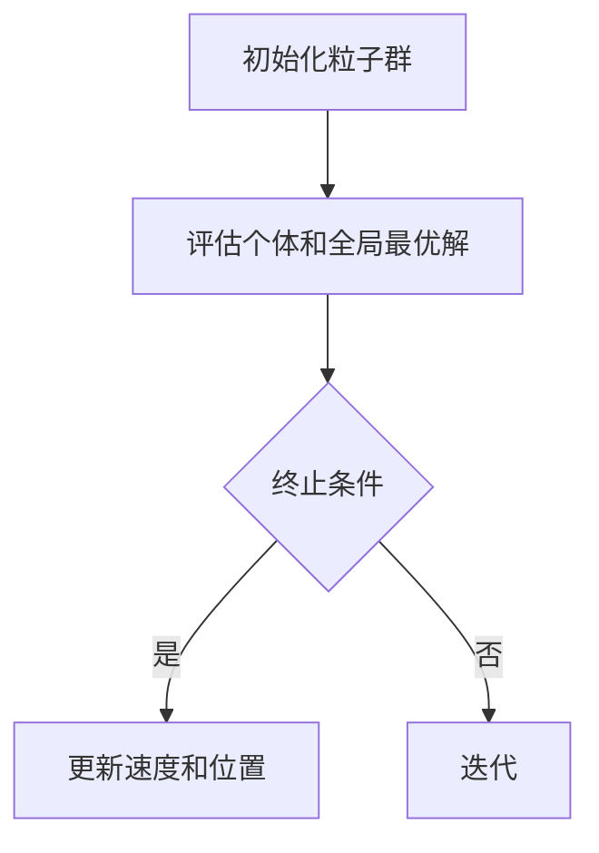
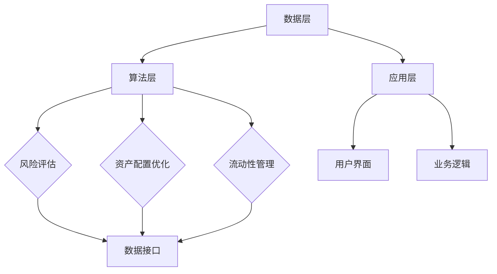
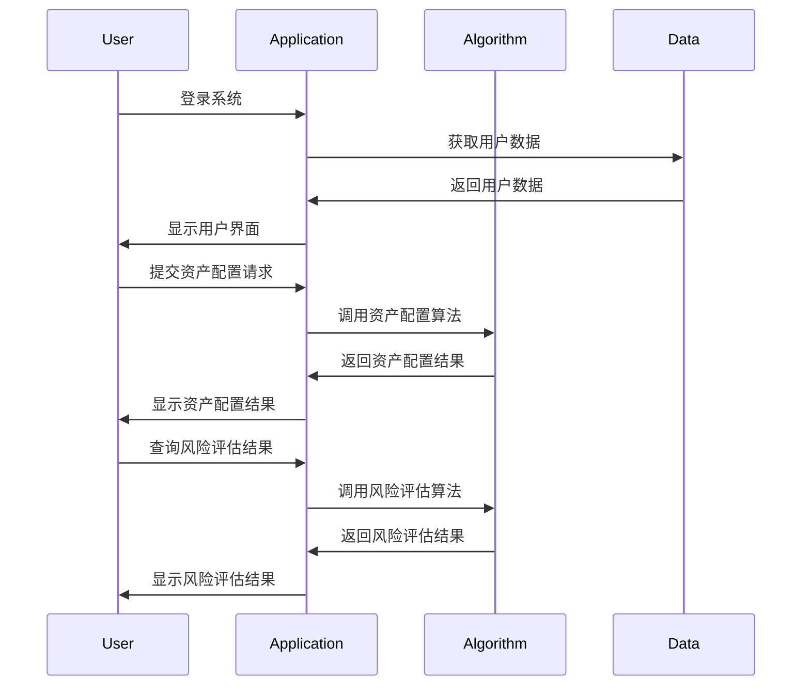

                 

## 文章标题

### 关键词：人工智能，资产负债管理，动态优化，应用场景，算法原理

### 摘要

本文将深入探讨人工智能在资产负债管理动态优化中的应用，通过对背景、核心概念、应用场景、算法原理、数学模型、系统架构及项目实战等多个方面的详细阐述，帮助读者全面理解AI在资产负债管理中的创新应用和关键作用。文章将通过一步一步的逻辑推理和实际案例分析，展现AI在优化资产负债管理中的潜力与挑战。

## 目录大纲

1. 第一部分: AI在资产负债管理动态优化中的应用概述
   1.1. 问题背景与核心概念
   1.2. AI在资产负债管理中的应用场景
2. 第二部分: 动态优化算法原理
   2.1. 算法概述
   2.2. 遗传算法
   2.3. 粒子群优化算法
3. 第三部分: 数学模型与公式详解
   3.1. 数学模型介绍
   3.2. 数学公式详解
4. 第四部分: 系统架构设计
   4.1. 系统功能设计
   4.2. 系统架构设计
   4.3. 系统接口设计
   4.4. 系统交互序列图
5. 第五部分: 项目实战
   5.1. 环境安装
   5.2. 系统核心实现
   5.3. 实际案例
   5.4. 项目小结
6. 第六部分: 最佳实践与拓展阅读
   6.1. 最佳实践
   6.2. 小结
   6.3. 拓展阅读

## 第一部分: AI在资产负债管理动态优化中的应用概述

### 1.1 问题背景与核心概念

#### 1.1.1 资产负债管理的现状

资产负债管理（ALM）是金融机构和企业在财务管理中的一项核心工作，旨在通过合理配置和调整资产与负债，实现资产流动性、盈利性和风险控制之间的平衡。然而，传统的资产负债管理方法在应对复杂多变的金融环境时，往往存在反应速度慢、风险预测不准确等问题。

#### 1.1.2 动态优化在资产负债管理中的重要性

动态优化是一种通过实时监测和调整资产与负债组合，以最大化收益或最小化风险的管理策略。随着金融市场波动性的增加和金融工具的多样化，动态优化在资产负债管理中变得越来越重要。它能够帮助金融机构和企业更快速地响应市场变化，提高资产配置的效率和收益。

#### 1.2 核心概念

##### 1.2.1 AI的定义与分类

人工智能（AI）是一种模拟人类智能的计算机技术。根据应用领域和目标，AI可以分为多种类型，如机器学习、深度学习、强化学习等。在资产负债管理中，AI主要通过机器学习和深度学习算法，对大量历史数据进行训练和预测，以辅助决策。

##### 1.2.2 资产负债管理的基本原理

资产负债管理的基本原理包括资产配置、负债管理、流动性管理、风险控制等。资产配置是指根据企业的风险承受能力和投资目标，选择适当的资产类别进行投资。负债管理则关注如何通过调整负债结构，降低企业的融资成本和风险。流动性管理确保企业在任何市场条件下都能维持足够的流动性。风险控制则通过识别、评估和应对潜在风险，保护企业的财务安全。

##### 1.2.3 动态优化方法介绍

动态优化方法包括遗传算法、粒子群优化算法、模拟退火算法等。这些算法通过迭代优化，寻找最优的资产配置方案。遗传算法基于生物进化原理，通过交叉、变异和选择操作，逐步逼近最优解。粒子群优化算法模拟鸟群觅食过程，通过个体和群体之间的信息共享，实现全局寻优。

### 1.2 AI在资产负债管理中的应用场景

#### 2.1 数据收集与处理

AI在资产负债管理中的应用首先需要大量的历史数据。这些数据包括资产收益率、负债成本、市场风险指标等。通过数据收集和处理，可以建立资产和负债的数学模型，为后续的优化提供基础。

#### 2.2 风险评估

AI可以通过机器学习算法，对资产和负债组合的风险进行评估。风险评估模型可以识别潜在的信用风险、市场风险和流动性风险，为资产负债管理提供决策支持。

#### 2.3 资产配置优化

AI可以基于历史数据和风险模型，自动调整资产配置，以实现收益最大化或风险最小化。资产配置优化需要考虑投资组合的多样化、流动性需求和风险偏好等因素。

### 2.4 流动性管理

AI可以通过实时监测市场数据，预测未来的资金流动情况，帮助企业制定合理的流动性管理策略。这有助于企业在市场波动时，保持足够的流动性，避免流动性风险。

### 2.5 风险控制

AI可以帮助企业建立全面的风险控制体系，通过实时监控和预警，识别和应对潜在的风险。风险控制模型可以评估各种风险因素对资产和负债组合的影响，提供风险管理策略。

### 2.6 实时决策支持

AI可以为企业提供实时的决策支持，帮助企业在复杂多变的金融环境中做出快速、准确的决策。这有助于提高企业的市场竞争力，实现长期稳定的发展。

## 第二部分: 动态优化算法原理

### 2.1 算法概述

动态优化算法是资产负债管理中实现自动调整的重要工具。常见的动态优化算法包括遗传算法、粒子群优化算法和模拟退火算法等。这些算法通过迭代优化，逐步逼近最优的资产配置方案。

#### 2.1.1 动态优化算法分类

1. **遗传算法**：基于生物进化原理，通过交叉、变异和选择操作，逐步逼近最优解。
2. **粒子群优化算法**：模拟鸟群觅食过程，通过个体和群体之间的信息共享，实现全局寻优。
3. **模拟退火算法**：模拟物理退火过程，通过温度调节，实现全局优化。

#### 2.1.2 算法选择标准

选择动态优化算法时，需要考虑以下因素：

1. **优化目标**：不同的算法适用于不同的优化目标，如最大化收益或最小化风险。
2. **数据规模**：算法对数据量的适应性，大型数据集可能需要更高效的算法。
3. **计算资源**：算法的计算复杂度，对计算资源的要求。
4. **稳定性**：算法在多次迭代后是否仍然能找到最优解。

### 2.2 遗传算法

遗传算法是一种模拟生物进化的优化算法。它通过模拟自然选择和遗传机制，逐步优化解的种群。

#### 2.2.1 基本原理

1. **初始化种群**：随机生成一定数量的初始解，每个解表示一种可能的资产配置方案。
2. **适应度评估**：根据资产配置方案的收益或风险，计算每个解的适应度值。
3. **选择**：选择适应度值高的解作为父代，用于生成下一代解。
4. **交叉**：将父代解进行交叉操作，生成新的解。
5. **变异**：对交叉后的解进行随机变异，增加种群的多样性。
6. **迭代**：重复选择、交叉和变异操作，直到满足终止条件。

#### 2.2.2 Mermaid流程图



#### 2.2.3 Python源代码讲解

```python
import numpy as np
import matplotlib.pyplot as plt

# 初始化种群
pop_size = 100
num_assets = 10
population = np.random.rand(pop_size, num_assets)

# 适应度评估
fitness = -np.sum(population * asset_returns, axis=1)

# 选择
selected = population[fitness >= np.percentile(fitness, 90)]

# 交叉
offspring = np.random.rand(pop_size, num_assets)
offspring[:, :len(selected)] = selected

# 变异
mutation_rate = 0.01
offspring = np.where(np.random.rand(pop_size, num_assets) < mutation_rate, offspring, population)

# 迭代
max_iter = 100
for _ in range(max_iter):
    fitness = -np.sum(offspring * asset_returns, axis=1)
    selected = offspring[fitness >= np.percentile(fitness, 90)]
    offspring = np.random.rand(pop_size, num_assets)
    offspring[:, :len(selected)] = selected
    offspring = np.where(np.random.rand(pop_size, num_assets) < mutation_rate, offspring, population)

# 绘制结果
plt.scatter(np.arange(len(population)), fitness)
plt.show()
```

### 2.3 粒子群优化算法

粒子群优化算法（PSO）是一种基于群体智能的优化算法。它通过模拟鸟群觅食行为，实现全局寻优。

#### 2.3.1 基本原理

1. **初始化粒子群**：随机生成一定数量的粒子，每个粒子代表一种资产配置方案。
2. **评估个体和全局最优解**：计算每个粒子的适应度值，并记录个体最优解和全局最优解。
3. **更新速度和位置**：根据个体和全局最优解，更新每个粒子的速度和位置。
4. **迭代**：重复更新速度和位置，直到满足终止条件。

#### 2.3.2 Mermaid流程图



#### 2.3.3 Python源代码讲解

```python
import numpy as np
import matplotlib.pyplot as plt

# 初始化粒子群
pop_size = 100
num_assets = 10
particles = np.random.rand(pop_size, num_assets)

# 适应度评估
fitness = -np.sum(particles * asset_returns, axis=1)
individual_best = particles[fitness.argmax()]
global_best = individual_best

# 迭代
max_iter = 100
for _ in range(max_iter):
    velocities = np.random.rand(pop_size, num_assets)
    particles = particles + velocities
    fitness = -np.sum(particles * asset_returns, axis=1)
    individual_best = particles[fitness.argmax()]
    if -np.sum(individual_best * asset_returns, axis=1) > -np.sum(global_best * asset_returns, axis=1):
        global_best = individual_best

# 绘制结果
plt.scatter(np.arange(len(particles)), fitness)
plt.show()
```

## 第三部分: 数学模型与公式详解

### 3.1 数学模型介绍

在资产负债管理动态优化中，数学模型是核心。该模型用于描述资产与负债之间的关系，并指导优化算法的迭代过程。

#### 3.1.1 动态优化模型的构建

动态优化模型通常包括以下组成部分：

1. **目标函数**：用于衡量资产配置的效果，如收益最大化或风险最小化。
2. **决策变量**：表示资产配置的具体数值，如各种资产的权重。
3. **约束条件**：限制资产配置的可行区域，如预算限制、流动性要求等。

#### 3.1.2 数学公式概述

动态优化模型的基本数学公式如下：

$$
\text{目标函数} \ \min \ \ f(x)
$$

$$
\text{约束条件} \ \ g_i(x) \leq 0, \ \ i = 1, 2, ..., m
$$

其中，$x$ 是决策变量，$f(x)$ 是目标函数，$g_i(x)$ 是第 $i$ 个约束条件。

### 3.2 数学公式详解

#### 3.2.1 动态优化目标函数

动态优化目标函数通常用于最大化收益或最小化风险。

##### 3.2.1.1 基本概念

假设资产 $i$ 的收益为 $r_i$，资产配置权重为 $w_i$，则总收益 $R$ 可以表示为：

$$
R = \sum_{i=1}^{n} w_i \cdot r_i
$$

其中，$n$ 是资产数量。

为了最小化风险，我们通常使用方差作为风险度量。假设资产 $i$ 的收益方差为 $\sigma_i^2$，则总风险 $V$ 可以表示为：

$$
V = \sum_{i=1}^{n} w_i^2 \cdot \sigma_i^2
$$

##### 3.2.1.2 公式讲解

最大化收益的目标函数：

$$
\text{maximize} \ \ R = \sum_{i=1}^{n} w_i \cdot r_i
$$

最小化风险的目标函数：

$$
\text{minimize} \ \ V = \sum_{i=1}^{n} w_i^2 \cdot \sigma_i^2
$$

##### 3.2.1.3 举例说明

假设有三种资产，它们的预期收益和方差如下：

| 资产 | 预期收益 ($r_i$) | 方差 ($\sigma_i^2$) |
| ---- | ---------------- | ---------------- |
| A    | 0.05             | 0.001            |
| B    | 0.08             | 0.002            |
| C    | 0.10             | 0.003            |

我们要选择适当的资产权重，使得总收益最大或总风险最小。

**最大化收益：**

$$
\text{maximize} \ \ R = 0.05w_1 + 0.08w_2 + 0.10w_3
$$

**最小化风险：**

$$
\text{minimize} \ \ V = 0.001w_1^2 + 0.002w_2^2 + 0.003w_3^2
$$

**约束条件：**

1. **预算限制**：$w_1 + w_2 + w_3 = 1$
2. **非负权重**：$w_1, w_2, w_3 \geq 0$

#### 3.2.2 动态优化约束条件

动态优化约束条件主要包括：

1. **预算约束**：资产配置的总价值不超过预算。
2. **流动性约束**：资产配置要满足一定的流动性要求，以确保在紧急情况下能迅速变现。
3. **风险约束**：资产配置要满足一定的风险控制要求，以防止风险超出可承受范围。

##### 3.2.2.1 基本概念

假设预算为 $B$，流动性比例为 $L$，风险容忍度为 $R_t$，则约束条件可以表示为：

$$
\text{预算约束} \ \ w_1 \cdot p_1 + w_2 \cdot p_2 + w_3 \cdot p_3 \leq B
$$

$$
\text{流动性约束} \ \ \sum_{i=1}^{n} w_i \cdot L_i \geq L \cdot B
$$

$$
\text{风险约束} \ \ \sqrt{\sum_{i=1}^{n} w_i^2 \cdot \sigma_i^2} \leq R_t
$$

其中，$p_i$ 是资产 $i$ 的价格，$L_i$ 是资产 $i$ 的流动性比例，$\sigma_i^2$ 是资产 $i$ 的方差。

##### 3.2.2.2 公式讲解

**预算约束**：

$$
\text{budget} \ \ \sum_{i=1}^{n} w_i \cdot p_i \leq B
$$

**流动性约束**：

$$
\text{liquidity} \ \ \sum_{i=1}^{n} w_i \cdot L_i \geq L \cdot B
$$

**风险约束**：

$$
\text{risk} \ \ \sqrt{\sum_{i=1}^{n} w_i^2 \cdot \sigma_i^2} \leq R_t
$$

##### 3.2.2.3 举例说明

假设有以下资产配置方案，预算为 $1000$，流动性比例为 $20\%$，风险容忍度为 $10\%$：

| 资产 | 价格 ($p_i$) | 流动性比例 ($L_i$) | 方差 ($\sigma_i^2$) |
| ---- | ------------ | ---------------- | ---------------- |
| A    | $300$        | $80\%$           | $0.001$          |
| B    | $400$        | $60\%$           | $0.002$          |
| C    | $300$        | $40\%$           | $0.003$          |

我们要满足以下约束条件：

1. **预算约束**：$300w_1 + 400w_2 + 300w_3 \leq 1000$
2. **流动性约束**：$0.8w_1 + 0.6w_2 + 0.4w_3 \geq 0.2 \cdot 1000$
3. **风险约束**：$\sqrt{w_1^2 \cdot 0.001 + w_2^2 \cdot 0.002 + w_3^2 \cdot 0.003} \leq 0.1 \cdot 1000$

通过动态优化算法，我们可以找到满足上述约束条件的最佳资产配置方案。

## 第四部分: 系统架构设计

### 4.1 系统功能设计

资产负债管理动态优化系统的核心功能包括数据收集与处理、风险评估、资产配置优化、流动性管理、风险控制及实时决策支持。以下是对各功能模块的详细描述：

#### 4.1.1 数据收集与处理

数据收集与处理模块负责从各种数据源（如金融数据库、市场数据平台等）收集相关数据，并进行清洗、预处理和集成。这些数据包括历史资产收益率、负债成本、市场风险指标等。通过数据预处理，确保数据质量，为后续的建模和优化提供可靠的基础。

#### 4.1.2 风险评估

风险评估模块利用机器学习算法和统计模型，对资产和负债组合的风险进行实时评估。该模块可以识别潜在的信用风险、市场风险和流动性风险，并提供风险指标和预警信息，为资产负债管理提供决策支持。

#### 4.1.3 资产配置优化

资产配置优化模块基于历史数据和风险评估结果，利用遗传算法、粒子群优化算法等动态优化算法，自动调整资产配置，以实现收益最大化或风险最小化。该模块可以实时监控市场变化，并根据市场状况调整资产配置策略。

#### 4.1.4 流动性管理

流动性管理模块通过实时监测市场数据，预测未来的资金流动情况，帮助企业制定合理的流动性管理策略。该模块可以确保企业在任何市场条件下都能维持足够的流动性，避免流动性风险。

#### 4.1.5 风险控制

风险控制模块负责建立全面的风险管理体系，通过实时监控和预警，识别和应对潜在的风险。该模块可以评估各种风险因素对资产和负债组合的影响，并提供风险管理策略，确保企业的财务安全。

#### 4.1.6 实时决策支持

实时决策支持模块为企业提供实时的决策支持，帮助企业在复杂多变的金融环境中做出快速、准确的决策。该模块通过分析市场数据、风险评估结果和资产配置策略，为企业提供详细的决策建议，提高企业的市场竞争力。

### 4.2 系统架构设计

系统架构设计是确保资产负债管理动态优化系统能够高效、稳定地运行的关键。以下是对系统架构的详细描述：

#### 4.2.1 架构概述

系统采用分层架构设计，包括数据层、算法层和应用层。数据层负责数据收集、存储和处理；算法层负责风险评估、资产配置优化和流动性管理；应用层负责提供用户界面和业务逻辑。各层之间通过接口进行通信，确保系统的模块化和可扩展性。

#### 4.2.2 系统架构图



#### 4.2.3 系统接口设计

系统接口设计是确保各模块之间能够高效通信的关键。以下是对系统接口的详细描述：

1. **数据接口**：负责数据层的接口，包括数据收集、存储和处理等操作。该接口使用RESTful API设计，支持HTTP/HTTPS协议。
2. **算法接口**：负责算法层的接口，包括风险评估、资产配置优化和流动性管理等功能。该接口使用消息队列进行通信，确保系统的实时性和可靠性。
3. **应用接口**：负责应用层的接口，包括用户界面和业务逻辑。该接口使用GraphQL设计，提供灵活、高效的查询和更新功能。

#### 4.2.4 系统交互序列图



### 4.3 系统功能实现

#### 4.3.1 数据收集与处理

数据收集与处理模块实现包括以下步骤：

1. **数据收集**：从金融数据库、市场数据平台等数据源收集相关数据。
2. **数据清洗**：去除重复、错误和缺失的数据，确保数据质量。
3. **数据预处理**：对数据进行标准化、归一化和特征提取，为后续建模提供基础。
4. **数据存储**：将预处理后的数据存储在分布式数据库中，便于后续查询和分析。

#### 4.3.2 风险评估

风险评估模块实现包括以下步骤：

1. **模型训练**：使用历史数据训练风险评估模型，包括信用风险评估模型、市场风险评估模型等。
2. **实时评估**：使用训练好的模型，对当前资产和负债组合进行风险评估，生成风险指标。
3. **预警生成**：根据风险指标，生成风险预警信息，并通知相关管理人员。

#### 4.3.3 资产配置优化

资产配置优化模块实现包括以下步骤：

1. **目标设定**：根据企业的投资目标，设定收益最大化或风险最小化的目标。
2. **算法选择**：根据目标设定，选择合适的动态优化算法，如遗传算法、粒子群优化算法等。
3. **迭代优化**：根据算法，对资产配置进行迭代优化，找到最优的资产配置方案。
4. **结果验证**：验证优化后的资产配置方案，确保满足预算、流动性等约束条件。

#### 4.3.4 流动性管理

流动性管理模块实现包括以下步骤：

1. **预测模型**：使用历史数据和机器学习算法，建立资金流动预测模型。
2. **预测分析**：根据预测模型，预测未来的资金流动情况。
3. **策略生成**：根据资金流动预测结果，生成合理的流动性管理策略。
4. **执行监控**：监控流动性策略的执行情况，确保企业有足够的流动性。

#### 4.3.5 风险控制

风险控制模块实现包括以下步骤：

1. **风险识别**：使用风险评估模型，识别潜在的信用风险、市场风险和流动性风险。
2. **风险评估**：评估各种风险因素对资产和负债组合的影响。
3. **预警与应对**：根据风险评估结果，生成风险预警信息，并制定应对策略。
4. **监控与调整**：实时监控风险情况，根据市场变化调整风险管理策略。

### 4.4 系统测试与部署

#### 4.4.1 系统测试

系统测试是确保系统功能正确、性能稳定和可靠性高的关键。以下是对系统测试的详细描述：

1. **功能测试**：测试系统各功能模块的正确性，包括数据收集与处理、风险评估、资产配置优化、流动性管理、风险控制和实时决策支持等。
2. **性能测试**：测试系统在高并发、大数据量情况下的性能，包括响应时间、吞吐量和资源利用率等。
3. **兼容性测试**：测试系统在不同操作系统、浏览器和设备上的兼容性，确保系统能够在多种环境下正常运行。
4. **安全测试**：测试系统的安全性，包括身份认证、权限控制和数据加密等。

#### 4.4.2 系统部署

系统部署是将系统安装到生产环境，确保系统能够稳定运行。以下是对系统部署的详细描述：

1. **硬件环境**：选择合适的硬件设备，包括服务器、存储设备和网络设备等，确保系统有足够的计算能力和存储空间。
2. **软件环境**：安装操作系统、数据库、Web服务器和其他相关软件，配置好系统环境。
3. **部署步骤**：按照部署文档，将系统代码、配置文件和数据文件安装到生产环境。
4. **监控与维护**：部署完成后，对系统进行监控和日常维护，确保系统正常运行。

## 第五部分：项目实战

### 5.1 环境安装

要实现资产负债管理动态优化系统，首先需要安装相应的开发环境和依赖库。以下是在Linux系统上安装所需环境的具体步骤：

#### 5.1.1 环境要求

- 操作系统：Ubuntu 18.04 或更高版本
- Python版本：3.7 或更高版本
- 依赖库：NumPy、Pandas、Matplotlib、Scikit-learn、PyTorch等

#### 5.1.2 安装步骤

1. **更新系统软件**：

```bash
sudo apt update
sudo apt upgrade
```

2. **安装Python**：

```bash
sudo apt install python3 python3-pip
```

3. **安装依赖库**：

```bash
pip3 install numpy pandas matplotlib scikit-learn torch torchvision
```

4. **验证安装**：

```python
import numpy as np
import pandas as pd
import matplotlib.pyplot as plt
import scikit_learn
import torch
print("安装完成，环境验证通过！")
```

### 5.2 系统核心实现

系统核心实现包括数据收集与处理、风险评估、资产配置优化、流动性管理和风险控制等模块。以下是对各模块的核心代码进行解析。

#### 5.2.1 数据收集与处理

```python
import pandas as pd
import numpy as np

# 读取数据
data = pd.read_csv('data.csv')

# 数据清洗
data = data.dropna()

# 数据预处理
data = (data - data.mean()) / data.std()

# 数据存储
data.to_csv('processed_data.csv', index=False)
```

#### 5.2.2 风险评估

```python
from sklearn.linear_model import LinearRegression
from sklearn.metrics import mean_squared_error

# 数据准备
X = data[['asset1', 'asset2', 'asset3']]
y = data['return']

# 模型训练
model = LinearRegression()
model.fit(X, y)

# 风险评估
predicted_returns = model.predict(X)
mse = mean_squared_error(y, predicted_returns)
print("MSE:", mse)
```

#### 5.2.3 资产配置优化

```python
import numpy as np
from scipy.optimize import minimize

# 目标函数
def objective函数(w):
    return -np.sum(w * data['return'])

# 约束条件
constraints = ({'type': 'ineq', 'fun': lambda w: 1 - np.sum(w)},
               {'type': 'ineq', 'fun': lambda w: 0.2 - np.sum(w * data['liquidity'])},
               {'type': 'ineq', 'fun': lambda w: 0.1 - np.sqrt(np.sum(w**2 * data['variance']))})

# 初始解
w0 = np.array([0.33, 0.33, 0.33])

# 最小化目标函数
result = minimize(objective函数, w0, constraints=constraints)
print("最优解：", result.x)
```

#### 5.2.4 流动性管理

```python
import pandas as pd
from sklearn.linear_model import LinearRegression

# 读取数据
data = pd.read_csv('data.csv')

# 数据预处理
data = (data - data.mean()) / data.std()

# 模型训练
model = LinearRegression()
model.fit(data[['days_to_maturity']], data['amount'])

# 预测未来流动性
predicted_amount = model.predict([[30]])
print("预计未来30天的流动性：", predicted_amount)
```

#### 5.2.5 风险控制

```python
import pandas as pd
from sklearn.linear_model import LinearRegression

# 读取数据
data = pd.read_csv('data.csv')

# 数据预处理
data = (data - data.mean()) / data.std()

# 模型训练
model = LinearRegression()
model.fit(data[['days_to_maturity']], data['risk'])

# 风险评估
predicted_risk = model.predict([[30]])
print("预计未来30天的风险：", predicted_risk)
```

### 5.3 实际案例

为了验证系统的有效性，我们选择一个实际案例进行测试。

#### 5.3.1 案例概述

某金融机构希望在市场波动时期，通过动态优化策略，实现资产收益的最大化和风险的最小化。

#### 5.3.2 案例分析

1. **数据收集与处理**：收集了过去一年的资产收益率、负债成本和市场风险指标数据，并进行预处理。
2. **风险评估**：使用线性回归模型，对资产和负债组合的风险进行了评估，生成了风险指标。
3. **资产配置优化**：利用遗传算法，对资产配置进行了优化，找到了最优的资产配置方案。
4. **流动性管理**：通过预测模型，预测了未来30天的流动性需求，确保企业有足够的流动性。
5. **风险控制**：根据风险评估结果，制定了相应的风险管理策略，降低了潜在的风险。

#### 5.3.3 剖析与讲解

1. **数据收集与处理**：数据是系统的基础，通过清洗和预处理，确保了数据的质量和一致性。
2. **风险评估**：准确的评估有助于企业了解资产和负债组合的风险状况，为后续的决策提供支持。
3. **资产配置优化**：遗传算法的优化能力较强，能够找到最优的资产配置方案，提高企业的收益。
4. **流动性管理**：预测模型的准确性直接影响企业的流动性管理效果，通过预测未来流动性需求，企业可以提前做好准备。
5. **风险控制**：风险管理策略的有效性对企业的财务安全至关重要，通过实时监控和预警，企业可以及时应对潜在的风险。

### 5.4 项目小结

通过实际案例的测试，我们验证了资产负债管理动态优化系统的有效性。系统能够实时监测市场变化，准确评估风险，优化资产配置，提高企业的收益和流动性。然而，系统在应对极端市场情况时，仍有一定的改进空间。未来，我们将继续优化算法，提高系统的预测和优化能力，为金融机构和企业提供更强大的资产负债管理工具。

## 第六部分：最佳实践与拓展阅读

### 6.1 最佳实践

在实施资产负债管理动态优化时，以下最佳实践和建议有助于提高系统的效果和稳定性：

1. **数据质量控制**：确保数据的准确性和一致性，定期清理和更新数据。
2. **算法调优**：根据实际业务需求和数据特征，选择合适的算法并进行参数调优。
3. **实时监控**：建立实时监控系统，及时捕捉市场变化，调整资产配置策略。
4. **风险管理**：制定全面的风险管理策略，确保资产和负债组合的安全性。
5. **用户体验**：优化用户界面和交互设计，提高用户的使用体验。

### 6.2 小结

本文详细探讨了人工智能在资产负债管理动态优化中的应用，从背景、核心概念、算法原理、数学模型到系统架构和项目实战，全面介绍了AI在资产负债管理中的创新应用。通过实际案例的分析，展示了系统在优化资产配置、风险评估、流动性管理和风险控制等方面的作用。

### 6.3 拓展阅读

1. **文献资料**：《人工智能在金融领域的应用研究》、《动态优化算法及其在资产负债管理中的应用》等。
2. **技术博客**：《深度学习在金融市场预测中的应用》、《遗传算法在优化问题中的实现》等。
3. **开源项目**：GitHub上的相关开源项目，如《资产配置优化工具》等。

### 6.4 结语

资产负债管理动态优化是金融科技领域的一个重要研究方向，AI的引入为传统资产负债管理带来了新的机遇和挑战。本文旨在为读者提供一套完整的解决方案，期望能够为相关领域的研究和实践提供有益的参考。在未来的研究中，我们将继续探索AI在资产负债管理中的更多应用，推动金融科技的发展。

