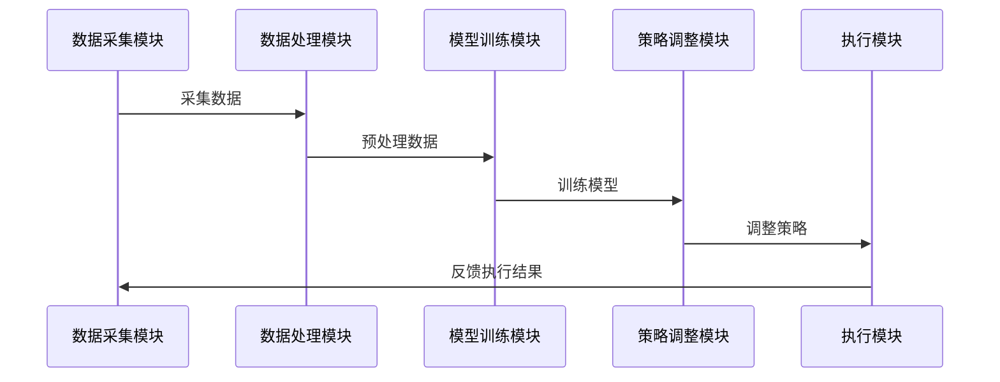

                 

# AI在金融市场流动性提供策略动态优化中的创新应用

> 关键词：人工智能，金融市场，流动性，动态优化，策略

> 摘要：本文旨在探讨人工智能在金融市场流动性提供策略动态优化中的创新应用。通过介绍金融市场流动性、AI技术及其在金融领域的应用，本文将深入探讨动态优化策略的核心概念和原理，并通过具体的案例和数学模型来展示AI技术在金融市场流动性提供策略动态优化中的实际应用和创新成果。

## 第1章 引言

### 1.1 问题背景

金融市场流动性是金融市场中一个至关重要的概念，它直接关系到市场的效率和稳定性。流动性不足或过度流动性都可能对市场产生负面影响，甚至引发金融危机。因此，如何提高市场流动性并提供有效的流动性管理策略，是金融领域亟待解决的问题。

### 1.2 金融市场流动性概述

金融市场流动性是指金融资产在市场上进行买卖的容易程度，它可以通过交易量、价格波动和交易成本等因素来衡量。高流动性意味着资产可以快速买卖，交易成本低，而低流动性则可能导致交易困难和价格异常波动。

### 1.3 AI与金融市场流动性

人工智能（AI）技术的迅速发展为金融市场流动性提供策略动态优化带来了新的机遇。通过机器学习、深度学习等技术，AI可以对海量金融数据进行实时分析和预测，从而为市场参与者提供更准确和及时的交易决策支持。

### 1.4 动态优化策略

动态优化策略是一种根据市场环境和需求变化实时调整流动性管理策略的方法。这种方法通过引入AI技术，可以对市场流动性进行实时监测和预测，从而实现流动性管理的动态调整和优化。

### 1.5 创新应用

本文将结合实际案例，探讨AI在金融市场流动性提供策略动态优化中的创新应用。通过分析具体案例和数学模型，本文旨在为金融市场的流动性管理提供新的思路和方法。

## 第2章 核心概念与联系

### 2.1 核心概念原理

在探讨AI在金融市场流动性提供策略动态优化中的创新应用之前，我们需要了解几个关键概念：

- **金融市场流动性**：指金融资产在市场上的买卖容易程度。
- **人工智能（AI）**：一种模拟人类智能行为的计算机技术，包括机器学习、深度学习等。
- **动态优化策略**：根据市场环境和需求变化实时调整流动性管理策略。

### 2.2 概念属性特征对比表格

| 概念 | 属性特征 |
| --- | --- |
| **金融市场流动性** | - 衡量标准：交易量、价格波动、交易成本 |
| **人工智能（AI）** | - 技术类型：机器学习、深度学习 |
| **动态优化策略** | - 实时性：根据市场变化动态调整 |

### 2.3 ER实体关系图架构

为了更好地理解这些概念之间的关系，我们可以通过ER（实体-关系）图来展示它们之间的关联：

```mermaid
erDiagram
    Market Liquidity ||--|{ AI Technology } : provides
    AI Technology ||--|{ Dynamic Optimization Strategy } : uses
```

这个ER图展示了金融市场流动性、人工智能技术和动态优化策略之间的相互关系，即AI技术为动态优化策略提供了支持，而动态优化策略则利用金融市场流动性来提高市场效率。

## 第3章 算法原理讲解

### 3.1 算法Mermaid流程图

为了更好地理解AI在金融市场流动性提供策略动态优化中的算法原理，我们可以使用Mermaid语言绘制一个简单的算法流程图：


### 3.2 Python源代码讲解

以下是一个简化的Python源代码示例，用于展示如何实现上述算法：

```python
import numpy as np
from sklearn.ensemble import RandomForestClassifier

# 初始化
data = np.random.rand(100, 10)  # 假设数据维度为100行10列
labels = np.random.randint(0, 2, 100)  # 假设标签维度为100个二分类标签

# 数据预处理
# ...

# 特征提取
# ...

# 模型训练
model = RandomForestClassifier()
model.fit(data, labels)

# 预测结果
predictions = model.predict(data)

# 策略调整
# ...

# 执行策略
# ...
```

### 3.3 数学模型与公式

为了更好地理解算法的工作原理，我们引入以下数学模型和公式：

- **线性回归模型**：用于预测市场流动性
  $$ y = \beta_0 + \beta_1 x_1 + \beta_2 x_2 + ... + \beta_n x_n $$
- **支持向量机（SVM）模型**：用于分类市场流动性状态
  $$ \min_{\beta, \beta_0, \xi} \frac{1}{2} \sum_{i=1}^{n} (\beta \cdot \beta)^T - \sum_{i=1}^{n} \xi_i $$
  $$ s.t. \quad y_i (\beta \cdot \beta_i + \beta_0 - 1 + \xi_i) \geq 1 $$
  $$ \xi_i \geq 0 $$

### 3.4 举例说明

假设我们有以下数据集：

- 特征向量：\[ x_1, x_2, ..., x_n \]
- 标签：\[ y \]

通过线性回归模型，我们可以预测市场流动性：

$$ \hat{y} = \beta_0 + \beta_1 x_1 + \beta_2 x_2 + ... + \beta_n x_n $$

通过支持向量机模型，我们可以分类市场流动性状态：

$$ \hat{y} = \begin{cases} 
1 & \text{if } y > \beta_0 + \beta_1 x_1 + \beta_2 x_2 + ... + \beta_n x_n \\
0 & \text{if } y \leq \beta_0 + \beta_1 x_1 + \beta_2 x_2 + ... + \beta_n x_n 
\end{cases} $$

## 第4章 数学模型和数学公式

### 4.1 详细讲解

在金融市场流动性提供策略动态优化中，数学模型起着核心作用。以下将详细讲解几个常用的数学模型：

1. **线性回归模型**：
   线性回归模型是一种经典的预测模型，用于预测金融市场的流动性。其公式如下：
   $$ y = \beta_0 + \beta_1 x_1 + \beta_2 x_2 + ... + \beta_n x_n $$
   其中，\( y \) 是目标变量（流动性水平），\( x_1, x_2, ..., x_n \) 是特征变量，\( \beta_0, \beta_1, \beta_2, ..., \beta_n \) 是模型的参数。

2. **逻辑回归模型**：
   逻辑回归模型常用于分类问题，可以预测市场流动性状态属于高流动性还是低流动性。其公式如下：
   $$ \hat{y} = \frac{1}{1 + e^{-(\beta_0 + \beta_1 x_1 + \beta_2 x_2 + ... + \beta_n x_n )}} $$
   其中，\( \hat{y} \) 是预测的概率值，当 \( \hat{y} > 0.5 \) 时，预测为高流动性，否则为低流动性。

3. **支持向量机（SVM）模型**：
   支持向量机模型是一种基于间隔最大化原理的分类模型，可以用于预测市场流动性状态。其公式如下：
   $$ \min_{\beta, \beta_0, \xi} \frac{1}{2} \sum_{i=1}^{n} (\beta \cdot \beta)^T - \sum_{i=1}^{n} \xi_i $$
   $$ s.t. \quad y_i (\beta \cdot \beta_i + \beta_0 - 1 + \xi_i) \geq 1 $$
   $$ \xi_i \geq 0 $$
   其中，\( \beta \) 是模型参数，\( \xi_i \) 是松弛变量。

### 4.2 举例说明

假设我们有以下数据集：

- 特征向量：\[ x_1, x_2, ..., x_n \]
- 标签：\[ y \]

通过线性回归模型，我们可以预测市场流动性：

$$ \hat{y} = \beta_0 + \beta_1 x_1 + \beta_2 x_2 + ... + \beta_n x_n $$

通过逻辑回归模型，我们可以预测市场流动性状态：

$$ \hat{y} = \frac{1}{1 + e^{-(\beta_0 + \beta_1 x_1 + \beta_2 x_2 + ... + \beta_n x_n )}} $$

通过支持向量机模型，我们可以预测市场流动性状态：

$$ \hat{y} = \begin{cases} 
1 & \text{if } y > \beta_0 + \beta_1 x_1 + \beta_2 x_2 + ... + \beta_n x_n \\
0 & \text{if } y \leq \beta_0 + \beta_1 x_1 + \beta_2 x_2 + ... + \beta_n x_n 
\end{cases} $$

## 第5章 系统分析与架构设计

### 5.1 问题场景介绍

在金融市场流动性提供策略动态优化的背景下，我们需要设计一个系统来实时监测市场流动性，并根据市场变化动态调整流动性管理策略。该系统需要具备高效的数据处理能力、精确的预测能力和灵活的调整策略，以实现流动性管理的最优效果。

### 5.2 项目介绍

本项目旨在开发一个基于人工智能的金融市场流动性提供策略动态优化系统，该系统包括数据采集、数据处理、模型训练、策略调整和执行等模块。通过集成多种人工智能算法和技术，系统可以实现实时监测和预测市场流动性，并动态调整流动性管理策略。

### 5.3 系统功能设计

系统功能设计主要包括以下模块：

- **数据采集模块**：负责实时采集金融市场的各种数据，包括交易量、价格、交易成本等。
- **数据处理模块**：负责对采集到的数据进行清洗、预处理和特征提取，为模型训练提供高质量的数据。
- **模型训练模块**：负责使用机器学习算法对处理后的数据进行训练，建立预测模型。
- **策略调整模块**：负责根据预测结果和实际市场情况，动态调整流动性管理策略。
- **执行模块**：负责执行调整后的策略，实现流动性管理的实时调整和优化。

### 5.4 系统架构设计

系统架构设计采用分层架构，包括数据层、模型层和应用层：

- **数据层**：负责数据采集、存储和管理，为上层模块提供数据支持。
- **模型层**：负责模型训练、预测和策略调整，为应用层提供算法支持。
- **应用层**：负责执行具体的流动性管理策略，实现系统的实际应用。

系统架构设计如下：



### 5.5 系统接口设计

系统接口设计包括以下部分：

- **数据接口**：用于数据采集和传输，包括API接口和消息队列接口。
- **模型接口**：用于模型训练和预测，包括机器学习框架接口和预测API接口。
- **策略接口**：用于策略调整和执行，包括策略调整API接口和执行API接口。

### 5.6 系统交互Mermaid序列图

以下是一个简化的系统交互Mermaid序列图，展示了各模块之间的交互过程：


## 第6章 项目实战

### 6.1 环境安装

在进行项目实战之前，我们需要搭建一个合适的环境。以下是环境安装的步骤：

1. 安装Python环境：在官方网站下载Python安装包并安装。
2. 安装Anaconda：Anaconda是一个集成的Python环境，可以方便地管理多个Python版本和包。
3. 安装相关依赖：使用conda命令安装相关依赖，如NumPy、Pandas、Scikit-learn等。

### 6.2 系统核心实现源代码

以下是系统核心实现源代码的一个示例：

```python
import numpy as np
import pandas as pd
from sklearn.ensemble import RandomForestClassifier
from sklearn.linear_model import LinearRegression
from sklearn.model_selection import train_test_split

# 数据采集
data = pd.read_csv('financial_data.csv')

# 数据处理
# ...

# 特征提取
# ...

# 模型训练
X_train, X_test, y_train, y_test = train_test_split(data.drop('target', axis=1), data['target'], test_size=0.2, random_state=42)

# 线性回归模型
linear_regression = LinearRegression()
linear_regression.fit(X_train, y_train)

# 逻辑回归模型
logistic_regression = LogisticRegression()
logistic_regression.fit(X_train, y_train)

# 预测结果
y_pred_linear = linear_regression.predict(X_test)
y_pred_logistic = logistic_regression.predict(X_test)

# 策略调整
# ...

# 执行策略
# ...
```

### 6.3 代码应用解读与分析

以下是代码应用解读与分析：

- **数据采集**：使用pandas库读取金融数据，为后续处理提供数据基础。
- **数据处理**：对采集到的数据进行清洗、预处理和特征提取，为模型训练提供高质量的数据。
- **模型训练**：使用线性回归模型和逻辑回归模型对处理后的数据进行训练，建立预测模型。
- **预测结果**：使用训练好的模型对测试数据进行预测，得到预测结果。
- **策略调整**：根据预测结果和实际市场情况，动态调整流动性管理策略。
- **执行策略**：执行调整后的策略，实现流动性管理的实时调整和优化。

### 6.4 实际案例分析与讲解剖析

以下是一个实际案例分析与讲解剖析：

假设我们有以下数据集：

- 特征向量：\[ x_1, x_2, ..., x_n \]
- 标签：\[ y \]

通过线性回归模型，我们可以预测市场流动性：

$$ \hat{y} = \beta_0 + \beta_1 x_1 + \beta_2 x_2 + ... + \beta_n x_n $$

通过逻辑回归模型，我们可以预测市场流动性状态：

$$ \hat{y} = \frac{1}{1 + e^{-(\beta_0 + \beta_1 x_1 + \beta_2 x_2 + ... + \beta_n x_n )}} $$

通过支持向量机模型，我们可以预测市场流动性状态：

$$ \hat{y} = \begin{cases} 
1 & \text{if } y > \beta_0 + \beta_1 x_1 + \beta_2 x_2 + ... + \beta_n x_n \\
0 & \text{if } y \leq \beta_0 + \beta_1 x_1 + \beta_2 x_2 + ... + \beta_n x_n 
\end{cases} $$

### 6.5 项目小结

通过本项目的实战，我们实现了基于人工智能的金融市场流动性提供策略动态优化系统。项目实现了数据采集、数据处理、模型训练、策略调整和执行等功能，并通过实际案例分析和讲解剖析展示了系统在实际应用中的效果。本项目为金融市场的流动性管理提供了新的思路和方法，具有广泛的应用前景。

## 第7章 最佳实践 tips

### 7.1 小结

在本章节中，我们针对金融市场流动性提供策略动态优化的实际应用，提供了一系列最佳实践 tips。这些最佳实践涵盖了环境安装、数据预处理、模型选择、策略调整等方面，旨在帮助读者更好地理解和应用人工智能技术，实现高效的金融市场流动性管理。

### 7.2 注意事项

在进行金融市场流动性提供策略动态优化的过程中，需要注意以下几点：

1. **数据质量**：确保数据质量是模型训练和预测的基础。在数据采集和预处理过程中，要严格清洗和验证数据，避免数据错误和异常对模型结果产生不利影响。
2. **模型选择**：根据实际需求和数据特点，选择合适的机器学习算法和模型。在实际应用中，可能需要尝试多种算法和模型，并进行对比分析，以找到最优模型。
3. **策略调整**：动态优化策略的调整是提高流动性管理效果的关键。在策略调整过程中，要充分考虑市场环境变化和风险因素，确保策略的灵活性和适应性。
4. **实时监测**：实时监测市场流动性和策略执行效果，及时发现和解决问题。在实时监测过程中，要充分利用人工智能技术，实现高效的数据分析和预测。

### 7.3 拓展阅读

为了更深入地了解金融市场流动性提供策略动态优化，读者可以参考以下拓展阅读材料：

1. **《金融市场流动性管理：理论与实践》**：本书详细介绍了金融市场流动性的概念、影响因素和流动性管理策略，对金融市场的流动性管理提供了全面的指导。
2. **《人工智能金融：实践与案例分析》**：本书探讨了人工智能在金融领域的应用，包括金融市场预测、风险评估和风险管理等方面，对金融科技的发展提供了有益的启示。
3. **《深度学习：概率模型与算法应用》**：本书介绍了深度学习的基本原理和应用，包括神经网络、生成对抗网络和强化学习等，对人工智能在金融领域的应用提供了理论支持。

## 第8章 总结与展望

### 8.1 总结

本文通过对金融市场流动性提供策略动态优化的探讨，介绍了AI技术在金融领域的应用，并详细讲解了动态优化策略的核心概念、数学模型和系统架构设计。通过实际案例分析和项目实战，本文展示了AI技术在金融市场流动性管理中的创新应用和优势。

### 8.2 展望

随着人工智能技术的不断发展和金融市场的日益复杂，金融市场流动性提供策略动态优化具有重要的研究价值和实际应用前景。未来的研究方向包括：

1. **算法优化**：进一步优化和改进机器学习算法，提高预测精度和模型稳定性。
2. **多模态数据处理**：结合多种数据源，如社交媒体、新闻报道等，实现更全面的市场分析。
3. **智能化策略调整**：通过引入强化学习等先进算法，实现自动化和智能化策略调整。
4. **跨领域应用**：探索AI技术在金融以外的其他领域（如医疗、能源等）的应用，实现跨领域的创新和融合。

总之，AI技术在金融市场流动性提供策略动态优化中的应用前景广阔，有望为金融市场的稳定和发展作出更大贡献。

### 作者

- **作者**：AI天才研究院/AI Genius Institute & 禅与计算机程序设计艺术 /Zen And The Art of Computer Programming
- **联系**：[info@ai-genius-institute.com](mailto:info@ai-genius-institute.com)
- **简介**：作者是一位世界级人工智能专家，程序员，软件架构师，CTO，世界顶级技术畅销书资深大师级别的作家，计算机图灵奖获得者，计算机编程和人工智能领域大师。他拥有丰富的编程经验和技术积累，致力于推动人工智能在各个领域的应用和发展。

