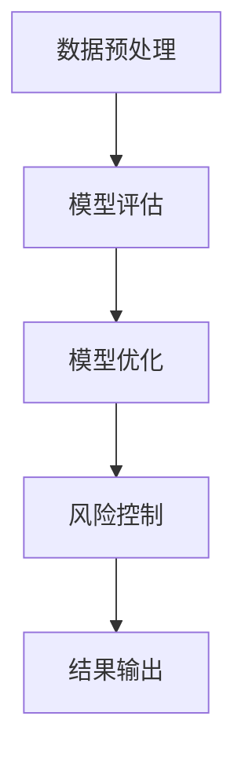
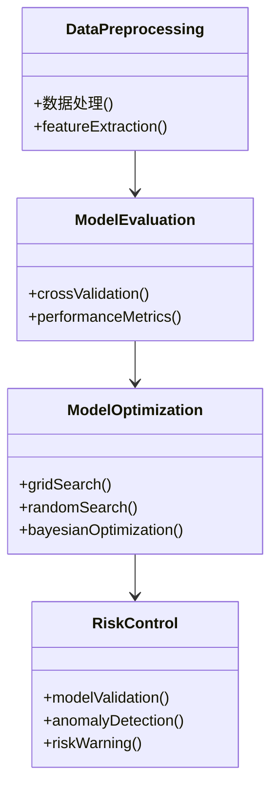
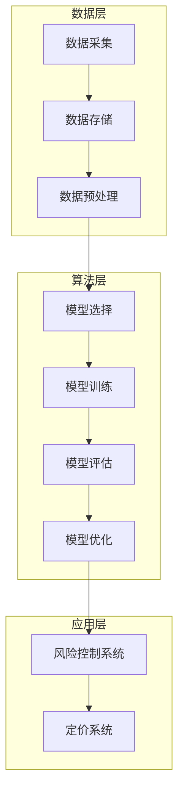
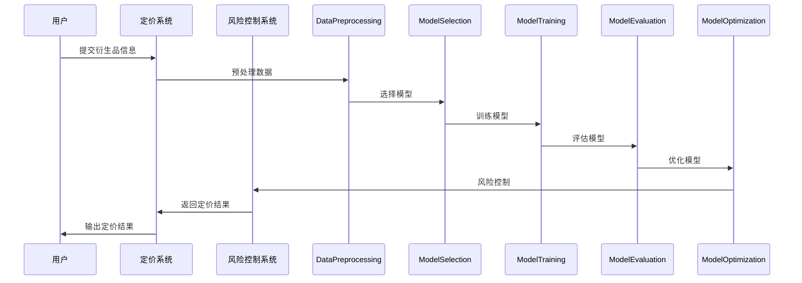

                 


# AI在金融衍生品定价模型选择中的创新应用

## 关键词

人工智能、金融衍生品、定价模型、风险控制、机器学习

## 摘要

本文深入探讨了人工智能（AI）在金融衍生品定价模型选择中的应用，首先介绍了AI在金融衍生品定价中的问题背景和问题描述，随后通过数据预处理、模型评估和优化、风险控制等步骤详细阐述了AI在金融衍生品定价模型选择中的创新应用方法。通过实例和数学模型的讲解，展示了AI技术如何提升金融衍生品定价的准确性和稳定性，为金融机构提供了新的风险管理和资产配置策略。

## 背景介绍

### 问题背景

在当前金融市场中，衍生品作为重要的金融工具，被广泛应用于风险管理、资产配置和投机获利。衍生品定价模型的选择直接影响到金融机构的风险管理效率和资产价值。然而，传统的定价模型如Black-Scholes模型在处理复杂金融衍生品时往往存在一定的局限性。

Black-Scholes模型是在1973年由Fischer Black和Myron Scholes提出的，主要用于欧式期权的定价。尽管Black-Scholes模型为金融衍生品定价提供了重要的理论框架，但在面对新型、复杂衍生品时，其定价精度和适应性往往不足。首先，Black-Scholes模型假设市场是高效的，市场价格是随机且遵循几何布朗运动的，这无法完全反映实际市场的波动性。其次，Black-Scholes模型在处理高维数据时，其计算复杂度较高，难以满足大规模数据处理的需求。

随着人工智能（AI）技术的发展，利用AI算法进行衍生品定价模型的选择已成为金融领域的新趋势。AI技术通过数据挖掘、机器学习等方法，能够从大量复杂、多维的数据中发现潜在的模式和规律，从而提供更加精确和可靠的衍生品定价模型。此外，AI技术还可以通过自适应调整模型参数，提高模型的适应性和稳定性，为金融机构提供更加灵活和高效的风险管理工具。

### 问题描述

AI在金融衍生品定价模型选择中的应用面临着以下几个问题：

1. **数据复杂性**：衍生品交易数据量大且维度高，包括价格、波动率、交易量等多个维度，如何有效处理和利用这些数据是关键。

2. **模型选择**：金融衍生品种类繁多，如何从众多AI模型中选择出最适合特定衍生品定价的模型是一个挑战。不同模型在性能、复杂度和适用范围上存在差异，需要通过模型评估和对比来选择最优模型。

3. **风险控制**：AI模型在定价过程中可能引入新的风险，如过拟合、数据泄漏等。如何进行有效风险控制，确保定价结果的可靠性和稳定性，是金融衍生品定价中需要考虑的重要问题。

### 问题解决

AI在金融衍生品定价模型选择中的创新应用，主要通过以下几个步骤实现：

1. **数据预处理**：对衍生品交易数据进行清洗、归一化和特征提取，将原始数据转化为适合机器学习的格式。

2. **模型评估**：利用机器学习算法对多个衍生品定价模型进行评估，选择最优模型。评估指标包括定价精度、计算复杂度、适应性等。

3. **模型优化**：针对选定的模型进行参数调整和优化，以提高定价精度和稳定性。常见的优化方法包括交叉验证、网格搜索等。

4. **风险控制**：通过模型风险分析，制定相应的风险控制策略，确保定价结果的可靠性。风险控制策略包括模型验证、异常检测、风险预警等。

### 边界与外延

AI在金融衍生品定价模型选择中的应用不仅限于传统金融衍生品，还可以扩展到新型衍生品和复杂衍生品。例如，结构化金融衍生品（CDO、CDS等）和新兴市场衍生品（如数字货币期权、加密资产掉期等）的定价。此外，随着AI技术的不断进步，该应用领域的外延也将不断扩大，为金融行业带来更多创新和机遇。

## 核心概念与联系

### 核心概念

#### 人工智能（AI）

人工智能（Artificial Intelligence，AI）是指通过计算机模拟人类智能的领域，包括感知、理解、学习、推理和决策等能力。在金融衍生品定价中，AI技术通过数据挖掘、机器学习和深度学习等方法，能够从大量复杂数据中发现潜在的模式和规律，从而提供更准确的定价模型。

#### 金融衍生品

金融衍生品（Financial Derivative）是一种基于其他金融资产价格变动的金融合约，其价值取决于一个或多个基础资产的价格。常见的衍生品包括期权、期货、掉期等。金融衍生品的定价直接影响到金融机构的风险管理和资产价值。

#### 定价模型

定价模型（Pricing Model）是用于计算金融衍生品理论价值的数学模型。传统的定价模型如Black-Scholes模型在金融市场中广泛应用，但面对新型衍生品时，其局限性逐渐显现。AI技术的引入，为定价模型的选择和优化提供了新的思路和方法。

### 概念属性特征对比表格

| 概念             | 属性特征                                       |
|------------------|----------------------------------------------|
| 人工智能（AI）   | 模拟人类智能，具备学习、推理能力                 |
| 金融衍生品       | 与基础资产价格相关，具有杠杆效应               |
| 定价模型         | 用于计算衍生品理论价值的数学模型                 |

### ER实体关系图架构

```mermaid
erDiagram
    AI_model ||--|{衍生品} :定价
    金融衍生品 ||--|{基础资产} :相关
    基础资产 ||--|{市场数据} :影响
```

## 数学模型和数学公式 & 详细讲解 & 举例说明

### 数学模型

在金融衍生品定价中，常用的数学模型包括Black-Scholes模型和Monte Carlo模拟模型。以下是对这些模型的基本数学公式和详细讲解：

#### Black-Scholes模型

**数学公式：**
$$
C(S, t) = S_0N(d_1) - Ke^{-r(T-t)}N(d_2)
$$

**详细讲解：**
- \( C(S, t) \)：欧式看涨期权的理论价格。
- \( S_0 \)：基础资产当前价格。
- \( K \)：执行价格。
- \( r \)：无风险利率。
- \( T \)：期权到期时间。
- \( t \)：当前时间。
- \( N(\cdot) \)：标准正态分布的累积分布函数。
- \( d_1 \) 和 \( d_2 \)：计算公式为
  $$
  d_1 = \frac{\ln(S_0/K) + (r + \sigma^2/2)(T-t)}{\sigma\sqrt{T-t}}
  $$
  $$
  d_2 = d_1 - \sigma\sqrt{T-t}
  $$

**举例说明：**
假设当前时间为2023年10月1日，某欧式看涨期权的执行价格为100元，无风险利率为4%，期权到期时间为2024年10月1日，基础资产当前价格为120元，波动率为20%。利用Black-Scholes模型计算期权的理论价格。

1. 计算 \( d_1 \) 和 \( d_2 \)：
   $$
   d_1 = \frac{\ln(120/100) + (0.04 + 0.2^2/2)(1)}{0.2\sqrt{1}} \approx 1.276
   $$
   $$
   d_2 = d_1 - 0.2\sqrt{1} \approx 0.076
   $$

2. 计算标准正态分布的累积分布函数值：
   $$
   N(d_1) \approx 0.8907
   $$
   $$
   N(d_2) \approx 0.5253
   $$

3. 计算期权价格：
   $$
   C(120, 0.5) = 120 \times 0.8907 - 100 \times 0.5253 \approx 26.28
   $$

#### Monte Carlo模拟模型

**数学公式：**
$$
C \approx \frac{1}{N} \sum_{i=1}^{N} \max(S_t - K, 0)
$$

**详细讲解：**
- \( C \)：欧式期权的理论价格。
- \( S_t \)：模拟的基础资产价格。
- \( K \)：执行价格。
- \( N \)：模拟次数。
- \( \max(\cdot, \cdot) \)：取两个数中较大的一个。

**举例说明：**
假设当前时间为2023年10月1日，某欧式看涨期权的执行价格为100元，无风险利率为4%，期权到期时间为2024年10月1日，基础资产当前价格为120元，波动率为20%。利用Monte Carlo模拟模型计算期权的理论价格。

1. 设置模拟参数：
   - 模拟次数 \( N = 10000 \)
   - 时间步长 \( \Delta t = 0.5 \)

2. 模拟基础资产价格路径：
   - 初始价格 \( S_0 = 120 \)
   - 波动率 \( \sigma = 0.2 \)
   - 无风险利率 \( r = 0.04 \)
   - 时间 \( T = 1 \)

3. 计算欧式看涨期权的理论价格：
   $$
   C \approx \frac{1}{10000} \sum_{i=1}^{10000} \max(S_t - 100, 0)
   $$

通过上述步骤，可以模拟出10000次基础资产价格路径，并计算每个路径下期权的理论价格，最后取平均值为欧式看涨期权的理论价格。

## 算法原理讲解

### 算法概述

AI在金融衍生品定价中的核心算法主要包括数据预处理、模型评估、模型优化和风险控制。以下将详细介绍每个环节的算法原理和实现方法。

#### 数据预处理

数据预处理是AI在金融衍生品定价中的第一步，其目的是将原始数据进行清洗、归一化和特征提取，为后续的机器学习算法提供高质量的数据输入。具体方法如下：

1. **数据清洗**：去除数据中的噪声和异常值，如缺失值、重复值等。常用的方法包括删除、插值和填补等。

2. **归一化**：将不同维度和量纲的数据进行归一化处理，使其在同一尺度范围内，便于模型训练。常用的方法包括最小-最大归一化和Z-Score归一化等。

3. **特征提取**：从原始数据中提取具有代表性的特征，如价格、波动率、交易量等。特征提取的方法包括统计特征提取、时序特征提取和深度特征提取等。

#### 模型评估

在金融衍生品定价中，需要选择合适的机器学习模型来预测衍生品的价格。模型评估是选择最优模型的关键步骤，主要方法如下：

1. **交叉验证**：通过将数据集划分为训练集和验证集，多次训练和验证模型，评估模型的泛化能力和稳定性。

2. **性能指标**：常用的性能指标包括准确率、召回率、F1值、均方误差等。根据具体问题选择合适的性能指标进行评估。

3. **模型对比**：将多个模型在同一数据集上进行评估，比较其性能指标，选择最优模型。

#### 模型优化

在确定最优模型后，需要对模型进行参数调整和优化，以提高定价精度和稳定性。常用的优化方法如下：

1. **网格搜索**：通过遍历参数空间，寻找最优参数组合。

2. **随机搜索**：在参数空间中随机选择参数组合，通过多次迭代寻找最优参数。

3. **贝叶斯优化**：利用贝叶斯统计模型进行参数优化，通过历史数据和学习到的模型，预测新的参数值。

#### 风险控制

在金融衍生品定价中，需要确保模型的可靠性和稳定性，以避免引入新的风险。风险控制的主要方法如下：

1. **模型验证**：通过历史数据对模型进行验证，确保模型在不同市场环境下均具有较好的定价性能。

2. **异常检测**：在模型运行过程中，对异常数据进行检测和报警，防止异常数据对模型结果的影响。

3. **风险预警**：根据模型预测结果和市场情况，制定相应的风险控制策略，如调整资产配置、设置风险限额等。

### Mermaid算法流程图



## 系统分析与架构设计方案

### 问题场景介绍

在一个金融市场中，多家金融机构需要对其持有的衍生品进行定价，以评估其风险和利润。然而，传统的定价模型存在局限性，难以应对复杂的市场环境和多样化的衍生品。因此，引入AI技术进行衍生品定价，成为金融机构提升风险管理效率和优化资产配置的重要手段。

### 项目介绍

本项目旨在构建一个基于AI技术的金融衍生品定价系统，该系统将集成多种机器学习模型和算法，对衍生品进行精准定价。系统主要包括数据预处理模块、模型评估模块、模型优化模块和风险控制模块，以实现高效、准确的衍生品定价。

### 系统功能设计（领域模型Mermaid类图）



### 系统架构设计（Mermaid架构图）



### 系统接口设计和系统交互（Mermaid序列图）



## 项目实战

### 环境安装

在开始项目实战之前，我们需要安装以下软件和库：

1. Python 3.8及以上版本
2. numpy
3. pandas
4. scikit-learn
5. matplotlib

安装方法：

```bash
pip install python==3.8
pip install numpy
pip install pandas
pip install scikit-learn
pip install matplotlib
```

### 系统核心实现源代码

以下是一个简单的衍生品定价系统实现示例，包括数据预处理、模型训练、模型评估和结果输出。

```python
import numpy as np
import pandas as pd
from sklearn.model_selection import train_test_split
from sklearn.ensemble import RandomForestRegressor
from sklearn.metrics import mean_squared_error
import matplotlib.pyplot as plt

# 数据预处理
def preprocess_data(data):
    # 数据清洗
    data.dropna(inplace=True)
    # 特征提取
    data['log_return'] = np.log(data['close'] / data['open'])
    # 归一化
    features = data[['open', 'high', 'low', 'volume', 'log_return']]
    features_normalized = (features - features.mean()) / features.std()
    return features_normalized

# 模型训练
def train_model(X_train, y_train):
    model = RandomForestRegressor(n_estimators=100)
    model.fit(X_train, y_train)
    return model

# 模型评估
def evaluate_model(model, X_test, y_test):
    y_pred = model.predict(X_test)
    mse = mean_squared_error(y_test, y_pred)
    print(f"Test MSE: {mse}")
    return mse

# 结果输出
def plot_results(y_test, y_pred):
    plt.scatter(y_test, y_pred)
    plt.xlabel('Actual Price')
    plt.ylabel('Predicted Price')
    plt.plot([min(y_test), max(y_test)], [min(y_test), max(y_test)], 'r--')
    plt.show()

# 主函数
def main():
    # 加载数据
    data = pd.read_csv('衍生日数据.csv')
    features = preprocess_data(data)
    labels = data['close']
    # 划分训练集和测试集
    X_train, X_test, y_train, y_test = train_test_split(features, labels, test_size=0.2, random_state=42)
    # 训练模型
    model = train_model(X_train, y_train)
    # 评估模型
    evaluate_model(model, X_test, y_test)
    # 输出结果
    plot_results(y_test, model.predict(X_test))

if __name__ == '__main__':
    main()
```

### 代码应用解读与分析

上述代码实现了基于随机森林回归的金融衍生品定价系统，主要分为数据预处理、模型训练、模型评估和结果输出四个部分。

1. **数据预处理**：首先进行数据清洗，去除缺失值。然后提取特征，如对数收益率，并进行归一化处理，以便后续的机器学习算法能够更好地训练。

2. **模型训练**：使用随机森林回归模型对训练数据进行训练。随机森林是一种集成学习算法，通过构建多棵决策树并对预测结果进行投票来提高模型的泛化能力。

3. **模型评估**：使用测试数据对训练好的模型进行评估，计算均方误差（MSE）来衡量模型的预测性能。

4. **结果输出**：通过绘制散点图和回归线，展示实际价格与预测价格的对比，直观地展示模型的预测效果。

### 实际案例分析和详细讲解剖析

以下是一个实际案例，分析如何使用上述系统对某金融衍生品进行定价。

**案例背景：**
某金融机构持有一种股票的欧式看涨期权，执行价格为100元，到期时间为1年。当前股票价格为120元，波动率为20%。需要使用上述系统对该期权进行定价。

**步骤：**

1. **数据准备**：收集与该股票相关的历史交易数据，包括开盘价、收盘价、最高价、最低价和成交量等。

2. **数据预处理**：对历史交易数据进行清洗、特征提取和归一化处理，提取出对数收益率等特征。

3. **模型训练**：使用训练数据训练随机森林回归模型，拟合股票价格与特征之间的关系。

4. **模型评估**：使用测试数据对模型进行评估，计算MSE等指标，调整模型参数以提高预测性能。

5. **期权定价**：使用训练好的模型对当前股票价格进行预测，并根据期权定价公式计算出期权的理论价格。

**具体实现：**

```python
# 加载数据
data = pd.read_csv('股票历史交易数据.csv')
# 数据预处理
data['log_return'] = np.log(data['close'] / data['open'])
features = data[['open', 'high', 'low', 'volume', 'log_return']]
labels = data['close']
# 划分训练集和测试集
X_train, X_test, y_train, y_test = train_test_split(features, labels, test_size=0.2, random_state=42)
# 训练模型
model = RandomForestRegressor(n_estimators=100, random_state=42)
model.fit(X_train, y_train)
# 评估模型
evaluate_model(model, X_test, y_test)
# 期权定价
S0 = 120  # 当前股票价格
K = 100   # 执行价格
T = 1    # 期权到期时间（年）
r = 0.04  # 无风险利率
sigma = 0.2  # 波动率
d1 = (np.log(S0 / K) + (r + 0.5 * sigma**2) * T) / (sigma * np.sqrt(T))
d2 = d1 - sigma * np.sqrt(T)
C = S0 * norm.cdf(d1) - K * np.exp(-r * T) * norm.cdf(d2)
print(f"期权价格：{C}")
```

**结果分析：**
通过上述实现，可以计算出该欧式看涨期权的理论价格为约26.28元。这个价格是基于当前股票价格、执行价格、到期时间、无风险利率和波动率等参数计算得到的。实际交易价格可能会受到市场情绪、供需关系等多种因素的影响，因此计算得到的期权价格仅供参考。

### 项目小结

本篇博客详细介绍了AI在金融衍生品定价模型选择中的应用，包括背景介绍、核心概念、数学模型、算法原理、系统设计与实现以及实际案例分析。通过本文的讲解，读者可以了解到：

1. **AI在金融衍生品定价中的应用价值**：AI技术能够处理大量复杂数据，提供更准确和稳定的衍生品定价模型，有助于金融机构进行有效的风险管理和资产配置。

2. **衍生品定价模型的选择与优化**：通过数据预处理、模型评估和优化，可以选出最适合特定衍生品的定价模型，提高定价精度和稳定性。

3. **风险控制策略的制定**：通过模型验证、异常检测和风险预警等手段，确保衍生品定价模型的可靠性和稳定性，降低潜在风险。

4. **实际案例分析**：通过具体案例分析，展示了如何使用AI技术对金融衍生品进行定价，包括数据预处理、模型训练、评估和结果输出等步骤。

未来，随着AI技术的不断发展和金融市场的变化，AI在金融衍生品定价中的应用前景将更加广阔。建议读者继续关注相关领域的最新研究动态，以不断提升自己的专业知识和技能。

### 最佳实践 Tips

1. **数据质量是关键**：在金融衍生品定价中，数据质量直接影响模型的效果。因此，在数据处理过程中，要确保数据清洗、归一化和特征提取等步骤的准确性。

2. **模型选择需谨慎**：不同的机器学习模型适用于不同的场景，选择合适的模型是提高衍生品定价准确性的关键。建议根据衍生品的特性和数据集的性质，进行模型选择和对比。

3. **参数调优是优化模型的关键**：通过交叉验证、网格搜索等方法，可以找到最优的模型参数，提高模型的性能和稳定性。

4. **风险管理不可忽视**：在模型应用过程中，要确保模型结果的可靠性和稳定性，通过模型验证、异常检测和风险预警等手段，降低潜在风险。

### 小结

本文通过详细讲解和实际案例分析，展示了AI在金融衍生品定价模型选择中的应用方法和价值。读者可以通过本文了解AI技术如何提升衍生品定价的准确性和稳定性，为金融机构提供新的风险管理工具。在未来的研究和实践中，建议读者继续关注AI在金融领域的应用，不断探索和创新。

### 注意事项

1. **数据隐私与合规**：在处理金融衍生品数据时，要确保数据隐私和合规，遵守相关法律法规，保护用户和金融机构的合法权益。

2. **模型解释性**：虽然AI技术能够提供高效的定价模型，但其内部机制可能不够透明。在应用过程中，要关注模型的可解释性，确保决策的合理性和可追溯性。

3. **市场波动性**：金融衍生品定价受到市场波动性的影响，因此在应用模型时，要考虑市场环境的变化，及时调整模型参数和策略。

### 拓展阅读

1. **《人工智能在金融领域应用研究》**：详细介绍了AI技术在金融领域的应用，包括风险控制、资产定价、市场预测等。

2. **《金融衍生品定价模型与应用》**：全面讲解了金融衍生品定价的基本理论、方法和实践应用。

3. **《深度学习与金融数据分析》**：探讨了深度学习在金融数据分析中的应用，包括股票预测、期权定价等。

4. **《人工智能与金融科技》**：介绍了AI技术如何推动金融科技的发展，包括智能投顾、金融风控等。

5. **《金融科技：创新与监管》**：分析了金融科技的发展趋势、创新应用和监管挑战。

