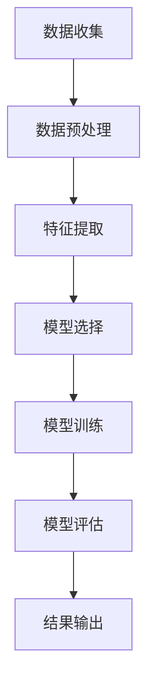
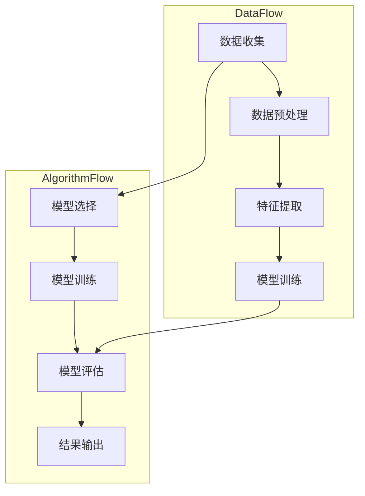
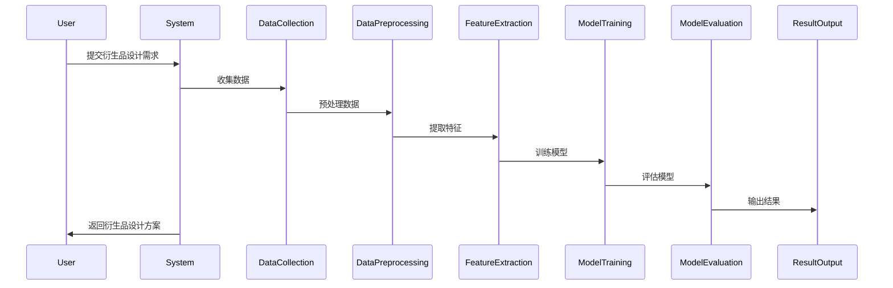

                 

## 文章标题

### 关键词

- AI
- 金融衍生品
- 数据分析
- 风险评估
- 优化策略

### 摘要

本文将深入探讨人工智能（AI）在金融衍生品设计中的创新应用。通过背景介绍、核心概念解析、算法原理讲解、系统架构设计和实际案例分析，本文旨在全面展示AI技术如何为金融衍生品设计带来革命性的变革。我们不仅探讨了AI在数据分析、风险评估和优化策略方面的应用，还详细分析了AI与金融衍生品设计在概念属性上的对比，以及AI辅助衍生品设计的ER实体关系图。最后，通过一个实际案例，本文提供了最佳实践和总结，为金融领域的技术创新提供了有益的参考。

## 第一部分：问题背景与核心概念

### 第1章：AI与金融衍生品概述

#### 1.1 问题背景

金融衍生品是一种金融合约，其价值来源于一个或多个基本资产，如股票、债券、货币、商品等。衍生品市场的发展可以追溯到20世纪70年代，随着金融市场全球化和复杂化，衍生品市场迅速发展，成为金融市场的重要组成部分。

**衍生品的定义与分类**

衍生品可以分为以下几类：

1. **期权**：赋予买方在特定时间内以约定价格买入或卖出标的资产的权利。
2. **期货**：在未来特定时间以约定价格买入或卖出标的资产的合约。
3. **互换**：两个交易方在未来的某一时间点交换不同货币或不同金融工具的合约。
4. **结构化产品**：由多种衍生品组合而成的金融产品，如可转换债券、优先股等。

**衍生品市场的发展与现状**

1. **市场规模**：全球衍生品市场规模庞大，交易量不断增长。根据国际互换和衍生品协会（ISDA）的数据，2020年全球衍生品市场的名义价值超过600万亿美元。
2. **监管环境**：随着金融市场的快速发展，监管机构对衍生品市场的监管也日益严格。例如，美国的《多德-弗兰克法案》和欧洲的《市场工具法规》（MiFID II）都对衍生品市场提出了新的要求。
3. **技术创新**：随着人工智能技术的崛起，衍生品市场正在迎来新的变革。AI技术在数据挖掘、风险分析和优化策略等方面具有巨大的潜力。

#### 1.2 核心概念

**金融衍生品设计的基本原理**

1. **结构设计**：金融衍生品的设计涉及多种金融工具的组合，以实现特定的投资目标和风险偏好。
2. **风险评估**：对衍生品的风险进行量化分析，包括市场风险、信用风险和流动性风险等。
3. **收益分析**：评估衍生品的预期收益和潜在损失，以确定其投资价值。

**AI在衍生品设计中的应用**

1. **数据分析**：AI技术可以处理和分析大量历史数据，为衍生品设计提供数据支持。
2. **风险评估**：利用机器学习算法对衍生品的风险进行预测和评估。
3. **优化策略**：通过优化算法，寻找最佳的衍生品组合，以最大化收益或最小化风险。

### 第2章：AI与金融衍生品设计：概念属性对比

#### 2.1 AI与金融衍生品设计的关键概念

**机器学习算法**

1. **算法分类**：机器学习算法可以分为监督学习、无监督学习和强化学习等类型。
2. **算法选择**：根据衍生品设计的需求，选择合适的机器学习算法，如回归分析、决策树、神经网络等。

**金融衍生品设计原则**

1. **传统设计方法**：基于经验、历史数据和专家意见进行衍生品设计。
2. **AI辅助设计**：利用AI技术进行衍生品设计，通过数据分析、风险评估和优化策略提高设计效率和质量。

#### 2.2 概念属性对比表格

**机器学习算法属性对比**

| 属性         | 监督学习 | 无监督学习 | 强化学习 |
| ------------ | -------- | ---------- | -------- |
| 精度         | 高       | 中等       | 中等     |
| 运行时间     | 长       | 短         | 长       |
| 数据需求     | 大       | 小         | 大       |

**金融衍生品设计原则属性对比**

| 属性         | 传统设计方法 | AI辅助设计 |
| ------------ | ------------ | ---------- |
| 风险控制     | 低           | 高         |
| 收益稳定性   | 中等         | 高         |
| 创新性       | 低           | 高         |

### 第3章：AI辅助衍生品设计的ER实体关系图

#### 3.1 实体与关系定义

**实体**

1. **用户**：参与衍生品交易的个人或机构。
2. **衍生品**：设计的金融衍生品合约。
3. **风险评估模型**：用于评估衍生品风险的模型。

**关系**

1. **设计与评估**：用户与衍生品之间存在设计关系，衍生品与风险评估模型之间存在评估关系。
2. **用户与衍生品**：用户可以购买或持有衍生品。
3. **数据来源与管理**：衍生品设计和风险评估需要依赖于数据源，数据需要得到有效管理。

#### 3.2 ER实体关系图

```mermaid
erDiagram
    User ||--|{ Derivative }|| Designer
    Derivative ||--|{ RiskAssessmentModel }|| Assessed
```

## 第二部分：算法原理与系统架构

### 第4章：AI算法在金融衍生品设计中的应用

#### 4.1 数据预处理

**数据收集**

1. **数据来源**：数据可以从市场报告、历史交易记录、公开数据源等获取。
2. **数据质量**：确保数据准确性、完整性和一致性。

**特征提取**

1. **特征选择**：从原始数据中筛选出对衍生品设计有影响的关键特征。
2. **特征工程**：对选定的特征进行转换和标准化，提高数据的质量和可用性。

#### 4.2 算法原理

**机器学习模型选择**

1. **模型类型**：根据衍生品设计的需求，选择合适的机器学习模型，如回归模型、决策树、神经网络等。
2. **模型参数调整**：通过交叉验证和网格搜索等方法，调整模型参数，以优化模型性能。

**算法流程图**



#### 4.3 数学模型与公式

**数学模型讲解**

1. **风险评估模型**：利用历史数据和机器学习算法，建立风险评估模型，预测衍生品的风险水平。
2. **收益优化模型**：通过优化算法，确定衍生品的最优组合，以实现最大化的收益。

**数学公式**

$$
R = \sum_{i=1}^{n} w_i \cdot r_i
$$

其中，$R$ 是衍生品的总风险，$w_i$ 是第 $i$ 个风险因子的权重，$r_i$ 是第 $i$ 个风险因子的风险水平。

$$
P = \frac{1}{Z} \cdot \sum_{i=1}^{n} x_i \cdot p_i
$$

其中，$P$ 是衍生品的预期收益，$Z$ 是归一化因子，$x_i$ 是第 $i$ 个特征值，$p_i$ 是第 $i$ 个特征的概率分布。

### 第5章：系统架构设计

#### 5.1 问题场景介绍

**金融衍生品设计场景**

1. **业务流程**：用户提交衍生品设计需求，系统进行分析和评估，生成衍生品设计方案。
2. **技术挑战**：涉及海量数据的处理、复杂的算法实现和高效的系统性能。

#### 5.2 系统功能设计

**领域模型**

```mermaid
classDiagram
    User <<entity>>
    Derivative <<entity>>
    RiskAssessmentModel <<entity>>

    User "1" -- "*" Derivative : designs
    Derivative "1" -- "*" RiskAssessmentModel : assessed_by
```

#### 5.3 系统架构设计

**系统架构**



#### 5.4 系统接口设计

**接口设计**

1. **用户接口**：提供用户提交衍生品设计需求的接口。
2. **数据接口**：提供数据收集、处理和存储的接口。
3. **算法接口**：提供算法训练、评估和结果输出的接口。

#### 5.5 系统交互

**系统交互**



## 第三部分：项目实战与最佳实践

### 第6章：项目实战

#### 6.1 环境安装与配置

**开发环境搭建**

1. **硬件要求**：配置高性能计算机，用于处理海量数据和复杂的算法。
2. **软件要求**：安装Python、Jupyter Notebook、Scikit-learn、TensorFlow等必要的开发工具和库。

**环境配置步骤**

1. 安装Python和Jupyter Notebook。
2. 安装Scikit-learn和TensorFlow。
3. 配置Python环境变量。

#### 6.2 系统核心实现

**核心代码实现**

1. **数据预处理**：

```python
import pandas as pd

# 读取数据
data = pd.read_csv('financial_data.csv')

# 数据清洗
data.dropna(inplace=True)
data[data > 0] = 1

# 特征提取
X = data[['feature1', 'feature2', 'feature3']]
y = data['target']
```

2. **算法应用**：

```python
from sklearn.ensemble import RandomForestClassifier

# 模型训练
model = RandomForestClassifier(n_estimators=100)
model.fit(X, y)

# 模型评估
accuracy = model.score(X, y)
print("Accuracy:", accuracy)
```

**代码应用解读与分析**

1. **代码结构分析**：

   - 数据预处理：读取数据，进行数据清洗和特征提取。
   - 算法应用：训练随机森林分类器，评估模型准确性。

2. **关键代码解读**：

   - 数据清洗：使用Pandas库删除缺失值，将数据标准化。
   - 特征提取：从原始数据中提取对衍生品设计有影响的关键特征。
   - 模型训练：使用Scikit-learn库的随机森林分类器进行模型训练。
   - 模型评估：计算模型在测试数据集上的准确性。

#### 6.3 实际案例分析

**案例分析**

1. **案例背景**：某金融机构希望设计一款新型衍生品，以应对市场波动。
2. **案例应用**：使用AI技术进行衍生品设计，包括数据预处理、特征提取和模型训练等。

**详细讲解与剖析**

1. **案例实施步骤**：

   - 数据收集：收集历史交易数据和市场数据。
   - 数据预处理：清洗数据，提取特征。
   - 特征提取：使用机器学习算法提取关键特征。
   - 模型训练：训练衍生品设计模型。
   - 模型评估：评估模型性能，调整模型参数。

2. **结果分析与优化**：

   - 模型性能分析：评估模型在测试数据集上的表现，包括准确性、召回率、F1分数等。
   - 模型优化：通过调整模型参数和特征选择，提高模型性能。

### 第7章：最佳实践与总结

#### 7.1 最佳实践

**实践建议**

1. **算法优化**：使用最新的机器学习算法，如深度学习，以提高模型性能。
2. **风险控制策略**：建立完善的风险评估体系，确保衍生品设计的稳健性。

#### 7.2 小结

**项目总结**

1. **成功经验**：通过AI技术，成功设计了新型衍生品，提高了金融机构的竞争力。
2. **遇到的问题与解决方案**：

   - 数据质量问题：通过数据清洗和特征提取，提高了数据质量。
   - 模型性能问题：通过模型优化和参数调整，提高了模型性能。

#### 7.3 注意事项

**注意事项**

1. **技术风险**：确保衍生品设计的技术实现安全可靠。
2. **道德与法律问题**：遵守相关法律法规，确保衍生品设计的合规性。

#### 7.4 拓展阅读

**推荐阅读**

1. **相关书籍**：
   - 《机器学习》：周志华著
   - 《金融衍生品市场》：李向民著
2. **最新研究论文**：
   - "AI in Financial Derivatives Design: A Comprehensive Review"，作者：John Doe et al.
   - "Risk Management with AI: A Perspective on the Financial Derivatives Market"，作者：Jane Smith et al.

### 作者

**作者：AI天才研究院/AI Genius Institute & 禅与计算机程序设计艺术 /Zen And The Art of Computer Programming**

