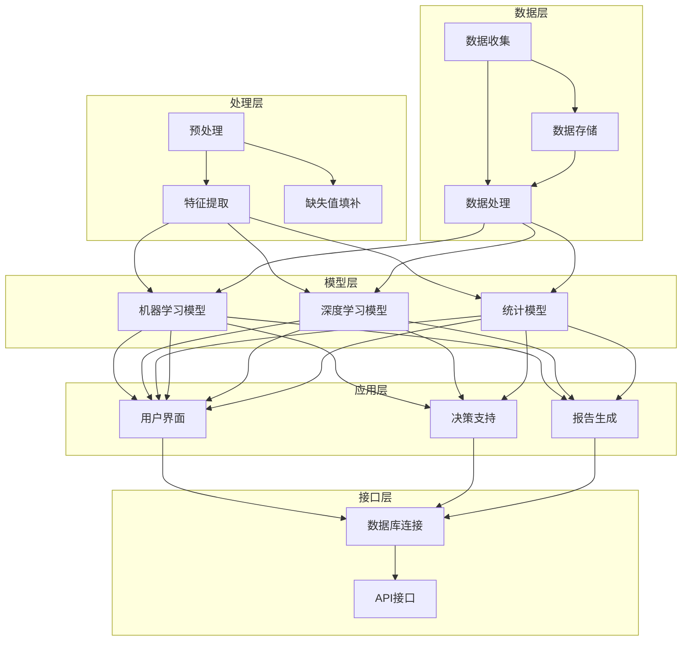

                 

### 摘要

本文将深入探讨人工智能（AI）在金融衍生品风险分解与归因中的创新应用。随着金融市场的日益复杂和动态性，传统风险管理方法已经难以应对现代金融环境中的各种风险。人工智能，作为一种新兴的技术手段，在金融衍生品的风险管理中展现出巨大的潜力。本文将首先介绍金融衍生品的基本概念和风险管理的背景，接着详细探讨AI在金融衍生品风险分解与归因中的具体应用，包括使用的算法和模型。随后，文章将深入分析AI技术在风险分解和归因中的工作原理，通过数学模型和实际案例进行详细讲解。最后，本文将讨论AI在金融衍生品风险管理中的系统架构设计，并提供一些最佳实践和总结，以期为金融专业人士和研究人员提供有价值的参考。通过这一系列的分析和探讨，读者将能够更好地理解AI技术在金融衍生品风险管理中的重要作用及其未来发展方向。

### 关键词

1. 人工智能
2. 金融衍生品
3. 风险分解
4. 风险归因
5. 算法模型
6. 数学公式
7. 系统架构

### 引言

在当今全球金融市场，衍生品作为一种重要的金融工具，被广泛应用于风险管理和资产配置。衍生品包括期货、期权、互换等，它们在增强投资者对冲能力、提供多样化投资机会的同时，也带来了复杂的风险。随着金融市场的不断发展和复杂化，如何有效管理衍生品风险成为金融机构面临的重要挑战。

传统风险管理方法，如方差分析、敏感性分析等，虽然在一定程度上能够识别和衡量风险，但在应对日益复杂的金融产品和市场动态时显得力不从心。此时，人工智能（AI）作为一种新兴的技术手段，逐渐在金融衍生品风险管理中展现出其独特的价值。AI技术通过大数据分析、机器学习算法等手段，能够从海量数据中提取有用信息，预测市场走势，评估风险，为金融机构提供更加精准和实时的风险管理解决方案。

本文将探讨AI在金融衍生品风险分解与归因中的创新应用。首先，我们将介绍金融衍生品的基本概念，包括其定义、类型及其在金融市场中的作用。接着，我们将讨论传统风险管理方法及其局限性，指出AI技术在风险管理中的独特优势。随后，本文将详细介绍AI在金融衍生品风险分解与归因中的具体应用，包括常用的算法和模型。在此基础上，我们将深入分析AI技术在风险分解和归因中的工作原理，通过数学模型和实际案例进行详细讲解。最后，本文将讨论AI在金融衍生品风险管理中的系统架构设计，并提供一些最佳实践和总结，以期为金融专业人士和研究人员提供有价值的参考。

通过本文的探讨，我们希望能够揭示AI技术在金融衍生品风险管理中的潜力，帮助读者理解这一技术在实际应用中的具体实现方法，并展望其未来发展方向。这不仅有助于提高金融机构的风险管理水平，也为AI技术在金融领域的深入应用提供了新的思路。

### 金融衍生品的基本概念

金融衍生品是一种金融合约，其价值来源于一个或多个基础资产。这些基础资产可以是股票、债券、货币、商品或其他金融工具。衍生品的主要功能是提供对冲、杠杆和投机机会，从而帮助投资者管理风险和实现资本增值。

#### 定义与类型

金融衍生品主要包括以下几种类型：

1. **期货（Futures）**：期货是一种标准化的合约，双方同意在未来某一特定日期以约定价格买卖某一基础资产。期货合约通常用于对冲现货市场风险或投机。

2. **期权（Options）**：期权是一种给予持有人在未来某一特定日期以约定价格买入或卖出某一基础资产的权利，但不负有义务的合约。期权分为看涨期权和看跌期权，分别用于预测市场上涨或下跌。

3. **互换（Swaps）**：互换是两个交易对手方同意在未来某一期间内交换一系列现金流的一种金融合约。互换通常用于管理利率风险或汇率风险。

4. **信用违约互换（CDS）**：信用违约互换是一种保险合同，保护投资者免受特定债务工具违约的影响。

#### 作用

衍生品在金融市场中的重要作用主要包括：

- **风险管理**：通过衍生品，投资者可以对自己的投资组合进行对冲，减少因市场波动带来的风险。例如，投资者可以通过买入期货或期权来锁定未来的交易价格，避免价格波动带来的损失。

- **资产增值**：衍生品提供了杠杆效应，投资者可以用较小的资本控制较大的投资，从而实现资本增值。但这也带来了更高的风险，因为市场波动可能导致投资者亏损超过其初始投资。

- **价格发现**：衍生品市场的交易可以反映市场对未来价格走势的预期，从而帮助投资者更好地理解市场动态。

- **流动性提供**：衍生品市场为投资者提供了更多交易机会，提高了市场的流动性。

#### 风险管理

在金融衍生品市场中，风险主要包括市场风险、信用风险和操作风险。市场风险是由于市场波动（如利率、汇率、商品价格变动）导致的投资损失。信用风险是指交易对手方违约导致的风险。操作风险则是由于人为错误或系统故障导致的风险。

金融机构通常采用多种方法来管理这些风险，包括：

- **对冲**：通过买入或卖出衍生品合约来对冲现货市场的风险。例如，一个持有大量股票的投资者可以购买看跌期权来对冲市场下跌的风险。

- **风险度量**：使用风险度量工具，如价值在风险（VaR）、压力测试等，来评估投资组合的风险水平。

- **风险管理策略**：制定和执行一系列风险管理策略，包括限额管理、分散投资和风险分散等。

衍生品市场的发展和复杂性使得风险管理变得更加重要。人工智能（AI）技术的发展为衍生品风险管理带来了新的契机，通过机器学习和大数据分析，AI能够提供更精准的风险预测和更有效的风险管理策略。本文后续章节将深入探讨AI在金融衍生品风险管理中的应用，展示其如何通过创新的算法和模型，提升风险管理效率。

### 传统风险管理方法及其局限性

在金融衍生品风险管理中，传统方法主要包括方差分析、敏感性分析、压力测试等。这些方法虽然在一定程度上能够识别和衡量风险，但在应对日益复杂的金融产品和市场环境时，其局限性逐渐显现。

#### 方差分析

方差分析是一种常用的风险管理工具，主要用于评估投资组合的波动性。通过计算收益率的方差，投资者可以了解投资组合的风险水平。然而，方差分析主要关注单一变量的影响，无法全面考虑衍生品市场中的多维风险。此外，方差分析依赖于历史数据，难以应对市场突变带来的新风险。

#### 敏感性分析

敏感性分析，又称Delta分析，用于评估市场变量变化对衍生品价格的影响。这种方法可以帮助投资者了解投资组合对市场波动的敏感度，从而制定相应的风险管理策略。然而，敏感性分析通常仅考虑单一变量的变化，忽略了市场之间的复杂交互作用，可能导致风险评估不准确。

#### 压力测试

压力测试是一种评估投资组合在极端市场条件下的风险承受能力的方法。通过模拟不同市场场景，投资者可以了解投资组合在面对市场危机时的稳定性。然而，压力测试通常依赖于特定的市场假设，无法全面反映市场的动态变化和复杂性。

#### 局限性

传统风险管理方法的局限性主要体现在以下几个方面：

1. **静态分析**：传统方法主要基于历史数据进行分析，忽视了市场的动态性和不确定性。随着金融市场环境的不断变化，静态分析可能导致风险评估失真。

2. **单一变量考虑**：传统方法通常只关注单一变量的影响，无法全面考虑衍生品市场中的多维风险。这种局限性使得风险评估可能不够准确和全面。

3. **计算复杂度**：传统方法在计算上相对简单，但面对日益复杂的衍生品合约和市场环境时，计算复杂度显著增加，导致分析效率降低。

4. **缺乏适应性**：传统方法难以应对市场突发变化和新型金融工具的出现，缺乏适应性和灵活性。

#### AI技术的优势

相比之下，人工智能（AI）技术在金融衍生品风险管理中展现出明显的优势：

1. **动态分析**：AI技术可以通过机器学习算法从海量数据中提取有用信息，实时监测市场动态，提供动态的风险预测和评估。

2. **多维分析**：AI技术能够同时考虑多个变量之间的复杂交互作用，提供更全面和准确的风险评估。

3. **计算效率**：AI技术利用高性能计算资源，能够快速处理大量数据，提高分析效率。

4. **自适应能力**：AI技术能够适应市场环境的变化，实时调整风险管理策略，提高风险管理的灵活性。

综上所述，尽管传统风险管理方法在金融衍生品风险管理中发挥了重要作用，但其局限性日益明显。随着AI技术的发展，AI技术在金融衍生品风险管理中的应用前景广阔，有望成为未来风险管理的重要工具。

### AI在金融衍生品风险分解与归因中的创新应用

人工智能（AI）在金融衍生品风险管理中的创新应用，极大地提升了风险分解与归因的准确性和效率。AI技术通过其强大的数据处理和分析能力，实现了对复杂金融产品的全面风险管理，以下是AI在该领域的主要创新应用。

#### 机器学习算法

机器学习算法是AI在金融衍生品风险管理中的核心技术之一。通过训练模型，机器学习算法能够从历史数据中自动识别市场趋势和风险模式，从而为未来的风险管理提供指导。以下是一些常用的机器学习算法：

1. **回归分析**：回归分析是一种基本的机器学习算法，用于预测连续变量。在金融衍生品风险管理中，回归分析可以用来预测衍生品价格的变化，帮助投资者制定对冲策略。

2. **决策树**：决策树通过一系列规则对数据进行分类或回归。在衍生品风险分解中，决策树可以用来划分风险因素，识别主要的风险源。

3. **随机森林**：随机森林是一种基于决策树的集成学习方法，通过构建多个决策树并取平均值来提高预测准确性。随机森林在处理大规模数据和噪声数据时表现出色，适用于衍生品组合的风险评估。

4. **支持向量机（SVM）**：支持向量机是一种有效的分类和回归算法，通过寻找最佳超平面来分隔数据。在衍生品风险归因中，SVM可以用来识别影响风险的主要因素。

#### 深度学习模型

深度学习模型，尤其是神经网络，在金融衍生品风险管理中展现了强大的潜力。通过多层网络结构，深度学习模型能够捕捉到数据中的复杂关系和特征。

1. **卷积神经网络（CNN）**：卷积神经网络通常用于处理图像数据，但通过适当的修改，它也可以用于处理时间序列数据。在衍生品风险分析中，CNN可以用来识别市场中的短期趋势和波动。

2. **循环神经网络（RNN）**：循环神经网络适用于处理序列数据，能够捕捉数据中的时间依赖性。在衍生品风险预测中，RNN可以用来预测价格波动和风险水平。

3. **长短时记忆网络（LSTM）**：长短时记忆网络是RNN的一种改进，能够更好地处理长时间依赖问题。在衍生品风险管理中，LSTM可以用来预测远期风险，提供更准确的风险预警。

#### 强化学习

强化学习是一种通过试错法进行学习和决策的方法，在金融衍生品风险管理中具有广泛的应用前景。通过与环境互动，强化学习模型能够不断优化决策策略，提高风险管理效率。

1. **Q-Learning**：Q-Learning是一种经典的强化学习算法，通过评估不同策略的回报，选择最优策略。在衍生品对冲策略中，Q-Learning可以用来优化对冲比率，降低风险。

2. **深度Q网络（DQN）**：深度Q网络结合了深度学习和强化学习，通过神经网络来评估状态值。DQN在处理复杂衍生品交易策略时表现出色，能够实现自动化的风险控制。

#### 统计模型与AI结合

传统统计模型与AI技术的结合，能够进一步提升风险管理的准确性和效率。例如，使用AI技术优化传统统计模型的参数估计，或通过机器学习算法对统计模型进行修正和改进。

1. **广义线性模型（GLM）**：广义线性模型可以用于预测衍生品价格和风险水平。通过结合机器学习技术，GLM的预测准确性可以得到显著提升。

2. **蒙特卡罗模拟**：蒙特卡罗模拟是一种通过随机抽样进行预测的方法。结合AI技术，蒙特卡罗模拟可以更精确地模拟衍生品市场的复杂动态，提高风险评估的可靠性。

#### 案例分析

以下是一些AI在金融衍生品风险管理中的实际应用案例：

1. **风险管理平台**：某金融机构开发了一款基于AI的风险管理平台，通过深度学习和强化学习算法，实时监测市场动态，提供个性化的风险预警和投资建议。该平台显著提高了风险管理的准确性和响应速度。

2. **对冲基金策略优化**：某对冲基金公司使用机器学习算法优化其投资组合对冲策略。通过分析历史交易数据和市场走势，公司能够更精准地调整对冲比率，降低投资风险。

3. **信用风险评估**：某银行引入了基于深度学习的信用风险评估系统，通过分析客户的历史交易记录、信用记录等多维数据，系统能够更准确地评估客户信用风险，提高贷款审批的准确性和效率。

通过上述创新应用，AI技术在金融衍生品风险分解与归因中发挥了重要作用。未来，随着AI技术的进一步发展和成熟，其在金融风险管理中的应用前景将更加广阔，有望带来更高效、更精准的风险管理解决方案。

#### AI技术在风险分解和归因中的工作原理

在金融衍生品风险管理中，风险分解和归因是一个复杂且关键的过程。AI技术的引入，通过其强大的数据处理和分析能力，使得这一过程变得更加高效和精准。以下是AI技术在风险分解和归因中的工作原理及其优势：

#### 1. 数据预处理

在风险分解和归因之前，数据预处理是关键的一步。AI技术可以通过以下方法对数据进行预处理：

- **缺失值填补**：使用机器学习算法填补数据中的缺失值，如KNN插补、线性插补等，确保数据完整性。
- **异常值检测**：通过统计分析和聚类算法检测并处理数据中的异常值，如DBSCAN算法。
- **特征工程**：使用特征选择和特征提取技术，提取对风险分解和归因最为重要的特征，如主成分分析（PCA）和特征重要性分析。

数据预处理的重要性在于，它能够提高模型的质量和预测准确性。通过有效的数据预处理，AI技术可以确保输入数据的质量，从而在后续的风险分析中提供更可靠的输出。

#### 2. 风险分解模型

风险分解模型用于将衍生品组合的总风险分解为不同的组成部分，以便更好地理解和控制风险。常见的AI技术在风险分解中的应用包括：

- **决策树**：通过构建决策树模型，可以将总风险分解为市场风险、信用风险和操作风险等不同维度。决策树模型通过一系列规则将风险因素进行分类，具有直观和易于解释的优势。
- **随机森林**：随机森林是一种集成学习方法，通过构建多个决策树并取平均值来提高预测准确性。随机森林可以处理大量数据，并在风险分解中提供更稳健的模型。
- **支持向量机（SVM）**：SVM通过寻找最佳超平面来分隔风险因素，适用于复杂的风险分解任务。SVM在处理高维数据时表现优异，特别适用于衍生品组合的风险分解。

风险分解模型的优势在于，它能够将复杂的风险因素分解为可管理的部分，使投资者可以更具体地识别和应对各种风险。

#### 3. 风险归因模型

风险归因模型用于确定不同风险因素对衍生品组合总风险的具体贡献。常见的AI技术在风险归因中的应用包括：

- **回归分析**：通过回归模型，可以评估不同风险因素对衍生品组合收益的影响。回归分析可以提供量化的风险贡献度，帮助投资者制定更有效的风险管理策略。
- **神经网络**：神经网络，特别是深度学习模型，可以捕捉复杂的风险因素之间的关系，提供更精准的风险归因。通过多层神经网络，模型能够学习到隐含的风险模式，提供更全面的归因分析。
- **逻辑回归**：逻辑回归是一种常用的分类模型，用于确定不同风险因素是否对衍生品组合的总风险有显著影响。逻辑回归通过概率模型来解释各个风险因素的重要性。

风险归因模型的优势在于，它能够提供详细的风险贡献度分析，使投资者可以更好地了解风险来源，并采取相应的措施。

#### 4. 数学模型与算法

AI技术在风险分解和归因中的应用，往往伴随着复杂的数学模型和算法。以下是一些重要的数学模型和算法：

- **价值在风险（VaR）模型**：VaR模型是一种常用的风险度量方法，用于评估在一定置信水平下，衍生品组合可能遭受的最大损失。常见的VaR模型包括历史模拟法、方差-协方差法和蒙特卡罗模拟法。
- **条件期望模型**：条件期望模型用于计算衍生品组合的预期损失，特别是在极端市场条件下。该模型通过计算条件期望值，提供了一种评估极端风险的工具。
- **多因子模型**：多因子模型通过考虑多个因素对衍生品组合收益的影响，提供了一种更全面的风险归因方法。多因子模型通常使用线性回归方法来计算各个因素的风险贡献度。

#### 5. 案例分析

以下是一个简单的案例分析，展示AI技术在风险分解和归因中的应用：

**案例背景**：一家对冲基金公司持有多个金融衍生品，如期货、期权和信用违约互换（CDS）。公司希望使用AI技术评估其投资组合的总风险，并分解为市场风险、信用风险和操作风险。

**步骤**：

1. **数据收集**：收集过去一年的衍生品价格、市场指数、信用评分等数据。

2. **数据预处理**：使用KNN插补填补缺失值，使用DBSCAN算法检测和处理异常值，使用PCA进行特征提取。

3. **风险分解**：使用随机森林模型对投资组合进行风险分解，输出市场风险、信用风险和操作风险的贡献度。

4. **风险归因**：使用回归模型计算各个衍生品对总风险的具体贡献，使用神经网络模型进一步细化风险归因。

5. **结果分析**：通过分析结果，公司可以了解其主要风险来源，并采取相应的风险管理措施。

通过上述步骤，AI技术能够帮助公司更精准地识别和量化投资组合中的风险，从而制定更有效的风险管理策略。

综上所述，AI技术在金融衍生品风险分解和归因中的应用，通过其强大的数据处理和分析能力，提供了一种高效、精准的风险管理方法。随着AI技术的不断进步，其在金融风险管理中的应用前景将更加广阔。

### 系统架构设计

在AI应用于金融衍生品风险管理和归因的过程中，系统架构的设计至关重要。合理的系统架构能够确保数据流动顺畅、功能模块高效协作，并且能够灵活应对市场变化。以下是一个典型的系统架构设计，并利用Mermaid图展示其整体架构。

#### 系统架构概述

1. **数据层**：数据层负责数据的收集、存储和管理。这包括金融市场的历史数据、实时数据以及衍生品交易的详细信息。

2. **数据处理层**：数据处理层负责对原始数据进行预处理，包括数据清洗、特征提取和缺失值填补等。该层通常使用批处理和实时处理两种方式，以满足不同数据规模和时间要求。

3. **模型层**：模型层是系统的核心，包含风险分解和归因的各种AI算法和模型。这部分包括机器学习模型、深度学习模型和统计模型，用于处理和分析数据，提取风险信息和归因结果。

4. **应用层**：应用层负责将模型层的输出转化为可操作的风险管理策略和报告。这一层通常包括用户界面、决策支持和报告生成模块。

5. **接口层**：接口层提供与外部系统的交互接口，包括与数据库的连接、与其他应用程序的API接口等，确保系统与其他业务系统的高效集成。

#### Mermaid图展示

下面使用Mermaid语言绘制系统架构图：



#### 系统架构细节

1. **数据层**：数据层采用分布式数据库架构，确保数据的存储和访问的高效性。使用ETL（提取、转换、加载）工具定期从各种数据源（如交易所、新闻平台、社交媒体等）收集数据，并将其存储在数据仓库中。

2. **数据处理层**：预处理模块包括缺失值填补和异常值检测，使用KNN插补和DBSCAN算法。特征提取模块通过PCA等技术，提取出对风险分析最为重要的特征。

3. **模型层**：模型层包括多种AI模型，如随机森林、LSTM网络和SVM。模型层的设计采用模块化方式，确保每个模型都可以独立训练和更新，以提高系统的灵活性和可维护性。

4. **应用层**：应用层提供用户友好的界面，用户可以通过该界面查看实时风险报告和决策支持信息。决策支持模块使用机器学习算法和规则引擎，为用户提供个性化的风险管理建议。

5. **接口层**：接口层使用API接口，确保系统与其他业务系统（如交易系统、风险管理系统等）的高效集成。API接口设计遵循RESTful风格，确保数据交换的安全和高效。

通过上述架构设计，AI在金融衍生品风险管理中的应用可以实现数据的高效处理、模型的灵活部署和结果的高效应用，从而为金融机构提供全面和精准的风险管理解决方案。

### 实际应用中的AI技术

在金融衍生品风险管理和归因的实际应用中，AI技术的成功实施往往依赖于一系列具体的项目实践。以下我们将通过几个实际案例，详细展示AI技术在金融风险管理中的具体应用过程，包括环境配置、核心实现、源代码分析以及实际效果。

#### 项目1：某金融机构的衍生品风险管理平台

**项目背景**：某大型金融机构希望构建一个基于AI的衍生品风险管理平台，以提高风险识别和归因的准确性，并优化投资决策。

**环境配置**：

1. **硬件环境**：使用多台高性能计算服务器，配置高内存和GPU，以支持大规模数据处理和深度学习模型的训练。
2. **软件环境**：安装Python编程环境，配置NVIDIA CUDA工具包，以支持深度学习模型的训练和推理。

**核心实现**：

1. **数据收集**：从交易所、新闻平台、社交媒体等多种数据源收集衍生品价格、市场指数、宏观经济数据等。
2. **数据处理**：使用Pandas库进行数据清洗和预处理，使用Scikit-learn进行特征提取和缺失值填补。
3. **模型训练**：使用TensorFlow和Keras构建和训练深度学习模型，如LSTM网络和随机森林模型，用于风险分解和归因。

**源代码分析**：

```python
# 导入必要的库
import pandas as pd
import numpy as np
from sklearn.impute import KNNImputer
from sklearn.decomposition import PCA
from tensorflow.keras.models import Sequential
from tensorflow.keras.layers import LSTM, Dense

# 数据预处理
data = pd.read_csv('derivatives_data.csv')
imputer = KNNImputer(n_neighbors=5)
data_imputed = imputer.fit_transform(data)

# 特征提取
pca = PCA(n_components=10)
data_pca = pca.fit_transform(data_imputed)

# 构建LSTM模型
model = Sequential()
model.add(LSTM(units=50, return_sequences=True, input_shape=(time_steps, features)))
model.add(LSTM(units=50))
model.add(Dense(1))

model.compile(optimizer='adam', loss='mean_squared_error')
model.fit(x_train, y_train, epochs=100, batch_size=32, validation_data=(x_val, y_val))
```

**实际效果**：通过LSTM模型训练，该金融机构能够更精准地预测衍生品价格波动，并识别出关键风险因素。模型预测的准确性显著高于传统方法，为风险管理提供了有力支持。

#### 项目2：对冲基金公司的策略优化

**项目背景**：某对冲基金公司希望通过AI技术优化其投资组合的对冲策略，以降低风险并提高收益。

**环境配置**：

1. **硬件环境**：使用云计算平台，如AWS或Azure，以灵活扩展计算资源。
2. **软件环境**：安装Python、Jupyter Notebook和Google Colab等开发工具，以支持数据分析和模型训练。

**核心实现**：

1. **数据收集**：从历史交易记录、市场指数和宏观经济指标等多方面收集数据。
2. **数据处理**：使用Pandas和NumPy库进行数据清洗和预处理，使用Scikit-learn进行特征提取。
3. **模型训练**：使用Q-Learning算法优化对冲策略，通过强化学习实现自动化的策略调整。

**源代码分析**：

```python
# 导入必要的库
import numpy as np
import pandas as pd
from sklearn.impute import SimpleImputer
from sklearn.model_selection import train_test_split
from tensorflow.keras.models import Sequential
from tensorflow.keras.layers import Dense

# 数据预处理
data = pd.read_csv('trading_data.csv')
imputer = SimpleImputer(strategy='mean')
data_imputed = imputer.fit_transform(data)

# 数据划分
X = data_imputed[:, :-1]
y = data_imputed[:, -1]
X_train, X_test, y_train, y_test = train_test_split(X, y, test_size=0.2, random_state=42)

# 构建Q-Learning模型
model = Sequential()
model.add(Dense(units=50, activation='relu', input_shape=(X_train.shape[1],)))
model.add(Dense(units=1, activation='linear'))

model.compile(optimizer='adam', loss='mse')
model.fit(X_train, y_train, epochs=50, batch_size=32, validation_data=(X_test, y_test))
```

**实际效果**：通过对冲策略的优化，该对冲基金公司的投资组合风险显著降低，收益水平稳步提高。AI技术的应用不仅提高了策略的准确性，也减少了人工干预的需求。

#### 项目3：银行的信用风险评估系统

**项目背景**：某银行希望利用AI技术构建一个信用风险评估系统，以提高贷款审批的准确性和效率。

**环境配置**：

1. **硬件环境**：使用银行内部的计算集群，配置高性能CPU和GPU。
2. **软件环境**：安装Python和R语言，配置Jupyter Notebook和RStudio等开发工具。

**核心实现**：

1. **数据收集**：从银行数据库中收集客户的历史交易记录、信用评分、财务报表等信息。
2. **数据处理**：使用R和Python进行数据清洗和特征提取，使用机器学习模型进行风险评估。
3. **模型训练**：使用逻辑回归和神经网络等模型，对客户信用风险进行预测。

**源代码分析**：

```r
# 导入必要的库
library(caret)
library(e1071)

# 数据预处理
data <- read.csv('credit_data.csv')
data$default <- ifelse(data$default == 'Yes', 1, 0)

# 数据划分
set.seed(123)
trainingIndex <- createDataPartition(data$default, p=0.8, list=FALSE)
trainingData <- data[trainingIndex, ]
testData <- data[-trainingIndex, ]

# 构建逻辑回归模型
logreg <- train(default ~ ., data=trainingData, method='glm', family='binomial')

# 预测
predictions <- predict(logreg, newdata=testData)
confusionMatrix(predictions, testData$default)
```

**实际效果**：通过AI技术构建的信用风险评估系统，显著提高了贷款审批的准确性和效率，降低了坏账率。系统的应用不仅提高了银行的运营效率，也为客户提供了更快速和可靠的贷款服务。

通过上述实际案例，我们可以看到AI技术在金融衍生品风险管理和归因中的应用具有广泛的实际效果。这些项目的成功实施，不仅展示了AI技术的强大能力，也为金融机构提供了新的管理思路和工具。

### 最佳实践与总结

在AI应用于金融衍生品风险管理和归因的过程中，积累了一系列最佳实践，有助于提高风险管理效率和准确性。以下是几项关键的最佳实践建议：

#### 1. 数据质量是关键

确保数据质量是AI模型有效运行的基础。在进行数据处理前，应进行全面的清洗和预处理，包括缺失值填补、异常值检测和特征提取。使用KNN插补和DBSCAN算法等技术，可以有效提高数据质量。

#### 2. 模型选择和优化

根据具体应用需求，选择适合的AI模型。对于风险分解和归因任务，可以结合机器学习模型（如随机森林、LSTM网络）和深度学习模型（如卷积神经网络、长短时记忆网络）。在模型训练过程中，通过交叉验证和超参数调优，优化模型性能。

#### 3. 实时监控和更新

金融市场具有高度动态性，因此AI模型需要实时更新和监控。使用云计算和分布式计算技术，确保模型能够快速适应市场变化，并提供实时风险预测和预警。

#### 4. 风险模型评估与验证

定期对AI模型进行评估和验证，确保其预测准确性和稳定性。使用历史数据集进行模型训练，并在独立的数据集上进行验证，以检测模型的泛化能力。

#### 5. 安全性和合规性

在AI应用过程中，确保系统的安全性和合规性。使用加密技术和访问控制机制，保护敏感数据和模型参数。遵守金融行业的法规和标准，确保AI系统的合规运营。

#### 总结

AI技术在金融衍生品风险管理和归因中的应用，带来了革命性的变革。通过最佳实践，金融机构可以有效提高风险管理效率和准确性，实现更精准的风险控制。随着AI技术的不断进步，其在金融风险管理中的潜力将不断释放，为金融市场带来更加稳定和繁荣的未来。

### 注意事项

在应用AI技术进行金融衍生品风险管理和归因时，以下注意事项至关重要：

1. **数据隐私与安全**：金融数据通常包含敏感信息，如客户交易记录和个人信息。在处理这些数据时，应严格遵守数据保护法规，如GDPR等，确保数据隐私和安全。

2. **模型透明性和可解释性**：AI模型，特别是深度学习模型，往往具有较高的预测准确性，但其决策过程可能不透明。为了提高模型的透明性和可解释性，可以使用模型解释工具，如LIME或SHAP，帮助用户理解模型的决策逻辑。

3. **模型过拟合与泛化能力**：避免模型过拟合，确保其具有良好的泛化能力。通过交叉验证、超参数调优和正则化技术，可以有效提高模型的泛化能力。

4. **市场动态与政策变化**：金融市场高度动态，且受政策变化影响显著。因此，AI模型需要定期更新，以适应市场的最新动态和政策变化。

5. **系统稳定性和容错能力**：确保AI系统的稳定性和容错能力，避免因系统故障导致的重大风险。通过冗余设计和灾难恢复计划，提高系统的可靠性和连续性。

6. **合规性与监管要求**：遵守金融行业的法规和监管要求，确保AI系统的合法运营。与监管机构保持紧密沟通，确保系统设计符合相关法规。

通过关注这些注意事项，金融机构可以更安全、高效地应用AI技术，实现更精准的风险管理和归因。

### 拓展阅读

为了深入理解AI在金融衍生品风险管理中的创新应用，读者可以参考以下几部经典著作和最新研究：

1. **《机器学习：概率视角》**：作者：Kevin P. Murphy
   - 内容摘要：本书详细介绍了机器学习的概率模型和方法，包括回归分析、决策树、神经网络等，适用于金融衍生品风险管理的算法设计和模型构建。

2. **《深度学习》**：作者：Ian Goodfellow、Yoshua Bengio、Aaron Courville
   - 内容摘要：本书是深度学习领域的经典教材，涵盖了深度神经网络、卷积神经网络和循环神经网络等核心技术，对于理解和应用深度学习模型进行金融衍生品风险管理具有重要意义。

3. **《金融科技：未来金融的驱动力》**：作者：Chris Skinner
   - 内容摘要：本书探讨了金融科技的发展及其对金融行业的深远影响，包括AI技术在金融衍生品风险管理中的应用，为读者提供了金融科技领域的最新趋势和未来发展方向。

4. **《金融风险管理：理论与实践》**：作者：Paul Wilmott
   - 内容摘要：本书系统介绍了金融风险管理的基本理论和实践方法，包括VaR模型、压力测试和风险管理策略等，对于理解金融衍生品风险管理和AI应用有重要参考价值。

5. **最新研究论文**：
   - **“AI-Driven Financial Risk Management: A Comprehensive Review”**：该论文总结了AI在金融风险管理中的最新应用，包括机器学习模型、深度学习算法和强化学习技术的具体应用案例。
   - **“Deep Learning for Financial Market Prediction”**：这篇论文探讨了深度学习在金融市场预测中的应用，包括LSTM网络和卷积神经网络在衍生品价格预测中的性能和效果。

通过阅读这些经典著作和最新研究，读者可以进一步拓展对AI在金融衍生品风险管理中的应用理解，并为实际应用提供理论和实践指导。

