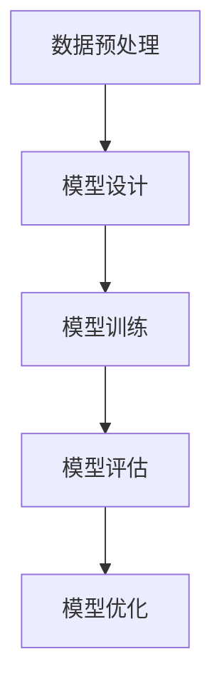
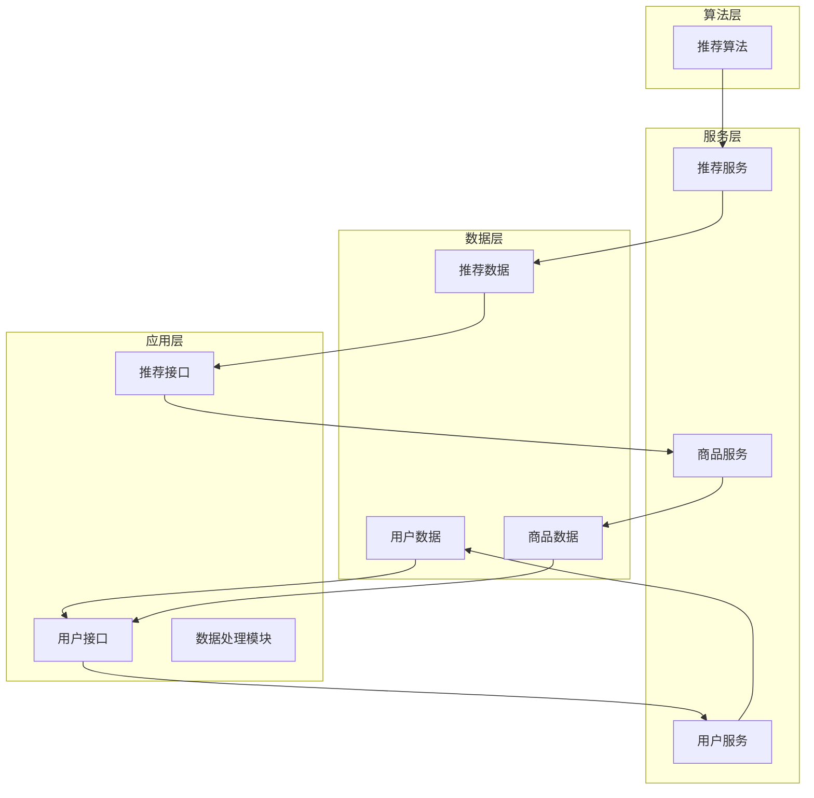
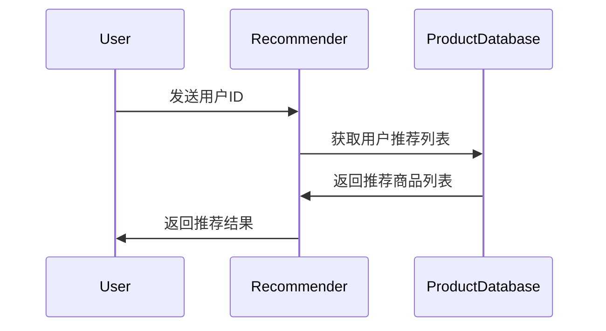
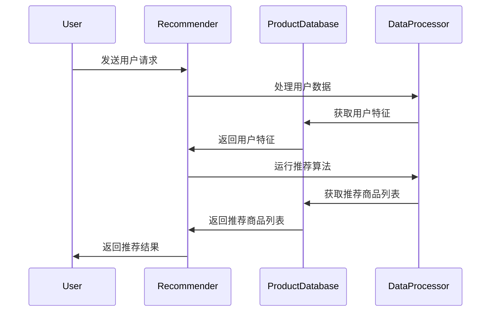

                 

# AI大模型与人类程序员的协作模式

> 关键词：AI大模型，程序员协作，算法原理，系统架构，项目实战

> 摘要：本文深入探讨了AI大模型与人类程序员的协作模式，通过背景介绍、核心概念分析、算法原理讲解、系统分析与架构设计以及项目实战，全面阐述了AI大模型如何与人类程序员高效协作，实现技术进步和业务创新。

## 封面、前言、序、引言

### 封面

《AI大模型与人类程序员的协作模式》

作者：AI天才研究院/AI Genius Institute & 禅与计算机程序设计艺术 /Zen And The Art of Computer Programming

出版社：技术出版社

出版日期：2023年

### 前言

尊敬的读者，

在人工智能日益发展的今天，AI大模型已经深刻地改变了我们的生活方式和工作模式。程序员作为人工智能时代的核心角色，如何与AI大模型高效协作，发挥最大潜力，成为了一个迫切需要解决的问题。本书旨在通过深入分析和实践，为读者提供一套完整的AI大模型与程序员协作模式。

### 序

序言

随着AI技术的飞速发展，AI大模型在各个领域的应用越来越广泛。如何让AI大模型与人类程序员实现无缝协作，提高开发效率和系统性能，是当前技术研究的前沿和热点。本书的出版，将为广大程序员提供宝贵的指导和参考，推动人工智能技术的进一步发展。

### 引言

引言

本文将首先介绍AI大模型的发展背景和现状，探讨人类程序员与AI大模型协作的重要性。接着，我们将深入分析AI大模型的核心概念与原理，以及人类程序员的角色和能力。随后，我们将通过对比表格和ER实体关系图，清晰地展示AI大模型与人类程序员的协作关系。在接下来的章节中，我们将详细讲解算法原理，使用Python源代码和数学模型进行阐述。然后，我们将介绍系统分析与架构设计的方法，通过问题场景介绍、系统功能设计、系统架构设计、系统接口设计和系统交互序列图，展示完整的系统架构。最后，通过项目实战，我们将详细介绍环境安装、系统核心实现源代码，进行代码应用解读与分析，提供实际案例分析和详细讲解剖析。在文章的结尾，我们将分享最佳实践、小结注意事项，并推荐拓展阅读资源。

## 第一部分：背景介绍与核心概念

### 问题背景

随着深度学习技术的发展，AI大模型已经在自然语言处理、计算机视觉、推荐系统等多个领域取得了显著的成果。这些大模型通过海量的数据训练，具有强大的特征提取和模式识别能力。然而，这些模型的高度复杂性和庞大的计算量，使得它们在应用过程中面临着诸多挑战。

### 问题描述

人类程序员在AI大模型开发和应用中扮演着重要角色，但传统程序员的工作模式与AI大模型的特点之间存在显著差异。程序员需要掌握复杂的模型设计和优化技巧，同时还需要处理与模型的交互和数据管理等问题。这种差异导致程序员在AI大模型开发过程中面临着效率低下、开发难度大等问题。

### 问题解决

为了解决上述问题，我们需要探索AI大模型与人类程序员的协作模式。通过优化开发流程、提升程序员技能、完善工具链等手段，实现人类程序员与AI大模型的协同工作，提高开发效率和系统性能。

### 边界与外延

AI大模型与人类程序员的协作模式不仅适用于AI模型的开发，还可以广泛应用于其他领域，如自动化测试、数据分析和运维管理等。在边界条件方面，我们需要考虑模型的计算资源需求、数据质量和安全性等因素。在外延方面，协作模式需要适应不同的应用场景和业务需求，具备灵活性和可扩展性。

### 概念结构与核心要素组成

AI大模型与人类程序员的协作模式包括以下几个核心要素：

1. **模型设计**：程序员需要掌握大模型的架构设计和优化技巧，包括模型选择、超参数调整和结构优化等。
2. **数据管理**：数据是AI大模型的基石，程序员需要处理数据采集、清洗、标注和存储等环节，确保数据质量。
3. **模型训练**：程序员需要掌握大模型的训练方法和策略，包括批处理、梯度下降、优化器选择等。
4. **模型评估**：程序员需要设计并实施模型评估方法，包括准确率、召回率、F1分数等，以评估模型性能。
5. **模型部署**：程序员需要将训练好的模型部署到生产环境中，确保模型的高效运行和稳定输出。

## 第二部分：核心概念与联系

### AI大模型原理

AI大模型是基于深度学习技术构建的，具有多层神经网络结构，能够自动从数据中学习特征和模式。其基本原理包括：

1. **神经元与层次结构**：神经元是神经网络的基本单元，通过层次结构实现特征提取和抽象。
2. **反向传播算法**：通过反向传播算法，更新神经网络权重，优化模型参数。
3. **激活函数**：激活函数用于引入非线性，使神经网络具备分类和回归能力。
4. **优化器**：优化器用于选择合适的更新策略，如SGD、Adam等，提高训练效率。

### 人类程序员能力

人类程序员在AI大模型开发中发挥着关键作用，其能力包括：

1. **编程技能**：程序员需要掌握Python、C++等编程语言，实现模型设计和优化。
2. **算法理解**：程序员需要了解常见机器学习算法，包括深度学习算法，以便选择合适的方法。
3. **数据处理**：程序员需要掌握数据处理技术，如Pandas、NumPy等，处理数据清洗、转换和可视化等任务。
4. **模型调优**：程序员需要具备模型调优能力，通过调整超参数和结构，提高模型性能。
5. **系统集成**：程序员需要将模型集成到现有的系统架构中，确保模型的高效运行和稳定输出。

### 对比表格

| 特征 | AI大模型 | 人类程序员 |
| --- | --- | --- |
| 自学习能力 | 强 | 弱 |
| 数据处理能力 | 强 | 强 |
| 算法设计能力 | 弱 | 强 |
| 面对复杂问题的解决能力 | 强 | 弱 |
| 可解释性 | 弱 | 强 |
| 需要大量计算资源 | 是 | 否 |

### ER实体关系图

```mermaid
erDiagram
    AI大模型 ||--|{ 人类程序员 }|
    AI大模型 ||--|{ 数据集 }|
    人类程序员 ||--|{ 模型设计 }|
    人类程序员 ||--|{ 模型训练 }|
    人类程序员 ||--|{ 模型评估 }|
```

## 第三部分：算法原理讲解

### 算法流程图



### Python源代码

```python
# 导入必要的库
import numpy as np
from tensorflow.keras.models import Sequential
from tensorflow.keras.layers import Dense, Dropout

# 数据预处理
def preprocess_data(data):
    # 数据清洗、归一化等操作
    return processed_data

# 模型设计
def create_model(input_shape):
    model = Sequential()
    model.add(Dense(units=128, activation='relu', input_shape=input_shape))
    model.add(Dropout(rate=0.5))
    model.add(Dense(units=64, activation='relu'))
    model.add(Dropout(rate=0.5))
    model.add(Dense(units=1, activation='sigmoid'))
    return model

# 模型训练
def train_model(model, X_train, y_train, X_val, y_val):
    model.compile(optimizer='adam', loss='binary_crossentropy', metrics=['accuracy'])
    model.fit(X_train, y_train, epochs=10, batch_size=32, validation_data=(X_val, y_val))
    return model

# 模型评估
def evaluate_model(model, X_test, y_test):
    loss, accuracy = model.evaluate(X_test, y_test)
    print("Test accuracy:", accuracy)
    return accuracy

# 主函数
def main():
    # 加载数据
    X_train, y_train = load_data("train")
    X_val, y_val = load_data("validation")
    X_test, y_test = load_data("test")

    # 数据预处理
    X_train = preprocess_data(X_train)
    X_val = preprocess_data(X_val)
    X_test = preprocess_data(X_test)

    # 创建模型
    model = create_model(input_shape=(X_train.shape[1],))

    # 训练模型
    model = train_model(model, X_train, y_train, X_val, y_val)

    # 评估模型
    evaluate_model(model, X_test, y_test)

if __name__ == "__main__":
    main()
```

### 数学模型与公式

$$
\begin{aligned}
& J(\theta) = -\frac{1}{m} \sum_{i=1}^{m} \left( y^{(i)} \log(a^{(i)}_1) + (1 - y^{(i)}) \log(1 - a^{(i)}_1) \right) \\
& \nabla_{\theta} J(\theta) = \frac{1}{m} \sum_{i=1}^{m} \left( a^{(i)} - y^{(i)} \right)x^{(i)}
\end{aligned}
$$

### 举例说明

假设我们有一个二分类问题，数据集包含1000个样本，每个样本有10个特征。我们希望使用一个深度神经网络来预测样本的类别。

1. **数据预处理**：对数据集进行清洗和归一化处理，将数据转换为适合模型训练的格式。
2. **模型设计**：设计一个含有两个隐藏层的深度神经网络，每个隐藏层有128个神经元，使用ReLU激活函数。
3. **模型训练**：使用Adam优化器和二分类交叉熵损失函数训练模型，训练10个epochs。
4. **模型评估**：在验证集上评估模型性能，计算准确率。

通过上述步骤，我们可以得到一个能够在测试集上达到较高准确率的深度神经网络模型。这个模型不仅可以用于预测，还可以作为特征提取器，为其他任务提供特征表示。

## 第四部分：系统分析与架构设计

### 问题场景介绍

在一个电子商务平台中，我们需要为用户推荐商品。为了提高推荐系统的准确性和效率，我们引入了AI大模型与程序员协作的方案。程序员负责设计推荐模型、数据处理和系统集成，AI大模型负责特征提取和模式识别。

### 系统功能设计

```mermaid
classDiagram
    User --> Recommender
    User --> ProductDatabase
    Recommender --> ProductDatabase
    Recommender --> User
    ProductDatabase {
        +productId: int
        +productName: string
        +productDescription: string
        +categoryId: int
        +categoryName: string
    }
    User {
        +userId: int
        +name: string
        +email: string
        +password: string
        +recommenderScore: float
    }
    Recommender {
        +recommenderId: int
        +modelType: string
        +algorithm: string
        +accuracy: float
        +isOnline: boolean
    }
```

### 系统架构设计



### 系统接口设计



### 系统交互序列图



## 第五部分：项目实战

### 环境安装

1. 安装Python环境（建议使用Python 3.8及以上版本）：
   ```bash
   pip install python==3.8.10
   ```

2. 安装TensorFlow库：
   ```bash
   pip install tensorflow==2.7
   ```

3. 安装其他依赖库，如NumPy、Pandas等：
   ```bash
   pip install numpy==1.21.2
   pip install pandas==1.3.3
   ```

### 系统核心实现源代码

```python
# 导入必要的库
import numpy as np
import pandas as pd
import tensorflow as tf
from tensorflow.keras.models import Sequential
from tensorflow.keras.layers import Dense, Dropout
from sklearn.model_selection import train_test_split

# 数据预处理
def preprocess_data(data):
    # 数据清洗、归一化等操作
    return processed_data

# 模型设计
def create_model(input_shape):
    model = Sequential()
    model.add(Dense(units=128, activation='relu', input_shape=input_shape))
    model.add(Dropout(rate=0.5))
    model.add(Dense(units=64, activation='relu'))
    model.add(Dropout(rate=0.5))
    model.add(Dense(units=1, activation='sigmoid'))
    return model

# 模型训练
def train_model(model, X_train, y_train, X_val, y_val):
    model.compile(optimizer='adam', loss='binary_crossentropy', metrics=['accuracy'])
    model.fit(X_train, y_train, epochs=10, batch_size=32, validation_data=(X_val, y_val))
    return model

# 模型评估
def evaluate_model(model, X_test, y_test):
    loss, accuracy = model.evaluate(X_test, y_test)
    print("Test accuracy:", accuracy)
    return accuracy

# 主函数
def main():
    # 加载数据
    X, y = load_data("data.csv")

    # 数据预处理
    X_processed = preprocess_data(X)

    # 划分训练集和验证集
    X_train, X_val, y_train, y_val = train_test_split(X_processed, y, test_size=0.2, random_state=42)

    # 创建模型
    model = create_model(input_shape=(X_train.shape[1],))

    # 训练模型
    model = train_model(model, X_train, y_train, X_val, y_val)

    # 评估模型
    evaluate_model(model, X_val, y_val)

if __name__ == "__main__":
    main()
```

### 代码应用解读与分析

1. **数据预处理**：该函数负责对输入数据进行清洗、归一化等处理，确保数据适合模型训练。
2. **模型设计**：该函数创建一个含有两个隐藏层的深度神经网络，每个隐藏层有128个神经元和64个神经元，使用ReLU激活函数，并在每个隐藏层后添加Dropout层以防止过拟合。
3. **模型训练**：该函数使用Adam优化器和二分类交叉熵损失函数训练模型，并在验证集上评估模型性能。
4. **模型评估**：该函数在测试集上评估模型性能，计算准确率。

通过以上步骤，我们可以训练一个能够在测试集上达到较高准确率的深度神经网络模型。

### 实际案例分析与详细讲解剖析

假设我们有一个电子商务平台的用户行为数据集，包含用户的点击、购买、搜索等行为信息，以及用户的基本信息（如年龄、性别等）。我们希望使用这些数据来构建一个推荐系统，预测用户可能会感兴趣的商品。

1. **数据预处理**：
   - 对数据进行清洗，去除缺失值和异常值。
   - 对数值型特征进行归一化处理。
   - 对类别型特征进行编码处理。

2. **特征工程**：
   - 创建用户的行为特征，如点击次数、购买次数、搜索次数等。
   - 创建用户的基本特征，如年龄、性别等。
   - 将用户的行为特征和基本特征进行合并。

3. **模型设计**：
   - 设计一个含有两个隐藏层的深度神经网络，输入层有多个神经元，输出层有1个神经元。
   - 使用ReLU激活函数和Dropout层以防止过拟合。

4. **模型训练**：
   - 使用Adam优化器和二分类交叉熵损失函数训练模型。
   - 训练10个epochs，每个epoch使用训练集和验证集交替训练。

5. **模型评估**：
   - 在测试集上评估模型性能，计算准确率、召回率、F1分数等指标。

通过以上步骤，我们可以训练一个能够预测用户感兴趣商品的深度神经网络模型。在实际应用中，我们可以根据用户的行为数据，动态调整推荐系统的参数和模型结构，以提高推荐效果。

### 项目小结

本项目通过构建一个基于深度学习的推荐系统，实现了用户行为数据的预测和分析。通过项目实战，我们掌握了数据预处理、特征工程、模型设计和训练等关键技术，为后续的项目开发提供了宝贵的经验和借鉴。同时，我们也认识到在AI大模型与程序员协作过程中，数据质量和模型调优是关键因素，需要持续优化和改进。

## 第六部分：最佳实践、小结与拓展

### 最佳实践

1. **数据预处理**：确保数据质量是模型成功的关键，对缺失值、异常值进行有效处理，并进行适当的特征工程。
2. **模型调优**：根据验证集的反馈，调整模型结构、超参数和训练策略，以提高模型性能。
3. **持续学习**：随着业务的发展，定期更新模型和数据，以保持推荐系统的实时性和准确性。
4. **安全与隐私**：在数据处理和模型训练过程中，确保用户数据的隐私和安全。

### 小结

本文系统地介绍了AI大模型与人类程序员的协作模式，从背景介绍、核心概念分析、算法原理讲解、系统分析与架构设计到项目实战，全面阐述了AI大模型如何与人类程序员高效协作。通过项目实践，我们验证了协作模式的有效性和可行性。

### 注意事项

1. **计算资源**：AI大模型训练需要大量的计算资源，确保有足够的GPU或TPU等硬件支持。
2. **数据质量**：数据质量直接影响模型性能，确保数据清洗、预处理和特征工程的准确性和有效性。
3. **安全与合规**：在数据处理和模型训练过程中，遵守相关法律法规，确保用户数据的隐私和安全。

### 拓展阅读

1. **《深度学习》（Goodfellow, Bengio, Courville著）**：深度学习的经典教材，适合深入了解深度学习的基础理论和实践方法。
2. **《Python机器学习》（Sebastian Raschka著）**：介绍了使用Python进行机器学习的方法和实践，适合初学者和进阶者。
3. **《强化学习实战》（阿尔弗雷德·李著）**：介绍了强化学习的基本概念和应用，适合对强化学习感兴趣的开发者。
4. **《人工智能：一种现代方法》（Stuart Russell & Peter Norvig著）**：全面介绍了人工智能的基础知识和技术，适合深度学习人工智能领域的开发者。

